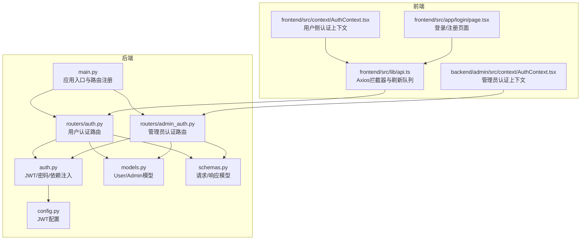
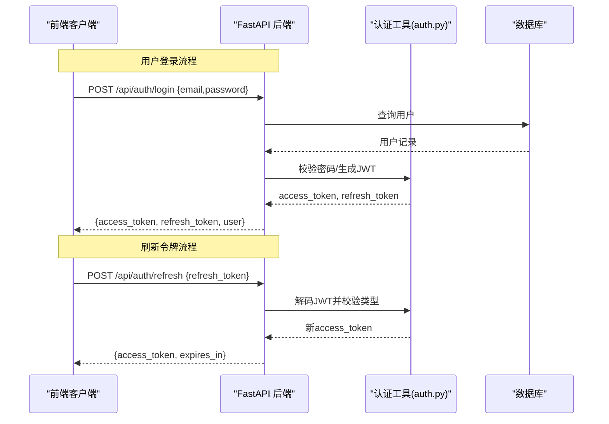
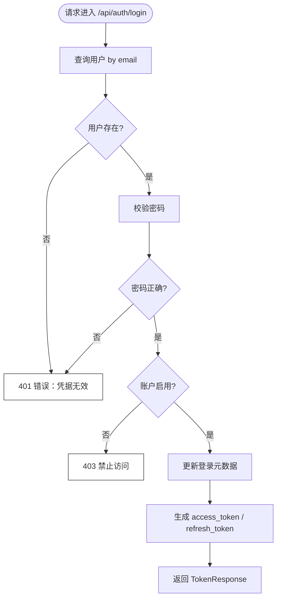
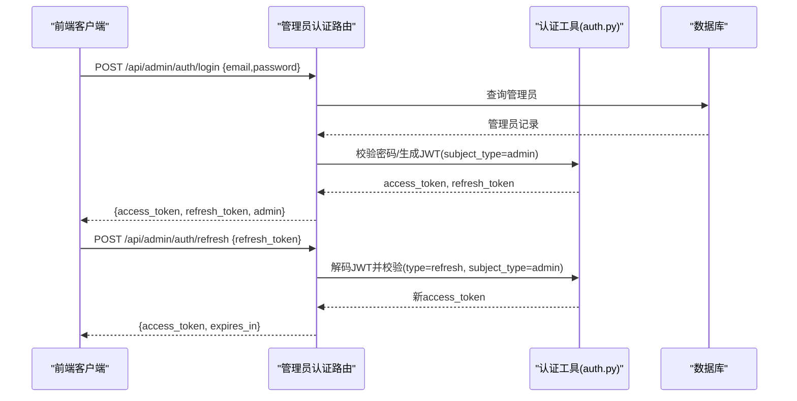
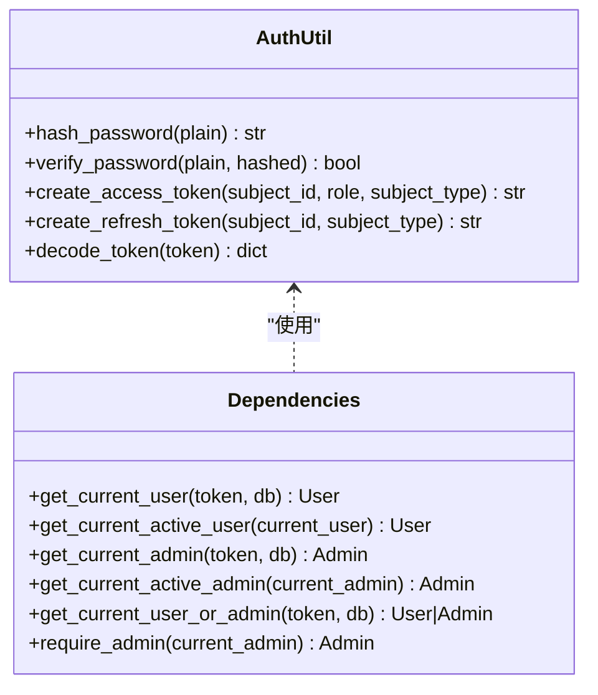
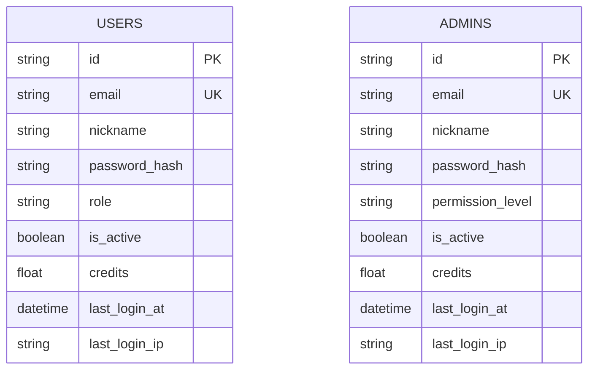
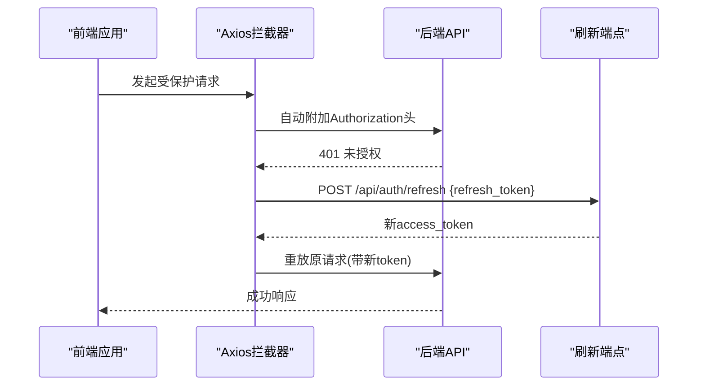
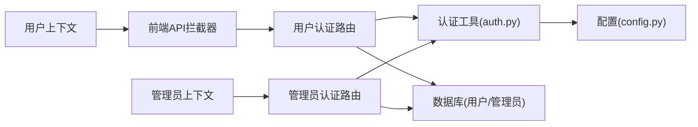

# 认证路由

<cite>
**本文引用的文件**
- [backend/routers/auth.py](file://backend/routers/auth.py)
- [backend/routers/admin_auth.py](file://backend/routers/admin_auth.py)
- [backend/auth.py](file://backend/auth.py)
- [backend/main.py](file://backend/main.py)
- [backend/config.py](file://backend/config.py)
- [backend/models.py](file://backend/models.py)
- [backend/schemas.py](file://backend/schemas.py)
- [frontend/src/context/AuthContext.tsx](file://frontend/src/context/AuthContext.tsx)
- [frontend/src/lib/api.ts](file://frontend/src/lib/api.ts)
- [frontend/src/app/login/page.tsx](file://frontend/src/app/login/page.tsx)
- [backend/admin/src/context/AuthContext.tsx](file://backend/admin/src/context/AuthContext.tsx)
</cite>

## 目录
1. [简介](#简介)
2. [项目结构](#项目结构)
3. [核心组件](#核心组件)
4. [架构总览](#架构总览)
5. [详细组件分析](#详细组件分析)
6. [依赖关系分析](#依赖关系分析)
7. [性能考量](#性能考量)
8. [故障排查指南](#故障排查指南)
9. [结论](#结论)
10. [附录](#附录)

## 简介
本文件系统性梳理认证路由模块的设计与实现，覆盖用户认证与管理员认证两条并行链路，包括：
- JWT 令牌生成、验证与刷新流程
- 登录、注册、刷新、查询当前用户等端点的请求参数、响应格式与安全策略
- 权限验证装饰器的使用方式与差异（用户权限 vs 管理员权限）
- 完整的 API 调用示例与错误处理
- 安全最佳实践与常见问题解决方案

## 项目结构
认证相关代码主要分布在后端路由层、认证工具层、数据模型与序列化层，并由前端上下文与拦截器配合完成令牌持久化与自动刷新。

**图表来源**
- [backend/main.py:138-152](file://backend/main.py#L138-L152)
- [backend/routers/auth.py:30-33](file://backend/routers/auth.py#L30-L33)
- [backend/routers/admin_auth.py:29-33](file://backend/routers/admin_auth.py#L29-L33)
- [backend/auth.py:119-156](file://backend/auth.py#L119-L156)
- [backend/config.py:26-30](file://backend/config.py#L26-L30)
- [frontend/src/lib/api.ts:8-81](file://frontend/src/lib/api.ts#L8-L81)
- [frontend/src/context/AuthContext.tsx:52-109](file://frontend/src/context/AuthContext.tsx#L52-L109)
- [frontend/src/app/login/page.tsx:12-50](file://frontend/src/app/login/page.tsx#L12-L50)
- [backend/admin/src/context/AuthContext.tsx:39-116](file://backend/admin/src/context/AuthContext.tsx#L39-L116)

**章节来源**
- [backend/main.py:138-152](file://backend/main.py#L138-L152)
- [backend/routers/auth.py:30-33](file://backend/routers/auth.py#L30-L33)
- [backend/routers/admin_auth.py:29-33](file://backend/routers/admin_auth.py#L29-L33)

## 核心组件
- 用户认证路由：负责用户注册、登录、刷新令牌与查询当前用户信息
- 管理员认证路由：负责管理员登录、刷新令牌与查询当前管理员信息
- 认证工具层：提供密码哈希/校验、JWT 编解码、访问令牌与刷新令牌生成、FastAPI 依赖注入（用户/管理员/通用）
- 配置层：JWT 密钥、算法、过期时间等
- 数据模型与序列化：User/Admin 模型与认证相关的 Pydantic 序列化模型
- 前端上下文与拦截器：本地存储令牌、自动附加 Authorization 头、401 时刷新令牌

**章节来源**
- [backend/routers/auth.py:36-136](file://backend/routers/auth.py#L36-L136)
- [backend/routers/admin_auth.py:36-136](file://backend/routers/admin_auth.py#L36-L136)
- [backend/auth.py:19-229](file://backend/auth.py#L19-L229)
- [backend/config.py:26-30](file://backend/config.py#L26-L30)
- [backend/models.py:10-33](file://backend/models.py#L10-L33)
- [backend/models.py:35-73](file://backend/models.py#L35-L73)
- [backend/schemas.py:13-63](file://backend/schemas.py#L13-L63)
- [backend/schemas.py:68-111](file://backend/schemas.py#L68-L111)
- [frontend/src/lib/api.ts:8-81](file://frontend/src/lib/api.ts#L8-L81)
- [frontend/src/context/AuthContext.tsx:52-109](file://frontend/src/context/AuthContext.tsx#L52-L109)
- [frontend/src/app/login/page.tsx:12-50](file://frontend/src/app/login/page.tsx#L12-L50)
- [backend/admin/src/context/AuthContext.tsx:39-116](file://backend/admin/src/context/AuthContext.tsx#L39-L116)

## 架构总览
用户与管理员采用双轨认证体系：
- 用户认证：使用独立的用户表，JWT 中携带 subject_type=user
- 管理员认证：使用独立的管理员表，JWT 中携带 subject_type=admin
- 通用依赖：支持根据 subject_type 自动判定查询用户或管理员表

**图表来源**
- [backend/routers/auth.py:63-99](file://backend/routers/auth.py#L63-L99)
- [backend/routers/auth.py:102-129](file://backend/routers/auth.py#L102-L129)
- [backend/auth.py:30-62](file://backend/auth.py#L30-L62)
- [backend/auth.py:65-74](file://backend/auth.py#L65-L74)

## 详细组件分析

### 用户认证路由
- 路由前缀：/api/auth
- 关键端点：
  - POST /api/auth/register：注册新用户
  - POST /api/auth/login：邮箱+密码登录，返回 JWT 与用户信息
  - POST /api/auth/refresh：使用 refresh_token 获取新的 access_token
  - GET /api/auth/me：返回当前登录用户信息

**图表来源**
- [backend/routers/auth.py:63-99](file://backend/routers/auth.py#L63-L99)

**章节来源**
- [backend/routers/auth.py:36-136](file://backend/routers/auth.py#L36-L136)
- [backend/schemas.py:13-63](file://backend/schemas.py#L13-L63)

### 管理员认证路由
- 路由前缀：/api/admin/auth
- 关键端点：
  - POST /api/admin/auth/login：管理员登录
  - POST /api/admin/auth/refresh：管理员刷新 access_token
  - GET /api/admin/auth/me：返回当前管理员信息

**图表来源**
- [backend/routers/admin_auth.py:36-90](file://backend/routers/admin_auth.py#L36-L90)
- [backend/routers/admin_auth.py:93-127](file://backend/routers/admin_auth.py#L93-L127)
- [backend/auth.py:119-156](file://backend/auth.py#L119-L156)

**章节来源**
- [backend/routers/admin_auth.py:36-136](file://backend/routers/admin_auth.py#L36-L136)
- [backend/schemas.py:68-111](file://backend/schemas.py#L68-L111)

### 认证工具层（JWT/依赖注入）
- 密码处理：bcrypt 哈希与校验
- JWT 生成：
  - access_token：包含 sub、role、subject_type、type=access、exp
  - refresh_token：包含 sub、subject_type、type=refresh、exp
- 令牌解码：统一异常处理（无效/过期）
- FastAPI 依赖：
  - get_current_user/get_current_active_user：校验 access_token 并确保账户启用
  - get_current_admin/get_current_active_admin：校验管理员 access_token 并确保账户启用
  - get_current_user_or_admin：通用依赖，依据 subject_type 决定查询用户或管理员
  - require_admin：管理员权限验证装饰器

**图表来源**
- [backend/auth.py:19-74](file://backend/auth.py#L19-L74)
- [backend/auth.py:83-156](file://backend/auth.py#L83-L156)
- [backend/auth.py:162-210](file://backend/auth.py#L162-L210)

**章节来源**
- [backend/auth.py:19-229](file://backend/auth.py#L19-L229)

### 数据模型与序列化
- 用户模型：users 表，包含邮箱、昵称、密码哈希、角色、启用状态、积分、登录元数据等
- 管理员模型：admins 表，包含邮箱、昵称、密码哈希、权限等级、启用状态、登录元数据等
- 认证相关 Pydantic 模型：UserRegister、UserLogin、TokenRefresh、TokenResponse、AccessTokenResponse、UserResponse；AdminLogin、AdminTokenResponse、AdminResponse

**图表来源**
- [backend/models.py:10-33](file://backend/models.py#L10-L33)
- [backend/models.py:35-73](file://backend/models.py#L35-L73)

**章节来源**
- [backend/models.py:10-33](file://backend/models.py#L10-L33)
- [backend/models.py:35-73](file://backend/models.py#L35-L73)
- [backend/schemas.py:13-63](file://backend/schemas.py#L13-L63)
- [backend/schemas.py:68-111](file://backend/schemas.py#L68-L111)

### 前端集成与自动刷新
- Axios 拦截器：统一附加 Authorization: Bearer 头
- 401 自动刷新：当收到 401 且非认证路由时，使用 refresh_token 请求新 access_token，并重放原请求
- 用户上下文：登录成功后将 access_token、refresh_token、用户信息写入 localStorage
- 管理员上下文：启动时调用 /api/admin/auth/me 校验令牌有效性，失效则清空并跳转登录页

**图表来源**
- [frontend/src/lib/api.ts:8-81](file://frontend/src/lib/api.ts#L8-L81)
- [frontend/src/context/AuthContext.tsx:52-109](file://frontend/src/context/AuthContext.tsx#L52-L109)
- [frontend/src/app/login/page.tsx:12-50](file://frontend/src/app/login/page.tsx#L12-L50)
- [backend/admin/src/context/AuthContext.tsx:39-116](file://backend/admin/src/context/AuthContext.tsx#L39-L116)

**章节来源**
- [frontend/src/lib/api.ts:8-81](file://frontend/src/lib/api.ts#L8-L81)
- [frontend/src/context/AuthContext.tsx:52-109](file://frontend/src/context/AuthContext.tsx#L52-L109)
- [frontend/src/app/login/page.tsx:12-50](file://frontend/src/app/login/page.tsx#L12-L50)
- [backend/admin/src/context/AuthContext.tsx:39-116](file://backend/admin/src/context/AuthContext.tsx#L39-L116)

## 依赖关系分析
- 路由依赖认证工具层生成/解析 JWT，并通过数据库依赖查询用户/管理员
- 配置层集中管理 JWT 密钥、算法与过期时间
- 前端通过拦截器与上下文实现透明的认证与刷新

**图表来源**
- [backend/routers/auth.py:8-26](file://backend/routers/auth.py#L8-L26)
- [backend/routers/admin_auth.py:9-25](file://backend/routers/admin_auth.py#L9-L25)
- [backend/auth.py:11-12](file://backend/auth.py#L11-L12)
- [backend/config.py:26-30](file://backend/config.py#L26-L30)
- [frontend/src/lib/api.ts:8-17](file://frontend/src/lib/api.ts#L8-L17)
- [frontend/src/context/AuthContext.tsx:52-109](file://frontend/src/context/AuthContext.tsx#L52-L109)
- [backend/admin/src/context/AuthContext.tsx:39-116](file://backend/admin/src/context/AuthContext.tsx#L39-L116)

**章节来源**
- [backend/routers/auth.py:8-26](file://backend/routers/auth.py#L8-L26)
- [backend/routers/admin_auth.py:9-25](file://backend/routers/admin_auth.py#L9-L25)
- [backend/auth.py:11-12](file://backend/auth.py#L11-L12)
- [backend/config.py:26-30](file://backend/config.py#L26-L30)
- [frontend/src/lib/api.ts:8-17](file://frontend/src/lib/api.ts#L8-L17)
- [frontend/src/context/AuthContext.tsx:52-109](file://frontend/src/context/AuthContext.tsx#L52-L109)
- [backend/admin/src/context/AuthContext.tsx:39-116](file://backend/admin/src/context/AuthContext.tsx#L39-L116)

## 性能考量
- JWT 过期时间：ACCESS_TOKEN_EXPIRE_MINUTES 默认较短，减少长期有效令牌的风险
- 刷新令牌：REFRESH_TOKEN_EXPIRE_DAYS 较长，降低频繁登录成本
- 密码哈希轮数：bcrypt 轮数适中，兼顾安全性与性能
- 数据库查询：登录与刷新均只做必要字段查询，避免 N+1

[本节为通用建议，无需特定文件引用]

## 故障排查指南
- 401 未授权
  - 检查 Authorization 头是否正确附加
  - 检查 access_token 是否过期或被篡改
  - 若为刷新流程，确认 refresh_token 类型为 refresh 且 subject_type 正确
- 403 禁止访问
  - 用户/管理员账户被禁用
- 409 冲突（注册）
  - 邮箱已被注册
- 刷新失败
  - 前端拦截器会自动尝试刷新，若仍失败需重新登录
- 管理员上下文校验失败
  - 清除本地存储的令牌与用户信息，重新登录

**章节来源**
- [backend/routers/auth.py:46-49](file://backend/routers/auth.py#L46-L49)
- [backend/routers/auth.py:72-83](file://backend/routers/auth.py#L72-L83)
- [backend/routers/admin_auth.py:51-71](file://backend/routers/admin_auth.py#L51-L71)
- [backend/auth.py:65-74](file://backend/auth.py#L65-L74)
- [frontend/src/lib/api.ts:31-81](file://frontend/src/lib/api.ts#L31-L81)
- [backend/admin/src/context/AuthContext.tsx:67-74](file://backend/admin/src/context/AuthContext.tsx#L67-L74)

## 结论
本认证路由模块通过清晰的双轨设计实现了用户与管理员的独立认证与权限控制，结合前端拦截器与上下文，提供了良好的用户体验与安全性。建议在生产环境替换默认密钥、启用 HTTPS、严格限制 CORS，并定期审计令牌策略与日志。

[本节为总结，无需特定文件引用]

## 附录

### API 端点一览与示例

- 用户注册
  - 方法与路径：POST /api/auth/register
  - 请求体：UserRegister（邮箱、昵称、密码）
  - 响应体：UserResponse（用户信息）
  - 示例：见“章节来源”中的注册端点定义
  - 错误：409 邮箱已注册

- 用户登录
  - 方法与路径：POST /api/auth/login
  - 请求体：UserLogin（邮箱、密码）
  - 响应体：TokenResponse（access_token、refresh_token、expires_in、user）
  - 示例：见“章节来源”中的登录端点定义
  - 错误：401 凭据无效；403 账户禁用

- 用户刷新令牌
  - 方法与路径：POST /api/auth/refresh
  - 请求体：TokenRefresh（refresh_token）
  - 响应体：AccessTokenResponse（access_token、expires_in）
  - 示例：见“章节来源”中的刷新端点定义
  - 错误：401 令牌无效或类型不符；401 用户不存在或禁用

- 查询当前用户
  - 方法与路径：GET /api/auth/me
  - 响应体：UserResponse
  - 示例：见“章节来源”中的 me 端点定义
  - 错误：401/403 未授权或账户禁用

- 管理员登录
  - 方法与路径：POST /api/admin/auth/login
  - 请求体：AdminLogin（邮箱、密码）
  - 响应体：AdminTokenResponse（access_token、refresh_token、expires_in、admin）
  - 示例：见“章节来源”中的管理员登录端点定义
  - 错误：401 凭据无效；403 账户禁用

- 管理员刷新令牌
  - 方法与路径：POST /api/admin/auth/refresh
  - 请求体：TokenRefresh（refresh_token）
  - 响应体：AccessTokenResponse（access_token、expires_in）
  - 示例：见“章节来源”中的管理员刷新端点定义
  - 错误：401 令牌无效或类型不符；401 管理员不存在或禁用

- 查询当前管理员
  - 方法与路径：GET /api/admin/auth/me
  - 响应体：AdminResponse
  - 示例：见“章节来源”中的管理员 me 端点定义
  - 错误：401/403 未授权或账户禁用

**章节来源**
- [backend/routers/auth.py:36-136](file://backend/routers/auth.py#L36-L136)
- [backend/routers/admin_auth.py:36-136](file://backend/routers/admin_auth.py#L36-L136)
- [backend/schemas.py:13-63](file://backend/schemas.py#L13-L63)
- [backend/schemas.py:68-111](file://backend/schemas.py#L68-L111)

### 安全最佳实践
- 生产环境必须更换 JWT_SECRET_KEY，使用强随机密钥
- 启用 HTTPS，避免令牌在传输中泄露
- 严格限制 CORS 与缓存策略
- 定期轮换密钥并下线旧密钥
- 对敏感操作增加二次验证或管理员权限校验
- 记录登录与刷新事件，便于审计

[本节为通用建议，无需特定文件引用]