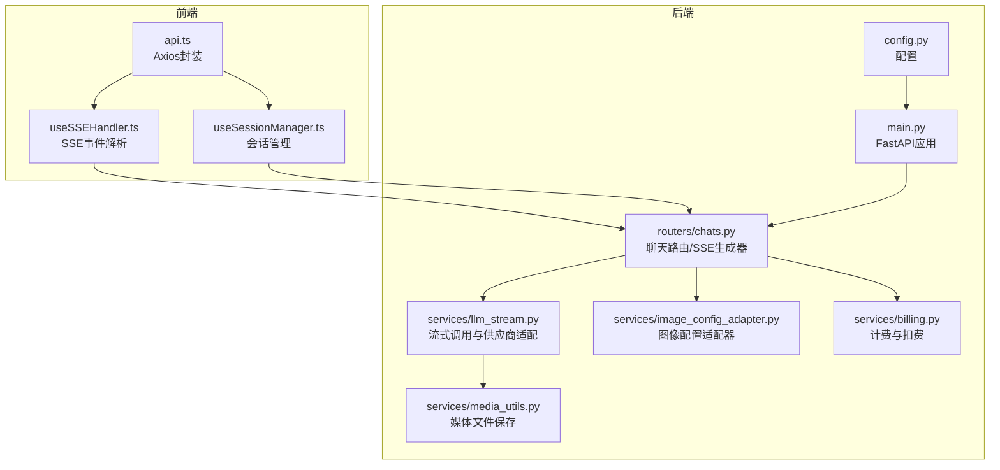
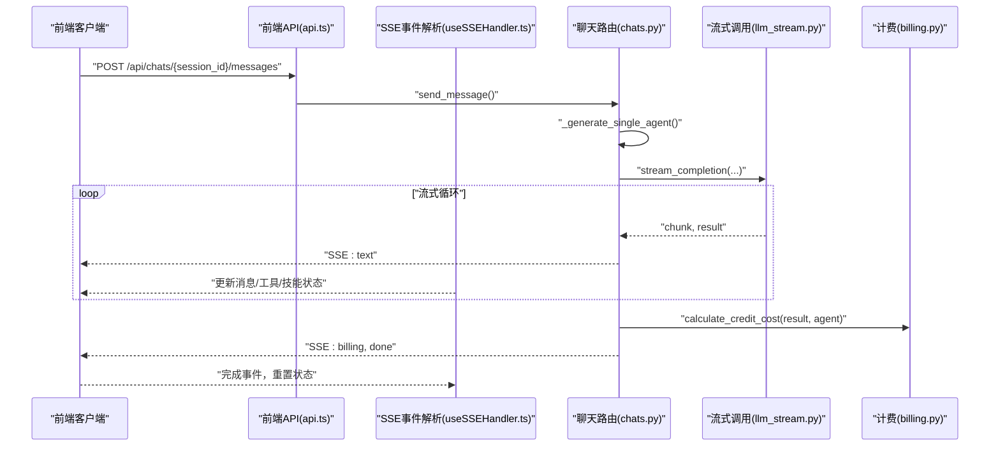
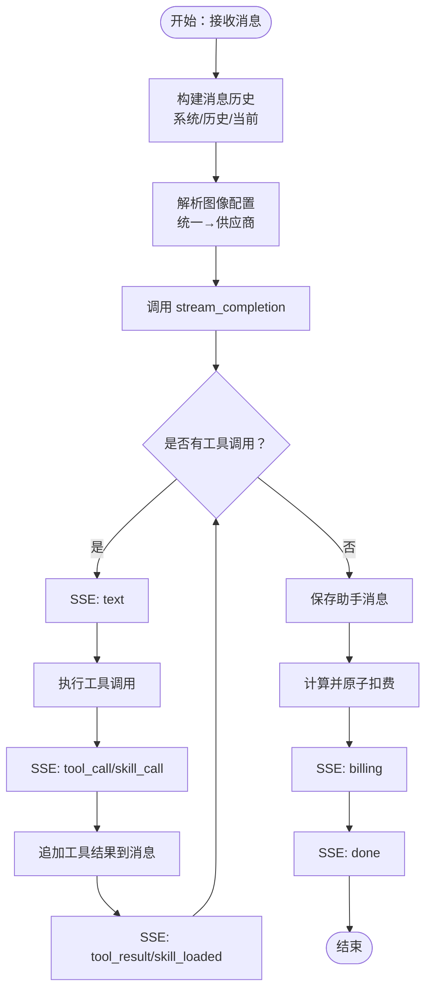
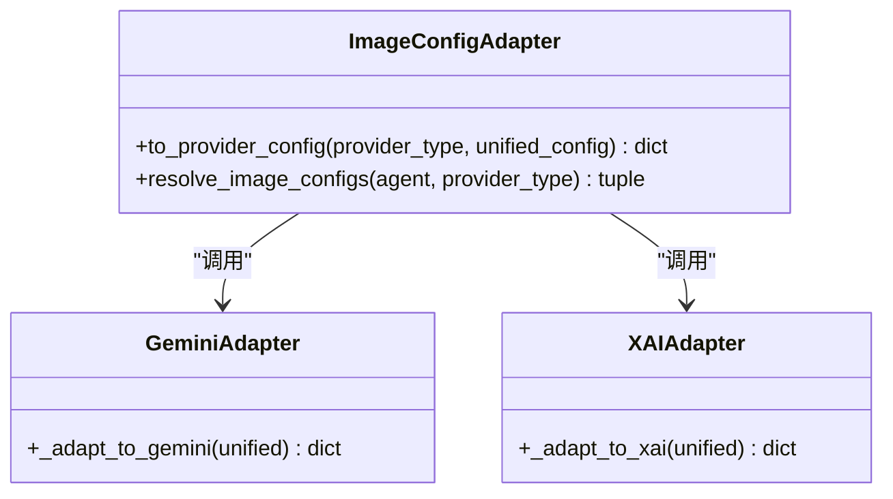
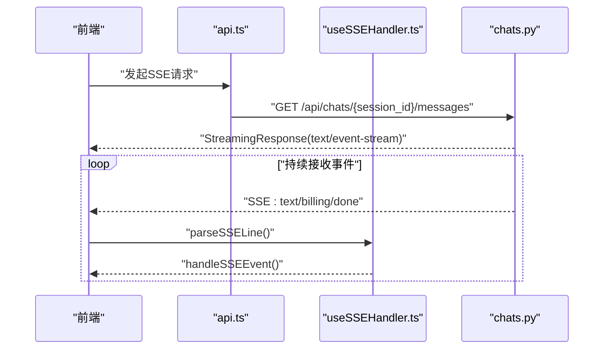
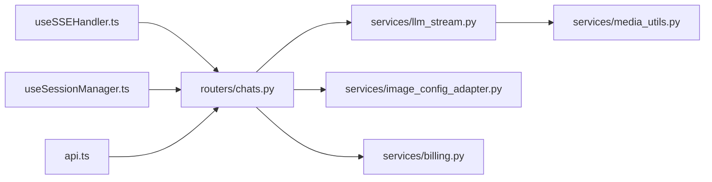

# LLM流式服务

<cite>
**本文档引用的文件**
- [llm_stream.py](file://backend/services/llm_stream.py)
- [image_config_adapter.py](file://backend/services/image_config_adapter.py)
- [useSSEHandler.ts](file://frontend/src/components/ai-assistant/hooks/useSSEHandler.ts)
- [useSessionManager.ts](file://frontend/src/components/ai-assistant/hooks/useSessionManager.ts)
- [chats.py](file://backend/routers/chats.py)
- [main.py](file://backend/main.py)
- [api.ts](file://frontend/src/lib/api.ts)
- [media_utils.py](file://backend/services/media_utils.py)
- [billing.py](file://backend/services/billing.py)
- [config.py](file://backend/config.py)
</cite>

## 目录
1. [简介](#简介)
2. [项目结构](#项目结构)
3. [核心组件](#核心组件)
4. [架构总览](#架构总览)
5. [详细组件分析](#详细组件分析)
6. [依赖关系分析](#依赖关系分析)
7. [性能考量](#性能考量)
8. [故障排查指南](#故障排查指南)
9. [结论](#结论)
10. [附录](#附录)

## 简介
本项目提供了一个完整的LLM流式服务，支持多供应商（OpenAI、Azure、xAI/Grok、Anthropic/MiniMax、DashScope、Google Gemini）统一接入，具备以下能力：
- SSE流式响应：基于Server-Sent Events，逐块推送文本、工具调用、计费信息、多智能体协作状态等事件。
- 图像配置适配器：将统一的图像生成配置转换为不同供应商的特定参数，保证格式标准化与兼容性。
- 实时通信：后端通过FastAPI的StreamingResponse实现SSE；前端通过自定义Hook解析SSE事件并渲染UI。
- 计费与监控：映射表驱动的计费计算，原子化扣费，实时推送计费状态；日志记录关键指标。
- 网络优化与体验：图片生成采用非流式批量响应避免大块数据传输问题；文本模式流式输出思考过程；前端对SSE进行事件聚合与状态管理。

## 项目结构
后端采用FastAPI框架，路由层负责SSE流式输出，服务层封装LLM调用与图像配置适配，前端通过React Hook消费SSE事件并维护会话状态。

图表来源
- [main.py:110-153](file://backend/main.py#L110-L153)
- [chats.py:202-258](file://backend/routers/chats.py#L202-L258)
- [llm_stream.py:920-977](file://backend/services/llm_stream.py#L920-L977)
- [image_config_adapter.py:115-163](file://backend/services/image_config_adapter.py#L115-L163)
- [media_utils.py:20-79](file://backend/services/media_utils.py#L20-L79)
- [billing.py:310-350](file://backend/services/billing.py#L310-L350)
- [api.ts:1-84](file://frontend/src/lib/api.ts#L1-L84)
- [useSSEHandler.ts:24-335](file://frontend/src/components/ai-assistant/hooks/useSSEHandler.ts#L24-L335)
- [useSessionManager.ts:12-179](file://frontend/src/components/ai-assistant/hooks/useSessionManager.ts#L12-L179)

章节来源
- [main.py:110-153](file://backend/main.py#L110-L153)
- [chats.py:202-258](file://backend/routers/chats.py#L202-L258)

## 核心组件
- 流式调用服务：统一入口将供应商类型映射到具体处理器，支持文本与图像两类分支，兼容工具调用与思考模式。
- 图像配置适配器：将统一的图像配置转换为Gemini与xAI的特定参数，避免条件分支，提升可维护性。
- SSE生成器：后端将生成器产出的事件序列化为SSE格式，前端逐条解析并更新UI。
- 计费与监控：映射表驱动的计费计算，原子化扣费，实时推送计费状态与余额。
- 媒体工具：保存内联图片与远程图片，生成本地访问URL，供前端渲染。

章节来源
- [llm_stream.py:920-977](file://backend/services/llm_stream.py#L920-L977)
- [image_config_adapter.py:115-163](file://backend/services/image_config_adapter.py#L115-L163)
- [chats.py:29-31](file://backend/routers/chats.py#L29-L31)
- [billing.py:310-350](file://backend/services/billing.py#L310-L350)
- [media_utils.py:20-79](file://backend/services/media_utils.py#L20-L79)

## 架构总览
整体流程：前端发起消息请求，后端根据智能体配置与工具定义构建消息历史，调用统一流式入口，按供应商类型分发到对应处理器，实时产出SSE事件，前端解析并渲染。

图表来源
- [chats.py:202-258](file://backend/routers/chats.py#L202-L258)
- [chats.py:564-625](file://backend/routers/chats.py#L564-L625)
- [llm_stream.py:920-977](file://backend/services/llm_stream.py#L920-L977)
- [useSSEHandler.ts:24-335](file://frontend/src/components/ai-assistant/hooks/useSSEHandler.ts#L24-L335)
- [billing.py:310-350](file://backend/services/billing.py#L310-L350)

## 详细组件分析

### 流式响应实现机制（SSE、数据分块与缓冲）
- SSE格式：后端将事件类型与数据序列化为“event: …\ndata: …\n\n”形式，前端逐行解析。
- 数据分块：后端按供应商实现逐块产出文本，前端将同轮次的增量拼接到当前AI消息中。
- 缓冲管理：前端使用引用对象维护当前轮次的工具/技能状态，避免重复渲染；后端在工具调用循环中累积结果，最终一次性保存助手消息。
- 思考模式：不同供应商通过前缀标记进入/退出思考阶段，前端据此插入特殊标记以区分思考与输出。
- 图像生成：xAI图像生成采用非流式批量响应，避免大块二进制数据导致的传输问题；Gemini在图片模式下也采用非流式批量响应。

图表来源
- [chats.py:442-762](file://backend/routers/chats.py#L442-L762)
- [llm_stream.py:920-977](file://backend/services/llm_stream.py#L920-L977)

章节来源
- [chats.py:29-31](file://backend/routers/chats.py#L29-L31)
- [chats.py:564-625](file://backend/routers/chats.py#L564-L625)
- [useSSEHandler.ts:63-327](file://frontend/src/components/ai-assistant/hooks/useSSEHandler.ts#L63-L327)

### 图像配置适配器（参数转换、格式标准化与兼容性）
- 统一配置：前端提交统一的图像配置（质量、宽高比、批量数、输出格式等），后端通过适配器转换为供应商特定参数。
- 映射表：使用字典映射供应商支持的参数名与取值范围，避免条件分支，提升可维护性。
- 兼容性处理：不同供应商对参数名称、取值范围、默认行为存在差异，适配器在转换时进行校验与裁剪。
- 示例字段：
  - 质量映射：统一“标准/高清/超清”映射到供应商的分辨率或尺寸。
  - 批量数：不同供应商最大批量不同，适配器进行上限裁剪。
  - 宽高比：供应商支持的宽高比集合不同，适配器进行有效性校验。
  - 输出格式：部分供应商不支持用户指定输出格式，适配器设置默认值。

图表来源
- [image_config_adapter.py:115-163](file://backend/services/image_config_adapter.py#L115-L163)
- [image_config_adapter.py:51-103](file://backend/services/image_config_adapter.py#L51-L103)

章节来源
- [image_config_adapter.py:115-163](file://backend/services/image_config_adapter.py#L115-L163)

### 实时通信架构（SSE、连接池、超时与重连）
- SSE连接：后端使用StreamingResponse返回text/event-stream，设置缓存控制与连接保持头部。
- 前端解析：自定义Hook逐行解析SSE事件，按事件类型更新消息、工具/技能状态、多智能体步骤与计费信息。
- 连接池与超时：后端各供应商SDK默认连接池与超时策略由SDK管理；xAI图像编辑使用httpx异步客户端，设置较长超时以应对大图下载。
- 重连策略：前端未实现自动重连逻辑，建议在业务层根据需要添加；当前实现关注事件聚合与状态恢复。

图表来源
- [chats.py:250-258](file://backend/routers/chats.py#L250-L258)
- [useSSEHandler.ts:52-61](file://frontend/src/components/ai-assistant/hooks/useSSEHandler.ts#L52-L61)
- [useSSEHandler.ts:63-327](file://frontend/src/components/ai-assistant/hooks/useSSEHandler.ts#L63-L327)

章节来源
- [chats.py:250-258](file://backend/routers/chats.py#L250-L258)
- [useSSEHandler.ts:24-335](file://frontend/src/components/ai-assistant/hooks/useSSEHandler.ts#L24-L335)

### 流式处理示例（消息格式、错误处理与性能监控）
- 消息格式：
  - 文本：SSE事件“text”，数据包含增量文本片段。
  - 工具调用：SSE事件“tool_call”或“skill_call”，数据包含工具/技能名称与参数；完成后发送“tool_result”或“skill_loaded”。
  - 多智能体：SSE事件“subtask_created/started/completed/failed”与“task_completed”，携带令牌统计与最终结果。
  - 计费：SSE事件“billing”，包含本次消耗、剩余余额、不足/冻结状态。
  - 结束：SSE事件“done”，前端重置状态。
- 错误处理：后端捕获异常并发送“error”事件；若已有响应内容，则静默结束。
- 性能监控：日志记录输入字符数、令牌统计、思考内容长度、上下文占用比例；计费后推送余额。

章节来源
- [chats.py:310-320](file://backend/routers/chats.py#L310-L320)
- [chats.py:632-641](file://backend/routers/chats.py#L632-L641)
- [useSSEHandler.ts:319-323](file://frontend/src/components/ai-assistant/hooks/useSSEHandler.ts#L319-L323)

### 供应商适配与特性
- OpenAI/Azure/DeepSeek：支持工具调用与usage统计，xAI推理模式通过extra_body注入。
- Anthropic/MiniMax：支持工具调用与“thinking”模式，使用消息流式输出。
- DashScope：流式增量输出，支持usage。
- Gemini：支持文本与图片混合模式，图片模式非流式；支持思考模式与Google Search工具；互斥限制：图片生成与思考模式不可同时启用。
- xAI：图像生成与编辑端点分离；生成模式使用SDK，编辑模式使用httpx直连；支持推理effort参数。

章节来源
- [llm_stream.py:79-146](file://backend/services/llm_stream.py#L79-L146)
- [llm_stream.py:164-243](file://backend/services/llm_stream.py#L164-L243)
- [llm_stream.py:420-448](file://backend/services/llm_stream.py#L420-L448)
- [llm_stream.py:453-522](file://backend/services/llm_stream.py#L453-L522)
- [llm_stream.py:527-555](file://backend/services/llm_stream.py#L527-L555)
- [llm_stream.py:558-563](file://backend/services/llm_stream.py#L558-L563)
- [llm_stream.py:704-915](file://backend/services/llm_stream.py#L704-L915)

## 依赖关系分析
- 后端依赖：FastAPI、SQLAlchemy异步、各供应商SDK（openai、anthropic、dashscope、google.genai）、httpx、logging。
- 前端依赖：React、Axios、自定义Hook与Store。
- 关键耦合点：
  - 路由层依赖流式调用服务与计费服务。
  - 流式调用服务依赖媒体工具与图像配置适配器。
  - 前端SSE解析依赖后端事件约定。

图表来源
- [chats.py:16-24](file://backend/routers/chats.py#L16-L24)
- [llm_stream.py:920-977](file://backend/services/llm_stream.py#L920-L977)
- [image_config_adapter.py:115-163](file://backend/services/image_config_adapter.py#L115-L163)
- [billing.py:310-350](file://backend/services/billing.py#L310-L350)
- [media_utils.py:20-79](file://backend/services/media_utils.py#L20-L79)
- [useSSEHandler.ts:24-335](file://frontend/src/components/ai-assistant/hooks/useSSEHandler.ts#L24-L335)
- [useSessionManager.ts:12-179](file://frontend/src/components/ai-assistant/hooks/useSessionManager.ts#L12-L179)
- [api.ts:1-84](file://frontend/src/lib/api.ts#L1-L84)

章节来源
- [chats.py:16-24](file://backend/routers/chats.py#L16-L24)

## 性能考量
- 图片传输优化：图片生成采用非流式批量响应，避免大块数据导致的传输问题与内存压力。
- 流式输出：文本模式支持流式输出，前端即时渲染，降低感知延迟。
- 计费与统计：映射表驱动的计费计算，避免条件分支带来的性能损耗；日志记录关键指标便于性能分析。
- 超时与重试：供应商SDK默认超时策略；xAI图像编辑设置较长超时；建议在业务层增加重试与熔断策略。
- 并发与原子操作：计费采用原子更新，避免并发冲突导致的数据不一致。

## 故障排查指南
- SSE连接失败：检查CORS配置与Authorization头；确认后端StreamingResponse头部设置正确。
- 工具调用异常：查看“error”事件与后端日志；确认工具定义与参数格式正确。
- 余额不足：前端收到“billing”事件中的不足标志；后端抛出InsufficientCreditsError。
- 图像生成失败：检查xAI端点与鉴权；确认图片URL可访问；查看媒体保存日志。
- 思考模式异常：不同供应商对思考模式支持不同，需根据供应商文档调整参数。

章节来源
- [chats.py:632-641](file://backend/routers/chats.py#L632-L641)
- [billing.py:37-43](file://backend/services/billing.py#L37-L43)
- [billing.py:74-84](file://backend/services/billing.py#L74-L84)
- [media_utils.py:63-79](file://backend/services/media_utils.py#L63-L79)

## 结论
本项目通过统一的流式调用入口与图像配置适配器，实现了多供应商的无缝集成；SSE事件驱动的前端渲染提供了良好的实时交互体验；计费与监控体系保障了资源使用的可控性。建议后续增强前端自动重连与错误恢复机制，进一步优化图片传输与缓存策略，以提升整体性能与用户体验。

## 附录
- 配置项：数据库、Redis、API密钥、JWT、生成模型等集中于配置文件。
- 媒体目录：后端自动创建媒体目录，保存内联与远程图片，提供本地访问URL。
- 计费维度：输入tokens、文本输出tokens、图片输出tokens、搜索查询次数、图像生成数量等。

章节来源
- [config.py:7-43](file://backend/config.py#L7-L43)
- [media_utils.py:8-28](file://backend/services/media_utils.py#L8-L28)
- [billing.py:12-30](file://backend/services/billing.py#L12-L30)