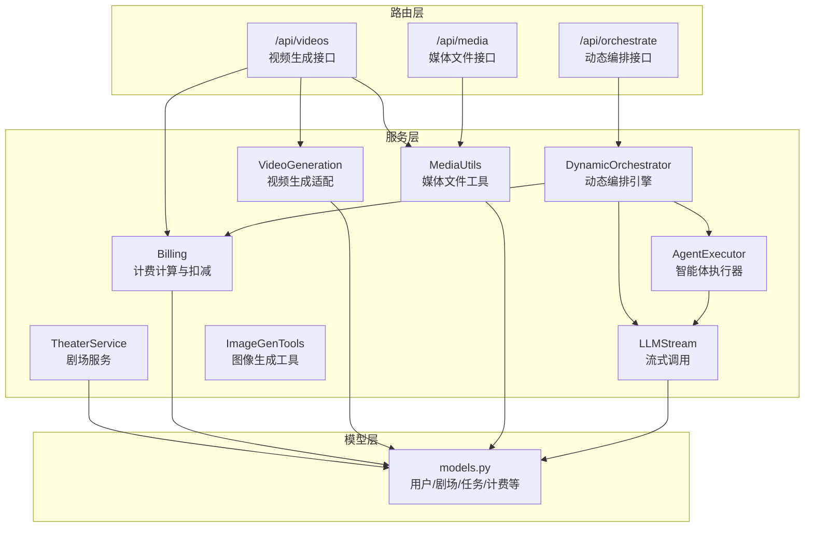
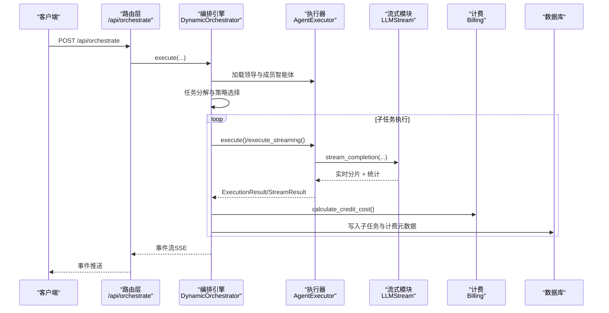
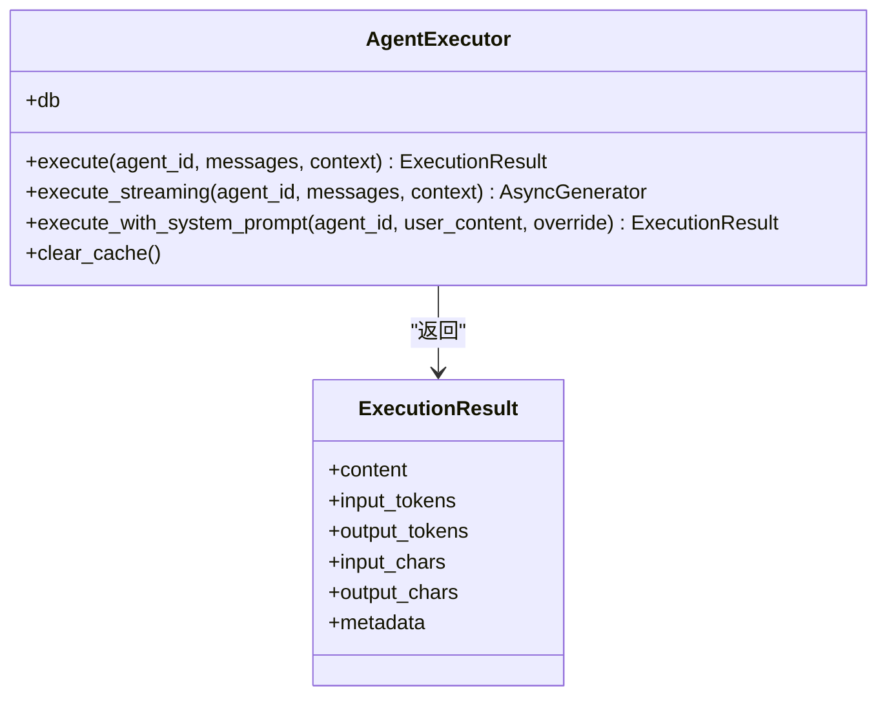
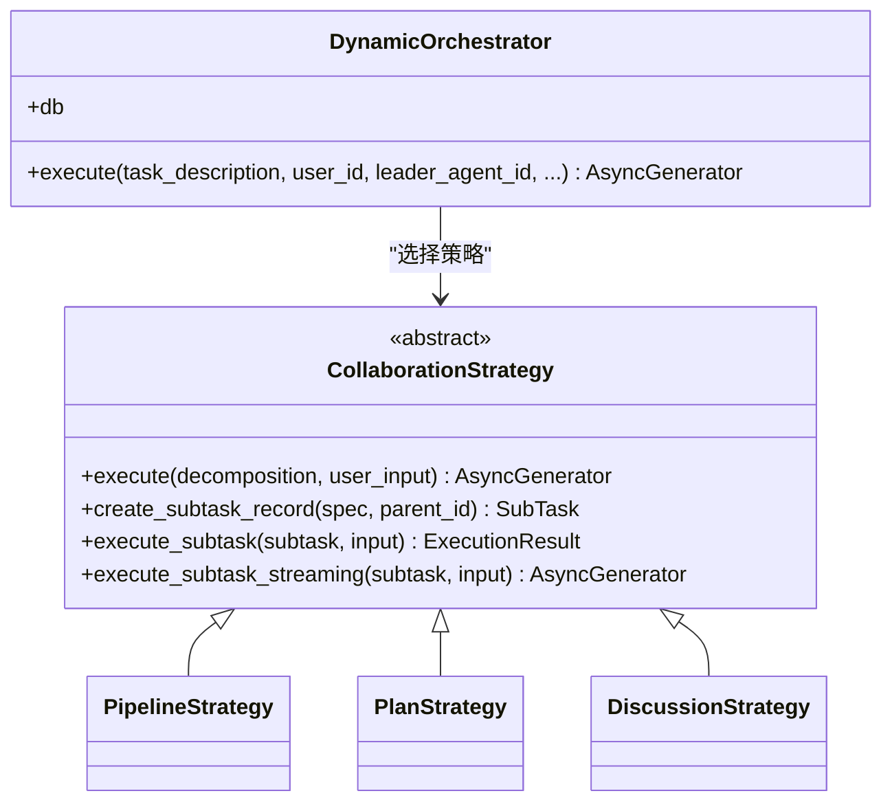
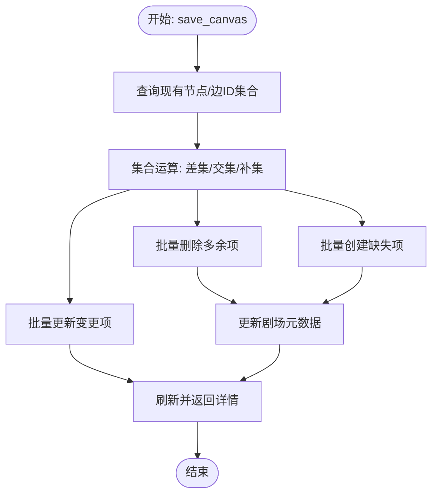
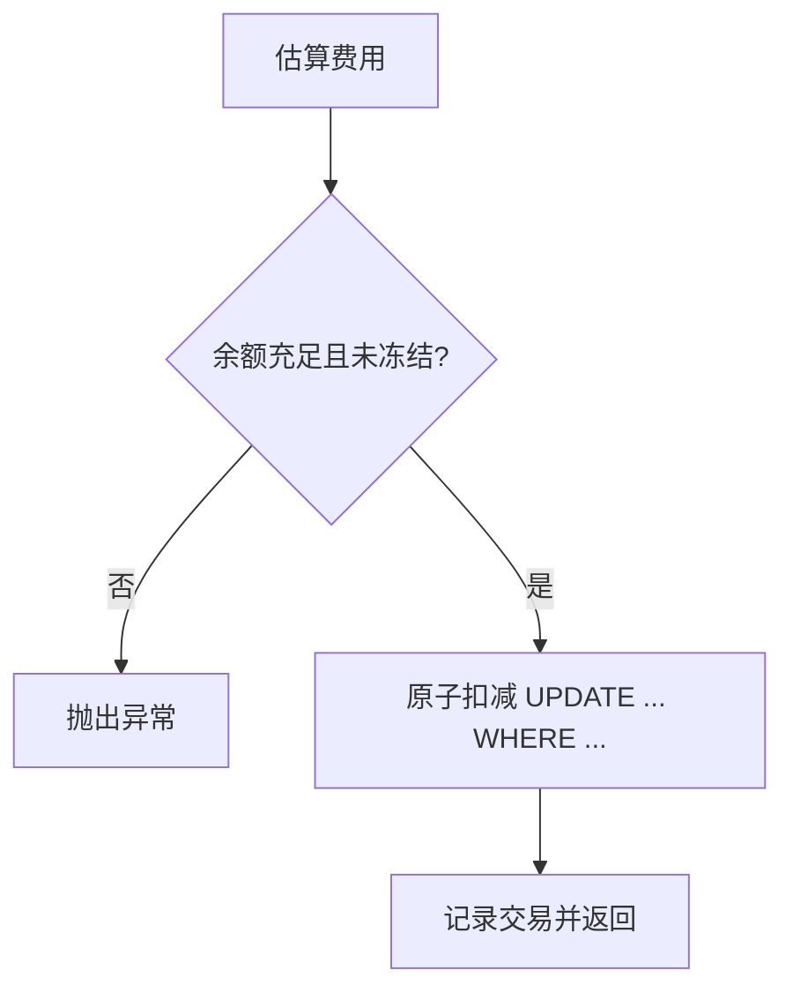
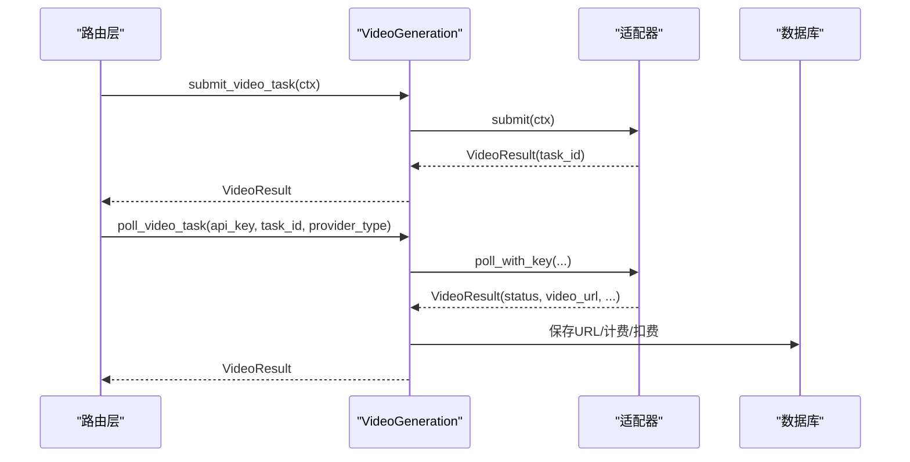
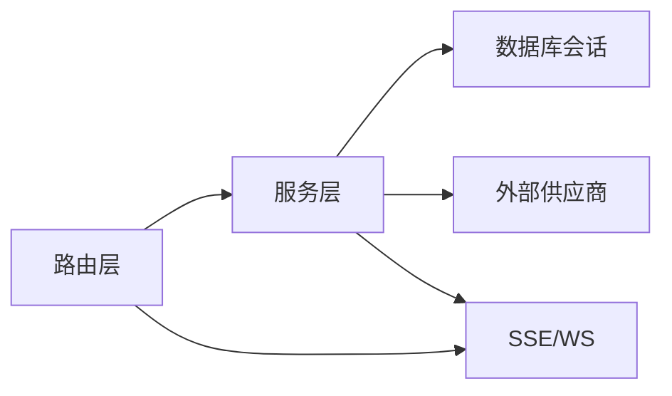

# 业务服务层

<cite>
**本文引用的文件**
- [backend/main.py](file://backend/main.py)
- [backend/models.py](file://backend/models.py)
- [backend/services/__init__.py](file://backend/services/__init__.py)
- [backend/services/agent_executor.py](file://backend/services/agent_executor.py)
- [backend/services/theater.py](file://backend/services/theater.py)
- [backend/services/billing.py](file://backend/services/billing.py)
- [backend/services/orchestrator.py](file://backend/services/orchestrator.py)
- [backend/services/video_generation.py](file://backend/services/video_generation.py)
- [backend/services/media_utils.py](file://backend/services/media_utils.py)
- [backend/services/llm_stream.py](file://backend/services/llm_stream.py)
- [backend/services/image_gen_tools.py](file://backend/services/image_gen_tools.py)
- [backend/routers/orchestrate.py](file://backend/routers/orchestrate.py)
- [backend/routers/videos.py](file://backend/routers/videos.py)
- [backend/routers/media.py](file://backend/routers/media.py)
</cite>

## 目录
1. [引言](#引言)
2. [项目结构](#项目结构)
3. [核心组件](#核心组件)
4. [架构总览](#架构总览)
5. [详细组件分析](#详细组件分析)
6. [依赖分析](#依赖分析)
7. [性能考虑](#性能考虑)
8. [故障排除指南](#故障排除指南)
9. [结论](#结论)
10. [附录](#附录)

## 引言
本文件聚焦于 Infinite Game 的业务服务层，系统性阐述服务层的职责划分与协作模式，覆盖智能体执行器、剧场服务、媒体生成服务、计费服务等核心业务逻辑；解释依赖注入、事务管理与错误传播机制；梳理异步处理策略（并发控制、队列管理、资源调度）；并提供与 AI 服务集成、文件处理与实时通信的具体实现示例与优化建议。

## 项目结构
后端采用“路由层-服务层-模型层”的清晰分层：
- 路由层负责 HTTP/WebSocket 接口与 SSE 流式响应；
- 服务层封装业务编排、计费、媒体处理与供应商适配；
- 模型层定义数据库实体与字段约束。

图表来源
- [backend/routers/orchestrate.py:26-71](file://backend/routers/orchestrate.py#L26-L71)
- [backend/routers/videos.py:74-146](file://backend/routers/videos.py#L74-L146)
- [backend/routers/media.py:54-105](file://backend/routers/media.py#L54-L105)
- [backend/services/orchestrator.py:560-673](file://backend/services/orchestrator.py#L560-L673)
- [backend/services/agent_executor.py:63-125](file://backend/services/agent_executor.py#L63-L125)
- [backend/services/theater.py:13-101](file://backend/services/theater.py#L13-L101)
- [backend/services/billing.py:310-350](file://backend/services/billing.py#L310-L350)
- [backend/services/video_generation.py:84-98](file://backend/services/video_generation.py#L84-L98)
- [backend/services/media_utils.py:20-28](file://backend/services/media_utils.py#L20-L28)
- [backend/services/llm_stream.py:12-26](file://backend/services/llm_stream.py#L12-L26)
- [backend/services/image_gen_tools.py:138-195](file://backend/services/image_gen_tools.py#L138-L195)
- [backend/models.py:35-170](file://backend/models.py#L35-L170)

章节来源
- [backend/main.py:110-153](file://backend/main.py#L110-L153)
- [backend/models.py:35-170](file://backend/models.py#L35-L170)

## 核心组件
- 智能体执行器（AgentExecutor）：统一对话式智能体调用，内置令牌统计与缓存，支持直连流式与对话式两种执行路径。
- 动态编排引擎（DynamicOrchestrator）：基于策略注册表的多智能体协作引擎，支持流水线、计划与讨论三种模式，事件化输出（SSE）。
- 剧场服务（TheaterService）：剧场、节点与边的全量同步与复制，保障画布一致性。
- 计费服务（Billing）：多维度计费映射表驱动，原子化扣减与退款，支持文本/图像/搜索/视频等维度。
- 视频生成服务（VideoGeneration）：供应商适配器工厂，统一提交与轮询入口，兼容 xAI、MiniMax、Gemini。
- 媒体工具（MediaUtils）：内嵌媒体目录，提供图片/视频保存与下载能力。
- LLM 流式模块（LLMStream）：注册表模式的多供应商流式调用，统一上下文与结果结构。
- 图像生成工具（ImageGenTools）：跨供应商的 generate_image 工具定义与派发执行。

章节来源
- [backend/services/agent_executor.py:63-125](file://backend/services/agent_executor.py#L63-L125)
- [backend/services/orchestrator.py:560-673](file://backend/services/orchestrator.py#L560-L673)
- [backend/services/theater.py:13-101](file://backend/services/theater.py#L13-L101)
- [backend/services/billing.py:310-350](file://backend/services/billing.py#L310-L350)
- [backend/services/video_generation.py:84-98](file://backend/services/video_generation.py#L84-L98)
- [backend/services/media_utils.py:20-28](file://backend/services/media_utils.py#L20-L28)
- [backend/services/llm_stream.py:12-26](file://backend/services/llm_stream.py#L12-L26)
- [backend/services/image_gen_tools.py:138-195](file://backend/services/image_gen_tools.py#L138-L195)

## 架构总览
服务层通过依赖注入与数据库会话贯穿各组件，路由层负责鉴权、参数校验与流式响应，服务层完成业务编排与外部集成。

图表来源
- [backend/routers/orchestrate.py:26-71](file://backend/routers/orchestrate.py#L26-L71)
- [backend/services/orchestrator.py:560-673](file://backend/services/orchestrator.py#L560-L673)
- [backend/services/agent_executor.py:74-125](file://backend/services/agent_executor.py#L74-L125)
- [backend/services/llm_stream.py:79-146](file://backend/services/llm_stream.py#L79-L146)
- [backend/services/billing.py:310-350](file://backend/services/billing.py#L310-L350)

## 详细组件分析

### 智能体执行器（AgentExecutor）
- 职责
  - 加载智能体与提供商配置，构建/复用 DialogAgent 实例。
  - 提供非流式与流式两种执行路径，统一返回内容与令牌统计。
  - 支持系统提示覆盖与工具调用收集。
- 关键点
  - 缓存策略：按“智能体ID+提供商ID”组合缓存 DialogAgent 与模型实例，降低重复初始化开销。
  - 类型映射：根据提供商类型选择对应模型类（OpenAI/DashScope/Gemini/Ollama/Anthropic）。
  - 归一化：统一多模态响应为字符串，保证上层一致性。
- 事务与错误
  - 数据访问在调用方提供的数据库会话中进行，错误向上抛出由路由层捕获。
- 示例路径
  - [execute:74-125](file://backend/services/agent_executor.py#L74-L125)
  - [execute_streaming:127-163](file://backend/services/agent_executor.py#L127-L163)
  - [execute_with_system_prompt:164-208](file://backend/services/agent_executor.py#L164-L208)

图表来源
- [backend/services/agent_executor.py:63-125](file://backend/services/agent_executor.py#L63-L125)

章节来源
- [backend/services/agent_executor.py:63-125](file://backend/services/agent_executor.py#L63-L125)

### 动态编排引擎（DynamicOrchestrator）
- 职责
  - 依据领导智能体的系统提示对任务进行分解，生成子任务谱系与执行策略。
  - 策略注册表：流水线（串并行）、计划（依赖拓扑）、讨论（多轮对话）。
  - 事件化输出：通过 OrchestrationEvent 以 Server-Sent Events 推送进度。
- 协作模式
  - 依赖注入：构造时注入数据库会话与 AgentExecutor。
  - 任务生命周期：创建 TaskExecution → 生成 SubTask → 执行与计费 → 审阅与收尾。
- 错误传播
  - 任何子任务异常均写入 SubTask.error_message 并继续推进其余任务，最终在编排层汇总。
- 示例路径
  - [execute:570-673](file://backend/services/orchestrator.py#L570-L673)
  - [PipelineStrategy.execute:261-306](file://backend/services/orchestrator.py#L261-L306)
  - [PlanStrategy.execute:332-406](file://backend/services/orchestrator.py#L332-L406)
  - [DiscussionStrategy.execute:422-488](file://backend/services/orchestrator.py#L422-L488)

图表来源
- [backend/services/orchestrator.py:560-530](file://backend/services/orchestrator.py#L560-L530)

章节来源
- [backend/services/orchestrator.py:560-673](file://backend/services/orchestrator.py#L560-L673)

### 剧场服务（TheaterService）
- 职责
  - 剧场的创建、查询、更新、删除与详情聚合。
  - 画布全量同步：基于集合运算区分新增/更新/删除，批量写入提升性能。
  - 剧场复制：深拷贝节点与边，重建 ID 映射保证完整性。
- 分页与筛选
  - 支持按状态筛选与分页排序，避免一次性加载过多数据。
- 示例路径
  - [save_canvas:108-228](file://backend/services/theater.py#L108-L228)
  - [duplicate_theater:230-284](file://backend/services/theater.py#L230-L284)

图表来源
- [backend/services/theater.py:108-228](file://backend/services/theater.py#L108-L228)

章节来源
- [backend/services/theater.py:13-101](file://backend/services/theater.py#L13-L101)

### 计费服务（Billing）
- 职责
  - 多维度计费：输入/文本输出/图像输出/搜索/图像生成/视频输入/视频输出等。
  - 原子化扣减与退款：UPDATE ... WHERE ... 确保并发安全，失败时抛出明确异常。
  - 余额校验：同时检查冻结状态与余额充足性。
- 计费映射
  - 使用映射表驱动，避免 if-else 分支，便于扩展新维度。
- 示例路径
  - [check_balance_sufficient:45-84](file://backend/services/billing.py#L45-L84)
  - [deduct_credits_atomic:178-308](file://backend/services/billing.py#L178-L308)
  - [calculate_credit_cost:310-350](file://backend/services/billing.py#L310-L350)
  - [calculate_video_credit_cost:353-387](file://backend/services/billing.py#L353-L387)

图表来源
- [backend/services/billing.py:178-308](file://backend/services/billing.py#L178-L308)

章节来源
- [backend/services/billing.py:45-84](file://backend/services/billing.py#L45-L84)

### 视频生成服务（VideoGeneration）
- 职责
  - 供应商适配器工厂：根据 provider_type 获取适配器实例，统一 submit/poll 接口。
  - 模型能力查询：按模型名查询供应商能力配置。
  - 轮询与落地：完成时下载视频至本地，计算计费并扣减积分，必要时插入聊天消息。
- 示例路径
  - [submit_video_task:84-98](file://backend/services/video_generation.py#L84-L98)
  - [poll_video_task:101-123](file://backend/services/video_generation.py#L101-L123)
  - [infer_provider_type:129-159](file://backend/services/video_generation.py#L129-L159)

图表来源
- [backend/routers/videos.py:74-146](file://backend/routers/videos.py#L74-L146)
- [backend/services/video_generation.py:84-123](file://backend/services/video_generation.py#L84-L123)

章节来源
- [backend/services/video_generation.py:84-123](file://backend/services/video_generation.py#L84-L123)
- [backend/routers/videos.py:74-232](file://backend/routers/videos.py#L74-L232)

### 媒体工具（MediaUtils）
- 职责
  - 保存内联图片与远程图片/视频，返回统一的 /api/media/{uuid}.{ext} 路径。
  - 支持 Content-Type 推断与异步下载。
- 示例路径
  - [save_inline_image:20-28](file://backend/services/media_utils.py#L20-L28)
  - [save_image_from_url:63-78](file://backend/services/media_utils.py#L63-L78)
  - [save_video_from_url:31-50](file://backend/services/media_utils.py#L31-L50)

章节来源
- [backend/services/media_utils.py:20-78](file://backend/services/media_utils.py#L20-L78)

### LLM 流式模块（LLMStream）
- 职责
  - 注册表模式：按 provider_type 分发到对应流式实现（OpenAI/DeepSeek/Azure/xAI/Anthropic/DashScope/Gemini）。
  - 统一上下文与结果结构：StreamContext/StreamResult，支持多模态与工具调用收集。
- 示例路径
  - [stream_openai:79-146](file://backend/services/llm_stream.py#L79-L146)
  - [stream_xai:412-417](file://backend/services/llm_stream.py#L412-L417)
  - [stream_gemini:704-800](file://backend/services/llm_stream.py#L704-L800)

章节来源
- [backend/services/llm_stream.py:79-146](file://backend/services/llm_stream.py#L79-L146)

### 图像生成工具（ImageGenTools）
- 职责
  - 定义 generate_image 工具规范，按智能体配置派发到对应供应商（当前支持 xAI）。
  - 统一返回 Markdown 图片引用，便于在对话中展示。
- 示例路径
  - [execute_image_gen_tool:138-195](file://backend/services/image_gen_tools.py#L138-L195)

章节来源
- [backend/services/image_gen_tools.py:138-195](file://backend/services/image_gen_tools.py#L138-L195)

## 依赖分析
- 依赖注入
  - 路由层通过依赖注入获取数据库会话与当前用户，服务层接收 AsyncSession 与模型对象。
  - 编排引擎在构造时注入数据库会话与 AgentExecutor，避免全局状态。
- 事务管理
  - 服务层在单次请求范围内持有同一 AsyncSession，使用 flush/commit 控制事务边界。
  - 计费采用原子 UPDATE 语句，失败即抛出异常，由路由层捕获并返回。
- 错误传播
  - 服务层抛出明确异常（如 InsufficientCreditsError/BalanceFrozenError），路由层转换为 HTTP 状态码与错误信息。
  - 编排层将子任务异常写入数据库并继续执行，最终汇总到事件流。

图表来源
- [backend/routers/orchestrate.py:26-71](file://backend/routers/orchestrate.py#L26-L71)
- [backend/services/orchestrator.py:560-673](file://backend/services/orchestrator.py#L560-L673)
- [backend/services/billing.py:178-308](file://backend/services/billing.py#L178-L308)

章节来源
- [backend/routers/orchestrate.py:26-71](file://backend/routers/orchestrate.py#L26-L71)
- [backend/services/billing.py:178-308](file://backend/services/billing.py#L178-L308)

## 性能考虑
- 并发控制
  - 编排策略中的并行执行使用 gather，避免阻塞；流水线串行模式用于长链路实时反馈。
  - 批量图片生成支持最大并发参数，避免供应商限流。
- 队列与资源调度
  - 供应商适配器按 provider_type 注册，统一入口减少分支判断与上下文切换。
  - 媒体下载使用异步 HTTP 客户端，避免阻塞主线程。
- 缓存与复用
  - 智能体执行器缓存 DialogAgent 与模型实例，显著降低初始化成本。
  - 剧场保存采用集合运算与批量写入，减少数据库往返。
- 计费与审计
  - 原子扣减与交易记录确保计费准确性与可追溯性。

## 故障排除指南
- 余额不足/冻结
  - 现象：扣费阶段抛出 InsufficientCreditsError 或 BalanceFrozenError。
  - 处理：检查用户/管理员余额与冻结状态；必要时进行充值或解冻。
  - 参考路径：[deduct_credits_atomic:178-308](file://backend/services/billing.py#L178-L308)
- 编排任务异常
  - 现象：子任务失败写入 error_message，编排继续推进。
  - 处理：查看子任务记录与事件流，定位失败原因；必要时重试或人工干预。
  - 参考路径：[execute_subtask:128-161](file://backend/services/orchestrator.py#L128-L161)
- 视频生成轮询失败
  - 现象：轮询 pending 且长时间无进展，判定超时失败。
  - 处理：检查供应商 API Key、模型可用性与内容合规；必要时更换供应商。
  - 参考路径：[get_video_task_status:149-232](file://backend/routers/videos.py#L149-L232)
- 媒体文件无法访问
  - 现象：/api/media/{uuid} 404 或 400。
  - 处理：确认文件存在与扩展名；若 LLM 截断扩展名，启用回退查找。
  - 参考路径：[serve_media:54-81](file://backend/routers/media.py#L54-L81)

章节来源
- [backend/services/billing.py:178-308](file://backend/services/billing.py#L178-L308)
- [backend/services/orchestrator.py:128-161](file://backend/services/orchestrator.py#L128-L161)
- [backend/routers/videos.py:149-232](file://backend/routers/videos.py#L149-L232)
- [backend/routers/media.py:54-81](file://backend/routers/media.py#L54-L81)

## 结论
业务服务层通过清晰的职责划分与标准化接口，实现了多智能体协作、多供应商适配、媒体处理与计费闭环。依赖注入与事务管理确保了可维护性与一致性；事件化输出与异步处理提升了用户体验与系统吞吐。建议持续完善供应商能力映射、增强可观测性与告警，并在高并发场景下进一步优化缓存与限流策略。

## 附录
- 服务导出入口
  - [services/__init__.py:1-16](file://backend/services/__init__.py#L1-L16)
- 应用启动与路由注册
  - [main.py:110-153](file://backend/main.py#L110-L153)