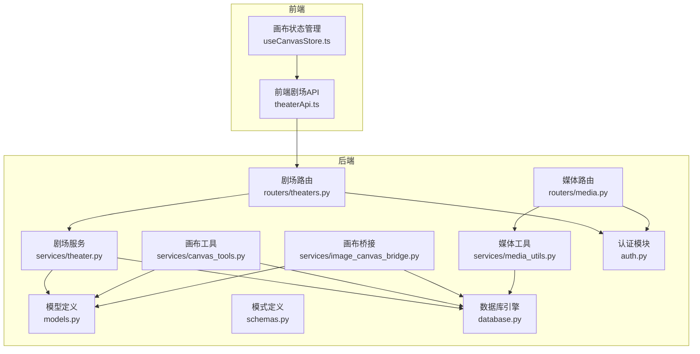
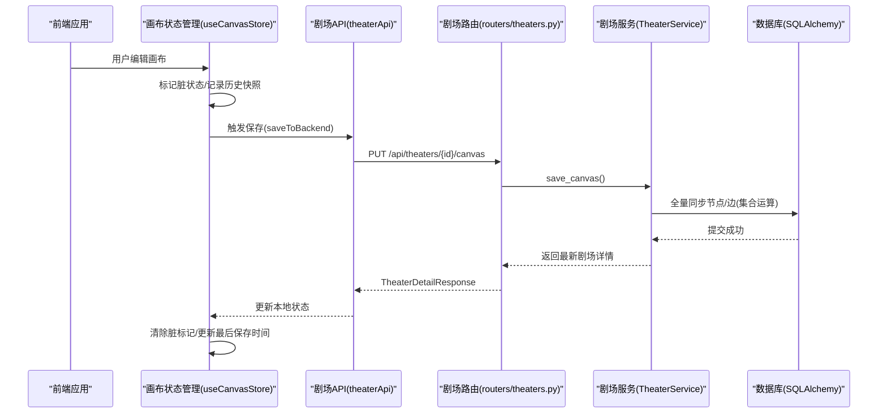
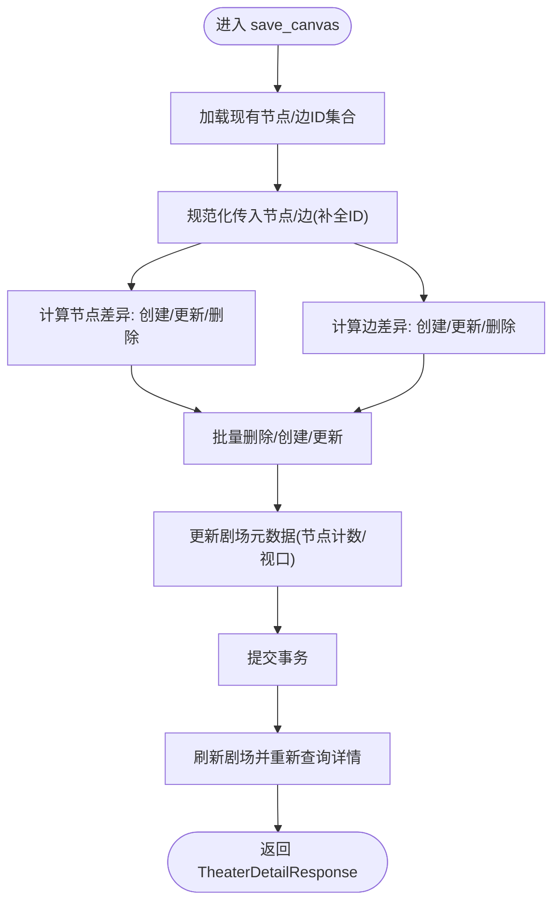
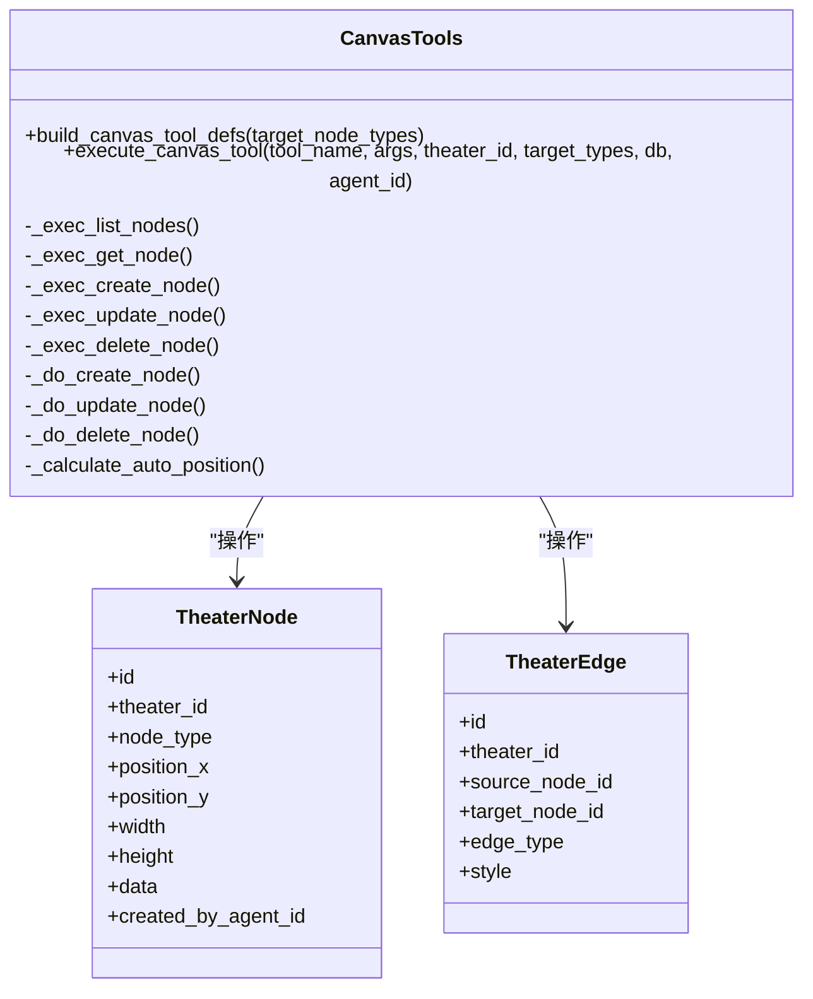
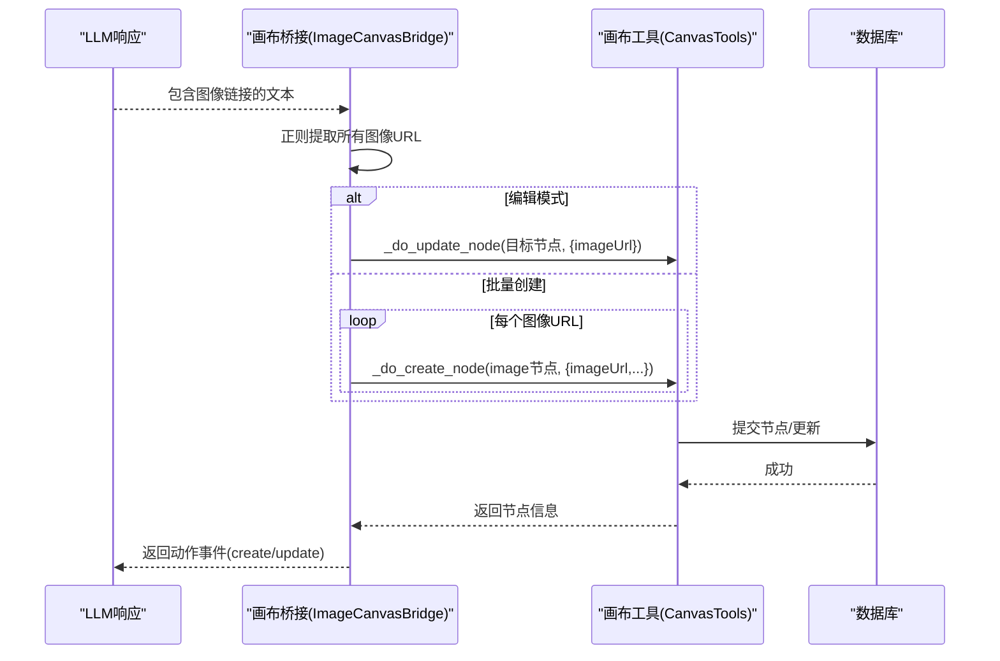
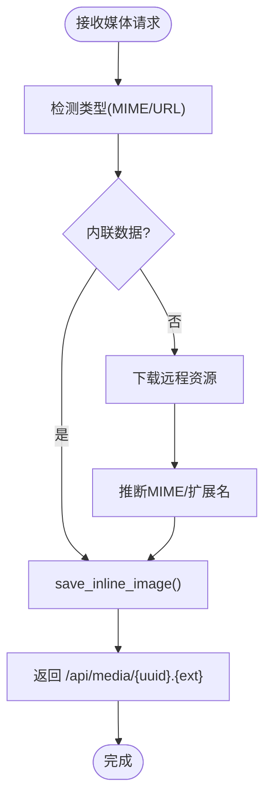
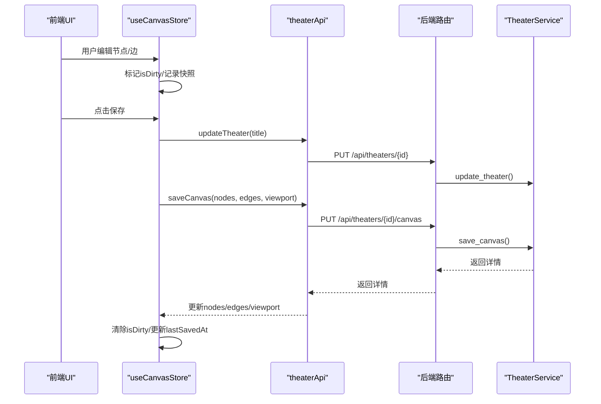
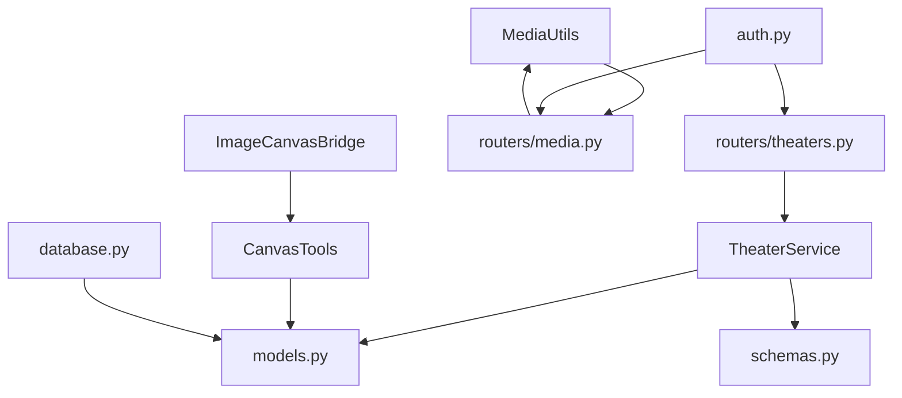

# 剧场管理服务

<cite>
**本文档引用的文件**
- [backend/services/theater.py](file://backend/services/theater.py)
- [backend/routers/theaters.py](file://backend/routers/theaters.py)
- [backend/services/image_canvas_bridge.py](file://backend/services/image_canvas_bridge.py)
- [backend/services/canvas_tools.py](file://backend/services/canvas_tools.py)
- [backend/models.py](file://backend/models.py)
- [backend/schemas.py](file://backend/schemas.py)
- [backend/services/media_utils.py](file://backend/services/media_utils.py)
- [backend/routers/media.py](file://backend/routers/media.py)
- [frontend/src/lib/theaterApi.ts](file://frontend/src/lib/theaterApi.ts)
- [frontend/src/store/useCanvasStore.ts](file://frontend/src/store/useCanvasStore.ts)
- [backend/main.py](file://backend/main.py)
- [backend/database.py](file://backend/database.py)
- [backend/auth.py](file://backend/auth.py)
- [backend/config.py](file://backend/config.py)
- [README.md](file://README.md)
</cite>

## 目录
1. [简介](#简介)
2. [项目结构](#项目结构)
3. [核心组件](#核心组件)
4. [架构总览](#架构总览)
5. [详细组件分析](#详细组件分析)
6. [依赖关系分析](#依赖关系分析)
7. [性能考虑](#性能考虑)
8. [故障排除指南](#故障排除指南)
9. [结论](#结论)
10. [附录](#附录)

## 简介
本文件系统性阐述剧场管理服务的设计与实现，重点覆盖以下方面：
- 剧场创建与生命周期管理
- 画布节点与连接的全量同步与变更传播
- 画布桥接系统：从图像生成到画布节点的自动映射
- 媒体处理工具：文件上传、格式转换与存储管理
- 剧场操作示例：节点增删改查、连接建立与权限控制
- 数据一致性与并发控制策略

该系统以 FastAPI + SQLAlchemy 异步 ORM 为核心，结合前端 Zustand 状态管理与 React Flow 可视化画布，形成前后端一体化的剧场创作与协作平台。

## 项目结构
后端采用分层架构：
- 路由层（routers）：暴露 REST API，负责鉴权与参数校验
- 服务层（services）：封装业务逻辑，如剧场服务、画布工具、媒体工具、桥接服务
- 模型层（models）：数据库实体定义
- 模式层（schemas）：Pydantic 数据模型，用于请求/响应校验
- 前端：React + Next.js，使用 Zustand 管理画布状态，通过 API 与后端交互

图表来源
- [backend/routers/theaters.py:1-110](file://backend/routers/theaters.py#L1-L110)
- [backend/routers/media.py:1-244](file://backend/routers/media.py#L1-L244)
- [backend/services/theater.py:1-285](file://backend/services/theater.py#L1-L285)
- [backend/services/canvas_tools.py:1-590](file://backend/services/canvas_tools.py#L1-L590)
- [backend/services/image_canvas_bridge.py:1-119](file://backend/services/image_canvas_bridge.py#L1-L119)
- [backend/services/media_utils.py:1-79](file://backend/services/media_utils.py#L1-L79)
- [backend/models.py:1-447](file://backend/models.py#L1-L447)
- [backend/schemas.py:1-859](file://backend/schemas.py#L1-L859)
- [backend/database.py:1-31](file://backend/database.py#L1-L31)
- [backend/auth.py:1-229](file://backend/auth.py#L1-L229)

章节来源
- [README.md:70-127](file://README.md#L70-L127)
- [backend/main.py:110-153](file://backend/main.py#L110-L153)

## 核心组件
- 剧场服务（TheaterService）：提供剧场的创建、查询、更新、删除、画布全量同步与复制等能力
- 画布工具（CanvasTools）：提供节点的增删改查、自动布局、尺寸估算、类型校验与执行器分发
- 画布桥接（ImageCanvasBridge）：将图像生成结果自动映射为画布节点，支持编辑模式与批量创建
- 媒体工具（MediaUtils）：提供内联图片保存、远程图片/视频下载与本地存储路径生成
- 路由器（Routers）：剧场与媒体 API 的入口，集成鉴权中间件
- 模型与模式（Models/Schemas）：定义剧场、节点、边、画布视口、节点类型等数据结构
- 前端状态（useCanvasStore）：本地画布状态、历史快照、脏标记与后端同步

章节来源
- [backend/services/theater.py:13-285](file://backend/services/theater.py#L13-L285)
- [backend/services/canvas_tools.py:126-590](file://backend/services/canvas_tools.py#L126-L590)
- [backend/services/image_canvas_bridge.py:29-119](file://backend/services/image_canvas_bridge.py#L29-L119)
- [backend/services/media_utils.py:20-79](file://backend/services/media_utils.py#L20-L79)
- [backend/routers/theaters.py:14-110](file://backend/routers/theaters.py#L14-L110)
- [backend/routers/media.py:24-244](file://backend/routers/media.py#L24-L244)
- [backend/models.py:75-130](file://backend/models.py#L75-L130)
- [backend/schemas.py:693-800](file://backend/schemas.py#L693-L800)
- [frontend/src/store/useCanvasStore.ts:185-540](file://frontend/src/store/useCanvasStore.ts#L185-L540)

## 架构总览
系统采用“前后端分离 + 画布状态持久化”的设计：
- 前端通过 API 与后端交互，后端负责数据一致性与权限控制
- 画布状态在前端本地持久化（localStorage），定期与后端进行全量同步
- 画布桥接在后端监听图像生成结果，自动创建/更新画布节点
- 媒体资源统一存储于后端 media 目录，通过 /api/media 提供安全访问

图表来源
- [frontend/src/store/useCanvasStore.ts:478-505](file://frontend/src/store/useCanvasStore.ts#L478-L505)
- [frontend/src/lib/theaterApi.ts:141-150](file://frontend/src/lib/theaterApi.ts#L141-L150)
- [backend/routers/theaters.py:84-99](file://backend/routers/theaters.py#L84-L99)
- [backend/services/theater.py:108-229](file://backend/services/theater.py#L108-L229)

## 详细组件分析

### 剧场服务（TheaterService）
- 职责
  - 剧场创建：写入用户ID、标题、描述、缩略图、状态、画布视口与设置
  - 剧场查询：按用户过滤，支持分页与状态筛选
  - 详情获取：返回剧场、节点与边的聚合数据
  - 画布全量同步：基于集合运算的创建/更新/删除，确保与前端状态一致
  - 剧场复制：深拷贝剧场、节点与边，保持拓扑关系
- 关键实现要点
  - 使用集合运算（差集、交集）识别新增、更新与删除项，批量操作提升性能
  - 画布视口与节点计数在同步后更新，保障前端渲染一致性
  - 复制时维护节点ID映射，确保边的源/目标正确重映射

图表来源
- [backend/services/theater.py:108-229](file://backend/services/theater.py#L108-L229)

章节来源
- [backend/services/theater.py:17-107](file://backend/services/theater.py#L17-L107)
- [backend/services/theater.py:230-285](file://backend/services/theater.py#L230-L285)

### 画布工具（CanvasTools）
- 职责
  - 节点 CRUD：列表、详情、创建、更新、删除
  - 边管理：删除节点时级联删除关联边
  - 自动布局：根据现有节点位置自动计算新节点位置
  - 类型校验：节点类型枚举与字段校验，支持遗留类型迁移
  - 执行器分发：基于名称映射的执行函数，避免条件分支
- 关键实现要点
  - 节点数据合并：更新时过滤空值，避免覆盖已有字段
  - 文本节点尺寸估算：依据内容长度估算高度，保证渲染体验
  - 权限控制：仅允许对受控节点类型进行操作

图表来源
- [backend/services/canvas_tools.py:126-590](file://backend/services/canvas_tools.py#L126-L590)
- [backend/models.py:93-129](file://backend/models.py#L93-L129)

章节来源
- [backend/services/canvas_tools.py:126-590](file://backend/services/canvas_tools.py#L126-L590)

### 画布桥接系统（ImageCanvasBridge）
- 职责
  - 从 LLM 响应中提取图像链接，自动创建/更新画布图像节点
  - 支持编辑模式：直接更新目标节点的图片URL
  - 批量创建：为每张生成的图片创建独立节点
- 关键实现要点
  - 使用正则匹配图像 Markdown 链接，提取 /api/media/... 路径
  - 复用画布工具的创建/更新函数，确保数据库操作一致性
  - 记录动作事件（SSE 语义），便于前端增量更新

图表来源
- [backend/services/image_canvas_bridge.py:29-119](file://backend/services/image_canvas_bridge.py#L29-L119)
- [backend/services/canvas_tools.py:384-477](file://backend/services/canvas_tools.py#L384-L477)

章节来源
- [backend/services/image_canvas_bridge.py:29-119](file://backend/services/image_canvas_bridge.py#L29-L119)

### 媒体处理工具（MediaUtils）
- 职责
  - 内联图片保存：根据 MIME 类型推断扩展名，生成唯一文件名并写入 media 目录
  - 远程图片下载：通过 HTTP 客户端异步下载，推断 MIME 并保存
  - 远程视频下载：支持自定义请求头（如 Google API Key），保存为 mp4
- 关键实现要点
  - 统一的媒体目录与安全文件名规则，防止路径穿越
  - 返回 /api/media/{uuid}.{ext} 的相对路径，便于前端直链访问

图表来源
- [backend/services/media_utils.py:20-79](file://backend/services/media_utils.py#L20-L79)
- [backend/routers/media.py:54-106](file://backend/routers/media.py#L54-L106)

章节来源
- [backend/services/media_utils.py:20-79](file://backend/services/media_utils.py#L20-L79)
- [backend/routers/media.py:24-244](file://backend/routers/media.py#L24-L244)

### 前端剧场API与画布状态
- 前端 API 封装了剧场的创建、列表、详情、更新、删除、画布保存与复制
- 画布状态管理包含：
  - 节点/边集合与视口状态
  - 脏标记与历史快照（支持撤销/重做）
  - 与后端的同步策略：保存时先更新剧场标题，再全量同步画布，最后刷新本地状态

图表来源
- [frontend/src/store/useCanvasStore.ts:378-505](file://frontend/src/store/useCanvasStore.ts#L378-L505)
- [frontend/src/lib/theaterApi.ts:107-158](file://frontend/src/lib/theaterApi.ts#L107-L158)
- [backend/routers/theaters.py:60-99](file://backend/routers/theaters.py#L60-L99)
- [backend/services/theater.py:91-229](file://backend/services/theater.py#L91-L229)

章节来源
- [frontend/src/lib/theaterApi.ts:1-159](file://frontend/src/lib/theaterApi.ts#L1-L159)
- [frontend/src/store/useCanvasStore.ts:185-540](file://frontend/src/store/useCanvasStore.ts#L185-L540)

## 依赖关系分析
- 组件耦合
  - TheaterService 依赖模型 Theater/TheaterNode/TheaterEdge 与 Pydantic 模式
  - CanvasTools 依赖模型 TheaterNode/TheaterEdge，复用创建/更新函数
  - ImageCanvasBridge 依赖 CanvasTools 的内部执行函数，实现桥接
  - MediaUtils 与 Routers/media.py 协作，提供媒体下载与静态服务
- 外部依赖
  - SQLAlchemy 异步引擎与连接池
  - FastAPI 路由与依赖注入
  - bcrypt、JW3T 用于认证
  - httpx 用于远程资源下载

图表来源
- [backend/services/theater.py:1-285](file://backend/services/theater.py#L1-L285)
- [backend/services/canvas_tools.py:1-590](file://backend/services/canvas_tools.py#L1-L590)
- [backend/services/image_canvas_bridge.py:1-119](file://backend/services/image_canvas_bridge.py#L1-L119)
- [backend/services/media_utils.py:1-79](file://backend/services/media_utils.py#L1-L79)
- [backend/routers/theaters.py:1-110](file://backend/routers/theaters.py#L1-L110)
- [backend/routers/media.py:1-244](file://backend/routers/media.py#L1-L244)
- [backend/models.py:1-447](file://backend/models.py#L1-L447)
- [backend/schemas.py:1-859](file://backend/schemas.py#L1-L859)
- [backend/auth.py:1-229](file://backend/auth.py#L1-L229)
- [backend/database.py:1-31](file://backend/database.py#L1-L31)

章节来源
- [backend/database.py:1-31](file://backend/database.py#L1-L31)
- [backend/auth.py:1-229](file://backend/auth.py#L1-L229)

## 性能考虑
- 批量操作
  - TheaterService 使用集合运算识别差异，批量删除/创建/更新节点与边，降低往返次数
  - CanvasTools 在创建/更新时避免不必要的字段写入，减少数据库写放大
- 连接池与异步
  - 异步 SQLAlchemy 引擎与连接池配置，提升高并发下的吞吐
- 前端状态优化
  - 本地持久化与历史快照，减少后端压力；仅在必要时触发保存
- 媒体处理
  - 异步下载与最小化磁盘 IO，避免阻塞主线程

## 故障排除指南
- 权限错误
  - 确认 JWT 令牌有效且为用户访问令牌；管理员接口需使用管理员令牌
  - 若出现“无效或过期令牌”，检查密钥与过期时间配置
- 画布不同步
  - 检查前端是否标记脏状态；确认保存流程是否成功返回最新详情
  - 如节点/边缺失，确认 TheaterService 的集合运算逻辑是否正确识别差异
- 媒体无法访问
  - 确认文件名符合安全规则（UUID + 扩展名），或 UUID 回退查找
  - 检查 media 目录是否存在与权限是否正确

章节来源
- [backend/auth.py:65-114](file://backend/auth.py#L65-L114)
- [frontend/src/store/useCanvasStore.ts:478-505](file://frontend/src/store/useCanvasStore.ts#L478-L505)
- [backend/routers/media.py:54-81](file://backend/routers/media.py#L54-L81)

## 结论
剧场管理服务通过清晰的分层设计与强一致性的画布同步机制，实现了从创作到协作的全流程支撑。画布桥接系统将图像生成与可视化节点无缝衔接，媒体工具提供稳健的资源管理能力。配合前端状态管理与鉴权体系，系统在易用性与可靠性之间取得良好平衡。

## 附录

### 剧场操作示例（基于现有API）
- 创建剧场
  - 请求：POST /api/theaters
  - 参数：title、description、thumbnail_url、status、canvas_viewport、settings
  - 返回：TheaterResponse
- 列出剧场
  - 请求：GET /api/theaters?page&page_size&status
  - 返回：TheaterListResponse
- 获取剧场详情
  - 请求：GET /api/theaters/{id}
  - 返回：包含 nodes/edges 的 TheaterDetailResponse
- 更新剧场
  - 请求：PUT /api/theaters/{id}
  - 参数：title/description/thumbnail_url/status/canvas_viewport/settings
  - 返回：TheaterResponse
- 删除剧场
  - 请求：DELETE /api/theaters/{id}
  - 返回：{"detail": "Theater deleted"}
- 保存画布
  - 请求：PUT /api/theaters/{id}/canvas
  - 参数：nodes/edges/canvas_viewport
  - 返回：TheaterDetailResponse
- 复制剧场
  - 请求：POST /api/theaters/{id}/duplicate
  - 返回：新的 TheaterResponse

章节来源
- [backend/routers/theaters.py:20-110](file://backend/routers/theaters.py#L20-L110)
- [frontend/src/lib/theaterApi.ts:107-158](file://frontend/src/lib/theaterApi.ts#L107-L158)

### 数据一致性与并发控制策略
- 事务边界
  - TheaterService 的 save_canvas 在单事务中完成节点/边的全量同步，失败回滚
- 行级隔离
  - 通过 scoped_query 限制用户只能访问自身剧场，管理员可访问全部数据
- 并发冲突
  - 前端通过脏标记与历史快照避免重复保存；后端通过全量同步消除竞态
- 连接池与超时
  - 异步引擎与连接池配置，减少连接争用；媒体下载设置合理超时

章节来源
- [backend/services/theater.py:108-229](file://backend/services/theater.py#L108-L229)
- [backend/auth.py:221-229](file://backend/auth.py#L221-L229)
- [backend/database.py:8-23](file://backend/database.py#L8-L23)