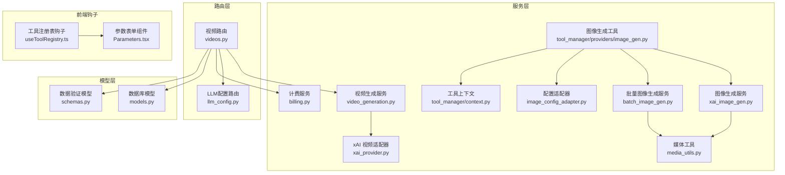
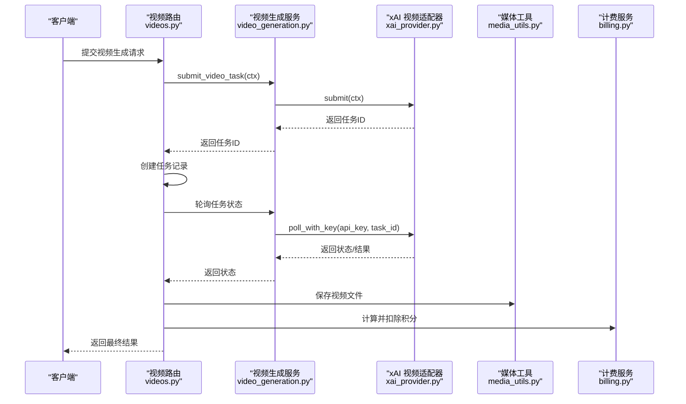
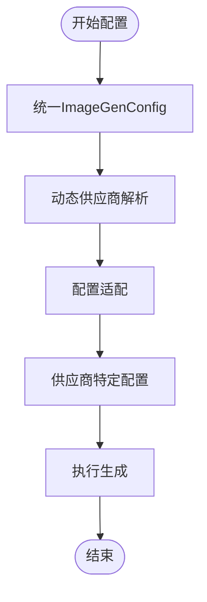
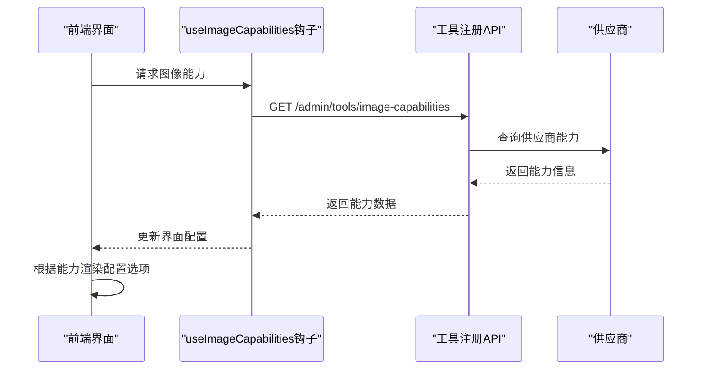
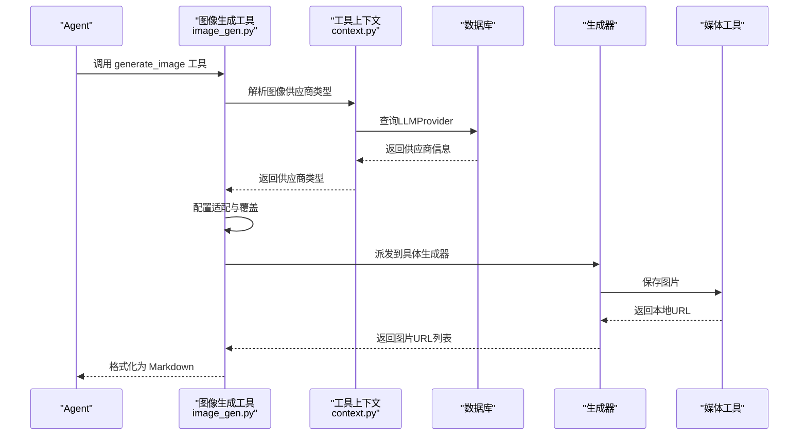
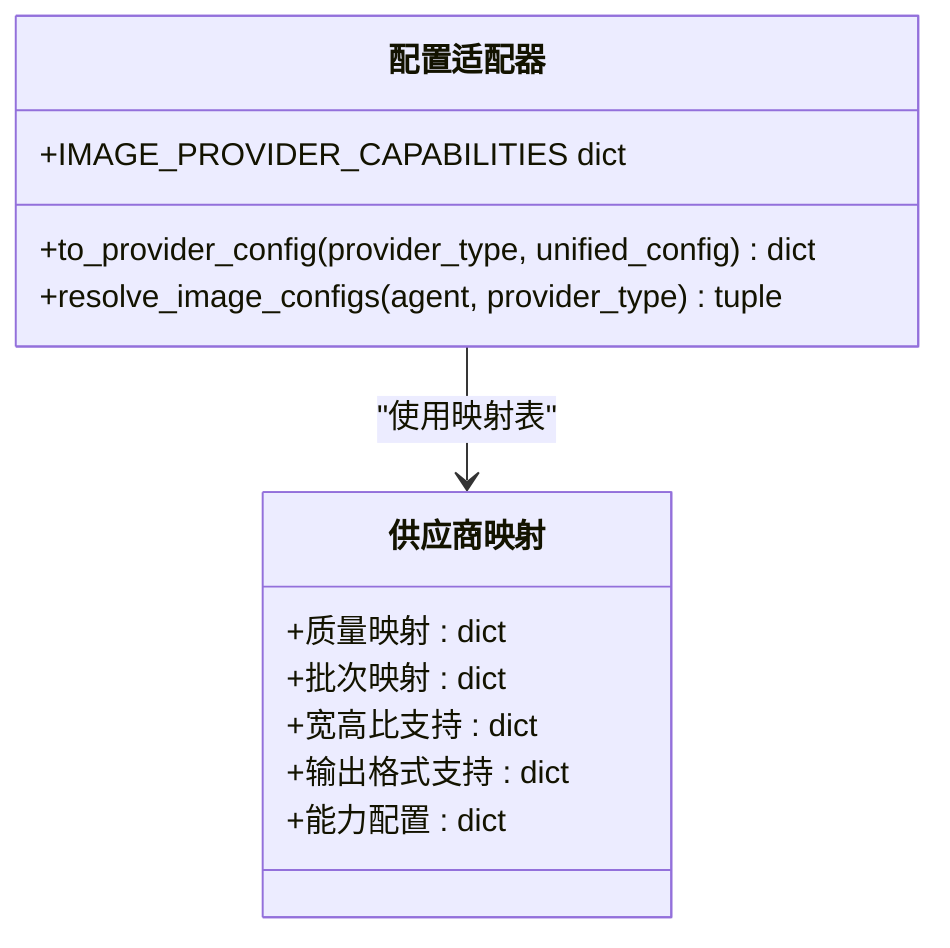
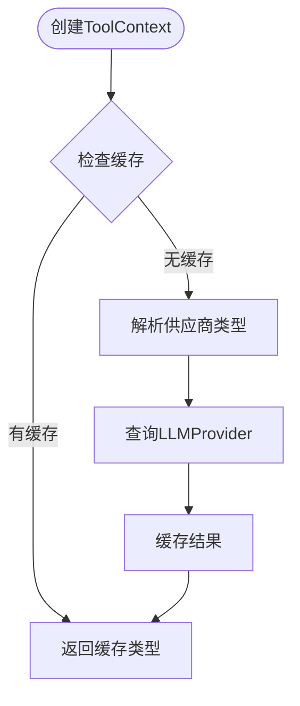
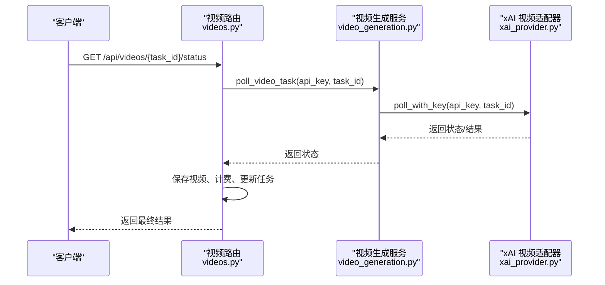
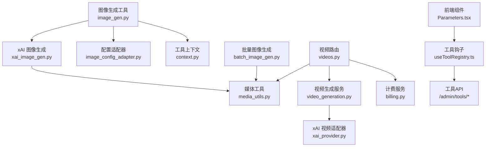

# 图像生成系统

<cite>
**本文档引用的文件**
- [xai_image_gen.py](file://backend/services/xai_image_gen.py)
- [batch_image_gen.py](file://backend/services/batch_image_gen.py)
- [image_gen.py](file://backend/services/tool_manager/providers/image_gen.py)
- [image_config_adapter.py](file://backend/services/image_config_adapter.py)
- [media_utils.py](file://backend/services/media_utils.py)
- [billing.py](file://backend/services/billing.py)
- [videos.py](file://backend/routers/videos.py)
- [video_generation.py](file://backend/services/video_generation.py)
- [xai_provider.py](file://backend/services/video_providers/xai_provider.py)
- [model_capabilities.py](file://backend/services/video_providers/model_capabilities.py)
- [llm_config.py](file://backend/routers/llm_config.py)
- [useToolRegistry.ts](file://backend/admin/src/hooks/useToolRegistry.ts)
- [Parameters.tsx](file://backend/admin/src/components/admin/agents/AgentForm/Parameters.tsx)
- [schema.ts](file://backend/admin/src/components/admin/agents/AgentForm/schema.ts)
- [index.ts](file://backend/admin/src/types/index.ts)
- [context.py](file://backend/services/tool_manager/context.py)
- [models.py](file://backend/models.py)
- [schemas.py](file://backend/schemas.py)
</cite>

## 更新摘要
**所做更改**
- 重构了图像生成配置系统，移除了特定供应商配置（GeminiImageConfig、XAIImageConfig），引入统一的ImageGenConfig系统
- 新增了动态图像供应商能力检测机制，前端通过API端点获取配置信息
- 更新了工具适配器以支持统一配置格式
- 扩展了前端组件以支持动态配置和能力展示

## 目录
1. [简介](#简介)
2. [项目结构](#项目结构)
3. [核心组件](#核心组件)
4. [架构概览](#架构概览)
5. [详细组件分析](#详细组件分析)
6. [依赖关系分析](#依赖关系分析)
7. [性能考虑](#性能考虑)
8. [故障排除指南](#故障排除指南)
9. [结论](#结论)
10. [附录](#附录)

## 简介
本项目是一个基于 FastAPI 的图像生成系统，现已重构为支持统一配置系统的多供应商图像生成服务。系统采用统一的ImageGenConfig配置格式，支持动态供应商能力检测，提供统一的工具接口、批量处理能力、质量控制与成本计算功能。系统采用异步并发模型，结合媒体文件存储与计费模块，实现高效稳定的图像生成与管理。

## 项目结构
后端主要分为以下层次：
- 服务层：图像生成、批量处理、配置适配、媒体工具、计费等
- 路由层：FastAPI 路由，负责请求处理与响应
- 模型层：数据库模型定义
- 架构特点：模块化设计，适配器模式支持多供应商；统一配置适配器将通用配置转换为各供应商特定格式；动态供应商能力检测

**图表来源**
- [xai_image_gen.py:1-191](file://backend/services/xai_image_gen.py#L1-L191)
- [batch_image_gen.py:1-187](file://backend/services/batch_image_gen.py#L1-L187)
- [image_gen.py:1-262](file://backend/services/tool_manager/providers/image_gen.py#L1-L262)
- [image_config_adapter.py:1-181](file://backend/services/image_config_adapter.py#L1-L181)
- [media_utils.py:1-79](file://backend/services/media_utils.py#L1-L79)
- [billing.py:1-200](file://backend/services/billing.py#L1-L200)
- [videos.py:1-343](file://backend/routers/videos.py#L1-L343)
- [video_generation.py:1-160](file://backend/services/video_generation.py#L1-L160)
- [xai_provider.py:1-164](file://backend/services/video_providers/xai_provider.py#L1-L164)
- [context.py:1-70](file://backend/services/tool_manager/context.py#L1-L70)
- [llm_config.py:1-233](file://backend/routers/llm_config.py#L1-L233)
- [useToolRegistry.ts:1-37](file://backend/admin/src/hooks/useToolRegistry.ts#L1-L37)
- [Parameters.tsx:1-696](file://backend/admin/src/components/admin/agents/AgentForm/Parameters.tsx#L1-L696)

**章节来源**
- [xai_image_gen.py:1-191](file://backend/services/xai_image_gen.py#L1-L191)
- [batch_image_gen.py:1-187](file://backend/services/batch_image_gen.py#L1-L187)
- [image_gen.py:1-262](file://backend/services/tool_manager/providers/image_gen.py#L1-L262)
- [image_config_adapter.py:1-181](file://backend/services/image_config_adapter.py#L1-L181)
- [media_utils.py:1-79](file://backend/services/media_utils.py#L1-L79)
- [billing.py:1-200](file://backend/services/billing.py#L1-L200)
- [videos.py:1-343](file://backend/routers/videos.py#L1-L343)
- [video_generation.py:1-160](file://backend/services/video_generation.py#L1-L160)
- [xai_provider.py:1-164](file://backend/services/video_providers/xai_provider.py#L1-L164)
- [context.py:1-70](file://backend/services/tool_manager/context.py#L1-L70)
- [llm_config.py:1-233](file://backend/routers/llm_config.py#L1-L233)
- [useToolRegistry.ts:1-37](file://backend/admin/src/hooks/useToolRegistry.ts#L1-L37)
- [Parameters.tsx:1-696](file://backend/admin/src/components/admin/agents/AgentForm/Parameters.tsx#L1-L696)

## 核心组件
- **统一图像生成配置系统**：移除特定供应商配置，引入ImageGenConfig统一格式，支持供应商无关的配置管理
- **动态供应商能力检测**：前端通过API端点动态获取供应商能力信息，实现智能配置界面
- **重构的图像生成工具**：支持统一配置格式，通过适配器转换为供应商特定格式
- **增强的配置适配器**：支持统一配置到多供应商格式的转换，包含能力映射和验证
- **工具上下文管理**：提供延迟解析的图像供应商类型解析，支持缓存机制
- **扩展的前端组件**：支持动态供应商选择、能力展示和智能配置

**章节来源**
- [image_config_adapter.py:1-181](file://backend/services/image_config_adapter.py#L1-L181)
- [image_gen.py:171-200](file://backend/services/tool_manager/providers/image_gen.py#L171-L200)
- [context.py:56-70](file://backend/services/tool_manager/context.py#L56-L70)
- [Parameters.tsx:256-469](file://backend/admin/src/components/admin/agents/AgentForm/Parameters.tsx#L256-L469)

## 架构概览
系统采用"路由层-服务层-适配器层-外部服务"的分层架构，现已扩展为支持统一配置的动态架构。路由层接收请求并调用服务层；服务层通过适配器将请求路由至具体供应商；媒体工具负责本地存储；计费服务贯穿于生成流程以实现成本控制；前端通过钩子动态获取供应商能力和配置信息。

**图表来源**
- [videos.py:74-233](file://backend/routers/videos.py#L74-L233)
- [video_generation.py:84-160](file://backend/services/video_generation.py#L84-L160)
- [xai_provider.py:47-164](file://backend/services/video_providers/xai_provider.py#L47-L164)
- [media_utils.py:31-51](file://backend/services/media_utils.py#L31-L51)
- [billing.py:353-387](file://backend/services/billing.py#L353-L387)

**章节来源**
- [videos.py:74-233](file://backend/routers/videos.py#L74-L233)
- [video_generation.py:84-160](file://backend/services/video_generation.py#L84-L160)
- [xai_provider.py:47-164](file://backend/services/video_providers/xai_provider.py#L47-L164)
- [media_utils.py:31-51](file://backend/services/media_utils.py#L31-L51)
- [billing.py:353-387](file://backend/services/billing.py#L353-L387)

## 详细组件分析

### 统一图像生成配置系统
- **功能概述**：移除特定供应商配置，引入ImageGenConfig统一格式，支持供应商无关的配置管理
- **关键特性**：
  - 统一配置结构：image_generation_enabled、image_provider_id、image_model、image_config
  - 前端类型定义：TypeScript接口支持类型安全的配置管理
  - 后端Schema验证：Zod Schema确保配置的有效性和一致性
  - 动态供应商解析：支持运行时供应商类型检测和配置转换

**图表来源**
- [schema.ts:16-29](file://backend/admin/src/components/admin/agents/AgentForm/schema.ts#L16-L29)
- [index.ts:21-26](file://backend/admin/src/types/index.ts#L21-L26)

**章节来源**
- [schema.ts:16-29](file://backend/admin/src/components/admin/agents/AgentForm/schema.ts#L16-L29)
- [index.ts:21-26](file://backend/admin/src/types/index.ts#L21-L26)

### 动态供应商能力检测
- **功能概述**：前端通过API端点动态获取供应商能力信息，实现智能配置界面
- **关键特性**：
  - 能力钩子：useImageCapabilities提供实时能力数据
  - 动态配置：根据供应商能力动态渲染配置选项
  - 智能限制：根据供应商支持的能力限制用户输入
  - 实时更新：供应商能力变化时自动更新界面

**图表来源**
- [useToolRegistry.ts:30-36](file://backend/admin/src/hooks/useToolRegistry.ts#L30-L36)
- [Parameters.tsx:95-109](file://backend/admin/src/components/admin/agents/AgentForm/Parameters.tsx#L95-L109)

**章节来源**
- [useToolRegistry.ts:30-36](file://backend/admin/src/hooks/useToolRegistry.ts#L30-L36)
- [Parameters.tsx:95-109](file://backend/admin/src/components/admin/agents/AgentForm/Parameters.tsx#L95-L109)

### 重构的图像生成工具
- **功能概述**：支持统一配置格式，通过适配器转换为供应商特定格式
- **关键特性**：
  - 统一工具定义：build_image_gen_tool_def支持动态供应商特定的工具定义
  - 供应商派发：_IMAGE_GENERATORS映射到具体生成器
  - 配置适配：to_provider_config将统一配置转换为供应商特定格式
  - 上下文解析：ToolContext提供延迟解析的供应商类型
  - 结果格式化：支持多种输出格式的统一处理

**图表来源**
- [image_gen.py:171-200](file://backend/services/tool_manager/providers/image_gen.py#L171-L200)
- [context.py:56-70](file://backend/services/tool_manager/context.py#L56-L70)

**章节来源**
- [image_gen.py:171-200](file://backend/services/tool_manager/providers/image_gen.py#L171-L200)
- [context.py:56-70](file://backend/services/tool_manager/context.py#L56-L70)

### 增强的配置适配器
- **功能概述**：支持统一配置到多供应商格式的转换，包含能力映射和验证
- **关键特性**：
  - 统一质量映射：Gemini与xAI的质量→分辨率映射
  - 批次映射：batch_count→不同供应商的批次字段映射
  - 能力验证：支持供应商能力集合的验证和默认值处理
  - 输出格式支持：动态支持不同供应商的输出格式
  - 能力配置：IMAGE_PROVIDER_CAPABILITIES提供供应商能力信息

**图表来源**
- [image_config_adapter.py:134-181](file://backend/services/image_config_adapter.py#L134-L181)

**章节来源**
- [image_config_adapter.py:134-181](file://backend/services/image_config_adapter.py#L134-L181)

### 工具上下文管理
- **功能概述**：提供延迟解析的图像供应商类型解析，支持缓存机制
- **关键特性**：
  - 延迟解析：resolve_image_provider_type支持延迟解析供应商类型
  - 缓存机制：_image_provider_type缓存解析结果
  - 数据库集成：从LLMProvider表解析供应商信息
  - 不可变上下文：ToolContext提供不可变的执行上下文

**图表来源**
- [context.py:56-70](file://backend/services/tool_manager/context.py#L56-L70)

**章节来源**
- [context.py:56-70](file://backend/services/tool_manager/context.py#L56-L70)

### 媒体工具
- **功能概述**：本地媒体文件保存与下载
- **关键特性**：
  - 保存内联图片：save_inline_image，自动推断 MIME 并生成唯一文件名
  - 保存远程图片：save_image_from_url，通过 Content-Type 推断 MIME
  - 保存视频：save_video_from_url，支持可选请求头（如 Gemini 需要 x-goog-api-key）

**章节来源**
- [media_utils.py:20-79](file://backend/services/media_utils.py#L20-L79)

### 计费服务
- **功能概述**：多维度计费计算器，支持原子扣费与退款
- **关键特性**：
  - 维度映射：输入、文本输出、图像输出、搜索、图像生成等
  - 视频计费：按输入图片数量、输出时长与质量维度计费
  - 原子操作：deduct_credits_atomic 使用 UPDATE ... WHERE 确保并发安全
  - 余额检查：check_balance_sufficient 支持冻结账户检查

**章节来源**
- [billing.py:12-200](file://backend/services/billing.py#L12-L200)
- [billing.py:353-387](file://backend/services/billing.py#L353-L387)

### 视频生成服务与路由
- **功能概述**：多供应商适配器统一入口，支持状态轮询与内容审核
- **关键特性**：
  - 适配器注册：XAIVideoAdapter、MiniMaxVideoAdapter、GeminiVeoAdapter
  - 提交与轮询：submit_video_task、poll_video_task
  - 路由集成：videos.py 提交任务、轮询状态、保存视频、计费与插入聊天消息
  - 内容审核：xAI 适配器在完成时检查 moderation

**图表来源**
- [videos.py:149-233](file://backend/routers/videos.py#L149-L233)
- [video_generation.py:101-124](file://backend/services/video_generation.py#L101-L124)
- [xai_provider.py:105-164](file://backend/services/video_providers/xai_provider.py#L105-L164)

**章节来源**
- [videos.py:149-233](file://backend/routers/videos.py#L149-L233)
- [video_generation.py:84-160](file://backend/services/video_generation.py#L84-L160)
- [xai_provider.py:47-164](file://backend/services/video_providers/xai_provider.py#L47-L164)

## 依赖关系分析
- **组件耦合**：
  - image_gen 依赖 xai_image_gen 与 image_config_adapter，体现"定义-执行-派发"模式
  - image_gen 依赖 context 提供供应商类型解析
  - xai_image_gen 与 batch_image_gen 依赖 media_utils 进行本地存储
  - videos.py 依赖 video_generation 与 xai_provider，以及 billing 与 media_utils
  - 前端 Parameters.tsx 依赖 useToolRegistry.ts 获取供应商能力
- **外部依赖**：
  - xAI：OpenAI SDK（异步客户端）、HTTPX
  - Gemini：Google GenAI SDK、HTTPX
  - FastAPI：路由与依赖注入
  - SWR：前端数据获取和缓存
- **循环依赖**：未发现循环依赖，模块职责清晰

**图表来源**
- [image_gen.py:1-262](file://backend/services/tool_manager/providers/image_gen.py#L1-L262)
- [xai_image_gen.py:1-191](file://backend/services/xai_image_gen.py#L1-L191)
- [batch_image_gen.py:1-187](file://backend/services/batch_image_gen.py#L1-L187)
- [media_utils.py:1-79](file://backend/services/media_utils.py#L1-L79)
- [videos.py:1-343](file://backend/routers/videos.py#L1-L343)
- [video_generation.py:1-160](file://backend/services/video_generation.py#L1-L160)
- [xai_provider.py:1-164](file://backend/services/video_providers/xai_provider.py#L1-L164)
- [billing.py:1-200](file://backend/services/billing.py#L1-L200)
- [Parameters.tsx:1-696](file://backend/admin/src/components/admin/agents/AgentForm/Parameters.tsx#L1-L696)
- [useToolRegistry.ts:1-37](file://backend/admin/src/hooks/useToolRegistry.ts#L1-L37)

**章节来源**
- [image_gen.py:1-262](file://backend/services/tool_manager/providers/image_gen.py#L1-L262)
- [xai_image_gen.py:1-191](file://backend/services/xai_image_gen.py#L1-L191)
- [batch_image_gen.py:1-187](file://backend/services/batch_image_gen.py#L1-L187)
- [media_utils.py:1-79](file://backend/services/media_utils.py#L1-L79)
- [videos.py:1-343](file://backend/routers/videos.py#L1-L343)
- [video_generation.py:1-160](file://backend/services/video_generation.py#L1-L160)
- [xai_provider.py:1-164](file://backend/services/video_providers/xai_provider.py#L1-L164)
- [billing.py:1-200](file://backend/services/billing.py#L1-L200)
- [Parameters.tsx:1-696](file://backend/admin/src/components/admin/agents/AgentForm/Parameters.tsx#L1-L696)
- [useToolRegistry.ts:1-37](file://backend/admin/src/hooks/useToolRegistry.ts#L1-L37)

## 性能考虑
- **并发控制**：使用 asyncio.Semaphore 限制最大并发（1-8），避免过度占用外部 API 速率限制
- **异步 I/O**：使用 httpx.AsyncClient 与 OpenAI 异步客户端，提升网络请求吞吐
- **结果聚合**：使用 asyncio.gather 并行收集任务结果，减少等待时间
- **存储优化**：媒体文件采用唯一 UUID 命名，避免冲突；批量生成时尽量复用保存逻辑
- **计费优化**：计费维度映射表驱动，避免 if-else 分支，提升计算效率
- **缓存机制**：工具上下文提供供应商类型缓存，减少重复查询
- **动态能力检测**：前端能力检测避免无效配置，提升用户体验

## 故障排除指南
- **并发过高导致超时**：调整 max_concurrent 参数，确保不超过供应商限流
- **内容审核拒绝**：xAI 适配器在完成时检查 moderation，若拒绝则标记失败并记录原因
- **余额不足**：check_balance_sufficient 抛出 BalanceFrozenError 或返回 False，需先充值或解冻
- **文件保存失败**：media_utils 中的保存函数抛出异常时，检查 MIME 推断与目录权限
- **轮询超时**：videos.py 中对 pending 且带错误的任务超过 300 秒判定失败
- **供应商能力不匹配**：检查 IMAGE_PROVIDER_CAPABILITIES 配置和前端能力检测
- **配置适配失败**：验证统一配置格式和供应商特定字段映射

**章节来源**
- [xai_provider.py:139-157](file://backend/services/video_providers/xai_provider.py#L139-L157)
- [billing.py:45-84](file://backend/services/billing.py#L45-L84)
- [media_utils.py:20-79](file://backend/services/media_utils.py#L20-L79)
- [videos.py:179-183](file://backend/routers/videos.py#L179-L183)
- [image_config_adapter.py:134-181](file://backend/services/image_config_adapter.py#L134-L181)

## 结论
该图像生成系统通过重构统一配置系统和引入动态供应商能力检测，实现了更加灵活和可扩展的多供应商统一接入。统一配置适配器与计费服务进一步提升了系统的可维护性与可控性。新的架构支持更好的用户体验，通过前端动态能力检测提供智能配置界面。建议在生产环境中合理设置并发参数、监控供应商限流与内容审核策略，并定期清理本地媒体文件以控制存储空间。

## 附录

### 使用示例（路径引用）
- **统一配置格式**
  - 配置结构：[schema.ts:16-29](file://backend/admin/src/components/admin/agents/AgentForm/schema.ts#L16-L29)
  - 类型定义：[index.ts:21-26](file://backend/admin/src/types/index.ts#L21-L26)
- **动态供应商能力**
  - 能力钩子：[useToolRegistry.ts:30-36](file://backend/admin/src/hooks/useToolRegistry.ts#L30-L36)
  - 参数组件：[Parameters.tsx:256-469](file://backend/admin/src/components/admin/agents/AgentForm/Parameters.tsx#L256-L469)
- **工具执行流程**
  - 统一工具定义：[image_gen.py:54-101](file://backend/services/tool_manager/providers/image_gen.py#L54-L101)
  - 供应商派发：[image_gen.py:160-164](file://backend/services/tool_manager/providers/image_gen.py#L160-L164)
  - 配置适配：[image_gen.py:190-200](file://backend/services/tool_manager/providers/image_gen.py#L190-L200)

### 参数与配置要点
- **统一配置字段**：image_generation_enabled、image_provider_id、image_model、image_config
- **宽高比枚举**：统一支持 auto、1:1、16:9、9:16、4:3、3:4、3:2、2:3、2:1、1:2、19.5:9、9:19.5、20:9、9:20
- **质量级别**：standard、hd、ultra（供应商间映射）
- **批次上限**：xAI n ≤ 10；Gemini batch_count ≤ 8
- **输出格式**：Gemini 支持 png/jpeg/webp；xAI 默认 b64_json
- **动态能力检测**：前端通过 /admin/tools/image-capabilities 获取供应商能力
- **工具上下文缓存**：ToolContext提供供应商类型缓存机制

### 新增API端点
- **工具注册表**：/admin/tools/registry - 获取工具和供应商信息
- **工具使用统计**：/admin/tools/agent-usage - 获取工具使用情况
- **工具统计**：/admin/tools/stats - 获取工具执行统计
- **图像供应商能力**：/admin/tools/image-capabilities - 获取图像供应商能力信息
- **LLM供应商管理**：/api/admin/llm-providers - 管理AI供应商配置

**章节来源**
- [useToolRegistry.ts:5-36](file://backend/admin/src/hooks/useToolRegistry.ts#L5-L36)
- [llm_config.py:166-186](file://backend/routers/llm_config.py#L166-L186)