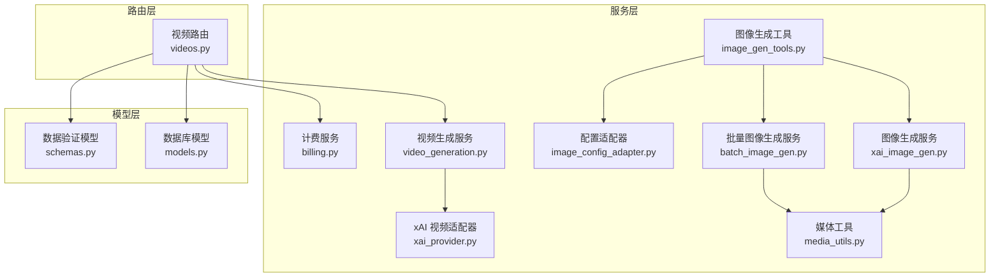
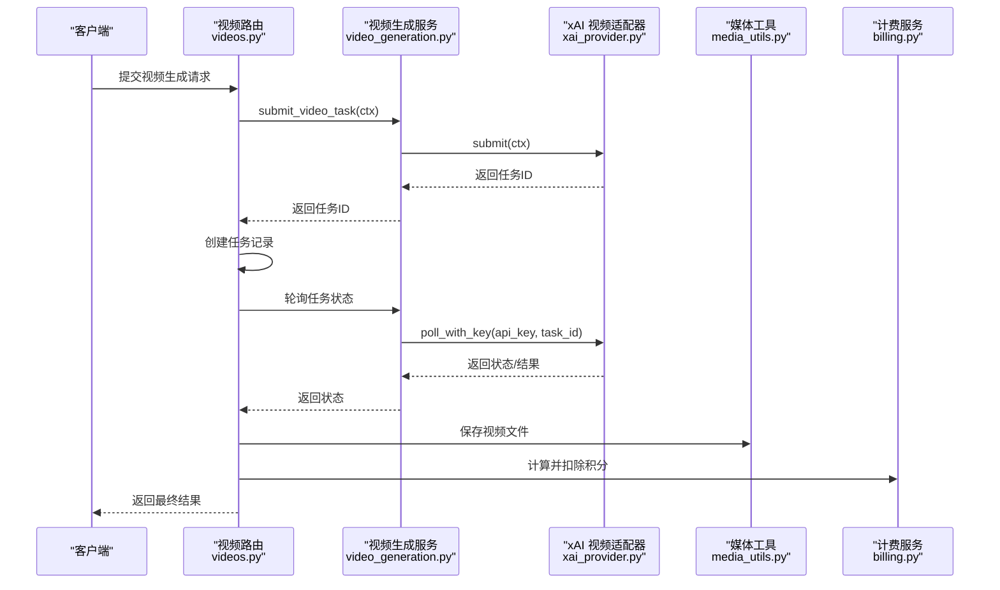
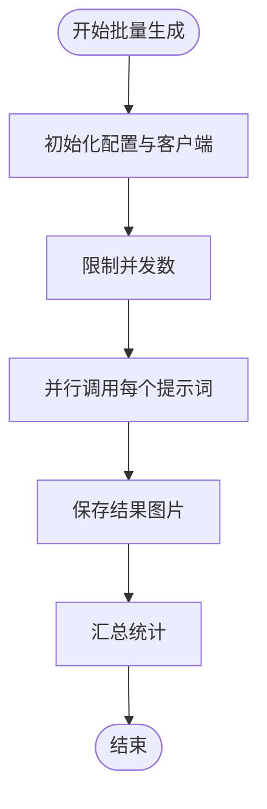
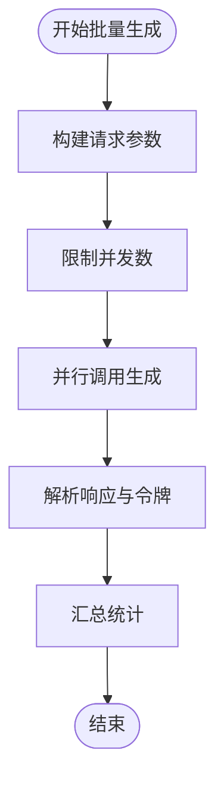
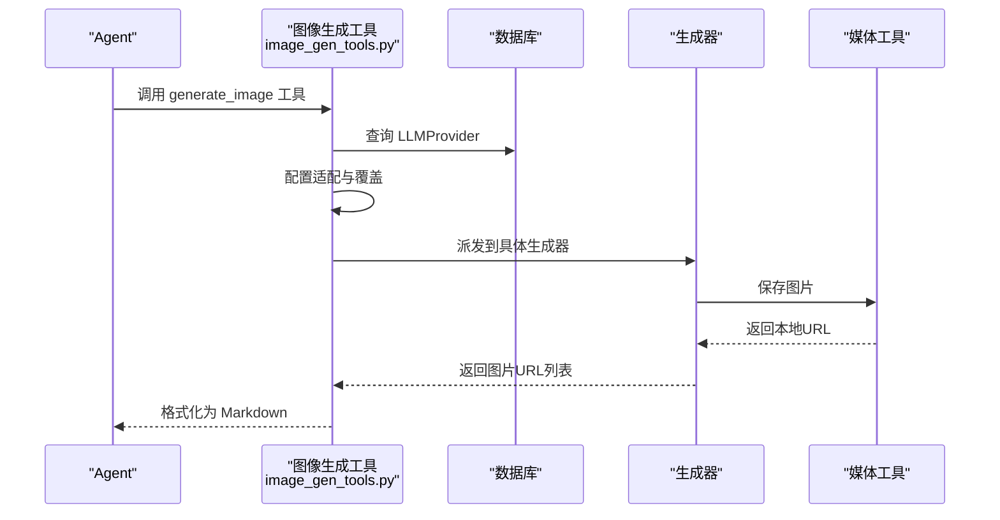
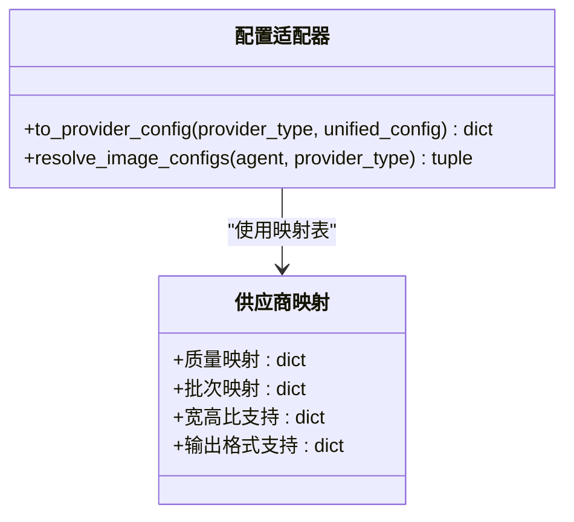
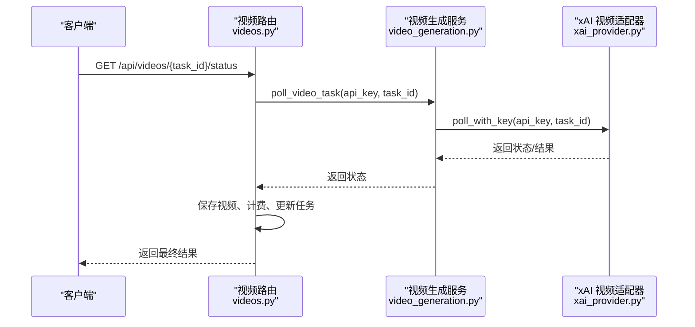
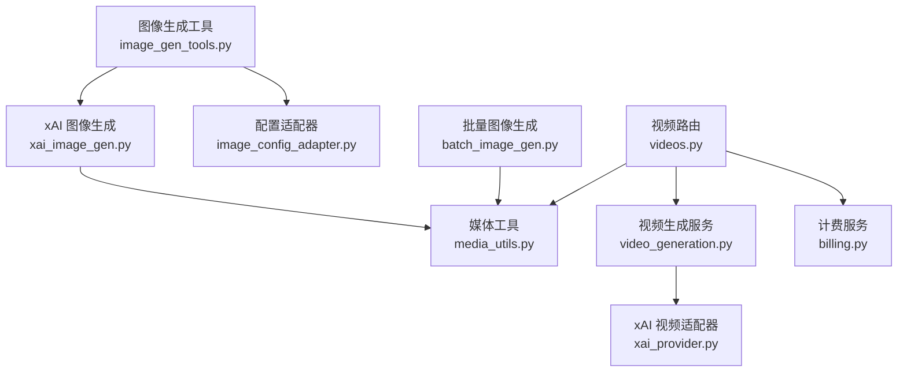

# 图像生成系统

<cite>
**本文档引用的文件**
- [xai_image_gen.py](file://backend/services/xai_image_gen.py)
- [batch_image_gen.py](file://backend/services/batch_image_gen.py)
- [image_gen_tools.py](file://backend/services/image_gen_tools.py)
- [image_config_adapter.py](file://backend/services/image_config_adapter.py)
- [media_utils.py](file://backend/services/media_utils.py)
- [billing.py](file://backend/services/billing.py)
- [videos.py](file://backend/routers/videos.py)
- [video_generation.py](file://backend/services/video_generation.py)
- [xai_provider.py](file://backend/services/video_providers/xai_provider.py)
- [models.py](file://backend/models.py)
- [schemas.py](file://backend/schemas.py)
</cite>

## 目录
1. [简介](#简介)
2. [项目结构](#项目结构)
3. [核心组件](#核心组件)
4. [架构概览](#架构概览)
5. [详细组件分析](#详细组件分析)
6. [依赖关系分析](#依赖关系分析)
7. [性能考虑](#性能考虑)
8. [故障排除指南](#故障排除指南)
9. [结论](#结论)
10. [附录](#附录)

## 简介
本项目是一个基于 FastAPI 的图像生成系统，支持多供应商（xAI、Gemini 等）的图像生成服务，提供统一的工具接口、批量处理能力、质量控制与成本计算功能。系统采用异步并发模型，结合媒体文件存储与计费模块，实现高效稳定的图像生成与管理。

## 项目结构
后端主要分为以下层次：
- 服务层：图像生成、批量处理、配置适配、媒体工具、计费等
- 路由层：FastAPI 路由，负责请求处理与响应
- 模型层：数据库模型定义
- 架构特点：模块化设计，适配器模式支持多供应商；统一配置适配器将通用配置转换为各供应商特定格式

**图表来源**
- [xai_image_gen.py:1-191](file://backend/services/xai_image_gen.py#L1-L191)
- [batch_image_gen.py:1-187](file://backend/services/batch_image_gen.py#L1-L187)
- [image_gen_tools.py:1-195](file://backend/services/image_gen_tools.py#L1-L195)
- [image_config_adapter.py:1-163](file://backend/services/image_config_adapter.py#L1-L163)
- [media_utils.py:1-79](file://backend/services/media_utils.py#L1-L79)
- [billing.py:1-200](file://backend/services/billing.py#L1-L200)
- [videos.py:1-343](file://backend/routers/videos.py#L1-L343)
- [video_generation.py:1-160](file://backend/services/video_generation.py#L1-L160)
- [xai_provider.py:1-164](file://backend/services/video_providers/xai_provider.py#L1-L164)
- [models.py:1-200](file://backend/models.py#L1-L200)
- [schemas.py:1-200](file://backend/schemas.py#L1-L200)

**章节来源**
- [xai_image_gen.py:1-191](file://backend/services/xai_image_gen.py#L1-L191)
- [batch_image_gen.py:1-187](file://backend/services/batch_image_gen.py#L1-L187)
- [image_gen_tools.py:1-195](file://backend/services/image_gen_tools.py#L1-L195)
- [image_config_adapter.py:1-163](file://backend/services/image_config_adapter.py#L1-L163)
- [media_utils.py:1-79](file://backend/services/media_utils.py#L1-L79)
- [billing.py:1-200](file://backend/services/billing.py#L1-L200)
- [videos.py:1-343](file://backend/routers/videos.py#L1-L343)
- [video_generation.py:1-160](file://backend/services/video_generation.py#L1-L160)
- [xai_provider.py:1-164](file://backend/services/video_providers/xai_provider.py#L1-L164)
- [models.py:1-200](file://backend/models.py#L1-L200)
- [schemas.py:1-200](file://backend/schemas.py#L1-L200)

## 核心组件
- xAI 图像生成服务：支持异步批量生成，参数校验与并发控制，结果保存与汇总
- 批量图像生成服务：Gemini 图像生成的并行实现，支持配置映射与令牌统计
- 图像生成工具：统一工具接口，支持跨供应商派发与配置覆盖
- 配置适配器：将统一配置转换为各供应商特定格式，避免分支判断
- 媒体工具：本地媒体文件保存与下载，支持多种图片格式
- 计费服务：多维度计费计算器，支持原子扣费与退款
- 视频生成服务：多供应商适配器统一入口，支持状态轮询与内容审核

**章节来源**
- [xai_image_gen.py:125-191](file://backend/services/xai_image_gen.py#L125-L191)
- [batch_image_gen.py:113-187](file://backend/services/batch_image_gen.py#L113-L187)
- [image_gen_tools.py:138-195](file://backend/services/image_gen_tools.py#L138-L195)
- [image_config_adapter.py:115-163](file://backend/services/image_config_adapter.py#L115-L163)
- [media_utils.py:20-79](file://backend/services/media_utils.py#L20-L79)
- [billing.py:178-200](file://backend/services/billing.py#L178-L200)
- [video_generation.py:84-160](file://backend/services/video_generation.py#L84-L160)

## 架构概览
系统采用“路由层-服务层-适配器层-外部服务”的分层架构。路由层接收请求并调用服务层；服务层通过适配器将请求路由至具体供应商；媒体工具负责本地存储；计费服务贯穿于生成流程以实现成本控制。

**图表来源**
- [videos.py:74-233](file://backend/routers/videos.py#L74-L233)
- [video_generation.py:84-160](file://backend/services/video_generation.py#L84-L160)
- [xai_provider.py:47-164](file://backend/services/video_providers/xai_provider.py#L47-L164)
- [media_utils.py:31-51](file://backend/services/media_utils.py#L31-L51)
- [billing.py:353-387](file://backend/services/billing.py#L353-L387)

**章节来源**
- [videos.py:74-233](file://backend/routers/videos.py#L74-L233)
- [video_generation.py:84-160](file://backend/services/video_generation.py#L84-L160)
- [xai_provider.py:47-164](file://backend/services/video_providers/xai_provider.py#L47-L164)
- [media_utils.py:31-51](file://backend/services/media_utils.py#L31-L51)
- [billing.py:353-387](file://backend/services/billing.py#L353-L387)

## 详细组件分析

### xAI 图像生成服务
- 功能概述：支持异步批量生成，参数校验（宽高比、分辨率），并发控制（信号量），结果保存（内联/URL）
- 关键特性：
  - 配置类：XAIBatchImageConfig 控制 aspect_ratio、resolution、n、response_format
  - 结果类：XAISingleImageResult、XAIBatchImageResult 聚合统计
  - 并发：Semaphore 限制最大并发（1-8），asyncio.gather 收集结果
  - 保存：save_inline_image、save_image_from_url
- 错误处理：捕获异常并记录日志，保证聚合结果完整性

**图表来源**
- [xai_image_gen.py:125-191](file://backend/services/xai_image_gen.py#L125-L191)

**章节来源**
- [xai_image_gen.py:30-191](file://backend/services/xai_image_gen.py#L30-L191)

### 批量图像生成服务（Gemini）
- 功能概述：Gemini 图像生成的并行实现，支持配置映射与令牌统计
- 关键特性：
  - 配置映射：aspect_ratio/auto、image_size 映射，输出格式限制
  - 请求参数：response_modalities、ImageConfig
  - 并发：Semaphore 限制并发（1-8）
  - 令牌统计：usage_metadata 中提取 input/output tokens
- 错误处理：异常包装为 SingleImageResult，保证聚合统计

**图表来源**
- [batch_image_gen.py:113-187](file://backend/services/batch_image_gen.py#L113-L187)

**章节来源**
- [batch_image_gen.py:29-187](file://backend/services/batch_image_gen.py#L29-L187)

### 图像生成工具
- 功能概述：统一工具接口，支持跨供应商派发与配置覆盖
- 关键特性：
  - 工具定义：build_image_gen_tool_def，支持 prompt、aspect_ratio、n
  - 供应商派发：_IMAGE_GENERATORS 映射到具体生成器
  - 配置适配：to_provider_config 将统一配置转换为供应商特定格式
  - 结果格式化：Markdown 图片引用
- 权限与校验：检查 agent 的 image_config、provider 可用性与模型合法性

**图表来源**
- [image_gen_tools.py:138-195](file://backend/services/image_gen_tools.py#L138-L195)
- [image_config_adapter.py:115-163](file://backend/services/image_config_adapter.py#L115-L163)
- [media_utils.py:20-29](file://backend/services/media_utils.py#L20-L29)

**章节来源**
- [image_gen_tools.py:41-195](file://backend/services/image_gen_tools.py#L41-L195)
- [image_config_adapter.py:115-163](file://backend/services/image_config_adapter.py#L115-L163)
- [media_utils.py:20-29](file://backend/services/media_utils.py#L20-L29)

### 配置适配器
- 功能概述：将统一配置转换为各供应商特定格式，避免 if-else 分支
- 关键特性：
  - 质量映射：Gemini 与 xAI 的 quality → resolution/image_size
  - 批次映射：batch_count → batch_count/n，限制最大值
  - 宽高比支持：供应商支持集合与默认值
  - 输出格式：Gemini 支持 png/jpeg/webp，xAI 不支持自定义格式
- 解析函数：resolve_image_configs 支持统一配置优先级

**图表来源**
- [image_config_adapter.py:115-163](file://backend/services/image_config_adapter.py#L115-L163)

**章节来源**
- [image_config_adapter.py:11-163](file://backend/services/image_config_adapter.py#L11-L163)

### 媒体工具
- 功能概述：本地媒体文件保存与下载
- 关键特性：
  - 保存内联图片：save_inline_image，自动推断 MIME 并生成唯一文件名
  - 保存远程图片：save_image_from_url，通过 Content-Type 推断 MIME
  - 保存视频：save_video_from_url，支持可选请求头（如 Gemini 需要 x-goog-api-key）

**章节来源**
- [media_utils.py:20-79](file://backend/services/media_utils.py#L20-L79)

### 计费服务
- 功能概述：多维度计费计算器，支持原子扣费与退款
- 关键特性：
  - 维度映射：输入、文本输出、图像输出、搜索、图像生成等
  - 视频计费：按输入图片数量、输出时长与质量维度计费
  - 原子操作：deduct_credits_atomic 使用 UPDATE ... WHERE 确保并发安全
  - 余额检查：check_balance_sufficient 支持冻结账户检查

**章节来源**
- [billing.py:12-200](file://backend/services/billing.py#L12-L200)
- [billing.py:353-387](file://backend/services/billing.py#L353-L387)

### 视频生成服务与路由
- 功能概述：多供应商适配器统一入口，支持状态轮询与内容审核
- 关键特性：
  - 适配器注册：XAIVideoAdapter、MiniMaxVideoAdapter、GeminiVeoAdapter
  - 提交与轮询：submit_video_task、poll_video_task
  - 路由集成：videos.py 提交任务、轮询状态、保存视频、计费与插入聊天消息
  - 内容审核：xAI 适配器在完成时检查 moderation

**图表来源**
- [videos.py:149-233](file://backend/routers/videos.py#L149-L233)
- [video_generation.py:101-124](file://backend/services/video_generation.py#L101-L124)
- [xai_provider.py:105-164](file://backend/services/video_providers/xai_provider.py#L105-L164)

**章节来源**
- [videos.py:149-233](file://backend/routers/videos.py#L149-L233)
- [video_generation.py:84-160](file://backend/services/video_generation.py#L84-L160)
- [xai_provider.py:47-164](file://backend/services/video_providers/xai_provider.py#L47-L164)

## 依赖关系分析
- 组件耦合：
  - image_gen_tools 依赖 xai_image_gen 与 image_config_adapter，体现“定义-执行-派发”模式
  - xai_image_gen 与 batch_image_gen 依赖 media_utils 进行本地存储
  - videos.py 依赖 video_generation 与 xai_provider，以及 billing 与 media_utils
- 外部依赖：
  - xAI：OpenAI SDK（异步客户端）、HTTPX
  - Gemini：Google GenAI SDK、HTTPX
  - FastAPI：路由与依赖注入
- 循环依赖：未发现循环依赖，模块职责清晰

**图表来源**
- [image_gen_tools.py:1-195](file://backend/services/image_gen_tools.py#L1-L195)
- [xai_image_gen.py:1-191](file://backend/services/xai_image_gen.py#L1-L191)
- [batch_image_gen.py:1-187](file://backend/services/batch_image_gen.py#L1-L187)
- [media_utils.py:1-79](file://backend/services/media_utils.py#L1-L79)
- [videos.py:1-343](file://backend/routers/videos.py#L1-L343)
- [video_generation.py:1-160](file://backend/services/video_generation.py#L1-L160)
- [xai_provider.py:1-164](file://backend/services/video_providers/xai_provider.py#L1-L164)
- [billing.py:1-200](file://backend/services/billing.py#L1-L200)

**章节来源**
- [image_gen_tools.py:1-195](file://backend/services/image_gen_tools.py#L1-L195)
- [xai_image_gen.py:1-191](file://backend/services/xai_image_gen.py#L1-L191)
- [batch_image_gen.py:1-187](file://backend/services/batch_image_gen.py#L1-L187)
- [media_utils.py:1-79](file://backend/services/media_utils.py#L1-L79)
- [videos.py:1-343](file://backend/routers/videos.py#L1-L343)
- [video_generation.py:1-160](file://backend/services/video_generation.py#L1-L160)
- [xai_provider.py:1-164](file://backend/services/video_providers/xai_provider.py#L1-L164)
- [billing.py:1-200](file://backend/services/billing.py#L1-L200)

## 性能考虑
- 并发控制：使用 asyncio.Semaphore 限制最大并发（1-8），避免过度占用外部 API 速率限制
- 异步 I/O：使用 httpx.AsyncClient 与 OpenAI 异步客户端，提升网络请求吞吐
- 结果聚合：使用 asyncio.gather 并行收集任务结果，减少等待时间
- 存储优化：媒体文件采用唯一 UUID 命名，避免冲突；批量生成时尽量复用保存逻辑
- 计费优化：计费维度映射表驱动，避免 if-else 分支，提升计算效率

## 故障排除指南
- 并发过高导致超时：调整 max_concurrent 参数，确保不超过供应商限流
- 内容审核拒绝：xAI 适配器在完成时检查 moderation，若拒绝则标记失败并记录原因
- 余额不足：check_balance_sufficient 抛出 BalanceFrozenError 或返回 False，需先充值或解冻
- 文件保存失败：media_utils 中的保存函数抛出异常时，检查 MIME 推断与目录权限
- 轮询超时：videos.py 中对 pending 且带错误的任务超过 300 秒判定失败

**章节来源**
- [xai_provider.py:139-157](file://backend/services/video_providers/xai_provider.py#L139-L157)
- [billing.py:45-84](file://backend/services/billing.py#L45-L84)
- [media_utils.py:20-79](file://backend/services/media_utils.py#L20-L79)
- [videos.py:179-183](file://backend/routers/videos.py#L179-L183)

## 结论
该图像生成系统通过模块化设计与适配器模式实现了多供应商统一接入，配合异步并发与本地媒体存储，提供了稳定高效的图像生成能力。统一配置适配器与计费服务进一步提升了系统的可维护性与可控性。建议在生产环境中合理设置并发参数、监控供应商限流与内容审核策略，并定期清理本地媒体文件以控制存储空间。

## 附录

### 使用示例（路径引用）
- 单张图像生成（xAI）
  - 调用路径：[xai_image_gen.py:125-191](file://backend/services/xai_image_gen.py#L125-L191)
  - 配置说明：aspect_ratio、resolution、n、response_format
- 批量图像生成（Gemini）
  - 调用路径：[batch_image_gen.py:113-187](file://backend/services/batch_image_gen.py#L113-L187)
  - 配置说明：aspect_ratio、image_size、output_format、google_search_enabled
- 异步任务管理（视频）
  - 提交任务：[videos.py:74-147](file://backend/routers/videos.py#L74-L147)
  - 轮询状态：[videos.py:149-233](file://backend/routers/videos.py#L149-L233)
  - 适配器轮询：[xai_provider.py:113-164](file://backend/services/video_providers/xai_provider.py#L113-L164)

### 参数与配置要点
- 宽高比枚举：统一支持 auto、1:1、16:9、9:16、4:3、3:4、3:2、2:3、2:1、1:2、19.5:9、9:19.5、20:9、9:20
- 分辨率/尺寸：xAI 支持 1k/2k；Gemini 支持 4K/2K/1024/512/auto
- 批次上限：xAI n ≤ 10；Gemini batch_count ≤ 8
- 输出格式：Gemini 支持 png/jpeg/webp；xAI 不支持自定义格式