# 图像生成系统

<cite>
**本文档引用的文件**
- [ImageGenConfigDialog.tsx](file://backend/admin/src/components/admin/tools/ImageGenConfigDialog.tsx)
- [image_config_adapter.py](file://backend/services/image_config_adapter.py)
- [image_gen.py](file://backend/services/tool_manager/providers/image_gen.py)
- [image_edit.py](file://backend/services/tool_manager/providers/image_edit.py)
- [video_gen.py](file://backend/services/tool_manager/providers/video_gen.py)
- [context.py](file://backend/services/tool_manager/context.py)
- [useToolRegistry.ts](file://backend/admin/src/hooks/useToolRegistry.ts)
- [Parameters.tsx](file://backend/admin/src/components/admin/agents/Parameters.tsx)
- [index.ts](file://backend/admin/src/types/index.ts)
- [b2c3d4e5f6g7_add_unified_image_config_to_agents.py](file://backend/migrations/versions/b2c3d4e5f6g7_add_unified_image_config_to_agents.py)
- [a1b2c3d4e5f6_add_xai_image_config_to_agents.py](file://backend/migrations/versions/a1b2c3d4e5f6_add_xai_image_config_to_agents.py)
- [schemas.py](file://backend/schemas.py)
- [xai_image_gen.py](file://backend/services/xai_image_gen.py)
- [batch_image_gen.py](file://backend/services/batch_image_gen.py)
- [media_utils.py](file://backend/services/media_utils.py)
- [billing.py](file://backend/services/billing.py)
- [videos.py](file://backend/routers/videos.py)
- [video_generation.py](file://backend/services/video_generation.py)
- [xai_provider.py](file://backend/services/video_providers/xai_provider.py)
- [model_capabilities.py](file://backend/services/video_providers/model_capabilities.py)
- [llm_config.py](file://backend/routers/llm_config.py)
- [models.py](file://backend/models.py)
- [admin_tools.py](file://backend/routers/admin_tools.py)
- [manager.py](file://backend/services/tool_manager/manager.py)
- [__init__.py](file://backend/services/tool_manager/providers/__init__.py)
- [gemini_provider.py](file://backend/services/video_providers/gemini_provider.py)
- [e1f2a3b4c5d6_add_gemini_config.py](file://backend/migrations/versions/e1f2a3b4c5d6_add_gemini_config.py)
- [Gemini3nanobanana2图像理解和图像生成文档.md](file://Gemini3nanobanana2图像理解和图像生成文档.md)
- [gork图像理解和图像生成文档.md](file://gork图像理解和图像生成文档.md)
</cite>

## 更新摘要
**所做更改**
- 新增完整的视频生成系统，作为独立的工具系统与图像生成系统并列存在
- 视频生成系统支持多供应商适配器（xAI、MiniMax、Gemini），提供统一的工具接口
- 新增视频生成工具，支持文本到视频、图像到视频、视频编辑等多种模式
- 扩展工具管理系统，支持视频生成工具的动态定义和执行
- 新增视频任务追踪和计费系统，支持异步视频生成和成本控制
- 扩展前端配置，支持视频生成的全局配置管理和工具注册

## 目录
1. [简介](#简介)
2. [项目结构](#项目结构)
3. [核心组件](#核心组件)
4. [架构概览](#架构概览)
5. [详细组件分析](#详细组件分析)
6. [视频生成系统](#视频生成系统)
7. [Gemini图像生成功能](#gemini图像生成功能)
8. [依赖关系分析](#依赖关系分析)
9. [性能考虑](#性能考虑)
10. [故障排除指南](#故障排除指南)
11. [结论](#结论)
12. [附录](#附录)

## 简介
本项目是一个基于FastAPI的多模态生成系统，现已重构为支持统一配置系统的多供应商图像生成服务和独立的视频生成系统。系统采用统一的UnifiedImageGenConfig配置格式，支持动态供应商能力检测，提供统一的工具接口、批量处理能力、质量控制与成本计算功能。系统现已新增完整的Gemini Nano Banana图像生成功能，支持文本到图像、图像编辑、多轮编辑等高级功能，涵盖多种编程语言的完整示例。同时，视频生成系统作为独立的工具系统集成，支持多供应商适配器（xAI、MiniMax、Gemini），提供统一的视频生成工具接口和异步任务管理。

**更新** 新增完整的视频生成系统，支持多供应商适配器（xAI、MiniMax、Gemini），提供统一的视频生成工具接口和异步任务管理，与图像生成系统并列存在。

## 项目结构
后端主要分为以下层次：
- 服务层：图像生成、批量处理、配置适配、媒体工具、计费、视频生成等
- 路由层：FastAPI路由，负责请求处理与响应
- 模型层：数据库模型定义，包含视频任务追踪
- 工具管理层：统一工具注册表、动态工具定义构建、执行调度
- 架构特点：模块化设计，适配器模式支持多供应商；统一配置适配器将通用配置转换为各供应商特定格式；动态供应商能力检测

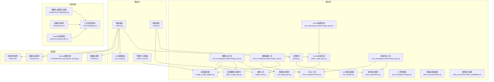

**图表来源**
- [xai_image_gen.py:1-191](file://backend/services/xai_image_gen.py#L1-L191)
- [batch_image_gen.py:1-187](file://backend/services/batch_image_gen.py#L1-L187)
- [image_gen.py:1-293](file://backend/services/tool_manager/providers/image_gen.py#L1-L293)
- [image_edit.py:1-351](file://backend/services/tool_manager/providers/image_edit.py#L1-L351)
- [image_config_adapter.py:1-211](file://backend/services/image_config_adapter.py#L1-L211)
- [media_utils.py:1-79](file://backend/services/media_utils.py#L1-L79)
- [billing.py:1-200](file://backend/services/billing.py#L1-L200)
- [videos.py:1-343](file://backend/routers/videos.py#L1-L343)
- [video_generation.py:1-160](file://backend/services/video_generation.py#L1-L160)
- [xai_provider.py:1-164](file://backend/services/video_providers/xai_provider.py#L1-L164)
- [context.py:1-85](file://backend/services/tool_manager/context.py#L1-L85)
- [manager.py:1-108](file://backend/services/tool_manager/manager.py#L1-L108)
- [llm_config.py:1-233](file://backend/routers/llm_config.py#L1-L233)
- [ImageGenConfigDialog.tsx:1-288](file://backend/admin/src/components/admin/tools/ImageGenConfigDialog.tsx#L1-L288)
- [useToolRegistry.ts:1-59](file://backend/admin/src/hooks/useToolRegistry.ts#L1-L59)
- [Parameters.tsx:1-324](file://backend/admin/src/components/admin/agents/Parameters.tsx#L1-L324)
- [admin_tools.py:1-258](file://backend/routers/admin_tools.py#L1-L258)
- [gemini_provider.py:1-276](file://backend/services/video_providers/gemini_provider.py#L1-L276)
- [e1f2a3b4c5d6_add_gemini_config.py:1-41](file://backend/migrations/versions/e1f2a3b4c5d6_add_gemini_config.py#L1-L41)
- [video_gen.py:1-334](file://backend/services/tool_manager/providers/video_gen.py#L1-L334)
- [video_providers/base.py:1-121](file://backend/services/video_providers/base.py#L1-L121)
- [video_providers/model_capabilities.py:1-347](file://backend/services/video_providers/model_capabilities.py#L1-L347)

**章节来源**
- [xai_image_gen.py:1-191](file://backend/services/xai_image_gen.py#L1-L191)
- [batch_image_gen.py:1-187](file://backend/services/batch_image_gen.py#L1-L187)
- [image_gen.py:1-293](file://backend/services/tool_manager/providers/image_gen.py#L1-L293)
- [image_edit.py:1-351](file://backend/services/tool_manager/providers/image_edit.py#L1-L351)
- [image_config_adapter.py:1-211](file://backend/services/image_config_adapter.py#L1-L211)
- [media_utils.py:1-79](file://backend/services/media_utils.py#L1-L79)
- [billing.py:1-200](file://backend/services/billing.py#L1-L200)
- [videos.py:1-343](file://backend/routers/videos.py#L1-L343)
- [video_generation.py:1-160](file://backend/services/video_generation.py#L1-L160)
- [xai_provider.py:1-164](file://backend/services/video_providers/xai_provider.py#L1-L164)
- [context.py:1-85](file://backend/services/tool_manager/context.py#L1-L85)
- [manager.py:1-108](file://backend/services/tool_manager/manager.py#L1-L108)
- [llm_config.py:1-233](file://backend/routers/llm_config.py#L1-L233)
- [ImageGenConfigDialog.tsx:1-288](file://backend/admin/src/components/admin/tools/ImageGenConfigDialog.tsx#L1-L288)
- [useToolRegistry.ts:1-59](file://backend/admin/src/hooks/useToolRegistry.ts#L1-L59)
- [Parameters.tsx:1-324](file://backend/admin/src/components/admin/agents/Parameters.tsx#L1-L324)
- [admin_tools.py:1-258](file://backend/routers/admin_tools.py#L1-L258)
- [gemini_provider.py:1-276](file://backend/services/video_providers/gemini_provider.py#L1-L276)
- [e1f2a3b4c5d6_add_gemini_config.py:1-41](file://backend/migrations/versions/e1f2a3b4c5d6_add_gemini_config.py#L1-L41)
- [video_gen.py:1-334](file://backend/services/tool_manager/providers/video_gen.py#L1-L334)
- [video_providers/base.py:1-121](file://backend/services/video_providers/base.py#L1-L121)
- [video_providers/model_capabilities.py:1-347](file://backend/services/video_providers/model_capabilities.py#L1-L347)

## 核心组件
- **统一图像生成配置系统**：引入UnifiedImageGenConfig统一格式，支持供应商无关的配置管理
- **动态供应商能力检测**：前端通过API端点动态获取供应商能力信息，实现智能配置界面
- **增强的图像生成工具**：支持统一配置格式，通过适配器转换为供应商特定格式
- **新增图像编辑工具**：支持图像编辑功能，与图像生成共享全局配置
- **增强的配置适配器**：支持统一配置到多供应商格式的转换，包含能力映射和验证
- **工具上下文管理**：提供延迟解析的图像供应商类型解析，支持缓存机制
- **工具管理器**：统一工具注册表，支持动态工具定义构建和缓存机制
- **扩展的前端组件**：支持动态供应商选择、能力展示和智能配置
- **数据库迁移支持**：新增统一配置字段，移除特定供应商配置
- **图像生成配置对话框**：提供直观的配置界面，支持动态能力检测和实时配置
- **图像供应商能力API**：提供动态能力获取接口，支持前端智能配置
- **全局工具配置管理**：支持工具级别的全局配置管理
- **Gemini图像生动生成功能**：新增完整的Gemini Nano Banana图像生成功能，支持文本到图像、图像编辑、多轮编辑
- **Gemini批量生成服务**：支持Gemini的并行调用和配置管理
- **Gemini配置迁移**：支持thinking_level和image_config字段的迁移
- **多语言示例支持**：提供Python、JavaScript、Go、Java、REST API的完整示例
- **视频生成系统**：作为独立工具系统，支持多供应商适配器（xAI、MiniMax、Gemini）
- **视频生成工具**：支持文本到视频、图像到视频、视频编辑等多种模式
- **视频任务追踪**：异步视频生成任务管理，支持状态轮询和结果处理
- **视频计费系统**：基于输入输出维度的视频生成成本计算
- **视频适配器基类**：统一视频生成接口定义，支持多供应商适配
- **模型能力配置**：视频模型能力映射表，支持动态参数枚举生成

**章节来源**
- [image_config_adapter.py:1-211](file://backend/services/image_config_adapter.py#L1-L211)
- [image_gen.py:171-200](file://backend/services/tool_manager/providers/image_gen.py#L171-L200)
- [image_edit.py:82-351](file://backend/services/tool_manager/providers/image_edit.py#L82-L351)
- [context.py:56-85](file://backend/services/tool_manager/context.py#L56-L85)
- [ImageGenConfigDialog.tsx:42-132](file://backend/admin/src/components/admin/tools/ImageGenConfigDialog.tsx#L42-L132)
- [b2c3d4e5f6g7_add_unified_image_config_to_agents.py:21-27](file://backend/migrations/versions/b2c3d4e5f6g7_add_unified_image_config_to_agents.py#L21-L27)
- [admin_tools.py:189-258](file://backend/routers/admin_tools.py#L189-L258)
- [manager.py:1-108](file://backend/services/tool_manager/manager.py#L1-L108)
- [gemini_provider.py:1-276](file://backend/services/video_providers/gemini_provider.py#L1-L276)
- [e1f2a3b4c5d6_add_gemini_config.py:21-35](file://backend/migrations/versions/e1f2a3b4c5d6_add_gemini_config.py#L21-L35)
- [video_gen.py:1-334](file://backend/services/tool_manager/providers/video_gen.py#L1-L334)
- [video_generation.py:1-160](file://backend/services/video_generation.py#L1-L160)
- [video_providers/base.py:1-121](file://backend/services/video_providers/base.py#L1-L121)
- [video_providers/model_capabilities.py:1-347](file://backend/services/video_providers/model_capabilities.py#L1-L347)

## 架构概览
系统采用"路由层-服务层-适配器层-外部服务"的分层架构，现已扩展为支持统一配置的动态架构。路由层接收请求并调用服务层；服务层通过适配器将请求路由至具体供应商；媒体工具负责本地存储；计费服务贯穿于生成流程以实现成本控制；前端通过钩子动态获取供应商能力和配置信息；工具管理器统一协调所有工具提供者。视频生成系统作为独立工具系统，与图像生成系统并列存在，共享相同的工具管理架构。

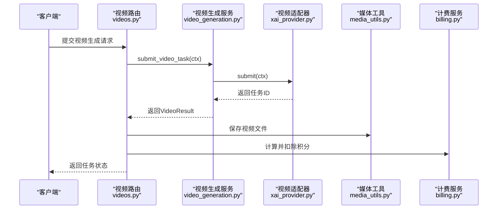

**图表来源**
- [videos.py:74-146](file://backend/routers/videos.py#L74-L146)
- [video_generation.py:85-95](file://backend/services/video_generation.py#L85-L95)
- [xai_provider.py:62-134](file://backend/services/video_providers/xai_provider.py#L62-L134)
- [media_utils.py:31-51](file://backend/services/media_utils.py#L31-L51)
- [billing.py:353-387](file://backend/services/billing.py#L353-L387)

**章节来源**
- [videos.py:74-146](file://backend/routers/videos.py#L74-L146)
- [video_generation.py:85-95](file://backend/services/video_generation.py#L85-L95)
- [xai_provider.py:62-134](file://backend/services/video_providers/xai_provider.py#L62-L134)
- [media_utils.py:31-51](file://backend/services/media_utils.py#L31-L51)
- [billing.py:353-387](file://backend/services/billing.py#L353-L387)

## 详细组件分析

### 统一图像生成配置系统
- **功能概述**：引入UnifiedImageGenConfig统一格式，支持供应商无关的配置管理
- **关键特性**：
  - 统一配置结构：image_generation_enabled、image_provider_id、image_model、image_config
  - 前端类型定义：TypeScript接口支持类型安全的配置管理
  - 后端Schema验证：Zod Schema确保配置的有效性和一致性
  - 动态供应商解析：支持运行时供应商类型检测和配置转换
  - 全局配置管理：支持工具级别的全局配置存储和缓存

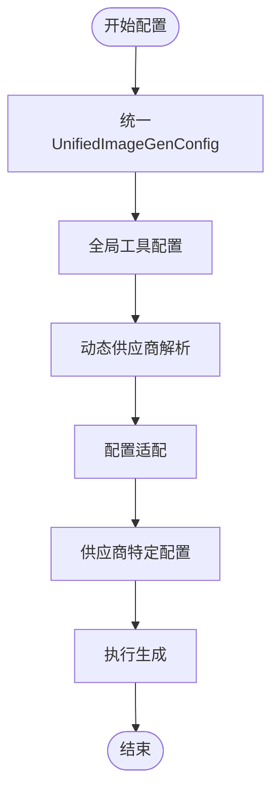

**图表来源**
- [index.ts:14-26](file://backend/admin/src/types/index.ts#L14-L26)
- [schemas.py:220-226](file://backend/schemas.py#L220-L226)
- [context.py:57-67](file://backend/services/tool_manager/context.py#L57-L67)

**章节来源**
- [index.ts:14-26](file://backend/admin/src/types/index.ts#L14-L26)
- [schemas.py:220-226](file://backend/schemas.py#L220-L226)
- [context.py:57-67](file://backend/services/tool_manager/context.py#L57-L67)

### 动态供应商能力检测
- **功能概述**：前端通过API端点动态获取供应商能力信息，实现智能配置界面
- **关键特性**：
  - 能力钩子：useImageCapabilities提供实时能力数据
  - 动态配置：根据供应商能力动态渲染配置选项
  - 智能限制：根据供应商支持的能力限制用户输入
  - 实时更新：供应商能力变化时自动更新界面
  - 能力缓存：前端SWR缓存供应商能力信息

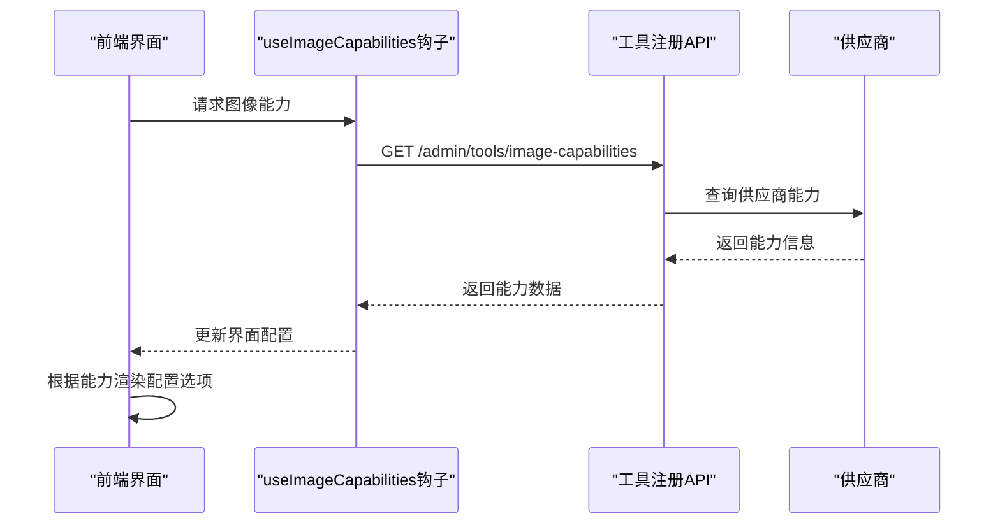

**图表来源**
- [useToolRegistry.ts:31-37](file://backend/admin/src/hooks/useToolRegistry.ts#L31-L37)
- [ImageGenConfigDialog.tsx:98-101](file://backend/admin/src/components/admin/tools/ImageGenConfigDialog.tsx#L98-L101)

**章节来源**
- [useToolRegistry.ts:31-37](file://backend/admin/src/hooks/useToolRegistry.ts#L31-L37)
- [ImageGenConfigDialog.tsx:98-101](file://backend/admin/src/components/admin/tools/ImageGenConfigDialog.tsx#L98-L101)

### 图像生成配置对话框
- **功能概述**：提供统一的图像生成配置界面，支持动态供应商选择和能力检测
- **关键特性**：
  - 完整配置界面：支持启用开关、供应商选择、模型选择、参数配置
  - 动态能力检测：根据供应商能力动态显示可用选项
  - 实时验证：支持配置验证和错误提示
  - 状态管理：支持加载状态、保存状态和错误状态
  - 多语言支持：提供中文标签和占位符
  - 批量配置：支持批量生成数量的智能配置

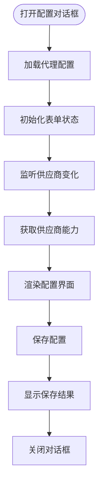

**图表来源**
- [ImageGenConfigDialog.tsx:71-81](file://backend/admin/src/components/admin/tools/ImageGenConfigDialog.tsx#L71-L81)
- [ImageGenConfigDialog.tsx:98-101](file://backend/admin/src/components/admin/tools/ImageGenConfigDialog.tsx#L98-L101)
- [ImageGenConfigDialog.tsx:103-130](file://backend/admin/src/components/admin/tools/ImageGenConfigDialog.tsx#L103-L130)

**章节来源**
- [ImageGenConfigDialog.tsx:1-288](file://backend/admin/src/components/admin/tools/ImageGenConfigDialog.tsx#L1-L288)

### 增强的图像生成工具
- **功能概述**：支持统一配置格式，通过适配器转换为供应商特定格式
- **关键特性**：
  - 统一工具定义：build_image_gen_tool_def支持动态供应商特定的工具定义
  - 供应商派发：_IMAGE_GENERATORS映射到具体生成器
  - 配置适配：to_provider_config将统一配置转换为供应商特定格式
  - 上下文解析：ToolContext提供延迟解析的供应商类型
  - 结果格式化：支持多种输出格式的统一处理
  - 全局配置支持：从ToolConfig表读取全局图像生成配置

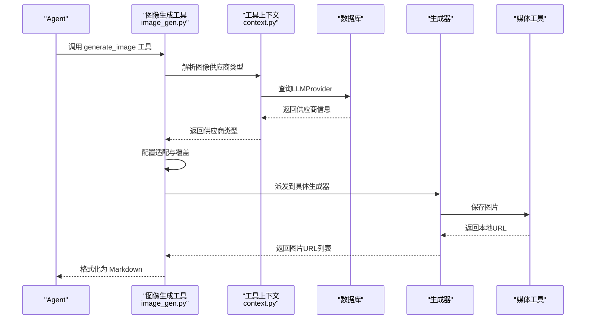

**图表来源**
- [image_gen.py:177-209](file://backend/services/tool_manager/providers/image_gen.py#L177-L209)
- [context.py:69-85](file://backend/services/tool_manager/context.py#L69-L85)

**章节来源**
- [image_gen.py:177-209](file://backend/services/tool_manager/providers/image_gen.py#L177-L209)
- [context.py:69-85](file://backend/services/tool_manager/context.py#L69-L85)

### 新增图像编辑工具
- **功能概述**：支持图像编辑功能，与图像生成共享全局配置
- **关键特性**：
  - 统一工具定义：支持编辑图像的工具定义
  - 多格式支持：支持公共URL、data URL和本地文件
  - 供应商派发：支持不同供应商的图像编辑处理
  - 共享配置：与图像生成工具共享全局配置
  - 结果处理：支持编辑后的图像URL格式化

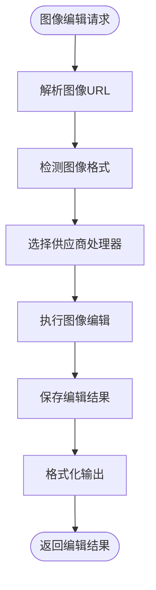

**图表来源**
- [image_edit.py:43-76](file://backend/services/tool_manager/providers/image_edit.py#L43-L76)
- [image_edit.py:267-298](file://backend/services/tool_manager/providers/image_edit.py#L267-L298)

**章节来源**
- [image_edit.py:82-351](file://backend/services/tool_manager/providers/image_edit.py#L82-L351)

### 增强的配置适配器
- **功能概述**：支持统一配置到多供应商格式的转换，包含能力映射和验证
- **关键特性**：
  - 统一质量映射：Gemini与xAI的质量→分辨率映射
  - 批次映射：batch_count→不同供应商的批次字段映射
  - 能力验证：支持供应商能力集合的验证和默认值处理
  - 输出格式支持：动态支持不同供应商的输出格式
  - 能力配置：IMAGE_PROVIDER_CAPABILITIES提供供应商能力信息
  - 全局配置解析：支持全局工具配置的解析和合并

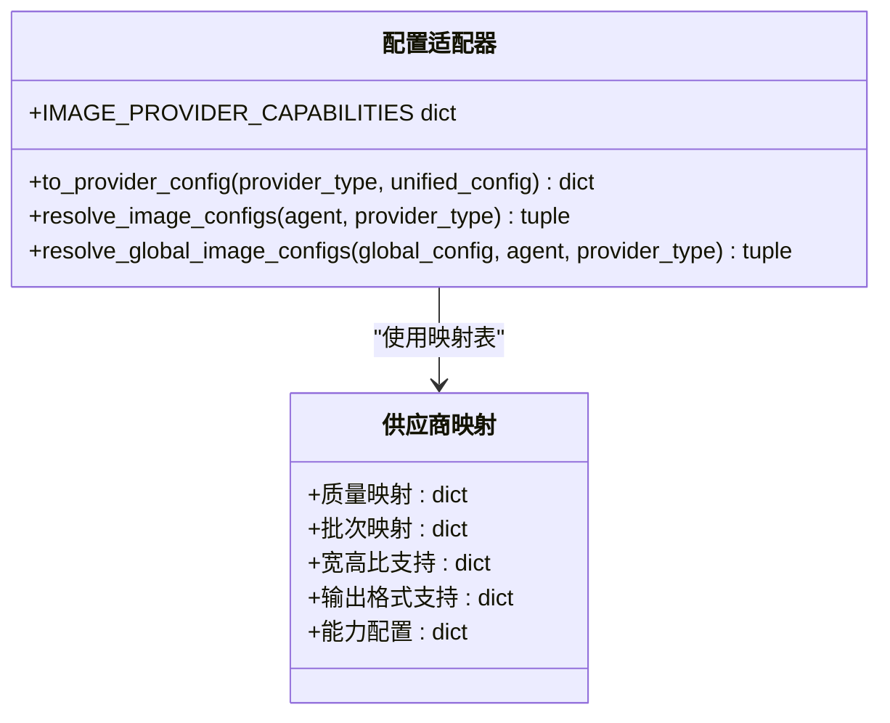

**图表来源**
- [image_config_adapter.py:134-211](file://backend/services/image_config_adapter.py#L134-L211)

**章节来源**
- [image_config_adapter.py:134-211](file://backend/services/image_config_adapter.py#L134-L211)

### 工具上下文管理
- **功能概述**：提供延迟解析的图像供应商类型解析，支持缓存机制
- **关键特性**：
  - 延迟解析：resolve_image_provider_type支持延迟解析供应商类型
  - 缓存机制：_image_provider_type缓存解析结果
  - 全局配置缓存：get_global_image_config支持全局配置缓存
  - 数据库集成：从LLMProvider表解析供应商信息
  - 不可变上下文：ToolContext提供不可变的执行上下文

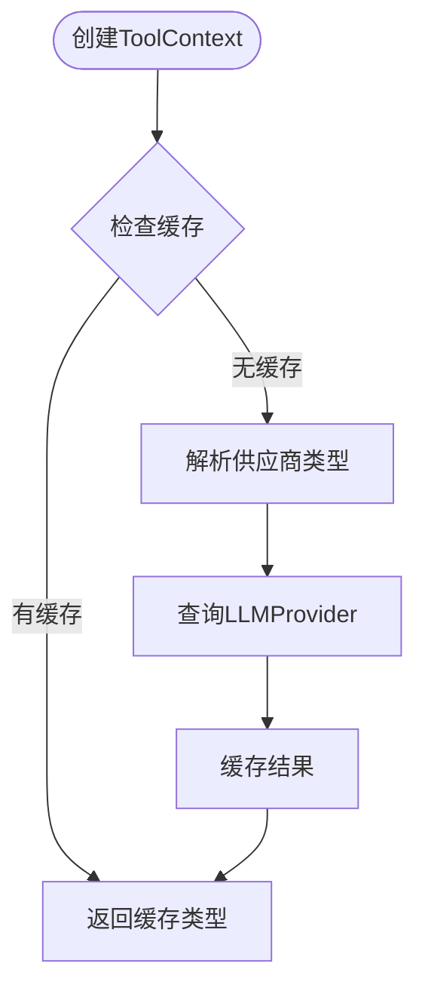

**图表来源**
- [context.py:69-85](file://backend/services/tool_manager/context.py#L69-L85)

**章节来源**
- [context.py:69-85](file://backend/services/tool_manager/context.py#L69-L85)

### 工具管理器
- **功能概述**：统一工具注册表，支持动态工具定义构建和缓存机制
- **关键特性**：
  - 统一注册：集中管理所有工具提供者
  - 动态定义：支持运行时构建工具定义
  - 缓存机制：缓存工具定义以提高性能
  - 执行调度：统一工具执行分发
  - 注册表API：提供工具注册表查询接口

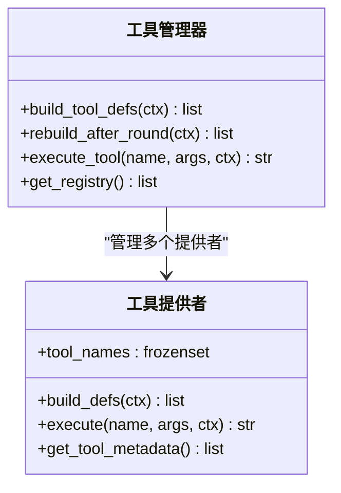

**图表来源**
- [manager.py:23-108](file://backend/services/tool_manager/manager.py#L23-L108)

**章节来源**
- [manager.py:23-108](file://backend/services/tool_manager/manager.py#L23-L108)

### 媒体工具
- **功能概述**：本地媒体文件保存与下载
- **关键特性**：
  - 保存内联图片：save_inline_image，自动推断 MIME 并生成唯一文件名
  - 保存远程图片：save_image_from_url，通过 Content-Type 推断 MIME
  - 保存视频：save_video_from_url，支持可选请求头（如 Gemini 需要 x-goog-api-key）

**章节来源**
- [media_utils.py:20-79](file://backend/services/media_utils.py#L20-L79)

### 计费服务
- **功能概述**：多维度计费计算器，支持原子扣费与退款
- **关键特性**：
  - 维度映射：输入、文本输出、图像输出、搜索、图像生成等
  - 视频计费：按输入图片数量、输出时长与质量维度计费
  - 原子操作：deduct_credits_atomic 使用 UPDATE ... WHERE 确保并发安全
  - 余额检查：check_balance_sufficient 支持冻结账户检查

**章节来源**
- [billing.py:12-200](file://backend/services/billing.py#L12-L200)
- [billing.py:353-387](file://backend/services/billing.py#L353-L387)

### 视频生成服务与路由
- **功能概述**：多供应商适配器统一入口，支持状态轮询与内容审核
- **关键特性**：
  - 适配器注册：XAIVideoAdapter、MiniMaxVideoAdapter、GeminiVeoAdapter
  - 提交与轮询：submit_video_task、poll_video_task
  - 路由集成：videos.py 提交任务、轮询状态、保存视频、计费与插入聊天消息
  - 内容审核：xAI 适配器在完成时检查 moderation

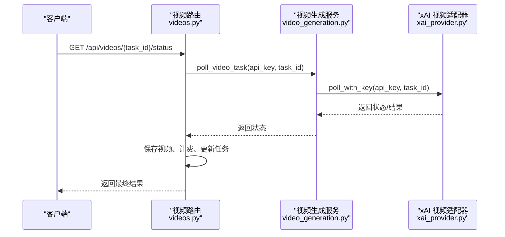

**图表来源**
- [videos.py:149-233](file://backend/routers/videos.py#L149-L233)
- [video_generation.py:101-124](file://backend/services/video_generation.py#L101-L124)
- [xai_provider.py:105-164](file://backend/services/video_providers/xai_provider.py#L105-L164)

**章节来源**
- [videos.py:149-233](file://backend/routers/videos.py#L149-L233)
- [video_generation.py:84-160](file://backend/services/video_generation.py#L84-L160)
- [xai_provider.py:47-164](file://backend/services/video_providers/xai_provider.py#L47-L164)

### 数据库迁移支持
- **功能概述**：支持统一配置字段，移除特定供应商配置
- **关键特性**：
  - 新增统一配置字段：image_config JSON 字段
  - 移除特定供应商配置：xai_image_config 字段
  - 保持向后兼容：支持统一配置与传统配置共存

**章节来源**
- [b2c3d4e5f6g7_add_unified_image_config_to_agents.py:21-27](file://backend/migrations/versions/b2c3d4e5f6g7_add_unified_image_config_to_agents.py#L21-L27)
- [a1b2c3d4e5f6_add_xai_image_config_to_agents.py:21-31](file://backend/migrations/versions/a1b2c3d4e5f6_add_xai_image_config_to_agents.py#L21-L31)

### 图像供应商能力API
- **功能概述**：提供动态图像供应商能力获取接口
- **关键特性**：
  - 能力查询：GET /api/admin/tools/image-capabilities
  - 实时能力：返回当前系统支持的所有供应商能力信息
  - 能力结构：包含宽高比、画质、输出格式、批量限制等
  - 缓存优化：能力信息静态定义，无需实时查询

**章节来源**
- [admin_tools.py:191-196](file://backend/routers/admin_tools.py#L191-L196)

### 全局工具配置管理
- **功能概述**：支持工具级别的全局配置管理
- **关键特性**：
  - 配置查询：GET /api/admin/tools/configs - 获取所有工具配置
  - 单个配置：GET /api/admin/tools/configs/{tool_name} - 获取单个工具配置
  - 配置更新：PUT /api/admin/tools/configs/{tool_name} - 更新工具配置
  - 配置缓存：ToolContext缓存全局配置以提高性能
  - 条件启用：支持工具的条件启用和禁用

**章节来源**
- [admin_tools.py:203-258](file://backend/routers/admin_tools.py#L203-L258)
- [context.py:57-67](file://backend/services/tool_manager/context.py#L57-L67)

## 视频生成系统

### 视频生成工具架构
- **功能概述**：作为独立工具系统，支持多供应商适配器（xAI、MiniMax、Gemini）
- **关键特性**：
  - 统一工具定义：generate_video工具支持动态参数枚举
  - 供应商派发：支持多供应商的视频生成处理
  - 配置适配：从ToolConfig表读取全局视频配置
  - 上下文解析：VideoContext提供统一的视频生成上下文
  - 异步执行：视频生成任务异步处理，支持状态轮询
  - 结果处理：支持视频URL格式化和本地存储

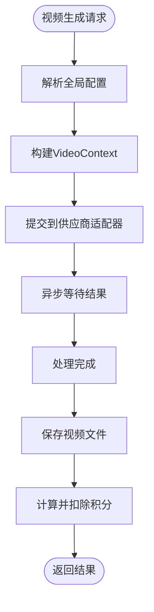

**图表来源**
- [video_gen.py:176-277](file://backend/services/tool_manager/providers/video_gen.py#L176-L277)
- [video_generation.py:85-121](file://backend/services/video_generation.py#L85-L121)

**章节来源**
- [video_gen.py:1-334](file://backend/services/tool_manager/providers/video_gen.py#L1-L334)
- [video_generation.py:1-160](file://backend/services/video_generation.py#L1-L160)

### 多供应商适配器支持
- **功能概述**：支持xAI、MiniMax、Gemini三个供应商的视频生成适配器
- **关键特性**：
  - 适配器基类：VideoProviderAdapter定义统一接口
  - 供应商类型：xai、minimax、gemini三种供应商类型
  - 模型能力：VIDEO_MODEL_CAPABILITIES提供模型能力映射
  - 状态映射：统一的状态映射表支持内部状态转换
  - 参数适配：不同供应商的参数格式转换

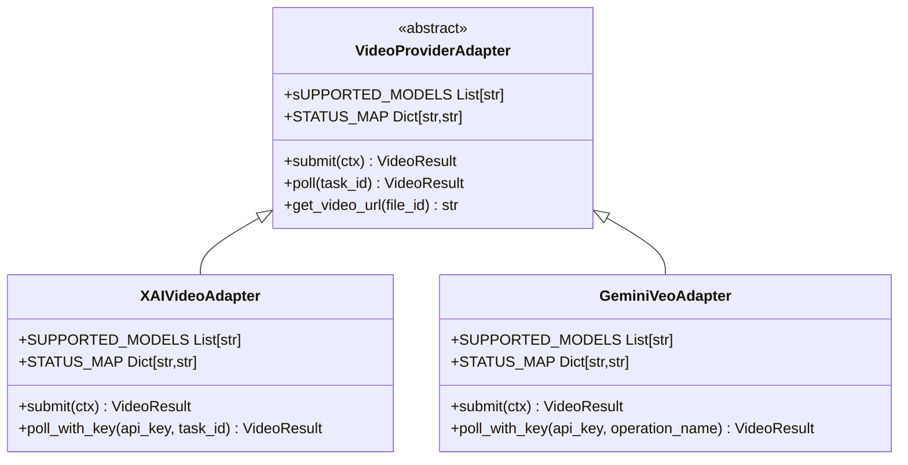

**图表来源**
- [video_providers/base.py:56-121](file://backend/services/video_providers/base.py#L56-L121)
- [xai_provider.py:43-199](file://backend/services/video_providers/xai_provider.py#L43-L199)
- [gemini_provider.py:42-357](file://backend/services/video_providers/gemini_provider.py#L42-L357)

**章节来源**
- [video_providers/base.py:1-121](file://backend/services/video_providers/base.py#L1-L121)
- [xai_provider.py:1-199](file://backend/services/video_providers/xai_provider.py#L1-L199)
- [gemini_provider.py:1-357](file://backend/services/video_providers/gemini_provider.py#L1-L357)

### 视频任务追踪系统
- **功能概述**：异步视频生成任务管理，支持状态轮询和结果处理
- **关键特性**：
  - 任务模型：VideoTask模型定义任务结构
  - 状态管理：pending、processing、completed、failed四种状态
  - 计费追踪：input_image_count、output_duration_seconds、credit_cost
  - 会话关联：session_id关联聊天会话
  - 错误处理：error_message记录错误信息
  - 完成回调：自动插入聊天消息通知

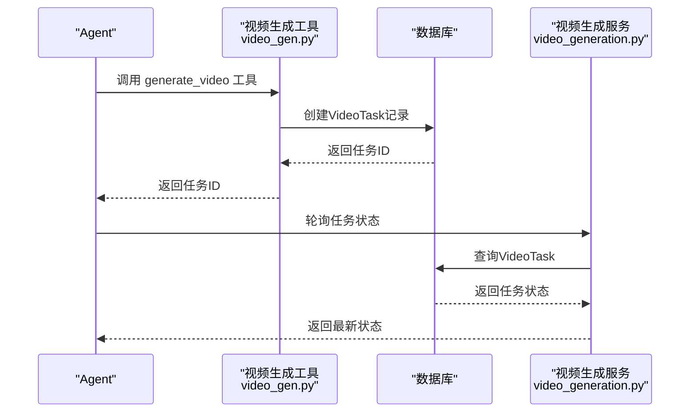

**图表来源**
- [video_gen.py:240-277](file://backend/services/tool_manager/providers/video_gen.py#L240-L277)
- [videos.py:149-232](file://backend/routers/videos.py#L149-L232)
- [models.py:403-433](file://backend/models.py#L403-L433)

**章节来源**
- [video_gen.py:1-334](file://backend/services/tool_manager/providers/video_gen.py#L1-L334)
- [videos.py:1-343](file://backend/routers/videos.py#L1-L343)
- [models.py:403-433](file://backend/models.py#L403-L433)

### 视频计费系统
- **功能概述**：基于输入输出维度的视频生成成本计算
- **关键特性**：
  - 维度映射：输入图片数量、输出时长、质量等级
  - 成本计算：calculate_video_credit_cost计算视频生成费用
  - 原子扣费：deduct_credits_atomic确保并发安全
  - 费率配置：从LLMProvider.model_costs获取模型费率
  - 余额检查：InsufficientCreditsError处理余额不足

**章节来源**
- [videos.py:201-224](file://backend/routers/videos.py#L201-L224)
- [billing.py:12-200](file://backend/services/billing.py#L12-L200)

### 视频模型能力配置
- **功能概述**：视频模型能力映射表，支持动态参数枚举生成
- **关键特性**：
  - 能力定义：VideoModelCapabilities类型定义模型能力
  - 模型映射：VIDEO_MODEL_CAPABILITIES提供所有支持的模型
  - 供应商分类：按供应商类型组织模型能力
  - 参数枚举：动态生成视频模式、时长、分辨率等参数枚举
  - 能力查询：get_model_capabilities获取指定模型能力

**章节来源**
- [video_providers/model_capabilities.py:1-347](file://backend/services/video_providers/model_capabilities.py#L1-L347)

### 视频生成API路由
- **功能概述**：视频生成API路由，支持任务创建、状态查询、模型能力获取
- **关键特性**：
  - 任务列表：GET /api/videos 获取视频任务列表
  - 任务创建：POST /api/videos 提交视频生成任务
  - 状态查询：GET /api/videos/{task_id}/status 轮询任务状态
  - 会话任务：GET /api/videos/session/{session_id} 获取会话视频任务
  - 模型能力：GET /api/videos/model-capabilities/{model_name} 获取模型能力
  - 任务删除：DELETE /api/videos/{task_id} 删除终态任务

**章节来源**
- [videos.py:1-343](file://backend/routers/videos.py#L1-L343)

## Gemini图像生动生成功能

### Nano Banana图像生成模型
- **功能概述**：Gemini Nano Banana是Gemini原生图像生动生成的统称，支持文本到图像、图像编辑、多轮编辑等高级功能
- **关键特性**：
  - Nano Banana 2：Gemini 3.1 Flash Image Preview，高性能、高吞吐量
  - Nano Banana Pro：Gemini 3 Pro Image Preview，专业级资产生产
  - Nano Banana：Gemini 2.5 Flash Image，速度优先的低延迟任务
  - 支持思考模式：高级推理过程，生成中间思考图像
  - 支持Google搜索：事实验证和基于实时数据的图像生成
  - 支持多参考图像：最多14张参考图像混合生成

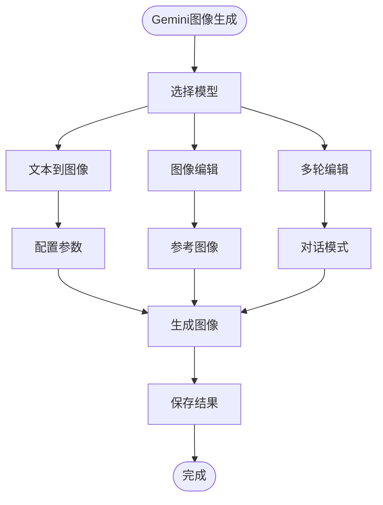

**图表来源**
- [Gemini3nanobanana2图像理解和图像生成文档.md:23-27](file://Gemini3nanobanana2图像理解和图像生成文档.md#L23-L27)
- [image_gen.py:146-170](file://backend/services/tool_manager/providers/image_gen.py#L146-L170)

**章节来源**
- [Gemini3nanobanana2图像理解和图像生成文档.md:18-28](file://Gemini3nanobanana2图像理解和图像生成文档.md#L18-L28)
- [image_gen.py:146-170](file://backend/services/tool_manager/providers/image_gen.py#L146-L170)

### Gemini批量图像生成服务
- **功能概述**：支持Gemini的批量图像生成，实现并行调用和配置管理
- **关键特性**：
  - 并行生成：使用asyncio.Semaphore限制最大并发（1-8）
  - 配置映射：aspect_ratio、image_size、output_format的映射表
  - Google搜索集成：支持google_search_enabled和google_image_search_enabled
  - Token统计：记录input_tokens和output_tokens用于计费
  - 错误处理：完善的异常捕获和错误信息记录

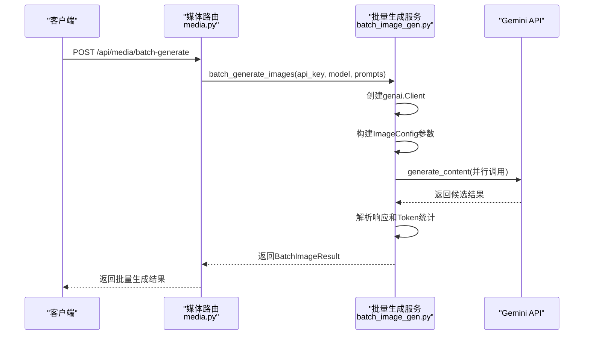

**图表来源**
- [media.py:350-444](file://backend/routers/media.py#L350-L444)
- [batch_image_gen.py:113-187](file://backend/services/batch_image_gen.py#L113-L187)

**章节来源**
- [media.py:350-444](file://backend/routers/media.py#L350-L444)
- [batch_image_gen.py:113-187](file://backend/services/batch_image_gen.py#L113-L187)

### Gemini配置迁移支持
- **功能概述**：支持Gemini配置字段的数据库迁移，包含thinking_mode到gemini_config的转换
- **关键特性**：
  - 新增gemini_config字段：JSON类型存储Gemini配置
  - 数据迁移：将thinking_mode=True的记录迁移到gemini_config.thinking_level="high"
  - 向后兼容：支持新旧配置共存
  - 配置字段：thinking_level、media_resolution、image_generation_enabled等

**章节来源**
- [e1f2a3b4c5d6_add_gemini_config.py:21-35](file://backend/migrations/versions/e1f2a3b4c5d6_add_gemini_config.py#L21-L35)

### 多语言Gemini示例
- **功能概述**：提供完整的多语言Gemini图像生成示例，涵盖Python、JavaScript、Go、Java、REST API
- **关键特性**：
  - Python示例：使用google.genai SDK进行文本到图像生成
  - JavaScript示例：支持Node.js环境的异步调用
  - Go示例：使用google.golang.org/genai包
  - Java示例：支持JVM环境的客户端调用
  - REST API示例：直接使用HTTP请求调用Gemini API
  - 多轮编辑：支持对话模式的迭代图像生成
  - Google搜索：集成Google搜索工具进行事实验证

**章节来源**
- [Gemini3nanobanana2图像理解和图像生成文档.md:33-1608](file://Gemini3nanobanana2图像理解和图像生成文档.md#L33-L1608)

## 依赖关系分析
- **组件耦合**：
  - image_gen 依赖 xai_image_gen 与 image_config_adapter，体现"定义-执行-派发"模式
  - image_edit 依赖 image_config_adapter 和工具上下文，支持图像编辑功能
  - image_gen 依赖 context 提供供应商类型解析
  - image_edit 依赖 context 提供全局配置访问
  - xai_image_gen 与 batch_image_gen 依赖 media_utils 进行本地存储
  - videos.py 依赖 video_generation 与 xai_provider，以及 billing 与 media_utils
  - video_gen.py 依赖 video_generation 与 VideoContext，支持工具调用
  - 前端 ImageGenConfigDialog.tsx 依赖 useToolRegistry.ts 获取供应商能力
  - admin_tools.py 依赖 image_config_adapter 获取供应商能力
  - manager.py 依赖所有工具提供者进行统一管理
  - Gemini批量生成依赖batch_image_gen.py和media_utils
  - Gemini配置迁移依赖数据库模型和迁移脚本
  - 视频任务模型依赖ChatMessage进行结果通知
  - 视频适配器基类提供统一接口定义
  - 模型能力配置支持动态参数枚举生成
- **外部依赖**：
  - xAI：OpenAI SDK（异步客户端）、HTTPX
  - Gemini：Google GenAI SDK、HTTPX
  - FastAPI：路由与依赖注入
  - SWR：前端数据获取和缓存
- **循环依赖**：未发现循环依赖，模块职责清晰

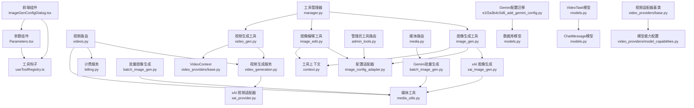

**图表来源**
- [image_gen.py:1-293](file://backend/services/tool_manager/providers/image_gen.py#L1-L293)
- [image_edit.py:1-351](file://backend/services/tool_manager/providers/image_edit.py#L1-L351)
- [xai_image_gen.py:1-191](file://backend/services/xai_image_gen.py#L1-L191)
- [batch_image_gen.py:1-187](file://backend/services/batch_image_gen.py#L1-L187)
- [media_utils.py:1-79](file://backend/services/media_utils.py#L1-L79)
- [videos.py:1-343](file://backend/routers/videos.py#L1-L343)
- [video_generation.py:1-160](file://backend/services/video_generation.py#L1-L160)
- [xai_provider.py:1-164](file://backend/services/video_providers/xai_provider.py#L1-L164)
- [billing.py:1-200](file://backend/services/billing.py#L1-L200)
- [ImageGenConfigDialog.tsx:1-288](file://backend/admin/src/components/admin/tools/ImageGenConfigDialog.tsx#L1-L288)
- [useToolRegistry.ts:1-59](file://backend/admin/src/hooks/useToolRegistry.ts#L1-L59)
- [Parameters.tsx:1-324](file://backend/admin/src/components/admin/agents/Parameters.tsx#L1-L324)
- [admin_tools.py:1-258](file://backend/routers/admin_tools.py#L1-L258)
- [manager.py:1-108](file://backend/services/tool_manager/manager.py#L1-L108)
- [gemini_provider.py:1-276](file://backend/services/video_providers/gemini_provider.py#L1-L276)
- [e1f2a3b4c5d6_add_gemini_config.py:1-41](file://backend/migrations/versions/e1f2a3b4c5d6_add_gemini_config.py#L1-L41)
- [video_gen.py:1-334](file://backend/services/tool_manager/providers/video_gen.py#L1-L334)
- [video_providers/base.py:1-121](file://backend/services/video_providers/base.py#L1-L121)
- [video_providers/model_capabilities.py:1-347](file://backend/services/video_providers/model_capabilities.py#L1-L347)
- [models.py:403-433](file://backend/models.py#L403-L433)

**章节来源**
- [image_gen.py:1-293](file://backend/services/tool_manager/providers/image_gen.py#L1-L293)
- [image_edit.py:1-351](file://backend/services/tool_manager/providers/image_edit.py#L1-L351)
- [xai_image_gen.py:1-191](file://backend/services/xai_image_gen.py#L1-L191)
- [batch_image_gen.py:1-187](file://backend/services/batch_image_gen.py#L1-L187)
- [media_utils.py:1-79](file://backend/services/media_utils.py#L1-L79)
- [videos.py:1-343](file://backend/routers/videos.py#L1-L343)
- [video_generation.py:1-160](file://backend/services/video_generation.py#L1-L160)
- [xai_provider.py:1-164](file://backend/services/video_providers/xai_provider.py#L1-L164)
- [billing.py:1-200](file://backend/services/billing.py#L1-L200)
- [ImageGenConfigDialog.tsx:1-288](file://backend/admin/src/components/admin/tools/ImageGenConfigDialog.tsx#L1-L288)
- [useToolRegistry.ts:1-59](file://backend/admin/src/hooks/useToolRegistry.ts#L1-L59)
- [Parameters.tsx:1-324](file://backend/admin/src/components/admin/agents/Parameters.tsx#L1-L324)
- [admin_tools.py:1-258](file://backend/routers/admin_tools.py#L1-L258)
- [manager.py:1-108](file://backend/services/tool_manager/manager.py#L1-L108)
- [gemini_provider.py:1-276](file://backend/services/video_providers/gemini_provider.py#L1-L276)
- [e1f2a3b4c5d6_add_gemini_config.py:1-41](file://backend/migrations/versions/e1f2a3b4c5d6_add_gemini_config.py#L1-L41)
- [video_gen.py:1-334](file://backend/services/tool_manager/providers/video_gen.py#L1-L334)
- [video_providers/base.py:1-121](file://backend/services/video_providers/base.py#L1-L121)
- [video_providers/model_capabilities.py:1-347](file://backend/services/video_providers/model_capabilities.py#L1-L347)
- [models.py:403-433](file://backend/models.py#L403-L433)

## 性能考虑
- **并发控制**：使用 asyncio.Semaphore 限制最大并发（1-8），避免过度占用外部 API 速率限制
- **异步 I/O**：使用 httpx.AsyncClient 与 OpenAI 异步客户端，提升网络请求吞吐
- **结果聚合**：使用 asyncio.gather 并行收集任务结果，减少等待时间
- **存储优化**：媒体文件采用唯一 UUID 命名，避免冲突；批量生成时尽量复用保存逻辑
- **计费优化**：计费维度映射表驱动，避免 if-else 分支，提升计算效率
- **缓存机制**：工具上下文提供供应商类型缓存，减少重复查询
- **动态能力检测**：前端能力检测避免无效配置，提升用户体验
- **配置适配优化**：统一配置适配器使用映射表，避免复杂的条件判断
- **工具定义缓存**：工具管理器缓存工具定义，避免重复构建
- **全局配置缓存**：ToolContext缓存全局配置，减少数据库查询
- **Gemini并行优化**：批量生成使用Semaphore限制并发，避免API限流
- **Gemini配置缓存**：Gemini配置迁移支持向后兼容，减少数据迁移开销
- **多语言示例优化**：提供多种编程语言示例，便于开发者选择最适合的实现方式
- **视频生成优化**：视频任务异步处理，支持并发任务管理
- **适配器缓存**：视频适配器类型缓存，减少重复实例化
- **模型能力缓存**：模型能力查询缓存，避免重复计算

## 故障排除指南
- **并发过高导致超时**：调整 max_concurrent 参数，确保不超过供应商限流
- **内容审核拒绝**：xAI 适配器在完成时检查 moderation，若拒绝则标记失败并记录原因
- **余额不足**：check_balance_sufficient 抛出 BalanceFrozenError 或返回 False，需先充值或解冻
- **文件保存失败**：media_utils 中的保存函数抛出异常时，检查 MIME 推断与目录权限
- **轮询超时**：videos.py 中对 pending 且带错误的任务超过 300 秒判定失败
- **供应商能力不匹配**：检查 IMAGE_PROVIDER_CAPABILITIES 配置和前端能力检测
- **配置适配失败**：验证统一配置格式和供应商特定字段映射
- **统一配置解析失败**：检查 image_config 字段格式和供应商类型匹配
- **配置对话框加载失败**：检查 /admin/tools/image-capabilities API 是否正常返回
- **供应商能力显示异常**：确认供应商是否正确配置 models 字段和 is_active 状态
- **工具执行失败**：检查工具提供者的条件满足情况和供应商配置
- **全局配置未生效**：确认ToolConfig表中的配置是否正确存储和缓存
- **Gemini批量生成失败**：检查API密钥、模型名称和并发参数设置
- **Gemini配置迁移错误**：确认数据库迁移脚本执行顺序和数据完整性
- **多语言示例调用失败**：检查对应语言SDK版本和API端点配置
- **视频生成任务失败**：检查供应商API密钥、模型名称和配置参数
- **视频任务状态异常**：确认VideoTask状态转换和错误处理逻辑
- **视频计费错误**：检查模型费率配置和credit_cost计算逻辑
- **视频适配器初始化失败**：确认供应商类型和模型支持情况

**章节来源**
- [xai_provider.py:139-157](file://backend/services/video_providers/xai_provider.py#L139-L157)
- [billing.py:45-84](file://backend/services/billing.py#L45-L84)
- [media_utils.py:20-79](file://backend/services/media_utils.py#L20-L79)
- [videos.py:179-183](file://backend/routers/videos.py#L179-L183)
- [image_config_adapter.py:134-211](file://backend/services/image_config_adapter.py#L134-L211)
- [ImageGenConfigDialog.tsx:103-130](file://backend/admin/src/components/admin/tools/ImageGenConfigDialog.tsx#L103-L130)
- [manager.py:87-90](file://backend/services/tool_manager/manager.py#L87-L90)
- [gemini_provider.py:126-161](file://backend/services/video_providers/gemini_provider.py#L126-L161)
- [e1f2a3b4c5d6_add_gemini_config.py:28-35](file://backend/migrations/versions/e1f2a3b4c5d6_add_gemini_config.py#L28-L35)
- [video_gen.py:199-200](file://backend/services/tool_manager/providers/video_gen.py#L199-L200)
- [video_providers/base.py:118-121](file://backend/services/video_providers/base.py#L118-L121)

## 结论
该图像生成系统通过重构统一配置系统和引入动态供应商能力检测，实现了更加灵活和可扩展的多供应商统一接入。系统现已扩展支持图像编辑功能，与图像生成共享全局配置，进一步增强了系统的实用性。新增的Gemini Nano Banana图像生动生成功能提供了完整的文本到图像、图像编辑、多轮编辑能力，支持多种编程语言的示例实现。统一配置适配器与计费服务进一步提升了系统的可维护性与可控性。新的架构支持更好的用户体验，通过前端动态能力检测提供智能配置界面。新增的ImageGenConfigDialog组件提供了直观的配置界面，支持动态供应商选择和实时能力展示。工具管理器的引入实现了统一的工具协调和缓存机制。

**更新** 新增的视频生成系统作为独立工具系统与图像生成系统并列存在，支持多供应商适配器（xAI、MiniMax、Gemini），提供统一的视频生成工具接口和异步任务管理。视频生成系统采用与图像生成系统相同的工具管理架构，支持全局配置管理和动态能力检测。视频任务追踪系统提供完整的异步任务管理，支持状态轮询、计费计算和结果通知。视频计费系统基于输入输出维度的成本计算，确保资源使用的透明化和可控性。

建议在生产环境中合理设置并发参数、监控供应商限流与内容审核策略，并定期清理本地媒体文件以控制存储空间。对于视频生成系统，建议合理配置任务队列和并发控制，确保视频生成任务的高效处理和资源的合理利用。

## 附录

### 使用示例（路径引用）
- **统一配置格式**
  - 配置结构：[index.ts:14-26](file://backend/admin/src/types/index.ts#L14-L26)
  - 类型定义：[schemas.py:220-226](file://backend/schemas.py#L220-L226)
- **动态供应商能力**
  - 能力钩子：[useToolRegistry.ts:31-37](file://backend/admin/src/hooks/useToolRegistry.ts#L31-L37)
  - 图像生成配置对话框：[ImageGenConfigDialog.tsx:42-132](file://backend/admin/src/components/admin/tools/ImageGenConfigDialog.tsx#L42-L132)
  - 图像供应商能力API：[admin_tools.py:191-196](file://backend/routers/admin_tools.py#L191-L196)
- **工具执行流程**
  - 统一工具定义：[image_gen.py:54-101](file://backend/services/tool_manager/providers/image_gen.py#L54-L101)
  - 供应商派发：[image_gen.py:166-170](file://backend/services/tool_manager/providers/image_gen.py#L166-L170)
  - 配置适配：[image_gen.py:211-221](file://backend/services/tool_manager/providers/image_gen.py#L211-L221)
- **工具管理器使用**
  - 工具注册：[manager.py:96-107](file://backend/services/tool_manager/manager.py#L96-L107)
  - 工具执行：[manager.py:87-90](file://backend/services/tool_manager/manager.py#L87-L90)
- **Gemini图像生成**
  - 批量生成服务：[batch_image_gen.py:113-187](file://backend/services/batch_image_gen.py#L113-L187)
  - 媒体路由处理：[media.py:350-444](file://backend/routers/media.py#L350-L444)
  - 配置迁移：[e1f2a3b4c5d6_add_gemini_config.py:21-35](file://backend/migrations/versions/e1f2a3b4c5d6_add_gemini_config.py#L21-L35)
- **多语言示例**
  - Python示例：[Gemini3nanobanana2图像理解和图像生成文档.md:33-83](file://Gemini3nanobanana2图像理解和图像生成文档.md#L33-L83)
  - JavaScript示例：[Gemini3nanobanana2图像理解和图像生成文档.md:54-82](file://Gemini3nanobanana2图像理解和图像生成文档.md#L54-L82)
  - Go示例：[Gemini3nanobanana2图像理解和图像生成文档.md:84-121](file://Gemini3nanobanana2图像理解和图像生成文档.md#L84-L121)
  - Java示例：[Gemini3nanobanana2图像理解和图像生成文档.md:122-158](file://Gemini3nanobanana2图像理解和图像生成文档.md#L122-L158)
  - REST示例：[Gemini3nanobanana2图像理解和图像生成文档.md:160-173](file://Gemini3nanobanana2图像理解和图像生成文档.md#L160-L173)
- **视频生成系统**
  - 视频生成工具：[video_gen.py:176-277](file://backend/services/tool_manager/providers/video_gen.py#L176-L277)
  - 视频适配器基类：[video_providers/base.py:15-121](file://backend/services/video_providers/base.py#L15-L121)
  - 视频任务模型：[models.py:403-433](file://backend/models.py#L403-L433)
  - 视频API路由：[videos.py:74-146](file://backend/routers/videos.py#L74-L146)

### 参数与配置要点
- **统一配置字段**：image_generation_enabled、image_provider_id、image_model、image_config
- **统一配置类型**：UnifiedImageConfig 包含 aspect_ratio、quality、batch_count、output_format
- **宽高比枚举**：统一支持 auto、1:1、16:9、9:16、4:3、3:4、3:2、2:3、2:1、1:2、19.5:9、9:19.5、20:9、9:20
- **质量级别**：standard、hd、ultra（供应商间映射）
- **批次上限**：xAI n ≤ 10；Gemini batch_count ≤ 8
- **输出格式**：Gemini 支持 png/jpeg/webp；xAI 默认 b64_json
- **动态能力检测**：前端通过 /admin/tools/image-capabilities 获取供应商能力
- **工具上下文缓存**：ToolContext提供供应商类型缓存机制
- **全局配置缓存**：ToolContext提供全局配置缓存机制
- **数据库支持**：新增 image_config JSON 字段，移除特定供应商配置
- **配置对话框功能**：支持完整配置管理、动态能力检测、实时验证
- **工具管理器功能**：支持统一工具注册、动态定义构建、执行调度
- **图像编辑功能**：支持图像编辑工具，与图像生成共享配置
- **Gemini配置字段**：thinking_level、media_resolution、image_generation_enabled、google_search_enabled
- **Gemini批量生成**：支持aspect_ratio、image_size、output_format配置
- **多语言支持**：Python、JavaScript、Go、Java、REST API完整示例
- **多轮编辑**：支持对话模式的迭代图像生成
- **Google搜索集成**：支持事实验证和基于实时数据的图像生成
- **视频生成工具**：generate_video工具支持多供应商适配器
- **视频模式枚举**：text_to_video、image_to_video、edit、video_extension、reference_images
- **视频适配器支持**：xAI、MiniMax、Gemini三种供应商类型
- **视频任务状态**：pending、processing、completed、failed四种状态
- **视频计费维度**：输入图片数量、输出时长、质量等级
- **视频模型能力**：动态参数枚举生成，支持供应商特定配置

### 新增API端点
- **工具注册表**：/api/admin/tools/registry - 获取工具和供应商信息
- **工具使用统计**：/api/admin/tools/agent-usage - 获取工具使用情况
- **工具统计**：/api/admin/tools/stats - 获取工具执行统计
- **图像供应商能力**：/api/admin/tools/image-capabilities - 获取图像供应商能力信息
- **工具配置管理**：/api/admin/tools/configs - 获取所有工具配置
- **单个工具配置**：/api/admin/tools/configs/{tool_name} - 获取单个工具配置
- **更新工具配置**：/api/admin/tools/configs/{tool_name} - 更新工具配置
- **LLM供应商管理**：/api/admin/llm-providers - 管理AI供应商配置
- **图像生成配置对话框**：集成在管理员界面中，提供统一配置管理
- **Gemini批量生成**：/api/media/batch-generate - Gemini批量图像生成接口
- **Gemini配置迁移**：数据库迁移脚本支持thinking_mode到gemini_config的转换
- **视频任务列表**：/api/videos - 获取视频任务列表
- **视频任务创建**：/api/videos - 提交视频生成任务
- **视频状态查询**：/api/videos/{task_id}/status - 轮询视频任务状态
- **视频会话任务**：/api/videos/session/{session_id} - 获取会话视频任务
- **视频模型能力**：/api/videos/model-capabilities/{model_name} - 获取模型能力
- **视频任务删除**：/api/videos/{task_id} - 删除终态视频任务

**章节来源**
- [useToolRegistry.ts:6-59](file://backend/admin/src/hooks/useToolRegistry.ts#L6-L59)
- [llm_config.py:166-186](file://backend/routers/llm_config.py#L166-L186)
- [ImageGenConfigDialog.tsx:1-288](file://backend/admin/src/components/admin/tools/ImageGenConfigDialog.tsx#L1-L288)
- [b2c3d4e5f6g7_add_unified_image_config_to_agents.py:21-27](file://backend/migrations/versions/b2c3d4e5f6g7_add_unified_image_config_to_agents.py#L21-L27)
- [admin_tools.py:191-258](file://backend/routers/admin_tools.py#L191-L258)
- [manager.py:96-108](file://backend/services/tool_manager/manager.py#L96-L108)
- [media.py:350-444](file://backend/routers/media.py#L350-L444)
- [e1f2a3b4c5d6_add_gemini_config.py:21-35](file://backend/migrations/versions/e1f2a3b4c5d6_add_gemini_config.py#L21-L35)
- [video_gen.py:1-334](file://backend/services/tool_manager/providers/video_gen.py#L1-L334)
- [video_providers/base.py:1-121](file://backend/services/video_providers/base.py#L1-L121)
- [models.py:403-433](file://backend/models.py#L403-L433)
- [videos.py:1-343](file://backend/routers/videos.py#L1-L343)