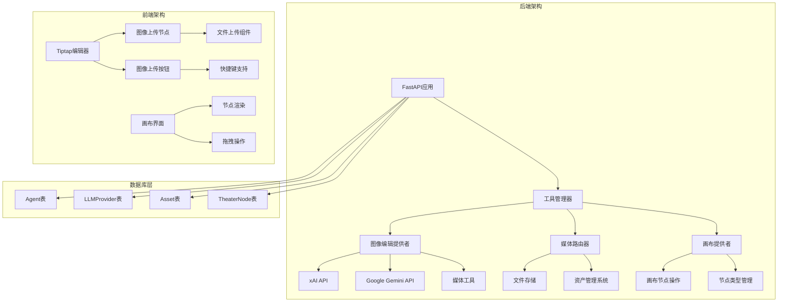
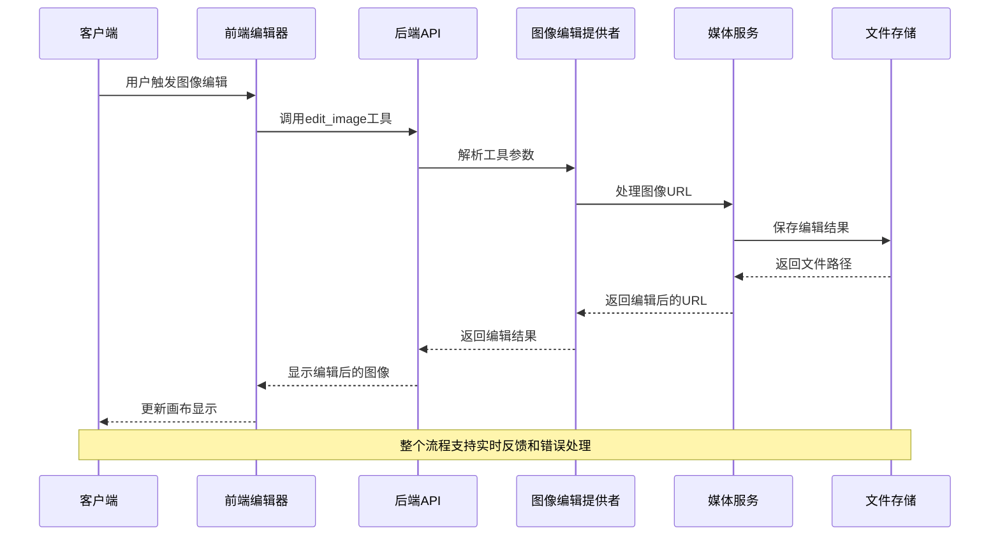
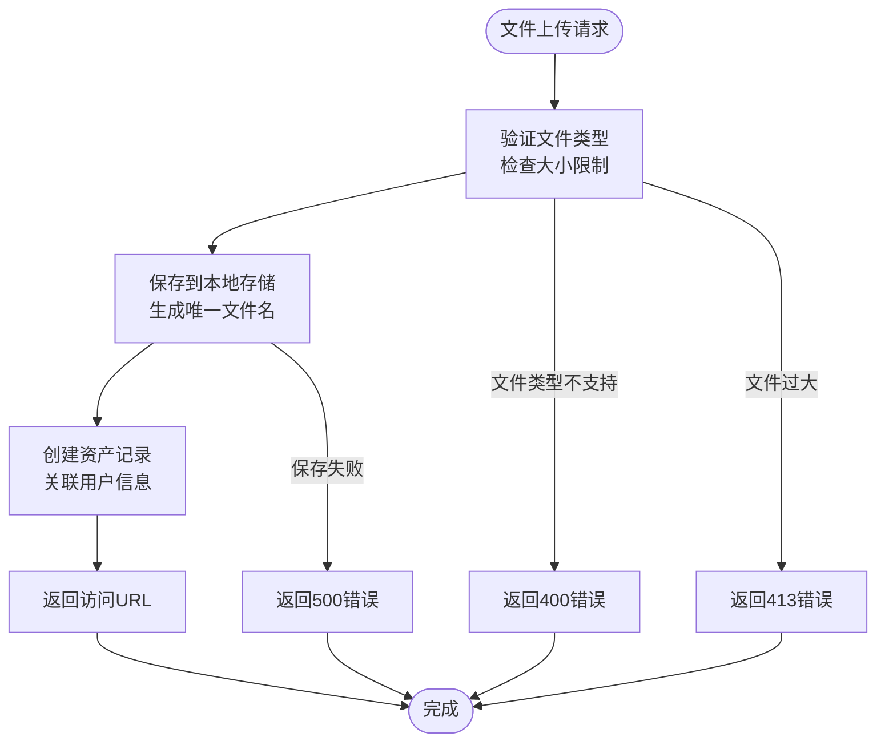
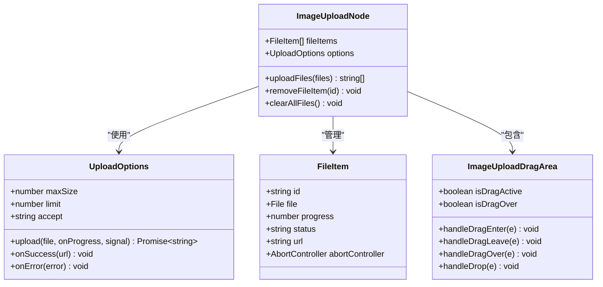
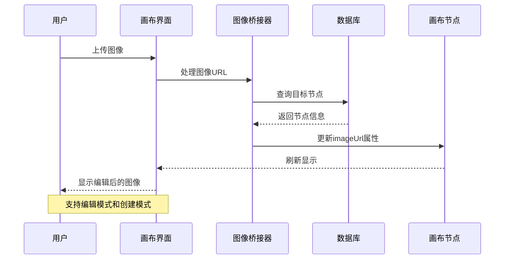
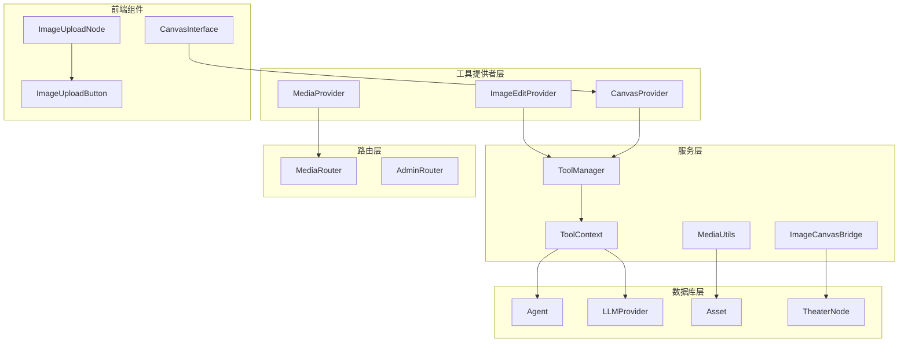

# 图像编辑能力

<cite>
**本文档引用的文件**
- [image_edit.py](file://backend/services/tool_manager/providers/image_edit.py)
- [canvas.py](file://backend/services/tool_manager/providers/canvas.py)
- [image_canvas_bridge.py](file://backend/services/image_canvas_bridge.py)
- [media.py](file://backend/routers/media.py)
- [media_utils.py](file://backend/services/media_utils.py)
- [manager.py](file://backend/services/tool_manager/manager.py)
- [context.py](file://backend/services/tool_manager/context.py)
- [image-upload-node.tsx](file://frontend/src/components/tiptap-node/image-upload-node/image-upload-node.tsx)
- [image-upload-button.tsx](file://frontend/src/components/tiptap-ui/image-upload-button/image-upload-button.tsx)
- [use-image-upload.ts](file://frontend/src/components/tiptap-ui/image-upload-button/use-image-upload.ts)
- [image-upload-node-extension.ts](file://frontend/src/components/tiptap-node/image-upload-node/image-upload-node-extension.ts)
- [image-upload-node.scss](file://frontend/src/components/tiptap-node/image-upload-node/image-upload-node.scss)
</cite>

## 目录
1. [简介](#简介)
2. [项目结构](#项目结构)
3. [核心组件](#核心组件)
4. [架构概览](#架构概览)
5. [详细组件分析](#详细组件分析)
6. [依赖关系分析](#依赖关系分析)
7. [性能考虑](#性能考虑)
8. [故障排除指南](#故障排除指南)
9. [结论](#结论)

## 简介

本项目提供了完整的图像编辑能力，包括AI驱动的图像编辑、批量图像生成、媒体文件管理和画布集成。系统支持多种AI供应商（xAI和Google Gemini），提供从基础图像上传到高级AI编辑的完整工作流。

图像编辑功能的核心特性包括：
- AI驱动的图像编辑（修改、风格化、增强）
- 批量图像生成和处理
- 实时媒体文件上传和管理
- 与画布系统的无缝集成
- 多种文件格式支持（PNG、JPG、WEBP、GIF等）

## 项目结构

项目采用前后端分离架构，后端使用FastAPI提供REST API，前端基于React和Tiptap构建富文本编辑器。



**图表来源**
- [manager.py:23-108](file://backend/services/tool_manager/manager.py#L23-L108)
- [image_edit.py:304-352](file://backend/services/tool_manager/providers/image_edit.py#L304-L352)
- [canvas.py:513-549](file://backend/services/tool_manager/providers/canvas.py#L513-L549)

## 核心组件

### 后端核心组件

#### 图像编辑提供者
负责AI图像编辑功能的实现，支持多种供应商API调用。

#### 画布提供者
管理剧院画布节点的CRUD操作，支持文本、图像、视频和分镜节点。

#### 媒体路由器
提供完整的媒体文件管理API，包括上传、下载、批量处理等功能。

#### 工具管理器
统一管理所有工具提供者，协调工具发现、定义和执行。

### 前端核心组件

#### 图像上传节点
基于Tiptap的自定义节点，提供拖拽上传、进度显示、错误处理等功能。

#### 图像上传按钮
提供快捷键支持和状态管理的图像上传UI组件。

#### 画布界面
集成图像编辑功能的可视化画布系统。

**章节来源**
- [image_edit.py:1-352](file://backend/services/tool_manager/providers/image_edit.py#L1-L352)
- [canvas.py:1-549](file://backend/services/tool_manager/providers/canvas.py#L1-L549)
- [media.py:1-444](file://backend/routers/media.py#L1-L444)
- [manager.py:1-108](file://backend/services/tool_manager/manager.py#L1-L108)

## 架构概览

系统采用分层架构设计，确保功能模块的清晰分离和高内聚低耦合。



**图表来源**
- [image_edit.py:239-298](file://backend/services/tool_manager/providers/image_edit.py#L239-L298)
- [media_utils.py:20-79](file://backend/services/media_utils.py#L20-L79)

## 详细组件分析

### 图像编辑提供者分析

图像编辑提供者实现了完整的AI图像编辑功能，支持多种供应商和编辑模式。

```mermaid
classDiagram
class ImageEditProvider {
+string display_name
+string description
+string condition
+frozenset tool_names
+build_defs(ctx) list[dict]
+execute(name, args, ctx) str
+rebuild_defs(ctx) list[dict] | None
+get_tool_metadata() list[dict]
}
class ToolContext {
+string theater_id
+Agent agent
+AsyncSession db
+Path active_skills_dir
+get_global_image_config() dict
+resolve_image_provider_type() str | None
}
class ImageEditProvider {
+display_name : "图像编辑"
+description : "AI 图像编辑修改、风格化、增强现有图片"
+condition : "需要启用全局配置且供应商支持图片编辑"
+tool_names : frozenset({"edit_image"})
}
ImageEditProvider --> ToolContext : "使用"
ToolContext --> Agent : "包含"
ToolContext --> LLMProvider : "解析"
ToolContext --> ToolConfig : "读取配置"
```

**图表来源**
- [image_edit.py:304-352](file://backend/services/tool_manager/providers/image_edit.py#L304-L352)
- [context.py:23-85](file://backend/services/tool_manager/context.py#L23-L85)

#### 工具定义构建
提供者根据上下文动态构建工具定义，支持条件性启用。

#### 编辑实现策略
支持xAI和Google Gemini两种供应商，每种都有专门的实现策略。

**章节来源**
- [image_edit.py:82-121](file://backend/services/tool_manager/providers/image_edit.py#L82-L121)
- [image_edit.py:149-236](file://backend/services/tool_manager/providers/image_edit.py#L149-L236)

### 媒体文件管理系统

媒体文件管理系统提供了完整的文件上传、存储和访问控制机制。



**图表来源**
- [media.py:95-149](file://backend/routers/media.py#L95-L149)
- [media.py:272-299](file://backend/routers/media.py#L272-L299)

#### 文件类型支持
系统支持多种媒体格式，包括图片、视频和音频文件。

#### 安全存储机制
采用UUID命名和安全路径验证，防止文件访问漏洞。

**章节来源**
- [media.py:32-69](file://backend/routers/media.py#L32-L69)
- [media.py:272-299](file://backend/routers/media.py#L272-L299)

### 前端图像上传组件

前端组件提供了丰富的图像上传和编辑功能，支持拖拽、进度显示和错误处理。



**图表来源**
- [image-upload-node.tsx:11-80](file://frontend/src/components/tiptap-node/image-upload-node/image-upload-node.tsx#L11-L80)
- [image-upload-node.tsx:436-555](file://frontend/src/components/tiptap-node/image-upload-node/image-upload-node.tsx#L436-L555)

#### 进度跟踪系统
实时显示上传进度，支持多文件并发上传。

#### 错误处理机制
完善的错误处理和用户反馈系统。

**章节来源**
- [image-upload-node.tsx:85-213](file://frontend/src/components/tiptap-node/image-upload-node/image-upload-node.tsx#L85-L213)
- [image-upload-button.tsx:1-133](file://frontend/src/components/tiptap-ui/image-upload-button/image-upload-button.tsx#L1-L133)

### 画布集成系统

画布系统提供了可视化的图像编辑和管理界面。



**图表来源**
- [image_canvas_bridge.py:29-64](file://backend/services/image_canvas_bridge.py#L29-L64)
- [canvas.py:341-475](file://backend/services/tool_manager/providers/canvas.py#L341-L475)

**章节来源**
- [image_canvas_bridge.py:1-119](file://backend/services/image_canvas_bridge.py#L1-L119)
- [canvas.py:126-246](file://backend/services/tool_manager/providers/canvas.py#L126-L246)

## 依赖关系分析

系统采用模块化设计，各组件间依赖关系清晰明确。



**图表来源**
- [manager.py:23-108](file://backend/services/tool_manager/manager.py#L23-L108)
- [context.py:23-85](file://backend/services/tool_manager/context.py#L23-L85)

### 关键依赖关系

#### 后端依赖
- 工具提供者依赖工具管理器进行注册和调度
- 工具上下文提供统一的环境信息
- 媒体工具依赖文件系统进行存储管理

#### 前端依赖
- 图像上传组件依赖Tiptap编辑器框架
- UI组件使用React Hook体系
- 样式系统基于CSS变量和主题支持

**章节来源**
- [manager.py:26-37](file://backend/services/tool_manager/manager.py#L26-L37)
- [context.py:57-85](file://backend/services/tool_manager/context.py#L57-L85)

## 性能考虑

系统在设计时充分考虑了性能优化和用户体验。

### 并发处理
- 支持多文件并发上传，提升用户效率
- 批量图像生成支持最大并发数配置
- 异步数据库操作减少等待时间

### 缓存策略
- 工具定义结果缓存，避免重复计算
- 图像URL解析结果缓存
- 前端组件状态缓存优化渲染性能

### 存储优化
- 文件名UUID化，避免路径遍历攻击
- 自动清理临时文件
- CDN友好的URL结构

## 故障排除指南

### 常见问题及解决方案

#### 图像编辑失败
**症状**: 编辑工具返回错误信息
**可能原因**:
- 供应商API密钥配置错误
- 网络连接问题
- 图像URL格式不正确

**解决步骤**:
1. 检查全局图像配置中的供应商设置
2. 验证API密钥的有效性
3. 确认图像URL格式符合要求

#### 文件上传失败
**症状**: 上传过程中断或返回错误
**可能原因**:
- 文件大小超过限制
- 不支持的文件类型
- 磁盘空间不足

**解决步骤**:
1. 检查文件大小是否超过50MB限制
2. 确认文件扩展名在允许列表中
3. 验证服务器磁盘空间

#### 画布节点异常
**症状**: 画布节点显示异常或无法编辑
**可能原因**:
- 节点数据损坏
- 权限不足
- 数据库连接问题

**解决步骤**:
1. 检查节点数据完整性
2. 验证用户权限设置
3. 重启数据库连接

**章节来源**
- [image_edit.py:295-298](file://backend/services/tool_manager/providers/image_edit.py#L295-L298)
- [media.py:117-123](file://backend/routers/media.py#L117-L123)
- [canvas.py:404-475](file://backend/services/tool_manager/providers/canvas.py#L404-L475)

## 结论

本项目的图像编辑能力提供了完整的AI驱动图像处理解决方案。通过模块化的设计和清晰的架构分离，系统实现了以下优势：

### 技术优势
- **多供应商支持**: 同时支持xAI和Google Gemini，提供灵活的选择
- **前后端一体化**: 前端提供丰富的交互体验，后端保证数据安全
- **可扩展架构**: 模块化设计便于添加新的图像处理功能
- **性能优化**: 并发处理和缓存策略确保良好的用户体验

### 功能特色
- **实时编辑**: 支持即时预览和快速迭代
- **批量处理**: 高效处理多个图像任务
- **画布集成**: 无缝融入可视化创作流程
- **安全可靠**: 完善的权限控制和数据保护

### 发展前景
系统为未来的图像处理功能扩展奠定了坚实基础，可以轻松集成更多AI模型和处理算法，满足不断增长的创作需求。