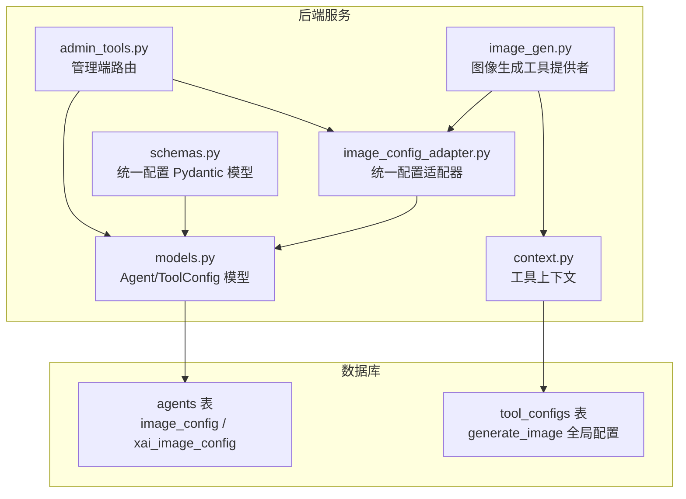
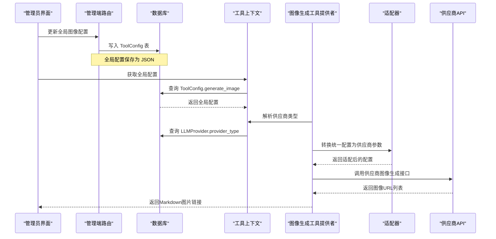
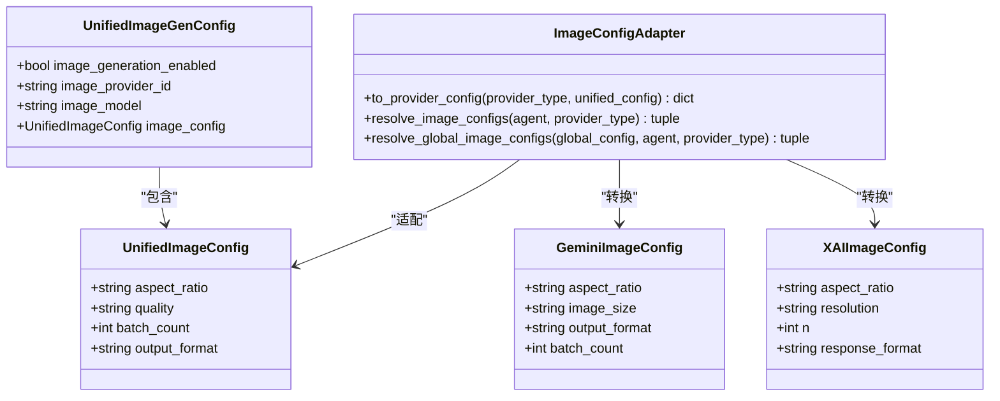
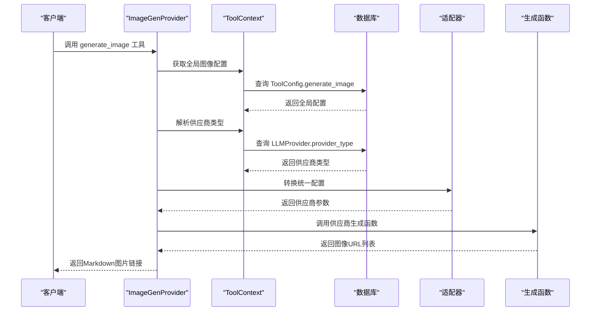
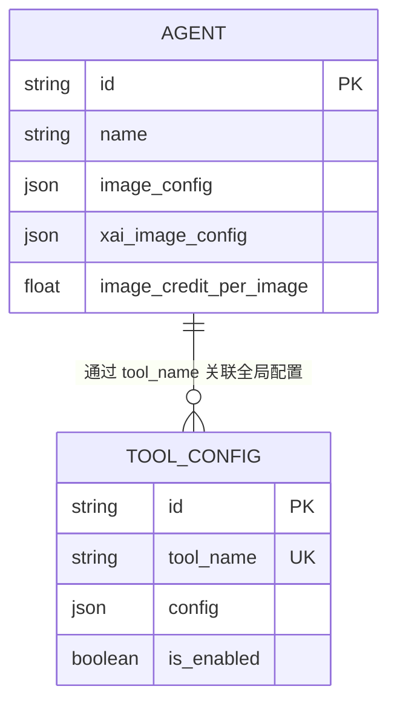
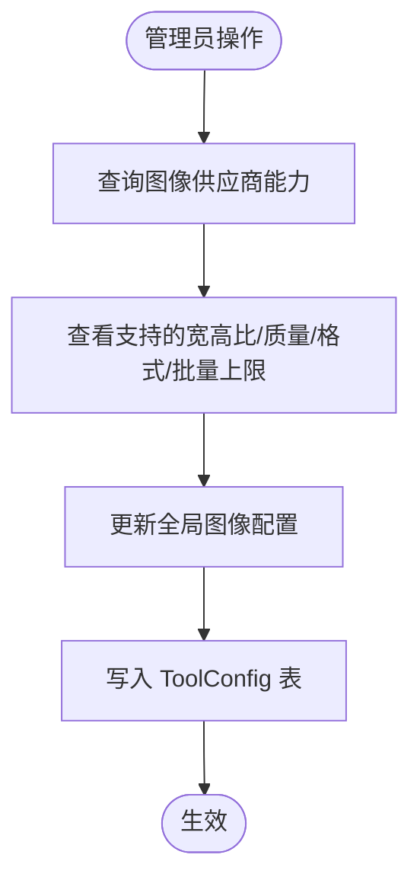
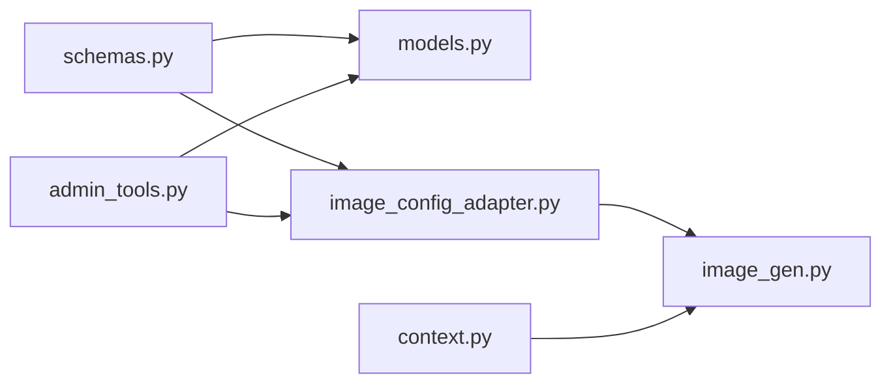

# 统一图像配置框架

<cite>
**本文档引用的文件**
- [image_config_adapter.py](file://backend/services/image_config_adapter.py)
- [models.py](file://backend/models.py)
- [schemas.py](file://backend/schemas.py)
- [image_gen.py](file://backend/services/tool_manager/providers/image_gen.py)
- [context.py](file://backend/services/tool_manager/context.py)
- [admin_tools.py](file://backend/routers/admin_tools.py)
- [a1b2c3d4e5f6_add_xai_image_config_to_agents.py](file://backend/migrations/versions/a1b2c3d4e5f6_add_xai_image_config_to_agents.py)
- [b2c3d4e5f6g7_add_unified_image_config_to_agents.py](file://backend/migrations/versions/b2c3d4e5f6g7_add_unified_image_config_to_agents.py)
</cite>

## 目录
1. [简介](#简介)
2. [项目结构](#项目结构)
3. [核心组件](#核心组件)
4. [架构总览](#架构总览)
5. [详细组件分析](#详细组件分析)
6. [依赖关系分析](#依赖关系分析)
7. [性能考虑](#性能考虑)
8. [故障排除指南](#故障排除指南)
9. [结论](#结论)

## 简介
本文件系统性阐述“统一图像配置框架”的设计与实现，目标是提供一个供应商无关的图像生成配置模型，通过适配器机制将统一配置转换为不同供应商（如 Gemini、xAI）的具体参数，从而简化配置管理、提升可维护性，并支持全局工具级别的统一配置。

该框架的关键特性包括：
- 统一配置模型：抽象出供应商无关的参数（如宽高比、质量等级、批量数量、输出格式等）
- 适配器映射：基于映射表将统一配置转换为具体供应商所需的字段与取值范围
- 全局工具配置：通过 ToolConfig 表集中管理图像生成的全局参数，支持按供应商动态下发
- 优先级策略：统一配置优先于历史遗留配置，确保平滑迁移与向后兼容

## 项目结构
围绕统一图像配置框架的核心文件分布如下：
- 服务层适配器：backend/services/image_config_adapter.py
- 数据模型：backend/models.py（包含 Agent 的统一图像配置字段）
- 请求/响应模型：backend/schemas.py（包含统一图像配置的 Pydantic 模型）
- 工具管理器与执行：backend/services/tool_manager/providers/image_gen.py
- 工具上下文：backend/services/tool_manager/context.py
- 管理端路由：backend/routers/admin_tools.py（提供图像能力查询与工具配置接口）
- 数据库迁移：添加统一图像配置与 xAI 图像配置字段

**图表来源**
- [image_config_adapter.py:1-211](file://backend/services/image_config_adapter.py#L1-L211)
- [models.py:205-262](file://backend/models.py#L205-L262)
- [schemas.py:175-234](file://backend/schemas.py#L175-L234)
- [image_gen.py:1-293](file://backend/services/tool_manager/providers/image_gen.py#L1-L293)
- [context.py:1-85](file://backend/services/tool_manager/context.py#L1-L85)
- [admin_tools.py:1-258](file://backend/routers/admin_tools.py#L1-L258)

**章节来源**
- [image_config_adapter.py:1-211](file://backend/services/image_config_adapter.py#L1-L211)
- [models.py:205-262](file://backend/models.py#L205-L262)
- [schemas.py:175-234](file://backend/schemas.py#L175-L234)
- [image_gen.py:1-293](file://backend/services/tool_manager/providers/image_gen.py#L1-L293)
- [context.py:1-85](file://backend/services/tool_manager/context.py#L1-L85)
- [admin_tools.py:1-258](file://backend/routers/admin_tools.py#L1-L258)

## 核心组件
- 统一图像配置模型（Pydantic）
  - 定义供应商无关的参数集合，包括宽高比、质量等级、批量数量、输出格式等
  - 提供强类型校验与默认值约束，确保前端与后端的一致性
- 适配器映射表
  - 将统一配置映射到具体供应商的字段与取值范围
  - 支持供应商能力查询与参数枚举动态下发
- 工具提供者与执行流程
  - 通过工具上下文解析全局配置与供应商类型
  - 将统一配置转换为供应商参数并调用对应生成函数
- 数据模型与迁移
  - Agent 表新增统一图像配置字段，兼容历史遗留配置
  - ToolConfig 表存储全局图像生成配置，支持跨供应商统一管理

**章节来源**
- [schemas.py:175-234](file://backend/schemas.py#L175-L234)
- [image_config_adapter.py:12-64](file://backend/services/image_config_adapter.py#L12-L64)
- [image_gen.py:112-119](file://backend/services/tool_manager/providers/image_gen.py#L112-L119)
- [models.py:247-256](file://backend/models.py#L247-L256)
- [a1b2c3d4e5f6_add_xai_image_config_to_agents.py:21-31](file://backend/migrations/versions/a1b2c3d4e5f6_add_xai_image_config_to_agents.py#L21-L31)
- [b2c3d4e5f6g7_add_unified_image_config_to_agents.py:21-28](file://backend/migrations/versions/b2c3d4e5f6g7_add_unified_image_config_to_agents.py#L21-L28)

## 架构总览
统一图像配置框架采用“统一模型 + 适配器 + 全局配置 + 工具执行”的分层架构：

**图表来源**
- [admin_tools.py:203-258](file://backend/routers/admin_tools.py#L203-L258)
- [context.py:57-84](file://backend/services/tool_manager/context.py#L57-L84)
- [image_gen.py:177-244](file://backend/services/tool_manager/providers/image_gen.py#L177-L244)
- [image_config_adapter.py:134-146](file://backend/services/image_config_adapter.py#L134-L146)

## 详细组件分析

### 统一配置模型与适配器
- 统一配置模型（UnifiedImageGenConfig/UnifiedImageConfig）
  - 字段：image_generation_enabled、image_provider_id、image_model、image_config
  - image_config：aspect_ratio、quality、batch_count、output_format
- 适配器映射表
  - 质量等级映射：standard/hd/ultra → 供应商特定分辨率/尺寸
  - 批量数量映射：batch_count → 供应商特定字段（如 n、batch_count），并受最大值限制
  - 宽高比支持集：按供应商列出支持的枚举值，超出则回退或忽略
  - 输出格式支持：部分供应商不支持用户指定输出格式，需遵循默认值
- 供应商能力暴露
  - IMAGE_PROVIDER_CAPABILITIES：向管理端与前端动态下发供应商能力（支持的宽高比、质量等级、输出格式、批量上限）

**图表来源**
- [schemas.py:218-234](file://backend/schemas.py#L218-L234)
- [image_config_adapter.py:12-64](file://backend/services/image_config_adapter.py#L12-L64)
- [image_config_adapter.py:70-131](file://backend/services/image_config_adapter.py#L70-L131)

**章节来源**
- [schemas.py:175-234](file://backend/schemas.py#L175-L234)
- [image_config_adapter.py:12-64](file://backend/services/image_config_adapter.py#L12-L64)
- [image_config_adapter.py:70-131](file://backend/services/image_config_adapter.py#L70-L131)

### 工具执行流程与上下文
- 工具上下文（ToolContext）
  - 缓存全局图像配置与供应商类型，避免重复查询
  - 提供懒加载能力，仅在需要时解析供应商类型
- 图像生成工具提供者（ImageGenProvider）
  - 从全局 ToolConfig 读取配置，解析供应商类型
  - 将统一配置转换为供应商参数并调用对应生成函数
  - 处理批量生成数量与错误返回

**图表来源**
- [image_gen.py:177-244](file://backend/services/tool_manager/providers/image_gen.py#L177-L244)
- [context.py:57-84](file://backend/services/tool_manager/context.py#L57-L84)
- [image_config_adapter.py:134-146](file://backend/services/image_config_adapter.py#L134-L146)

**章节来源**
- [image_gen.py:177-244](file://backend/services/tool_manager/providers/image_gen.py#L177-L244)
- [context.py:57-84](file://backend/services/tool_manager/context.py#L57-L84)

### 数据模型与迁移
- Agent 模型
  - 新增 image_config（统一图像配置，JSON）
  - 保留 xai_image_config（历史遗留配置）
  - 通过 resolve_image_configs 与 resolve_global_image_configs 实现优先级策略
- ToolConfig 模型
  - 存储工具级别的全局配置（如 generate_image）
  - 支持启用/禁用与配置内容的统一管理
- 迁移脚本
  - 添加 xai_image_config 与 image_credit_per_image 字段
  - 添加 image_config 字段以支持统一配置

**图表来源**
- [models.py:205-262](file://backend/models.py#L205-L262)
- [models.py:458-468](file://backend/models.py#L458-L468)
- [a1b2c3d4e5f6_add_xai_image_config_to_agents.py:21-31](file://backend/migrations/versions/a1b2c3d4e5f6_add_xai_image_config_to_agents.py#L21-L31)
- [b2c3d4e5f6g7_add_unified_image_config_to_agents.py:21-28](file://backend/migrations/versions/b2c3d4e5f6g7_add_unified_image_config_to_agents.py#L21-L28)

**章节来源**
- [models.py:205-262](file://backend/models.py#L205-L262)
- [models.py:458-468](file://backend/models.py#L458-L468)
- [a1b2c3d4e5f6_add_xai_image_config_to_agents.py:21-31](file://backend/migrations/versions/a1b2c3d4e5f6_add_xai_image_config_to_agents.py#L21-L31)
- [b2c3d4e5f6g7_add_unified_image_config_to_agents.py:21-28](file://backend/migrations/versions/b2c3d4e5f6g7_add_unified_image_config_to_agents.py#L21-L28)

### 管理端能力与配置
- 图像供应商能力查询
  - 管理端路由提供 /admin/tools/image-capabilities 接口，返回各供应商支持的参数能力
- 工具配置管理
  - 支持查询、更新工具配置（如 generate_image）
  - 集中管理全局图像生成开关、供应商与模型、统一配置参数

**图表来源**
- [admin_tools.py:191-197](file://backend/routers/admin_tools.py#L191-L197)
- [admin_tools.py:213-258](file://backend/routers/admin_tools.py#L213-L258)

**章节来源**
- [admin_tools.py:191-197](file://backend/routers/admin_tools.py#L191-L197)
- [admin_tools.py:213-258](file://backend/routers/admin_tools.py#L213-L258)

## 依赖关系分析
- 组件耦合
  - image_config_adapter 与 schemas、models 低耦合，通过映射表与 Pydantic 模型解耦
  - image_gen 依赖适配器与工具上下文，职责清晰
  - admin_tools 依赖适配器能力与模型，提供管理端入口
- 外部依赖
  - 供应商 API（如 Gemini、xAI）通过统一参数调用，减少直接耦合
- 循环依赖
  - 未发现循环导入；模块间通过函数调用与路由解耦

**图表来源**
- [schemas.py:175-234](file://backend/schemas.py#L175-L234)
- [models.py:205-262](file://backend/models.py#L205-L262)
- [image_config_adapter.py:1-211](file://backend/services/image_config_adapter.py#L1-L211)
- [image_gen.py:1-293](file://backend/services/tool_manager/providers/image_gen.py#L1-L293)
- [context.py:1-85](file://backend/services/tool_manager/context.py#L1-L85)
- [admin_tools.py:1-258](file://backend/routers/admin_tools.py#L1-L258)

**章节来源**
- [image_config_adapter.py:1-211](file://backend/services/image_config_adapter.py#L1-L211)
- [image_gen.py:1-293](file://backend/services/tool_manager/providers/image_gen.py#L1-L293)
- [context.py:1-85](file://backend/services/tool_manager/context.py#L1-L85)
- [admin_tools.py:1-258](file://backend/routers/admin_tools.py#L1-L258)

## 性能考虑
- 缓存策略
  - ToolContext 对全局配置与供应商类型进行缓存，减少数据库查询开销
- 参数验证
  - 通过 Pydantic 模型在入口处进行参数校验，降低后续处理成本
- 批量生成
  - 适配器与工具提供者对批量数量进行上限控制，避免超限请求
- 异步执行
  - 工具执行与数据库查询采用异步方式，提升并发性能

## 故障排除指南
- 供应商类型解析失败
  - 检查 ToolConfig 中 image_provider_id 是否正确，以及 LLMProvider 是否激活
- 适配失败或参数无效
  - 确认统一配置中的参数是否在供应商支持范围内；超出范围将被忽略或回退
- 工具不可用
  - 检查全局配置的 image_generation_enabled 开关与供应商类型是否匹配
- 批量数量异常
  - 统一配置与工具调用参数共同决定最终批量数，注意供应商最大值限制

**章节来源**
- [context.py:69-84](file://backend/services/tool_manager/context.py#L69-L84)
- [image_config_adapter.py:134-146](file://backend/services/image_config_adapter.py#L134-L146)
- [image_gen.py:177-244](file://backend/services/tool_manager/providers/image_gen.py#L177-L244)

## 结论
统一图像配置框架通过“统一模型 + 适配器 + 全局配置 + 工具执行”的设计，实现了供应商无关的图像生成参数管理。该方案具备以下优势：
- 易于扩展：新增供应商只需扩展映射表与适配函数
- 易于维护：统一配置集中管理，减少分散配置带来的复杂度
- 易于治理：管理端可动态查看供应商能力并统一配置
- 平滑迁移：保留历史遗留配置，逐步过渡到统一配置

未来可进一步增强的方向包括：
- 更细粒度的权限控制与配额管理
- 更丰富的参数校验与默认值策略
- 更完善的监控与审计日志