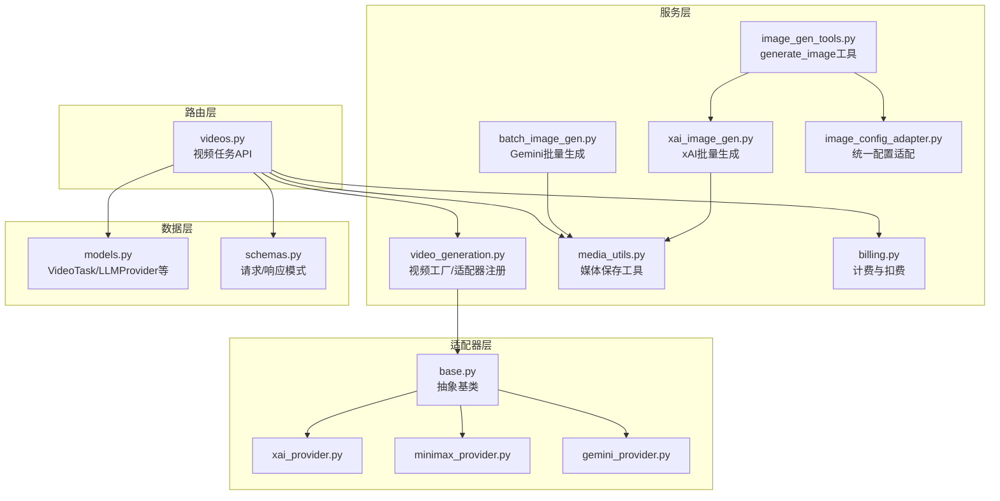
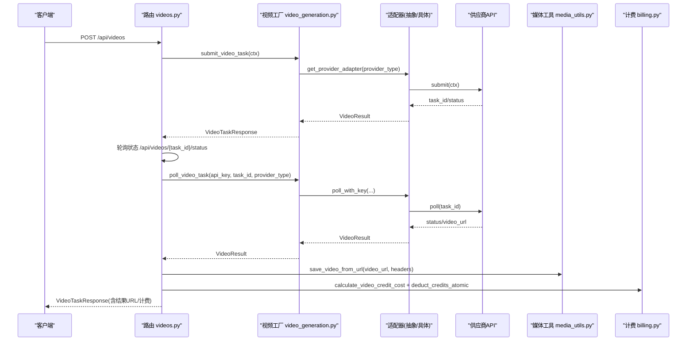
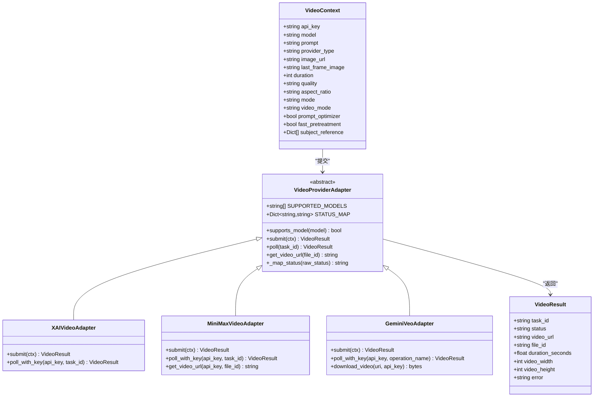
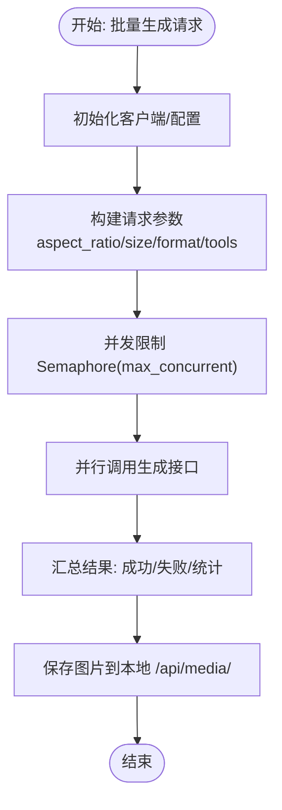
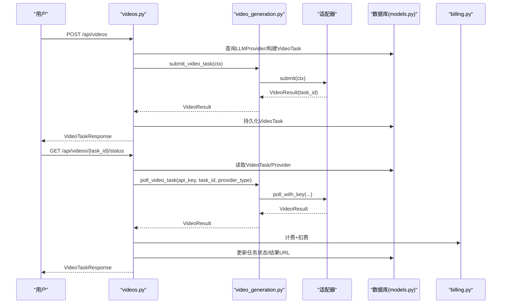
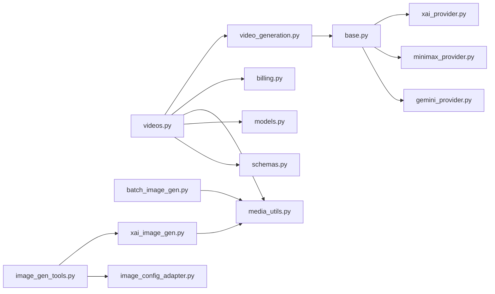

# 媒体生成服务

<cite>
**本文引用的文件**
- [video_generation.py](file://backend/services/video_generation.py)
- [batch_image_gen.py](file://backend/services/batch_image_gen.py)
- [xai_image_gen.py](file://backend/services/xai_image_gen.py)
- [image_gen_tools.py](file://backend/services/image_gen_tools.py)
- [media_utils.py](file://backend/services/media_utils.py)
- [base.py](file://backend/services/video_providers/base.py)
- [xai_provider.py](file://backend/services/video_providers/xai_provider.py)
- [minimax_provider.py](file://backend/services/video_providers/minimax_provider.py)
- [gemini_provider.py](file://backend/services/video_providers/gemini_provider.py)
- [videos.py](file://backend/routers/videos.py)
- [schemas.py](file://backend/schemas.py)
- [models.py](file://backend/models.py)
- [billing.py](file://backend/services/billing.py)
- [image_config_adapter.py](file://backend/services/image_config_adapter.py)
</cite>

## 目录
1. [简介](#简介)
2. [项目结构](#项目结构)
3. [核心组件](#核心组件)
4. [架构总览](#架构总览)
5. [详细组件分析](#详细组件分析)
6. [依赖分析](#依赖分析)
7. [性能考虑](#性能考虑)
8. [故障排查指南](#故障排查指南)
9. [结论](#结论)
10. [附录](#附录)

## 简介
本文件系统性阐述媒体生成服务，涵盖视频生成与图像生成两大能力域。视频生成服务提供统一入口，自动路由至多家供应商（xAI、MiniMax、Google Gemini Veo），支持文本到视频、以图生视频与视频编辑；图像生成服务支持批量并行生成，提供质量控制与成本计算能力；视频供应商适配器采用统一接口设计，内置状态映射、错误处理与下载逻辑；API 层提供任务调度、进度跟踪、计费与结果落盘。

## 项目结构
媒体生成服务位于后端目录，主要由以下层次构成：
- 服务层：视频生成工厂、图像生成（Gemini 与 xAI）、媒体工具、计费与配置适配
- 适配器层：视频供应商适配器（抽象基类与具体实现）
- 路由层：FastAPI 路由，负责任务提交、轮询、计费与结果落盘
- 模型与模式：数据库模型与请求/响应模式
- 配置与工具：统一图像配置适配器、媒体文件保存工具

图表来源
- [videos.py:1-343](file://backend/routers/videos.py#L1-L343)
- [video_generation.py:1-160](file://backend/services/video_generation.py#L1-L160)
- [base.py:1-114](file://backend/services/video_providers/base.py#L1-L114)
- [xai_provider.py:1-164](file://backend/services/video_providers/xai_provider.py#L1-L164)
- [minimax_provider.py:1-318](file://backend/services/video_providers/minimax_provider.py#L1-L318)
- [gemini_provider.py:1-276](file://backend/services/video_providers/gemini_provider.py#L1-L276)
- [batch_image_gen.py:1-187](file://backend/services/batch_image_gen.py#L1-L187)
- [xai_image_gen.py:1-191](file://backend/services/xai_image_gen.py#L1-L191)
- [image_gen_tools.py:1-195](file://backend/services/image_gen_tools.py#L1-L195)
- [media_utils.py:1-79](file://backend/services/media_utils.py#L1-L79)
- [billing.py:1-388](file://backend/services/billing.py#L1-L388)
- [image_config_adapter.py:1-163](file://backend/services/image_config_adapter.py#L1-L163)
- [models.py:1-447](file://backend/models.py#L1-L447)
- [schemas.py:1-859](file://backend/schemas.py#L1-L859)

章节来源
- [video_generation.py:1-160](file://backend/services/video_generation.py#L1-L160)
- [videos.py:1-343](file://backend/routers/videos.py#L1-L343)
- [models.py:1-447](file://backend/models.py#L1-L447)
- [schemas.py:1-859](file://backend/schemas.py#L1-L859)

## 核心组件
- 视频生成工厂与适配器注册：统一入口函数、适配器注册表、供应商推断
- 视频适配器：抽象基类定义统一接口，具体适配器实现供应商差异
- 图像生成服务：Gemini 与 xAI 的批量生成，支持并发与结果落地
- generate_image 工具：跨供应商的按需图像生成工具
- 媒体工具：内联图片/远程图片/远程视频保存
- 计费与扣费：映射表驱动的计费与原子扣费
- 统一图像配置适配器：将统一配置映射到各供应商参数

章节来源
- [video_generation.py:44-160](file://backend/services/video_generation.py#L44-L160)
- [base.py:15-114](file://backend/services/video_providers/base.py#L15-L114)
- [xai_provider.py:22-164](file://backend/services/video_providers/xai_provider.py#L22-L164)
- [minimax_provider.py:30-318](file://backend/services/video_providers/minimax_provider.py#L30-L318)
- [gemini_provider.py:31-276](file://backend/services/video_providers/gemini_provider.py#L31-L276)
- [batch_image_gen.py:1-187](file://backend/services/batch_image_gen.py#L1-L187)
- [xai_image_gen.py:1-191](file://backend/services/xai_image_gen.py#L1-L191)
- [image_gen_tools.py:1-195](file://backend/services/image_gen_tools.py#L1-L195)
- [media_utils.py:1-79](file://backend/services/media_utils.py#L1-L79)
- [billing.py:1-388](file://backend/services/billing.py#L1-L388)
- [image_config_adapter.py:1-163](file://backend/services/image_config_adapter.py#L1-L163)

## 架构总览
媒体生成服务采用“路由层-服务层-适配器层-数据层”的分层架构。路由层接收请求，服务层进行任务编排与计费，适配器层屏蔽供应商差异，数据层持久化任务与计费记录。

图表来源
- [videos.py:74-232](file://backend/routers/videos.py#L74-L232)
- [video_generation.py:84-124](file://backend/services/video_generation.py#L84-L124)
- [xai_provider.py:113-163](file://backend/services/video_providers/xai_provider.py#L113-L163)
- [minimax_provider.py:243-286](file://backend/services/video_providers/minimax_provider.py#L243-L286)
- [gemini_provider.py:178-222](file://backend/services/video_providers/gemini_provider.py#L178-L222)
- [media_utils.py:31-50](file://backend/services/media_utils.py#L31-L50)
- [billing.py:353-387](file://backend/services/billing.py#L353-L387)

## 详细组件分析

### 视频生成服务与适配器
- 统一入口：submit_video_task/poll_video_task 根据 provider_type 自动选择适配器
- 适配器注册表：支持 xAI、MiniMax、Gemini Veo
- 供应商推断：根据模型名推断供应商类型
- 抽象基类：VideoContext/VideoResult 定义统一上下文与结果结构
- 具体适配器：
  - xAI：支持 grok-imagine-video，状态映射、内容审核拒绝处理
  - MiniMax：支持多种模型，首尾帧、主题参考、快速预处理、文件检索下载
  - Gemini Veo：长运行操作、API Key 下载、分辨率/宽高比映射

图表来源
- [base.py:15-114](file://backend/services/video_providers/base.py#L15-L114)
- [xai_provider.py:22-164](file://backend/services/video_providers/xai_provider.py#L22-L164)
- [minimax_provider.py:30-318](file://backend/services/video_providers/minimax_provider.py#L30-L318)
- [gemini_provider.py:31-276](file://backend/services/video_providers/gemini_provider.py#L31-L276)

章节来源
- [video_generation.py:44-160](file://backend/services/video_generation.py#L44-L160)
- [base.py:15-114](file://backend/services/video_providers/base.py#L15-L114)
- [xai_provider.py:22-164](file://backend/services/video_providers/xai_provider.py#L22-L164)
- [minimax_provider.py:30-318](file://backend/services/video_providers/minimax_provider.py#L30-L318)
- [gemini_provider.py:31-276](file://backend/services/video_providers/gemini_provider.py#L31-L276)

### 图像生成服务（批量与工具）
- Gemini 批量生成：基于 aio 客户端并行生成，支持宽高比、分辨率、输出格式、Google 搜索等配置
- xAI 批量生成：基于 AsyncOpenAI 并行生成，支持宽高比、分辨率、每提示生成数量、返回格式
- generate_image 工具：按需调用图像生成，跨供应商派发，统一参数校验与结果 Markdown 化
- 统一配置适配器：将统一图像配置映射到各供应商参数，避免 if-else

图表来源
- [batch_image_gen.py:113-187](file://backend/services/batch_image_gen.py#L113-L187)
- [xai_image_gen.py:125-191](file://backend/services/xai_image_gen.py#L125-L191)
- [image_gen_tools.py:138-195](file://backend/services/image_gen_tools.py#L138-L195)
- [media_utils.py:20-28](file://backend/services/media_utils.py#L20-L28)

章节来源
- [batch_image_gen.py:1-187](file://backend/services/batch_image_gen.py#L1-L187)
- [xai_image_gen.py:1-191](file://backend/services/xai_image_gen.py#L1-L191)
- [image_gen_tools.py:1-195](file://backend/services/image_gen_tools.py#L1-L195)
- [image_config_adapter.py:1-163](file://backend/services/image_config_adapter.py#L1-L163)

### API 路由与任务生命周期
- 提交任务：解析请求、推断供应商、构建 VideoContext、提交到适配器、持久化 VideoTask
- 轮询状态：根据 provider_type 选择适配器轮询，处理超时与内容审核拒绝
- 完成处理：下载视频、计算计费、扣费、写入聊天消息、更新任务状态
- 删除任务：仅终态可删，删除本地文件与关联消息

图表来源
- [videos.py:74-232](file://backend/routers/videos.py#L74-L232)
- [video_generation.py:84-124](file://backend/services/video_generation.py#L84-L124)
- [models.py:391-422](file://backend/models.py#L391-L422)
- [billing.py:353-387](file://backend/services/billing.py#L353-L387)

章节来源
- [videos.py:1-343](file://backend/routers/videos.py#L1-L343)
- [models.py:1-447](file://backend/models.py#L1-L447)
- [schemas.py:629-691](file://backend/schemas.py#L629-L691)

## 依赖分析
- 组件耦合
  - 路由层依赖服务层与数据层，服务层依赖适配器层与工具层
  - 适配器层依赖 httpx 与供应商 API，统一抽象降低耦合
- 外部依赖
  - httpx：异步 HTTP 客户端
  - google.genai：Gemini 图像生成
  - openai.AsyncOpenAI：xAI 图像生成
- 循环依赖
  - 未发现循环依赖，模块职责清晰

图表来源
- [videos.py:1-343](file://backend/routers/videos.py#L1-L343)
- [video_generation.py:1-160](file://backend/services/video_generation.py#L1-L160)
- [base.py:1-114](file://backend/services/video_providers/base.py#L1-L114)
- [xai_provider.py:1-164](file://backend/services/video_providers/xai_provider.py#L1-L164)
- [minimax_provider.py:1-318](file://backend/services/video_providers/minimax_provider.py#L1-L318)
- [gemini_provider.py:1-276](file://backend/services/video_providers/gemini_provider.py#L1-L276)
- [batch_image_gen.py:1-187](file://backend/services/batch_image_gen.py#L1-L187)
- [xai_image_gen.py:1-191](file://backend/services/xai_image_gen.py#L1-L191)
- [image_gen_tools.py:1-195](file://backend/services/image_gen_tools.py#L1-L195)
- [media_utils.py:1-79](file://backend/services/media_utils.py#L1-L79)
- [billing.py:1-388](file://backend/services/billing.py#L1-L388)
- [image_config_adapter.py:1-163](file://backend/services/image_config_adapter.py#L1-L163)
- [models.py:1-447](file://backend/models.py#L1-L447)
- [schemas.py:1-859](file://backend/schemas.py#L1-L859)

章节来源
- [video_generation.py:1-160](file://backend/services/video_generation.py#L1-L160)
- [videos.py:1-343](file://backend/routers/videos.py#L1-L343)

## 性能考虑
- 并发控制
  - 批量图像生成使用信号量限制最大并发（1-8），避免供应商限流与资源耗尽
- I/O 优化
  - 媒体保存采用异步 HTTP 客户端，支持超时与重定向跟随
- 状态轮询
  - 路由层对终端状态直接返回，减少不必要的轮询
- 计费与扣费
  - 原子扣费避免并发冲突，计费维度映射表驱动，减少分支判断

## 故障排查指南
- 供应商错误
  - 状态映射与错误字段解析：xAI 的 moderation 拒绝、MiniMax 的 base_resp 错误、Gemini 的 error 字段
- 超时与重试
  - 路由层对 pending 且带错误超过 5 分钟判定失败；适配器层捕获异常并返回 pending/error
- 内容审核
  - xAI 适配器在完成时检查 moderation，拒绝则标记 failed
- 计费异常
  - 余额不足抛出异常，管理员冻结账户抛出冻结异常；退款与扣费均使用原子更新
- 媒体下载
  - Gemini 需要 API Key 下载视频；MiniMax 需要文件检索接口获取下载链接

章节来源
- [xai_provider.py:134-159](file://backend/services/video_providers/xai_provider.py#L134-L159)
- [minimax_provider.py:214-237](file://backend/services/video_providers/minimax_provider.py#L214-L237)
- [gemini_provider.py:212-222](file://backend/services/video_providers/gemini_provider.py#L212-L222)
- [videos.py:179-227](file://backend/routers/videos.py#L179-L227)
- [billing.py:37-43](file://backend/services/billing.py#L37-L43)

## 结论
媒体生成服务通过统一适配器与工厂模式，实现了多供应商视频生成的无缝集成；通过映射表驱动的计费与原子扣费，保障了成本控制的准确性与一致性；通过批量图像生成与并发控制，提升了生成效率与用户体验。整体架构清晰、扩展性强，便于后续新增供应商与功能增强。

## 附录

### 生成示例与最佳实践
- 视频生成
  - 参数配置：模型名、提示词、时长、质量、宽高比、视频模式（文本/图像/编辑）、首帧/尾帧图片
  - 异步处理：提交后轮询状态，完成后下载视频并落盘
  - 结果获取：通过任务 ID 查询，获取结果 URL 与计费信息
- 图像生成
  - 批量处理：设置并发度（1-8），统一配置通过适配器映射到供应商参数
  - 质量控制：校验宽高比与分辨率，Google 搜索开关
  - 成本计算：按供应商模型费率与维度映射表计算积分消耗

章节来源
- [video_generation.py:84-124](file://backend/services/video_generation.py#L84-L124)
- [videos.py:74-232](file://backend/routers/videos.py#L74-L232)
- [batch_image_gen.py:113-187](file://backend/services/batch_image_gen.py#L113-L187)
- [xai_image_gen.py:125-191](file://backend/services/xai_image_gen.py#L125-L191)
- [image_gen_tools.py:138-195](file://backend/services/image_gen_tools.py#L138-L195)
- [billing.py:353-387](file://backend/services/billing.py#L353-L387)