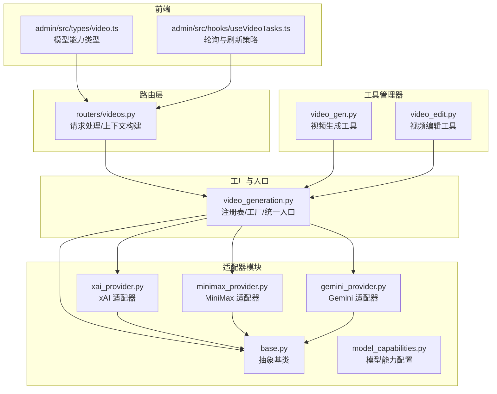
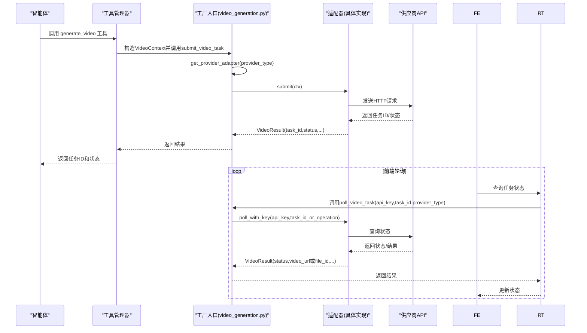
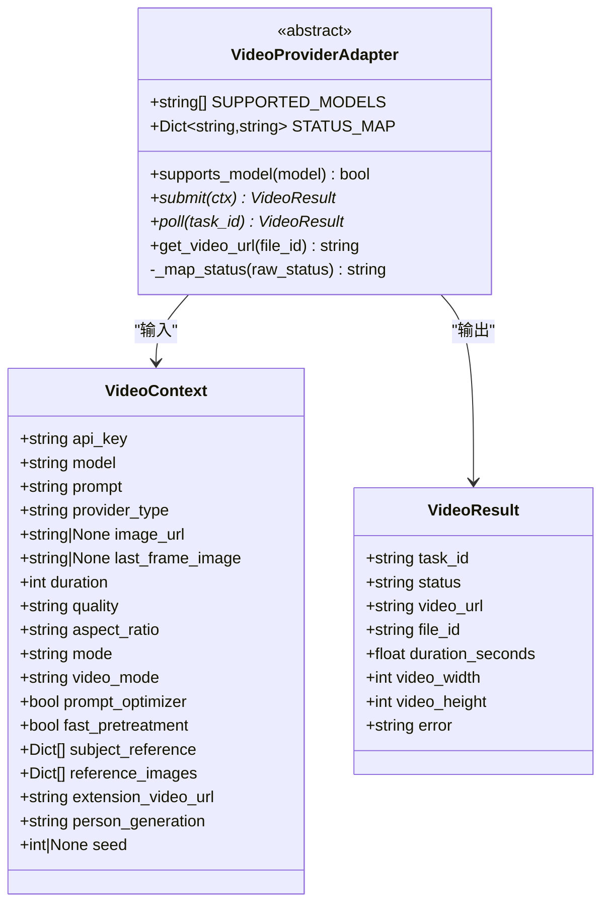
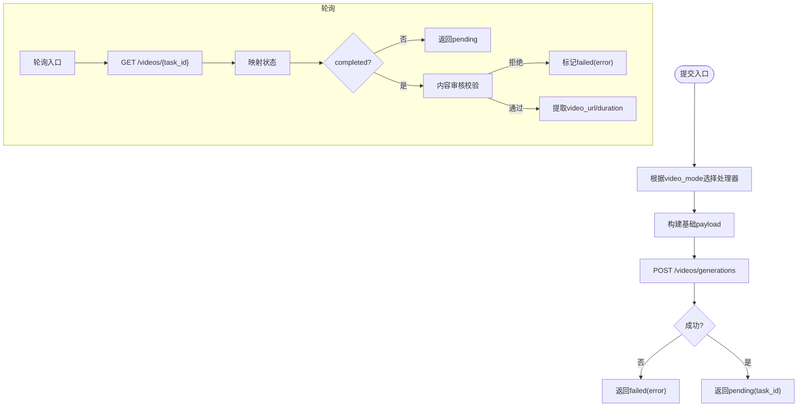
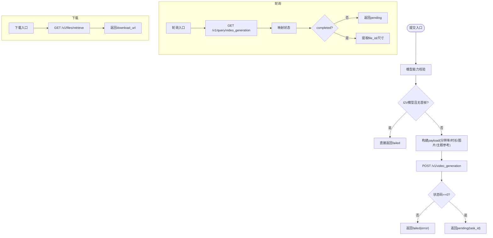
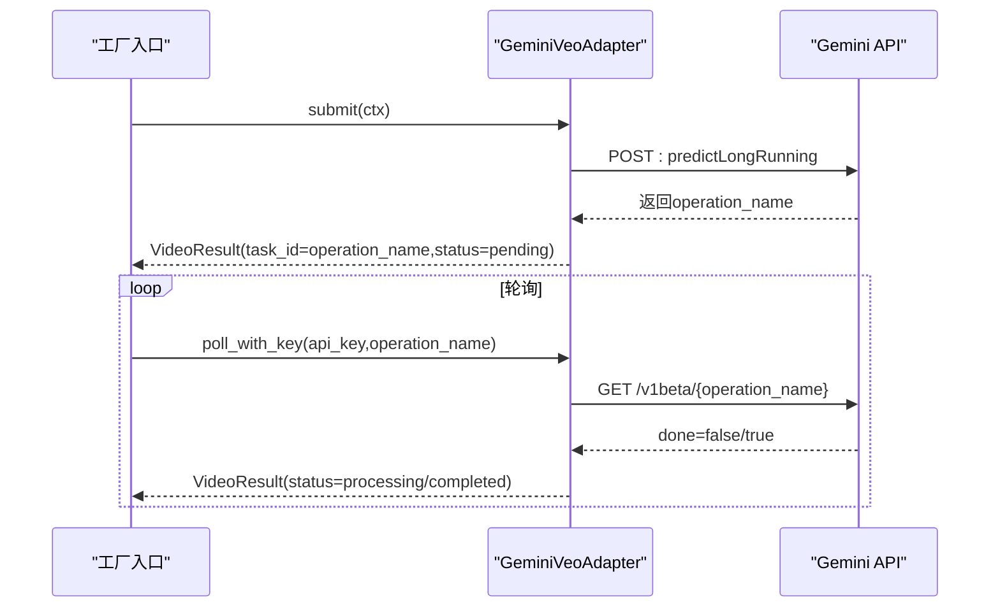
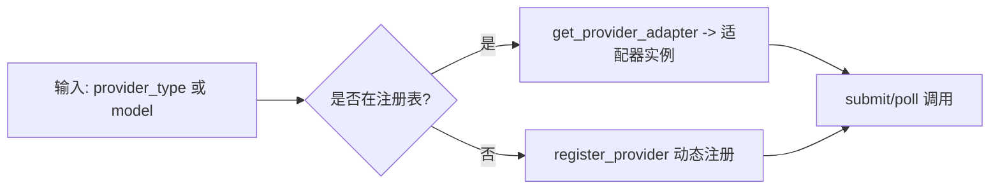
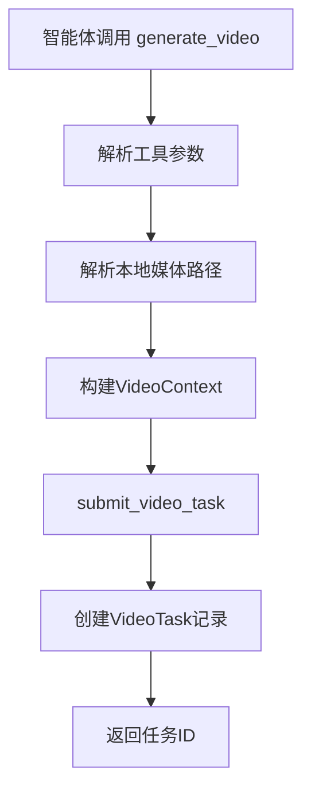
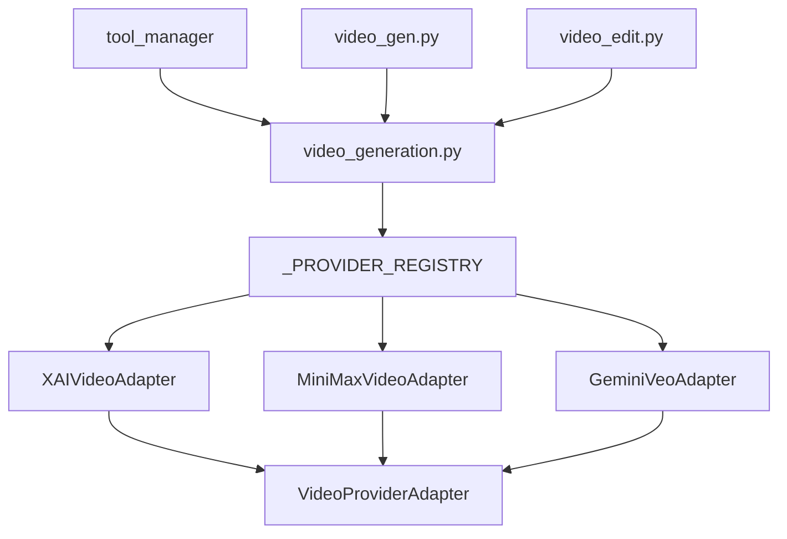

# 视频提供商适配器

<cite>
**本文引用的文件**
- [backend/services/video_providers/base.py](file://backend/services/video_providers/base.py)
- [backend/services/video_providers/xai_provider.py](file://backend/services/video_providers/xai_provider.py)
- [backend/services/video_providers/minimax_provider.py](file://backend/services/video_providers/minimax_provider.py)
- [backend/services/video_providers/gemini_provider.py](file://backend/services/video_providers/gemini_provider.py)
- [backend/services/video_providers/__init__.py](file://backend/services/video_providers/__init__.py)
- [backend/services/video_providers/model_capabilities.py](file://backend/services/video_providers/model_capabilities.py)
- [backend/services/video_generation.py](file://backend/services/video_generation.py)
- [backend/routers/videos.py](file://backend/routers/videos.py)
- [backend/admin/src/types/video.ts](file://backend/admin/src/types/video.ts)
- [backend/admin/src/hooks/useVideoTasks.ts](file://backend/admin/src/hooks/useVideoTasks.ts)
- [backend/services/tool_manager/providers/video_gen.py](file://backend/services/tool_manager/providers/video_gen.py)
- [backend/services/tool_manager/providers/video_edit.py](file://backend/services/tool_manager/providers/video_edit.py)
</cite>

## 更新摘要
**所做更改**
- 更新了Gemini Veo适配器的实现细节，包括新的工具基础视频生成接口支持
- 增强了xAI适配器的功能，支持参考图片和视频扩展模式
- 新增了工具管理器中的视频生成和编辑工具实现
- 更新了模型能力配置，支持更多视频模式和参数
- 完善了前端类型定义和工具接口文档

## 目录
1. [简介](#简介)
2. [项目结构](#项目结构)
3. [核心组件](#核心组件)
4. [架构总览](#架构总览)
5. [详细组件分析](#详细组件分析)
6. [工具基础视频生成接口](#工具基础视频生成接口)
7. [依赖关系分析](#依赖关系分析)
8. [性能考量](#性能考量)
9. [故障排查指南](#故障排查指南)
10. [结论](#结论)
11. [附录：扩展与测试指南](#附录扩展与测试指南)

## 简介
本文件系统性阐述视频提供商适配器的设计与实现，围绕适配器模式展开，覆盖抽象基类、三个具体适配器（xAI、MiniMax、Gemini Veo）的差异化实现、注册机制与工厂模式、动态选择逻辑、错误处理与重试策略，并提供扩展新供应商的实践指南与测试建议。本次更新重点介绍了新的工具基础视频生成接口，支持智能体通过工具调用进行视频生成和编辑操作。

## 项目结构
视频适配器位于后端服务目录下，采用"适配器模块 + 工厂入口 + 工具管理器"的分层组织：
- 适配器模块：video_providers（抽象基类、各供应商适配器、能力配置）
- 工厂入口：video_generation（注册表、统一入口、模型推断）
- 工具管理器：tool_manager/providers（视频生成和编辑工具）
- 路由层：routers/videos（接收请求、构造上下文、调用工厂入口）
- 前端类型与轮询：admin/src/types/video.ts、admin/src/hooks/useVideoTasks.ts

**图表来源**
- [backend/services/video_generation.py:45-76](file://backend/services/video_generation.py#L45-L76)
- [backend/services/video_providers/base.py:49-114](file://backend/services/video_providers/base.py#L49-L114)
- [backend/services/video_providers/xai_provider.py:22-164](file://backend/services/video_providers/xai_provider.py#L22-L164)
- [backend/services/video_providers/minimax_provider.py:30-318](file://backend/services/video_providers/minimax_provider.py#L30-L318)
- [backend/services/video_providers/gemini_provider.py:31-276](file://backend/services/video_providers/gemini_provider.py#L31-L276)
- [backend/services/tool_manager/providers/video_gen.py:1-334](file://backend/services/tool_manager/providers/video_gen.py#L1-L334)
- [backend/services/tool_manager/providers/video_edit.py:1-282](file://backend/services/tool_manager/providers/video_edit.py#L1-L282)
- [backend/routers/videos.py:97-138](file://backend/routers/videos.py#L97-L138)
- [backend/admin/src/types/video.ts:1-54](file://backend/admin/src/types/video.ts#L1-L54)
- [backend/admin/src/hooks/useVideoTasks.ts:1-73](file://backend/admin/src/hooks/useVideoTasks.ts#L1-L73)

**章节来源**
- [backend/services/video_providers/__init__.py:1-22](file://backend/services/video_providers/__init__.py#L1-L22)
- [backend/services/video_generation.py:1-160](file://backend/services/video_generation.py#L1-L160)
- [backend/routers/videos.py:97-138](file://backend/routers/videos.py#L97-L138)

## 核心组件
- 抽象基类 VideoProviderAdapter：定义统一接口（submit/poll/get_video_url）、状态映射、模型支持检测等。
- 数据结构 VideoContext/VideoResult：跨供应商的请求上下文与结果载体。
- 适配器实现：XAIVideoAdapter、MiniMaxVideoAdapter、GeminiVeoAdapter。
- 工厂与注册：_PROVIDER_REGISTRY、get_provider_adapter、register_provider。
- 统一入口：submit_video_task、poll_video_task；模型推断：infer_provider_type。
- 模型能力配置：VIDEO_MODEL_CAPABILITIES、get_model_capabilities 等。
- 工具接口：generate_video、edit_video 工具定义和执行逻辑。

**章节来源**
- [backend/services/video_providers/base.py:15-114](file://backend/services/video_providers/base.py#L15-L114)
- [backend/services/video_providers/__init__.py:9-21](file://backend/services/video_providers/__init__.py#L9-L21)
- [backend/services/video_generation.py:45-160](file://backend/services/video_generation.py#L45-L160)
- [backend/services/video_providers/model_capabilities.py:9-223](file://backend/services/video_providers/model_capabilities.py#L9-L223)

## 架构总览
适配器模式通过统一抽象屏蔽供应商差异，工厂负责按类型选择具体适配器，路由层将请求转换为适配器可消费的上下文，前端负责轮询与展示。新的工具基础接口通过工具管理器提供智能体调用能力。

**图表来源**
- [backend/services/tool_manager/providers/video_gen.py:176-278](file://backend/services/tool_manager/providers/video_gen.py#L176-L278)
- [backend/services/video_generation.py:84-124](file://backend/services/video_generation.py#L84-L124)
- [backend/services/video_providers/xai_provider.py:47-164](file://backend/services/video_providers/xai_provider.py#L47-L164)
- [backend/services/video_providers/minimax_provider.py:90-318](file://backend/services/video_providers/minimax_provider.py#L90-L318)
- [backend/services/video_providers/gemini_provider.py:80-276](file://backend/services/video_providers/gemini_provider.py#L80-L276)

## 详细组件分析

### 抽象基类与数据结构
- VideoContext：封装通用请求参数（api_key、model、prompt、provider_type、图片、时长、分辨率、宽高比、视频模式、MiniMax特有开关等），作为适配器输入。
- VideoResult：封装统一输出（task_id/status/video_url/file_id/duration/video_width/height/error），屏蔽供应商差异。
- VideoProviderAdapter：定义抽象接口与通用工具（supports_model、状态映射、默认get_video_url）。

**图表来源**
- [backend/services/video_providers/base.py:15-114](file://backend/services/video_providers/base.py#L15-L114)

**章节来源**
- [backend/services/video_providers/base.py:15-114](file://backend/services/video_providers/base.py#L15-L114)

### xAI 适配器（xAI Video）
- 支持模型：grok-imagine-video
- 模式处理：text_to_video/image_to_video/edit（edit复用image_to_video）
- 提交流程：构建payload（model/prompt/duration/resolution/aspect_ratio/图片），POST /videos/generations
- 轮询流程：GET /videos/{request_id}，映射状态，提取video.url/duration，内容审核校验
- 错误处理：HTTP错误/异常捕获，返回failed并记录error

**图表来源**
- [backend/services/video_providers/xai_provider.py:47-164](file://backend/services/video_providers/xai_provider.py#L47-L164)

**章节来源**
- [backend/services/video_providers/xai_provider.py:22-164](file://backend/services/video_providers/xai_provider.py#L22-L164)

### MiniMax 适配器（Hailuo 系列）
- 支持模型：Hailuo-2.3/2.3-Fast/02、T2V/I2V/S2V 系列
- 能力分类：T2V/I2V/S2V 模型集合，首尾帧支持模型集合
- 提交流程：能力校验（I2V必须提供首帧图片，S2V需要subject_reference），构建payload（分辨率映射、时长裁剪至6/10、快速预处理、图片参数、主题参考），POST /v1/video_generation
- 轮询流程：GET /v1/query/video_generation?task_id=xxx，映射状态，完成时提取file_id与尺寸
- 下载流程：GET /v1/files/retrieve?file_id=xxx，提取download_url（有效期约1小时）

**图表来源**
- [backend/services/video_providers/minimax_provider.py:90-318](file://backend/services/video_providers/minimax_provider.py#L90-L318)

**章节来源**
- [backend/services/video_providers/minimax_provider.py:30-318](file://backend/services/video_providers/minimax_provider.py#L30-L318)

### Gemini 适配器（Veo 系列）
- 支持模型：veo-3.1-generate-preview/fast、veo-2.0-generate-001
- 能力分类：原生音频/首尾帧/参考图片/视频扩展模型集合
- 提交流程：构建instances/parameters（prompt/图片/lastFrame/宽高比/分辨率/时长），POST /models/{model}:predictLongRunning
- 轮询流程：GET /v1beta/{operation_name}，done=true即completed，提取video.uri
- 下载流程：使用x-goog-api-key访问video.uri下载视频

**图表来源**
- [backend/services/video_providers/gemini_provider.py:80-276](file://backend/services/video_providers/gemini_provider.py#L80-L276)

**章节来源**
- [backend/services/video_providers/gemini_provider.py:31-276](file://backend/services/video_providers/gemini_provider.py#L31-L276)

### 工厂与注册机制
- 注册表：_PROVIDER_REGISTRY 映射字符串键到适配器类
- 获取适配器：get_provider_adapter(provider_type) 不存在则抛出异常
- 动态注册：register_provider(provider_type, adapter_cls) 运行时扩展
- 统一入口：
  - submit_video_task(ctx)：根据ctx.provider_type自动选择适配器
  - poll_video_task(api_key, task_id, provider_type)：带key轮询；MiniMax完成后自动获取下载URL
- 模型推断：infer_provider_type(model) 基于模型名特征推断供应商类型

**图表来源**
- [backend/services/video_generation.py:45-160](file://backend/services/video_generation.py#L45-L160)

**章节来源**
- [backend/services/video_generation.py:45-160](file://backend/services/video_generation.py#L45-L160)

### 路由层与前端交互
- 路由层：routers/videos.py 接收请求，构造VideoContext，调用submit_video_task，失败时抛出HTTP 502
- 前端：admin/src/hooks/useVideoTasks.ts 使用SWR轮询活跃任务，每5秒并发查询 /videos/{id}/status，驱动后端轮询并写入数据库

**章节来源**
- [backend/routers/videos.py:97-138](file://backend/routers/videos.py#L97-L138)
- [backend/admin/src/hooks/useVideoTasks.ts:1-73](file://backend/admin/src/hooks/useVideoTasks.ts#L1-L73)

## 工具基础视频生成接口

### 视频生成工具（generate_video）
新的工具接口通过工具管理器提供智能体调用视频生成的能力：

- **工具定义**：动态构建OpenAI格式的工具定义，根据模型能力配置参数枚举
- **执行流程**：解析工具参数 → 构建VideoContext → 调用submit_video_task → 创建VideoTask记录
- **参数支持**：prompt、video_mode、aspect_ratio、duration、quality、image_url
- **能力检测**：根据模型能力动态启用/禁用参数和模式

**图表来源**
- [backend/services/tool_manager/providers/video_gen.py:176-278](file://backend/services/tool_manager/providers/video_gen.py#L176-L278)

**章节来源**
- [backend/services/tool_manager/providers/video_gen.py:1-334](file://backend/services/tool_manager/providers/video_gen.py#L1-L334)

### 视频编辑工具（edit_video）
提供视频编辑和扩展功能的工具接口：

- **模式支持**：edit（编辑现有视频）、video_extension（扩展视频）
- **参数配置**：video_url、prompt、mode、duration
- **能力映射**：根据模型能力动态启用编辑或扩展模式
- **执行逻辑**：根据模式设置不同的VideoContext参数

**章节来源**
- [backend/services/tool_manager/providers/video_edit.py:1-282](file://backend/services/tool_manager/providers/video_edit.py#L1-L282)

### 模型能力配置增强
更新的模型能力配置支持更多视频模式和参数：

- **参考图片支持**：Veo 3.1/3.1 Fast系列支持最多3张参考图片
- **视频扩展支持**：Veo 3.1/3.1 Fast系列支持视频扩展模式
- **首尾帧插值**：Veo 3.1系列支持首尾帧插值生成
- **随机种子**：Veo 3+系列支持seed参数控制生成一致性

**章节来源**
- [backend/services/video_providers/model_capabilities.py:221-328](file://backend/services/video_providers/model_capabilities.py#L221-L328)

## 依赖关系分析
- 低耦合：适配器均继承自同一抽象基类，统一接口降低上层依赖复杂度
- 可扩展：通过注册表与工厂模式，新增供应商只需实现适配器并注册
- 工具集成：工具管理器通过统一的VideoContext接口与适配器交互
- 外部依赖：httpx 异步HTTP客户端；供应商API（xAI/MiniMax/Gemini）
- 前后端协作：前端轮询驱动后端适配器轮询，保证状态一致性

**图表来源**
- [backend/services/video_generation.py:45-76](file://backend/services/video_generation.py#L45-L76)
- [backend/services/video_providers/base.py:49-114](file://backend/services/video_providers/base.py#L49-L114)
- [backend/services/tool_manager/providers/video_gen.py:284-334](file://backend/services/tool_manager/providers/video_gen.py#L284-L334)

**章节来源**
- [backend/services/video_generation.py:45-76](file://backend/services/video_generation.py#L45-L76)
- [backend/services/video_providers/base.py:49-114](file://backend/services/video_providers/base.py#L49-L114)

## 性能考量
- 异步HTTP：统一使用httpx.AsyncClient，避免阻塞
- 超时控制：提交/轮询分别设置不同超时（如60s/30s），防止长时间占用
- 日志脱敏：对图片字段进行脱敏输出，避免敏感信息泄露
- 前端轮询节流：活跃任务5秒一次，减少供应商压力与网络开销
- MiniMax下载URL有效期：注意缓存与及时使用，避免过期导致二次请求
- 工具执行优化：本地媒体文件转换为data URI，提高供应商API兼容性

## 故障排查指南
- 提交失败
  - xAI：检查请求体与API密钥，关注HTTP 4xx/5xx与错误信息
  - MiniMax：检查模型能力（I2V必须提供首帧图片、S2V必须提供subject_reference），关注base_resp.status_code/status_msg
  - Gemini：确认模型名与参数组合，检查operation.done字段
- 轮询异常
  - 统一入口会捕获异常并返回pending状态，前端应持续轮询直至完成或失败
  - MiniMax完成后需调用get_video_url获取下载地址
- 工具执行问题
  - 检查全局配置是否正确设置video_provider_id和video_model
  - 验证模型能力配置是否支持所需的视频模式
  - 确认本地媒体文件路径可被工具访问
- 前端轮询
  - 若状态长时间不变，检查后端轮询是否正常，确认 /videos/{id}/status 是否被触发

**章节来源**
- [backend/services/video_providers/xai_provider.py:84-103](file://backend/services/video_providers/xai_provider.py#L84-L103)
- [backend/services/video_providers/minimax_provider.py:196-237](file://backend/services/video_providers/minimax_provider.py#L196-L237)
- [backend/services/video_providers/gemini_provider.py:140-160](file://backend/services/video_providers/gemini_provider.py#L140-L160)
- [backend/services/video_generation.py:101-124](file://backend/services/video_generation.py#L101-L124)
- [backend/admin/src/hooks/useVideoTasks.ts:34-48](file://backend/admin/src/hooks/useVideoTasks.ts#L34-L48)

## 结论
该适配器体系以适配器模式为核心，结合工厂与注册表实现多供应商统一接入；通过抽象基类与统一数据结构屏蔽供应商差异，配合前端轮询与后端驱动，形成稳定可靠的视频生成流水线。新增的工具基础接口进一步增强了系统的灵活性，支持智能体通过标准化工具调用进行视频生成和编辑操作。扩展新供应商成本低，遵循既有规范即可快速集成。

## 附录：扩展与测试指南

### 新供应商集成步骤
- 实现适配器
  - 继承 VideoProviderAdapter，定义 SUPPORTED_MODELS 与 STATUS_MAP
  - 实现 submit(ctx) 与 poll_with_key(api_key, task_id_or_operation)
  - 如需下载URL，实现 get_video_url(api_key, file_id_or_uri)
- 注册适配器
  - 在 video_generation.py 的 _PROVIDER_REGISTRY 中注册 provider_type -> 适配器类
  - 导出适配器并在 video_providers/__init__.py 中导出
- 模型能力配置
  - 在 model_capabilities.py 中补充 VIDEO_MODEL_CAPABILITIES 条目
- 路由与前端
  - 路由层支持 provider_type 与模型推断 infer_provider_type
  - 前端类型与UI根据能力配置渲染可选项
- 工具接口支持
  - 在工具管理器中添加相应的工具定义和执行逻辑
  - 更新模型能力配置以支持新的视频模式

**章节来源**
- [backend/services/video_generation.py:45-76](file://backend/services/video_generation.py#L45-L76)
- [backend/services/video_providers/__init__.py:9-21](file://backend/services/video_providers/__init__.py#L9-L21)
- [backend/services/video_providers/model_capabilities.py:22-223](file://backend/services/video_providers/model_capabilities.py#L22-L223)

### 接口实现要点
- submit：构建payload，发送HTTP请求，返回 VideoResult(task_id, status)
- poll_with_key：轮询供应商状态，映射为内部状态，完成时填充 video_url/file_id/duration 等
- get_video_url：仅在必要时实现（如MiniMax），返回可下载URL
- 日志与错误：对敏感字段脱敏，记录关键信息，异常转为failed并附带error
- 工具接口：实现标准的OpenAI格式工具定义，支持动态参数枚举

**章节来源**
- [backend/services/video_providers/base.py:70-114](file://backend/services/video_providers/base.py#L70-L114)
- [backend/services/video_providers/minimax_provider.py:288-318](file://backend/services/video_providers/minimax_provider.py#L288-L318)
- [backend/services/tool_manager/providers/video_gen.py:79-157](file://backend/services/tool_manager/providers/video_gen.py#L79-L157)

### 测试策略
- 单元测试
  - 适配器方法：模拟HTTP响应，验证submit/poll返回值与状态映射
  - 工厂与注册：验证 get_provider_adapter/register_provider 行为
  - 模型推断：基于模型名特征验证 infer_provider_type
  - 工具接口：测试工具定义构建和执行逻辑
- 集成测试
  - 路由层：构造VideoContext，调用 submit_video_task/poll_video_task，验证状态流转
  - 前端轮询：模拟活跃任务，验证轮询间隔与后端驱动
  - 工具执行：测试generate_video和edit_video工具的完整流程
- 性能测试
  - 并发提交与轮询，评估超时与重试策略
  - MiniMax下载URL过期场景下的重试与降级
  - 工具执行的内存和CPU使用情况

**章节来源**
- [backend/services/video_generation.py:129-160](file://backend/services/video_generation.py#L129-L160)
- [backend/admin/src/hooks/useVideoTasks.ts:34-48](file://backend/admin/src/hooks/useVideoTasks.ts#L34-L48)
- [backend/services/tool_manager/providers/video_gen.py:176-278](file://backend/services/tool_manager/providers/video_gen.py#L176-L278)