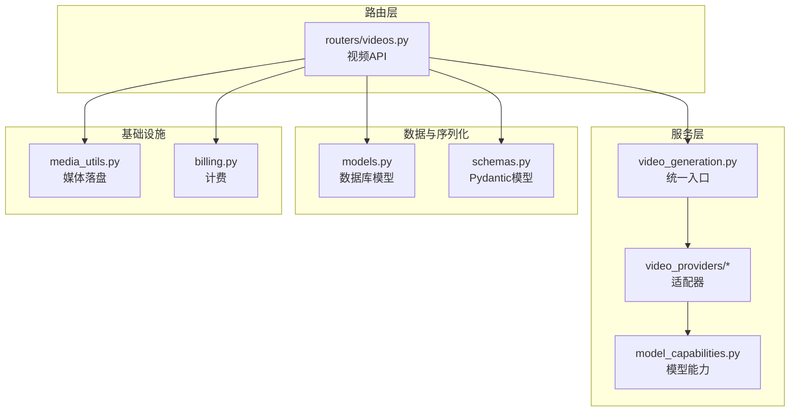
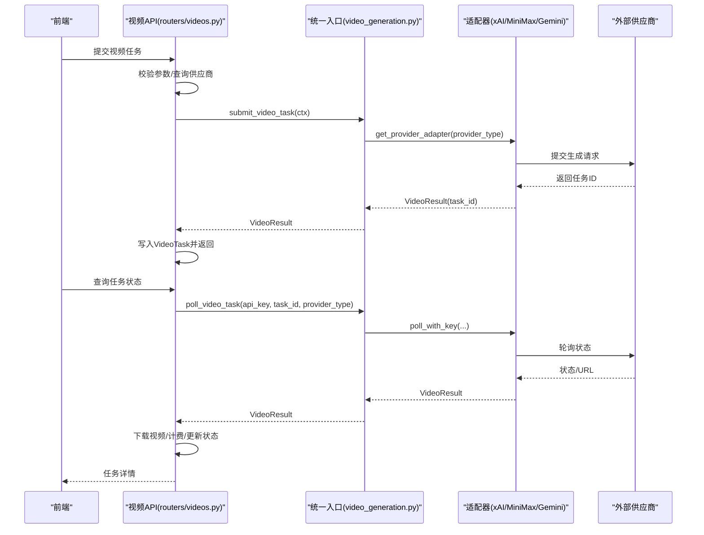
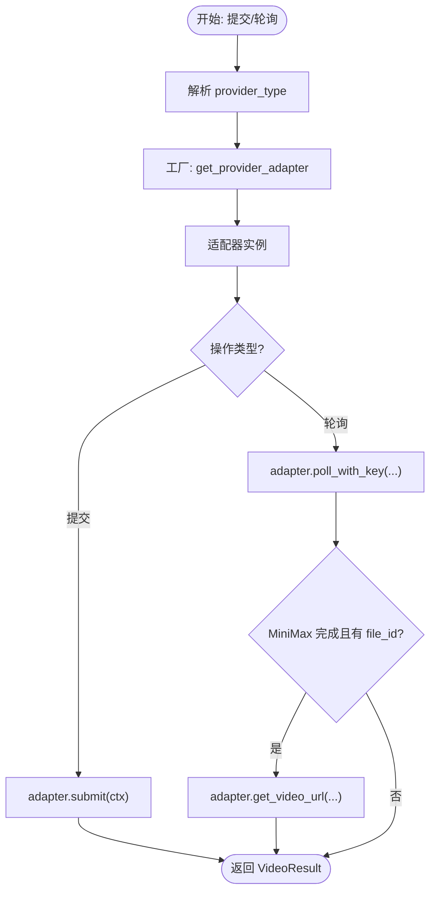
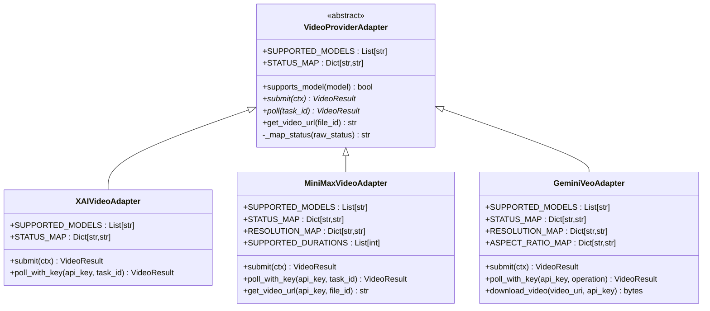
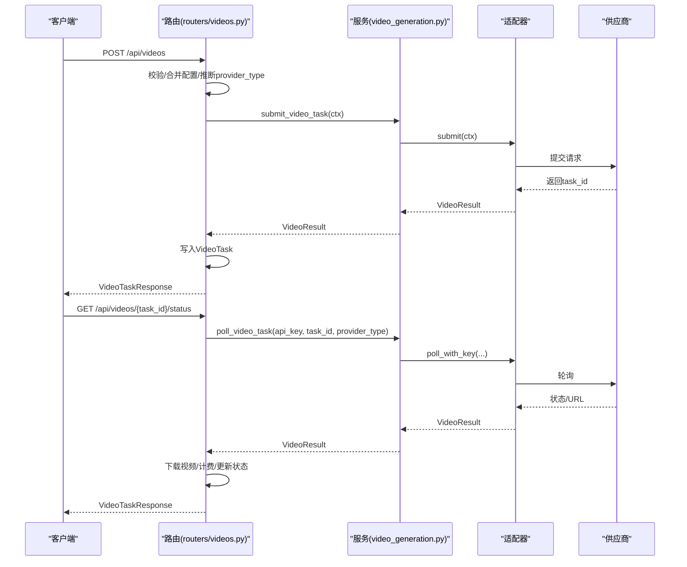
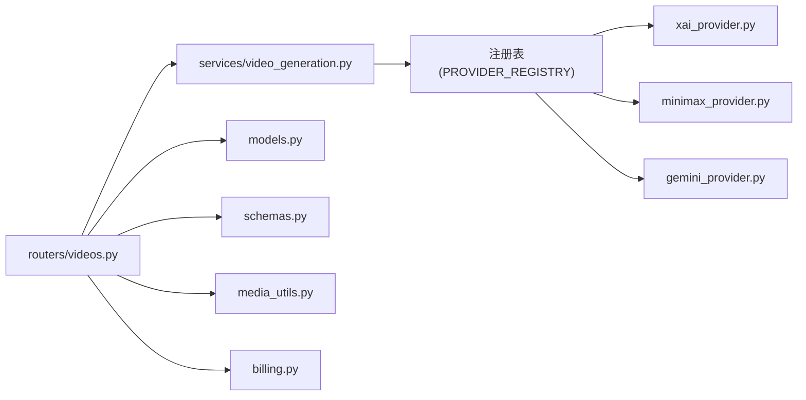

# 视频生成系统

<cite>
**本文引用的文件**
- [video_generation.py](file://backend/services/video_generation.py)
- [videos.py](file://backend/routers/videos.py)
- [base.py](file://backend/services/video_providers/base.py)
- [__init__.py](file://backend/services/video_providers/__init__.py)
- [xai_provider.py](file://backend/services/video_providers/xai_provider.py)
- [minimax_provider.py](file://backend/services/video_providers/minimax_provider.py)
- [gemini_provider.py](file://backend/services/video_providers/gemini_provider.py)
- [model_capabilities.py](file://backend/services/video_providers/model_capabilities.py)
- [models.py](file://backend/models.py)
- [schemas.py](file://backend/schemas.py)
- [media_utils.py](file://backend/services/media_utils.py)
- [billing.py](file://backend/services/billing.py)
</cite>

## 目录
1. [简介](#简介)
2. [项目结构](#项目结构)
3. [核心组件](#核心组件)
4. [架构总览](#架构总览)
5. [详细组件分析](#详细组件分析)
6. [依赖关系分析](#依赖关系分析)
7. [性能考虑](#性能考虑)
8. [故障排查指南](#故障排查指南)
9. [结论](#结论)
10. [附录](#附录)

## 简介
本系统提供统一的视频生成服务，支持多家供应商（xAI、MiniMax、Gemini Veo），通过适配器模式屏蔽供应商差异，向上提供一致的提交与轮询接口。系统包含完整的任务生命周期管理：任务提交、状态轮询、结果获取、计费与本地媒体落盘、以及与前端的集成。

## 项目结构
- 服务层
  - 视频生成统一入口：[video_generation.py](file://backend/services/video_generation.py)
  - 供应商适配器：[base.py](file://backend/services/video_providers/base.py)、[xai_provider.py](file://backend/services/video_providers/xai_provider.py)、[minimax_provider.py](file://backend/services/video_providers/minimax_provider.py)、[gemini_provider.py](file://backend/services/video_providers/gemini_provider.py)、[__init__.py](file://backend/services/video_providers/__init__.py)
  - 模型能力配置：[model_capabilities.py](file://backend/services/video_providers/model_capabilities.py)
- 路由层
  - 视频任务 API：[videos.py](file://backend/routers/videos.py)
- 数据模型与序列化
  - 数据模型：[models.py](file://backend/models.py)
  - Pydantic 序列化模型：[schemas.py](file://backend/schemas.py)
- 媒体与计费
  - 媒体工具：[media_utils.py](file://backend/services/media_utils.py)
  - 计费工具：[billing.py](file://backend/services/billing.py)

图表来源
- [video_generation.py:1-160](file://backend/services/video_generation.py#L1-L160)
- [videos.py:1-343](file://backend/routers/videos.py#L1-L343)
- [base.py:1-114](file://backend/services/video_providers/base.py#L1-L114)
- [model_capabilities.py:1-223](file://backend/services/video_providers/model_capabilities.py#L1-L223)
- [models.py:391-422](file://backend/models.py#L391-L422)
- [schemas.py:631-690](file://backend/schemas.py#L631-L690)
- [media_utils.py:1-79](file://backend/services/media_utils.py#L1-L79)
- [billing.py:1-200](file://backend/services/billing.py#L1-L200)

章节来源
- [video_generation.py:1-160](file://backend/services/video_generation.py#L1-L160)
- [videos.py:1-343](file://backend/routers/videos.py#L1-L343)

## 核心组件
- 统一入口函数
  - submit_video_task(ctx): 根据 ctx.provider_type 选择适配器并提交任务，返回 VideoResult。
  - poll_video_task(api_key, task_id, provider_type): 带 key 轮询任务状态；对 MiniMax 进一步获取下载 URL。
- 适配器基类与注册
  - VideoProviderAdapter 抽象基类定义统一接口；各供应商实现 submit/poll/get_video_url。
  - 注册表 PROVIDER_REGISTRY 将字符串键映射到适配器类，支持动态扩展。
- 数据模型与序列化
  - VideoContext/VideoResult 作为跨供应商的统一数据载体。
  - VideoTask 数据模型持久化任务状态与计费信息。
  - Pydantic 模型 VideoGenerateRequest/VideoTaskResponse 用于 API 输入输出校验与序列化。
- 模型能力配置
  - model_capabilities 提供各模型支持的模式、分辨率、时长、首尾帧等能力清单。
- 计费与媒体
  - billing 计算视频消耗并原子扣费；media_utils 从 URL 下载并保存视频至本地。

章节来源
- [video_generation.py:84-160](file://backend/services/video_generation.py#L84-L160)
- [base.py:49-114](file://backend/services/video_providers/base.py#L49-L114)
- [models.py:391-422](file://backend/models.py#L391-L422)
- [schemas.py:631-690](file://backend/schemas.py#L631-L690)
- [model_capabilities.py:22-223](file://backend/services/video_providers/model_capabilities.py#L22-L223)
- [media_utils.py:31-79](file://backend/services/media_utils.py#L31-L79)
- [billing.py:178-200](file://backend/services/billing.py#L178-L200)

## 架构总览
系统采用“路由层-服务层-适配器层-供应商”的分层设计。路由层负责鉴权、参数校验与任务持久化；服务层提供统一入口与适配器工厂；适配器层对接不同供应商 API；底层通过数据库与媒体存储完成状态与产物管理。

图表来源
- [videos.py:74-232](file://backend/routers/videos.py#L74-L232)
- [video_generation.py:84-124](file://backend/services/video_generation.py#L84-L124)
- [xai_provider.py:47-164](file://backend/services/video_providers/xai_provider.py#L47-L164)
- [minimax_provider.py:90-287](file://backend/services/video_providers/minimax_provider.py#L90-L287)
- [gemini_provider.py:80-222](file://backend/services/video_providers/gemini_provider.py#L80-L222)

## 详细组件分析

### 统一入口与适配器工厂
- submit_video_task(ctx)
  - 解析 ctx.provider_type，默认 xAI（向后兼容）。
  - 通过工厂函数 get_provider_adapter(provider_type) 获取适配器实例。
  - 调用 adapter.submit(ctx)，返回 VideoResult。
- poll_video_task(api_key, task_id, provider_type)
  - 通过工厂函数获取适配器。
  - 调用 adapter.poll_with_key(api_key, task_id)。
  - 对 MiniMax：当状态完成且存在 file_id 时，额外调用 adapter.get_video_url(api_key, file_id) 获取下载 URL。
- infer_provider_type(model)
  - 根据模型名特征推断供应商类型（优先级：Gemini Veo > MiniMax > xAI）。

图表来源
- [video_generation.py:84-124](file://backend/services/video_generation.py#L84-L124)
- [video_generation.py:129-160](file://backend/services/video_generation.py#L129-L160)

章节来源
- [video_generation.py:54-124](file://backend/services/video_generation.py#L54-L124)
- [video_generation.py:129-160](file://backend/services/video_generation.py#L129-L160)

### 适配器基类与具体实现
- VideoProviderAdapter 抽象基类
  - 定义 SUPPORTED_MODELS、STATUS_MAP。
  - 抽象方法：submit(ctx)->VideoResult、poll(task_id)->VideoResult。
  - 可选：get_video_url(file_id)->str。
  - 工具：_map_status(raw_status)、supports_model(model)。
- VideoContext/VideoResult
  - VideoContext：统一的请求上下文（api_key、model、prompt、provider_type、图片、时长、分辨率、纵横比、模式、视频模式、MiniMax 特有参数等）。
  - VideoResult：统一的结果载体（task_id、status、video_url、file_id、时长、宽高、错误信息）。
- 具体适配器
  - xAI 适配器
    - 支持 grok-imagine-video。
    - 支持模式：text_to_video、image_to_video、edit。
    - 状态映射：queued/pending/in_progress/processing/succeeded/completed/done -> pending/processing/completed/failed。
    - 轮询时进行内容审核检查，拒绝则标记 failed。
  - MiniMax 适配器
    - 支持模型：Hailuo-2.x、T2V-01、I2V-01、S2V-01 等。
    - 模型能力检查：I2V 模型必须提供首帧图片；T2V 模型自动切换到 text_to_video；S2V 需要主题参考。
    - 分辨率映射、时长约束（6/10）、快速预处理、首尾帧支持。
    - 轮询完成后返回 file_id，需二次调用 get_video_url 获取下载 URL。
  - Gemini Veo 适配器
    - 支持 veo-3.1-generate-preview/fast、veo-2.0-generate-001。
    - 状态映射：done=false->processing，done=true->completed。
    - 支持首尾帧、参考图片、4k 分辨率（取决于模型）。
    - 轮询返回 video.uri，可通过 download_video 下载。

图表来源
- [base.py:49-114](file://backend/services/video_providers/base.py#L49-L114)
- [xai_provider.py:22-164](file://backend/services/video_providers/xai_provider.py#L22-L164)
- [minimax_provider.py:30-318](file://backend/services/video_providers/minimax_provider.py#L30-L318)
- [gemini_provider.py:31-276](file://backend/services/video_providers/gemini_provider.py#L31-L276)

章节来源
- [base.py:15-114](file://backend/services/video_providers/base.py#L15-L114)
- [xai_provider.py:22-164](file://backend/services/video_providers/xai_provider.py#L22-L164)
- [minimax_provider.py:30-318](file://backend/services/video_providers/minimax_provider.py#L30-L318)
- [gemini_provider.py:31-276](file://backend/services/video_providers/gemini_provider.py#L31-L276)

### 路由与任务生命周期
- 任务提交
  - 校验请求参数，合并默认配置，推断 provider_type。
  - 构造 VideoContext，调用 submit_video_task(ctx)。
  - 若提交失败，抛出 502；成功则写入 VideoTask 并返回。
- 状态轮询
  - 读取 VideoTask，若为终态则直接返回。
  - 否则根据 provider_type 调用 poll_video_task，超时保护：pending 且轮询错误超过 5 分钟判定失败。
  - 完成后下载视频、计算时长、计费、插入聊天消息。
- 模型能力查询
  - 提供 /model-capabilities/{model_name} 接口，返回模型能力配置。
- 任务删除
  - 仅允许删除终态任务，同时清理本地媒体文件与关联消息。

图表来源
- [videos.py:74-232](file://backend/routers/videos.py#L74-L232)
- [video_generation.py:84-124](file://backend/services/video_generation.py#L84-L124)

章节来源
- [videos.py:74-232](file://backend/routers/videos.py#L74-L232)

### 数据模型与序列化
- VideoTask
  - 字段：xai_task_id、session_id、provider_id、model、user_id、video_mode、prompt、image_url、duration、quality、aspect_ratio、mode、status、result_video_url、error_message、input_image_count、output_duration_seconds、credit_cost、created_at、completed_at。
- Pydantic 模型
  - VideoConfig：duration、quality、aspect_ratio、mode、prompt_optimizer、fast_pretreatment。
  - VideoGenerateRequest：provider_id、model、session_id、video_mode、prompt、image_url、last_frame_image、config。
  - VideoTaskResponse：任务查询返回结构，包含状态、URL、计费、错误信息等。

章节来源
- [models.py:391-422](file://backend/models.py#L391-L422)
- [schemas.py:631-690](file://backend/schemas.py#L631-L690)

### 模型能力与供应商推断
- model_capabilities
  - 提供各模型的支持模式、时长、分辨率、首尾帧、优化器等能力配置。
  - 提供查询接口：get_model_capabilities、get_supported_models、get_models_by_provider。
- infer_provider_type(model)
  - 根据模型名特征判断供应商类型（Veolia 优先于 MiniMax，再为 xAI）。

章节来源
- [model_capabilities.py:22-223](file://backend/services/video_providers/model_capabilities.py#L22-L223)
- [video_generation.py:129-160](file://backend/services/video_generation.py#L129-L160)

### 媒体与计费
- 媒体工具
  - save_video_from_url(video_url, headers)：下载远端视频并保存至 /api/media/{uuid}.mp4。
  - 带 headers 支持（如 Gemini 需要 x-goog-api-key）。
- 计费
  - calculate_video_credit_cost：基于 VideoTask 与 provider.model_costs 计算消耗。
  - deduct_credits_atomic：原子扣费，支持并发安全。
  - InsufficientCreditsError：余额不足异常。

章节来源
- [media_utils.py:31-79](file://backend/services/media_utils.py#L31-L79)
- [billing.py:178-200](file://backend/services/billing.py#L178-L200)

## 依赖关系分析
- 组件耦合
  - 路由层依赖统一入口与适配器工厂；统一入口依赖适配器注册表；适配器依赖供应商 API。
  - VideoTask 与 LLMProvider 关联，便于按供应商查询 API Key 与计费配置。
- 外部依赖
  - httpx 异步 HTTP 客户端用于调用供应商 API。
  - SQLAlchemy 异步 ORM 用于任务持久化与计费事务。
- 循环依赖
  - 未发现循环导入；适配器模块通过 __init__.py 暴露统一接口。

图表来源
- [videos.py:16-18](file://backend/routers/videos.py#L16-L18)
- [video_generation.py:47-75](file://backend/services/video_generation.py#L47-L75)
- [xai_provider.py:1-164](file://backend/services/video_providers/xai_provider.py#L1-L164)
- [minimax_provider.py:1-318](file://backend/services/video_providers/minimax_provider.py#L1-L318)
- [gemini_provider.py:1-276](file://backend/services/video_providers/gemini_provider.py#L1-L276)
- [models.py:146-169](file://backend/models.py#L146-L169)
- [schemas.py:631-690](file://backend/schemas.py#L631-L690)
- [media_utils.py:1-79](file://backend/services/media_utils.py#L1-L79)
- [billing.py:1-200](file://backend/services/billing.py#L1-L200)

章节来源
- [video_generation.py:47-75](file://backend/services/video_generation.py#L47-L75)
- [videos.py:16-18](file://backend/routers/videos.py#L16-L18)

## 性能考虑
- 异步 I/O
  - 适配器与媒体工具均使用 httpx.AsyncClient，减少阻塞，提升并发吞吐。
- 轮询策略
  - 对于进行中的任务，前端可按固定间隔轮询；后端在终态直接返回，避免无效轮询。
- 缓存与预取
  - 供应商状态映射与模型能力配置以内存字典形式维护，查询开销极低。
- 超时与重试
  - 适配器内部设置合理超时；对 MiniMax 的下载 URL 有效期短，应在完成时尽快获取并下载。
- 计费与落盘
  - 计费与媒体落盘在单事务内完成，保证一致性；下载视频时使用较大超时以应对大文件。

## 故障排查指南
- 提交失败
  - 检查 VideoContext 参数（模型、图片、时长、分辨率）是否符合目标供应商要求。
  - 查看适配器日志与返回的 error 字段。
- 轮询异常
  - 确认 provider_type 与模型匹配；核对 API Key 是否正确。
  - 对 MiniMax：确认 file_id 是否存在，必要时重新轮询。
- 内容审核拒绝
  - xAI 适配器在内容审核不通过时会将状态标记为 failed，并附带错误信息。
- 余额不足
  - 调用 deduct_credits_atomic 前后检查用户余额；捕获 InsufficientCreditsError 并提示充值。
- 本地媒体文件缺失
  - 下载失败或网络中断时，检查 save_video_from_url 的异常处理与日志。

章节来源
- [xai_provider.py:139-157](file://backend/services/video_providers/xai_provider.py#L139-L157)
- [minimax_provider.py:277-281](file://backend/services/video_providers/minimax_provider.py#L277-L281)
- [billing.py:37-43](file://backend/services/billing.py#L37-L43)
- [media_utils.py:31-79](file://backend/services/media_utils.py#L31-L79)

## 结论
本系统通过适配器模式实现了多供应商视频生成的统一接入，具备良好的扩展性与稳定性。统一入口函数与路由层配合，提供了从任务提交到结果获取的完整闭环；计费与媒体落盘保障了业务闭环与用户体验。建议在生产环境中结合监控与告警完善可观测性，并持续扩展更多供应商适配器。

## 附录

### API 使用示例（概念性说明）
- 任务创建
  - 方法：POST /api/videos
  - 请求体：包含 provider_id、model、video_mode、prompt、可选 image_url/last_frame_image、config（duration/quality/aspect_ratio/prompt_optimizer/fast_pretreatment）。
  - 成功返回：VideoTaskResponse，包含任务 ID、初始状态等。
- 状态查询
  - 方法：GET /api/videos/{task_id}/status
  - 返回：VideoTaskResponse，若完成则包含 result_video_url。
- 模型能力查询
  - 方法：GET /api/videos/model-capabilities/{model_name}
  - 返回：模型能力配置（支持模式、时长、分辨率、首尾帧等）。

章节来源
- [videos.py:74-232](file://backend/routers/videos.py#L74-L232)
- [schemas.py:642-690](file://backend/schemas.py#L642-L690)