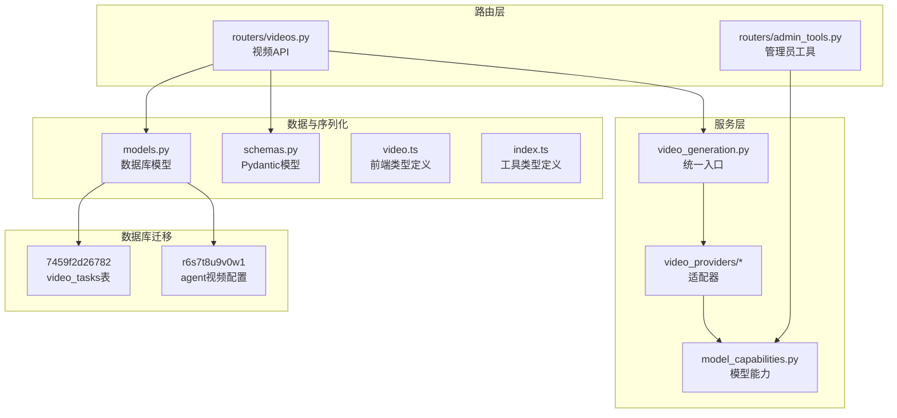
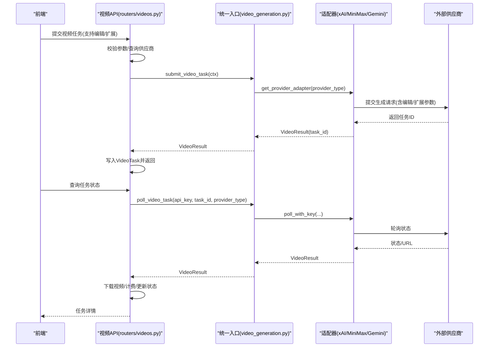
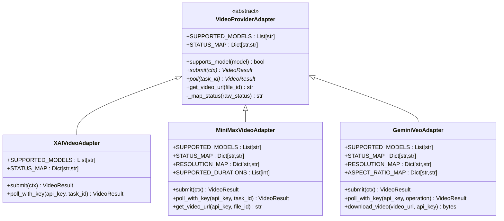
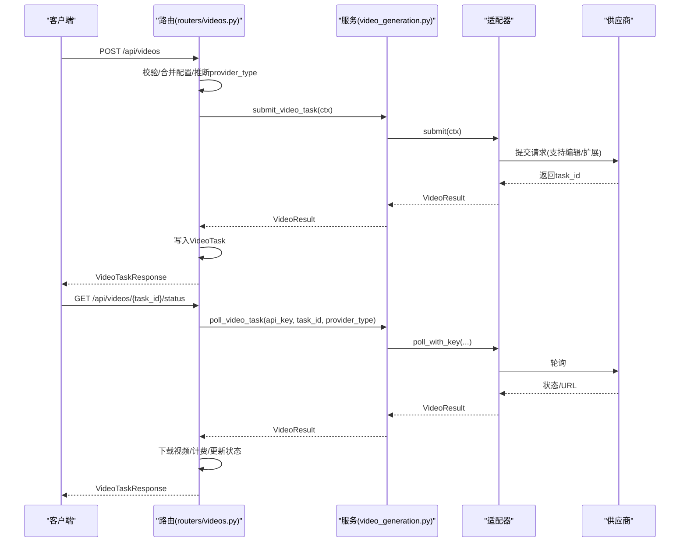
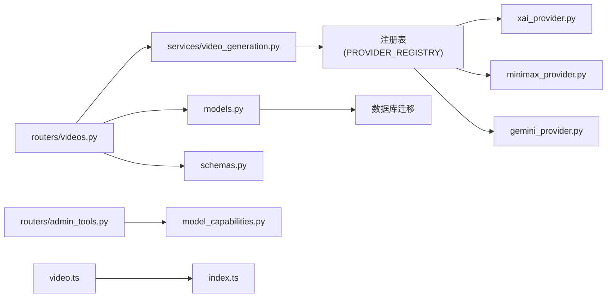

# 视频生成系统

<cite>
**本文引用的文件**
- [video_generation.py](file://backend/services/video_generation.py)
- [videos.py](file://backend/routers/videos.py)
- [base.py](file://backend/services/video_providers/base.py)
- [model_capabilities.py](file://backend/services/video_providers/model_capabilities.py)
- [xai_provider.py](file://backend/services/video_providers/xai_provider.py)
- [minimax_provider.py](file://backend/services/video_providers/minimax_provider.py)
- [gemini_provider.py](file://backend/services/video_providers/gemini_provider.py)
- [models.py](file://backend/models.py)
- [schemas.py](file://backend/schemas.py)
- [7459f2d26782_add_video_tasks_and_video_agent_fields.py](file://backend/migrations/versions/7459f2d26782_add_video_tasks_and_video_agent_fields.py)
- [r6s7t8u9v0w1_add_agent_video_config.py](file://backend/migrations/versions/r6s7t8u9v0w1_add_agent_video_config.py)
- [admin_tools.py](file://backend/routers/admin_tools.py)
- [video.ts](file://backend/admin/src/types/video.ts)
- [index.ts](file://backend/admin/src/types/index.ts)
</cite>

## 更新摘要
**变更内容**
- 新增完整的AI视频生成系统架构，包括多供应商适配器模式
- 扩展数据库schema，新增video_tasks表和代理视频配置字段
- 增强模型能力系统，支持更丰富的视频生成模式
- 新增视频编辑和视频扩展功能支持
- 完善管理员能力查询接口

## 目录
1. [简介](#简介)
2. [项目结构](#项目结构)
3. [核心组件](#核心组件)
4. [架构总览](#架构总览)
5. [详细组件分析](#详细组件分析)
6. [数据库Schema扩展](#数据库schema扩展)
7. [模型能力系统](#模型能力系统)
8. [依赖关系分析](#依赖关系分析)
9. [性能考虑](#性能考虑)
10. [故障排查指南](#故障排查指南)
11. [结论](#结论)
12. [附录](#附录)

## 简介
本系统提供统一的AI视频生成服务，支持多家供应商（xAI、MiniMax、Gemini Veo），通过适配器模式屏蔽供应商差异，向上提供一致的提交与轮询接口。系统包含完整的任务生命周期管理：任务提交、状态轮询、结果获取、计费与本地媒体落盘、以及与前端的集成。新增的视频编辑和视频扩展功能进一步丰富了视频生成能力。

## 项目结构
- **服务层**
  - 视频生成统一入口：[video_generation.py](file://backend/services/video_generation.py)
  - 供应商适配器：[base.py](file://backend/services/video_providers/base.py)、[xai_provider.py](file://backend/services/video_providers/xai_provider.py)、[minimax_provider.py](file://backend/services/video_providers/minimax_provider.py)、[gemini_provider.py](file://backend/services/video_providers/gemini_provider.py)
  - 模型能力配置：[model_capabilities.py](file://backend/services/video_providers/model_capabilities.py)
- **路由层**
  - 视频任务 API：[videos.py](file://backend/routers/videos.py)
  - 管理员工具 API：[admin_tools.py](file://backend/routers/admin_tools.py)
- **数据模型与序列化**
  - 数据模型：[models.py](file://backend/models.py)
  - Pydantic 序列化模型：[schemas.py](file://backend/schemas.py)
- **前端类型定义**
  - 视频模型能力类型：[video.ts](file://backend/admin/src/types/video.ts)
  - 工具配置类型：[index.ts](file://backend/admin/src/types/index.ts)

**图表来源**
- [video_generation.py:1-156](file://backend/services/video_generation.py#L1-L156)
- [videos.py:1-343](file://backend/routers/videos.py#L1-L343)
- [admin_tools.py:177-213](file://backend/routers/admin_tools.py#L177-L213)
- [models.py:403-434](file://backend/models.py#L403-L434)
- [7459f2d26782_add_video_tasks_and_video_agent_fields.py:21-84](file://backend/migrations/versions/7459f2d26782_add_video_tasks_and_video_agent_fields.py#L21-L84)
- [r6s7t8u9v0w1_add_agent_video_config.py:21-28](file://backend/migrations/versions/r6s7t8u9v0w1_add_agent_video_config.py#L21-L28)

## 核心组件
- **统一入口函数**
  - `submit_video_task(ctx)`: 根据 ctx.provider_type 选择适配器并提交任务，返回 VideoResult
  - `poll_video_task(api_key, task_id, provider_type)`: 带 key 轮询任务状态；对 MiniMax 进一步获取下载 URL
- **适配器基类与注册**
  - VideoProviderAdapter 抽象基类定义统一接口；各供应商实现 submit/poll/get_video_url
  - 注册表 PROVIDER_REGISTRY 将字符串键映射到适配器类，支持动态扩展
- **增强的数据模型**
  - VideoTask 数据模型支持视频生成任务的完整生命周期管理
  - 新增代理视频配置字段，支持视频生成的个性化设置
- **扩展的模型能力系统**
  - 支持 text_to_video、image_to_video、edit、reference_images、video_extension 等多种模式
  - 详细的模型能力配置，包括分辨率、时长、首尾帧支持等
- **管理员功能**
  - 提供视频模型能力查询接口
  - 支持视频生成任务的管理与监控

**章节来源**
- [video_generation.py:85-156](file://backend/services/video_generation.py#L85-L156)
- [base.py:56-121](file://backend/services/video_providers/base.py#L56-L121)
- [models.py:403-434](file://backend/models.py#L403-L434)
- [model_capabilities.py:9-347](file://backend/services/video_providers/model_capabilities.py#L9-L347)
- [admin_tools.py:206-213](file://backend/routers/admin_tools.py#L206-L213)

## 架构总览
系统采用"路由层-服务层-适配器层-供应商"的分层设计。路由层负责鉴权、参数校验与任务持久化；服务层提供统一入口与适配器工厂；适配器层对接不同供应商 API；底层通过数据库与媒体存储完成状态与产物管理。新增的视频编辑和视频扩展功能通过统一的适配器接口实现。

**图表来源**
- [videos.py:74-232](file://backend/routers/videos.py#L74-L232)
- [video_generation.py:85-121](file://backend/services/video_generation.py#L85-L121)
- [xai_provider.py:62-135](file://backend/services/video_providers/xai_provider.py#L62-L135)
- [minimax_provider.py:90-238](file://backend/services/video_providers/minimax_provider.py#L90-L238)
- [gemini_provider.py:100-258](file://backend/services/video_providers/gemini_provider.py#L100-L258)

## 详细组件分析

### 统一入口与适配器工厂
- **submit_video_task(ctx)**
  - 解析 ctx.provider_type，默认 xAI（向后兼容）
  - 通过工厂函数 get_provider_adapter(provider_type) 获取适配器实例
  - 调用 adapter.submit(ctx)，返回 VideoResult
- **poll_video_task(api_key, task_id, provider_type)**
  - 通过工厂函数获取适配器
  - 调用 adapter.poll_with_key(api_key, task_id)
  - 对 MiniMax：当状态完成且存在 file_id 时，额外调用 adapter.get_video_url(api_key, file_id) 获取下载 URL
- **infer_provider_type(model)**
  - 根据模型名特征推断供应商类型（优先级：Gemini Veo > MiniMax > xAI）

**图表来源**
- [video_generation.py:85-121](file://backend/services/video_generation.py#L85-L121)
- [video_generation.py:134-156](file://backend/services/video_generation.py#L134-L156)

**章节来源**
- [video_generation.py:55-121](file://backend/services/video_generation.py#L55-L121)
- [video_generation.py:134-156](file://backend/services/video_generation.py#L134-L156)

### 适配器基类与具体实现
- **VideoProviderAdapter 抽象基类**
  - 定义 SUPPORTED_MODELS、STATUS_MAP
  - 抽象方法：submit(ctx)->VideoResult、poll(task_id)->VideoResult
  - 可选：get_video_url(file_id)->str
  - 工具：_map_status(raw_status)、supports_model(model)
- **增强的 VideoContext/VideoResult**
  - VideoContext：统一的请求上下文（api_key、model、prompt、provider_type、图片、时长、分辨率、纵横比、模式、视频模式、MiniMax 特有参数等）
  - VideoResult：统一的结果载体（task_id、status、video_url、file_id、时长、宽高、错误信息）
  - 新增字段：reference_images、extension_video_url、seed 等
- **具体适配器实现**
  - **xAI 适配器**
    - 支持 grok-imagine-video
    - 支持模式：text_to_video、image_to_video、reference_images、edit、video_extension
    - 状态映射：queued/pending/in_progress/processing/succeeded/completed/done -> pending/processing/completed/failed
    - 轮询时进行内容审核检查，拒绝则标记 failed
  - **MiniMax 适配器**
    - 支持模型：Hailuo-2.x、T2V-01、I2V-01、S2V-01 等
    - 模型能力检查：I2V 模型必须提供首帧图片；T2V 模型自动切换到 text_to_video；S2V 需要主题参考
    - 分辨率映射、时长约束（6/10）、快速预处理、首尾帧支持
    - 轮询完成后返回 file_id，需二次调用 get_video_url 获取下载 URL
  - **Gemini Veo 适配器**
    - 支持 veo-3.1-generate-preview/fast、veo-2.0-generate-001 等
    - 状态映射：done=false->processing，done=true->completed
    - 支持首尾帧、参考图片、4k 分辨率（取决于模型）
    - 轮询返回 video.uri，可通过 download_video 下载

**图表来源**
- [base.py:56-121](file://backend/services/video_providers/base.py#L56-L121)
- [xai_provider.py:43-199](file://backend/services/video_providers/xai_provider.py#L43-L199)
- [minimax_provider.py:30-318](file://backend/services/video_providers/minimax_provider.py#L30-L318)
- [gemini_provider.py:42-357](file://backend/services/video_providers/gemini_provider.py#L42-L357)

**章节来源**
- [base.py:15-121](file://backend/services/video_providers/base.py#L15-L121)
- [xai_provider.py:43-199](file://backend/services/video_providers/xai_provider.py#L43-L199)
- [minimax_provider.py:30-318](file://backend/services/video_providers/minimax_provider.py#L30-L318)
- [gemini_provider.py:42-357](file://backend/services/video_providers/gemini_provider.py#L42-L357)

### 路由与任务生命周期
- **任务提交**
  - 校验请求参数，合并默认配置，推断 provider_type
  - 构造 VideoContext，调用 submit_video_task(ctx)
  - 若提交失败，抛出 502；成功则写入 VideoTask 并返回
- **状态轮询**
  - 读取 VideoTask，若为终态则直接返回
  - 否则根据 provider_type 调用 poll_video_task，超时保护：pending 且轮询错误超过 5 分钟判定失败
  - 完成后下载视频、计算时长、计费、插入聊天消息
- **管理员功能**
  - 提供 /admin/video-capabilities 接口，返回视频模型能力配置
  - 支持视频生成任务的管理与监控
- **任务删除**
  - 仅允许删除终态任务，同时清理本地媒体文件与关联消息

**图表来源**
- [videos.py:74-232](file://backend/routers/videos.py#L74-L232)
- [video_generation.py:85-121](file://backend/services/video_generation.py#L85-L121)

**章节来源**
- [videos.py:74-232](file://backend/routers/videos.py#L74-L232)

### 数据模型与序列化
- **VideoTask**
  - 字段：xai_task_id、session_id、provider_id、model、user_id、video_mode、prompt、image_url、duration、quality、aspect_ratio、mode、status、result_video_url、error_message、input_image_count、output_duration_seconds、credit_cost、created_at、completed_at
  - 新增字段：message_id、agent_id 支持关联关系
- **增强的 Pydantic 模型**
  - VideoConfig：新增 reference_images、extension_video_url、seed 等字段
  - VideoGenerateRequest：支持多种视频模式，包括 edit、reference_images、video_extension
  - VideoTaskResponse：完整的任务查询返回结构
- **代理配置**
  - 新增 video_config JSON 字段，支持代理的视频生成配置
  - 新增视频输入输出积分字段，支持精细化计费

**章节来源**
- [models.py:403-434](file://backend/models.py#L403-L434)
- [schemas.py:636-682](file://backend/schemas.py#L636-L682)
- [r6s7t8u9v0w1_add_agent_video_config.py:22-23](file://backend/migrations/versions/r6s7t8u9v0w1_add_agent_video_config.py#L22-L23)

## 数据库Schema扩展
系统进行了重要的数据库Schema扩展，以支持视频生成任务的完整生命周期管理：

### 新增 video_tasks 表
- **核心字段**
  - id：主键，UUID格式
  - xai_task_id：外部供应商任务ID
  - session_id：关联聊天会话
  - message_id：关联聊天消息
  - provider_id：关联供应商
  - user_id：任务创建者
- **配置字段**
  - video_mode：视频生成模式
  - prompt：生成提示词
  - image_url：输入图片URL
  - duration、quality、aspect_ratio：生成参数
  - mode：功能模式
- **状态与结果**
  - status：任务状态（pending/processing/completed/failed）
  - result_video_url：本地存储路径
  - error_message：错误信息
- **计费相关**
  - input_image_count：输入图片数量
  - output_duration_seconds：输出时长
  - credit_cost：消耗积分

### 代理视频配置扩展
- **新增字段**
  - video_input_image_credit：视频输入图片积分
  - video_input_second_credit：视频输入时长积分
  - video_output_480p_credit：480p输出积分
  - video_output_720p_credit：720p输出积分
  - video_config：JSON格式的视频配置

**章节来源**
- [7459f2d26782_add_video_tasks_and_video_agent_fields.py:29-74](file://backend/migrations/versions/7459f2d26782_add_video_tasks_and_video_agent_fields.py#L29-L74)
- [r6s7t8u9v0w1_add_agent_video_config.py:22-23](file://backend/migrations/versions/r6s7t8u9v0w1_add_agent_video_config.py#L22-L23)

## 模型能力系统
系统提供了完整的视频生成模型能力配置，支持多种供应商和模型的详细能力描述：

### 支持的模型系列
- **MiniMax 模型**
  - MiniMax-Hailuo-2.3：多功能，支持 T2V 和 I2V
  - MiniMax-Hailuo-02：支持首尾帧
  - T2V-01 系列：纯文本生成视频
  - I2V-01 系列：图片生成视频
  - S2V-01：主题参考生成

- **xAI (Grok) 模型**
  - grok-imagine-video：支持多种模式，包括参考图片、视频编辑、视频扩展

- **Gemini Veo 模型**
  - veo-3.1 系列：原生音频，支持参考图片和视频扩展
  - veo-3.0 系列：稳定版，支持 T2V/I2V
  - veo-2.0 系列：基础版，无声

### 能力配置结构
每个模型都定义了详细的配置信息：
- **基本能力**：支持的模式、时长范围、分辨率
- **高级功能**：首尾帧支持、参考图片支持、视频扩展支持
- **技术参数**：最大参考图片数量、提示词优化、快速预处理
- **显示配置**：支持的宽高比等

### 管理员接口
- **/admin/video-capabilities**：返回所有视频模型的能力配置
- **/api/videos/model-capabilities/{model_name}**：返回指定模型的能力配置

**章节来源**
- [model_capabilities.py:27-328](file://backend/services/video_providers/model_capabilities.py#L27-L328)
- [admin_tools.py:206-213](file://backend/routers/admin_tools.py#L206-L213)

## 依赖关系分析
- **组件耦合**
  - 路由层依赖统一入口与适配器工厂；统一入口依赖适配器注册表；适配器依赖供应商 API
  - VideoTask 与 LLMProvider、ChatMessage 关联，便于任务追踪与计费
- **外部依赖**
  - httpx 异步 HTTP 客户端用于调用供应商 API
  - SQLAlchemy 异步 ORM 用于任务持久化与计费事务
- **循环依赖**
  - 未发现循环导入；适配器模块通过统一接口暴露

**图表来源**
- [videos.py:16-18](file://backend/routers/videos.py#L16-L18)
- [video_generation.py:48-76](file://backend/services/video_generation.py#L48-L76)
- [xai_provider.py:1-199](file://backend/services/video_providers/xai_provider.py#L1-L199)
- [minimax_provider.py:1-318](file://backend/services/video_providers/minimax_provider.py#L1-L318)
- [gemini_provider.py:1-357](file://backend/services/video_providers/gemini_provider.py#L1-L357)
- [models.py:403-434](file://backend/models.py#L403-L434)
- [schemas.py:636-682](file://backend/schemas.py#L636-L682)
- [admin_tools.py:206-213](file://backend/routers/admin_tools.py#L206-L213)
- [7459f2d26782_add_video_tasks_and_video_agent_fields.py:21-84](file://backend/migrations/versions/7459f2d26782_add_video_tasks_and_video_agent_fields.py#L21-L84)

**章节来源**
- [video_generation.py:48-76](file://backend/services/video_generation.py#L48-L76)
- [videos.py:16-18](file://backend/routers/videos.py#L16-L18)

## 性能考虑
- **异步 I/O**
  - 适配器与媒体工具均使用 httpx.AsyncClient，减少阻塞，提升并发吞吐
- **轮询策略**
  - 对于进行中的任务，前端可按固定间隔轮询；后端在终态直接返回，避免无效轮询
- **缓存与预取**
  - 供应商状态映射与模型能力配置以内存字典形式维护，查询开销极低
- **超时与重试**
  - 适配器内部设置合理超时；对 MiniMax 的下载 URL 有效期短，应在完成时尽快获取并下载
- **计费与落盘**
  - 计费与媒体落盘在单事务内完成，保证一致性；下载视频时使用较大超时以应对大文件
- **数据库优化**
  - video_tasks 表建立适当的索引，支持按状态、用户ID、任务ID的快速查询

## 故障排查指南
- **提交失败**
  - 检查 VideoContext 参数（模型、图片、时长、分辨率）是否符合目标供应商要求
  - 查看适配器日志与返回的 error 字段
  - 验证模型能力配置是否支持所选模式
- **轮询异常**
  - 确认 provider_type 与模型匹配；核对 API Key 是否正确
  - 对 MiniMax：确认 file_id 是否存在，必要时重新轮询
- **内容审核拒绝**
  - xAI 适配器在内容审核不通过时会将状态标记为 failed，并附带错误信息
- **权限问题**
  - 管理员接口需要相应的权限才能访问视频能力配置
- **数据库连接**
  - 确保数据库迁移已正确执行，特别是 video_tasks 表和代理配置字段

**章节来源**
- [xai_provider.py:174-199](file://backend/services/video_providers/xai_provider.py#L174-L199)
- [minimax_provider.py:219-237](file://backend/services/video_providers/minimax_provider.py#L219-L237)
- [admin_tools.py:194-213](file://backend/routers/admin_tools.py#L194-L213)

## 结论
本系统通过适配器模式实现了多供应商视频生成的统一接入，具备良好的扩展性与稳定性。新增的视频编辑、视频扩展功能和完整的数据库Schema支持，使得系统能够处理更复杂的视频生成场景。统一入口函数与路由层配合，提供了从任务提交到结果获取的完整闭环；计费与媒体落盘保障了业务闭环与用户体验。建议在生产环境中结合监控与告警完善可观测性，并持续扩展更多供应商适配器。

## 附录

### API 使用示例
- **任务创建**
  - 方法：POST /api/videos
  - 请求体：包含 provider_id、model、video_mode、prompt、可选 image_url/last_frame_image、reference_images、extension_video_url、config
  - 支持模式：text_to_video、image_to_video、edit、reference_images、video_extension
  - 成功返回：VideoTaskResponse，包含任务 ID、初始状态等

- **状态查询**
  - 方法：GET /api/videos/{task_id}/status
  - 返回：VideoTaskResponse，若完成则包含 result_video_url

- **模型能力查询**
  - 方法：GET /api/videos/model-capabilities/{model_name}
  - 返回：模型能力配置（支持模式、时长、分辨率、首尾帧等）

- **管理员能力查询**
  - 方法：GET /admin/video-capabilities
  - 返回：所有视频模型的能力配置

**章节来源**
- [videos.py:74-232](file://backend/routers/videos.py#L74-L232)
- [schemas.py:647-682](file://backend/schemas.py#L647-L682)
- [admin_tools.py:206-213](file://backend/routers/admin_tools.py#L206-L213)