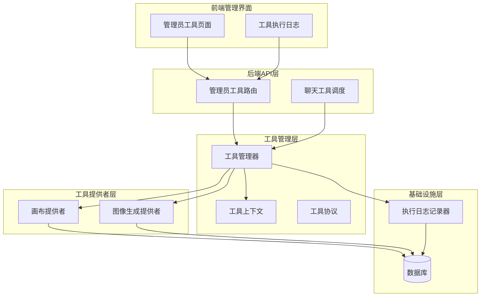
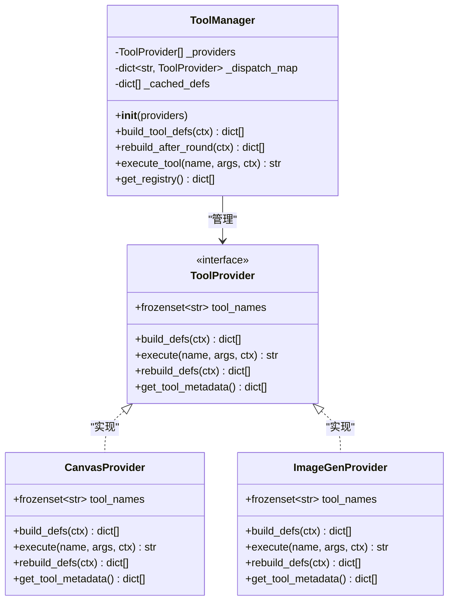
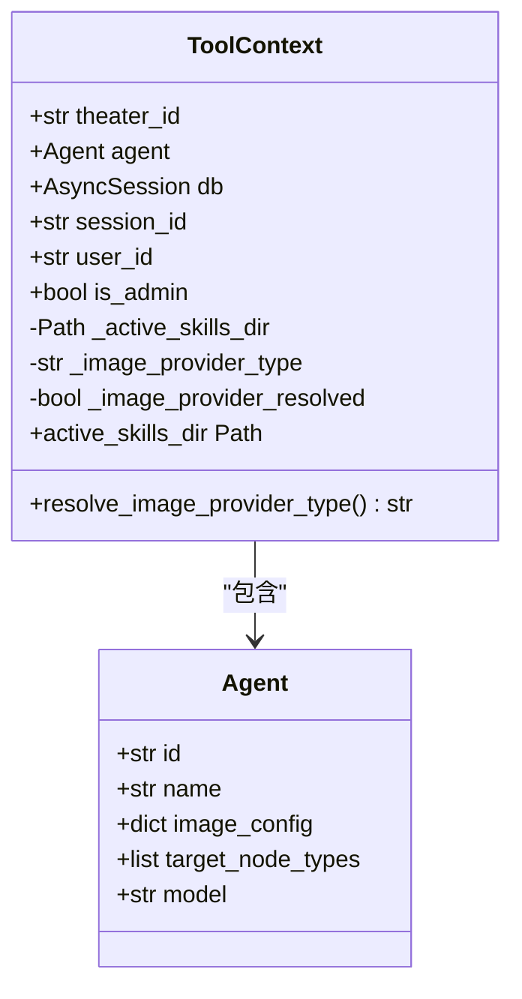
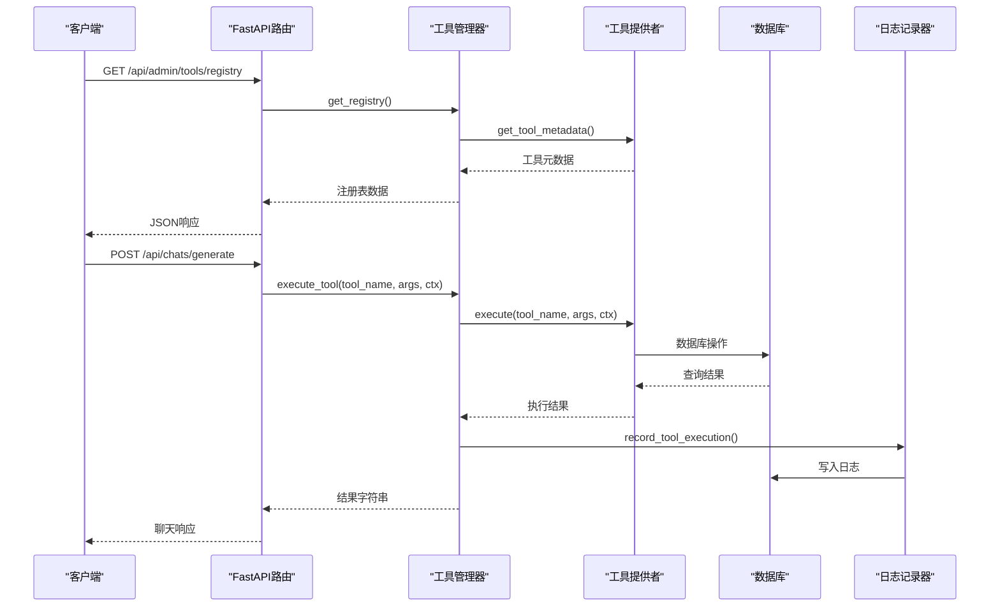
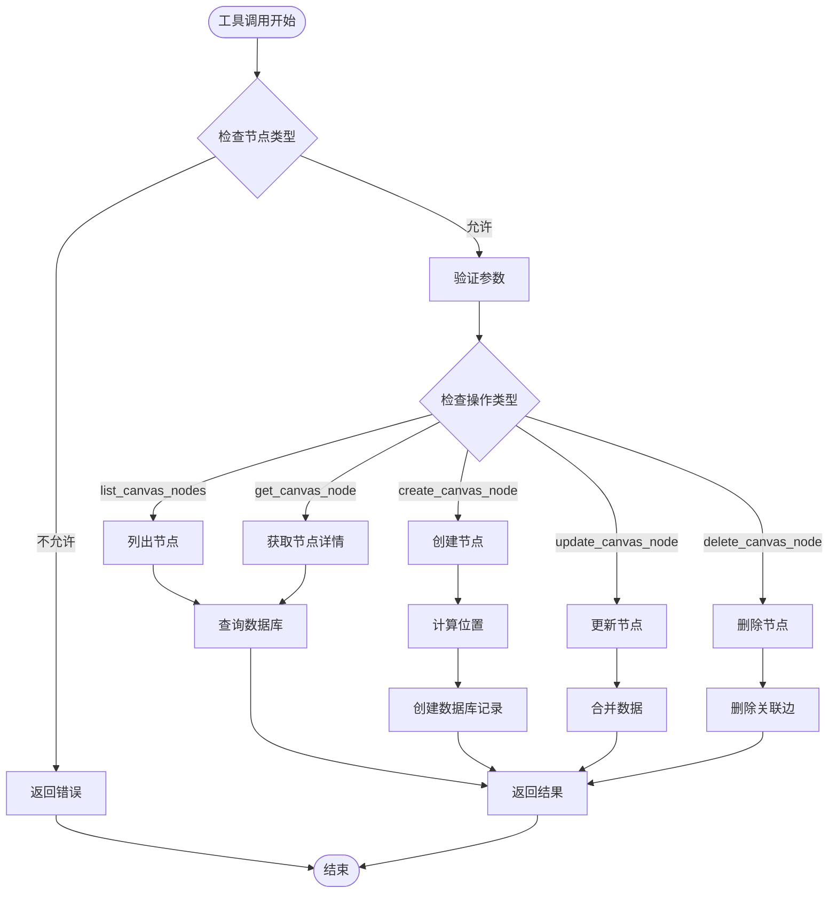
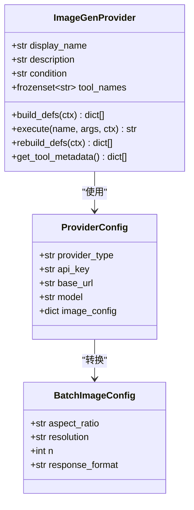
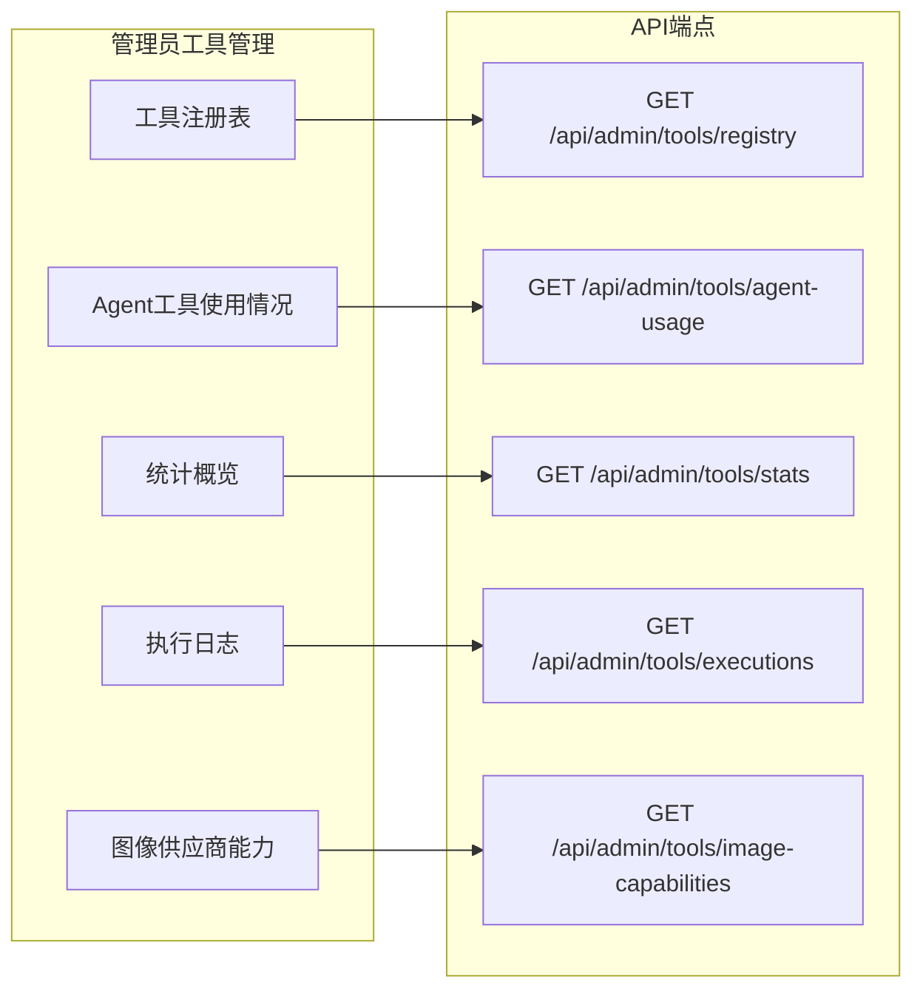
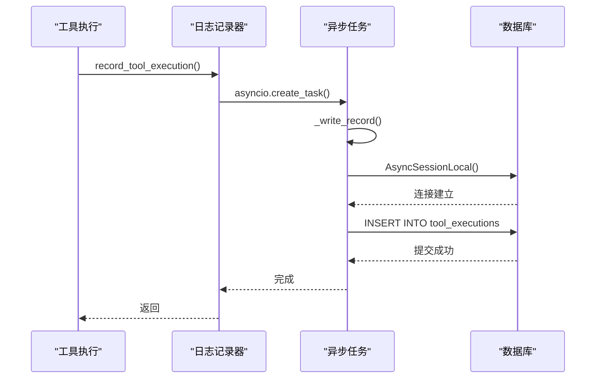
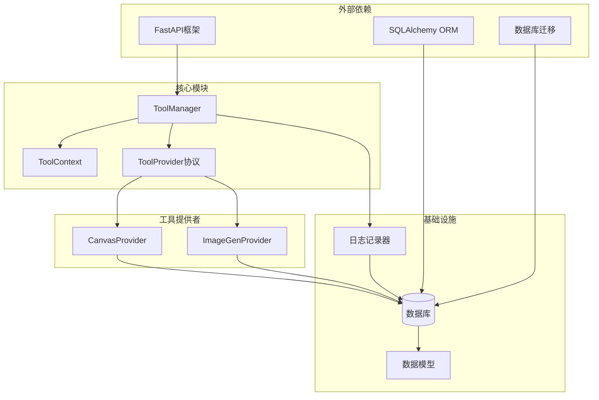

# 工具管理系统

<cite>
**本文档引用的文件**
- [backend/services/tool_manager/manager.py](file://backend/services/tool_manager/manager.py)
- [backend/services/tool_manager/context.py](file://backend/services/tool_manager/context.py)
- [backend/services/tool_manager/protocol.py](file://backend/services/tool_manager/protocol.py)
- [backend/services/tool_manager/providers/__init__.py](file://backend/services/tool_manager/providers/__init__.py)
- [backend/services/tool_manager/providers/canvas.py](file://backend/services/tool_manager/providers/canvas.py)
- [backend/services/tool_manager/providers/image_gen.py](file://backend/services/tool_manager/providers/image_gen.py)
- [backend/routers/admin_tools.py](file://backend/routers/admin_tools.py)
- [backend/services/chat_tool_dispatch.py](file://backend/services/chat_tool_dispatch.py)
- [backend/services/tool_execution_logger.py](file://backend/services/tool_execution_logger.py)
- [backend/models.py](file://backend/models.py)
- [backend/migrations/versions/p4q5r6s7t8u9_add_tool_executions_table.py](file://backend/migrations/versions/p4q5r6s7t8u9_add_tool_executions_table.py)
- [backend/main.py](file://backend/main.py)
- [backend/admin/src/app/admin/tools/page.tsx](file://backend/admin/src/app/admin/tools/page.tsx)
- [backend/admin/src/app/admin/tools/logs/page.tsx](file://backend/admin/src/app/admin/tools/logs/page.tsx)
</cite>

## 目录
1. [简介](#简介)
2. [项目结构](#项目结构)
3. [核心组件](#核心组件)
4. [架构概览](#架构概览)
5. [详细组件分析](#详细组件分析)
6. [依赖关系分析](#依赖关系分析)
7. [性能考虑](#性能考虑)
8. [故障排除指南](#故障排除指南)
9. [结论](#结论)

## 简介

工具管理系统是 Infinite Game 项目中的核心模块，负责统一管理、发现和调度各种工具服务。该系统通过标准化的工具提供者协议，实现了画布节点操作、图像生成等工具的统一管理，并提供了完整的管理员界面来监控工具使用情况。

系统主要包含以下功能：
- 统一的工具注册表和发现机制
- 工具执行的集中式调度
- 完整的执行日志记录和统计
- 管理员端的工具监控面板
- 支持多种工具提供者（画布工具、图像生成等）

## 项目结构

工具管理系统采用分层架构设计，主要分为以下几个层次：

**图表来源**
- [backend/main.py:138-153](file://backend/main.py#L138-L153)
- [backend/routers/admin_tools.py:16-20](file://backend/routers/admin_tools.py#L16-L20)

**章节来源**
- [backend/main.py:138-153](file://backend/main.py#L138-L153)
- [backend/routers/admin_tools.py:1-196](file://backend/routers/admin_tools.py#L1-L196)

## 核心组件

### 工具管理器 (ToolManager)

工具管理器是整个系统的核心协调器，负责管理所有工具提供者并提供统一的工具调度接口。

**图表来源**
- [backend/services/tool_manager/manager.py:23-108](file://backend/services/tool_manager/manager.py#L23-L108)
- [backend/services/tool_manager/protocol.py:11-44](file://backend/services/tool_manager/protocol.py#L11-L44)
- [backend/services/tool_manager/providers/canvas.py:513-549](file://backend/services/tool_manager/providers/canvas.py#L513-L549)
- [backend/services/tool_manager/providers/image_gen.py:229-262](file://backend/services/tool_manager/providers/image_gen.py#L229-L262)

### 工具上下文 (ToolContext)

工具上下文是一个不可变的数据传输对象，封装了工具执行所需的所有环境信息。

**图表来源**
- [backend/services/tool_manager/context.py:23-70](file://backend/services/tool_manager/context.py#L23-L70)

**章节来源**
- [backend/services/tool_manager/manager.py:23-108](file://backend/services/tool_manager/manager.py#L23-L108)
- [backend/services/tool_manager/context.py:23-70](file://backend/services/tool_manager/context.py#L23-L70)
- [backend/services/tool_manager/protocol.py:11-44](file://backend/services/tool_manager/protocol.py#L11-L44)

## 架构概览

工具管理系统采用事件驱动的异步架构，通过FastAPI提供REST API接口，并使用SQLAlchemy进行数据库操作。

**图表来源**
- [backend/routers/admin_tools.py:27-33](file://backend/routers/admin_tools.py#L27-L33)
- [backend/services/chat_tool_dispatch.py:25-43](file://backend/services/chat_tool_dispatch.py#L25-L43)
- [backend/services/tool_execution_logger.py:77-89](file://backend/services/tool_execution_logger.py#L77-L89)

## 详细组件分析

### 画布工具提供者 (CanvasProvider)

画布工具提供者负责管理剧场画布节点的CRUD操作，支持多种节点类型（文本、图像、视频、分镜）。

**图表来源**
- [backend/services/tool_manager/providers/canvas.py:300-475](file://backend/services/tool_manager/providers/canvas.py#L300-L475)

#### 节点类型支持

系统支持四种节点类型，每种类型都有特定的字段和用途：

| 节点类型 | 描述 | 主要字段 | 示例用途 |
|---------|------|----------|----------|
| text | 文本节点 | title, content, tags | 剧本、文案、广告 |
| image | 图像节点 | name, description, imageUrl, fitMode | 角色设定、场景、海报 |
| video | 视频节点 | name, description, videoUrl, fitMode | 动画、短片、视频内容 |
| storyboard | 分镜节点 | shotNumber, description, duration, pivotConfig | 分镜脚本、镜头设计 |

**章节来源**
- [backend/services/tool_manager/providers/canvas.py:42-86](file://backend/services/tool_manager/providers/canvas.py#L42-L86)
- [backend/services/tool_manager/providers/canvas.py:513-549](file://backend/services/tool_manager/providers/canvas.py#L513-L549)

### 图像生成提供者 (ImageGenProvider)

图像生成提供者支持多种AI图像生成服务，包括xAI和Gemini等。

**图表来源**
- [backend/services/tool_manager/providers/image_gen.py:229-262](file://backend/services/tool_manager/providers/image_gen.py#L229-L262)

#### 支持的图像生成服务

| 服务提供商 | 支持的模型 | 特殊功能 | 限制 |
|-----------|-----------|----------|------|
| xAI | grok-image, grok-imagine | 批量生成、多种分辨率 | 最多4张图片 |
| Gemini | Gemini Pro Vision | 高质量生成、多种尺寸 | 需要特殊权限 |
| 其他 | 自定义模型 | 可扩展 | 需要适配器 |

**章节来源**
- [backend/services/tool_manager/providers/image_gen.py:190-223](file://backend/services/tool_manager/providers/image_gen.py#L190-L223)

### 管理员工具管理路由

管理员工具管理路由提供了完整的工具监控和管理功能。

**图表来源**
- [backend/routers/admin_tools.py:27-195](file://backend/routers/admin_tools.py#L27-L195)

**章节来源**
- [backend/routers/admin_tools.py:27-195](file://backend/routers/admin_tools.py#L27-L195)

### 工具执行日志系统

工具执行日志系统提供了非阻塞的日志记录机制，确保工具执行不会因为日志写入而受到影响。

**图表来源**
- [backend/services/tool_execution_logger.py:77-89](file://backend/services/tool_execution_logger.py#L77-L89)

**章节来源**
- [backend/services/tool_execution_logger.py:1-89](file://backend/services/tool_execution_logger.py#L1-L89)

## 依赖关系分析

工具管理系统具有清晰的依赖层次结构，各组件之间的耦合度较低，便于维护和扩展。

**图表来源**
- [backend/main.py:38-44](file://backend/main.py#L38-L44)
- [backend/services/tool_manager/providers/__init__.py:4-7](file://backend/services/tool_manager/providers/__init__.py#L4-L7)

**章节来源**
- [backend/services/tool_manager/providers/__init__.py:1-14](file://backend/services/tool_manager/providers/__init__.py#L1-L14)
- [backend/models.py:458-471](file://backend/models.py#L458-L471)

## 性能考虑

工具管理系统在设计时充分考虑了性能优化，采用了多种策略来确保系统的高效运行：

### 异步处理
- 所有数据库操作都使用异步模式
- 工具执行采用异步并发处理
- 日志记录使用非阻塞异步任务

### 缓存机制
- 工具定义缓存避免重复构建
- 图像供应商类型解析结果缓存
- 技能目录懒加载机制

### 连接池管理
- 数据库连接使用连接池
- 异步会话管理
- 连接重试机制

### 内存优化
- 流式数据处理
- 有限的结果集大小
- 敏感信息自动清理

## 故障排除指南

### 常见问题及解决方案

#### 工具执行失败
**症状**: 工具调用返回错误信息
**可能原因**:
- 工具名称不存在
- 参数验证失败
- 数据库连接异常
- 供应商API调用失败

**解决步骤**:
1. 检查工具名称是否正确
2. 验证参数格式和类型
3. 查看日志记录器的错误信息
4. 确认数据库连接状态

#### 工具注册表为空
**症状**: 管理员界面显示空的工具列表
**可能原因**:
- 工具提供者初始化失败
- 数据库迁移未完成
- 权限配置错误

**解决步骤**:
1. 检查数据库连接
2. 运行数据库迁移
3. 验证工具提供者配置
4. 检查管理员权限

#### 性能问题
**症状**: 工具执行响应缓慢
**可能原因**:
- 数据库查询优化不足
- 缓存未生效
- 并发连接过多

**解决步骤**:
1. 分析慢查询日志
2. 检查索引配置
3. 调整缓存策略
4. 优化并发设置

**章节来源**
- [backend/services/chat_tool_dispatch.py:38-43](file://backend/services/chat_tool_dispatch.py#L38-L43)
- [backend/services/tool_execution_logger.py:74-75](file://backend/services/tool_execution_logger.py#L74-L75)

## 结论

工具管理系统通过标准化的设计和模块化的架构，成功实现了工具的统一管理和高效调度。系统的主要优势包括：

1. **高度模块化**: 清晰的组件分离和接口定义
2. **易于扩展**: 支持新的工具提供者轻松集成
3. **完善的监控**: 全面的执行日志和统计功能
4. **高性能**: 异步处理和缓存机制
5. **安全性**: 敏感信息保护和权限控制

该系统为Infinite Game项目提供了强大的工具管理能力，支持复杂的创作工作流和多样的工具需求。通过持续的优化和扩展，系统能够满足不断增长的功能需求和技术挑战。