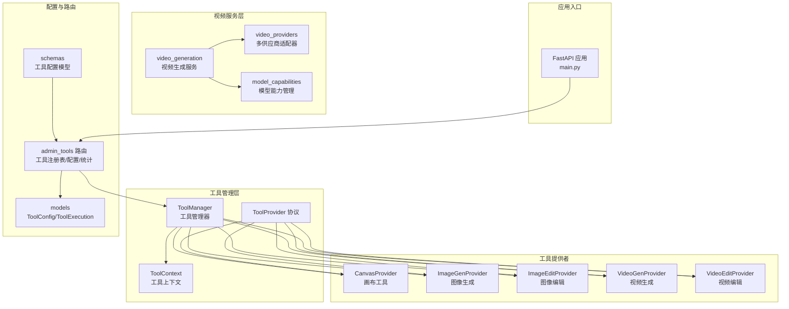
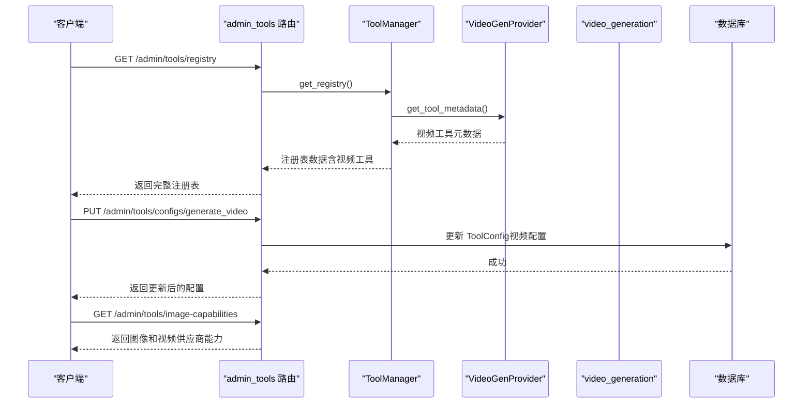
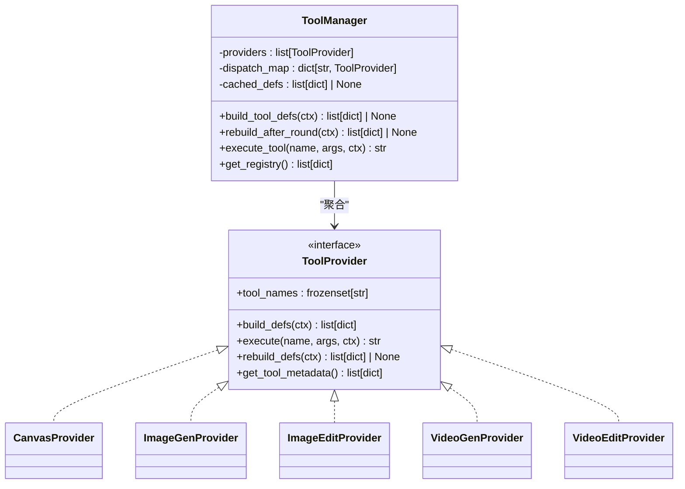
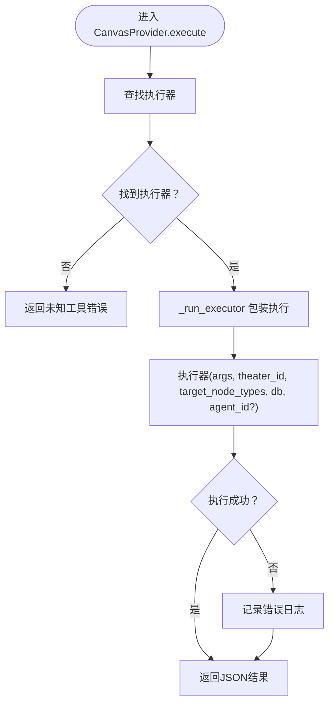
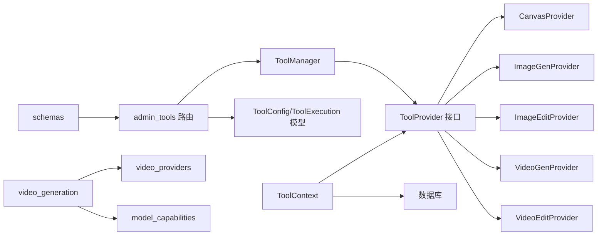

# 全局工具配置系统

<cite>
**本文档引用的文件**
- [backend/services/tool_manager/manager.py](file://backend/services/tool_manager/manager.py)
- [backend/services/tool_manager/context.py](file://backend/services/tool_manager/context.py)
- [backend/services/tool_manager/protocol.py](file://backend/services/tool_manager/protocol.py)
- [backend/services/tool_manager/providers/__init__.py](file://backend/services/tool_manager/providers/__init__.py)
- [backend/services/tool_manager/providers/canvas.py](file://backend/services/tool_manager/providers/canvas.py)
- [backend/services/tool_manager/providers/image_gen.py](file://backend/services/tool_manager/providers/image_gen.py)
- [backend/services/tool_manager/providers/image_edit.py](file://backend/services/tool_manager/providers/image_edit.py)
- [backend/services/tool_manager/providers/video_gen.py](file://backend/services/tool_manager/providers/video_gen.py)
- [backend/services/tool_manager/providers/video_edit.py](file://backend/services/tool_manager/providers/video_edit.py)
- [backend/models.py](file://backend/models.py)
- [backend/routers/admin_tools.py](file://backend/routers/admin_tools.py)
- [backend/main.py](file://backend/main.py)
- [backend/schemas.py](file://backend/schemas.py)
- [backend/services/chat_tool_dispatch.py](file://backend/services/chat_tool_dispatch.py)
- [backend/services/tool_execution_logger.py](file://backend/services/tool_execution_logger.py)
- [backend/services/video_generation.py](file://backend/services/video_generation.py)
- [backend/admin/src/components/admin/tools/VideoGenConfigDialog.tsx](file://backend/admin/src/components/admin/tools/VideoGenConfigDialog.tsx)
</cite>

## 更新摘要
**所做更改**
- 新增视频生成工具提供者（VideoGenProvider）支持文本到视频和图像到视频生成
- 新增视频编辑工具提供者（VideoEditProvider）支持视频编辑和扩展
- 扩展工具管理器以支持视频工具提供者并列存在
- 更新工具上下文以支持视频配置解析和供应商类型解析
- 新增视频生成服务和多供应商适配器架构
- 更新管理员界面以支持视频工具配置管理

## 目录
1. [简介](#简介)
2. [项目结构](#项目结构)
3. [核心组件](#核心组件)
4. [架构总览](#架构总览)
5. [详细组件分析](#详细组件分析)
6. [依赖关系分析](#依赖关系分析)
7. [性能考虑](#性能考虑)
8. [故障排除指南](#故障排除指南)
9. [结论](#结论)

## 简介
本系统是一个统一的全局工具配置与执行框架，负责管理各类AI工具（画布节点操作、图像生成、图像编辑、视频生成、视频编辑等），通过工具提供者协议实现插件化扩展，并提供完整的配置、统计与日志功能。系统采用集中式工具管理器协调多个工具提供者，支持动态构建工具定义、按轮次重建以及安全的日志记录。现已扩展支持视频生成工具与现有图像生成工具并存，提供完整的文本到视频和图像到视频生成功能。

## 项目结构
系统主要由以下层次构成：
- 工具管理层：工具管理器、上下文、协议定义
- 工具提供者：画布工具、图像生成、图像编辑、视频生成、视频编辑
- 配置与路由：全局工具配置、管理员工具管理接口
- 数据模型：工具配置、执行日志等数据库实体
- 路由与入口：FastAPI 应用程序与各模块路由
- 视频服务层：多供应商适配器、视频生成服务、模型能力管理

**图表来源**
- [backend/services/tool_manager/manager.py:23-108](file://backend/services/tool_manager/manager.py#L23-L108)
- [backend/services/tool_manager/context.py:23-119](file://backend/services/tool_manager/context.py#L23-L119)
- [backend/services/tool_manager/protocol.py:11-44](file://backend/services/tool_manager/protocol.py#L11-L44)
- [backend/services/tool_manager/providers/__init__.py:1-25](file://backend/services/tool_manager/providers/__init__.py#L1-L25)
- [backend/services/tool_manager/providers/video_gen.py:284-334](file://backend/services/tool_manager/providers/video_gen.py#L284-L334)
- [backend/services/tool_manager/providers/video_edit.py:228-282](file://backend/services/tool_manager/providers/video_edit.py#L228-L282)
- [backend/routers/admin_tools.py:1-200](file://backend/routers/admin_tools.py#L1-L200)
- [backend/models.py:461-491](file://backend/models.py#L461-L491)
- [backend/schemas.py:893-921](file://backend/schemas.py#L893-L921)
- [backend/main.py:138-154](file://backend/main.py#L138-L154)
- [backend/services/video_generation.py:1-156](file://backend/services/video_generation.py#L1-L156)

**章节来源**
- [backend/services/tool_manager/manager.py:1-108](file://backend/services/tool_manager/manager.py#L1-L108)
- [backend/services/tool_manager/context.py:1-119](file://backend/services/tool_manager/context.py#L1-L119)
- [backend/services/tool_manager/protocol.py:1-44](file://backend/services/tool_manager/protocol.py#L1-L44)
- [backend/services/tool_manager/providers/__init__.py:1-25](file://backend/services/tool_manager/providers/__init__.py#L1-L25)
- [backend/routers/admin_tools.py:1-200](file://backend/routers/admin_tools.py#L1-L200)
- [backend/models.py:461-491](file://backend/models.py#L461-L491)
- [backend/schemas.py:893-921](file://backend/schemas.py#L893-L921)
- [backend/main.py:138-154](file://backend/main.py#L138-L154)

## 核心组件
- 工具管理器（ToolManager）：集中协调所有工具提供者，构建工具定义、执行工具调用、维护缓存与增量重建。
- 工具上下文（ToolContext）：封装一次对话中的环境信息（剧场ID、智能体、数据库会话、日志溯源等），并提供懒加载的全局配置与供应商解析，现支持图像和视频配置。
- 工具提供者协议（ToolProvider）：定义工具提供者的统一接口，包括工具名称集合、定义构建、执行、重建与元数据导出。
- 工具提供者实现：画布工具（CanvasProvider）、图像生成（ImageGenProvider）、图像编辑（ImageEditProvider）、视频生成（VideoGenProvider）、视频编辑（VideoEditProvider）。
- 全局工具配置（ToolConfig）：存储工具级别的全局配置参数，支持启用/禁用与动态更新，现包含视频生成配置。
- 工具执行日志（ToolExecution）：记录每次工具调用的详细信息，支持非阻塞写入与敏感信息脱敏。
- 管理员工具路由（admin_tools）：提供工具注册表、Agent工具使用概览、统计、执行日志查询与图像/视频供应商能力展示，以及工具配置的增删改查。
- 视频生成服务（video_generation）：多供应商统一入口，支持xAI、MiniMax、Gemini视频生成服务。
- 视频提供者适配器：为不同视频供应商提供统一的适配器接口和实现。

**章节来源**
- [backend/services/tool_manager/manager.py:23-108](file://backend/services/tool_manager/manager.py#L23-L108)
- [backend/services/tool_manager/context.py:23-119](file://backend/services/tool_manager/context.py#L23-L119)
- [backend/services/tool_manager/protocol.py:11-44](file://backend/services/tool_manager/protocol.py#L11-L44)
- [backend/services/tool_manager/providers/canvas.py:513-549](file://backend/services/tool_manager/providers/canvas.py#L513-L549)
- [backend/services/tool_manager/providers/image_gen.py:250-293](file://backend/services/tool_manager/providers/image_gen.py#L250-L293)
- [backend/services/tool_manager/providers/image_edit.py:304-352](file://backend/services/tool_manager/providers/image_edit.py#L304-L352)
- [backend/services/tool_manager/providers/video_gen.py:284-334](file://backend/services/tool_manager/providers/video_gen.py#L284-L334)
- [backend/services/tool_manager/providers/video_edit.py:228-282](file://backend/services/tool_manager/providers/video_edit.py#L228-L282)
- [backend/models.py:461-491](file://backend/models.py#L461-L491)
- [backend/routers/admin_tools.py:28-200](file://backend/routers/admin_tools.py#L28-L200)

## 架构总览
系统采用"集中式管理 + 插件化提供者"的架构。工具管理器持有所有提供者实例，构建工具定义并进行O(1)名称分发；工具上下文贯穿整个执行链路，提供统一的可用性检查与配置解析；管理员路由提供可视化配置与监控能力。现已扩展支持视频工具与图像工具并存，通过统一的工具管理器协调不同类型工具的提供者。

**图表来源**
- [backend/routers/admin_tools.py:28-200](file://backend/routers/admin_tools.py#L28-L200)
- [backend/services/tool_manager/manager.py:96-108](file://backend/services/tool_manager/manager.py#L96-L108)
- [backend/services/tool_manager/providers/video_gen.py:324-334](file://backend/services/tool_manager/providers/video_gen.py#L324-L334)
- [backend/services/video_generation.py:85-156](file://backend/services/video_generation.py#L85-L156)

## 详细组件分析

### 工具管理器（ToolManager）
- 职责
  - 维护工具提供者列表与名称到提供者的映射，现包含视频工具提供者。
  - 构建当前上下文下的工具定义（build_tool_defs），并缓存结果。
  - 在工具执行轮次后按需重建定义（rebuild_after_round），通过拼接策略减少重建成本。
  - 提供统一的工具执行入口（execute_tool），基于名称O(1)分发。
  - 导出注册表（get_registry），用于管理员界面展示，包含所有工具提供者。
- 关键特性
  - 去重校验：确保工具名称唯一。
  - 增量重建：仅替换变更提供者的片段，避免全量重建。
  - 安全返回：未知工具名称返回明确提示，不抛异常。
  - 扩展性：支持新增工具提供者而无需修改管理器核心逻辑。

**图表来源**
- [backend/services/tool_manager/manager.py:23-108](file://backend/services/tool_manager/manager.py#L23-L108)
- [backend/services/tool_manager/protocol.py:11-44](file://backend/services/tool_manager/protocol.py#L11-L44)
- [backend/services/tool_manager/providers/canvas.py:513-549](file://backend/services/tool_manager/providers/canvas.py#L513-L549)
- [backend/services/tool_manager/providers/image_gen.py:250-293](file://backend/services/tool_manager/providers/image_gen.py#L250-L293)
- [backend/services/tool_manager/providers/image_edit.py:304-352](file://backend/services/tool_manager/providers/image_edit.py#L304-L352)
- [backend/services/tool_manager/providers/video_gen.py:284-334](file://backend/services/tool_manager/providers/video_gen.py#L284-L334)
- [backend/services/tool_manager/providers/video_edit.py:228-282](file://backend/services/tool_manager/providers/video_edit.py#L228-L282)

**章节来源**
- [backend/services/tool_manager/manager.py:23-108](file://backend/services/tool_manager/manager.py#L23-L108)

### 工具上下文（ToolContext）
- 职责
  - 封装一次对话的环境信息：剧场ID、智能体、数据库会话、日志溯源（会话ID、用户ID、是否管理员）。
  - 提供懒加载的全局图像配置与图像供应商类型解析，避免重复查询。
  - 提供懒加载的全局视频配置与视频供应商类型解析，支持视频工具的配置管理。
  - 提供技能目录与图像配置的延迟解析，减少不必要的导入与IO。
- 性能与可靠性
  - 缓存机制：全局图像配置、视频配置与供应商类型只解析一次。
  - 异步查询：数据库查询均采用异步方式，降低阻塞风险。
  - 双重配置支持：同时支持图像生成和视频生成的全局配置解析。

**章节来源**
- [backend/services/tool_manager/context.py:23-119](file://backend/services/tool_manager/context.py#L23-L119)

### 工具提供者协议（ToolProvider）
- 职责
  - 定义工具提供者必须实现的方法：工具名称集合、工具定义构建、执行、重建定义、元数据导出。
- 设计优势
  - 运行时协议检查：通过运行时协议确保实现一致性。
  - 明确的职责边界：定义构建与执行分离，便于测试与扩展。
  - 统一接口：所有工具提供者遵循相同的协议接口。

**章节来源**
- [backend/services/tool_manager/protocol.py:11-44](file://backend/services/tool_manager/protocol.py#L11-L44)

### 画布工具提供者（CanvasProvider）
- 功能
  - 支持画布节点的增删改查：list_canvas_nodes、get_canvas_node、create_canvas_node、update_canvas_node、delete_canvas_node。
  - 节点类型与Schema：支持text、image、video、storyboard四种类型，内置字段说明与示例。
  - 自动布局与尺寸估算：根据内容估算文本节点尺寸，提供默认偏移自动放置。
  - 权限与类型过滤：根据智能体的目标节点类型集合进行过滤，确保安全性。
- 执行流程
  - 名称到执行器的映射，统一包装执行器以捕获异常并记录日志。

**图表来源**
- [backend/services/tool_manager/providers/canvas.py:490-507](file://backend/services/tool_manager/providers/canvas.py#L490-L507)

**章节来源**
- [backend/services/tool_manager/providers/canvas.py:25-549](file://backend/services/tool_manager/providers/canvas.py#L25-L549)

### 图像生成提供者（ImageGenProvider）
- 功能
  - 支持多供应商（xAI、Gemini）的图像生成工具定义与执行。
  - 从全局工具配置读取供应商ID、模型、批量数量与图像参数，适配不同供应商的配置差异。
  - 支持自动模式与固定批量模式，限制最大批量数量。
  - 供应商能力枚举与工具定义动态化，根据供应商支持的宽高比调整枚举。
- 执行流程
  - 从全局配置解析供应商与模型，选择对应生成器，执行并返回Markdown格式的图片链接。

**章节来源**
- [backend/services/tool_manager/providers/image_gen.py:1-293](file://backend/services/tool_manager/providers/image_gen.py#L1-L293)

### 图像编辑提供者（ImageEditProvider）
- 功能
  - 支持对已有图像进行编辑（风格化、增强、修改等），复用图像生成的全局配置。
  - URL格式处理：支持data URL、公开URL与本地API路径，必要时转换为base64 data URL。
  - 供应商调度：与图像生成相同的供应商类型集合，提供对应的编辑实现。
- 执行流程
  - 解析并标准化图像URL，读取全局配置，调用对应供应商的编辑接口，保存结果并返回API可访问的URL。

**章节来源**
- [backend/services/tool_manager/providers/image_edit.py:1-352](file://backend/services/tool_manager/providers/image_edit.py#L1-L352)

### 视频生成提供者（VideoGenProvider）
- 功能
  - 支持多供应商（xAI、MiniMax、Gemini）的视频生成工具定义与执行。
  - 支持文本到视频和图像到视频两种生成模式。
  - 从全局工具配置读取视频供应商ID、模型、批量参数等配置。
  - 动态构建工具定义，根据模型能力调整参数枚举（模式、宽高比、时长、质量）。
  - 异步视频生成：提交任务后立即返回任务ID，支持轮询查询结果。
  - 输入媒体处理：支持本地媒体路径转换为base64 data URI。
- 执行流程
  - 从全局配置解析视频供应商与模型，构建VideoContext。
  - 调用submit_video_task提交生成任务，创建VideoTask记录。
  - 返回任务ID和详细信息，供聊天生成发送SSE事件通知。

**章节来源**
- [backend/services/tool_manager/providers/video_gen.py:1-334](file://backend/services/tool_manager/providers/video_gen.py#L1-L334)

### 视频编辑提供者（VideoEditProvider）
- 功能
  - 支持对现有视频进行编辑和扩展，共享视频生成的全局配置。
  - 支持编辑（edit）和扩展（extend）两种模式。
  - 根据模型能力动态确定可用模式，支持视频编辑和扩展功能检测。
  - 异步视频处理：提交编辑/扩展任务后返回任务ID。
  - 模式映射：将工具模式映射到VideoContext.video_mode。
- 执行流程
  - 解析工具参数，映射模式到视频模式。
  - 从全局配置读取视频供应商信息，构建VideoContext。
  - 调用submit_video_task提交编辑任务，创建VideoTask记录。
  - 返回任务ID和处理详情。

**章节来源**
- [backend/services/tool_manager/providers/video_edit.py:1-282](file://backend/services/tool_manager/providers/video_edit.py#L1-L282)

### 全局工具配置与执行日志
- 工具配置（ToolConfig）
  - 存储工具级别的全局配置，如图像生成的供应商ID、模型、批量参数等。
  - 现已扩展支持视频生成配置，包括video_generation_enabled、video_provider_id、video_model、video_config等。
  - 支持启用/禁用与动态更新，迁移脚本将历史配置合并到新表。
- 工具执行日志（ToolExecution）
  - 记录每次工具调用的详细信息：工具名、提供者名、Agent、会话、用户、剧场、参数快照、结果摘要、状态、耗时等。
  - 非阻塞写入：使用独立数据库会话与异步任务，失败静默，不影响主流程。
  - 敏感信息脱敏：自动过滤API密钥等敏感字段。

**章节来源**
- [backend/models.py:461-491](file://backend/models.py#L461-L491)
- [backend/services/tool_execution_logger.py:1-88](file://backend/services/tool_execution_logger.py#L1-L88)

### 管理员工具路由（admin_tools）
- 工具注册表：返回所有提供者及其工具元信息，支持管理员查看工具能力，现包含视频工具。
- Agent工具使用概览：展示每个Agent启用了哪些工具能力（画布节点类型、图像生成开关、视频生成开关等）。
- 统计概览：提供总调用次数、错误率、平均耗时、按工具/提供者的分组统计。
- 执行日志：支持多维度过滤（工具名、提供者、状态、Agent等）的分页查询。
- 图像/视频供应商能力：返回各供应商支持的参数选项（宽高比、画质、输出格式、批量数限制），现包含视频能力。
- 工具配置管理：提供获取、更新工具配置的接口，支持创建缺失配置，现支持视频工具配置。

**章节来源**
- [backend/routers/admin_tools.py:1-200](file://backend/routers/admin_tools.py#L1-L200)

### 视频生成服务与多供应商适配器
- 视频生成服务（video_generation）
  - 提供统一的视频生成入口，支持多种供应商适配器。
  - 供应商适配器注册表：支持xAI、MiniMax、Gemini视频生成适配器。
  - 统一入口函数：submit_video_task和poll_video_task，支持轮询查询。
  - 模型前缀推断：根据模型名自动推断供应商类型。
- 视频提供者适配器
  - 抽象基类：VideoProviderAdapter定义统一接口。
  - 具体实现：XAIVideoAdapter、MiniMaxVideoAdapter、GeminiVeoAdapter。
  - 模型能力管理：VIDEO_MODEL_CAPABILITIES和get_model_capabilities。
- 视频上下文（VideoContext）
  - 统一的视频生成参数封装，支持不同供应商的差异化需求。

**章节来源**
- [backend/services/video_generation.py:1-156](file://backend/services/video_generation.py#L1-L156)

### 管理员界面扩展
- 视频生成配置对话框（VideoGenConfigDialog）
  - 支持视频生成配置的启用/禁用控制。
  - 视频供应商选择：支持xAI、MiniMax、Gemini供应商类型。
  - 模型列表动态加载：从供应商配置中获取可用模型。
  - 视频参数配置：时长、质量、宽高比等参数设置。
  - 模型能力显示：根据视频能力配置显示可用参数选项。

**章节来源**
- [backend/admin/src/components/admin/tools/VideoGenConfigDialog.tsx:1-111](file://backend/admin/src/components/admin/tools/VideoGenConfigDialog.tsx#L1-L111)

## 依赖关系分析
- 组件耦合
  - ToolManager 与 ToolProvider：通过协议解耦，新增提供者无需修改管理器。
  - ToolContext 与数据库：仅在需要时进行异步查询，避免不必要的耦合。
  - 提供者与服务层：图像生成/编辑依赖图像配置适配器与媒体工具，视频工具依赖视频生成服务。
  - 视频服务层：video_generation与video_providers形成清晰的服务层架构。
- 外部依赖
  - FastAPI 路由：admin_tools 路由依赖 ToolManager 与数据库模型。
  - 数据库：ToolConfig 与 ToolExecution 作为持久化存储。
  - 前端：管理员界面通过SWR拉取注册表、统计与配置，支持实时刷新。
  - 视频供应商API：依赖xAI、MiniMax、Gemini等视频生成服务API。

**图表来源**
- [backend/services/tool_manager/manager.py:23-108](file://backend/services/tool_manager/manager.py#L23-L108)
- [backend/services/tool_manager/protocol.py:11-44](file://backend/services/tool_manager/protocol.py#L11-L44)
- [backend/routers/admin_tools.py:1-200](file://backend/routers/admin_tools.py#L1-L200)
- [backend/models.py:461-491](file://backend/models.py#L461-L491)
- [backend/schemas.py:893-921](file://backend/schemas.py#L893-L921)
- [backend/services/video_generation.py:1-156](file://backend/services/video_generation.py#L1-L156)

**章节来源**
- [backend/services/tool_manager/manager.py:23-108](file://backend/services/tool_manager/manager.py#L23-L108)
- [backend/services/tool_manager/protocol.py:11-44](file://backend/services/tool_manager/protocol.py#L11-L44)
- [backend/routers/admin_tools.py:1-200](file://backend/routers/admin_tools.py#L1-L200)
- [backend/models.py:461-491](file://backend/models.py#L461-L491)
- [backend/schemas.py:893-921](file://backend/schemas.py#L893-L921)

## 性能考虑
- 工具定义缓存：ToolManager 缓存构建的工具定义，避免重复计算。
- 增量重建：仅在提供者返回变更时重建相关片段，减少全量重建成本。
- 懒加载与缓存：ToolContext 对全局图像配置、视频配置与供应商类型进行懒加载与缓存，降低查询频率。
- 非阻塞日志：工具执行日志采用异步任务写入，失败静默，不影响主流程吞吐。
- 参数限制：图像生成批量数量上限与自动模式控制，防止过度消耗资源。
- 视频异步处理：视频生成采用异步任务队列，避免阻塞主线程。
- 供应商能力缓存：视频模型能力通过缓存机制减少重复查询。

## 故障排除指南
- 工具未出现或不可用
  - 检查全局工具配置是否启用（如图像生成、视频生成开关）。
  - 确认智能体模型支持工具调用（图像仅模型不支持工具调用）。
  - 核对目标节点类型集合是否为空（画布工具需要非空集合）。
  - 检查视频工具的供应商类型是否在支持列表内（视频生成支持xAI、MiniMax、Gemini）。
- 供应商配置错误
  - 确认 ToolConfig 中的供应商ID存在且处于激活状态。
  - 检查供应商类型是否在支持列表内（工具生成/编辑/编辑）。
  - 验证视频供应商的API密钥和模型配置正确性。
- 执行日志缺失
  - 确认非阻塞写入任务未被异常中断。
  - 检查敏感信息脱敏是否导致参数快照为空。
- 性能问题
  - 关注工具定义重建频率，避免频繁变更提供者配置。
  - 监控图像生成批量数量与供应商能力，合理设置参数。
  - 检查视频生成任务队列，避免过多并发任务导致资源紧张。
- 视频工具问题
  - 确认视频生成配置中的供应商ID和模型正确。
  - 检查视频供应商的API限制和配额情况。
  - 验证视频文件格式和大小是否符合供应商要求。

**章节来源**
- [backend/services/tool_manager/providers/video_gen.py:176-277](file://backend/services/tool_manager/providers/video_gen.py#L176-L277)
- [backend/services/tool_manager/providers/video_edit.py:128-221](file://backend/services/tool_manager/providers/video_edit.py#L128-L221)
- [backend/services/tool_manager/providers/image_gen.py:103-119](file://backend/services/tool_manager/providers/image_gen.py#L103-L119)
- [backend/services/tool_manager/providers/canvas.py:524-526](file://backend/services/tool_manager/providers/canvas.py#L524-L526)
- [backend/services/tool_execution_logger.py:39-88](file://backend/services/tool_execution_logger.py#L39-L88)

## 结论
全局工具配置系统通过集中式管理器与协议化提供者实现了工具的统一配置、动态定义与安全执行。现已成功扩展支持视频生成工具与现有图像生成工具并存，提供完整的文本到视频和图像到视频生成功能。配合完善的管理员路由与日志记录，系统具备良好的可观测性与可维护性。未来可在以下方面持续优化：
- 提供者扩展：新增工具提供者仅需实现协议接口，保持最小改动。
- 配置热更新：支持在不重启服务的情况下动态刷新工具定义。
- 监控增强：增加更细粒度的指标采集与告警策略。
- 视频工具优化：支持更多视频供应商和高级视频编辑功能。
- 性能监控：针对视频生成任务的专门性能监控和资源管理。