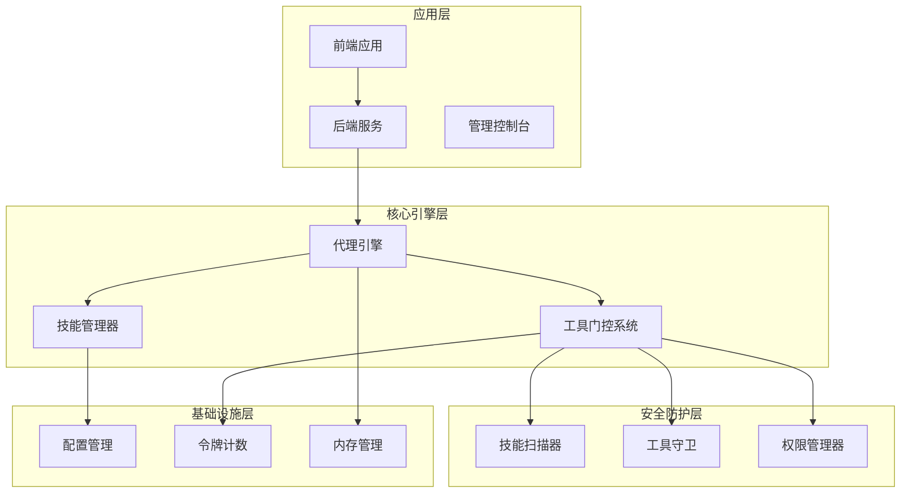
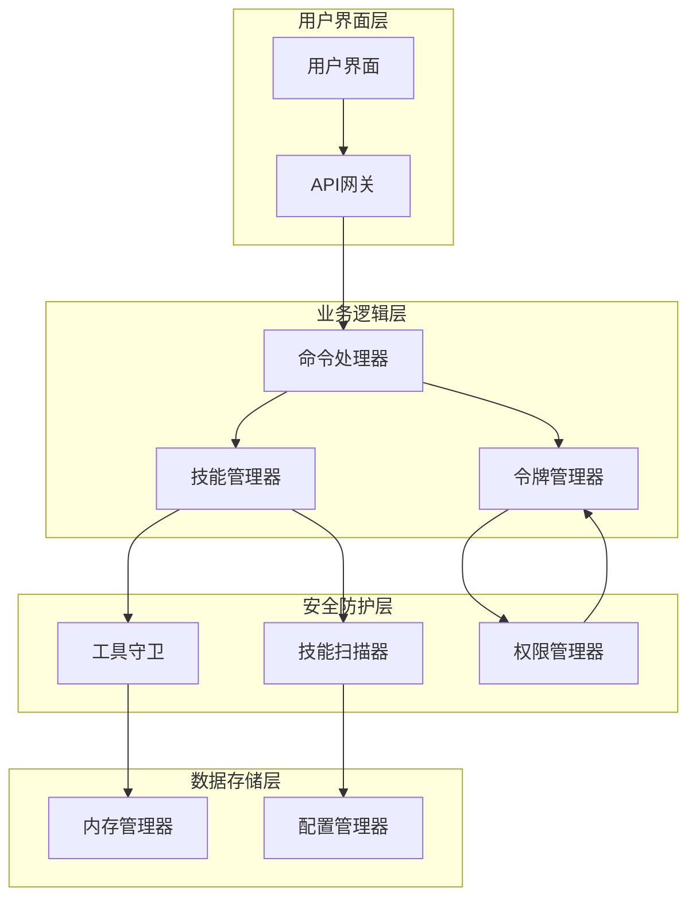
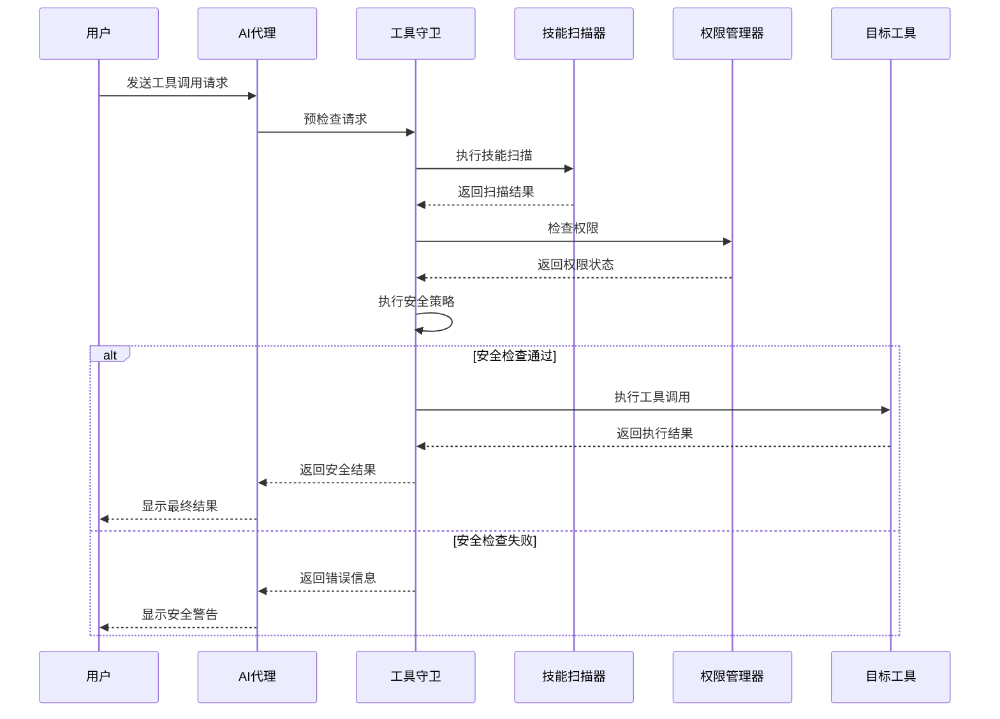
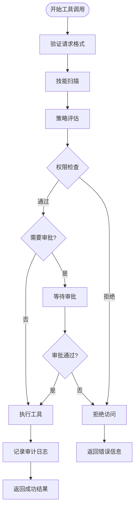
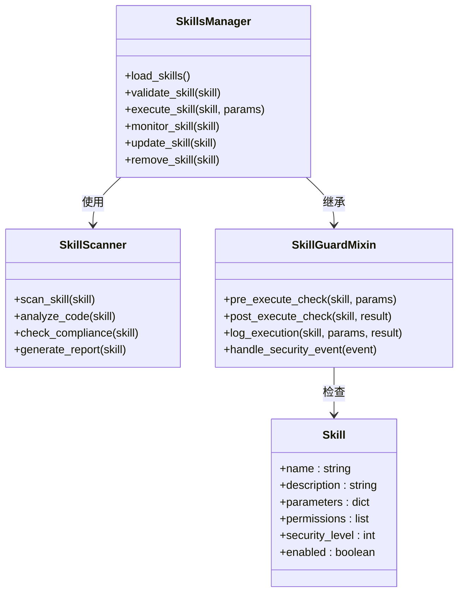
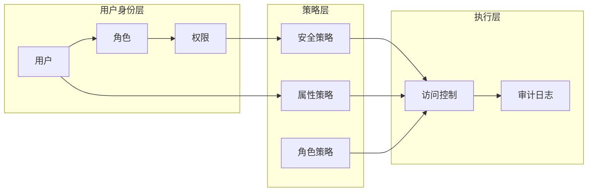
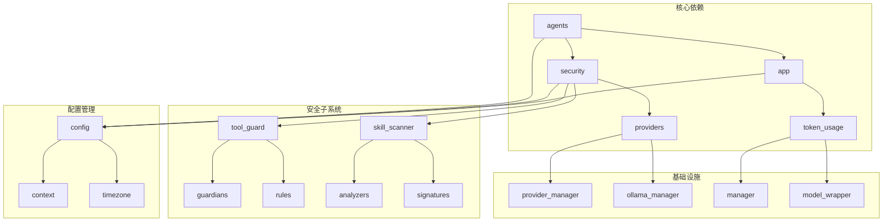

# 技能工具门控系统

<cite>
**本文档引用的文件**
- [tool_guard_mixin.py](file://src/copaw/agents/tool_guard_mixin.py)
- [engine.py](file://src/copaw/security/tool_guard/engine.py)
- [approval.py](file://src/copaw/security/tool_guard/approval.py)
- [models.py](file://src/copaw/security/tool_guard/models.py)
- [utils.py](file://src/copaw/agents/tools/utils.py)
- [command_handler.py](file://src/copaw/agents/command_handler.py)
- [skills_manager.py](file://src/copaw/agents/skills_manager.py)
- [skills_hub.py](file://src/copaw/agents/skills_hub.py)
- [react_agent.py](file://src/copaw/agents/react_agent.py)
- [schema.py](file://src/copaw/agents/schema.py)
- [router.py](file://src/copaw/app/routers/tools.py)
- [router.py](file://src/copaw/app/routers/skills.py)
- [manager.py](file://src/copaw/app/runner/manager.py)
- [api.py](file://src/copaw/app/runner/api.py)
- [task_tracker.py](file://src/copaw/app/runner/task_tracker.py)
- [memory_manager.py](file://src/copaw/agents/memory/memory_manager.py)
- [agent_md_manager.py](file://src/copaw/agents/memory/agent_md_manager.py)
- [config.py](file://src/copaw/config/config.py)
- [context.py](file://src/copaw/config/context.py)
- [timezone.py](file://src/copaw/config/timezone.py)
- [provider_manager.py](file://src/copaw/providers/provider_manager.py)
- [provider.py](file://src/copaw/providers/provider.py)
- [chat_model.py](file://src/copaw/local_models/chat_model.py)
- [factory.py](file://src/copaw/local_models/factory.py)
- [ollama_manager.py](file://src/copaw/providers/ollama_manager.py)
- [ollama_provider.py](file://src/copaw/providers/ollama_provider.py)
- [openai_provider.py](file://src/copaw/providers/openai_provider.py)
- [anthropic_provider.py](file://src/copaw/providers/anthropic_provider.py)
- [gemini_provider.py](file://src/copaw/providers/gemini_provider.py)
- [retry_chat_model.py](file://src/copaw/providers/retry_chat_model.py)
- [stream.py](file://src/copaw/token_usage/stream.py)
- [manager.py](file://src/copaw/token_usage/manager.py)
- [model_wrapper.py](file://src/copaw/token_usage/model_wrapper.py)
- [scanner.py](file://src/copaw/security/skill_scanner/scanner.py)
- [scan_policy.py](file://src/copaw/security/skill_scanner/scan_policy.py)
- [models.py](file://src/copaw/security/skill_scanner/models.py)
- [analyzers.py](file://src/copaw/security/skill_scanner/analyzers/__init__.py)
- [signatures.py](file://src/copaw/security/skill_scanner/rules/signatures/__init__.py)
- [guardians.py](file://src/copaw/security/tool_guard/guardians/__init__.py)
- [rules.py](file://src/copaw/security/tool_guard/rules/__init__.py)
- [utils.py](file://src/copaw/security/tool_guard/utils.py)
- [main.py](file://src/copaw/__main__.py)
- [constant.py](file://src/copaw/constant.py)
- [__version__.py](file://src/copaw/__version__.py)
</cite>

## 目录
1. [简介](#简介)
2. [项目结构](#项目结构)
3. [核心组件](#核心组件)
4. [架构概览](#架构概览)
5. [详细组件分析](#详细组件分析)
6. [依赖关系分析](#依赖关系分析)
7. [性能考虑](#性能考虑)
8. [故障排除指南](#故障排除指南)
9. [结论](#结论)

## 简介

技能工具门控系统是一个综合性的AI代理安全防护框架，旨在为多模态AI代理提供全面的安全保护和访问控制机制。该系统通过多层次的安全策略、智能的工具调用门控、实时的风险评估和动态的权限管理，确保AI代理在执行各种技能和工具时的安全性和可控性。

系统的核心目标包括：
- 提供细粒度的技能和工具访问控制
- 实现实时的安全扫描和风险评估
- 支持动态的权限管理和审批流程
- 确保合规性和数据安全
- 提供透明的审计日志和监控能力

## 项目结构

该项目采用模块化架构设计，主要分为以下几个核心层次：

**图表来源**
- [main.py](file://src/copaw/__main__.py)
- [constant.py](file://src/copaw/constant.py)

**章节来源**
- [main.py](file://src/copaw/__main__.py)
- [constant.py](file://src/copaw/constant.py)
- [__version__.py](file://src/copaw/__version__.py)

## 核心组件

### 工具守卫混合器（Tool Guard Mixin）

工具守卫混合器是系统的核心安全组件，提供了统一的工具调用安全检查机制。它集成了多种安全策略，包括：

- **访问控制列表（ACL）**：基于用户角色和权限的访问控制
- **实时风险评估**：对工具调用进行实时安全扫描
- **审批流程集成**：支持复杂的审批和授权流程
- **审计日志记录**：完整的操作记录和追踪能力

### 技能扫描器（Skill Scanner）

技能扫描器负责对AI代理的技能进行深度安全分析，包括：

- **代码静态分析**：检测潜在的安全漏洞和恶意代码
- **行为模式识别**：识别异常或危险的行为模式
- **合规性检查**：验证技能是否符合安全和合规要求
- **动态威胁检测**：实时监控和响应新的安全威胁

### 权限管理器（Permission Manager）

权限管理器提供灵活的权限控制系统，支持：

- **多级权限模型**：从基础访问到高级操作的完整权限体系
- **动态权限分配**：根据上下文和条件动态调整权限
- **权限继承机制**：支持角色和权限的继承关系
- **权限审计功能**：完整的权限变更和使用记录

**章节来源**
- [tool_guard_mixin.py](file://src/copaw/agents/tool_guard_mixin.py)
- [engine.py](file://src/copaw/security/tool_guard/engine.py)
- [approval.py](file://src/copaw/security/tool_guard/approval.py)
- [scanner.py](file://src/copaw/security/skill_scanner/scanner.py)

## 架构概览

系统采用分层架构设计，确保各组件之间的松耦合和高内聚：

**图表来源**
- [command_handler.py](file://src/copaw/agents/command_handler.py)
- [skills_manager.py](file://src/copaw/agents/skills_manager.py)
- [manager.py](file://src/copaw/app/runner/manager.py)
- [engine.py](file://src/copaw/security/tool_guard/engine.py)

## 详细组件分析

### 工具守卫引擎（Tool Guard Engine）

工具守卫引擎是系统的核心安全执行组件，负责处理所有工具调用请求：

**图表来源**
- [engine.py](file://src/copaw/security/tool_guard/engine.py)
- [approval.py](file://src/copaw/security/tool_guard/approval.py)
- [scanner.py](file://src/copaw/security/skill_scanner/scanner.py)

#### 安全策略执行流程

工具守卫引擎实现了多层安全策略，每个策略都有特定的检查点：

**图表来源**
- [engine.py](file://src/copaw/security/tool_guard/engine.py)
- [models.py](file://src/copaw/security/tool_guard/models.py)

**章节来源**
- [engine.py](file://src/copaw/security/tool_guard/engine.py)
- [models.py](file://src/copaw/security/tool_guard/models.py)
- [approval.py](file://src/copaw/security/tool_guard/approval.py)

### 技能管理系统（Skills Manager）

技能管理系统负责AI代理的技能生命周期管理：

**图表来源**
- [skills_manager.py](file://src/copaw/agents/skills_manager.py)
- [skills_hub.py](file://src/copaw/agents/skills_hub.py)
- [tool_guard_mixin.py](file://src/copaw/agents/tool_guard_mixin.py)

**章节来源**
- [skills_manager.py](file://src/copaw/agents/skills_manager.py)
- [skills_hub.py](file://src/copaw/agents/skills_hub.py)
- [tool_guard_mixin.py](file://src/copaw/agents/tool_guard_mixin.py)

### 访问控制和权限管理

系统实现了基于角色的访问控制（RBAC）和属性基访问控制（ABAC）相结合的混合权限模型：

**图表来源**
- [approval.py](file://src/copaw/security/tool_guard/approval.py)
- [utils.py](file://src/copaw/security/tool_guard/utils.py)

**章节来源**
- [approval.py](file://src/copaw/security/tool_guard/approval.py)
- [utils.py](file://src/copaw/security/tool_guard/utils.py)

## 依赖关系分析

系统采用了模块化的依赖管理策略，确保各组件之间的清晰边界和低耦合：

**图表来源**
- [provider_manager.py](file://src/copaw/providers/provider_manager.py)
- [ollama_manager.py](file://src/copaw/providers/ollama_manager.py)
- [manager.py](file://src/copaw/token_usage/manager.py)
- [config.py](file://src/copaw/config/config.py)

**章节来源**
- [provider_manager.py](file://src/copaw/providers/provider_manager.py)
- [ollama_manager.py](file://src/copaw/providers/ollama_manager.py)
- [manager.py](file://src/copaw/token_usage/manager.py)
- [config.py](file://src/copaw/config/config.py)

## 性能考虑

系统在设计时充分考虑了性能优化和资源管理：

### 内存管理优化
- **智能缓存策略**：使用LRU缓存管理频繁访问的技能和工具
- **内存池管理**：为大型数据结构实现内存池以减少GC压力
- **延迟加载机制**：按需加载技能和工具，避免启动时的内存峰值

### 并发处理优化
- **异步执行模型**：使用async/await模式提高并发处理能力
- **连接池管理**：为外部服务调用实现连接池复用
- **任务调度优化**：智能的任务队列和优先级管理

### 网络通信优化
- **HTTP/2支持**：利用HTTP/2的多路复用特性提升网络效率
- **压缩传输**：启用Gzip压缩减少网络传输量
- **超时重试机制**：智能的超时和重试策略

## 故障排除指南

### 常见问题诊断

#### 工具调用失败
1. **检查权限配置**：确认用户角色具有执行该工具的权限
2. **验证安全策略**：检查是否有安全策略阻止了工具调用
3. **查看审计日志**：分析详细的错误日志和执行记录

#### 技能加载错误
1. **检查依赖完整性**：确认所有必需的依赖包都已正确安装
2. **验证配置文件**：检查技能配置文件的语法和格式
3. **查看版本兼容性**：确认技能与当前系统版本的兼容性

#### 性能问题排查
1. **监控资源使用**：检查CPU、内存和磁盘的使用情况
2. **分析慢查询**：识别执行时间过长的操作和数据库查询
3. **优化缓存策略**：调整缓存大小和过期策略

### 调试工具和方法

系统提供了丰富的调试工具来帮助问题诊断：

- **详细日志记录**：完整的请求-响应日志和错误追踪
- **性能监控仪表板**：实时显示系统性能指标
- **调试接口**：提供专门的调试端点用于问题诊断
- **配置验证工具**：自动检查配置文件的有效性和完整性

**章节来源**
- [engine.py](file://src/copaw/security/tool_guard/engine.py)
- [scanner.py](file://src/copaw/security/skill_scanner/scanner.py)
- [manager.py](file://src/copaw/app/runner/manager.py)

## 结论

技能工具门控系统通过其先进的安全架构和全面的功能设计，为AI代理的安全运行提供了坚实的保障。系统的主要优势包括：

1. **多层次安全防护**：从技能扫描到工具调用的全方位安全检查
2. **灵活的权限管理**：支持复杂的权限模型和动态权限分配
3. **实时监控能力**：提供完整的审计日志和实时监控功能
4. **高性能设计**：优化的架构确保系统在高负载下的稳定运行
5. **可扩展性**：模块化设计支持功能的持续扩展和定制

该系统不仅满足了当前的安全需求，还为未来的功能扩展和技术演进预留了充足的空间。通过持续的安全更新和性能优化，系统将继续为AI代理的安全运行提供可靠保障。