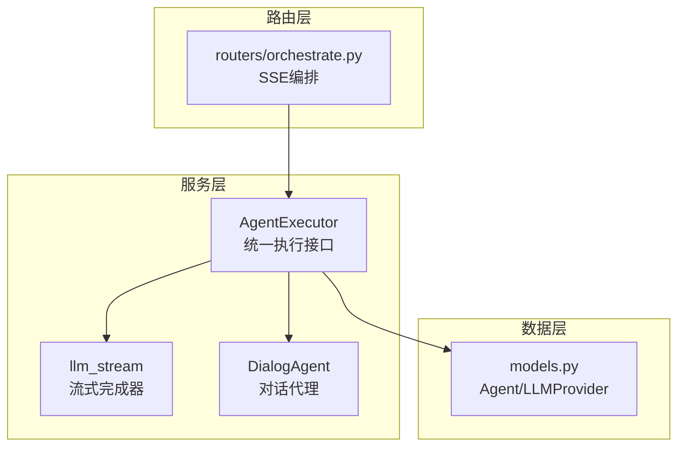
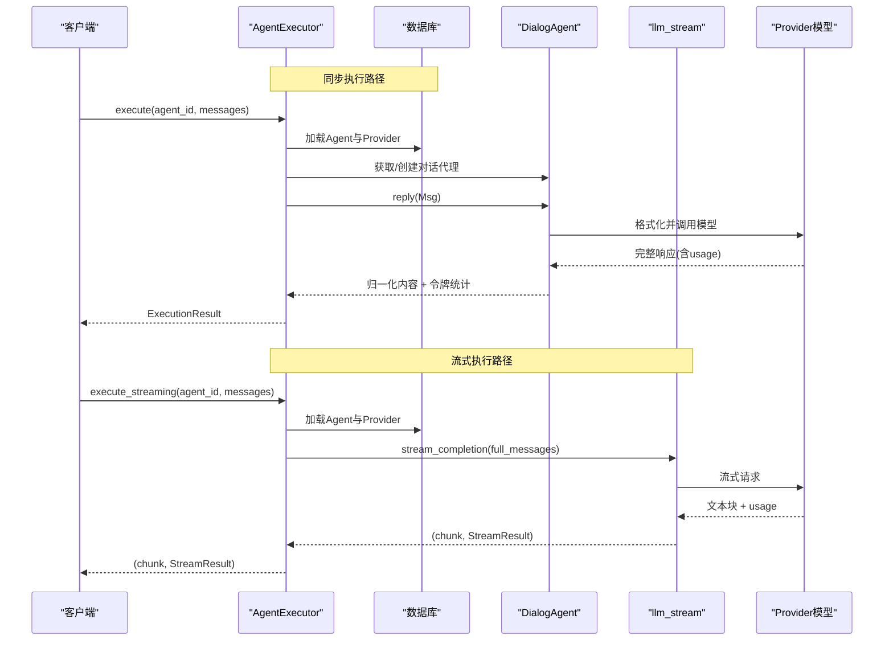
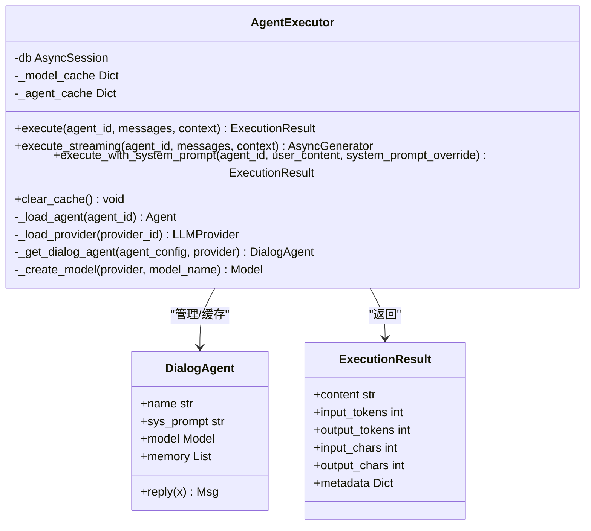
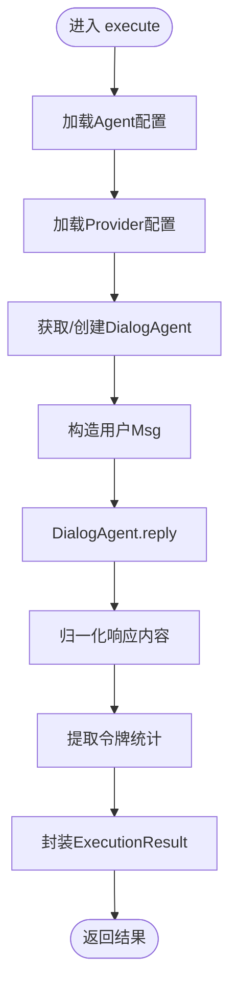
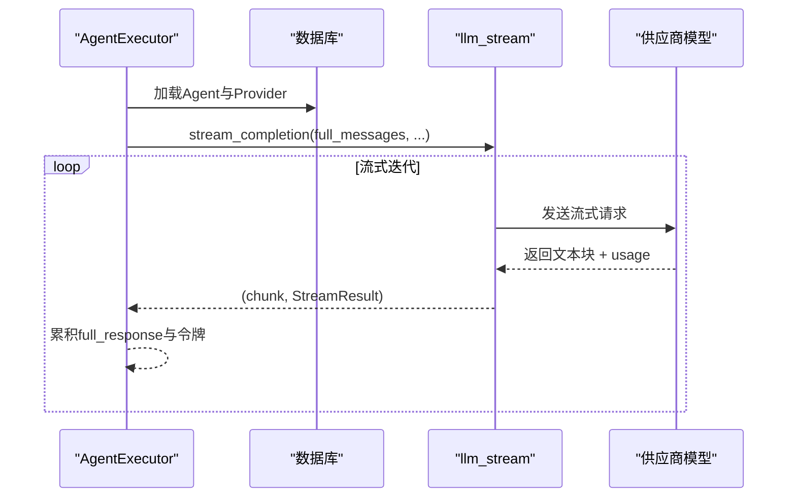
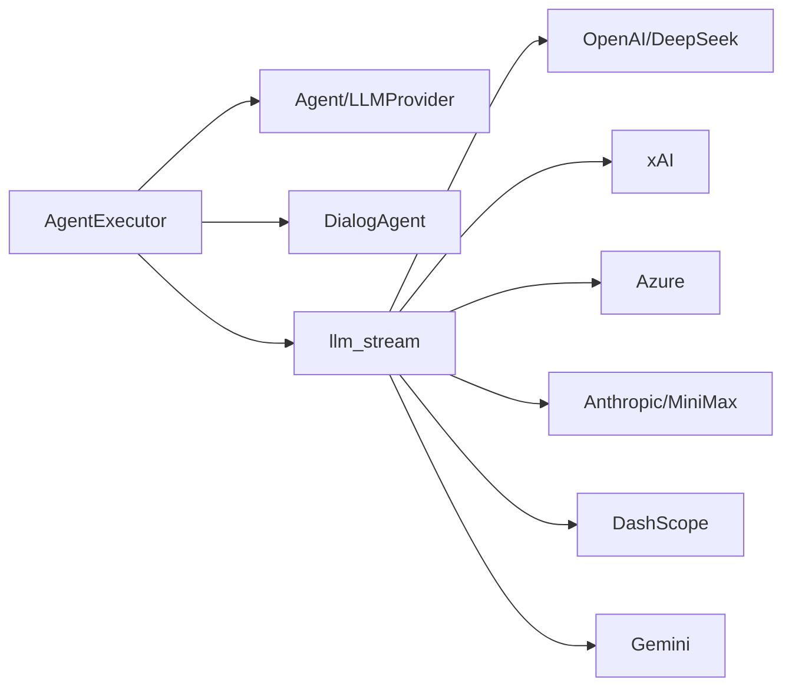

# Agent执行器核心

<cite>
**本文档引用的文件**
- [agent_executor.py](file://backend/services/agent_executor.py)
- [llm_stream.py](file://backend/services/llm_stream.py)
- [agents.py](file://backend/agents.py)
- [models.py](file://backend/models.py)
- [orchestrate.py](file://backend/routers/orchestrate.py)
- [__init__.py](file://backend/services/__init__.py)
- [main.py](file://backend/main.py)
</cite>

## 目录
1. [简介](#简介)
2. [项目结构](#项目结构)
3. [核心组件](#核心组件)
4. [架构总览](#架构总览)
5. [详细组件分析](#详细组件分析)
6. [依赖关系分析](#依赖关系分析)
7. [性能考虑](#性能考虑)
8. [故障排除指南](#故障排除指南)
9. [结论](#结论)
10. [附录](#附录)

## 简介
本文件聚焦于AgentExecutor核心执行器的设计与实现，系统性阐述其统一执行接口、缓存机制与令牌跟踪能力；深入解析execute与execute_streaming两大执行路径，涵盖消息处理、对话代理构建、响应解析与流式输出机制；提供基础执行、流式执行与系统提示符覆盖的使用示例，并给出性能优化与错误处理策略。

## 项目结构
AgentExecutor位于后端服务层，负责将数据库中的Agent与LLM Provider配置转化为可执行的对话代理实例，并提供统一的执行接口。其关键协作模块包括：
- 对话代理：DialogAgent（封装模型、工具、记忆与格式化）
- 流式处理：llm_stream（按供应商注册表进行分发与流式输出）
- 数据模型：Agent、LLMProvider（提供配置与定价信息）
- 路由集成：orchestrate（多智能体编排的SSE流式输出）

**图表来源**
- [agent_executor.py:63-277](file://backend/services/agent_executor.py#L63-L277)
- [llm_stream.py:12-800](file://backend/services/llm_stream.py#L12-L800)
- [agents.py:40-174](file://backend/agents.py#L40-L174)
- [models.py:146-252](file://backend/models.py#L146-L252)
- [orchestrate.py:26-71](file://backend/routers/orchestrate.py#L26-L71)

**章节来源**
- [agent_executor.py:63-277](file://backend/services/agent_executor.py#L63-L277)
- [llm_stream.py:12-800](file://backend/services/llm_stream.py#L12-L800)
- [agents.py:40-174](file://backend/agents.py#L40-L174)
- [models.py:146-252](file://backend/models.py#L146-L252)
- [orchestrate.py:26-71](file://backend/routers/orchestrate.py#L26-L71)

## 核心组件
- AgentExecutor：统一执行器，提供execute、execute_streaming、execute_with_system_prompt三种执行模式，内置对话代理与模型缓存，自动归一化响应内容并统计令牌用量。
- DialogAgent：基于AgentScope的对话代理，负责消息格式化、工具注册、记忆压缩与回复生成。
- llm_stream：流式完成器，采用注册表模式按供应商类型分发，支持多种供应商（OpenAI/DeepSeek、xAI、Azure、Anthropic/MiniMax、DashScope、Gemini）。
- 数据模型：Agent与LLMProvider承载执行所需的系统提示、温度、上下文窗口、工具集、供应商类型与模型成本等配置。

**章节来源**
- [agent_executor.py:63-277](file://backend/services/agent_executor.py#L63-L277)
- [agents.py:40-174](file://backend/agents.py#L40-L174)
- [llm_stream.py:12-800](file://backend/services/llm_stream.py#L12-L800)
- [models.py:146-252](file://backend/models.py#L146-L252)

## 架构总览
AgentExecutor通过数据库加载Agent与Provider配置，按需构建或复用DialogAgent实例，分别走两种执行路径：
- 同步执行：经DialogAgent.reply，利用格式化器与模型完成一次完整对话，返回ExecutionResult。
- 流式执行：绕过DialogAgent，直接调用stream_completion，逐块产出文本与运行时统计。

**图表来源**
- [agent_executor.py:74-208](file://backend/services/agent_executor.py#L74-L208)
- [agents.py:114-174](file://backend/agents.py#L114-L174)
- [llm_stream.py:79-146](file://backend/services/llm_stream.py#L79-L146)

**章节来源**
- [agent_executor.py:74-208](file://backend/services/agent_executor.py#L74-L208)
- [agents.py:114-174](file://backend/agents.py#L114-L174)
- [llm_stream.py:79-146](file://backend/services/llm_stream.py#L79-L146)

## 详细组件分析

### AgentExecutor类设计与缓存机制
- 统一执行接口
  - execute：构建DialogAgent，准备Msg，调用reply，归一化内容并提取usage，返回ExecutionResult。
  - execute_streaming：直接拼接系统提示与用户消息，调用stream_completion，逐块产出文本与运行时统计。
  - execute_with_system_prompt：在不修改持久配置的前提下，临时覆盖系统提示进行一次性执行。
- 缓存机制
  - _agent_cache：以“agent_id_provider_id”为键缓存DialogAgent实例，避免重复初始化。
  - _model_cache：预留模型实例缓存空间，便于后续扩展。
- 令牌跟踪
  - execute：从response.metadata提取input_tokens与output_tokens。
  - execute_streaming：从StreamResult累积input_tokens与output_tokens。
  - execute_with_system_prompt：同execute。
- 错误处理
  - _load_agent/_load_provider：当找不到Agent或Provider时抛出异常，便于上层捕获与降级。

**图表来源**
- [agent_executor.py:63-277](file://backend/services/agent_executor.py#L63-L277)
- [agents.py:40-174](file://backend/agents.py#L40-L174)

**章节来源**
- [agent_executor.py:63-277](file://backend/services/agent_executor.py#L63-L277)
- [agents.py:40-174](file://backend/agents.py#L40-L174)

### execute方法执行流程
- 加载配置：从数据库读取Agent与Provider配置。
- 构建/复用代理：根据Agent与Provider生成缓存键，命中则直接使用，否则创建新的DialogAgent。
- 准备输入：取messages最后一项作为用户输入，构造Msg对象。
- 执行与归一化：调用DialogAgent.reply，将多模态/列表内容归一化为字符串。
- 令牌统计：从响应元数据提取input_tokens与output_tokens。
- 结果封装：返回ExecutionResult，包含内容、字符数与令牌统计。

**图表来源**
- [agent_executor.py:74-125](file://backend/services/agent_executor.py#L74-L125)
- [agents.py:114-174](file://backend/agents.py#L114-L174)

**章节来源**
- [agent_executor.py:74-125](file://backend/services/agent_executor.py#L74-L125)
- [agents.py:114-174](file://backend/agents.py#L114-L174)

### execute_streaming方法流式输出机制
- 消息构建：若Agent配置了system_prompt，则前置system消息，再追加用户messages。
- 流式调用：调用stream_completion，按供应商类型分发至对应处理器。
- 实时分块：逐块产出文本片段与运行时统计（StreamResult），可用于前端SSE或WebSocket。
- 进度跟踪：每次yield包含当前文本块与累计的StreamResult，便于前端即时渲染与统计。

**图表来源**
- [agent_executor.py:127-162](file://backend/services/agent_executor.py#L127-L162)
- [llm_stream.py:79-146](file://backend/services/llm_stream.py#L79-L146)

**章节来源**
- [agent_executor.py:127-162](file://backend/services/agent_executor.py#L127-L162)
- [llm_stream.py:79-146](file://backend/services/llm_stream.py#L79-L146)

### 系统提示符覆盖执行
- 场景：在任务分解或特殊指令场景下，需要临时覆盖Agent的系统提示而不修改持久配置。
- 方式：execute_with_system_prompt接收system_prompt_override，创建新的DialogAgent实例，其余参数沿用Agent配置。
- 应用：适合领导者代理对子任务进行专门指导。

**章节来源**
- [agent_executor.py:164-208](file://backend/services/agent_executor.py#L164-L208)

### 多智能体编排中的流式集成
- 路由层通过SSE向客户端推送事件，内部调用DynamicOrchestrator，后者在每个子任务中调用AgentExecutor.execute_streaming，逐块转发给客户端。
- 该模式实现了端到端的实时进度跟踪与内容增量渲染。

**章节来源**
- [orchestrate.py:26-71](file://backend/routers/orchestrate.py#L26-L71)
- [agent_executor.py:127-162](file://backend/services/agent_executor.py#L127-L162)

## 依赖关系分析
- AgentExecutor依赖
  - 数据模型：Agent、LLMProvider（用于读取系统提示、温度、上下文窗口、工具集、供应商类型与模型成本）。
  - 对话代理：DialogAgent（封装模型、工具、记忆与格式化）。
  - 流式模块：llm_stream（按供应商类型分发与流式输出）。
- 供应商适配
  - 通过_MODEL_CREATORS与兼容列表自动选择模型类（OpenAI/Anthropic/DashScope/Gemini/Ollama）。
  - llm_stream采用注册表模式，按provider_type路由到具体实现（OpenAI/DeepSeek、xAI、Azure、Anthropic/MiniMax、DashScope、Gemini）。

**图表来源**
- [agent_executor.py:46-61](file://backend/services/agent_executor.py#L46-L61)
- [llm_stream.py:58-800](file://backend/services/llm_stream.py#L58-L800)

**章节来源**
- [agent_executor.py:46-61](file://backend/services/agent_executor.py#L46-L61)
- [llm_stream.py:58-800](file://backend/services/llm_stream.py#L58-L800)

## 性能考虑
- 缓存策略
  - 对话代理缓存：复用DialogAgent实例，避免重复初始化与工具注册开销。
  - 模型缓存：预留_model_cache，可在未来按“供应商类型+模型名”进一步细化缓存键。
- 流式传输
  - execute_streaming绕过DialogAgent的中间层，直接与供应商模型交互，降低延迟与内存占用。
- 上下文控制
  - 利用Agent的context_window与MemoryCompactionHook，控制历史消息长度，减少token消耗。
- 令牌统计
  - 在同步与流式路径均提供input_tokens与output_tokens，便于成本控制与性能监控。

[本节为通用性能建议，无需特定文件引用]

## 故障排除指南
- Agent/Provider缺失
  - 现象：执行时报“Agent not found”或“LLM Provider not found”。
  - 处理：检查数据库中是否存在对应ID；确认Agent的provider_id正确关联。
- 流式输出异常
  - 现象：SSE中断、文本块丢失或usage为空。
  - 处理：检查llm_stream中对应供应商处理器的日志与错误分支；确认API密钥与base_url配置。
- 令牌统计异常
  - 现象：ExecutionResult或StreamResult中令牌为0。
  - 处理：确认供应商是否返回usage字段；核对模型成本配置与计费单位。
- 多智能体编排中断
  - 现象：SSE事件停止或报错。
  - 处理：查看orchestrate路由的异常捕获与SSE头部设置，确保事件持续推送。

**章节来源**
- [agent_executor.py:210-224](file://backend/services/agent_executor.py#L210-L224)
- [llm_stream.py:132-138](file://backend/services/llm_stream.py#L132-L138)
- [orchestrate.py:59-61](file://backend/routers/orchestrate.py#L59-L61)

## 结论
AgentExecutor通过统一接口、缓存与令牌跟踪，有效简化了多供应商、多模型的执行复杂度；结合DialogAgent与llm_stream，既支持稳定的一次性回复，也支持实时的流式输出。配合多智能体编排的SSE机制，可实现端到端的高效、可观测的AI工作流。

[本节为总结性内容，无需特定文件引用]

## 附录

### 使用示例

- 基础执行（同步）
  - 步骤：传入agent_id与messages，调用execute，获取ExecutionResult。
  - 关键点：messages最后一项作为用户输入；系统提示来自Agent配置。
  - 参考路径：[agent_executor.py:74-125](file://backend/services/agent_executor.py#L74-L125)

- 流式执行（SSE/增量渲染）
  - 步骤：调用execute_streaming，逐块消费yield的(chunk, StreamResult)，前端实时渲染。
  - 参考路径：[agent_executor.py:127-162](file://backend/services/agent_executor.py#L127-L162)、[orchestrate.py:26-71](file://backend/routers/orchestrate.py#L26-L71)

- 系统提示符覆盖
  - 步骤：调用execute_with_system_prompt，传入system_prompt_override，临时覆盖系统提示。
  - 参考路径：[agent_executor.py:164-208](file://backend/services/agent_executor.py#L164-L208)

- 多智能体编排（SSE）
  - 步骤：通过/api/orchestrate触发编排，后端以SSE推送事件，内部调用AgentExecutor流式执行。
  - 参考路径：[orchestrate.py:26-71](file://backend/routers/orchestrate.py#L26-L71)

**章节来源**
- [agent_executor.py:74-208](file://backend/services/agent_executor.py#L74-L208)
- [orchestrate.py:26-71](file://backend/routers/orchestrate.py#L26-L71)