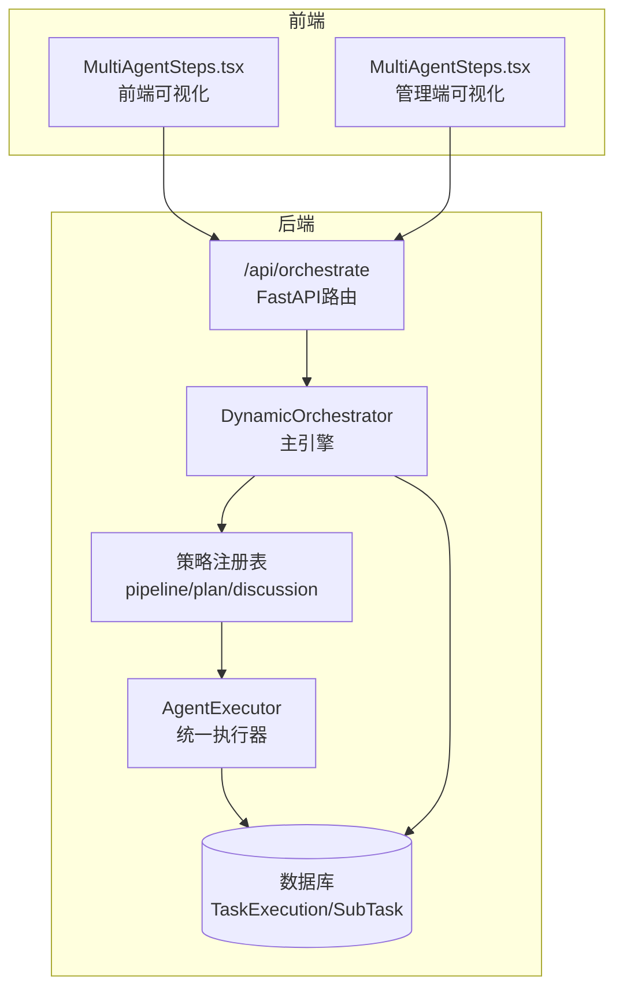
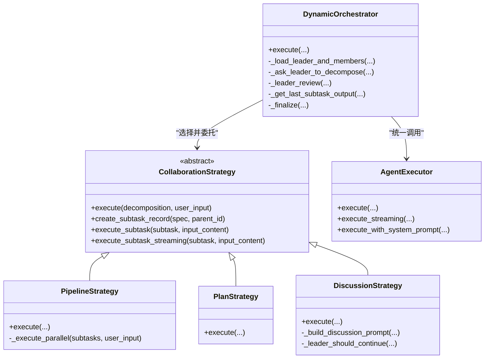
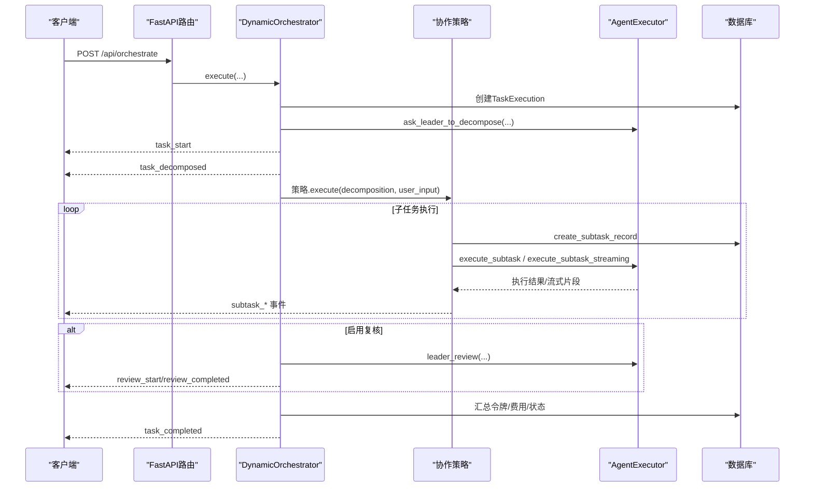
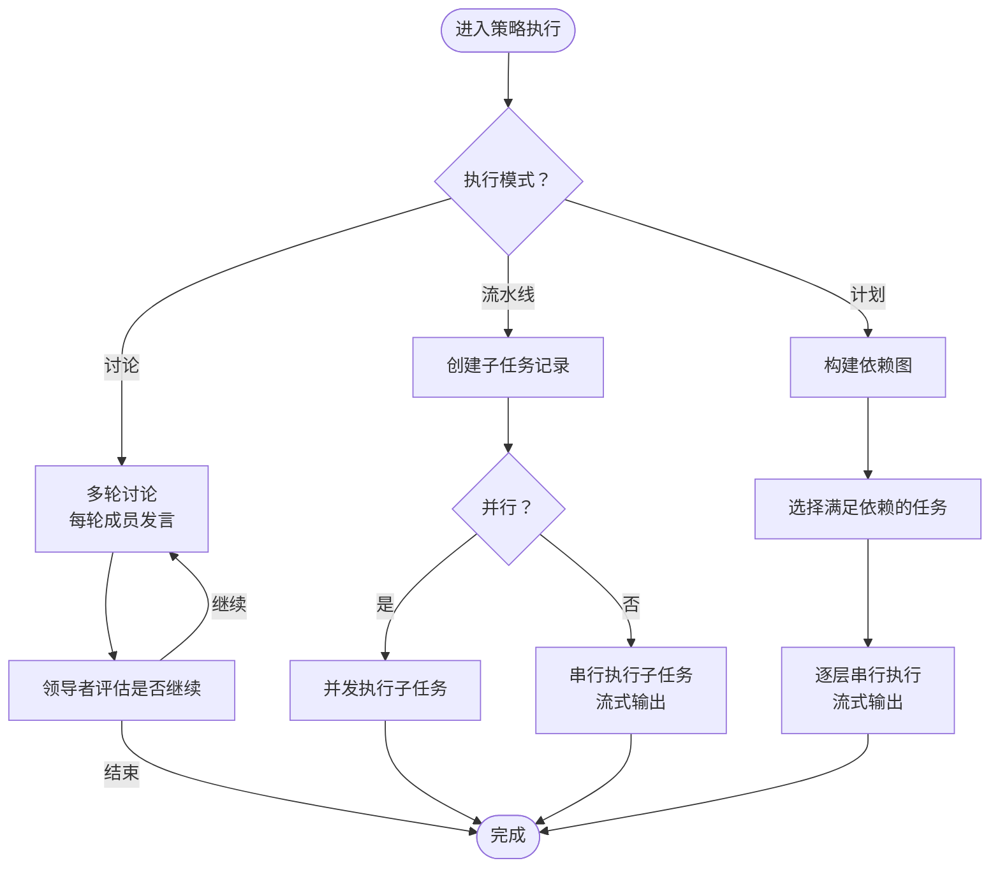
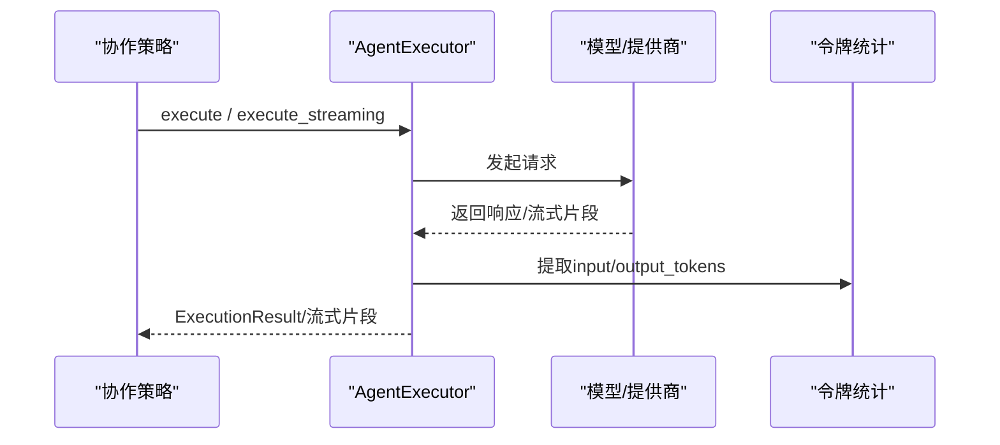
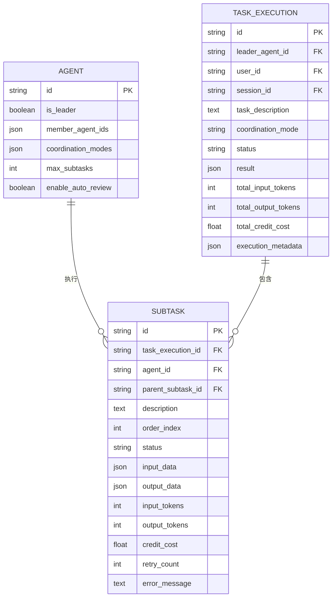
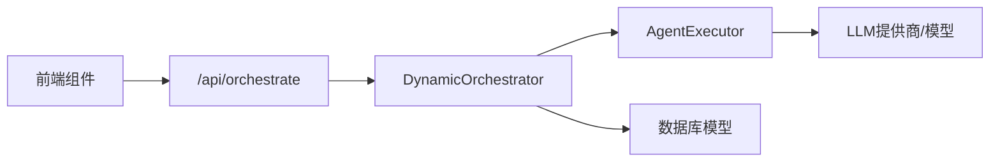

# 动态编排器

<cite>
**本文引用的文件**
- [backend/services/orchestrator.py](file://backend/services/orchestrator.py)
- [backend/routers/orchestrate.py](file://backend/routers/orchestrate.py)
- [backend/services/agent_executor.py](file://backend/services/agent_executor.py)
- [backend/models.py](file://backend/models.py)
- [backend/schemas.py](file://backend/schemas.py)
- [frontend/src/components/canvas/MultiAgentSteps.tsx](file://frontend/src/components/canvas/MultiAgentSteps.tsx)
- [backend/admin/src/components/admin/agents/MultiAgentSteps.tsx](file://backend/admin/src/components/admin/agents/MultiAgentSteps.tsx)
</cite>

## 目录
1. [简介](#简介)
2. [项目结构](#项目结构)
3. [核心组件](#核心组件)
4. [架构总览](#架构总览)
5. [详细组件分析](#详细组件分析)
6. [依赖分析](#依赖分析)
7. [性能考虑](#性能考虑)
8. [故障排查指南](#故障排查指南)
9. [结论](#结论)
10. [附录](#附录)

## 简介
本文件面向DynamicOrchestrator动态编排器，系统性阐述其动态编排架构、任务分配策略、智能体协调机制与冲突解决算法；详细描述编排流程（任务分解、执行调度、结果聚合）、多智能体协作模式（领导者-跟随者与并行执行策略），并提供具体编排示例、异常处理与性能优化建议。文档同时给出代码级架构图与流程图，帮助读者快速理解与落地应用。

## 项目结构
DynamicOrchestrator位于后端服务层，通过FastAPI路由暴露REST接口，内部以“策略注册表”模式实现多种协作策略（流水线、计划、讨论），并通过统一的AgentExecutor执行智能体调用，最终将任务执行记录持久化到数据库。

图表来源
- [backend/routers/orchestrate.py:26-71](file://backend/routers/orchestrate.py#L26-L71)
- [backend/services/orchestrator.py:560-673](file://backend/services/orchestrator.py#L560-L673)
- [backend/services/agent_executor.py:63-277](file://backend/services/agent_executor.py#L63-L277)
- [backend/models.py:283-330](file://backend/models.py#L283-L330)

章节来源
- [backend/routers/orchestrate.py:26-71](file://backend/routers/orchestrate.py#L26-L71)
- [backend/services/orchestrator.py:560-673](file://backend/services/orchestrator.py#L560-L673)
- [backend/services/agent_executor.py:63-277](file://backend/services/agent_executor.py#L63-L277)
- [backend/models.py:283-330](file://backend/models.py#L283-L330)

## 核心组件
- DynamicOrchestrator：主引擎，负责加载领导者与成员、触发任务分解、选择并执行协作策略、汇总结果与计费。
- CollaborationStrategy抽象基类与三个具体策略：PipelineStrategy、PlanStrategy、DiscussionStrategy，分别对应流水线、计划依赖与多轮讨论。
- AgentExecutor：统一的智能体执行器，封装对话代理调用、流式输出、令牌统计与模型适配。
- 数据模型：TaskExecution、SubTask、Agent等，支撑任务生命周期与计费统计。
- FastAPI路由：提供SSE流式事件接口，支持取消任务、查询执行详情。

章节来源
- [backend/services/orchestrator.py:82-108](file://backend/services/orchestrator.py#L82-L108)
- [backend/services/orchestrator.py:254-320](file://backend/services/orchestrator.py#L254-L320)
- [backend/services/orchestrator.py:325-407](file://backend/services/orchestrator.py#L325-L407)
- [backend/services/orchestrator.py:413-530](file://backend/services/orchestrator.py#L413-L530)
- [backend/services/agent_executor.py:63-277](file://backend/services/agent_executor.py#L63-L277)
- [backend/models.py:196-330](file://backend/models.py#L196-L330)
- [backend/routers/orchestrate.py:26-71](file://backend/routers/orchestrate.py#L26-L71)

## 架构总览
DynamicOrchestrator采用“策略注册表 + 分层职责”的设计：
- 路由层：接收请求，校验配额，返回SSE事件流。
- 引擎层：加载领导者与成员，生成任务分解，选择策略执行。
- 策略层：按模式（流水线/计划/讨论）调度子任务，支持并行与串行。
- 执行层：统一调用智能体，记录令牌与费用，支持非流式与流式两种执行路径。
- 存储层：持久化任务执行记录、子任务与计费元数据。

图表来源
- [backend/services/orchestrator.py:82-108](file://backend/services/orchestrator.py#L82-L108)
- [backend/services/orchestrator.py:254-320](file://backend/services/orchestrator.py#L254-L320)
- [backend/services/orchestrator.py:325-407](file://backend/services/orchestrator.py#L325-L407)
- [backend/services/orchestrator.py:413-530](file://backend/services/orchestrator.py#L413-L530)
- [backend/services/agent_executor.py:63-277](file://backend/services/agent_executor.py#L63-L277)

## 详细组件分析

### 主引擎：DynamicOrchestrator
- 职责
  - 加载领导者与成员智能体，校验领导者身份与成员配置。
  - 创建任务执行记录，触发领导者进行任务分解（支持自动模式）。
  - 选择协作策略（流水线/计划/讨论），执行子任务并产出事件流。
  - 可选的领导者复核，整合子任务输出，计算总令牌与费用，原子扣费。
- 关键流程
  - 任务开始事件 -> 任务分解事件 -> 策略执行事件 -> 结果聚合事件 -> 完成事件。
  - 异常时写入错误元数据并发出失败事件。
- 事件模型
  - 事件类型：task_start、task_decomposed、subtask_created、subtask_started、subtask_chunk、subtask_completed、subtask_failed、pipeline_completed、plan_completed、discussion_started、discussion_completed、review_start、review_completed、task_completed、task_failed。
  - 事件序列遵循SSE格式，便于前端实时渲染。

图表来源
- [backend/routers/orchestrate.py:26-71](file://backend/routers/orchestrate.py#L26-L71)
- [backend/services/orchestrator.py:570-673](file://backend/services/orchestrator.py#L570-L673)
- [backend/services/orchestrator.py:82-108](file://backend/services/orchestrator.py#L82-L108)
- [backend/services/agent_executor.py:74-208](file://backend/services/agent_executor.py#L74-L208)

章节来源
- [backend/services/orchestrator.py:570-673](file://backend/services/orchestrator.py#L570-L673)
- [backend/routers/orchestrate.py:26-71](file://backend/routers/orchestrate.py#L26-L71)

### 协作策略：策略注册表与三种模式
- 策略注册表
  - 通过装饰器注册策略类，按名称获取策略，默认回退到流水线策略。
- 流水线模式（PipelineStrategy）
  - 支持顺序与并行两种执行方式。
  - 顺序：逐个子任务串行执行，使用流式输出，前一个结果作为下一个输入。
  - 并行：所有子任务并发执行，非流式，完成后统一产出完成事件。
- 计划模式（PlanStrategy）
  - 基于子任务依赖图，先满足依赖的任务先执行，同层任务可并行。
  - 依赖解析：索引到子任务ID映射，构建邻接关系。
  - 串行执行每个层级，支持流式输出与错误事件。
- 讨论模式（DiscussionStrategy）
  - 多轮讨论，每轮所有成员依次发言，领导者评估是否继续。
  - 最大轮次限制，支持基于审查标准的终止条件。

图表来源
- [backend/services/orchestrator.py:254-320](file://backend/services/orchestrator.py#L254-L320)
- [backend/services/orchestrator.py:325-407](file://backend/services/orchestrator.py#L325-L407)
- [backend/services/orchestrator.py:413-530](file://backend/services/orchestrator.py#L413-L530)

章节来源
- [backend/services/orchestrator.py:62-76](file://backend/services/orchestrator.py#L62-L76)
- [backend/services/orchestrator.py:254-320](file://backend/services/orchestrator.py#L254-L320)
- [backend/services/orchestrator.py:325-407](file://backend/services/orchestrator.py#L325-L407)
- [backend/services/orchestrator.py:413-530](file://backend/services/orchestrator.py#L413-L530)

### 统一执行器：AgentExecutor
- 职责
  - 加载智能体与提供商配置，缓存模型与对话代理实例。
  - 提供非流式与流式两种执行路径，统一返回令牌统计与内容。
  - 支持系统提示词覆盖，便于任务分解与复核场景。
- 流式执行
  - 直接调用底层流式接口，逐块产出文本与运行时统计，适合前端实时渲染。
- 非流式执行
  - 通过对话代理回复，适合批量或不需要实时反馈的场景。
- 成本计算
  - 执行结果中包含输入/输出令牌，后续由编排器汇总并原子扣费。

图表来源
- [backend/services/agent_executor.py:74-208](file://backend/services/agent_executor.py#L74-L208)
- [backend/services/agent_executor.py:127-163](file://backend/services/agent_executor.py#L127-L163)

章节来源
- [backend/services/agent_executor.py:63-277](file://backend/services/agent_executor.py#L63-L277)

### 数据模型与持久化
- TaskExecution
  - 记录一次编排任务的总体状态、总令牌、总费用与元数据。
- SubTask
  - 记录每个子任务的执行状态、输入输出、令牌、费用与错误信息。
- Agent
  - 领导者配置：是否领导者、可编排成员ID、支持的协作模式、最大子任务数、自动复核开关等。
- 计费与事务
  - 编排器在完成阶段汇总子任务费用，使用原子扣费，支持余额不足与冻结处理。

图表来源
- [backend/models.py:196-330](file://backend/models.py#L196-L330)

章节来源
- [backend/models.py:196-330](file://backend/models.py#L196-L330)
- [backend/services/orchestrator.py:837-899](file://backend/services/orchestrator.py#L837-L899)

### 前端可视化与交互
- 前端组件
  - MultiAgentSteps.tsx：展示步骤状态、结果、令牌统计与费用，支持展开/折叠查看。
  - 管理端组件：提供更丰富的状态与错误展示，支持流式渲染。
- 交互要点
  - 通过SSE事件流实时更新UI，避免轮询。
  - 展示最终结果与累计令牌/费用，便于用户理解成本与效果。

章节来源
- [frontend/src/components/canvas/MultiAgentSteps.tsx:28-98](file://frontend/src/components/canvas/MultiAgentSteps.tsx#L28-L98)
- [backend/admin/src/components/admin/agents/MultiAgentSteps.tsx:35-59](file://backend/admin/src/components/admin/agents/MultiAgentSteps.tsx#L35-L59)

## 依赖分析
- 路由依赖
  - FastAPI路由依赖数据库会话、认证用户、编排器服务，返回SSE流。
- 编排器依赖
  - 依赖AgentExecutor执行智能体调用；依赖数据库模型持久化任务与子任务；依赖计费模块进行费用计算与原子扣费。
- 执行器依赖
  - 依赖对话代理框架与不同提供商模型类，支持多种LLM提供商。
- 前端依赖
  - 依赖SSE事件流与后端响应模型，渲染协作过程与结果。

图表来源
- [backend/routers/orchestrate.py:26-71](file://backend/routers/orchestrate.py#L26-L71)
- [backend/services/orchestrator.py:566-568](file://backend/services/orchestrator.py#L566-L568)
- [backend/services/agent_executor.py:63-277](file://backend/services/agent_executor.py#L63-L277)

章节来源
- [backend/routers/orchestrate.py:26-71](file://backend/routers/orchestrate.py#L26-L71)
- [backend/services/orchestrator.py:566-568](file://backend/services/orchestrator.py#L566-L568)
- [backend/services/agent_executor.py:63-277](file://backend/services/agent_executor.py#L63-L277)

## 性能考虑
- 并发策略
  - 流水线并行：对独立子任务使用并发执行，显著缩短总耗时；注意资源竞争与限流。
  - 计划并行：同一层级内并行，跨层级串行，平衡吞吐与依赖约束。
- 流式输出
  - 使用流式执行提升用户体验，减少首屏延迟；注意事件合并与去抖。
- 缓存与复用
  - 执行器缓存模型与对话代理实例，降低初始化开销。
- 计费与事务
  - 原子扣费避免竞态，失败时回滚；对高并发场景建议增加重试与幂等控制。
- 数据库
  - 子任务状态与令牌统计频繁更新，建议合理索引与批量提交。

## 故障排查指南
- 常见问题
  - 任务失败：检查子任务错误信息与重试次数；确认模型提供商可用性与API密钥。
  - 余额不足：编排器在完成阶段进行原子扣费，若余额不足则标记失败状态。
  - 任务被取消：仅运行中/待执行任务可取消，失败状态不可取消。
- 排查步骤
  - 通过任务详情接口查询TaskExecution与SubTask状态与错误。
  - 查看SSE事件流中的task_failed与subtask_failed事件定位问题。
  - 检查Agent配置与成员ID匹配，确保领导者配置正确。
- 建议
  - 对关键环节增加日志与指标采集，便于定位瓶颈。
  - 对长链路调用增加超时与重试策略，避免阻塞。

章节来源
- [backend/routers/orchestrate.py:149-184](file://backend/routers/orchestrate.py#L149-L184)
- [backend/services/orchestrator.py:660-673](file://backend/services/orchestrator.py#L660-L673)
- [backend/services/orchestrator.py:837-899](file://backend/services/orchestrator.py#L837-L899)

## 结论
DynamicOrchestrator通过“策略注册表 + 统一执行器 + 流式事件”的架构，实现了灵活、可观测、可扩展的多智能体动态编排。流水线、计划与讨论三种协作模式覆盖了从简单串行到复杂依赖与多轮讨论的多样化场景；结合前端SSE可视化与数据库持久化，既保证了执行效率，也提供了良好的可观测性与可维护性。建议在生产环境中结合并发策略、流式优化与原子扣费机制，持续优化性能与稳定性。

## 附录

### 编排流程示例（文字版）
- 场景：复杂创意任务（如生成剧本与角色设定）
- 步骤
  1) 任务描述输入，路由校验配额并启动SSE流。
  2) 引擎加载领导者与成员，触发领导者进行任务分解（自动模式下由领导者决定流水线/计划/讨论）。
  3) 策略执行：
     - 流水线：并行生成多个子任务（如角色、场景、对白），顺序模式下以上游结果为输入。
     - 计划：根据依赖图，先生成基础素材，再生成上层内容。
     - 讨论：多轮成员讨论，领导者评估是否继续。
  4) 执行器统一调用智能体，记录令牌与费用；前端实时渲染进度。
  5) 可选复核：领导者整合子任务输出，生成最终结果。
  6) 编排器汇总总令牌与费用，原子扣费，标记完成。

### 多智能体协作模式
- 领导者-跟随者
  - 领导者负责任务分解与最终复核；成员专注各自领域执行。
- 并行执行策略
  - 流水线并行：独立任务并发执行。
  - 计划并行：同一层级并发，跨层级串行。
- 冲突解决
  - 讨论模式由领导者评估并决定是否继续，形成共识后再继续。
  - 计划模式通过依赖图避免循环依赖，自动调度满足前置条件的任务。

### API与事件参考
- 路由
  - POST /api/orchestrate：启动编排任务，返回SSE事件流。
  - GET /api/orchestrate/{id}：查询任务详情与子任务列表。
  - GET /api/orchestrate：分页查询当前用户的任务执行记录。
  - DELETE /api/orchestrate/{id}：取消运行中任务。
- 事件类型
  - task_start、task_decomposed、subtask_created、subtask_started、subtask_chunk、subtask_completed、subtask_failed、pipeline_completed、plan_completed、discussion_started、discussion_completed、review_start、review_completed、task_completed、task_failed。

章节来源
- [backend/routers/orchestrate.py:26-184](file://backend/routers/orchestrate.py#L26-L184)
- [backend/schemas.py:428-476](file://backend/schemas.py#L428-L476)