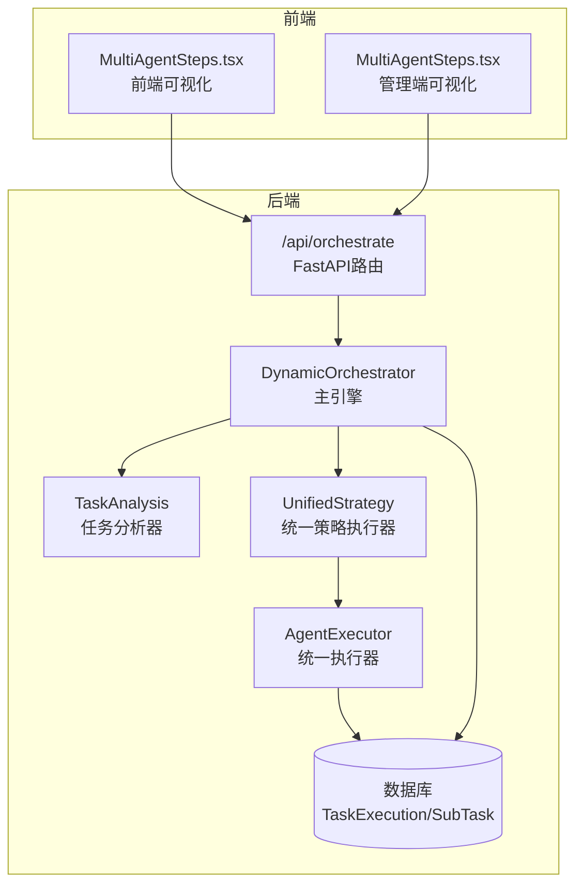
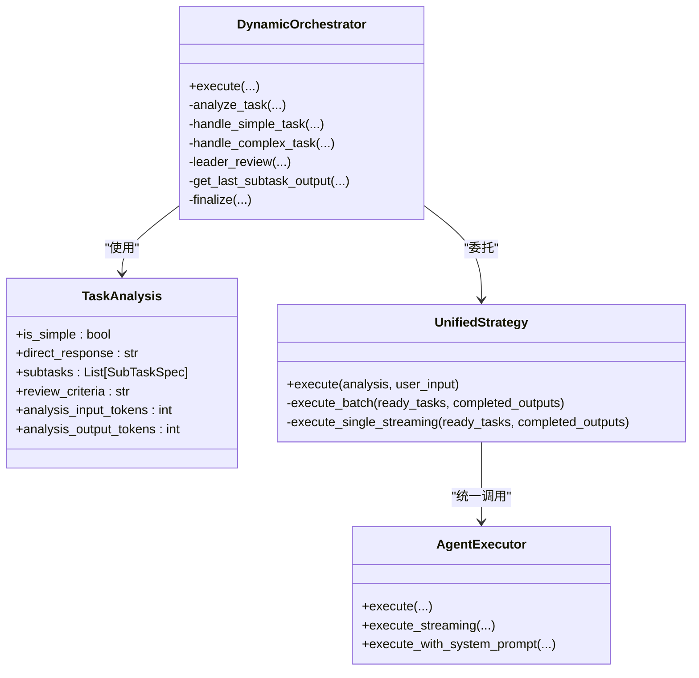
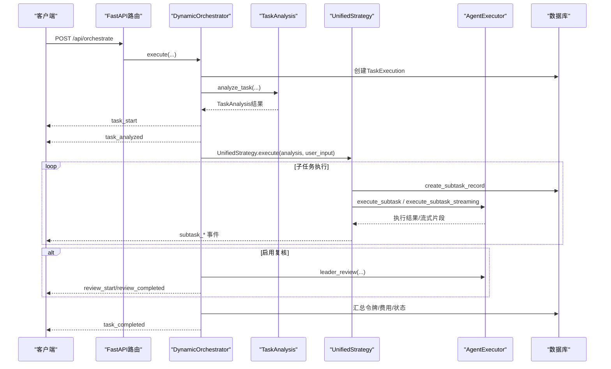
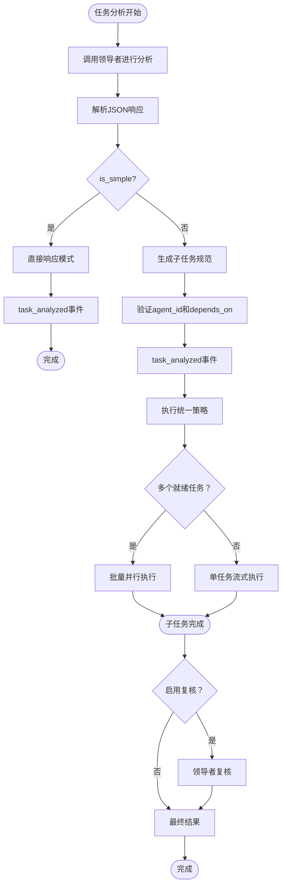
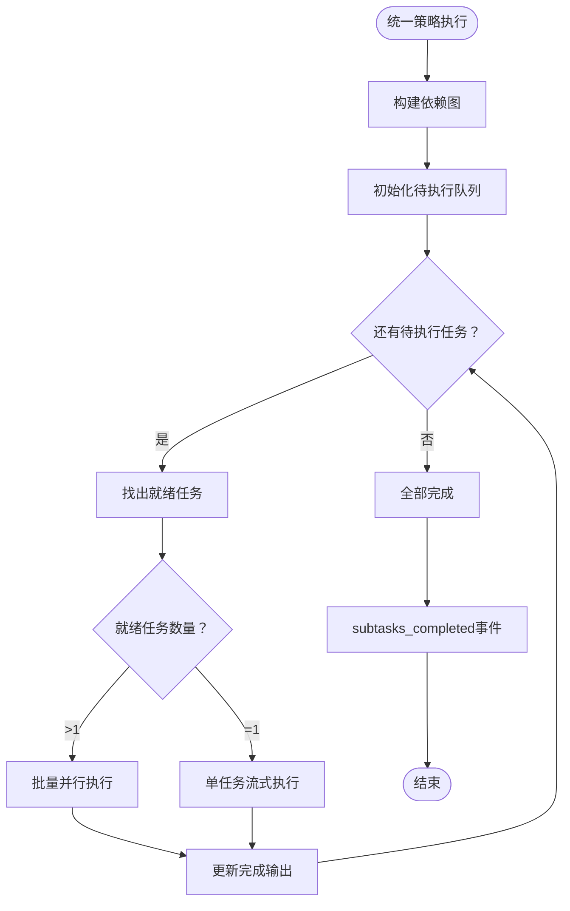
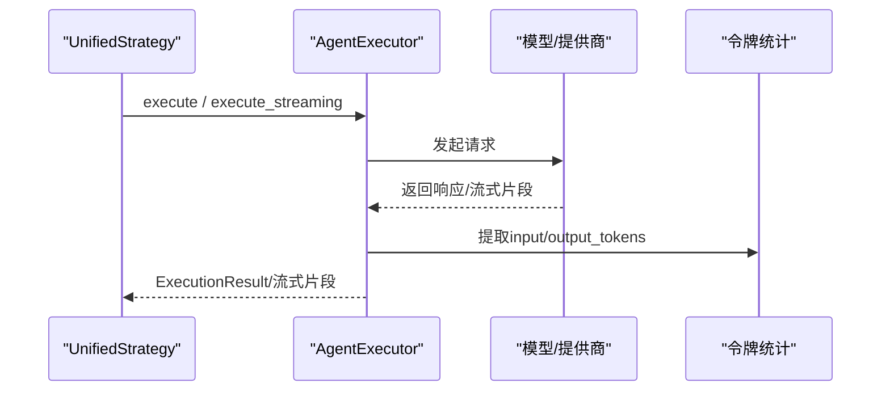
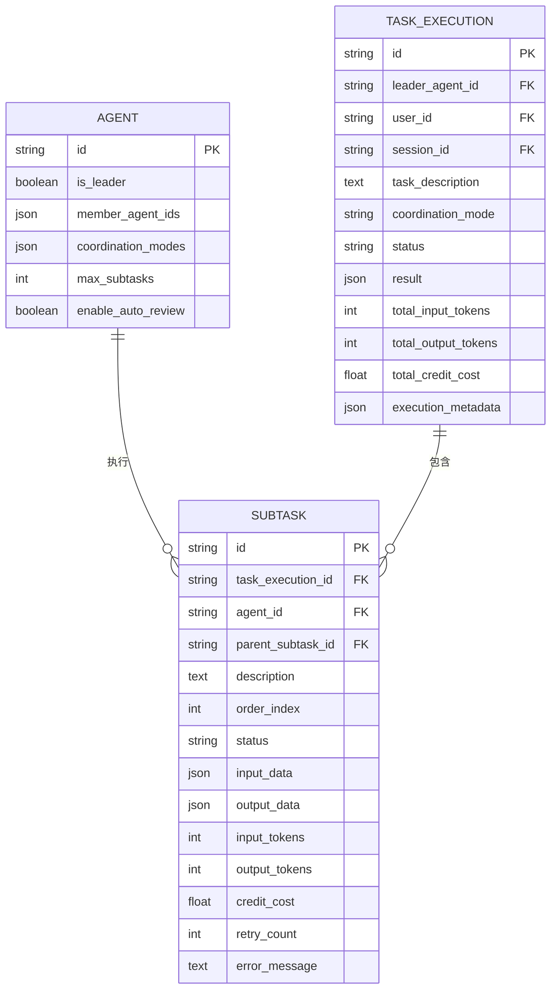
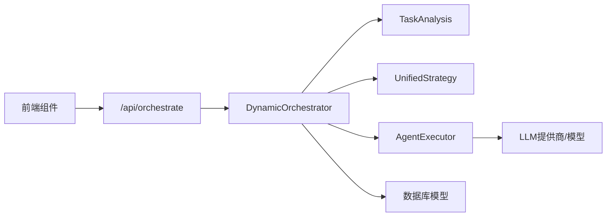

# 动态编排器

<cite>
**本文引用的文件**
- [backend/services/orchestrator.py](file://backend/services/orchestrator.py)
- [backend/routers/orchestrate.py](file://backend/routers/orchestrate.py)
- [backend/services/agent_executor.py](file://backend/services/agent_executor.py)
- [backend/models.py](file://backend/models.py)
- [backend/schemas.py](file://backend/schemas.py)
- [frontend/src/components/canvas/MultiAgentSteps.tsx](file://frontend/src/components/canvas/MultiAgentSteps.tsx)
- [backend/admin/src/components/admin/agents/MultiAgentSteps.tsx](file://backend/admin/src/components/admin/agents/MultiAgentSteps.tsx)
</cite>

## 更新摘要
**变更内容**
- 动态编排器已从多策略架构重构为统一策略架构
- TaskDecomposition被TaskAnalysis替代，支持自动任务复杂度分析
- 新增TaskAnalysis数据类，统一处理简单/复杂任务的分析结果
- UnifiedStrategy替代原有的PipelineStrategy、PlanStrategy、DiscussionStrategy
- 简化了策略选择逻辑，采用单一的依赖驱动执行策略

## 目录
1. [简介](#简介)
2. [项目结构](#项目结构)
3. [核心组件](#核心组件)
4. [架构总览](#架构总览)
5. [详细组件分析](#详细组件分析)
6. [依赖分析](#依赖分析)
7. [性能考虑](#性能考虑)
8. [故障排查指南](#故障排查指南)
9. [结论](#结论)
10. [附录](#附录)

## 简介
本文件面向DynamicOrchestrator动态编排器，系统性阐述其动态编排架构、任务分配策略、智能体协调机制与冲突解决算法；详细描述编排流程（任务分解、执行调度、结果聚合）、多智能体协作模式（领导者-跟随者与并行执行策略），并提供具体编排示例、异常处理与性能优化建议。文档同时给出代码级架构图与流程图，帮助读者快速理解与落地应用。

**更新** 动态编排器已重构为统一策略架构，通过TaskAnalysis实现自动任务复杂度分析，简化了策略选择逻辑，提升了系统的可维护性和执行效率。

## 项目结构
DynamicOrchestrator位于后端服务层，通过FastAPI路由暴露REST接口，内部以"统一策略"模式实现依赖驱动的任务执行，通过TaskAnalysis进行自动任务复杂度分析，并通过统一的AgentExecutor执行智能体调用，最终将任务执行记录持久化到数据库。

**图表来源**
- [backend/routers/orchestrate.py:26-71](file://backend/routers/orchestrate.py#L26-L71)
- [backend/services/orchestrator.py:418-520](file://backend/services/orchestrator.py#L418-L520)
- [backend/services/orchestrator.py:39-47](file://backend/services/orchestrator.py#L39-L47)
- [backend/services/orchestrator.py:231-305](file://backend/services/orchestrator.py#L231-L305)
- [backend/services/agent_executor.py:63-277](file://backend/services/agent_executor.py#L63-L277)
- [backend/models.py:283-330](file://backend/models.py#L283-L330)

**章节来源**
- [backend/routers/orchestrate.py:26-71](file://backend/routers/orchestrate.py#L26-L71)
- [backend/services/orchestrator.py:418-520](file://backend/services/orchestrator.py#L418-L520)
- [backend/services/orchestrator.py:39-47](file://backend/services/orchestrator.py#L39-L47)
- [backend/services/orchestrator.py:231-305](file://backend/services/orchestrator.py#L231-L305)
- [backend/services/agent_executor.py:63-277](file://backend/services/agent_executor.py#L63-L277)
- [backend/models.py:283-330](file://backend/models.py#L283-L330)

## 核心组件
- DynamicOrchestrator：主引擎，负责加载领导者与成员、触发任务分析、选择并执行统一策略、汇总结果与计费。
- TaskAnalysis：新的任务分析数据类，替代原有的TaskDecomposition，统一处理简单/复杂任务的分析结果。
- UnifiedStrategy：统一的协作策略，替代原有的PipelineStrategy、PlanStrategy、DiscussionStrategy，采用依赖驱动的执行模式。
- AgentExecutor：统一的智能体执行器，封装对话代理调用、流式输出、令牌统计与模型适配。
- 数据模型：TaskExecution、SubTask、Agent等，支撑任务生命周期与计费统计。
- FastAPI路由：提供SSE流式事件接口，支持取消任务、查询执行详情。

**更新** 统一策略架构简化了组件层次，TaskAnalysis统一处理任务分析逻辑，UnifiedStrategy提供单一的执行策略。

**章节来源**
- [backend/services/orchestrator.py:418-520](file://backend/services/orchestrator.py#L418-L520)
- [backend/services/orchestrator.py:39-47](file://backend/services/orchestrator.py#L39-L47)
- [backend/services/orchestrator.py:231-305](file://backend/services/orchestrator.py#L231-L305)
- [backend/services/orchestrator.py:110-225](file://backend/services/orchestrator.py#L110-L225)
- [backend/services/agent_executor.py:63-277](file://backend/services/agent_executor.py#L63-L277)
- [backend/models.py:196-330](file://backend/models.py#L196-L330)
- [backend/routers/orchestrate.py:26-71](file://backend/routers/orchestrate.py#L26-L71)

## 架构总览
DynamicOrchestrator采用"统一策略 + 任务分析"的设计：
- 路由层：接收请求，校验配额，返回SSE事件流。
- 引擎层：加载领导者与成员，生成任务分析，选择统一策略执行。
- 分析层：通过TaskAnalysis进行自动任务复杂度分析，区分简单/复杂任务。
- 执行层：统一调用智能体，记录令牌与费用，支持非流式与流式两种执行路径。
- 存储层：持久化任务执行记录、子任务与计费元数据。

**图表来源**
- [backend/services/orchestrator.py:418-520](file://backend/services/orchestrator.py#L418-L520)
- [backend/services/orchestrator.py:39-47](file://backend/services/orchestrator.py#L39-L47)
- [backend/services/orchestrator.py:231-305](file://backend/services/orchestrator.py#L231-L305)
- [backend/services/agent_executor.py:63-277](file://backend/services/agent_executor.py#L63-L277)

## 详细组件分析

### 主引擎：DynamicOrchestrator
- 职责
  - 加载领导者与成员智能体，校验领导者身份与成员配置。
  - 创建任务执行记录，触发领导者进行任务分析（支持自动模式）。
  - 选择统一策略（简单/复杂），执行子任务并产出事件流。
  - 可选的领导者复核，整合子任务输出，计算总令牌与费用，原子扣费。
- 关键流程
  - 任务开始事件 -> 任务分析事件 -> 策略执行事件 -> 结果聚合事件 -> 完成事件。
  - 异常时写入错误元数据并发出失败事件。
- 事件模型
  - 事件类型：task_start、task_analyzed、subtask_created、subtask_started、subtask_chunk、subtask_completed、subtask_failed、subtasks_completed、review_start、review_completed、task_result、task_completed、task_failed。
  - 事件序列遵循SSE格式，便于前端实时渲染。

**图表来源**
- [backend/routers/orchestrate.py:26-71](file://backend/routers/orchestrate.py#L26-L71)
- [backend/services/orchestrator.py:437-520](file://backend/services/orchestrator.py#L437-L520)
- [backend/services/orchestrator.py:428-436](file://backend/services/orchestrator.py#L428-L436)
- [backend/services/orchestrator.py:661-755](file://backend/services/orchestrator.py#L661-L755)
- [backend/services/orchestrator.py:558-596](file://backend/services/orchestrator.py#L558-L596)

**章节来源**
- [backend/services/orchestrator.py:437-520](file://backend/services/orchestrator.py#L437-L520)
- [backend/routers/orchestrate.py:26-71](file://backend/routers/orchestrate.py#L26-L71)

### 任务分析：TaskAnalysis统一架构
- TaskAnalysis数据类
  - 统一处理简单/复杂任务的分析结果，包含is_simple标志、direct_response、subtasks列表、review_criteria等字段。
  - 新增analysis_input_tokens和analysis_output_tokens用于追踪分析阶段的令牌消耗。
- 自动任务复杂度分析
  - 通过单次LLM调用判断任务是简单还是复杂。
  - 简单任务：直接返回direct_response，无需子任务分解。
  - 复杂任务：生成SubTaskSpec列表，包含agent_id、description、depends_on等信息。
- 任务路由
  - 根据TaskAnalysis.is_simple选择不同的处理路径：_handle_simple_task或_handle_complex_task。

**图表来源**
- [backend/services/orchestrator.py:39-47](file://backend/services/orchestrator.py#L39-L47)
- [backend/services/orchestrator.py:661-755](file://backend/services/orchestrator.py#L661-L755)
- [backend/services/orchestrator.py:437-520](file://backend/services/orchestrator.py#L437-L520)

**章节来源**
- [backend/services/orchestrator.py:39-47](file://backend/services/orchestrator.py#L39-L47)
- [backend/services/orchestrator.py:661-755](file://backend/services/orchestrator.py#L661-L755)
- [backend/services/orchestrator.py:437-520](file://backend/services/orchestrator.py#L437-L520)

### 统一策略：UnifiedStrategy
- 职责
  - 替代原有的PipelineStrategy、PlanStrategy、DiscussionStrategy，采用单一的依赖驱动执行模式。
  - 根据子任务的depends_on关系构建依赖图，按层级并行或串行执行。
  - 支持批量并行执行多个无依赖的子任务，以及单任务流式执行。
- 执行策略
  - 依赖图构建：将索引based的depends_on转换为实际的子任务ID映射。
  - 层级调度：找出所有已完成依赖的任务作为"就绪"任务。
  - 并行/串行决策：多个就绪任务并行执行，单个就绪任务流式执行。
- 事件生成
  - 为每个子任务生成subtask_created、subtask_started、subtask_completed、subtask_failed事件。
  - 支持实时流式输出和批量完成事件。

**图表来源**
- [backend/services/orchestrator.py:231-305](file://backend/services/orchestrator.py#L231-L305)
- [backend/services/orchestrator.py:306-348](file://backend/services/orchestrator.py#L306-L348)
- [backend/services/orchestrator.py:349-366](file://backend/services/orchestrator.py#L349-L366)

**章节来源**
- [backend/services/orchestrator.py:231-305](file://backend/services/orchestrator.py#L231-L305)
- [backend/services/orchestrator.py:306-348](file://backend/services/orchestrator.py#L306-L348)
- [backend/services/orchestrator.py:349-366](file://backend/services/orchestrator.py#L349-L366)

### 统一执行器：AgentExecutor
- 职责
  - 加载智能体与提供商配置，缓存模型与对话代理实例。
  - 提供非流式与流式两种执行路径，统一返回令牌统计与内容。
  - 支持系统提示词覆盖，便于任务分析与复核场景。
- 流式执行
  - 直接调用底层流式接口，逐块产出文本与运行时统计，适合前端实时渲染。
- 非流式执行
  - 通过对话代理回复，适合批量或不需要实时反馈的场景。
- 成本计算
  - 执行结果中包含输入/输出令牌，后续由编排器汇总并原子扣费。

**图表来源**
- [backend/services/agent_executor.py:74-208](file://backend/services/agent_executor.py#L74-L208)
- [backend/services/agent_executor.py:127-163](file://backend/services/agent_executor.py#L127-L163)

**章节来源**
- [backend/services/agent_executor.py:63-277](file://backend/services/agent_executor.py#L63-L277)

### 数据模型与持久化
- TaskExecution
  - 记录一次编排任务的总体状态、总令牌、总费用与元数据。
  - 新增coordination_mode字段，统一标识为"unified"。
- SubTask
  - 记录每个子任务的执行状态、输入输出、令牌、费用与错误信息。
- Agent
  - 领导者配置：是否领导者、可编排成员ID、支持的协作模式、最大子任务数、自动复核开关等。
- 计费与事务
  - 编排器在完成阶段汇总子任务费用，使用原子扣费，支持余额不足与冻结处理。

**图表来源**
- [backend/models.py:196-330](file://backend/models.py#L196-L330)

**章节来源**
- [backend/models.py:196-330](file://backend/models.py#L196-L330)
- [backend/services/orchestrator.py:806-870](file://backend/services/orchestrator.py#L806-L870)

### 前端可视化与交互
- 前端组件
  - MultiAgentSteps.tsx：展示步骤状态、结果、令牌统计与费用，支持展开/折叠查看。
  - 管理端组件：提供更丰富的状态与错误展示，支持流式渲染。
- 交互要点
  - 通过SSE事件流实时更新UI，避免轮询。
  - 展示最终结果与累计令牌/费用，便于用户理解成本与效果。

**更新** 前端组件保持不变，因为统一策略架构对外部接口影响较小，主要体现在事件类型的统一化。

**章节来源**
- [frontend/src/components/canvas/MultiAgentSteps.tsx:28-98](file://frontend/src/components/canvas/MultiAgentSteps.tsx#L28-L98)
- [backend/admin/src/components/admin/agents/MultiAgentSteps.tsx:35-59](file://backend/admin/src/components/admin/agents/MultiAgentSteps.tsx#L35-L59)

## 依赖分析
- 路由依赖
  - FastAPI路由依赖数据库会话、认证用户、编排器服务，返回SSE流。
- 编排器依赖
  - 依赖AgentExecutor执行智能体调用；依赖数据库模型持久化任务与子任务；依赖计费模块进行费用计算与原子扣费。
- 执行器依赖
  - 依赖对话代理框架与不同提供商模型类，支持多种LLM提供商。
- 前端依赖
  - 依赖SSE事件流与后端响应模型，渲染协作过程与结果。

**图表来源**
- [backend/routers/orchestrate.py:26-71](file://backend/routers/orchestrate.py#L26-L71)
- [backend/services/orchestrator.py:418-520](file://backend/services/orchestrator.py#L418-L520)
- [backend/services/agent_executor.py:63-277](file://backend/services/agent_executor.py#L63-L277)

**章节来源**
- [backend/routers/orchestrate.py:26-71](file://backend/routers/orchestrate.py#L26-L71)
- [backend/services/orchestrator.py:418-520](file://backend/services/orchestrator.py#L418-L520)
- [backend/services/agent_executor.py:63-277](file://backend/services/agent_executor.py#L63-L277)

## 性能考虑
- 并发策略
  - 统一策略：对同一层级的独立子任务使用并发执行，显著缩短总耗时；注意资源竞争与限流。
  - 依赖驱动：通过depends_on关系自动识别无依赖任务，最大化并行度。
- 流式输出
  - 使用流式执行提升用户体验，减少首屏延迟；注意事件合并与去抖。
- 缓存与复用
  - 执行器缓存模型与对话代理实例，降低初始化开销。
- 计费与事务
  - 原子扣费避免竞态，失败时回滚；对高并发场景建议增加重试与幂等控制。
- 数据库
  - 子任务状态与令牌统计频繁更新，建议合理索引与批量提交。

**更新** 统一策略架构简化了并发控制逻辑，通过依赖图自动识别并行机会，提升了执行效率。

## 故障排查指南
- 常见问题
  - 任务失败：检查子任务错误信息与重试次数；确认模型提供商可用性与API密钥。
  - 余额不足：编排器在完成阶段进行原子扣费，若余额不足则标记失败状态。
  - 任务被取消：仅运行中/待执行任务可取消，失败状态不可取消。
- 排查步骤
  - 通过任务详情接口查询TaskExecution与SubTask状态与错误。
  - 查看SSE事件流中的task_failed与subtask_failed事件定位问题。
  - 检查Agent配置与成员ID匹配，确保领导者配置正确。
- 建议
  - 对关键环节增加日志与指标采集，便于定位瓶颈。
  - 对长链路调用增加超时与重试策略，避免阻塞。

**更新** 由于统一策略架构的简化，故障排查更加直观，主要关注TaskAnalysis的解析错误和子任务的依赖关系。

**章节来源**
- [backend/routers/orchestrate.py:149-184](file://backend/routers/orchestrate.py#L149-L184)
- [backend/services/orchestrator.py:521-534](file://backend/services/orchestrator.py#L521-L534)
- [backend/services/orchestrator.py:806-870](file://backend/services/orchestrator.py#L806-L870)

## 结论
DynamicOrchestrator通过"统一策略 + 任务分析 + 流式事件"的架构，实现了灵活、可观测、可扩展的多智能体动态编排。通过TaskAnalysis的自动任务复杂度分析和UnifiedStrategy的依赖驱动执行模式，系统简化了策略选择逻辑，提升了执行效率和可维护性。结合前端SSE可视化与数据库持久化，既保证了执行效率，也提供了良好的可观测性与可维护性。建议在生产环境中结合并发策略、流式优化与原子扣费机制，持续优化性能与稳定性。

**更新** 统一策略架构显著降低了系统的复杂度，通过单一的依赖驱动执行模式替代了原有的多策略模式，使系统更加简洁高效。

## 附录

### 编排流程示例（文字版）
- 场景：复杂创意任务（如生成剧本与角色设定）
- 步骤
  1) 任务描述输入，路由校验配额并启动SSE流。
  2) 引擎加载领导者与成员，触发领导者进行任务分析（自动模式下由TaskAnalysis判断简单/复杂）。
  3) 统一策略执行：
     - 简单任务：直接返回direct_response，无需子任务分解。
     - 复杂任务：通过TaskAnalysis生成SubTaskSpec列表，按依赖关系执行。
  4) 执行器统一调用智能体，记录令牌与费用；前端实时渲染进度。
  5) 可选复核：领导者整合子任务输出，生成最终结果。
  6) 编排器汇总总令牌与费用，原子扣费，标记完成。

**更新** 编排流程现在更加简洁，TaskAnalysis统一处理任务分析，UnifiedStrategy提供单一的执行策略。

### 多智能体协作模式
- 领导者-跟随者
  - 领导者负责任务分析与最终复核；成员专注各自领域执行。
- 并行执行策略
  - 统一策略：根据依赖关系自动识别并行机会，最大化执行效率。
  - 依赖驱动：同一层级且无依赖的子任务并行执行。
- 冲突解决
  - 统一策略：通过依赖图避免循环依赖，自动调度满足前置条件的任务。
  - 复核机制：可选的领导者复核确保输出质量。

**更新** 统一策略架构消除了原有策略间的冲突，通过依赖图实现自动化的任务调度。

### API与事件参考
- 路由
  - POST /api/orchestrate：启动编排任务，返回SSE事件流。
  - GET /api/orchestrate/{id}：查询任务详情与子任务列表。
  - GET /api/orchestrate：分页查询当前用户的任务执行记录。
  - DELETE /api/orchestrate/{id}：取消运行中任务。
- 事件类型
  - task_start、task_analyzed、subtask_created、subtask_started、subtask_chunk、subtask_completed、subtask_failed、subtasks_completed、review_start、review_completed、task_result、task_completed、task_failed。

**更新** 事件类型现在更加统一，移除了原有的策略特定事件，采用通用的事件命名规范。

**章节来源**
- [backend/routers/orchestrate.py:26-184](file://backend/routers/orchestrate.py#L26-L184)
- [backend/schemas.py:428-476](file://backend/schemas.py#L428-L476)
- [backend/services/orchestrator.py:418-520](file://backend/services/orchestrator.py#L418-L520)
- [backend/services/orchestrator.py:39-47](file://backend/services/orchestrator.py#L39-L47)
- [backend/services/orchestrator.py:231-305](file://backend/services/orchestrator.py#L231-L305)