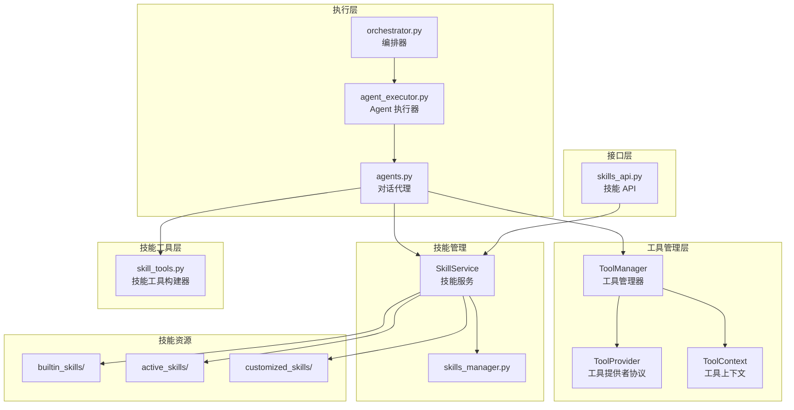
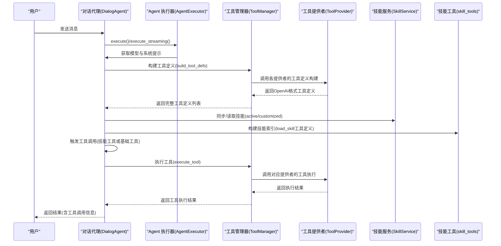
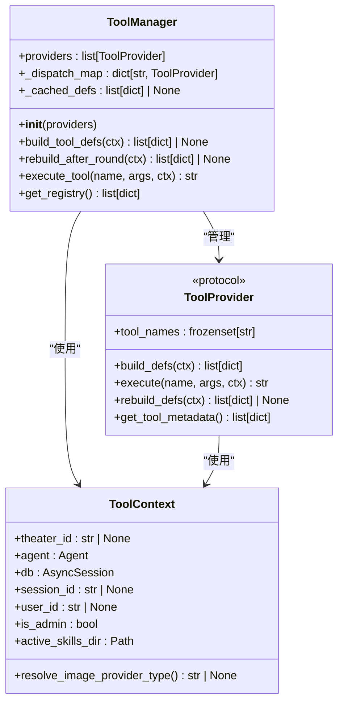
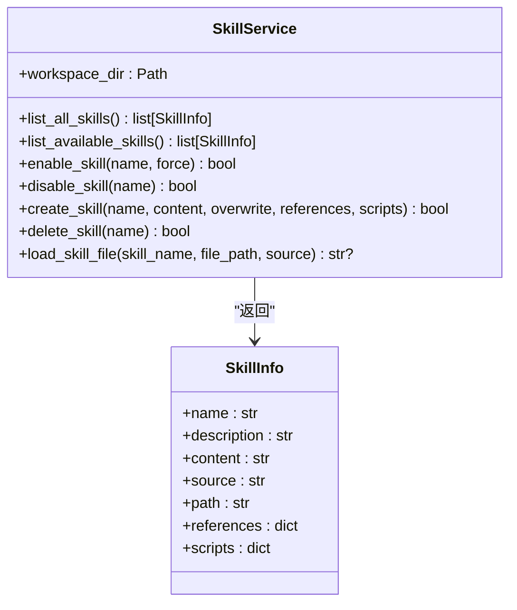
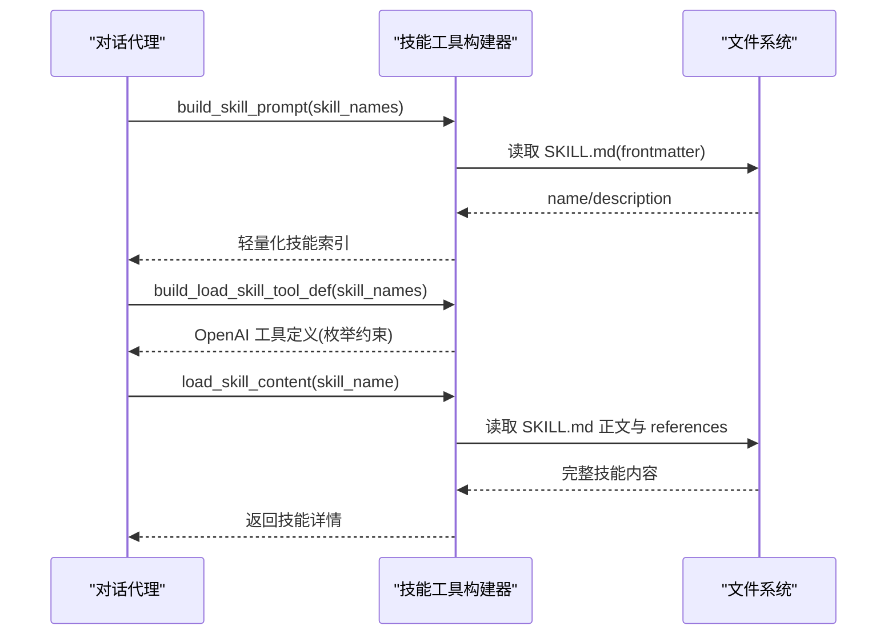
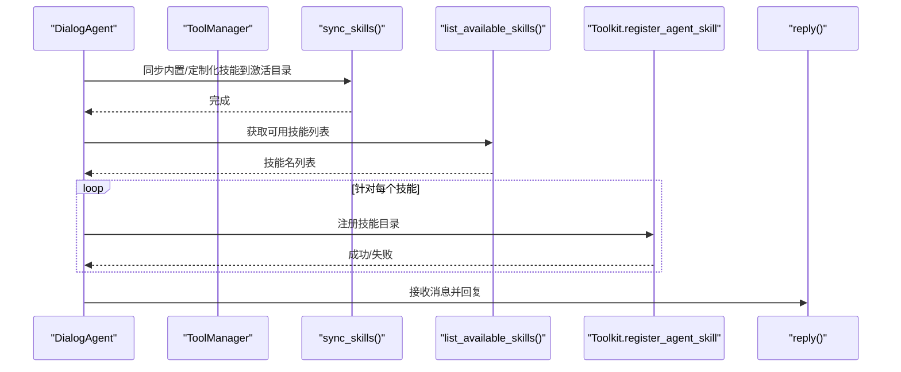
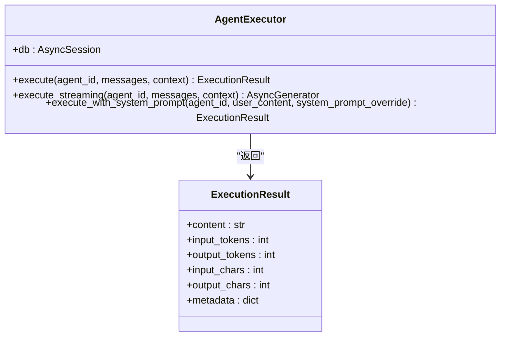
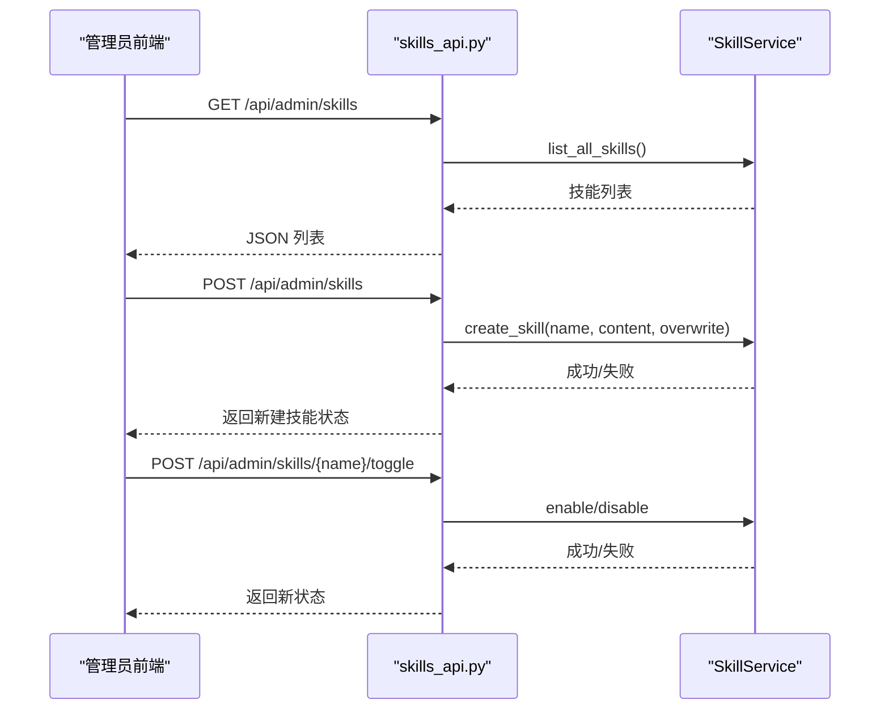
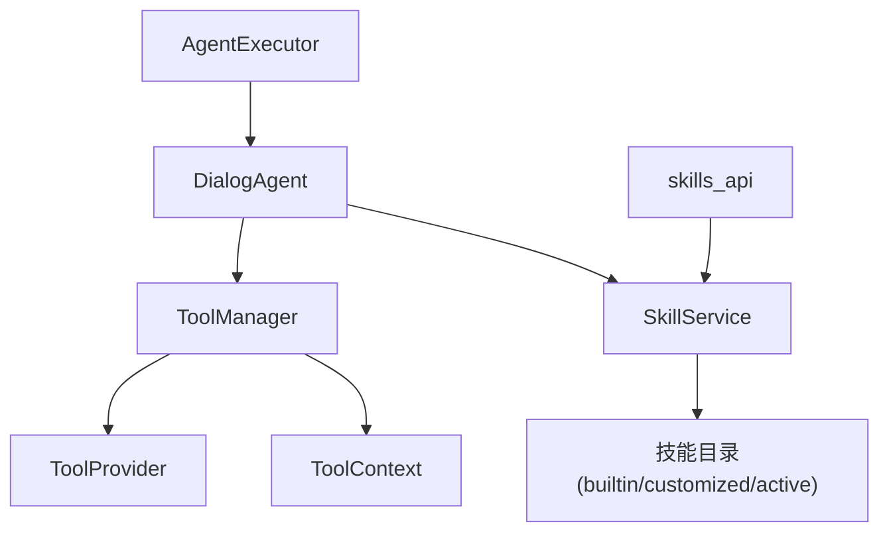

# 技能工具系统

<cite>
**本文档引用的文件**
- [tool_manager/__init__.py](file://backend/services/tool_manager/__init__.py)
- [tool_manager/manager.py](file://backend/services/tool_manager/manager.py)
- [tool_manager/context.py](file://backend/services/tool_manager/context.py)
- [tool_manager/protocol.py](file://backend/services/tool_manager/protocol.py)
- [skill_tools.py](file://backend/services/skill_tools.py)
- [skills_manager.py](file://backend/skills_manager.py)
- [agents.py](file://backend/agents.py)
- [agent_executor.py](file://backend/services/agent_executor.py)
- [skills_api.py](file://backend/routers/skills_api.py)
- [orchestrator.py](file://backend/services/orchestrator.py)
- [file_reader_SKILL.md](file://backend/skills/builtin_skills/file_reader/SKILL.md)
- [file_reader_read.py](file://backend/skills/builtin_skills/file_reader/scripts/read.py)
- [active_file_reader_SKILL.md](file://backend/skills/active_skills/file_reader/SKILL.md)
- [active_file_reader_read.py](file://backend/skills/active_skills/file_reader/scripts/read.py)
</cite>

## 更新摘要
**所做更改**
- 更新了工具管理器架构部分，反映新的 provider-based 架构
- 新增了工具提供者协议和工具管理器的核心组件说明
- 更新了架构图以展示新的工具管理器结构
- 修改了工具注册机制和执行上下文管理的相关内容
- 更新了技能工具与工具管理器的集成方式

## 目录
1. [简介](#简介)
2. [项目结构](#项目结构)
3. [核心组件](#核心组件)
4. [架构总览](#架构总览)
5. [详细组件分析](#详细组件分析)
6. [依赖关系分析](#依赖关系分析)
7. [性能考虑](#性能考虑)
8. [故障排除指南](#故障排除指南)
9. [结论](#结论)
10. [附录](#附录)

## 简介
本文件全面阐述技能工具系统的架构与实现，涵盖新的工具管理器架构、工具注册机制、参数传递与执行上下文管理、基础工具类设计、技能工具生命周期管理以及自定义工具开发示例与最佳实践。系统采用"技能即教程"的理念，通过轻量化的技能索引与按需加载的策略，将技能内容与工具管理解耦，既保证了对话成本可控，又提供了强大的可扩展性。

**更新** 新架构引入了统一的工具管理器，采用 provider-based 架构来管理各种工具类型，包括基础工具、画布工具和图像生成工具等。

## 项目结构
技能工具系统主要由以下模块构成：
- 工具管理器：统一管理所有工具提供者，提供工具注册、发现和调度功能。
- 技能管理服务：负责内置、定制化与激活技能的同步、读取与管理。
- 技能工具构建器：生成技能索引、构建 load_skill 工具定义，以及加载完整技能内容。
- 对话代理执行器：封装对话代理的执行流程，集成工具调用与流式输出。
- 技能 API：提供管理员端的技能 CRUD 与启用/禁用接口。
- 代理层：在对话代理中注册技能，建立工具链路。

**图表来源**
- [tool_manager/manager.py:23-108](file://backend/services/tool_manager/manager.py#L23-L108)
- [tool_manager/protocol.py:11-44](file://backend/services/tool_manager/protocol.py#L11-L44)
- [tool_manager/context.py:23-70](file://backend/services/tool_manager/context.py#L23-L70)
- [skills_manager.py:263-408](file://backend/skills_manager.py#L263-L408)
- [skill_tools.py:1-130](file://backend/services/skill_tools.py#L1-L130)

**章节来源**
- [tool_manager/__init__.py:1-29](file://backend/services/tool_manager/__init__.py#L1-L29)
- [tool_manager/manager.py:1-108](file://backend/services/tool_manager/manager.py#L1-L108)
- [tool_manager/context.py:1-70](file://backend/services/tool_manager/context.py#L1-L70)
- [tool_manager/protocol.py:1-44](file://backend/services/tool_manager/protocol.py#L1-L44)
- [skills_manager.py:1-408](file://backend/skills_manager.py#L1-L408)
- [skill_tools.py:1-130](file://backend/services/skill_tools.py#L1-L130)
- [agents.py:1-200](file://backend/agents.py#L1-L200)
- [agent_executor.py:1-200](file://backend/services/agent_executor.py#L1-L200)
- [skills_api.py:1-207](file://backend/routers/skills_api.py#L1-L207)

## 核心组件
- 工具管理器（ToolManager）：统一协调所有工具提供者，提供工具定义构建、工具执行调度和工具注册功能。
- 工具提供者协议（ToolProvider）：定义工具提供者的标准接口，包括工具名称集合、工具定义构建、工具执行和重建定义等功能。
- 工具上下文（ToolContext）：统一的工具执行上下文，包含剧院ID、代理、数据库会话等信息，支持延迟解析和缓存。
- 技能管理服务（SkillService）：提供技能的读取、创建、删除、启用/禁用与文件加载功能，支持去重与版本比较。
- 技能工具构建器（skill_tools）：构建技能索引提示词、生成 load_skill 工具定义、加载完整技能内容。
- 对话代理（agents.DialogAgent）：在初始化时同步并注册技能，支持 MCP 客户端注册与工具安全防护。
- Agent 执行器（AgentExecutor）：统一执行入口，支持非流式与流式两种模式，自动统计 token 使用。
- 技能 API（skills_api）：提供技能列表、详情、创建、更新、删除与切换状态的管理接口。

**更新** 新增了工具管理器架构的核心组件，替代了原有的分散工具装配方式。

**章节来源**
- [tool_manager/manager.py:23-108](file://backend/services/tool_manager/manager.py#L23-L108)
- [tool_manager/protocol.py:11-44](file://backend/services/tool_manager/protocol.py#L11-L44)
- [tool_manager/context.py:23-70](file://backend/services/tool_manager/context.py#L23-L70)
- [skills_manager.py:263-408](file://backend/skills_manager.py#L263-L408)
- [skill_tools.py:1-130](file://backend/services/skill_tools.py#L1-L130)
- [agents.py:85-113](file://backend/agents.py#L85-L113)
- [agent_executor.py:63-200](file://backend/services/agent_executor.py#L63-L200)
- [skills_api.py:123-207](file://backend/routers/skills_api.py#L123-L207)

## 架构总览
系统采用"技能即教程"的设计思想：系统提示词仅包含轻量技能索引；通过 load_skill 元工具按需加载完整技能说明；工具管理器统一管理各种工具提供者，包括基础工具、画布工具和图像生成工具等。代理在运行时注册激活的技能和工具，LLM 在需要时触发工具调用，形成"技能指导 + 工具执行"的协作模式。

**更新** 新架构引入了统一的工具管理器，采用 provider-based 架构来管理各种工具类型。

**图表来源**
- [agents.py:85-113](file://backend/agents.py#L85-L113)
- [agent_executor.py:74-200](file://backend/services/agent_executor.py#L74-L200)
- [tool_manager/manager.py:42-91](file://backend/services/tool_manager/manager.py#L42-L91)
- [tool_manager/protocol.py:20-29](file://backend/services/tool_manager/protocol.py#L20-L29)
- [skills_manager.py:263-408](file://backend/skills_manager.py#L263-L408)
- [skill_tools.py:103-130](file://backend/services/skill_tools.py#L103-L130)

## 详细组件分析

### 工具管理器（ToolManager）
- 职责：统一协调所有工具提供者，提供工具定义构建、工具执行调度和工具注册功能。
- 关键方法：
  - build_tool_defs：构建适用于当前上下文的所有工具定义。
  - rebuild_after_round：在工具执行轮次后重建工具定义。
  - execute_tool：通过名称调度工具执行（O(1)查找）。
  - get_registry：返回提供者和工具元数据供管理员注册API使用。
- 设计要点：使用分发映射表实现快速工具查找，支持缓存机制和增量重建。

**更新** 新架构的核心组件，替代了原有的分散工具装配方式。

**图表来源**
- [tool_manager/manager.py:23-108](file://backend/services/tool_manager/manager.py#L23-L108)
- [tool_manager/protocol.py:11-44](file://backend/services/tool_manager/protocol.py#L11-L44)
- [tool_manager/context.py:23-70](file://backend/services/tool_manager/context.py#L23-L70)

**章节来源**
- [tool_manager/manager.py:1-108](file://backend/services/tool_manager/manager.py#L1-L108)

### 工具提供者协议（ToolProvider）
- 职责：定义工具提供者的标准接口，确保不同类型的工具提供者具有统一的行为规范。
- 关键属性：
  - tool_names：该提供者处理的工具名称集合（用于分发路由）。
- 关键方法：
  - build_defs：返回当前上下文的OpenAI格式工具定义。
  - execute：执行指定名称的工具并返回结果字符串。
  - rebuild_defs：在工具轮次后重建定义（如需要）。
  - get_tool_metadata：返回简化元数据供管理员注册显示。
- 设计要点：使用运行时协议检查，支持静态类型检查和运行时验证。

**更新** 新增的标准接口定义，确保工具提供者的可插拔性和一致性。

**章节来源**
- [tool_manager/protocol.py:1-44](file://backend/services/tool_manager/protocol.py#L1-L44)

### 工具上下文（ToolContext）
- 职责：统一的工具执行上下文，包含剧院ID、代理、数据库会话等信息。
- 关键属性：
  - theater_id、agent、db：基本执行环境信息。
  - session_id、user_id、is_admin：日志溯源字段。
- 关键方法：
  - active_skills_dir：延迟解析活跃技能目录。
  - resolve_image_provider_type：从数据库解析图像提供者类型（带缓存）。
- 设计要点：使用延迟解析和缓存机制，避免重复计算和导入。

**更新** 替代了原有的分散参数传递方式，统一了工具执行的上下文信息。

**章节来源**
- [tool_manager/context.py:1-70](file://backend/services/tool_manager/context.py#L1-L70)

### 技能管理服务（SkillService）
- 职责：管理内置、定制化与激活技能的全生命周期，提供技能树构建、差异检测与同步策略。
- 关键方法：
  - list_all_skills / list_available_skills：读取技能清单并去重（定制化优先于内置）。
  - enable_skill / disable_skill：将技能同步到 active_skills 或移除。
  - create_skill / delete_skill：在 customized_skills 中创建或删除技能，内置技能不可删除。
  - load_skill_file：安全加载技能内的 references/scripts 文件，防止路径穿越。
- 设计要点：使用 frontmatter 解析 SKILL.md，支持 metadata 版本字段；提供树形结构创建与递归复制能力。

**更新** 保持原有功能不变，但与新的工具管理器架构集成。

**图表来源**
- [skills_manager.py:19-37](file://backend/skills_manager.py#L19-L37)
- [skills_manager.py:263-408](file://backend/skills_manager.py#L263-L408)

**章节来源**
- [skills_manager.py:1-408](file://backend/skills_manager.py#L1-L408)

### 技能工具构建器（skill_tools）
- 职责：构建技能索引提示词、生成 load_skill 工具定义、加载完整技能内容。
- 技能索引：仅包含技能名与简要描述，不包含正文，降低对话成本。
- load_skill 工具：枚举约束为当前代理可用的技能名，要求先加载再执行。
- 内容加载：读取 SKILL.md 正文与 references 目录，拼接引用清单。

**更新** 保持原有功能不变，但与新的工具管理器架构集成。

**图表来源**
- [skill_tools.py:36-142](file://backend/services/skill_tools.py#L36-L142)

**章节来源**
- [skill_tools.py:1-130](file://backend/services/skill_tools.py#L1-L130)

### 对话代理与工具注册（agents.DialogAgent）
- 职责：在初始化阶段同步技能并注册到 Toolkit；支持 MCP 客户端动态注册；集成工具安全防护与内存压缩钩子。
- 技能注册：根据传入的技能名列表或全部激活技能进行注册；调用 Toolkit 的注册方法。
- 执行流程：格式化消息、调用模型、收集响应、统计 token 与字符数。

**更新** 与新的工具管理器架构集成，通过 ToolManager 统一管理工具注册。

**图表来源**
- [agents.py:85-113](file://backend/agents.py#L85-L113)

**章节来源**
- [agents.py:1-200](file://backend/agents.py#L1-L200)

### Agent 执行器（AgentExecutor）
- 职责：统一代理执行入口，支持非流式与流式两种模式；自动缓存模型与代理实例；提取 token 使用统计。
- 非流式执行：封装 DialogAgent.reply，返回标准化结果对象。
- 流式执行：直接调用流式接口，逐块产出并返回实时结果。
- 上下文注入：在元数据中携带 agent_id、agent_name、model 与外部 context。

**更新** 保持原有功能不变，但与新的工具管理器架构集成。

**图表来源**
- [agent_executor.py:32-200](file://backend/services/agent_executor.py#L32-L200)

**章节来源**
- [agent_executor.py:1-200](file://backend/services/agent_executor.py#L1-L200)

### 技能 API（skills_api）
- 职责：提供管理员端技能管理接口，包括列表、详情、创建、更新、删除与切换状态。
- 数据模型：SkillInfoResponse、SkillDetailResponse、CreateSkillRequest、UpdateSkillRequest。
- 安全与版本：通过 frontmatter 提取版本信息；禁止删除内置技能；支持自动启用新创建的技能。

**更新** 保持原有功能不变，但与新的工具管理器架构集成。

**图表来源**
- [skills_api.py:123-207](file://backend/routers/skills_api.py#L123-L207)
- [skills_manager.py:263-408](file://backend/skills_manager.py#L263-L408)

**章节来源**
- [skills_api.py:1-207](file://backend/routers/skills_api.py#L1-L207)

### 技能资源与脚本
- 技能目录结构：每个技能包含 SKILL.md（frontmatter + 正文）与可选的 references 与 scripts 子目录。
- 示例：file_reader 技能展示了如何使用基础工具读取文件与列举目录，以及大文件处理策略。

**更新** 保持原有功能不变，但与新的工具管理器架构集成。

**章节来源**
- [file_reader_SKILL.md:1-48](file://backend/skills/builtin_skills/file_reader/SKILL.md#L1-L48)
- [file_reader_read.py:1-21](file://backend/skills/builtin_skills/file_reader/scripts/read.py#L1-L21)
- [active_file_reader_SKILL.md:1-48](file://backend/skills/active_skills/file_reader/SKILL.md#L1-L48)
- [active_file_reader_read.py:1-21](file://backend/skills/active_skills/file_reader/scripts/read.py#L1-L21)

## 依赖关系分析
- 组件耦合：
  - ToolManager 与 ToolProvider 强耦合，负责工具的统一管理和调度。
  - ToolContext 为所有工具提供统一的执行上下文。
  - SkillService 与技能目录（builtin/customized/active）强耦合，负责同步与读取。
  - DialogAgent 依赖 ToolManager 进行工具注册，依赖 SkillService 进行技能同步与注册。
  - AgentExecutor 依赖 DialogAgent 与模型提供者，负责执行与统计。
  - skills_api 依赖 SkillService 与 FastAPI 路由器，提供管理接口。
- 外部依赖：
  - frontmatter：用于解析 SKILL.md 的 frontmatter。
  - agentscope：工具包与对话代理框架。
  - FastAPI：技能 API 的路由与依赖注入。

**更新** 新增了工具管理器架构的依赖关系，替代了原有的分散依赖。

**图表来源**
- [tool_manager/manager.py:26-36](file://backend/services/tool_manager/manager.py#L26-L36)
- [tool_manager/context.py:27-39](file://backend/services/tool_manager/context.py#L27-L39)
- [skills_manager.py:263-408](file://backend/skills_manager.py#L263-L408)
- [agents.py:85-113](file://backend/agents.py#L85-L113)
- [agent_executor.py:63-200](file://backend/services/agent_executor.py#L63-L200)
- [skills_api.py:123-207](file://backend/routers/skills_api.py#L123-L207)

**章节来源**
- [tool_manager/manager.py:1-108](file://backend/services/tool_manager/manager.py#L1-L108)
- [tool_manager/context.py:1-70](file://backend/services/tool_manager/context.py#L1-L70)
- [skills_manager.py:1-408](file://backend/skills_manager.py#L1-L408)
- [agents.py:1-200](file://backend/agents.py#L1-L200)
- [agent_executor.py:1-200](file://backend/services/agent_executor.py#L1-L200)
- [skills_api.py:1-207](file://backend/routers/skills_api.py#L1-L207)

## 性能考虑
- 工具定义缓存：ToolManager 使用缓存机制存储工具定义，避免重复构建。
- 增量重建：支持在工具执行轮次后增量重建定义，只更新发生变化的部分。
- O(1) 查找：使用分发映射表实现快速工具查找，提高执行效率。
- 技能索引延迟加载：系统提示词仅包含轻量索引，完整技能内容按需加载，避免不必要的 token 消耗。
- 基础工具限流：文件读取与目录列举设置行数、字节数与条目上限，防止大文件与深目录带来的性能问题。
- 缓存与复用：AgentExecutor 缓存模型与代理实例，减少重复初始化开销。
- 流式输出：流式执行模式提供实时反馈，降低等待时间。

**更新** 新增了工具管理器架构的性能优化特性。

## 故障排除指南
- 工具名称冲突：ToolManager 在初始化时会检查重复的工具名称，防止冲突发生。
- 工具提供者缺失：execute_tool 方法会返回"未知工具"错误，检查工具提供者是否正确注册。
- 路径穿越错误：当路径包含 ".." 时，基础工具会拒绝执行并返回错误信息。请检查传入的文件路径是否合法。
- 技能未找到：若 load_skill 无法定位 SKILL.md，将返回"技能未找到"提示。请确认技能名称与激活状态。
- 权限与删除限制：内置技能不可删除，尝试删除将返回 403 错误。请在 customized_skills 中进行修改。
- 工具调用失败：检查工具参数是否符合 OpenAI 工具定义的 required 字段；确保路径存在且可访问。

**更新** 新增了工具管理器架构相关的故障排除指南。

**章节来源**
- [tool_manager/manager.py:87-91](file://backend/services/tool_manager/manager.py#L87-L91)
- [tool_manager/manager.py:34-36](file://backend/services/tool_manager/manager.py#L34-L36)
- [base_tools.py:25-130](file://backend/services/base_tools.py#L25-L130)
- [skill_tools.py:72-107](file://backend/services/skill_tools.py#L72-L107)
- [skills_api.py:172-187](file://backend/routers/skills_api.py#L172-L187)

## 结论
技能工具系统通过"技能即教程"的设计，结合新的工具管理器架构，实现了技能与工具的解耦与按需加载，既保证了对话成本可控，又提供了强大的可扩展性。ToolManager 提供统一的工具管理，ToolProvider 定义标准接口，ToolContext 提供统一上下文，SkillService 提供完善的生命周期管理，DialogAgent 与 AgentExecutor 将技能注册与执行流程标准化，skills_api 为管理员提供了便捷的管理界面。整体架构清晰、职责明确，适合进一步扩展与维护。

**更新** 新架构通过统一的工具管理器和标准化的工具提供者协议，提供了更好的可扩展性和维护性。

## 附录

### 工具管理器架构生命周期管理
- 初始化：ToolManager 在构造时注册所有工具提供者，构建分发映射表。
- 工具定义构建：build_tool_defs 收集所有提供者的工具定义，支持缓存。
- 工具执行：execute_tool 通过分发映射表快速查找并执行工具。
- 增量重建：rebuild_after_round 在工具执行轮次后重建变化的定义。
- 注册查询：get_registry 提供管理员所需的工具元数据。

**更新** 新增了工具管理器架构的生命周期管理流程。

**章节来源**
- [tool_manager/manager.py:26-108](file://backend/services/tool_manager/manager.py#L26-L108)

### 工具提供者协议设计规范
- 接口规范：统一的 ToolProvider 协议定义，确保不同工具提供者的一致性。
- 工具名称集合：tool_names 属性用于分发路由，避免重复命名。
- 异步接口：所有工具定义构建和执行都支持异步操作。
- 元数据支持：get_tool_metadata 提供管理员注册显示所需的信息。
- 可选重建：rebuild_defs 支持工具定义的增量重建。

**更新** 新增了工具提供者协议的设计规范。

**章节来源**
- [tool_manager/protocol.py:11-44](file://backend/services/tool_manager/protocol.py#L11-L44)

### 工具开发示例
- 自定义工具提供者创建：
  - 实现 ToolProvider 协议，定义 tool_names、build_defs、execute、rebuild_defs 和 get_tool_metadata 方法。
  - 在工具管理器中注册新的工具提供者。
  - 使用 ToolContext 获取执行所需的上下文信息。
- 自定义技能创建：
  - 使用 skills_api 的 POST /api/admin/skills 创建技能，填写 name、description、version 与 content。
  - 可选择自动启用，系统将同步到 active_skills 并在代理中注册。
- 参数配置：
  - SKILL.md 使用 frontmatter 定义 name、description 与 metadata（如版本号）。
  - references 与 scripts 目录用于存放辅助文件与脚本。
- 集成测试：
  - 在代理中启用目标技能后，通过对话触发 load_skill 与基础工具调用，观察输出与 token 使用情况。

**更新** 新增了工具提供者开发的示例。

**章节来源**
- [tool_manager/protocol.py:11-44](file://backend/services/tool_manager/protocol.py#L11-L44)
- [skills_api.py:140-170](file://backend/routers/skills_api.py#L140-L170)
- [skills_manager.py:304-367](file://backend/skills_manager.py#L304-L367)
- [file_reader_SKILL.md:1-48](file://backend/skills/builtin_skills/file_reader/SKILL.md#L1-L48)

### 工具扩展指南与最佳实践
- 新增工具提供者：
  - 实现 ToolProvider 协议，确保 tool_names 不与其他提供者冲突。
  - 在 build_defs 中返回 OpenAI 格式的工具定义，支持条件启用。
  - 在 execute 中实现具体的工具逻辑，返回字符串结果。
  - 实现 rebuild_defs 进行增量重建，提高性能。
- 新增技能：
  - 在 customized_skills 下创建新目录，编写 SKILL.md 并按需添加 references/scripts。
  - 通过 skills_api 或手动同步到 active_skills，确保名称唯一且 frontmatter 完备。
- 安全与合规：
  - 严格限制路径与命令范围，避免执行高风险操作。
  - 对外暴露的 API 应进行权限校验与审计日志记录。
  - 工具提供者应验证输入参数，防止注入攻击。
- 性能优化：
  - 合理设置文件读取的行数与字节上限，必要时使用分段读取。
  - 利用 ToolManager 的缓存机制，避免重复构建工具定义。
  - 使用增量重建功能，只更新发生变化的工具定义。
  - 利用流式执行提升用户体验，减少等待时间。

**更新** 新增了工具提供者开发的最佳实践指南。

**章节来源**
- [tool_manager/protocol.py:11-44](file://backend/services/tool_manager/protocol.py#L11-L44)
- [tool_manager/manager.py:67-81](file://backend/services/tool_manager/manager.py#L67-L81)
- [skills_manager.py:304-367](file://backend/skills_manager.py#L304-L367)
- [skills_api.py:123-207](file://backend/routers/skills_api.py#L123-L207)