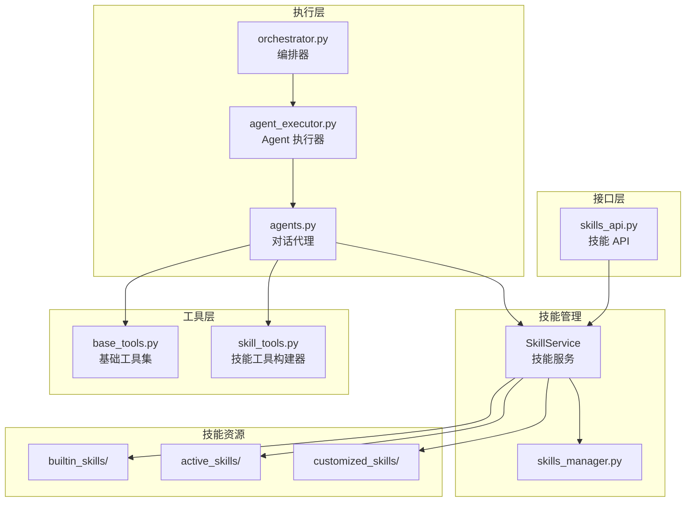
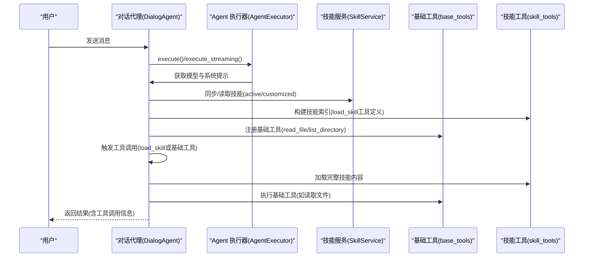
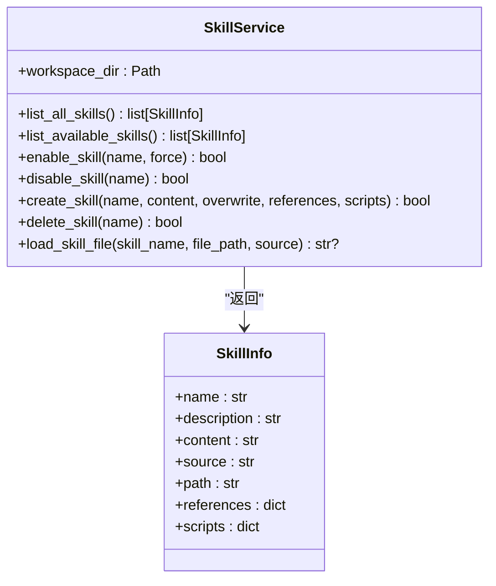
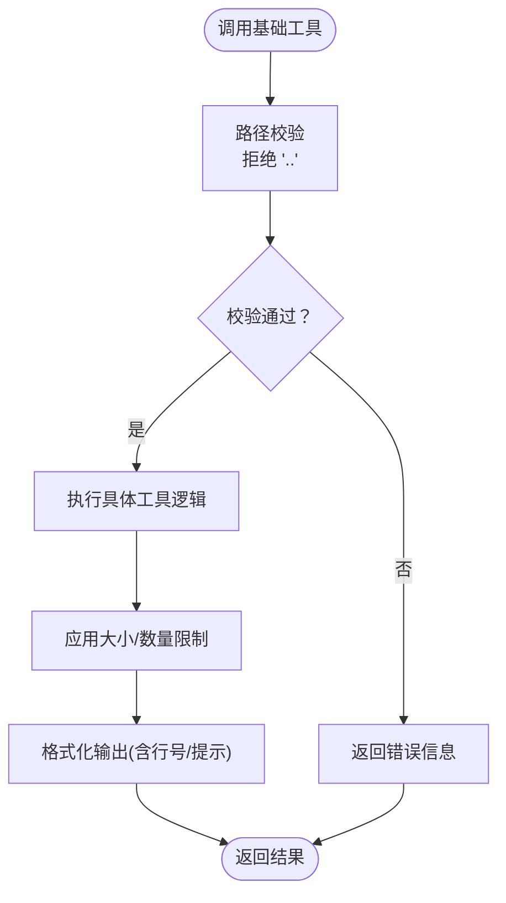
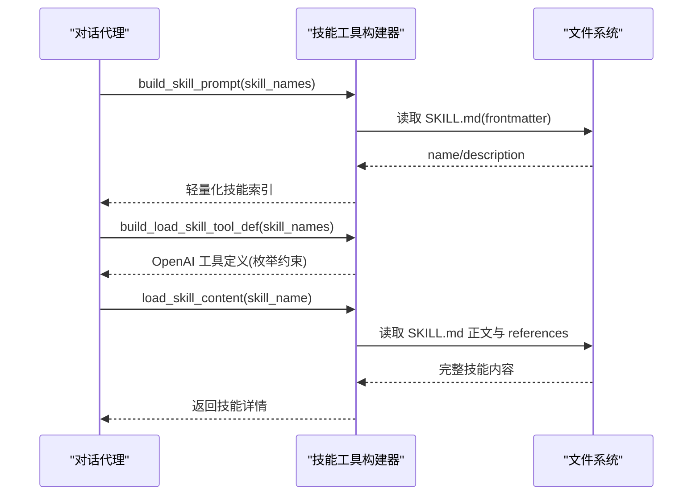
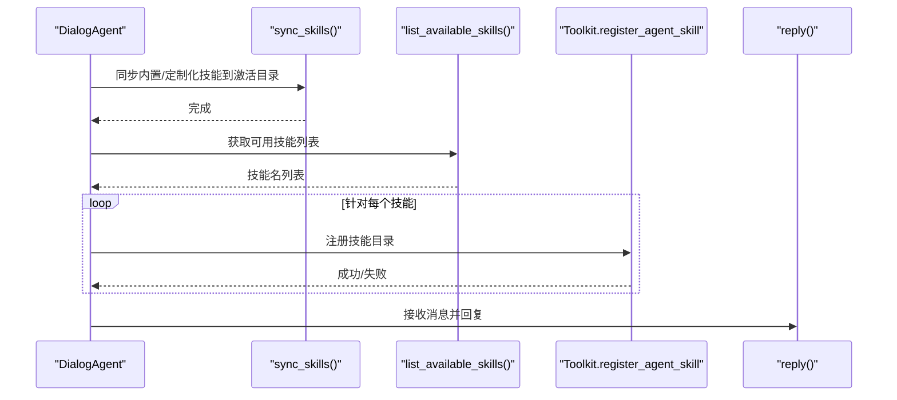
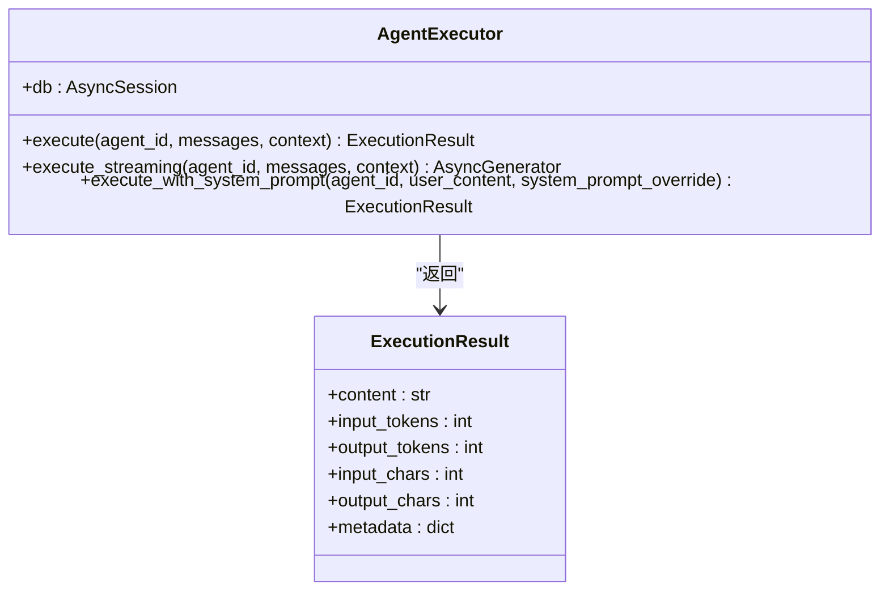
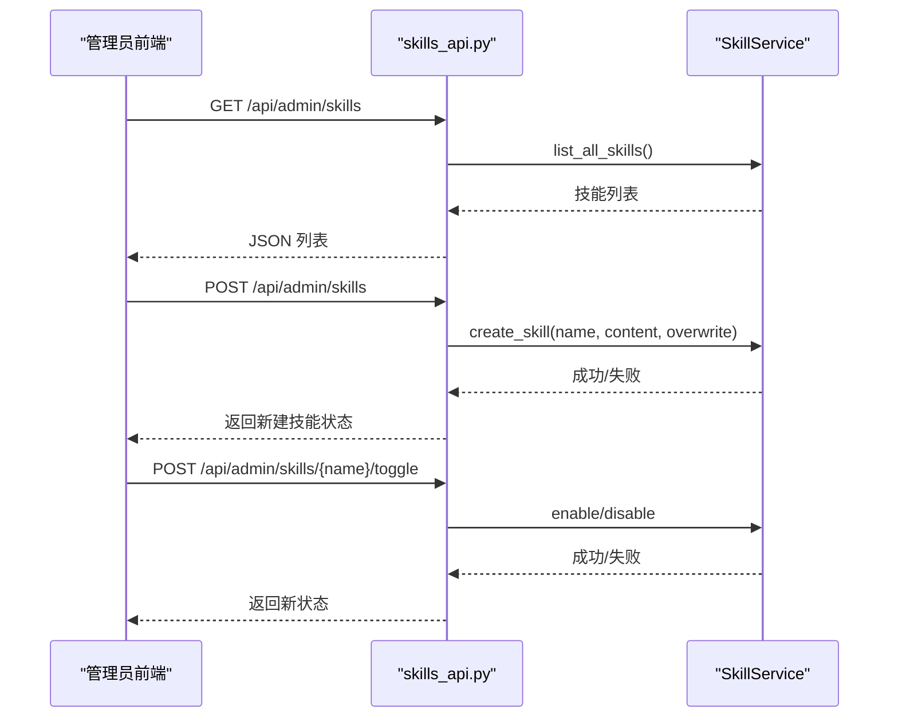
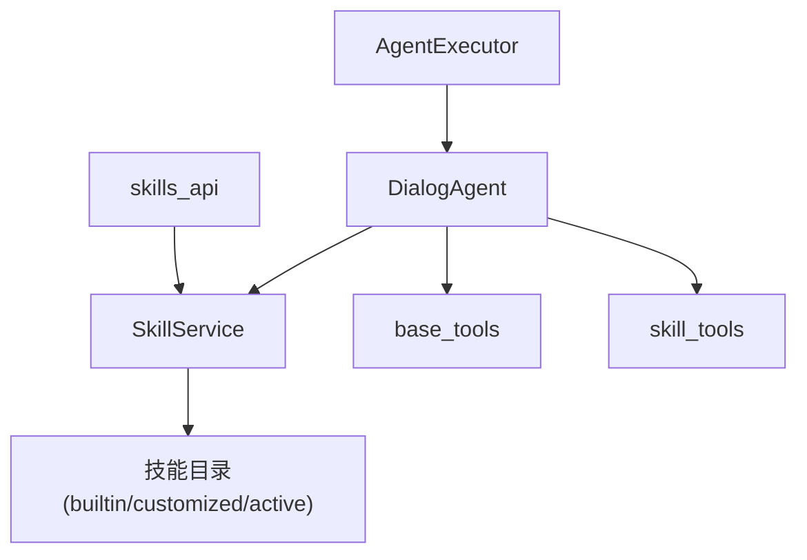

# 技能工具系统

<cite>
**本文档引用的文件**
- [skill_tools.py](file://backend/services/skill_tools.py)
- [base_tools.py](file://backend/services/base_tools.py)
- [skills_manager.py](file://backend/skills_manager.py)
- [agents.py](file://backend/agents.py)
- [agent_executor.py](file://backend/services/agent_executor.py)
- [skills_api.py](file://backend/routers/skills_api.py)
- [orchestrator.py](file://backend/services/orchestrator.py)
- [file_reader_SKILL.md](file://backend/skills/builtin_skills/file_reader/SKILL.md)
- [file_reader_read.py](file://backend/skills/builtin_skills/file_reader/scripts/read.py)
- [active_file_reader_SKILL.md](file://backend/skills/active_skills/file_reader/SKILL.md)
- [active_file_reader_read.py](file://backend/skills/active_skills/file_reader/scripts/read.py)
</cite>

## 目录
1. [简介](#简介)
2. [项目结构](#项目结构)
3. [核心组件](#核心组件)
4. [架构总览](#架构总览)
5. [详细组件分析](#详细组件分析)
6. [依赖关系分析](#依赖关系分析)
7. [性能考虑](#性能考虑)
8. [故障排除指南](#故障排除指南)
9. [结论](#结论)
10. [附录](#附录)

## 简介
本文件全面阐述技能工具系统的架构与实现，涵盖工具注册机制、参数传递与执行上下文管理、基础工具类设计、技能工具生命周期管理以及自定义工具开发示例与最佳实践。系统采用“技能即教程”的理念，通过轻量化的技能索引与按需加载的策略，将技能内容与基础工具解耦，既保证了对话成本可控，又提供了强大的可扩展性。

## 项目结构
技能工具系统主要由以下模块构成：
- 技能管理服务：负责内置、定制化与激活技能的同步、读取与管理。
- 基础工具集：提供文件读取、目录列举等基础能力，并以统一的工具定义格式暴露给 LLM。
- 技能工具构建器：生成技能索引、构建 load_skill 工具定义，以及加载完整技能内容。
- 代理执行器：封装对话代理的执行流程，集成工具调用与流式输出。
- 技能 API：提供管理员端的技能 CRUD 与启用/禁用接口。
- 代理层：在对话代理中注册技能，建立工具链路。

图表来源
- [skills_manager.py:263-408](file://backend/skills_manager.py#L263-L408)
- [base_tools.py:173-270](file://backend/services/base_tools.py#L173-L270)
- [skill_tools.py:36-142](file://backend/services/skill_tools.py#L36-L142)
- [agents.py:85-113](file://backend/agents.py#L85-L113)
- [agent_executor.py:63-200](file://backend/services/agent_executor.py#L63-L200)
- [skills_api.py:123-207](file://backend/routers/skills_api.py#L123-L207)

章节来源
- [skills_manager.py:1-408](file://backend/skills_manager.py#L1-L408)
- [base_tools.py:1-270](file://backend/services/base_tools.py#L1-L270)
- [skill_tools.py:1-142](file://backend/services/skill_tools.py#L1-L142)
- [agents.py:1-200](file://backend/agents.py#L1-L200)
- [agent_executor.py:1-200](file://backend/services/agent_executor.py#L1-L200)
- [skills_api.py:1-207](file://backend/routers/skills_api.py#L1-L207)

## 核心组件
- 技能管理服务（SkillService）：提供技能的读取、创建、删除、启用/禁用与文件加载功能，支持去重与版本比较。
- 基础工具集（base_tools）：提供 read_file、list_directory、execute_shell_command 等工具，具备路径校验、大小限制与分页显示能力。
- 技能工具构建器（skill_tools）：构建技能索引提示词、生成 load_skill 工具定义、加载完整技能内容。
- 对话代理（agents.DialogAgent）：在初始化时同步并注册技能，支持 MCP 客户端注册与工具安全防护。
- Agent 执行器（AgentExecutor）：统一执行入口，支持非流式与流式两种模式，自动统计 token 使用。
- 技能 API（skills_api）：提供技能列表、详情、创建、更新、删除与切换状态的管理接口。

章节来源
- [skills_manager.py:263-408](file://backend/skills_manager.py#L263-L408)
- [base_tools.py:173-270](file://backend/services/base_tools.py#L173-L270)
- [skill_tools.py:36-142](file://backend/services/skill_tools.py#L36-L142)
- [agents.py:85-113](file://backend/agents.py#L85-L113)
- [agent_executor.py:63-200](file://backend/services/agent_executor.py#L63-L200)
- [skills_api.py:123-207](file://backend/routers/skills_api.py#L123-L207)

## 架构总览
系统采用“技能即教程”的设计思想：系统提示词仅包含轻量技能索引；通过 load_skill 元工具按需加载完整技能说明；基础工具（read_file、list_directory）作为通用能力被技能调用。代理在运行时注册激活的技能，LLM 在需要时触发工具调用，形成“技能指导 + 基础工具执行”的协作模式。

图表来源
- [agents.py:85-113](file://backend/agents.py#L85-L113)
- [agent_executor.py:74-200](file://backend/services/agent_executor.py#L74-L200)
- [skills_manager.py:263-408](file://backend/skills_manager.py#L263-L408)
- [base_tools.py:173-270](file://backend/services/base_tools.py#L173-L270)
- [skill_tools.py:36-142](file://backend/services/skill_tools.py#L36-L142)

## 详细组件分析

### 技能管理服务（SkillService）
- 职责：管理内置、定制化与激活技能的全生命周期，提供技能树构建、差异检测与同步策略。
- 关键方法：
  - list_all_skills / list_available_skills：读取技能清单并去重（定制化优先于内置）。
  - enable_skill / disable_skill：将技能同步到 active_skills 或移除。
  - create_skill / delete_skill：在 customized_skills 中创建或删除技能，内置技能不可删除。
  - load_skill_file：安全加载技能内的 references/scripts 文件，防止路径穿越。
- 设计要点：使用 frontmatter 解析 SKILL.md，支持 metadata 版本字段；提供树形结构创建与递归复制能力。

图表来源
- [skills_manager.py:19-37](file://backend/skills_manager.py#L19-L37)
- [skills_manager.py:263-408](file://backend/skills_manager.py#L263-L408)

章节来源
- [skills_manager.py:1-408](file://backend/skills_manager.py#L1-L408)

### 基础工具集（base_tools）
- 职责：提供文件读取、目录列举与 Shell 命令执行等基础能力，统一以 OpenAI 工具定义格式暴露。
- 参数验证与安全：
  - 路径校验：拒绝包含 “..” 的路径段，防止路径穿越。
  - 大小限制：行数上限、字节上限、目录条目上限，避免资源滥用。
- 工具定义：以 OpenAI function 工具格式返回，便于 LLM 注册与调用。
- 分发器：基于名称映射到具体执行函数，避免 if-else 分支。

图表来源
- [base_tools.py:25-130](file://backend/services/base_tools.py#L25-L130)
- [base_tools.py:173-270](file://backend/services/base_tools.py#L173-L270)

章节来源
- [base_tools.py:1-270](file://backend/services/base_tools.py#L1-L270)

### 技能工具构建器（skill_tools）
- 职责：构建技能索引提示词、生成 load_skill 工具定义、加载完整技能内容。
- 技能索引：仅包含技能名与简要描述，不包含正文，降低对话成本。
- load_skill 工具：枚举约束为当前代理可用的技能名，要求先加载再执行。
- 内容加载：读取 SKILL.md 正文与 references 目录，拼接引用清单。

图表来源
- [skill_tools.py:36-142](file://backend/services/skill_tools.py#L36-L142)

章节来源
- [skill_tools.py:1-142](file://backend/services/skill_tools.py#L1-L142)

### 对话代理与工具注册（agents.DialogAgent）
- 职责：在初始化阶段同步技能并注册到 Toolkit；支持 MCP 客户端动态注册；集成工具安全防护与内存压缩钩子。
- 技能注册：根据传入的技能名列表或全部激活技能进行注册；调用 Toolkit 的注册方法。
- 执行流程：格式化消息、调用模型、收集响应、统计 token 与字符数。

图表来源
- [agents.py:85-113](file://backend/agents.py#L85-L113)

章节来源
- [agents.py:1-200](file://backend/agents.py#L1-L200)

### Agent 执行器（AgentExecutor）
- 职责：统一代理执行入口，支持非流式与流式两种模式；自动缓存模型与代理实例；提取 token 使用统计。
- 非流式执行：封装 DialogAgent.reply，返回标准化结果对象。
- 流式执行：直接调用流式接口，逐块产出并返回实时结果。
- 上下文注入：在元数据中携带 agent_id、agent_name、model 与外部 context。

图表来源
- [agent_executor.py:32-200](file://backend/services/agent_executor.py#L32-L200)

章节来源
- [agent_executor.py:1-200](file://backend/services/agent_executor.py#L1-L200)

### 技能 API（skills_api）
- 职责：提供管理员端技能管理接口，包括列表、详情、创建、更新、删除与切换状态。
- 数据模型：SkillInfoResponse、SkillDetailResponse、CreateSkillRequest、UpdateSkillRequest。
- 安全与版本：通过 frontmatter 提取版本信息；禁止删除内置技能；支持自动启用新创建的技能。

图表来源
- [skills_api.py:123-207](file://backend/routers/skills_api.py#L123-L207)
- [skills_manager.py:263-408](file://backend/skills_manager.py#L263-L408)

章节来源
- [skills_api.py:1-207](file://backend/routers/skills_api.py#L1-L207)

### 技能资源与脚本
- 技能目录结构：每个技能包含 SKILL.md（frontmatter + 正文）与可选的 references 与 scripts 子目录。
- 示例：file_reader 技能展示了如何使用基础工具读取文件与列举目录，以及大文件处理策略。

章节来源
- [file_reader_SKILL.md:1-48](file://backend/skills/builtin_skills/file_reader/SKILL.md#L1-L48)
- [file_reader_read.py:1-21](file://backend/skills/builtin_skills/file_reader/scripts/read.py#L1-L21)
- [active_file_reader_SKILL.md:1-48](file://backend/skills/active_skills/file_reader/SKILL.md#L1-L48)
- [active_file_reader_read.py:1-21](file://backend/skills/active_skills/file_reader/scripts/read.py#L1-L21)

## 依赖关系分析
- 组件耦合：
  - SkillService 与技能目录（builtin/customized/active）强耦合，负责同步与读取。
  - DialogAgent 依赖 SkillService 进行技能同步与注册，同时依赖 base_tools 与 skill_tools 构建工具链。
  - AgentExecutor 依赖 DialogAgent 与模型提供者，负责执行与统计。
  - skills_api 依赖 SkillService 与 FastAPI 路由器，提供管理接口。
- 外部依赖：
  - frontmatter：用于解析 SKILL.md 的 frontmatter。
  - agentscope：工具包与对话代理框架。
  - FastAPI：技能 API 的路由与依赖注入。

图表来源
- [skills_manager.py:263-408](file://backend/skills_manager.py#L263-L408)
- [agents.py:85-113](file://backend/agents.py#L85-L113)
- [base_tools.py:173-270](file://backend/services/base_tools.py#L173-L270)
- [skill_tools.py:36-142](file://backend/services/skill_tools.py#L36-L142)
- [agent_executor.py:63-200](file://backend/services/agent_executor.py#L63-L200)
- [skills_api.py:123-207](file://backend/routers/skills_api.py#L123-L207)

章节来源
- [skills_manager.py:1-408](file://backend/skills_manager.py#L1-L408)
- [agents.py:1-200](file://backend/agents.py#L1-L200)
- [agent_executor.py:1-200](file://backend/services/agent_executor.py#L1-L200)
- [skills_api.py:1-207](file://backend/routers/skills_api.py#L1-L207)

## 性能考虑
- 技能索引延迟加载：系统提示词仅包含轻量索引，完整技能内容按需加载，避免不必要的 token 消耗。
- 基础工具限流：文件读取与目录列举设置行数、字节数与条目上限，防止大文件与深目录带来的性能问题。
- 缓存与复用：AgentExecutor 缓存模型与代理实例，减少重复初始化开销。
- 流式输出：流式执行模式提供实时反馈，降低等待时间。

## 故障排除指南
- 路径穿越错误：当路径包含 “..” 时，基础工具会拒绝执行并返回错误信息。请检查传入的文件路径是否合法。
- 技能未找到：若 load_skill 无法定位 SKILL.md，将返回“技能未找到”提示。请确认技能名称与激活状态。
- 权限与删除限制：内置技能不可删除，尝试删除将返回 403 错误。请在 customized_skills 中进行修改。
- 工具调用失败：检查工具参数是否符合 OpenAI 工具定义的 required 字段；确保路径存在且可访问。

章节来源
- [base_tools.py:25-130](file://backend/services/base_tools.py#L25-L130)
- [skill_tools.py:72-107](file://backend/services/skill_tools.py#L72-L107)
- [skills_api.py:172-187](file://backend/routers/skills_api.py#L172-L187)

## 结论
技能工具系统通过“技能即教程”的设计，实现了技能与基础工具的解耦与按需加载，既保证了对话成本可控，又提供了强大的可扩展性。SkillService 提供完善的生命周期管理，DialogAgent 与 AgentExecutor 将技能注册与执行流程标准化，skills_api 为管理员提供了便捷的管理界面。整体架构清晰、职责明确，适合进一步扩展与维护。

## 附录

### 技能工具生命周期管理
- 加载：启动时同步内置与定制化技能到激活目录，读取可用技能列表并注册到 Toolkit。
- 初始化：构建技能索引与 load_skill 工具定义，准备基础工具注册。
- 执行：在对话过程中按需触发工具调用，先加载技能再执行基础工具。
- 销毁：禁用技能时从激活目录移除，释放资源。

章节来源
- [skills_manager.py:180-257](file://backend/skills_manager.py#L180-L257)
- [agents.py:85-113](file://backend/agents.py#L85-L113)
- [skill_tools.py:36-142](file://backend/services/skill_tools.py#L36-L142)

### 基础工具类设计规范
- 接口规范：统一以 OpenAI function 工具格式定义参数与描述，便于 LLM 注册与调用。
- 参数验证：严格校验路径与参数范围，防止越界与路径穿越。
- 错误处理：捕获异常并返回可读的错误信息，便于调试与用户反馈。
- 扩展点：新增工具时遵循 dispatcher 映射规则，避免分支判断。

章节来源
- [base_tools.py:173-270](file://backend/services/base_tools.py#L173-L270)
- [base_tools.py:25-130](file://backend/services/base_tools.py#L25-L130)

### 工具开发示例
- 自定义技能创建：
  - 使用 skills_api 的 POST /api/admin/skills 创建技能，填写 name、description、version 与 content。
  - 可选择自动启用，系统将同步到 active_skills 并在代理中注册。
- 参数配置：
  - SKILL.md 使用 frontmatter 定义 name、description 与 metadata（如版本号）。
  - references 与 scripts 目录用于存放辅助文件与脚本。
- 集成测试：
  - 在代理中启用目标技能后，通过对话触发 load_skill 与基础工具调用，观察输出与 token 使用情况。

章节来源
- [skills_api.py:140-170](file://backend/routers/skills_api.py#L140-L170)
- [skills_manager.py:304-367](file://backend/skills_manager.py#L304-L367)
- [file_reader_SKILL.md:1-48](file://backend/skills/builtin_skills/file_reader/SKILL.md#L1-L48)

### 工具扩展指南与最佳实践
- 新增基础工具：
  - 在 base_tools 中添加新的执行函数与工具定义，加入分发器映射。
  - 确保参数校验与错误处理完备，避免资源滥用。
- 新增技能：
  - 在 customized_skills 下创建新目录，编写 SKILL.md 并按需添加 references/scripts。
  - 通过 skills_api 或手动同步到 active_skills，确保名称唯一且 frontmatter 完备。
- 安全与合规：
  - 严格限制路径与命令范围，避免执行高风险操作。
  - 对外暴露的 API 应进行权限校验与审计日志记录。
- 性能优化：
  - 合理设置文件读取的行数与字节上限，必要时使用分段读取。
  - 利用流式执行提升用户体验，减少等待时间。

章节来源
- [base_tools.py:173-270](file://backend/services/base_tools.py#L173-L270)
- [skills_manager.py:304-367](file://backend/skills_manager.py#L304-L367)
- [skills_api.py:123-207](file://backend/routers/skills_api.py#L123-L207)