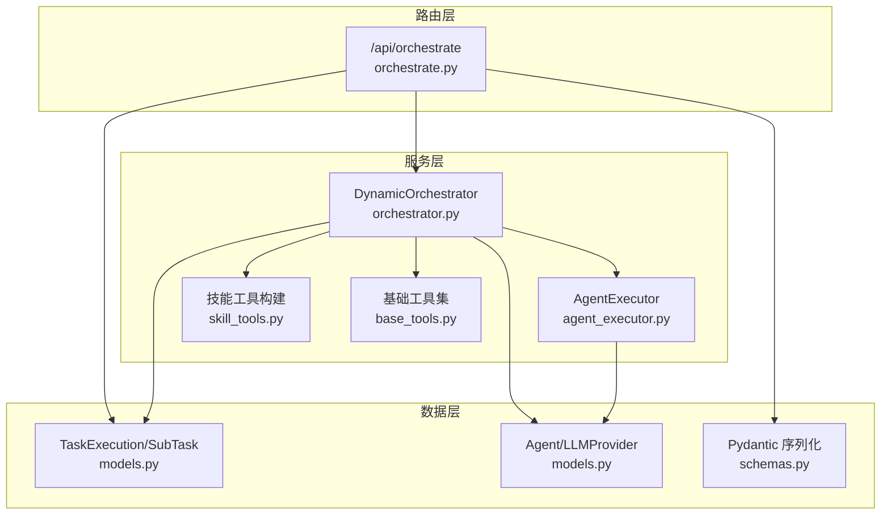
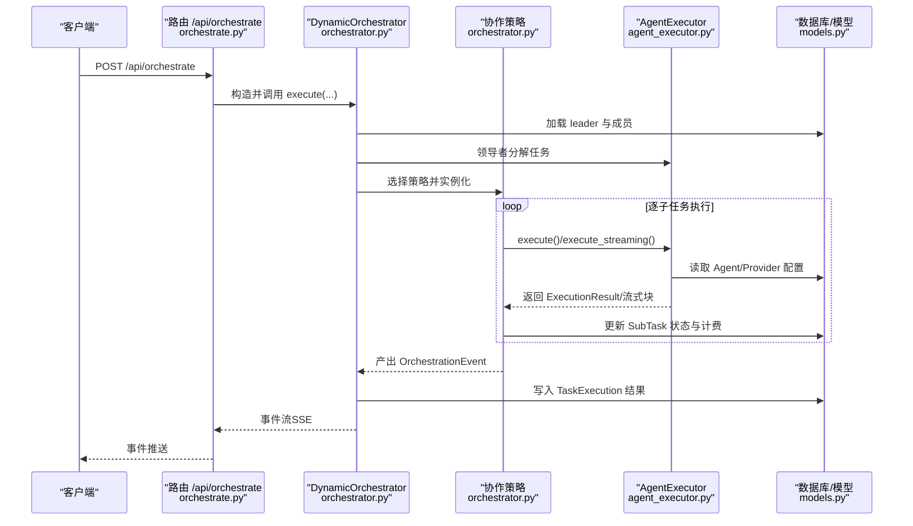
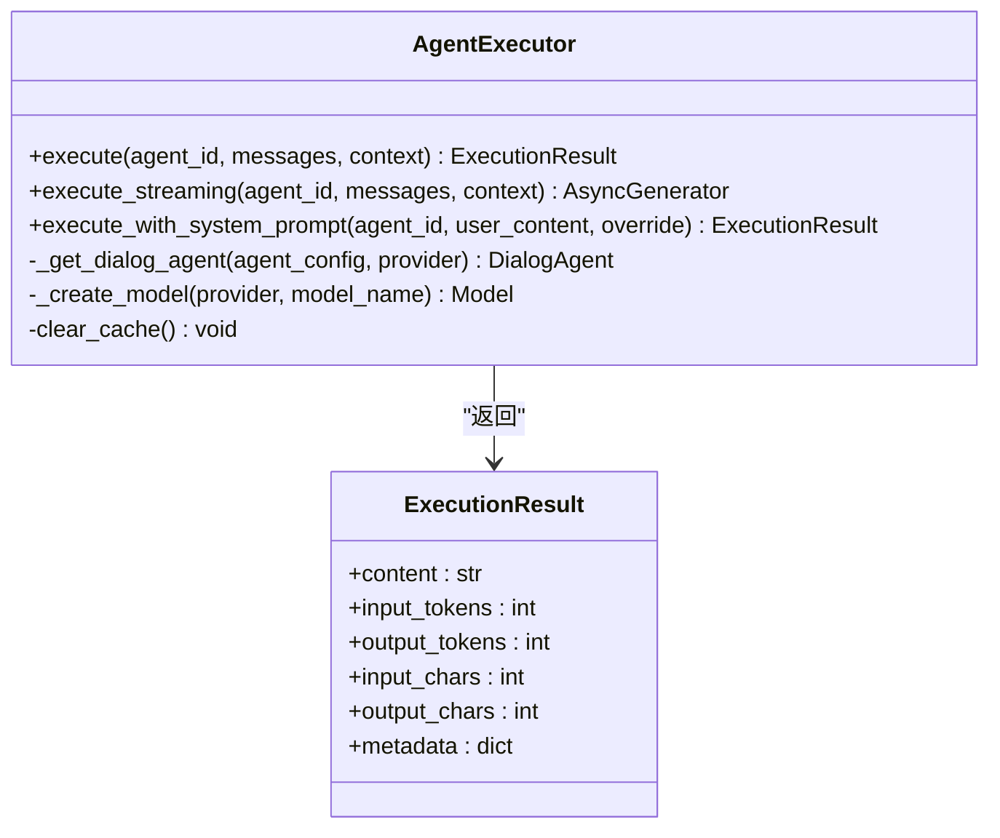
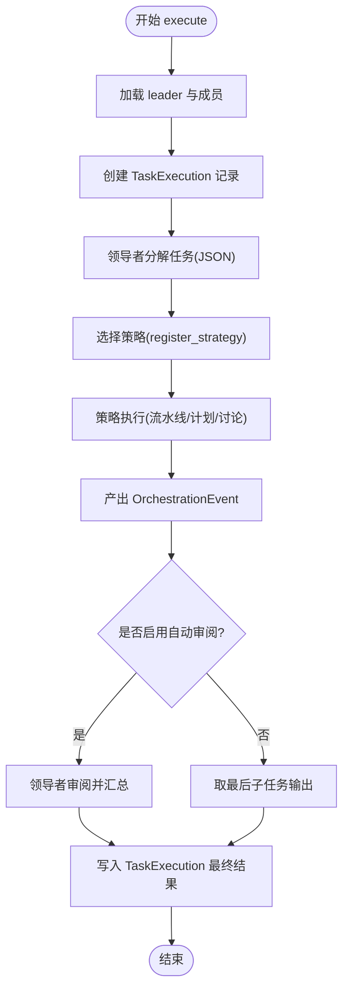
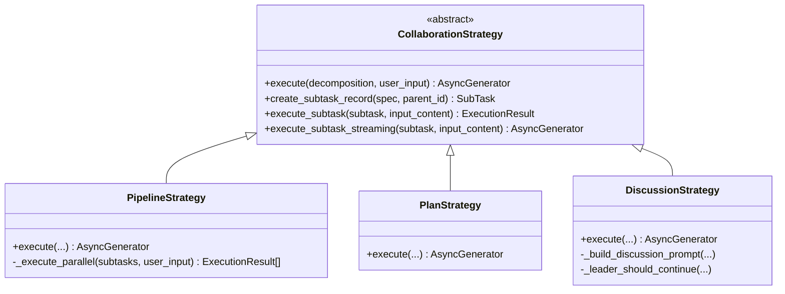
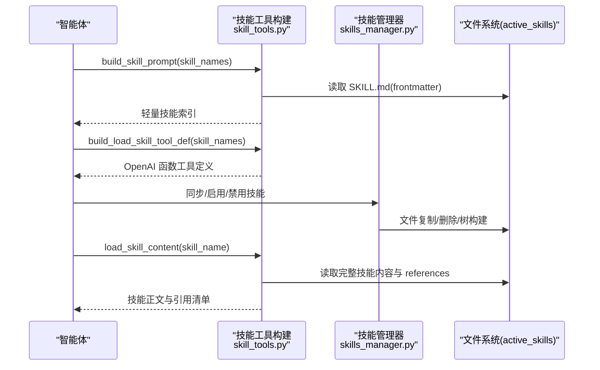
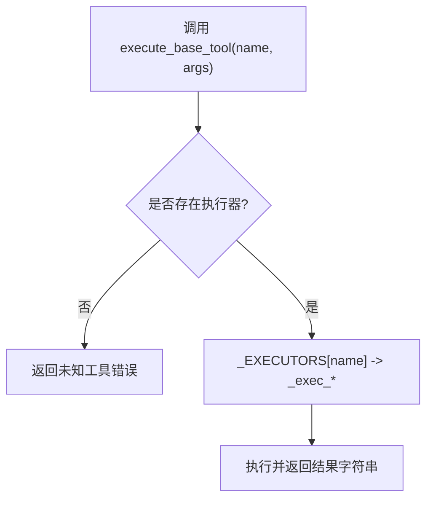
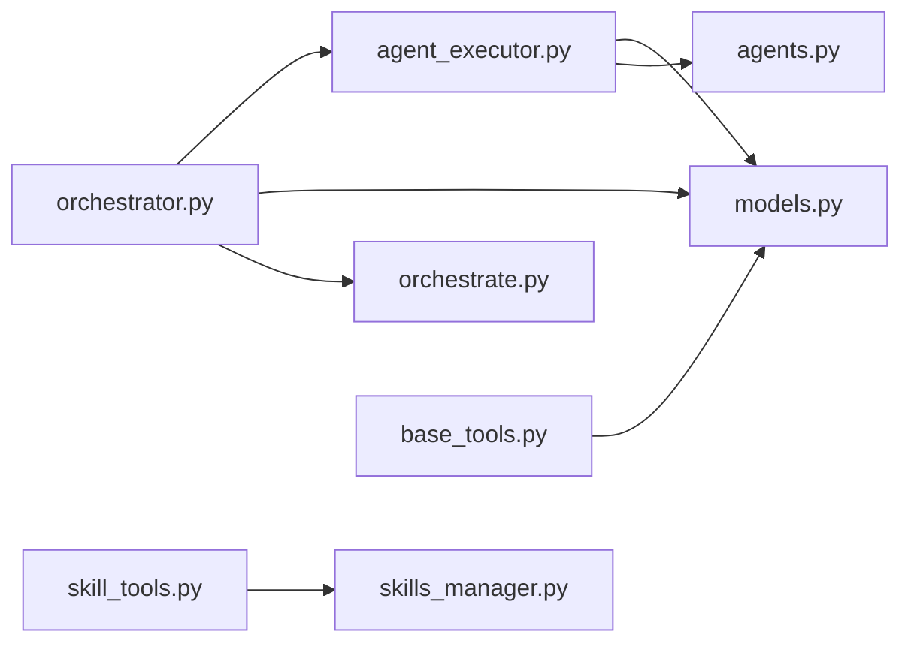
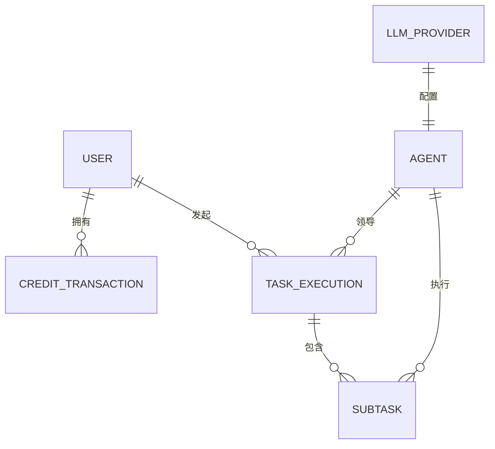

# 智能体执行服务

<cite>
**本文引用的文件**
- [agent_executor.py](file://backend/services/agent_executor.py)
- [orchestrator.py](file://backend/services/orchestrator.py)
- [skill_tools.py](file://backend/services/skill_tools.py)
- [base_tools.py](file://backend/services/base_tools.py)
- [orchestrate.py](file://backend/routers/orchestrate.py)
- [models.py](file://backend/models.py)
- [schemas.py](file://backend/schemas.py)
- [agents.py](file://backend/agents.py)
- [skills_manager.py](file://backend/skills_manager.py)
- [file_reader_SKILL.md](file://backend/skills/builtin_skills/file_reader/SKILL.md)
- [file_reader_read.py](file://backend/skills/builtin_skills/file_reader/scripts/read.py)
- [active_file_reader_read.py](file://backend/skills/active_skills/file_reader/scripts/read.py)
</cite>

## 目录
1. [简介](#简介)
2. [项目结构](#项目结构)
3. [核心组件](#核心组件)
4. [架构总览](#架构总览)
5. [详细组件分析](#详细组件分析)
6. [依赖分析](#依赖分析)
7. [性能考虑](#性能考虑)
8. [故障排查指南](#故障排查指南)
9. [结论](#结论)
10. [附录](#附录)

## 简介
本文件面向“智能体执行服务”的使用者与维护者，系统化阐述以下内容：
- AgentExecutor 的架构设计：执行流程控制、状态管理与结果聚合
- DynamicOrchestrator 的动态编排机制：任务分配、协调策略与冲突解决
- 技能工具系统：工具注册、参数传递与执行上下文管理
- 具体执行示例：多智能体协作、工具调用与错误处理
- 性能优化建议与调试技巧

## 项目结构
后端采用分层与职责分离的设计：
- 服务层：AgentExecutor、DynamicOrchestrator、技能工具与基础工具
- 路由层：FastAPI 路由，负责请求接入与 SSE 流式响应
- 数据模型与序列化：SQLAlchemy 模型与 Pydantic 序列化
- 前端集成：通过 SSE 实时接收编排进度事件

图表来源
- [orchestrate.py:26-71](file://backend/routers/orchestrate.py#L26-L71)
- [agent_executor.py:63-277](file://backend/services/agent_executor.py#L63-L277)
- [orchestrator.py:560-673](file://backend/services/orchestrator.py#L560-L673)
- [skill_tools.py:36-142](file://backend/services/skill_tools.py#L36-L142)
- [base_tools.py:173-270](file://backend/services/base_tools.py#L173-L270)
- [models.py:283-330](file://backend/models.py#L283-L330)
- [schemas.py:239-350](file://backend/schemas.py#L239-L350)

章节来源
- [orchestrate.py:19-71](file://backend/routers/orchestrate.py#L19-L71)
- [models.py:196-330](file://backend/models.py#L196-L330)
- [schemas.py:239-350](file://backend/schemas.py#L239-L350)

## 核心组件
- AgentExecutor：统一代理调用入口，封装对话代理执行、流式输出与令牌统计；提供缓存与模型工厂
- DynamicOrchestrator：主编排引擎，负责领导智能体的任务分解、策略选择与结果汇总
- 协作策略：Pipeline、Plan、Discussion 三种策略，通过注册表动态选择
- 技能工具系统：轻量系统提示索引 + 按需加载的完整技能内容，结合元工具 load_skill
- 基础工具集：文件读取、目录列举、可选的 shell 命令执行，带路径校验与大小限制
- 路由与事件：SSE 事件流，实时反馈编排进度

章节来源
- [agent_executor.py:63-277](file://backend/services/agent_executor.py#L63-L277)
- [orchestrator.py:82-250](file://backend/services/orchestrator.py#L82-L250)
- [orchestrator.py:254-530](file://backend/services/orchestrator.py#L254-L530)
- [skill_tools.py:36-142](file://backend/services/skill_tools.py#L36-L142)
- [base_tools.py:173-270](file://backend/services/base_tools.py#L173-L270)
- [orchestrate.py:26-71](file://backend/routers/orchestrate.py#L26-L71)

## 架构总览
下图展示了从 API 请求到编排完成的端到端流程，以及各组件间的交互关系。

图表来源
- [orchestrate.py:46-71](file://backend/routers/orchestrate.py#L46-L71)
- [orchestrator.py:570-673](file://backend/services/orchestrator.py#L570-L673)
- [agent_executor.py:74-208](file://backend/services/agent_executor.py#L74-L208)
- [models.py:283-330](file://backend/models.py#L283-L330)

## 详细组件分析

### AgentExecutor：执行流程控制、状态管理与结果聚合
- 执行模式
  - execute：非流式执行，返回统一的 ExecutionResult，包含文本内容、令牌用量与字符统计
  - execute_streaming：绕过对话代理，直接调用流式接口，按块返回并携带运行中的统计
  - execute_with_system_prompt：在不修改缓存代理的前提下，临时覆盖系统提示进行一次性调用
- 缓存与模型工厂
  - 对话代理与模型实例按“agent_id + provider_id”键缓存，避免重复初始化
  - 根据提供商类型选择对应模型类（OpenAI/Anthropic/DashScope/Gemini/Ollama），并支持默认 base_url 映射
- 结果聚合
  - 统一输出结构 ExecutionResult，包含输入/输出令牌、字符数与元数据（如 agent_id、model、是否覆盖系统提示）
  - 流式执行时，将最终完整响应与令牌统计写入 SubTask 的输出字段

图表来源
- [agent_executor.py:63-277](file://backend/services/agent_executor.py#L63-L277)

章节来源
- [agent_executor.py:74-208](file://backend/services/agent_executor.py#L74-L208)
- [agent_executor.py:279-287](file://backend/services/agent_executor.py#L279-L287)

### DynamicOrchestrator：动态编排机制
- 任务分解
  - 领导智能体基于成员列表与用户请求生成 JSON 格式的任务分解，包含协调模式、执行模式、子任务与依赖关系
  - 解析时进行 ID 匹配与模糊容错，确保即使 LLM 输出存在字符偏差也能正确映射
- 策略选择
  - 通过注册表按名称选择策略：pipeline、plan、discussion，默认回退到 pipeline
  - 策略内部负责子任务记录创建、执行与状态更新
- 执行与事件
  - 策略以异步生成器方式产出 OrchestrationEvent，前端通过 SSE 实时接收
  - 支持 leader 审阅与最终汇总，若未开启则取最后一个子任务输出作为最终结果
- 冲突与异常处理
  - 子任务失败时记录错误与重试次数，并向事件流发出失败事件
  - 整体执行异常时回滚任务状态并上报错误

图表来源
- [orchestrator.py:570-673](file://backend/services/orchestrator.py#L570-L673)
- [orchestrator.py:698-784](file://backend/services/orchestrator.py#L698-L784)

章节来源
- [orchestrator.py:560-673](file://backend/services/orchestrator.py#L560-L673)
- [orchestrator.py:698-784](file://backend/services/orchestrator.py#L698-L784)

### 协作策略：Pipeline/Plan/Discussion
- Pipeline 策略
  - 支持串行与并行两种执行模式；并行使用 gather 并发执行，串行使用流式逐步推进
  - 为每个子任务创建记录并产出“子任务创建/完成”事件
- Plan 策略
  - 构建依赖图，按拓扑顺序执行；同一层级内的任务可并行
  - 依据依赖输出拼接当前输入，逐层推进
- Discussion 策略
  - 多轮讨论，每轮所有成员依次发言，leader 评估是否继续
  - 限制最大轮次，避免无限循环

图表来源
- [orchestrator.py:82-530](file://backend/services/orchestrator.py#L82-L530)

章节来源
- [orchestrator.py:254-320](file://backend/services/orchestrator.py#L254-L320)
- [orchestrator.py:325-407](file://backend/services/orchestrator.py#L325-L407)
- [orchestrator.py:413-530](file://backend/services/orchestrator.py#L413-L530)

### 技能工具系统：注册、参数传递与上下文管理
- 轻量化索引与按需加载
  - 系统提示仅包含技能名称与简述；通过元工具 load_skill 在需要时加载完整技能内容
  - 有效降低常规对话的令牌开销
- 工具定义与调度
  - build_load_skill_tool_def 生成 OpenAI 格式的函数工具定义，枚举限定为当前智能体可用技能
  - build_skill_prompt 从 active_skills 目录扫描 SKILL.md，构建轻量索引
- 技能生命周期管理
  - skills_manager 提供同步、启用/禁用、创建/删除技能的能力，支持内置与定制化技能合并
  - 前端可通过管理接口查看、编辑与切换技能状态

图表来源
- [skill_tools.py:36-142](file://backend/services/skill_tools.py#L36-L142)
- [skills_manager.py:180-231](file://backend/skills_manager.py#L180-L231)
- [skills_manager.py:263-408](file://backend/skills_manager.py#L263-L408)

章节来源
- [skill_tools.py:36-142](file://backend/services/skill_tools.py#L36-L142)
- [skills_manager.py:180-231](file://backend/skills_manager.py#L180-L231)
- [skills_manager.py:263-408](file://backend/skills_manager.py#L263-L408)
- [file_reader_SKILL.md:1-48](file://backend/skills/builtin_skills/file_reader/SKILL.md#L1-L48)

### 基础工具集：文件与目录操作
- 工具定义
  - read_file：读取文件内容，支持行范围与截断提示
  - list_directory：列出目录项，带大小与类型标记
  - execute_shell_command：执行命令（带超时与输出截断）
- 路径安全
  - 严格禁止路径穿越（.. 段检测），并对超出阈值的输出进行截断
- 调度与执行
  - 通过查找表按名称路由到具体执行函数，避免分支判断

图表来源
- [base_tools.py:264-270](file://backend/services/base_tools.py#L264-L270)
- [base_tools.py:173-248](file://backend/services/base_tools.py#L173-L248)

章节来源
- [base_tools.py:255-270](file://backend/services/base_tools.py#L255-L270)
- [base_tools.py:173-248](file://backend/services/base_tools.py#L173-L248)

### 执行示例与最佳实践
- 多智能体协作
  - 使用 DynamicOrchestrator.execute，传入 leader_agent_id 与成员配置
  - 通过策略选择决定执行顺序与并发方式；串行适合需要上下文累积的任务，计划策略适合有依赖的复杂流程
- 工具调用
  - 在智能体系统提示中注入技能索引与 load_skill 工具定义
  - 仅在需要时调用 load_skill 获取完整技能内容，避免不必要的令牌消耗
- 错误处理
  - 子任务失败时记录错误与重试次数；前端可据此提示用户或触发重试
  - 整体异常捕获后将任务状态置为 failed 并输出错误事件

章节来源
- [orchestrator.py:570-673](file://backend/services/orchestrator.py#L570-L673)
- [skill_tools.py:36-142](file://backend/services/skill_tools.py#L36-L142)

## 依赖分析
- 组件耦合
  - DynamicOrchestrator 依赖 AgentExecutor 与数据库模型；策略之间低耦合，通过抽象基类统一接口
  - AgentExecutor 与 LLM 提供商配置解耦，通过工厂方法与缓存提升复用性
- 外部依赖
  - FastAPI（路由）、SQLAlchemy（ORM）、agentscope（对话代理与模型封装）
- 循环依赖
  - 未发现循环导入；模块间单向依赖清晰

图表来源
- [orchestrator.py:17-21](file://backend/services/orchestrator.py#L17-L21)
- [agent_executor.py:10-15](file://backend/services/agent_executor.py#L10-L15)
- [orchestrate.py:14-15](file://backend/routers/orchestrate.py#L14-L15)
- [agents.py:70-117](file://backend/agents.py#L70-L117)
- [skills_manager.py:180-231](file://backend/skills_manager.py#L180-L231)

章节来源
- [orchestrator.py:17-21](file://backend/services/orchestrator.py#L17-L21)
- [agent_executor.py:10-15](file://backend/services/agent_executor.py#L10-L15)
- [orchestrate.py:14-15](file://backend/routers/orchestrate.py#L14-L15)
- [agents.py:70-117](file://backend/agents.py#L70-L117)
- [skills_manager.py:180-231](file://backend/skills_manager.py#L180-L231)

## 性能考虑
- 缓存与复用
  - AgentExecutor 对对话代理与模型实例进行缓存，减少重复初始化成本
  - 建议在高并发场景下合理设置缓存键与失效策略
- 流式执行
  - execute_streaming 适合长文本生成与实时反馈；注意前端缓冲与网络抖动处理
- 工具调用节流
  - 基础工具对输出大小与行数进行限制，避免大文件读取造成内存压力
- 策略选择
  - 串行适合需要上下文累积的任务；计划策略可并行执行无依赖子任务
- 数据库写入
  - 子任务状态与计费在执行过程中频繁更新，建议批量 flush 或合并事务以降低写放大

## 故障排查指南
- 令牌统计异常
  - 检查 ExecutionResult 的 input_tokens/output_tokens 来源是否来自模型 usage
  - 若为空，确认模型封装是否正确透传 usage 字段
- 子任务失败
  - 查看 SubTask.error_message 与 retry_count，定位具体失败原因
  - 对于文件读取类工具，检查路径是否被拒绝（路径穿越）或文件不存在
- 技能加载失败
  - 确认 active_skills 目录中存在对应技能目录与 SKILL.md
  - 使用 skills_manager 的启用/禁用功能重新同步
- API 层错误
  - 路由层捕获异常并以 SSE error 事件返回，前端应监听并提示用户

章节来源
- [agent_executor.py:113-125](file://backend/services/agent_executor.py#L113-L125)
- [orchestrator.py:156-161](file://backend/services/orchestrator.py#L156-L161)
- [base_tools.py:25-34](file://backend/services/base_tools.py#L25-L34)
- [skills_manager.py:284-301](file://backend/skills_manager.py#L284-L301)
- [orchestrate.py:59-61](file://backend/routers/orchestrate.py#L59-L61)

## 结论
本智能体执行服务通过 AgentExecutor 与 DynamicOrchestrator 的协同，实现了从任务分解到多策略执行的完整闭环。配合轻量化的技能工具系统与严格的基础工具安全约束，既保证了灵活性与安全性，又兼顾了性能与可观测性。建议在生产环境中结合缓存、流式与批量写入等策略进一步优化吞吐与延迟。

## 附录
- 数据模型概览（关键实体）
  - Agent：智能体配置与定价、领导角色与成员列表
  - LLMProvider：提供商类型、base_url、模型列表与费率
  - TaskExecution/SubTask：任务执行记录与子任务状态、令牌与计费统计
  - User/CreditTransaction：用户与积分交易，支撑计费与风控

图表来源
- [models.py:35-73](file://backend/models.py#L35-L73)
- [models.py:196-252](file://backend/models.py#L196-L252)
- [models.py:283-330](file://backend/models.py#L283-L330)