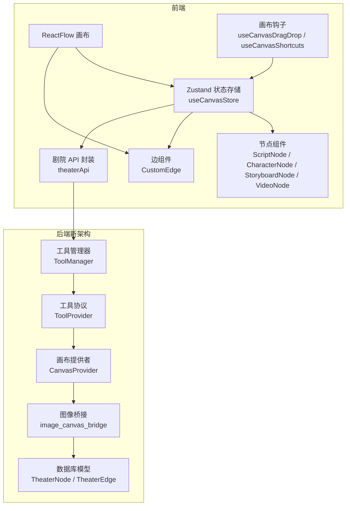
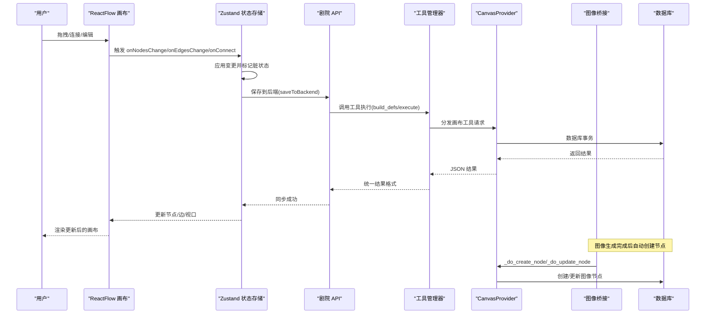
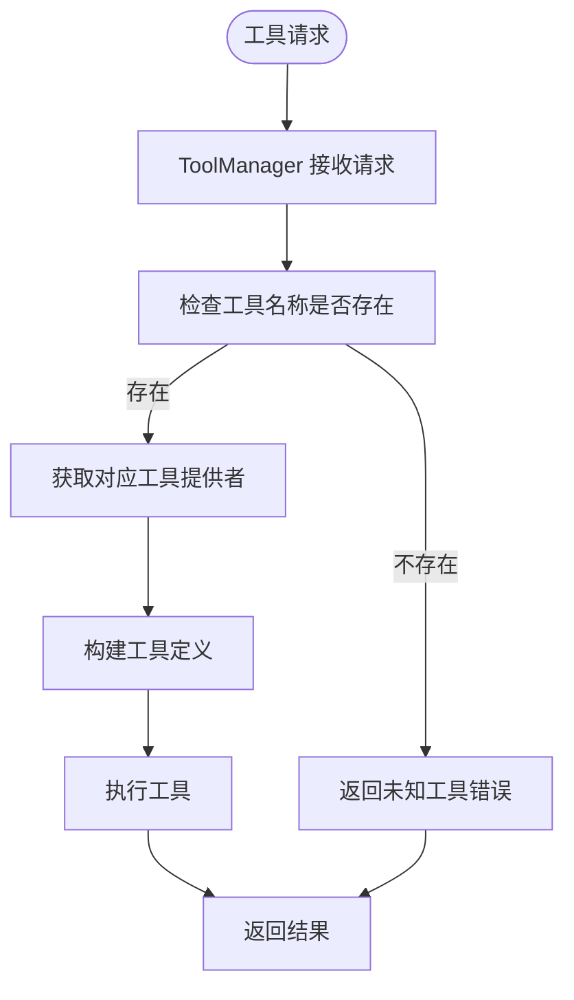
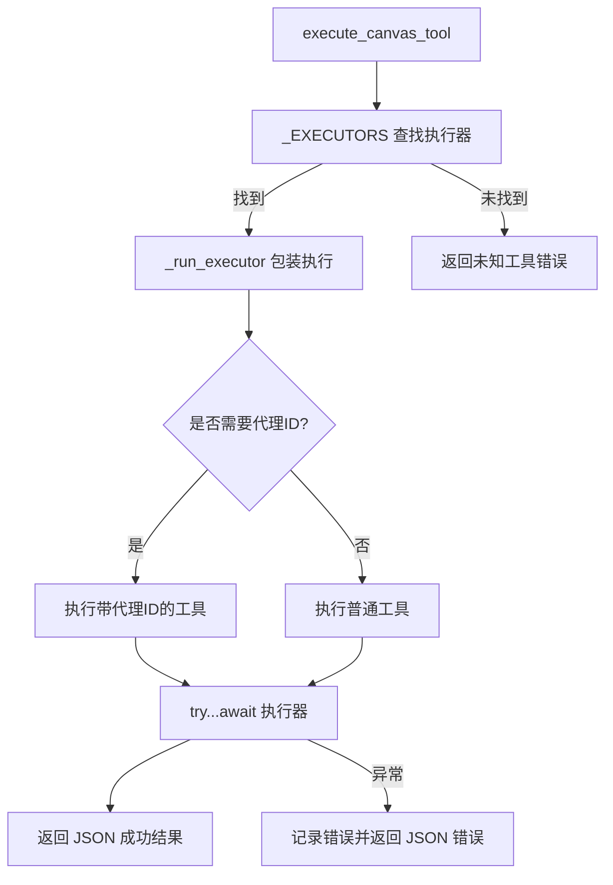
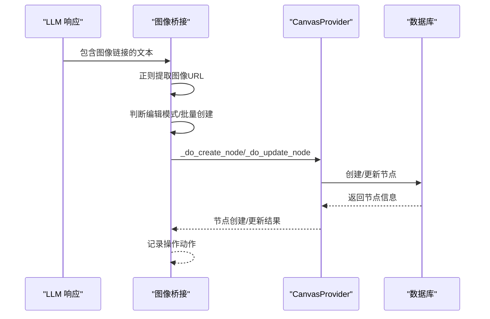
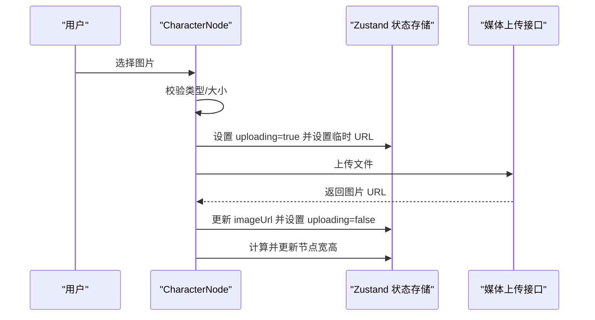
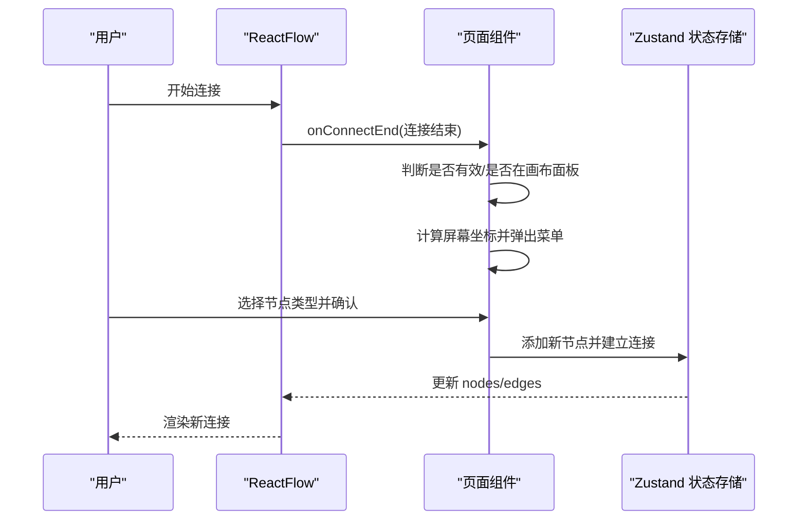
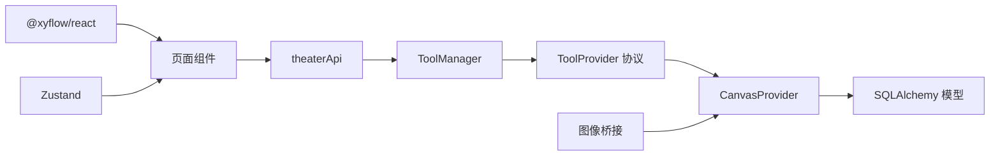

# 画布工具集成

<cite>
**本文档引用的文件**
- [TheaterCanvas.tsx](file://frontend/src/components/TheaterCanvas.tsx)
- [useCanvasStore.ts](file://frontend/src/store/useCanvasStore.ts)
- [canvas.py](file://backend/services/tool_manager/providers/canvas.py)
- [manager.py](file://backend/services/tool_manager/manager.py)
- [context.py](file://backend/services/tool_manager/context.py)
- [protocol.py](file://backend/services/tool_manager/protocol.py)
- [__init__.py](file://backend/services/tool_manager/providers/__init__.py)
- [image_canvas_bridge.py](file://backend/services/image_canvas_bridge.py)
- [CharacterNode.tsx](file://frontend/src/components/canvas/CharacterNode.tsx)
- [ScriptNode.tsx](file://frontend/src/components/canvas/ScriptNode.tsx)
- [CustomEdge.tsx](file://frontend/src/components/canvas/CustomEdge.tsx)
- [page.tsx](file://frontend/src/app/theater/[id]/page.tsx)
- [graphUtils.ts](file://frontend/src/lib/graphUtils.ts)
- [PivotEditor.tsx](file://frontend/src/components/canvas/pivot/PivotEditor.tsx)
- [useCanvasDragDrop.ts](file://frontend/src/app/theater/[id]/hooks/useCanvasDragDrop.ts)
- [useCanvasShortcuts.ts](file://frontend/src/app/theater/[id]/hooks/useCanvasShortcuts.ts)
- [theaterApi.ts](file://frontend/src/lib/theaterApi.ts)
</cite>

## 更新摘要
**所做更改**
- 更新了画布工具架构，从传统的 canvas_tools.py 迁移到新的工具管理器架构
- 新增了 CanvasProvider 类作为画布工具的主要实现载体
- 引入了 ToolManager、ToolContext 和 ToolProvider 协议的新架构
- 更新了工具定义、执行和管理的完整流程
- 新增了图像到画布桥接功能，支持自动生成图像节点

## 目录
1. [简介](#简介)
2. [项目结构](#项目结构)
3. [核心组件](#核心组件)
4. [架构总览](#架构总览)
5. [详细组件分析](#详细组件分析)
6. [依赖关系分析](#依赖关系分析)
7. [性能考虑](#性能考虑)
8. [故障排除指南](#故障排除指南)
9. [结论](#结论)
10. [附录](#附录)

## 简介
本文件系统性阐述"画布工具集成"的全新架构设计与实现，涵盖基于新工具管理器架构的前端 React Flow 画布、节点操作工具、连接管理工具以及画布状态维护机制。文档重点解释以下方面：
- 新工具管理器架构的设计理念与职责划分
- CanvasProvider 作为主要工具提供者的实现细节
- 前后端双向数据映射与同步策略的现代化改进
- 事件处理、状态同步与用户交互响应的优化流程
- 执行流程：操作捕获、数据转换与结果反馈的完整链路
- 自定义画布工具开发、事件监听与状态管理的最佳实践
- 工具扩展、性能优化与图像生成集成的综合方案

## 项目结构
本项目采用"前端 + 后端"双层架构，前端使用 React + Zustand 状态管理 + React Flow 画布，后端通过全新的工具管理器架构提供画布节点的工具化 CRUD 能力，并通过 REST API 与前端进行数据交换。

**图表来源**
- [page.tsx:54-484](file://frontend/src/app/theater/[id]/page.tsx#L54-L484)
- [manager.py:23-108](file://backend/services/tool_manager/manager.py#L23-L108)
- [canvas.py:513-549](file://backend/services/tool_manager/providers/canvas.py#L513-L549)
- [image_canvas_bridge.py:29-119](file://backend/services/image_canvas_bridge.py#L29-L119)

**章节来源**
- [page.tsx:54-484](file://frontend/src/app/theater/[id]/page.tsx#L54-L484)
- [manager.py:23-108](file://backend/services/tool_manager/manager.py#L23-L108)
- [canvas.py:513-549](file://backend/services/tool_manager/providers/canvas.py#L513-L549)
- [image_canvas_bridge.py:29-119](file://backend/services/image_canvas_bridge.py#L29-L119)

## 核心组件
- **新工具管理器架构**
  - ToolManager 作为中央协调器，统一管理所有工具提供者，提供工具定义构建、执行分发和重新构建功能
  - ToolContext 提供统一的上下文环境，包含 theater_id、agent、db 等关键参数
  - ToolProvider 协议定义了可插拔工具提供者的标准接口
- **CanvasProvider 实现**
  - 作为画布工具的主要提供者，实现节点的增删改查操作
  - 支持多种节点类型（text/image/video/storyboard）和字段验证
  - 提供工具定义构建、执行和元数据查询功能
- **图像到画布桥接**
  - 自动识别 LLM 生成的图像链接并创建/更新画布图像节点
  - 支持编辑模式和批量创建模式
- **状态存储与同步**
  - 使用 Zustand 管理节点、边、视口、剧院元数据、历史快照与脏标记
  - 提供 loadTheater/syncTheater/saveToBackend 等方法，负责与后端 API 的数据拉取、合并与保存

**章节来源**
- [manager.py:23-108](file://backend/services/tool_manager/manager.py#L23-L108)
- [context.py:23-70](file://backend/services/tool_manager/context.py#L23-L70)
- [protocol.py:11-44](file://backend/services/tool_manager/protocol.py#L11-L44)
- [canvas.py:513-549](file://backend/services/tool_manager/providers/canvas.py#L513-L549)
- [image_canvas_bridge.py:29-119](file://backend/services/image_canvas_bridge.py#L29-L119)

## 架构总览
前端 React Flow 画布通过 useCanvasStore 统一管理状态，节点与边组件负责用户交互，API 层负责与后端同步。后端通过新的工具管理器架构中的 CanvasProvider 实现节点的增删改查，图像生成模块通过桥接功能自动创建图像节点，所有组件通过清晰的协议和上下文进行通信。

**图表来源**
- [page.tsx:334-444](file://frontend/src/app/theater/[id]/page.tsx#L334-L444)
- [useCanvasStore.ts:209-254](file://frontend/src/store/useCanvasStore.ts#L209-L254)
- [manager.py:87-91](file://backend/services/tool_manager/manager.py#L87-L91)
- [canvas.py:528-532](file://backend/services/tool_manager/providers/canvas.py#L528-L532)
- [image_canvas_bridge.py:29-63](file://backend/services/image_canvas_bridge.py#L29-L63)

## 详细组件分析

### 新工具管理器架构（ToolManager/ToolProvider）
- **ToolManager 职责**
  - 统一管理所有工具提供者，构建分发映射表
  - 提供工具定义构建、执行分发和重新构建功能
  - 支持动态工具定义更新和缓存管理
- **ToolProvider 协议**
  - 定义标准接口：tool_names、build_defs、execute、rebuild_defs、get_tool_metadata
  - 支持工具可用性检查和条件判断
  - 提供统一的工具元数据查询接口
- **ToolContext 上下文**
  - 提供统一的执行环境，包含 theater_id、agent、db 等关键参数
  - 支持延迟解析的技能目录和图像提供者类型
  - 提供日志溯源字段，便于调试和审计

**图表来源**
- [manager.py:87-91](file://backend/services/tool_manager/manager.py#L87-L91)
- [protocol.py:11-44](file://backend/services/tool_manager/protocol.py#L11-L44)
- [context.py:23-70](file://backend/services/tool_manager/context.py#L23-L70)

**章节来源**
- [manager.py:23-108](file://backend/services/tool_manager/manager.py#L23-L108)
- [protocol.py:11-44](file://backend/services/tool_manager/protocol.py#L11-L44)
- [context.py:23-70](file://backend/services/tool_manager/context.py#L23-L70)

### CanvasProvider 实现（CanvasProvider）
- **工具定义构建**
  - 基于目标节点类型动态生成工具定义
  - 支持节点类型枚举过滤和字段校验
  - 提供详细的节点类型说明和示例
- **执行器路由**
  - 基于查找表 _EXECUTORS 路由到具体执行函数
  - 统一封装异常处理与日志记录
  - 支持代理 ID 传递（仅 create_canvas_node 需要）
- **节点操作实现**
  - _exec_list_nodes/_exec_get_node/_exec_create_node/_exec_update_node/_exec_delete_node
  - 支持自动位置计算和尺寸估算
  - 提供节点摘要和完整数据表示

**图表来源**
- [canvas.py:490-507](file://backend/services/tool_manager/providers/canvas.py#L490-L507)
- [canvas.py:528-532](file://backend/services/tool_manager/providers/canvas.py#L528-L532)

**章节来源**
- [canvas.py:513-549](file://backend/services/tool_manager/providers/canvas.py#L513-L549)
- [canvas.py:481-487](file://backend/services/tool_manager/providers/canvas.py#L481-L487)
- [canvas.py:300-475](file://backend/services/tool_manager/providers/canvas.py#L300-L475)

### 图像到画布桥接（image_canvas_bridge）
- **自动图像识别**
  - 使用正则表达式提取 LLM 响应中的图像链接
  - 支持 Markdown 格式的图像标记 
- **智能节点创建**
  - 编辑模式：更新现有节点的 imageUrl 字段
  - 批量创建模式：为每个生成的图像创建新的图像节点
  - 自动设置节点数据（名称、描述、适配模式等）
- **位置智能布局**
  - 使用 _calculate_auto_position 计算新节点的自动位置
  - 支持多图像的智能排列和间距计算

**图表来源**
- [image_canvas_bridge.py:29-63](file://backend/services/image_canvas_bridge.py#L29-L63)
- [image_canvas_bridge.py:89-119](file://backend/services/image_canvas_bridge.py#L89-L119)
- [canvas.py:395-401](file://backend/services/tool_manager/providers/canvas.py#L395-L401)

**章节来源**
- [image_canvas_bridge.py:29-119](file://backend/services/image_canvas_bridge.py#L29-L119)
- [canvas.py:356-393](file://backend/services/tool_manager/providers/canvas.py#L356-L393)

### 状态存储与同步（useCanvasStore）
- **职责**
  - 维护 nodes/edges/viewport 与剧院元数据（ID、标题、保存状态）
  - 提供 onNodesChange/onEdgesChange/onConnect 回调，应用变更并标记 isDirty
  - 提供 addNode/deleteNode/deleteEdge/reset 等节点操作
  - 提供 takeSnapshot/undo/redo 历史回溯能力
  - 提供 loadTheater/syncTheater/saveToBackend 与后端同步
- **数据映射**
  - nodeToApi/apiToNode 与 edgeToApi/apiToEdge 负责前端与后端数据结构互转
- **关键流程**
  - 连接拦截：禁止自环与环路，使用 hasCycle 检测
  - 快照策略：每次重大变更（新增/删除/连接）记录历史快照，限制最大长度
  - 后端保存：防抖 2 秒，避免频繁写入；保存成功后清除脏标记

**图表来源**
- [useCanvasStore.ts:238-254](file://frontend/src/store/useCanvasStore.ts#L238-L254)
- [graphUtils.ts:4-39](file://frontend/src/lib/graphUtils.ts#L4-L39)

**章节来源**
- [useCanvasStore.ts:185-540](file://frontend/src/store/useCanvasStore.ts#L185-L540)

### 节点组件（ScriptNode/CharacterNode）
- **ScriptNode**
  - 支持双击进入编辑模式，使用 ScriptEditor 内容编辑器；ESC 或点击画布外部退出编辑并保存
  - 提供复制节点、删除节点、AI 助手占位按钮
  - 通过 Handle 提供左右连接入口，配合自定义边渲染
- **CharacterNode**
  - 支持图片上传、进度反馈、错误提示与本地预览
  - 图片加载完成后自动计算合理尺寸并更新节点宽高
  - 支持图片适配模式切换（cover/contain）、全屏预览与拖拽缩放
  - 提供 AI 编辑入口与复制/删除操作

**图表来源**
- [CharacterNode.tsx:126-205](file://frontend/src/components/canvas/CharacterNode.tsx#L126-L205)
- [useCanvasStore.ts:320-329](file://frontend/src/store/useCanvasStore.ts#L320-L329)

**章节来源**
- [ScriptNode.tsx:11-351](file://frontend/src/components/canvas/ScriptNode.tsx#L11-L351)
- [CharacterNode.tsx:13-692](file://frontend/src/components/canvas/CharacterNode.tsx#L13-L692)

### 边组件与连接管理（CustomEdge）
- 使用贝塞尔曲线绘制边，悬停时边宽加粗并显示删除按钮
- 通过隐形宽轨道提升鼠标命中区域，改善交互体验
- 删除按钮点击触发 deleteEdge，移除对应边并派发自定义事件

**章节来源**
- [CustomEdge.tsx:5-92](file://frontend/src/components/canvas/CustomEdge.tsx#L5-L92)
- [useCanvasStore.ts:276-288](file://frontend/src/store/useCanvasStore.ts#L276-L288)

### 画布页面与事件集成（page.tsx）
- ReactFlow 初始化与节点/边类型注册，设置默认边样式与连接半径
- 事件绑定：onNodesChange/onEdgesChange/onConnect/onConnectEnd/onNodeDrag/onNodeDragStop/onMove/onDragOver/onDrop
- 快捷键：Ctrl+S 保存、Ctrl+Z 撤销、Ctrl+Y/Shift+Z 重做
- 自动布局与吸附：集成 useAutoLayout/useCanvasSnapping，提供对齐线与网格吸附
- 菜单系统：连接结束时弹出快速添加菜单，支持从指定 Handle 连接并自动建立新节点

**图表来源**
- [page.tsx:118-219](file://frontend/src/app/theater/[id]/page.tsx#L118-L219)
- [useCanvasStore.ts:256-264](file://frontend/src/store/useCanvasStore.ts#L256-L264)

**章节来源**
- [page.tsx:54-484](file://frontend/src/app/theater/[id]/page.tsx#L54-L484)

### 剧院 API 封装（theaterApi.ts）
- 定义剧院、节点、边的请求/响应接口，统一前后端数据契约
- 提供 createTheater/listTheaters/getTheater/updateTheater/deleteTheater/saveCanvas 等方法，封装 HTTP 请求

**章节来源**
- [theaterApi.ts:107-159](file://frontend/src/lib/theaterApi.ts#L107-L159)

### 画布钩子（useCanvasDragDrop/useCanvasShortcuts）
- **useCanvasDragDrop**
  - 处理拖放事件，将外部数据转换为画布节点并添加到状态存储
  - 支持网格吸附（snapToGrid）与默认尺寸映射
- **useCanvasShortcuts**
  - 注册键盘事件，支持撤销/重做快捷键

**章节来源**
- [useCanvasDragDrop.ts:6-74](file://frontend/src/app/theater/[id]/hooks/useCanvasDragDrop.ts#L6-L74)
- [useCanvasShortcuts.ts:4-26](file://frontend/src/app/theater/[id]/hooks/useCanvasShortcuts.ts#L4-L26)

### 分镜透视编辑器（PivotEditor）
- 提供字段拖拽配置 Rows/Cols/Values，支持聚合方式配置与排序设置
- 通过 usePivotEngine 计算透视结果并同步到节点数据（pivotConfig/pivotData）

**章节来源**
- [PivotEditor.tsx:22-229](file://frontend/src/components/canvas/pivot/PivotEditor.tsx#L22-L229)

## 依赖关系分析
- **前端依赖**
  - @xyflow/react：提供画布、节点、边、Handle、背景、迷你地图等能力
  - Zustand：提供轻量级状态管理，支持持久化与中间件
  - 自定义组件：节点/边/工具栏/快捷键钩子等
- **后端新架构依赖**
  - SQLAlchemy：异步 ORM 操作数据库
  - 工具管理器：基于协议的可插拔工具提供者架构
  - CanvasProvider：专门的画布工具实现
  - 图像桥接：自动处理图像生成与画布集成

**图表来源**
- [page.tsx:18-47](file://frontend/src/app/theater/[id]/page.tsx#L18-L47)
- [useCanvasStore.ts:2-24](file://frontend/src/store/useCanvasStore.ts#L2-L24)
- [manager.py:26-37](file://backend/services/tool_manager/manager.py#L26-L37)
- [canvas.py:513-518](file://backend/services/tool_manager/providers/canvas.py#L513-L518)

**章节来源**
- [page.tsx:18-47](file://frontend/src/app/theater/[id]/page.tsx#L18-L47)
- [useCanvasStore.ts:2-24](file://frontend/src/store/useCanvasStore.ts#L2-L24)
- [manager.py:26-37](file://backend/services/tool_manager/manager.py#L26-L37)
- [canvas.py:513-518](file://backend/services/tool_manager/providers/canvas.py#L513-L518)

## 性能考虑
- **工具管理器优化**
  - 使用分发映射表实现 O(1) 工具查找
  - 缓存工具定义，支持动态重建和增量更新
  - 统一异常处理和日志记录，避免重复错误处理
- **状态更新与渲染**
  - 使用 applyNodeChanges/applyEdgeChanges 应用变更，避免不必要的重渲染
  - 对维度更新（updateNodeDimensions）不频繁拍快照，降低历史栈压力
- **保存策略**
  - 保存防抖 2 秒，减少网络请求频率；isSaving 标记避免并发保存
- **图结构校验**
  - 连接前使用 hasCycle 检测环路，避免构建复杂图导致的渲染与算法开销
- **资源加载**
  - 图片上传采用本地临时 URL 预览，加载完成后计算合理尺寸，避免反复测量
- **组件优化**
  - 节点组件使用 memo 包裹，减少重复渲染
  - 自定义边使用隐形宽轨道提升命中率，减少事件处理开销
- **图像处理优化**
  - 图像桥接支持批量处理，减少数据库查询次数
  - 自动位置计算避免重复计算，提高布局效率

## 故障排除指南
- **工具执行失败**
  - 症状：工具调用返回错误消息
  - 原因：未知工具名称、权限不足、参数验证失败
  - 处理：检查工具名称是否在 _EXECUTORS 中；确认 agent.target_node_types 配置；验证参数格式
- **连接被阻止**
  - 症状：连接时无反应或控制台警告
  - 原因：自环或环路检测触发
  - 处理：检查起点与终点是否相同；使用撤销恢复到无环状态
- **保存失败**
  - 症状：保存按钮旋转且状态未更新
  - 原因：网络异常或后端错误
  - 处理：查看浏览器开发者工具 Network 面板；确认 isSaving 标记恢复；重试保存
- **图像上传失败**
  - 症状：上传进度条不动或出现错误提示
  - 原因：文件类型/大小不合法、网络错误
  - 处理：检查文件类型与大小限制；确认 Authorization 头正确；重试上传
- **节点尺寸异常**
  - 症状：节点过大或过小
  - 原因：图片自然尺寸过大或计算逻辑偏差
  - 处理：手动调整尺寸或等待自动计算；检查 handleImageLoad 逻辑
- **图像桥接失效**
  - 症状：图像生成但未创建画布节点
  - 原因：图像链接格式不匹配、目标节点不存在
  - 处理：检查 LLM 响应中的图像链接格式；确认目标节点 ID 正确

**章节来源**
- [canvas.py:490-507](file://backend/services/tool_manager/providers/canvas.py#L490-L507)
- [useCanvasStore.ts:238-254](file://frontend/src/store/useCanvasStore.ts#L238-L254)
- [CharacterNode.tsx:126-205](file://frontend/src/components/canvas/CharacterNode.tsx#L126-L205)
- [CustomEdge.tsx:29-32](file://frontend/src/components/canvas/CustomEdge.tsx#L29-L32)
- [image_canvas_bridge.py:66-86](file://backend/services/image_canvas_bridge.py#L66-L86)

## 结论
本项目通过全新的工具管理器架构重构了画布工具体系，将传统的 canvas_tools.py 迁移到基于 CanvasProvider 的现代化实现。新架构通过 ToolManager、ToolProvider 协议和 ToolContext 提供了更好的可扩展性和维护性。结合图像桥接功能，系统实现了从图像生成到画布展示的完整自动化流程。前端通过 React Flow 与 Zustand 构建了高可用的交互界面，后端通过新的工具管理器提供了稳定可靠的工具执行与数据持久化能力。通过统一的协议、上下文管理和缓存策略，系统在易用性与性能之间取得了更好的平衡。后续可在工具扩展、渲染性能与协作能力方面持续演进。

## 附录
- **自定义画布工具开发步骤**
  - 在后端：实现新的 ToolProvider 类，定义 tool_names、build_defs、execute 等方法
  - 在工具管理器：在 providers/__init__.py 中注册新的提供者实例
  - 在前端：在 useCanvasStore 中注册节点/边类型与默认数据，扩展 onConnect/onNodesChange 回调
  - 在页面：在 ReactFlow 的 nodeTypes/edgeTypes 中注册新组件，确保 Handle 与事件处理一致
- **事件监听与状态管理最佳实践**
  - 使用持久化中间件保存关键状态（nodes/edges/viewport），避免刷新丢失
  - 对高频变更（如拖拽）采用节流/防抖策略，减少状态更新频率
  - 通过 isDirty/isSaving 等标记明确用户感知的状态变化
  - 利用 ToolManager 的缓存机制，避免重复构建工具定义
- **扩展与优化建议**
  - 工具扩展：新增工具时保持参数与返回值的标准化，便于 LLM 调用与日志追踪
  - 渲染优化：对大型图采用虚拟滚动或分页加载；对复杂节点采用懒加载与缓存
  - 协作能力：引入实时同步（WebSocket）与冲突解决策略，支持多人协作编辑
  - 性能监控：利用 ToolContext 的日志溯源字段，跟踪工具执行性能和错误情况
  - 图像处理：优化图像桥接的批量处理逻辑，支持更大规模的图像生成场景