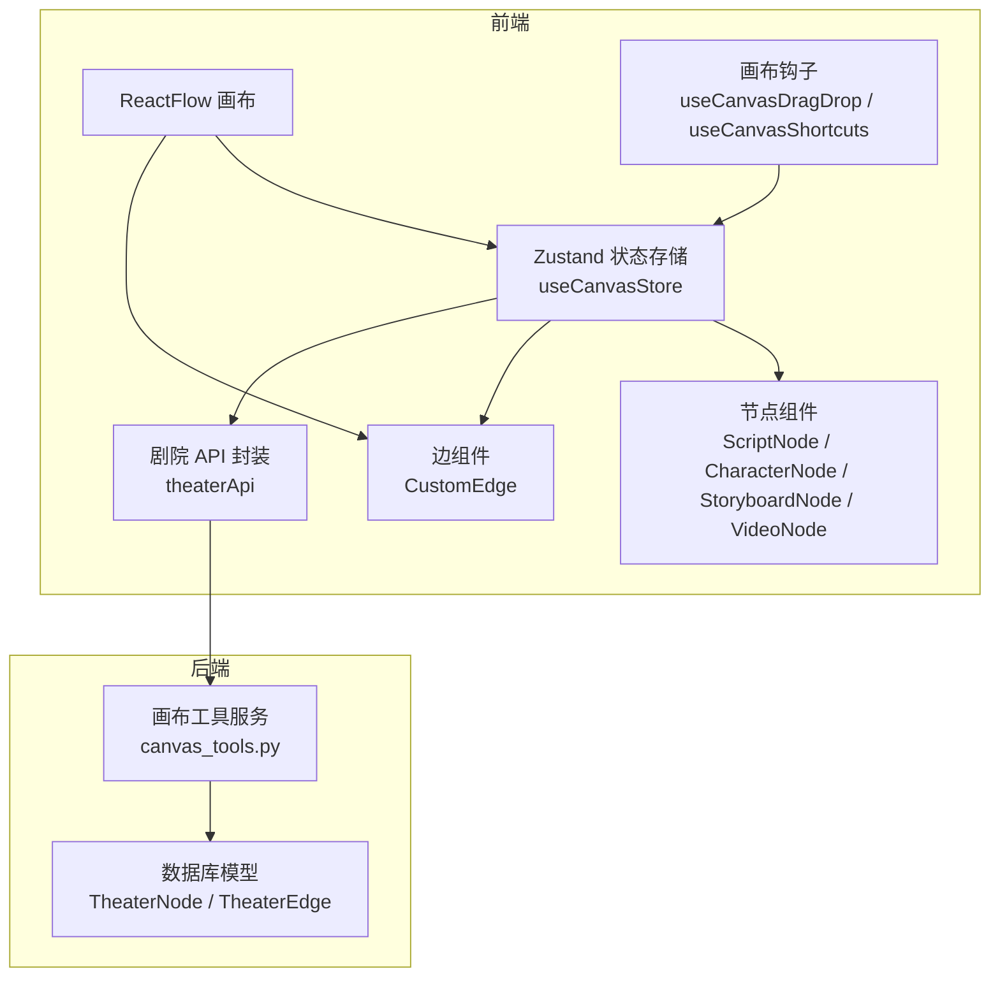
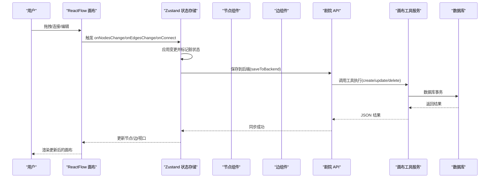
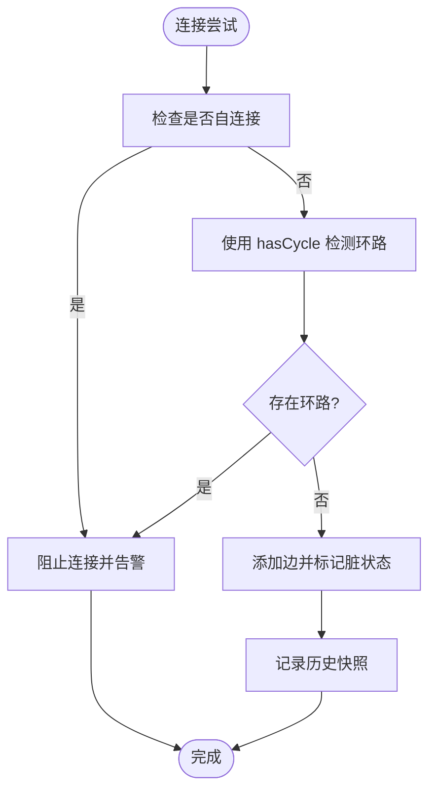
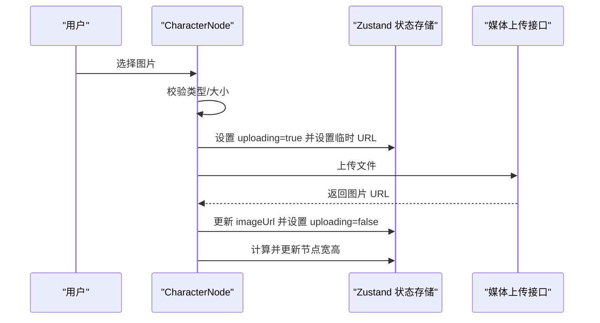
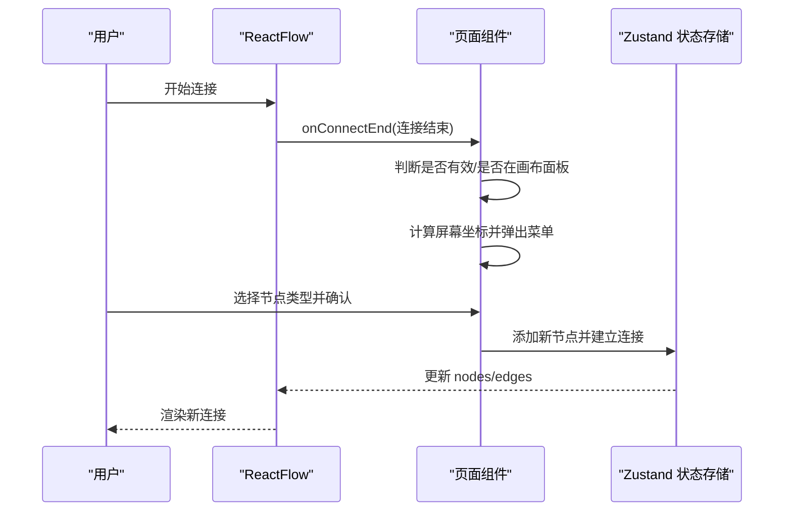
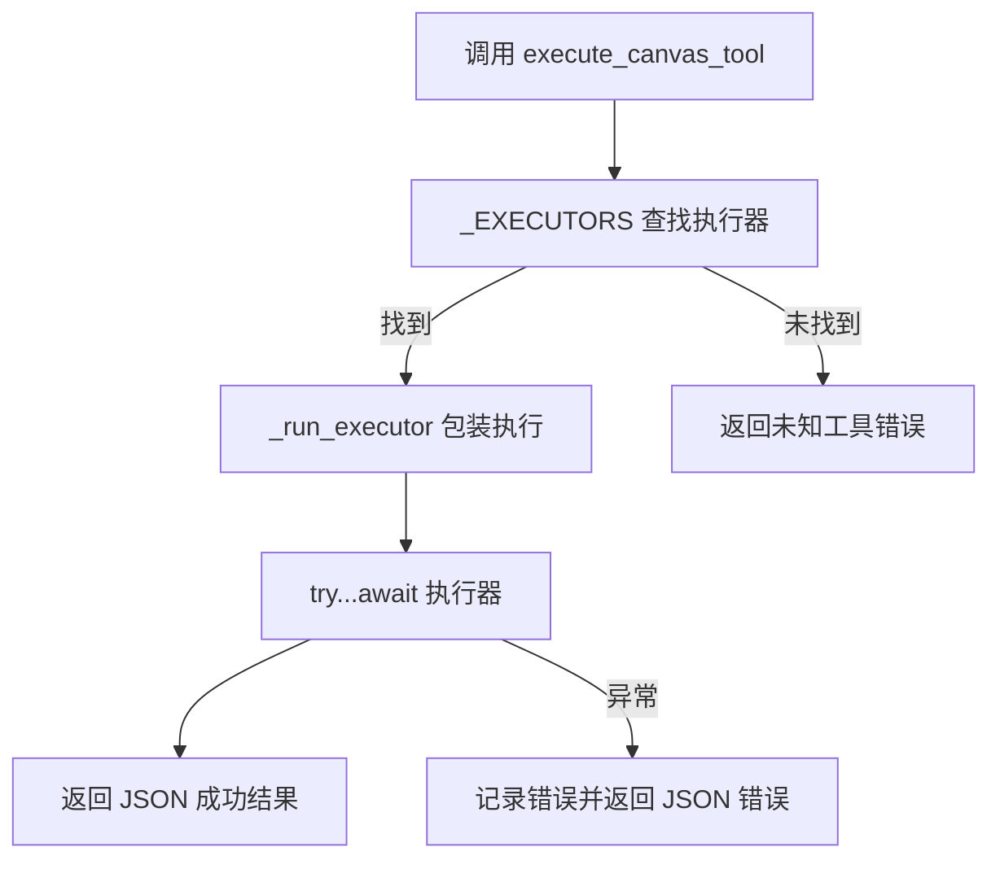
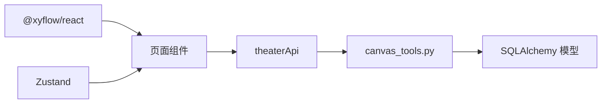

# 画布工具集成

<cite>
**本文档引用的文件**
- [TheaterCanvas.tsx](file://frontend/src/components/TheaterCanvas.tsx)
- [useCanvasStore.ts](file://frontend/src/store/useCanvasStore.ts)
- [canvas_tools.py](file://backend/services/canvas_tools.py)
- [CharacterNode.tsx](file://frontend/src/components/canvas/CharacterNode.tsx)
- [ScriptNode.tsx](file://frontend/src/components/canvas/ScriptNode.tsx)
- [CustomEdge.tsx](file://frontend/src/components/canvas/CustomEdge.tsx)
- [page.tsx](file://frontend/src/app/theater/[id]/page.tsx)
- [graphUtils.ts](file://frontend/src/lib/graphUtils.ts)
- [PivotEditor.tsx](file://frontend/src/components/canvas/pivot/PivotEditor.tsx)
- [useCanvasDragDrop.ts](file://frontend/src/app/theater/[id]/hooks/useCanvasDragDrop.ts)
- [useCanvasShortcuts.ts](file://frontend/src/app/theater/[id]/hooks/useCanvasShortcuts.ts)
- [theaterApi.ts](file://frontend/src/lib/theaterApi.ts)
</cite>

## 目录
1. [简介](#简介)
2. [项目结构](#项目结构)
3. [核心组件](#核心组件)
4. [架构总览](#架构总览)
5. [详细组件分析](#详细组件分析)
6. [依赖关系分析](#依赖关系分析)
7. [性能考虑](#性能考虑)
8. [故障排除指南](#故障排除指南)
9. [结论](#结论)
10. [附录](#附录)

## 简介
本文件系统性阐述“画布工具集成”的设计与实现，涵盖前端 React Flow 画布、节点操作工具、连接管理工具以及画布状态维护机制。文档重点解释以下方面：
- 画布工具的架构设计与职责划分
- 前端与后端的双向数据映射与同步策略
- 事件处理、状态同步与用户交互响应流程
- 执行流程：操作捕获、数据转换与结果反馈
- 自定义画布工具开发、事件监听与状态管理实践
- 扩展与性能优化建议

## 项目结构
本项目采用“前端 + 后端”双层架构，前端使用 React + Zustand 状态管理 + React Flow 画布，后端提供画布节点的工具化 CRUD 能力，并通过 REST API 与前端进行数据交换。

图表来源
- [page.tsx:54-484](file://frontend/src/app/theater/[id]/page.tsx#L54-L484)
- [useCanvasStore.ts:185-540](file://frontend/src/store/useCanvasStore.ts#L185-L540)
- [canvas_tools.py:527-590](file://backend/services/canvas_tools.py#L527-L590)
- [theaterApi.ts:107-159](file://frontend/src/lib/theaterApi.ts#L107-L159)

章节来源
- [page.tsx:54-484](file://frontend/src/app/theater/[id]/page.tsx#L54-L484)
- [useCanvasStore.ts:185-540](file://frontend/src/store/useCanvasStore.ts#L185-L540)
- [canvas_tools.py:527-590](file://backend/services/canvas_tools.py#L527-L590)
- [theaterApi.ts:107-159](file://frontend/src/lib/theaterApi.ts#L107-L159)

## 核心组件
- 状态存储与同步
  - 使用 Zustand 管理节点、边、视口、剧院元数据、历史快照与脏标记，提供 onNodesChange/onEdgesChange/onConnect 等回调以驱动 UI 更新与持久化。
  - 提供 loadTheater/syncTheater/saveToBackend 等方法，负责与后端 API 的数据拉取、合并与保存。
- 节点与边组件
  - ScriptNode/CharacterNode 等节点组件封装编辑、上传、尺寸调整、复制与删除等交互；通过 Handle 实现连接入口。
  - CustomEdge 提供贝塞尔曲线边与悬停删除按钮，增强连接交互体验。
- 工具与钩子
  - useCanvasDragDrop/useCanvasShortcuts 抽象拖放与快捷键行为，减少页面组件复杂度。
  - graphUtils.hasCycle 在连接前进行环路检测，保证图结构的有向无环特性。
- 后端画布工具
  - 提供 list/get/create/update/delete 节点工具，基于查找表路由执行器，支持节点类型枚举与字段校验。

章节来源
- [useCanvasStore.ts:185-540](file://frontend/src/store/useCanvasStore.ts#L185-L540)
- [CharacterNode.tsx:13-692](file://frontend/src/components/canvas/CharacterNode.tsx#L13-L692)
- [ScriptNode.tsx:11-351](file://frontend/src/components/canvas/ScriptNode.tsx#L11-L351)
- [CustomEdge.tsx:5-92](file://frontend/src/components/canvas/CustomEdge.tsx#L5-L92)
- [useCanvasDragDrop.ts:6-74](file://frontend/src/app/theater/[id]/hooks/useCanvasDragDrop.ts#L6-L74)
- [useCanvasShortcuts.ts:4-26](file://frontend/src/app/theater/[id]/hooks/useCanvasShortcuts.ts#L4-L26)
- [graphUtils.ts:4-39](file://frontend/src/lib/graphUtils.ts#L4-L39)
- [canvas_tools.py:126-260](file://backend/services/canvas_tools.py#L126-L260)

## 架构总览
前端 React Flow 画布通过 useCanvasStore 统一管理状态，节点与边组件负责用户交互，API 层负责与后端同步。后端通过工具函数实现节点的增删改查，并以查找表路由到具体执行器，确保扩展性与可维护性。

图表来源
- [page.tsx:334-444](file://frontend/src/app/theater/[id]/page.tsx#L334-L444)
- [useCanvasStore.ts:209-254](file://frontend/src/store/useCanvasStore.ts#L209-L254)
- [theaterApi.ts:141-150](file://frontend/src/lib/theaterApi.ts#L141-L150)
- [canvas_tools.py:537-590](file://backend/services/canvas_tools.py#L537-L590)

## 详细组件分析

### 状态存储与同步（useCanvasStore）
- 职责
  - 维护 nodes/edges/viewport 与剧院元数据（ID、标题、保存状态）。
  - 提供 onNodesChange/onEdgesChange/onConnect 回调，应用变更并标记 isDirty。
  - 提供 addNode/deleteNode/deleteEdge/reset 等节点操作。
  - 提供 takeSnapshot/undo/redo 历史回溯能力。
  - 提供 loadTheater/syncTheater/saveToBackend 与后端同步。
- 数据映射
  - nodeToApi/apiToNode 与 edgeToApi/apiToEdge 负责前端与后端数据结构互转。
- 关键流程
  - 连接拦截：禁止自环与环路，使用 hasCycle 检测。
  - 快照策略：每次重大变更（新增/删除/连接）记录历史快照，限制最大长度。
  - 后端保存：防抖 2 秒，避免频繁写入；保存成功后清除脏标记。

图表来源
- [useCanvasStore.ts:238-254](file://frontend/src/store/useCanvasStore.ts#L238-L254)
- [graphUtils.ts:4-39](file://frontend/src/lib/graphUtils.ts#L4-L39)

章节来源
- [useCanvasStore.ts:185-540](file://frontend/src/store/useCanvasStore.ts#L185-L540)

### 节点组件（ScriptNode/CharacterNode）
- ScriptNode
  - 支持双击进入编辑模式，使用 ScriptEditor 内容编辑器；ESC 或点击画布外部退出编辑并保存。
  - 提供复制节点、删除节点、AI 助手占位按钮。
  - 通过 Handle 提供左右连接入口，配合自定义边渲染。
- CharacterNode
  - 支持图片上传、进度反馈、错误提示与本地预览。
  - 图片加载完成后自动计算合理尺寸并更新节点宽高。
  - 支持图片适配模式切换（cover/contain）、全屏预览与拖拽缩放。
  - 提供 AI 编辑入口与复制/删除操作。

图表来源
- [CharacterNode.tsx:126-205](file://frontend/src/components/canvas/CharacterNode.tsx#L126-L205)
- [useCanvasStore.ts:320-329](file://frontend/src/store/useCanvasStore.ts#L320-L329)

章节来源
- [ScriptNode.tsx:11-351](file://frontend/src/components/canvas/ScriptNode.tsx#L11-L351)
- [CharacterNode.tsx:13-692](file://frontend/src/components/canvas/CharacterNode.tsx#L13-L692)

### 边组件与连接管理（CustomEdge）
- 使用贝塞尔曲线绘制边，悬停时边宽加粗并显示删除按钮。
- 通过隐形宽轨道提升鼠标命中区域，改善交互体验。
- 删除按钮点击触发 deleteEdge，移除对应边并派发自定义事件。

章节来源
- [CustomEdge.tsx:5-92](file://frontend/src/components/canvas/CustomEdge.tsx#L5-L92)
- [useCanvasStore.ts:276-288](file://frontend/src/store/useCanvasStore.ts#L276-L288)

### 画布页面与事件集成（page.tsx）
- ReactFlow 初始化与节点/边类型注册，设置默认边样式与连接半径。
- 事件绑定：onNodesChange/onEdgesChange/onConnect/onConnectEnd/onNodeDrag/onNodeDragStop/onMove/onDragOver/onDrop。
- 快捷键：Ctrl+S 保存、Ctrl+Z 撤销、Ctrl+Y/Shift+Z 重做。
- 自动布局与吸附：集成 useAutoLayout/useCanvasSnapping，提供对齐线与网格吸附。
- 菜单系统：连接结束时弹出快速添加菜单，支持从指定 Handle 连接并自动建立新节点。

图表来源
- [page.tsx:118-219](file://frontend/src/app/theater/[id]/page.tsx#L118-L219)
- [useCanvasStore.ts:256-264](file://frontend/src/store/useCanvasStore.ts#L256-L264)

章节来源
- [page.tsx:54-484](file://frontend/src/app/theater/[id]/page.tsx#L54-L484)

### 后端画布工具（canvas_tools.py）
- 工具定义
  - 提供 list_canvas_nodes/get_canvas_node/create_canvas_node/update_canvas_node/delete_canvas_node 五类工具，参数与返回值遵循 OpenAI 函数调用规范。
  - 支持节点类型枚举过滤与字段校验，兼容旧节点类型迁移。
- 执行器
  - 基于查找表 _EXECUTORS 路由到具体执行函数，避免 if-else 分支。
  - _run_executor 统一封装异常处理与日志记录。
- 数据处理
  - _node_summary/_node_full 提供摘要与完整节点表示。
  - _estimate_text_node_size 动态估算文本节点尺寸。
  - _calculate_auto_position 自动定位新节点位置。

图表来源
- [canvas_tools.py:537-590](file://backend/services/canvas_tools.py#L537-L590)

章节来源
- [canvas_tools.py:126-260](file://backend/services/canvas_tools.py#L126-L260)
- [canvas_tools.py:527-590](file://backend/services/canvas_tools.py#L527-L590)

### 剧院 API 封装（theaterApi.ts）
- 定义剧院、节点、边的请求/响应接口，统一前后端数据契约。
- 提供 createTheater/listTheaters/getTheater/updateTheater/deleteTheater/saveCanvas 等方法，封装 HTTP 请求。

章节来源
- [theaterApi.ts:107-159](file://frontend/src/lib/theaterApi.ts#L107-L159)

### 画布钩子（useCanvasDragDrop/useCanvasShortcuts）
- useCanvasDragDrop
  - 处理拖放事件，将外部数据转换为画布节点并添加到状态存储。
  - 支持网格吸附（snapToGrid）与默认尺寸映射。
- useCanvasShortcuts
  - 注册键盘事件，支持撤销/重做快捷键。

章节来源
- [useCanvasDragDrop.ts:6-74](file://frontend/src/app/theater/[id]/hooks/useCanvasDragDrop.ts#L6-L74)
- [useCanvasShortcuts.ts:4-26](file://frontend/src/app/theater/[id]/hooks/useCanvasShortcuts.ts#L4-L26)

### 分镜透视编辑器（PivotEditor）
- 提供字段拖拽配置 Rows/Cols/Values，支持聚合方式配置与排序设置。
- 通过 usePivotEngine 计算透视结果并同步到节点数据（pivotConfig/pivotData）。

章节来源
- [PivotEditor.tsx:22-229](file://frontend/src/components/canvas/pivot/PivotEditor.tsx#L22-L229)

## 依赖关系分析
- 前端依赖
  - @xyflow/react：提供画布、节点、边、Handle、背景、迷你地图等能力。
  - Zustand：提供轻量级状态管理，支持持久化与中间件。
  - 自定义组件：节点/边/工具栏/快捷键钩子等。
- 后端依赖
  - SQLAlchemy：异步 ORM 操作数据库。
  - 工具函数：基于查找表的路由与执行器模式，便于扩展新的画布工具。

图表来源
- [page.tsx:18-47](file://frontend/src/app/theater/[id]/page.tsx#L18-L47)
- [useCanvasStore.ts:2-24](file://frontend/src/store/useCanvasStore.ts#L2-L24)
- [canvas_tools.py:14-17](file://backend/services/canvas_tools.py#L14-L17)

章节来源
- [page.tsx:18-47](file://frontend/src/app/theater/[id]/page.tsx#L18-L47)
- [useCanvasStore.ts:2-24](file://frontend/src/store/useCanvasStore.ts#L2-L24)
- [canvas_tools.py:14-17](file://backend/services/canvas_tools.py#L14-L17)

## 性能考虑
- 状态更新与渲染
  - 使用 applyNodeChanges/applyEdgeChanges 应用变更，避免不必要的重渲染。
  - 对维度更新（updateNodeDimensions）不频繁拍快照，降低历史栈压力。
- 保存策略
  - 保存防抖 2 秒，减少网络请求频率；isSaving 标记避免并发保存。
- 图结构校验
  - 连接前使用 hasCycle 检测环路，避免构建复杂图导致的渲染与算法开销。
- 资源加载
  - 图片上传采用本地临时 URL 预览，加载完成后计算合理尺寸，避免反复测量。
- 组件优化
  - 节点组件使用 memo 包裹，减少重复渲染。
  - 自定义边使用隐形宽轨道提升命中率，减少事件处理开销。

## 故障排除指南
- 连接被阻止
  - 症状：连接时无反应或控制台警告。
  - 原因：自环或环路检测触发。
  - 处理：检查起点与终点是否相同；使用撤销恢复到无环状态。
- 保存失败
  - 症状：保存按钮旋转且状态未更新。
  - 原因：网络异常或后端错误。
  - 处理：查看浏览器开发者工具 Network 面板；确认 isSaving 标记恢复；重试保存。
- 图片上传失败
  - 症状：上传进度条不动或出现错误提示。
  - 原因：文件类型/大小不合法、网络错误。
  - 处理：检查文件类型与大小限制；确认 Authorization 头正确；重试上传。
- 节点尺寸异常
  - 症状：节点过大或过小。
  - 原因：图片自然尺寸过大或计算逻辑偏差。
  - 处理：手动调整尺寸或等待自动计算；检查 handleImageLoad 逻辑。

章节来源
- [useCanvasStore.ts:238-254](file://frontend/src/store/useCanvasStore.ts#L238-L254)
- [CharacterNode.tsx:126-205](file://frontend/src/components/canvas/CharacterNode.tsx#L126-L205)
- [CustomEdge.tsx:29-32](file://frontend/src/components/canvas/CustomEdge.tsx#L29-L32)

## 结论
本项目通过 React Flow 与 Zustand 构建了高可用的画布工具体系，结合后端工具服务实现了节点的全生命周期管理。前端负责交互与状态同步，后端提供稳定的工具执行与数据持久化，二者通过清晰的 API 约定协同工作。通过历史快照、环路检测、保存防抖与组件优化等手段，系统在易用性与性能之间取得了良好平衡。后续可在工具扩展、渲染性能与协作能力方面持续演进。

## 附录
- 自定义画布工具开发步骤
  - 在前端：在 useCanvasStore 中注册节点/边类型与默认数据，必要时扩展 onConnect/onNodesChange 回调。
  - 在后端：在 canvas_tools.py 中新增工具定义与执行器，加入 _EXECUTORS 路由表。
  - 在页面：在 ReactFlow 的 nodeTypes/edgeTypes 中注册新组件，确保 Handle 与事件处理一致。
- 事件监听与状态管理最佳实践
  - 使用持久化中间件保存关键状态（nodes/edges/viewport），避免刷新丢失。
  - 对高频变更（如拖拽）采用节流/防抖策略，减少状态更新频率。
  - 通过 isDirty/isSaving 等标记明确用户感知的状态变化。
- 扩展与优化建议
  - 工具扩展：新增工具时保持参数与返回值的标准化，便于 LLM 调用与日志追踪。
  - 渲染优化：对大型图采用虚拟滚动或分页加载；对复杂节点采用懒加载与缓存。
  - 协作能力：引入实时同步（WebSocket）与冲突解决策略，支持多人协作编辑。