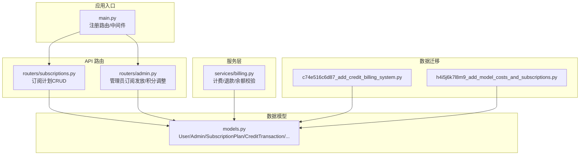
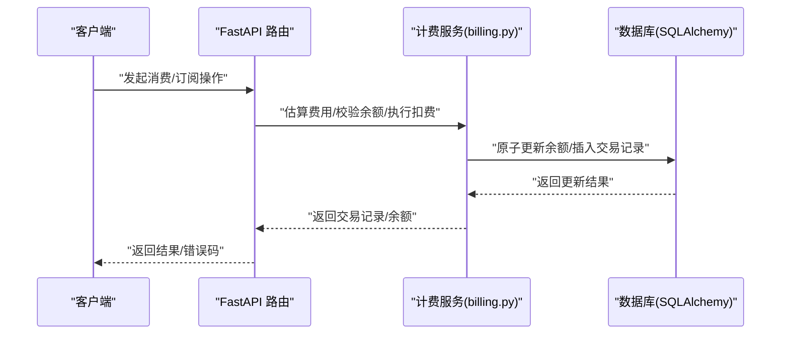
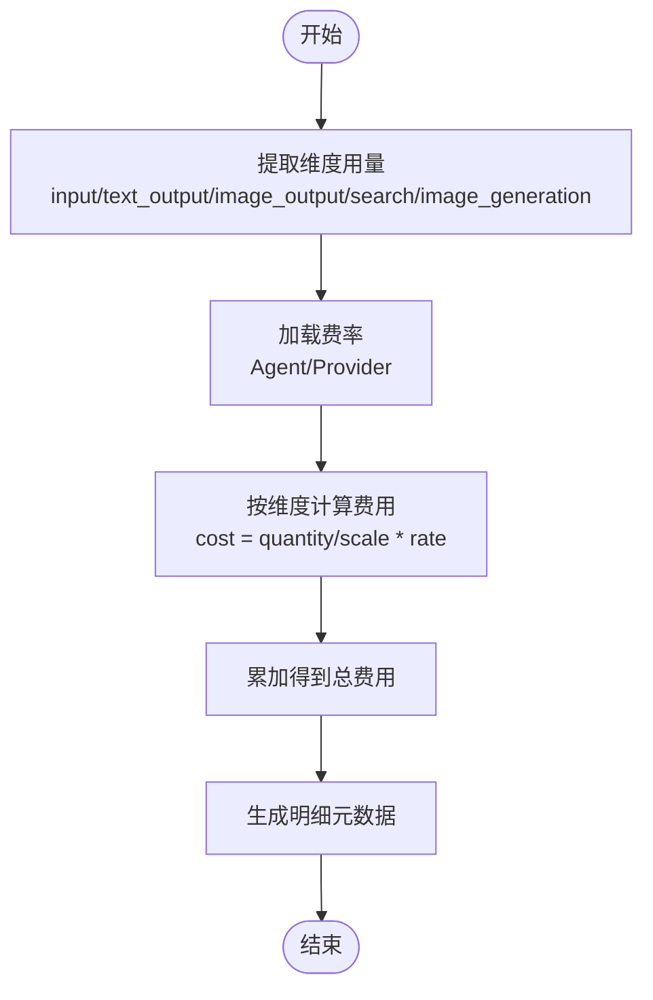
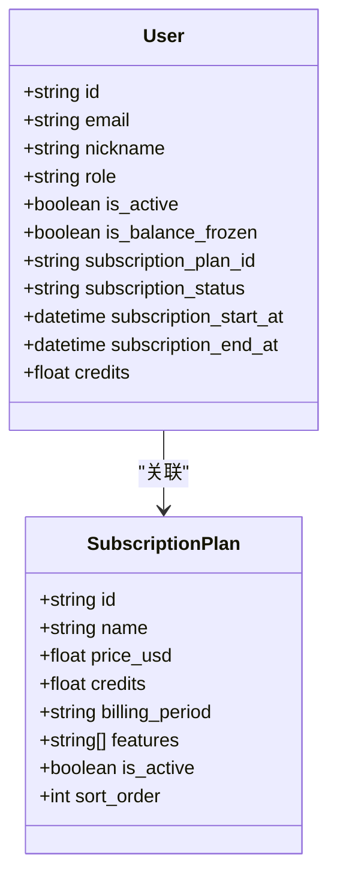
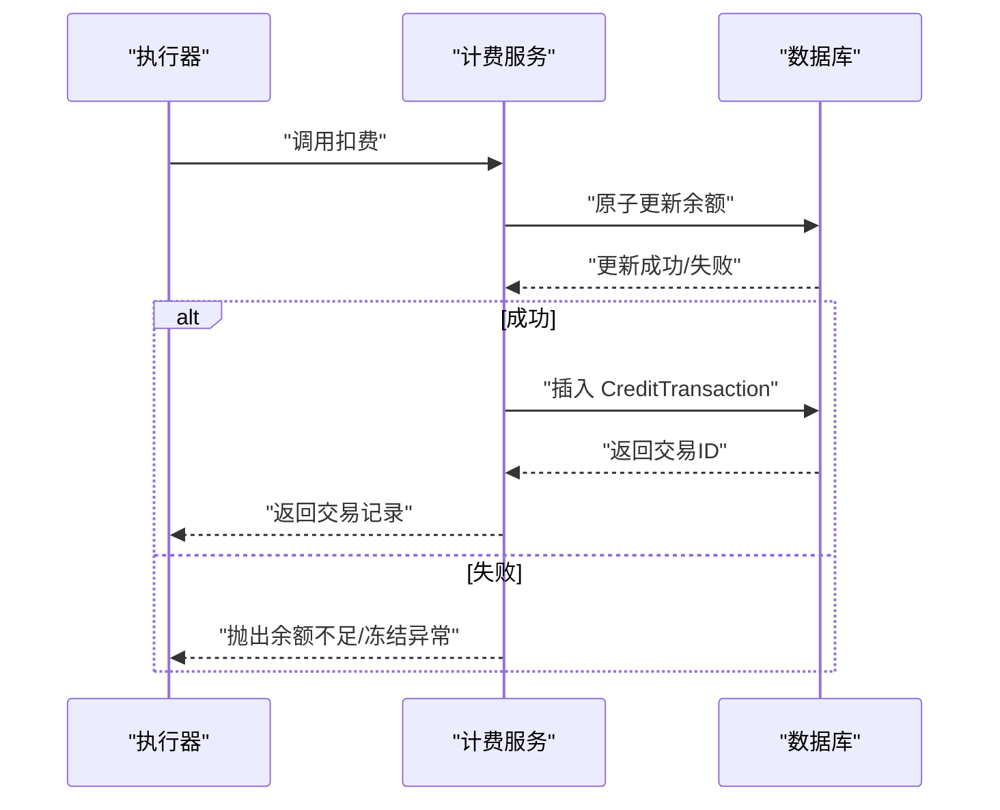
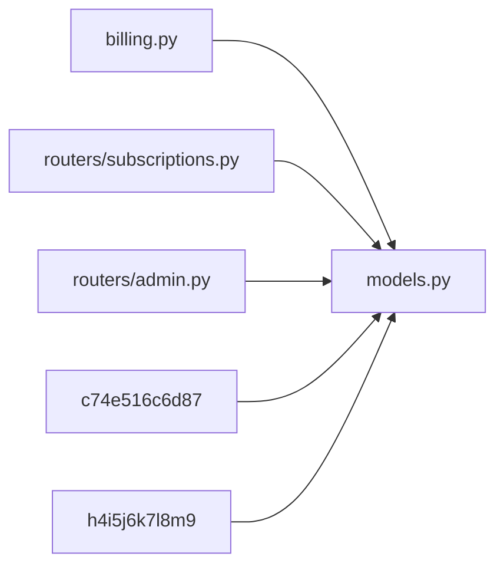
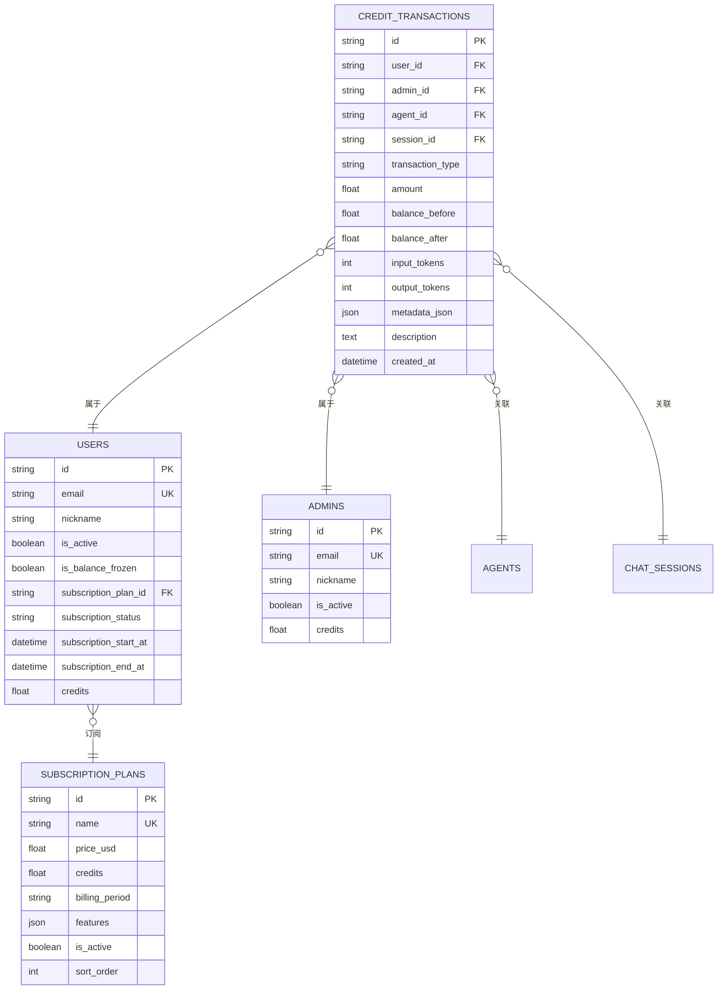

# 计费订阅服务

<cite>
**本文档引用的文件**
- [billing.py](file://backend/services/billing.py)
- [models.py](file://backend/models.py)
- [schemas.py](file://backend/schemas.py)
- [subscriptions.py](file://backend/routers/subscriptions.py)
- [admin.py](file://backend/routers/admin.py)
- [BILLING_REVIEW.md](file://backend/docs/BILLING_REVIEW.md)
- [c74e516c6d87_add_credit_billing_system.py](file://backend/migrations/versions/c74e516c6d87_add_credit_billing_system.py)
- [h4i5j6k7l8m9_add_model_costs_and_subscriptions.py](file://backend/migrations/versions/h4i5j6k7l8m9_add_model_costs_and_subscriptions.py)
- [main.py](file://backend/main.py)
</cite>

## 目录
1. [简介](#简介)
2. [项目结构](#项目结构)
3. [核心组件](#核心组件)
4. [架构概览](#架构概览)
5. [详细组件分析](#详细组件分析)
6. [依赖分析](#依赖分析)
7. [性能考量](#性能考量)
8. [故障排查指南](#故障排查指南)
9. [结论](#结论)
10. [附录](#附录)

## 简介
本文件面向计费订阅服务的实现与运维，聚焦以下目标：
- 积分计算算法：成本模型、维度映射、费率管理与折扣策略
- 订阅管理：计划配置、状态跟踪与自动续费
- 账单生成：消费记录、对账单创建与支付处理
- 实战示例：API 调用、错误处理与审计日志
- 安全与合规：并发控制、精度保障与审计追踪

## 项目结构
后端采用 FastAPI + SQLAlchemy 异步 ORM，计费与订阅相关的核心模块如下：
- 服务层：计费与退款逻辑位于 billing.py
- 数据模型：用户、管理员、订阅计划、任务、交易流水等位于 models.py
- API 路由：订阅计划 CRUD 与管理员订阅发放位于 routers/subscriptions.py 与 routers/admin.py
- 数据迁移：积分系统与订阅计划迁移脚本位于 migrations/versions
- 文档：计费审查报告位于 docs/BILLING_REVIEW.md
- 应用入口：注册路由与中间件位于 main.py

图表来源
- [main.py:138-152](file://backend/main.py#L138-L152)
- [subscriptions.py:14-18](file://backend/routers/subscriptions.py#L14-L18)
- [admin.py:240-279](file://backend/routers/admin.py#L240-L279)
- [billing.py:1-11](file://backend/services/billing.py#L1-L11)
- [models.py:10-447](file://backend/models.py#L10-L447)
- [c74e516c6d87_add_credit_billing_system.py:21-67](file://backend/migrations/versions/c74e516c6d87_add_credit_billing_system.py#L21-L67)
- [h4i5j6k7l8m9_add_model_costs_and_subscriptions.py:21-54](file://backend/migrations/versions/h4i5j6k7l8m9_add_model_costs_and_subscriptions.py#L21-L54)

章节来源
- [main.py:138-152](file://backend/main.py#L138-L152)
- [models.py:10-447](file://backend/models.py#L10-L447)

## 核心组件
- 计费服务（billing.py）
  - 余额校验：check_balance_sufficient
  - 原子扣费：deduct_credits_atomic
  - 原子退款：refund_credits_atomic
  - 文本/图像/搜索/视频计费：calculate_credit_cost、calculate_video_credit_cost
- 数据模型（models.py）
  - User/Admin：积分余额、订阅状态与时间
  - SubscriptionPlan：订阅计划配置
  - CreditTransaction：积分交易流水
  - Agent：按维度的费率字段
  - VideoTask：视频任务计费字段
- API 路由（routers）
  - 订阅计划 CRUD：subscriptions.py
  - 管理员订阅发放与积分调整：admin.py
- 迁移脚本（migrations/versions）
  - 积分系统与交易表
  - 订阅计划表与供应商模型成本

章节来源
- [billing.py:45-308](file://backend/services/billing.py#L45-L308)
- [models.py:35-447](file://backend/models.py#L35-L447)
- [subscriptions.py:21-118](file://backend/routers/subscriptions.py#L21-L118)
- [admin.py:240-279](file://backend/routers/admin.py#L240-L279)
- [c74e516c6d87_add_credit_billing_system.py:21-67](file://backend/migrations/versions/c74e516c6d87_add_credit_billing_system.py#L21-L67)
- [h4i5j6k7l8m9_add_model_costs_and_subscriptions.py:21-54](file://backend/migrations/versions/h4i5j6k7l8m9_add_model_costs_and_subscriptions.py#L21-L54)

## 架构概览
计费订阅服务围绕“维度化计费 + 原子交易 + 订阅计划”的设计展开，核心流程如下：

图表来源
- [billing.py:178-308](file://backend/services/billing.py#L178-L308)
- [admin.py:240-279](file://backend/routers/admin.py#L240-L279)

## 详细组件分析

### 计费算法与成本模型
- 维度映射与费率
  - 文本类：input/output/image_output，按每百万 tokens 计费
  - 搜索类：按查询次数计费
  - 图像生成：按生成张数计费
  - 视频类：按输入图片张数、输入时长、输出时长（不同质量维度）计费
- 计算流程
  - 从结果对象提取各维度用量
  - 读取 Agent/Provider 的费率字段
  - 用量/缩放比例×费率累加得到总费用
  - 生成包含维度用量与费率的明细元数据
- 原子扣费与退款
  - 扣费：使用 UPDATE ... WHERE ... 一次性原子更新余额，失败则抛出余额不足或冻结异常
  - 退款：原子增加余额并记录交易
  - 余额校验：在执行前检查余额与冻结状态，避免竞态

图表来源
- [billing.py:310-350](file://backend/services/billing.py#L310-L350)
- [billing.py:353-387](file://backend/services/billing.py#L353-L387)

章节来源
- [billing.py:12-35](file://backend/services/billing.py#L12-L35)
- [billing.py:310-387](file://backend/services/billing.py#L310-L387)

### 订阅管理与自动续费
- 计划配置
  - 名称唯一、描述、价格、包含积分、计费周期、特性列表、排序与激活状态
- 状态跟踪
  - 用户表包含订阅计划 ID、状态、起止时间
- 自动续费
  - 当前实现：管理员发放订阅计划并可选择自动发放积分；未见自动续费触发逻辑
  - 建议：在到期前通过后台任务检查并续期，或集成支付网关回调

图表来源
- [models.py:369-389](file://backend/models.py#L369-L389)
- [models.py:35-73](file://backend/models.py#L35-L73)

章节来源
- [subscriptions.py:21-118](file://backend/routers/subscriptions.py#L21-L118)
- [admin.py:240-279](file://backend/routers/admin.py#L240-L279)
- [models.py:369-389](file://backend/models.py#L369-L389)
- [models.py:35-73](file://backend/models.py#L35-L73)

### 账单生成与支付处理
- 消费记录
  - 扣费成功后创建 CreditTransaction，记录类型、金额、余额前后值、元数据与描述
- 对账单创建
  - 交易表包含用户/会话/智能体关联，便于对账与报表
- 支付处理
  - 当前未见支付网关集成；管理员可手动发放积分或进行调整
  - 建议：接入 Stripe/支付宝等，结合 Webhook 同步支付状态

图表来源
- [billing.py:178-308](file://backend/services/billing.py#L178-L308)
- [models.py:261-281](file://backend/models.py#L261-L281)

章节来源
- [billing.py:178-308](file://backend/services/billing.py#L178-L308)
- [models.py:261-281](file://backend/models.py#L261-L281)

### API 示例与错误处理
- 订阅计划管理
  - 创建/查询/更新/删除订阅计划
  - 管理员权限校验
- 用户订阅发放
  - 设置用户订阅计划、状态与有效期
  - 可选自动发放积分并记录交易
- 错误处理
  - 余额不足：抛出 InsufficientCreditsError
  - 余额冻结：抛出 BalanceFrozenError
  - 事务一致性：原子更新与回滚

章节来源
- [subscriptions.py:21-118](file://backend/routers/subscriptions.py#L21-L118)
- [admin.py:240-279](file://backend/routers/admin.py#L240-L279)
- [billing.py:37-43](file://backend/services/billing.py#L37-L43)

### 审计日志与合规
- 审计字段
  - CreditTransaction：类型、金额、余额前后值、元数据、描述、创建时间
  - User/Admin：登录时间/IP、操作统计
- 合规建议
  - 交易去重：为会话/任务添加唯一键，避免重复计费
  - 精度保障：迁移列类型为 DECIMAL/Integer，避免浮点误差
  - 并发安全：使用原子更新，避免竞态条件
  - 报表索引：为 created_at、user_id 建立索引，提升查询性能

章节来源
- [models.py:261-281](file://backend/models.py#L261-L281)
- [BILLING_REVIEW.md:129-196](file://backend/docs/BILLING_REVIEW.md#L129-L196)

## 依赖分析
- 组件耦合
  - billing.py 依赖 models.User/Admin 与 CreditTransaction
  - routers/subscriptions.py 与 routers/admin.py 依赖 models.SubscriptionPlan/User
  - 迁移脚本定义表结构与字段
- 外部依赖
  - FastAPI、SQLAlchemy、Alembic
  - 日志与 CORS 中间件

图表来源
- [billing.py:8](file://backend/services/billing.py#L8)
- [models.py:10-447](file://backend/models.py#L10-L447)
- [c74e516c6d87_add_credit_billing_system.py:21-67](file://backend/migrations/versions/c74e516c6d87_add_credit_billing_system.py#L21-L67)
- [h4i5j6k7l8m9_add_model_costs_and_subscriptions.py:21-54](file://backend/migrations/versions/h4i5j6k7l8m9_add_model_costs_and_subscriptions.py#L21-L54)

章节来源
- [billing.py:8](file://backend/services/billing.py#L8)
- [models.py:10-447](file://backend/models.py#L10-L447)

## 性能考量
- 原子更新：使用 UPDATE ... WHERE ... 一次性更新余额，避免竞态与死锁
- 并发控制：在高并发场景下，建议引入行级锁或队列化扣费
- 精度保障：将金额字段迁移到 DECIMAL/Integer，减少浮点误差累积
- 索引优化：为 user_id、created_at 建立索引，提升交易查询效率

## 故障排查指南
- 余额不足
  - 现象：抛出 InsufficientCreditsError
  - 排查：确认用户余额、冻结状态与预估费用
- 余额冻结
  - 现象：抛出 BalanceFrozenError
  - 排查：检查 is_balance_frozen 字段与管理员操作
- 交易重复
  - 现象：重复计费
  - 排查：为会话/任务添加唯一键，避免幂等性问题
- 精度误差
  - 现象：累计误差
  - 排查：执行 DECIMAL 迁移脚本

章节来源
- [billing.py:258-287](file://backend/services/billing.py#L258-L287)
- [BILLING_REVIEW.md:129-196](file://backend/docs/BILLING_REVIEW.md#L129-L196)

## 结论
本计费订阅服务以“维度化计费 + 原子交易 + 订阅计划”为核心，具备清晰的成本模型与完善的交易审计能力。当前仍存在过期机制、退款机制与自动续费等缺口，建议结合支付网关与后台任务逐步补齐，并在数据精度与并发安全方面持续优化。

## 附录
- 数据模型概览

图表来源
- [models.py:35-447](file://backend/models.py#L35-L447)