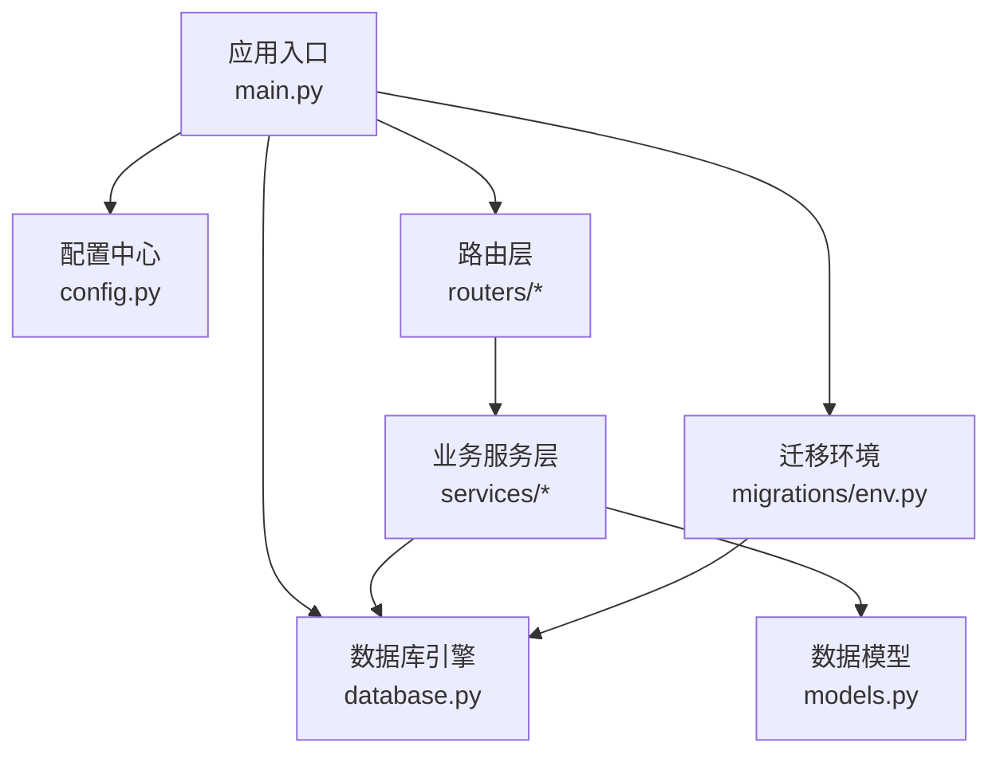
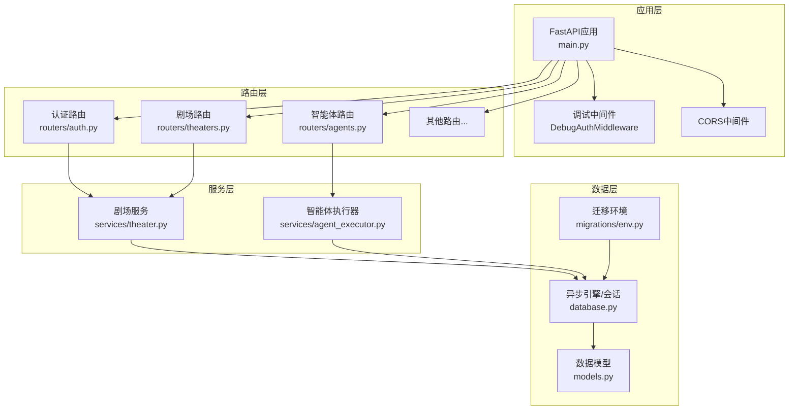
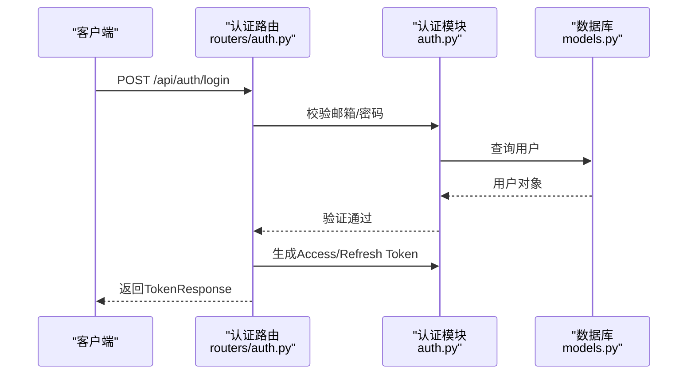
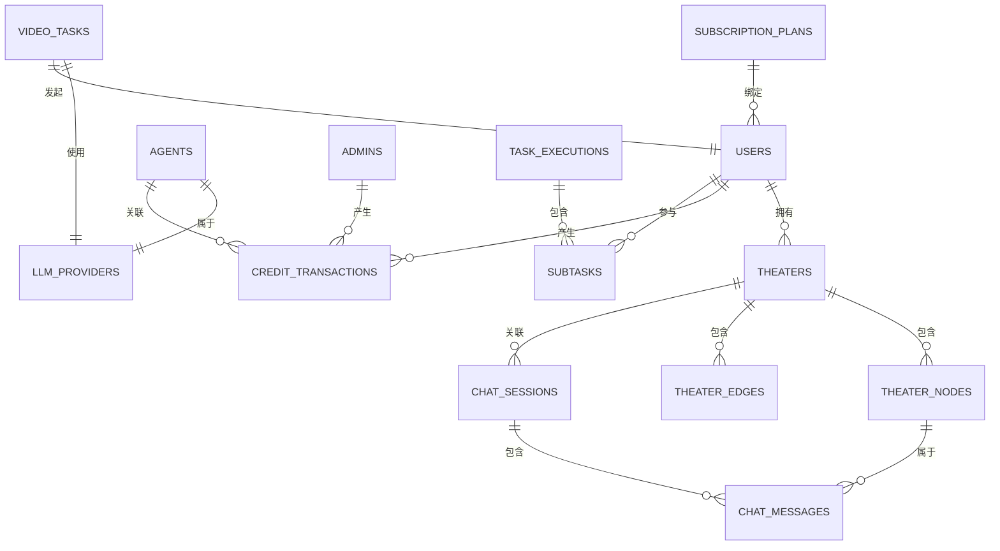
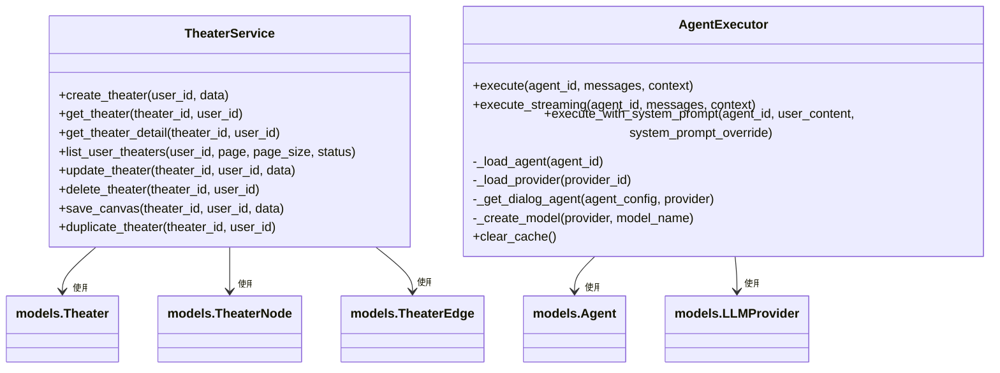
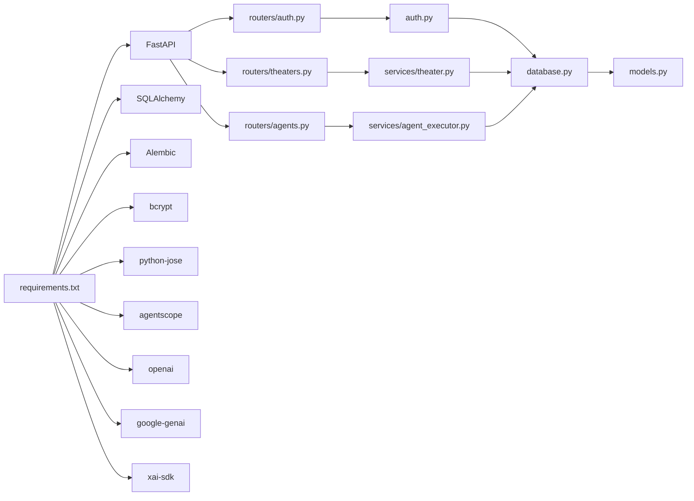

# 后端服务架构

<cite>
**本文引用的文件**
- [backend/main.py](file://backend/main.py)
- [backend/config.py](file://backend/config.py)
- [backend/database.py](file://backend/database.py)
- [backend/models.py](file://backend/models.py)
- [backend/auth.py](file://backend/auth.py)
- [backend/schemas.py](file://backend/schemas.py)
- [backend/routers/auth.py](file://backend/routers/auth.py)
- [backend/routers/theaters.py](file://backend/routers/theaters.py)
- [backend/routers/agents.py](file://backend/routers/agents.py)
- [backend/services/theater.py](file://backend/services/theater.py)
- [backend/services/agent_executor.py](file://backend/services/agent_executor.py)
- [backend/migrations/env.py](file://backend/migrations/env.py)
- [backend/requirements.txt](file://backend/requirements.txt)
</cite>

## 目录
1. [简介](#简介)
2. [项目结构](#项目结构)
3. [核心组件](#核心组件)
4. [架构总览](#架构总览)
5. [详细组件分析](#详细组件分析)
6. [依赖关系分析](#依赖关系分析)
7. [性能考量](#性能考量)
8. [故障排查指南](#故障排查指南)
9. [结论](#结论)
10. [附录](#附录)

## 简介
本文件面向Infinite Game后端服务，围绕FastAPI应用的配置与生命周期管理、中间件与CORS设置、路由注册、认证与授权体系、数据模型设计、API路由层组织、业务服务层职责以及数据库设计与迁移管理进行系统化梳理。目标是帮助开发者快速理解并高效维护该后端服务。

## 项目结构
后端采用“FastAPI + SQLAlchemy异步ORM + Alembic迁移”的技术栈，代码按功能域分层组织：
- 应用入口与生命周期：backend/main.py
- 配置中心：backend/config.py
- 数据库引擎与会话：backend/database.py
- 数据模型：backend/models.py
- 认证与授权：backend/auth.py
- Pydantic数据契约：backend/schemas.py
- 路由层：backend/routers/*
- 业务服务层：backend/services/*
- 数据库迁移：backend/migrations/*

图表来源
- [backend/main.py:110-152](file://backend/main.py#L110-L152)
- [backend/config.py:7-42](file://backend/config.py#L7-L42)
- [backend/database.py:1-31](file://backend/database.py#L1-L31)
- [backend/migrations/env.py:13-32](file://backend/migrations/env.py#L13-L32)

章节来源
- [backend/main.py:110-152](file://backend/main.py#L110-L152)
- [backend/config.py:7-42](file://backend/config.py#L7-L42)
- [backend/database.py:1-31](file://backend/database.py#L1-L31)
- [backend/migrations/env.py:13-32](file://backend/migrations/env.py#L13-L32)

## 核心组件
- FastAPI应用与生命周期
  - 使用lifespan钩子在启动阶段完成数据库连接重试、自动迁移、叙事引擎初始化与媒体目录准备。
  - 提供调试中间件记录Authorization头与Origin，便于前后端联调。
- 中间件与CORS
  - 注册CORSMiddleware，允许本地开发源与凭证传递。
- 路由注册
  - 动态include_router注册认证、剧场、智能体、聊天、编排、媒体、订阅、提示词模板、视频、技能等路由模块。
- 认证与授权
  - 用户JWT：密码哈希、Access/Refresh Token签发与校验、依赖注入获取当前用户/激活用户。
  - 管理员JWT：独立admins表，管理员依赖注入与权限校验。
  - 通用主体：支持用户/管理员二合一的依赖解析与行级隔离。
- 数据模型
  - 用户、管理员、剧场、剧场节点/边、资产、LLM提供商、聊天会话/消息、智能体、积分交易、任务执行/子任务、订阅计划、视频任务、管理员调试会话/消息等。
- 业务服务
  - 剧场服务：剧场、节点、边的增删改查与画布全量同步、复制。
  - 智能体执行器：统一代理执行封装、流式输出、缓存、计费成本计算。
- 数据库与迁移
  - 异步引擎、连接池、SQLite/PostgreSQL双栈；Alembic在线/离线迁移，含临时表清理。

章节来源
- [backend/main.py:49-108](file://backend/main.py#L49-L108)
- [backend/main.py:119-136](file://backend/main.py#L119-L136)
- [backend/main.py:138-152](file://backend/main.py#L138-L152)
- [backend/auth.py:19-75](file://backend/auth.py#L19-L75)
- [backend/auth.py:83-114](file://backend/auth.py#L83-L114)
- [backend/auth.py:119-151](file://backend/auth.py#L119-L151)
- [backend/auth.py:162-210](file://backend/auth.py#L162-L210)
- [backend/models.py:10-447](file://backend/models.py#L10-L447)
- [backend/services/theater.py:13-285](file://backend/services/theater.py#L13-L285)
- [backend/services/agent_executor.py:63-277](file://backend/services/agent_executor.py#L63-L277)
- [backend/migrations/env.py:39-120](file://backend/migrations/env.py#L39-L120)

## 架构总览
下图展示了应用启动、中间件、路由与服务层的交互关系：

图表来源
- [backend/main.py:110-152](file://backend/main.py#L110-L152)
- [backend/routers/auth.py:30-33](file://backend/routers/auth.py#L30-L33)
- [backend/routers/theaters.py:14-17](file://backend/routers/theaters.py#L14-L17)
- [backend/routers/agents.py:10-14](file://backend/routers/agents.py#L10-L14)
- [backend/services/theater.py:13-15](file://backend/services/theater.py#L13-L15)
- [backend/services/agent_executor.py:69-72](file://backend/services/agent_executor.py#L69-L72)
- [backend/database.py:1-31](file://backend/database.py#L1-L31)
- [backend/migrations/env.py:13-32](file://backend/migrations/env.py#L13-L32)

## 详细组件分析

### FastAPI应用与生命周期管理
- 启停流程
  - 启动前：设置事件循环策略（Windows）、日志级别、关闭SQLAlchemy/uvicorn冗余日志。
  - 生命周期：lifespan中进行数据库连接重试、条件性运行Alembic迁移（含残留临时表清理）、叙事引擎配置加载、媒体目录创建。
- 中间件
  - 调试中间件：记录请求方法、路径、Origin与Authorization头，便于定位鉴权问题。
  - CORS：允许本地开发域名与凭证传递。
- 路由注册
  - include_router集中注册各模块路由，便于扩展与维护。
- WebSocket
  - 提供/ws/{user_id}回显接口，便于测试连接。

章节来源
- [backend/main.py:15-30](file://backend/main.py#L15-L30)
- [backend/main.py:49-108](file://backend/main.py#L49-L108)
- [backend/main.py:119-136](file://backend/main.py#L119-L136)
- [backend/main.py:138-152](file://backend/main.py#L138-L152)
- [backend/main.py:160-170](file://backend/main.py#L160-L170)

### 认证与授权系统
- 密码与Token
  - bcrypt哈希与校验；JWT签名算法与过期时间配置；Access/Refresh Token签发与解码。
- 依赖注入
  - 获取当前用户/激活用户、获取当前管理员/激活管理员、通用主体解析（用户/管理员二合一）。
- 权限与隔离
  - scoped_query对用户与管理员进行行级隔离：普通用户仅可见自身数据，管理员可见全部。
- 管理员系统
  - admins表独立存储管理员信息，支持权限等级与活跃状态。

图表来源
- [backend/routers/auth.py:63-99](file://backend/routers/auth.py#L63-L99)
- [backend/auth.py:83-114](file://backend/auth.py#L83-L114)

章节来源
- [backend/auth.py:19-75](file://backend/auth.py#L19-L75)
- [backend/auth.py:83-114](file://backend/auth.py#L83-L114)
- [backend/auth.py:119-151](file://backend/auth.py#L119-L151)
- [backend/auth.py:162-210](file://backend/auth.py#L162-L210)
- [backend/routers/auth.py:36-136](file://backend/routers/auth.py#L36-L136)

### 数据模型设计
- 实体关系概览
  - 用户与剧场：一对多；剧场包含节点与边。
  - 智能体与提供商：多对一；智能体支持多种能力与定价。
  - 聊天会话与消息：一对多；支持剧场上下文关联。
  - 任务执行与子任务：树形结构；记录Token用量与积分消耗。
  - 订阅计划与用户：多对一；用户可绑定订阅状态。
  - 管理员与积分交易：多对多（通过外键）；审计与计费。
  - 视频任务：异步生成跟踪与计费。
  - 管理员调试会话/消息：与普通会话隔离。
- 关键字段与约束
  - UUID主键、唯一索引（如email）、JSON字段承载动态配置与数据。
  - 外键约束保证级联删除（如剧场删除级联节点/边）。
  - 时间戳字段记录创建与更新。

图表来源
- [backend/models.py:35-447](file://backend/models.py#L35-L447)

章节来源
- [backend/models.py:10-447](file://backend/models.py#L10-L447)

### API路由层组织
- 认证路由
  - 注册、登录、刷新、个人信息查询。
- 剧场路由
  - 创建、列表、详情、更新、删除、画布保存、复制剧场。
- 智能体路由
  - 管理员创建/更新/删除；通用列表/详情；提供者与模型可用性校验。
- 其他路由
  - 聊天、编排、媒体、订阅、提示词模板、视频、技能等，均以模块化方式注册。

章节来源
- [backend/routers/auth.py:30-136](file://backend/routers/auth.py#L30-L136)
- [backend/routers/theaters.py:14-110](file://backend/routers/theaters.py#L14-L110)
- [backend/routers/agents.py:10-151](file://backend/routers/agents.py#L10-L151)

### 业务服务层职责
- 剧场服务
  - 负责剧场元数据、节点与边的全量同步（集合运算分类create/update/delete）、复制剧场（含ID映射与重映射）。
- 智能体执行器
  - 统一封装对话代理执行，支持流式输出；根据提供商类型选择模型；缓存模型与代理实例；计算Token用量与积分成本。

图表来源
- [backend/services/theater.py:13-285](file://backend/services/theater.py#L13-L285)
- [backend/services/agent_executor.py:63-277](file://backend/services/agent_executor.py#L63-L277)

章节来源
- [backend/services/theater.py:13-285](file://backend/services/theater.py#L13-L285)
- [backend/services/agent_executor.py:63-277](file://backend/services/agent_executor.py#L63-L277)

### 数据库设计与迁移管理
- 引擎与会话
  - 异步引擎、连接池参数、SQLite线程安全参数、自动重连。
- 迁移环境
  - 在线/离线迁移、渲染批处理模式、残留临时表清理。
- 迁移策略
  - 应用启动时可选择执行迁移；失败时尝试清理临时表后重试。

章节来源
- [backend/database.py:1-31](file://backend/database.py#L1-L31)
- [backend/migrations/env.py:39-120](file://backend/migrations/env.py#L39-L120)
- [backend/main.py:49-97](file://backend/main.py#L49-L97)

## 依赖关系分析
- 外部依赖
  - FastAPI、Uvicorn、SQLAlchemy、Pydantic、Alembic、Redis、Websockets、bcrypt、python-jose、agentscope、openai、google-genai、xai-sdk等。
- 内部依赖
  - 路由依赖服务层；服务层依赖数据库与模型；认证模块贯穿路由与服务层。

图表来源
- [backend/requirements.txt:1-28](file://backend/requirements.txt#L1-L28)
- [backend/routers/auth.py:1-26](file://backend/routers/auth.py#L1-L26)
- [backend/routers/theaters.py:1-12](file://backend/routers/theaters.py#L1-L12)
- [backend/routers/agents.py:1-8](file://backend/routers/agents.py#L1-L8)
- [backend/auth.py:1-15](file://backend/auth.py#L1-L15)
- [backend/services/theater.py:1-10](file://backend/services/theater.py#L1-L10)
- [backend/services/agent_executor.py:1-16](file://backend/services/agent_executor.py#L1-L16)
- [backend/database.py:1-31](file://backend/database.py#L1-L31)
- [backend/models.py:1-4](file://backend/models.py#L1-L4)

章节来源
- [backend/requirements.txt:1-28](file://backend/requirements.txt#L1-L28)

## 性能考量
- 异步IO与连接池
  - 使用异步引擎与连接池，合理设置pool_pre_ping、pool_size与max_overflow，提升并发与稳定性。
- 缓存与复用
  - 智能体执行器缓存模型与代理实例，降低重复初始化开销。
- 数据同步策略
  - 剧场画布全量同步采用集合运算分类create/update/delete，减少不必要的写操作。
- 日志与可观测性
  - 精简SQLAlchemy与uvicorn日志，保留应用日志；调试中间件记录关键请求信息，辅助定位问题。

## 故障排查指南
- 启动阶段
  - 数据库连接失败：查看重试次数与延迟；确认DATABASE_URL配置；SQLite路径正确。
  - 迁移失败：检查残留临时表并清理后重试；确认Alembic版本与配置。
- 认证问题
  - 401/403：核对Authorization头、Token类型与角色；确认用户/管理员状态有效。
  - 刷新Token：确认token类型为refresh且用户有效。
- 剧场与画布
  - 404：确认剧场归属当前用户；检查theater_id有效性。
  - 画布同步异常：核对节点/边ID集合与映射关系。
- 智能体执行
  - Provider/Model不可用：确认提供商模型列表与前端传参一致性。
  - 流式输出中断：检查网络与上游API稳定性。

章节来源
- [backend/main.py:49-97](file://backend/main.py#L49-L97)
- [backend/routers/auth.py:63-136](file://backend/routers/auth.py#L63-L136)
- [backend/routers/theaters.py:20-110](file://backend/routers/theaters.py#L20-L110)
- [backend/routers/agents.py:16-151](file://backend/routers/agents.py#L16-L151)
- [backend/services/agent_executor.py:127-163](file://backend/services/agent_executor.py#L127-L163)

## 结论
该后端服务以FastAPI为核心，结合异步数据库与模块化路由/服务架构，实现了从认证授权到剧场管理、智能体执行与视频生成的完整能力闭环。通过清晰的生命周期管理、完善的中间件与CORS配置、严谨的数据模型与迁移机制，系统具备良好的可维护性与扩展性。建议后续持续完善错误处理与监控埋点，并在生产环境启用更严格的密钥与安全策略。

## 附录
- 关键配置项
  - DATABASE_URL：数据库连接串（默认SQLite，可切换PostgreSQL）。
  - JWT_SECRET_KEY/ALGORITHM/EXPIRE：JWT密钥、算法与过期时间。
  - RUN_MIGRATIONS：启动时是否执行迁移。
- 建议
  - 生产部署：开启HTTPS、严格CORS白名单、定期备份数据库、启用审计日志。
  - 开发调试：利用调试中间件与日志级别控制，快速定位问题。