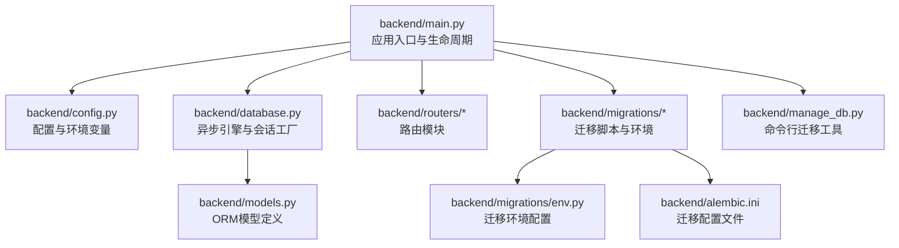
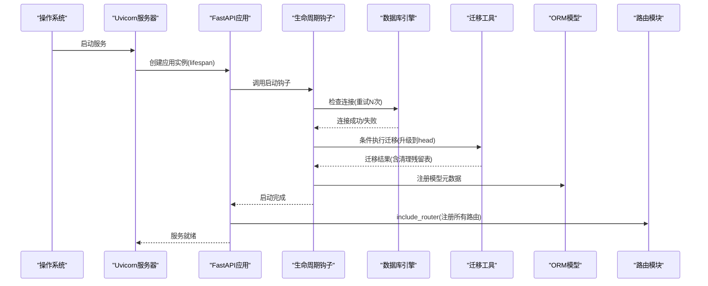
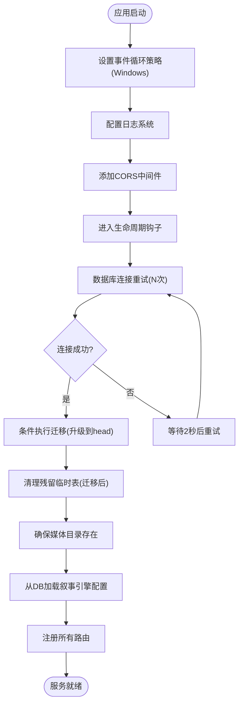
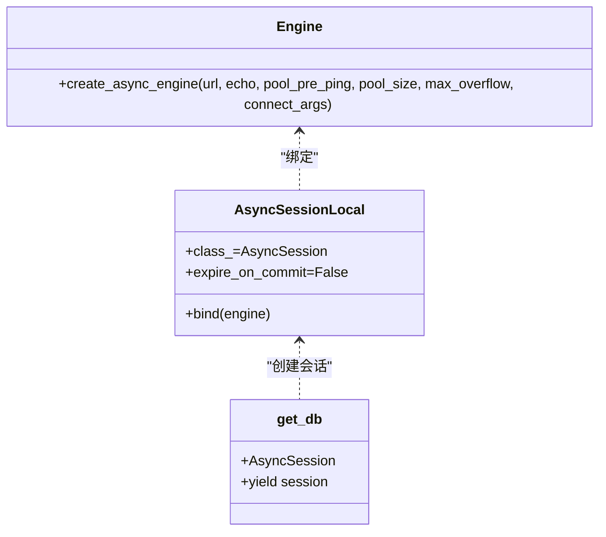
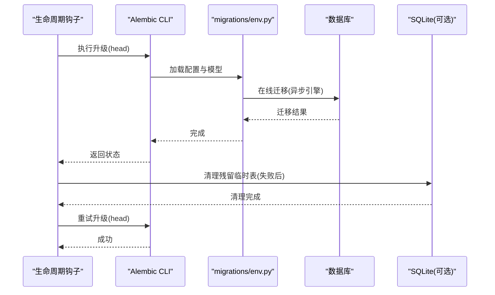
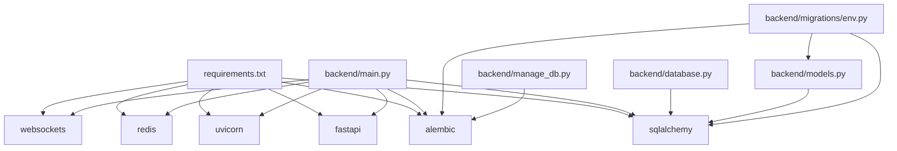

# 应用生命周期管理

<cite>
**本文引用的文件**
- [main.py](file://backend/main.py)
- [config.py](file://backend/config.py)
- [database.py](file://backend/database.py)
- [alembic.ini](file://backend/alembic.ini)
- [migrations/env.py](file://backend/migrations/env.py)
- [manage_db.py](file://backend/manage_db.py)
- [models.py](file://backend/models.py)
- [routers/auth.py](file://backend/routers/auth.py)
- [routers/admin.py](file://backend/routers/admin.py)
- [requirements.txt](file://backend/requirements.txt)
</cite>

## 目录
1. [简介](#简介)
2. [项目结构](#项目结构)
3. [核心组件](#核心组件)
4. [架构总览](#架构总览)
5. [详细组件分析](#详细组件分析)
6. [依赖关系分析](#依赖关系分析)
7. [性能考量](#性能考量)
8. [故障排查指南](#故障排查指南)
9. [结论](#结论)
10. [附录](#附录)

## 简介
本文件聚焦于Infinite Game后端FastAPI应用的生命周期管理，系统性阐述应用启动时的初始化流程：异步上下文管理器的使用、数据库连接重试机制与迁移策略、日志系统设置、CORS中间件配置以及路由注册过程。同时给出数据库连接池管理、Alembic迁移的自动执行与错误处理机制说明，并提供配置参数详解（如RUN_MIGRATIONS开关、数据库路径设置、事件循环策略），辅以最佳实践建议与可视化图示，帮助开发者快速理解并维护应用生命周期。

## 项目结构
后端采用FastAPI + SQLAlchemy异步ORM + Alembic迁移的典型架构，核心入口为FastAPI应用实例，通过异步上下文管理器在启动阶段完成数据库连接校验、迁移执行、资源准备等任务；路由模块按功能拆分，统一在应用启动时注册。

图表来源
- [main.py:110-152](file://backend/main.py#L110-L152)
- [config.py:1-43](file://backend/config.py#L1-43)
- [database.py:1-31](file://backend/database.py#L1-L31)
- [models.py:1-200](file://backend/models.py#L1-L200)
- [migrations/env.py:1-120](file://backend/migrations/env.py#L1-L120)
- [alembic.ini:1-115](file://backend/alembic.ini#L1-L115)
- [manage_db.py:1-80](file://backend/manage_db.py#L1-L80)

章节来源
- [main.py:110-152](file://backend/main.py#L110-L152)
- [config.py:1-43](file://backend/config.py#L1-L43)
- [database.py:1-31](file://backend/database.py#L1-L31)
- [models.py:1-200](file://backend/models.py#L1-L200)
- [migrations/env.py:1-120](file://backend/migrations/env.py#L1-L120)
- [alembic.ini:1-115](file://backend/alembic.ini#L1-L115)
- [manage_db.py:1-80](file://backend/manage_db.py#L1-L80)

## 核心组件
- 异步上下文管理器与生命周期钩子：在应用启动前进行数据库连接重试、迁移执行与资源准备，在应用关闭时释放资源。
- 数据库连接池：基于SQLAlchemy异步引擎，启用连接池预检测、溢出连接与SQLite线程安全参数。
- Alembic迁移：支持在线/离线模式，自动清理残留临时表，支持命令行与运行时两种执行方式。
- 配置系统：Pydantic Settings加载.env文件，支持数据库URL、Redis、AI密钥、JWT、生成设置与迁移开关。
- 中间件与路由：CORS中间件、调试认证中间件、路由注册。

章节来源
- [main.py:49-108](file://backend/main.py#L49-L108)
- [database.py:8-23](file://backend/database.py#L8-L23)
- [config.py:7-42](file://backend/config.py#L7-L42)
- [alembic.ini:1-115](file://backend/alembic.ini#L1-L115)
- [migrations/env.py:39-120](file://backend/migrations/env.py#L39-L120)

## 架构总览
下图展示应用启动时的关键流程：事件循环策略设置、日志初始化、CORS中间件、数据库连接重试与迁移、模型注册、路由注册、静态资源挂载与WebSocket端点。

图表来源
- [main.py:6-28](file://backend/main.py#L6-L28)
- [main.py:49-108](file://backend/main.py#L49-L108)
- [migrations/env.py:79-120](file://backend/migrations/env.py#L79-L120)
- [models.py:1-200](file://backend/models.py#L1-L200)

## 详细组件分析

### 生命周期钩子与启动流程
- 事件循环策略：在Windows平台设置选择器事件循环策略，解决异步驱动兼容性问题。
- 日志系统：统一配置日志格式与级别，降低SQLAlchemy与Uvicorn访问日志噪声，保留应用日志。
- CORS中间件：允许本地开发源，支持凭据、通配方法与头。
- 路由注册：集中include_router，覆盖认证、管理、代理、聊天、编排、媒体、订阅、提示模板、视频、剧场、技能与调试等模块。
- WebSocket端点：提供基础回显测试端点。
- 媒体目录：确保媒体目录存在，避免运行时IO异常。

图表来源
- [main.py:6-28](file://backend/main.py#L6-L28)
- [main.py:49-108](file://backend/main.py#L49-L108)
- [main.py:130-152](file://backend/main.py#L130-L152)

章节来源
- [main.py:6-28](file://backend/main.py#L6-L28)
- [main.py:49-108](file://backend/main.py#L49-L108)
- [main.py:130-152](file://backend/main.py#L130-L152)

### 数据库连接池管理
- 引擎创建：基于配置的DATABASE_URL创建异步引擎，关闭SQL日志输出，启用pool_pre_ping实现自动重连。
- 连接池参数：
  - pool_size：连接池大小
  - max_overflow：最大溢出连接数
  - connect_args：SQLite场景禁用线程检查
- 会话工厂：AsyncSessionLocal作为异步会话工厂，expire_on_commit=False避免提交后过期。
- 依赖注入：get_db提供异步上下文中的数据库会话，供路由层使用。

图表来源
- [database.py:8-23](file://backend/database.py#L8-L23)
- [database.py:28-31](file://backend/database.py#L28-L31)

章节来源
- [database.py:8-23](file://backend/database.py#L8-L23)
- [database.py:28-31](file://backend/database.py#L28-L31)

### Alembic迁移策略与错误处理
- 运行时迁移：在生命周期钩子中根据配置决定是否执行迁移，使用子进程调用alembic升级到head。
- 错误恢复：若迁移失败，尝试清理残留临时表后重试；仍失败则抛出异常。
- 环境配置：env.py支持在线/离线迁移，导入models注册元数据，清理残留临时表。
- 命令行工具：manage_db.py提供migrate、upgrade、downgrade、seed等命令，便于开发与运维。

图表来源
- [main.py:59-88](file://backend/main.py#L59-L88)
- [migrations/env.py:79-120](file://backend/migrations/env.py#L79-L120)
- [manage_db.py:20-38](file://backend/manage_db.py#L20-L38)

章节来源
- [main.py:59-88](file://backend/main.py#L59-L88)
- [migrations/env.py:79-120](file://backend/migrations/env.py#L79-L120)
- [manage_db.py:20-38](file://backend/manage_db.py#L20-L38)

### 配置参数详解
- 数据库相关
  - DATABASE_URL：数据库连接字符串，默认使用SQLite（绝对路径），也可配置PostgreSQL。
  - DB_PATH：SQLite数据库文件绝对路径，确保跨工作目录一致性。
- 系统与迁移
  - RUN_MIGRATIONS：布尔值，控制启动时是否执行迁移。
- 其他关键参数
  - REDIS_URL：缓存/消息队列地址。
  - JWT配置：密钥、算法、过期时间。
  - AI模型与API密钥：OpenAI、Claude、Gemini等。
  - 生成设置：故事与图像生成模型名称。

章节来源
- [config.py:7-42](file://backend/config.py#L7-L42)
- [config.py:4-5](file://backend/config.py#L4-L5)

### 路由注册与中间件
- 中间件
  - CORS：允许本地开发源，支持凭据与通配方法/头。
  - 调试认证中间件：记录Authorization与Origin信息，便于调试。
- 路由注册：集中include_router，覆盖认证、管理、代理、聊天、编排、媒体、订阅、提示模板、视频、剧场、技能与调试等模块。

章节来源
- [main.py:119-152](file://backend/main.py#L119-L152)
- [routers/auth.py:30-33](file://backend/routers/auth.py#L30-L33)
- [routers/admin.py:19-23](file://backend/routers/admin.py#L19-L23)

## 依赖关系分析
- 应用依赖：FastAPI、Uvicorn、SQLAlchemy异步、Alembic、Redis、Websockets等。
- ORM依赖：models.py定义的表结构与database.py中的Base类形成强耦合。
- 迁移依赖：migrations/env.py依赖config.settings与models，确保迁移时模型元数据正确。
- 命令行工具：manage_db.py依赖subprocess与alembic，提供便捷的迁移操作。

图表来源
- [requirements.txt:1-28](file://backend/requirements.txt#L1-L28)
- [main.py:32-44](file://backend/main.py#L32-L44)
- [database.py:1-3](file://backend/database.py#L1-L3)
- [models.py:1-4](file://backend/models.py#L1-L4)
- [migrations/env.py:10-17](file://backend/migrations/env.py#L10-L17)
- [manage_db.py:1-8](file://backend/manage_db.py#L1-L8)

章节来源
- [requirements.txt:1-28](file://backend/requirements.txt#L1-L28)
- [main.py:32-44](file://backend/main.py#L32-L44)
- [database.py:1-3](file://backend/database.py#L1-L3)
- [models.py:1-4](file://backend/models.py#L1-L4)
- [migrations/env.py:10-17](file://backend/migrations/env.py#L10-L17)
- [manage_db.py:1-8](file://backend/manage_db.py#L1-L8)

## 性能考量
- 连接池优化：合理设置pool_size与max_overflow，结合pool_pre_ping提升稳定性；在高并发场景下评估连接占用与数据库负载。
- 迁移性能：避免频繁迁移，生产环境建议离线迁移；开发环境可开启RUN_MIGRATIONS以简化部署。
- 日志开销：关闭SQLAlchemy与Uvicorn访问日志可显著降低I/O开销，保留应用日志便于追踪。
- 事件循环：Windows平台使用选择器事件循环策略，避免异步驱动兼容性导致的阻塞。

## 故障排查指南
- 数据库连接失败
  - 现象：启动时报连接错误，随后重试直至超限。
  - 处理：检查DATABASE_URL与DB_PATH；确认数据库服务可用；必要时开启RUN_MIGRATIONS让迁移自动修复。
- 迁移失败与残留表
  - 现象：迁移过程中出现临时表残留，导致后续迁移失败。
  - 处理：生命周期钩子内置清理逻辑；若失败，可手动执行manage_db.py的migrate/upgrade命令，或在SQLite中清理临时表后重试。
- CORS与认证问题
  - 现象：浏览器跨域请求被拒绝或认证头缺失。
  - 处理：确认CORS允许的源列表；利用调试中间件查看Authorization与Origin头信息。
- 日志噪声
  - 现象：终端输出大量SQL与访问日志。
  - 处理：保持现有日志级别设置，必要时调整SQLAlchemy与Uvicorn日志级别。

章节来源
- [main.py:59-88](file://backend/main.py#L59-L88)
- [main.py:119-127](file://backend/main.py#L119-L127)
- [migrations/env.py:67-77](file://backend/migrations/env.py#L67-L77)
- [manage_db.py:20-38](file://backend/manage_db.py#L20-L38)

## 结论
Infinite Game后端通过生命周期钩子实现了稳健的启动流程：在Windows平台设置合适的事件循环策略，精细化的日志配置，严格的数据库连接重试与迁移执行，以及完善的CORS与路由注册。配合Alembic的在线/离线迁移与命令行工具，开发者可以在不同环境下高效地完成数据库演进与部署。建议在生产环境中谨慎开启RUN_MIGRATIONS，并结合连接池参数与日志策略进行性能优化。

## 附录
- 最佳实践
  - 生产环境：关闭RUN_MIGRATIONS，使用离线迁移；配置PostgreSQL并优化连接池参数。
  - 开发环境：开启RUN_MIGRATIONS，使用SQLite；利用调试中间件定位认证与跨域问题。
  - 运维工具：优先使用manage_db.py进行迁移与种子数据操作，避免直接修改数据库。
- 相关文件路径
  - 应用入口与生命周期：[main.py](file://backend/main.py)
  - 配置与环境变量：[config.py](file://backend/config.py)
  - 数据库引擎与会话工厂：[database.py](file://backend/database.py)
  - 迁移配置与环境：[alembic.ini](file://backend/alembic.ini)、[migrations/env.py](file://backend/migrations/env.py)
  - 命令行迁移工具：[manage_db.py](file://backend/manage_db.py)
  - ORM模型定义：[models.py](file://backend/models.py)
  - 路由模块示例：[routers/auth.py](file://backend/routers/auth.py)、[routers/admin.py](file://backend/routers/admin.py)
  - 依赖声明：[requirements.txt](file://backend/requirements.txt)