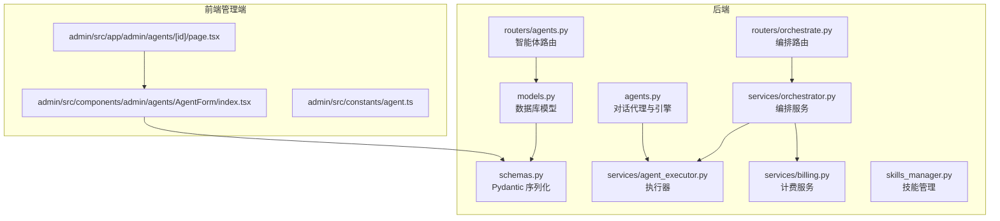
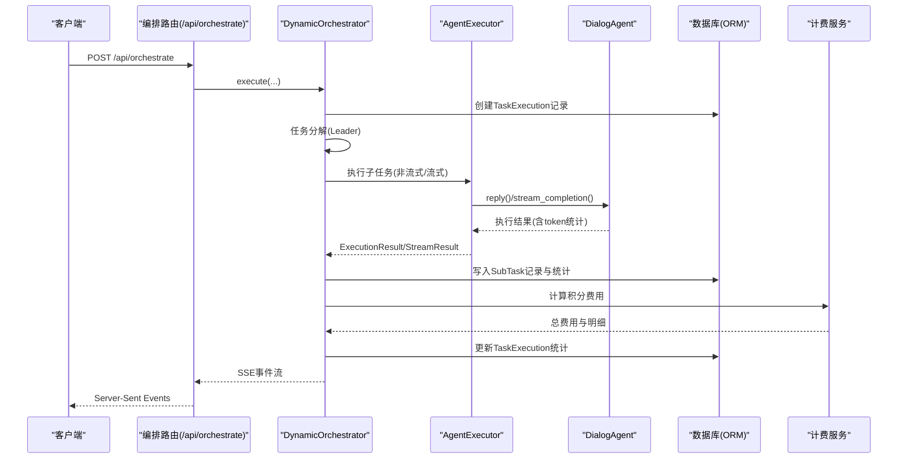
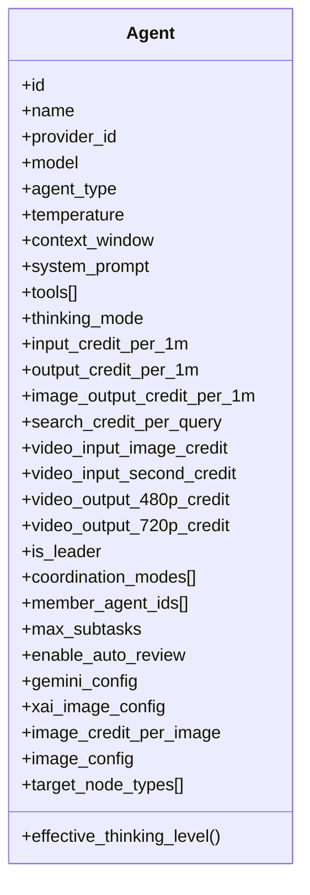
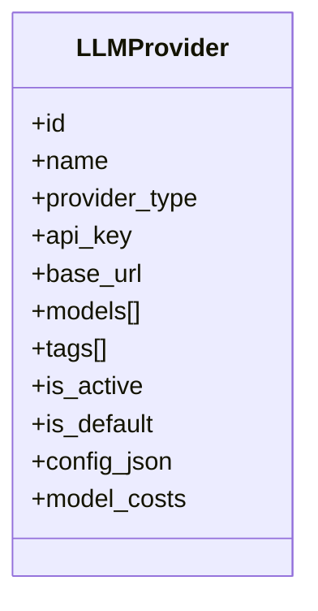
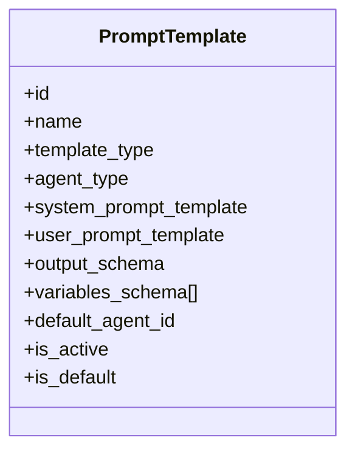
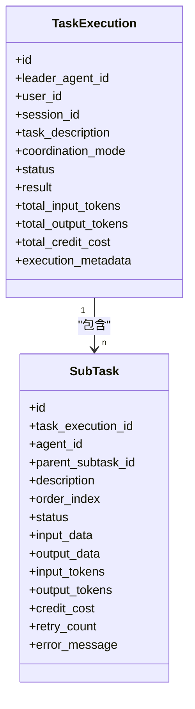
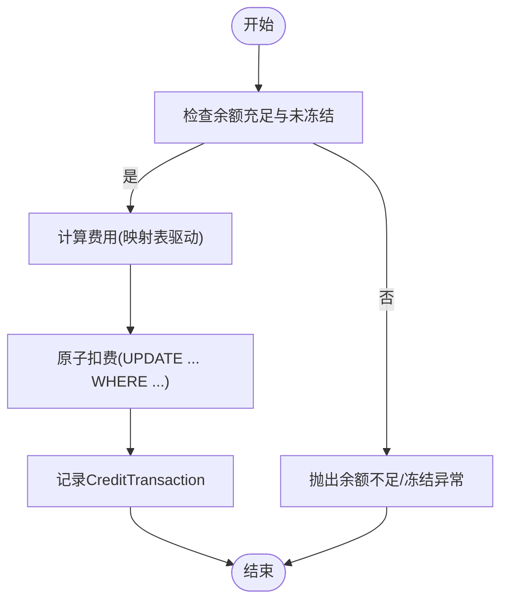
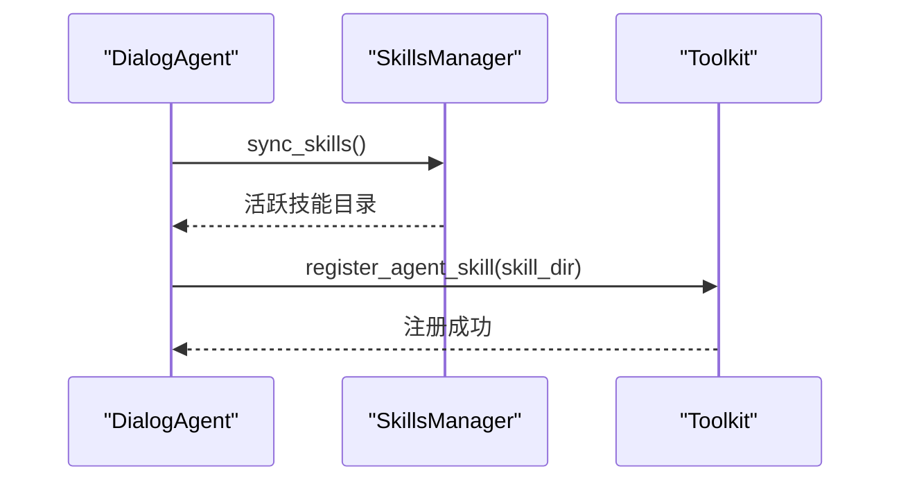
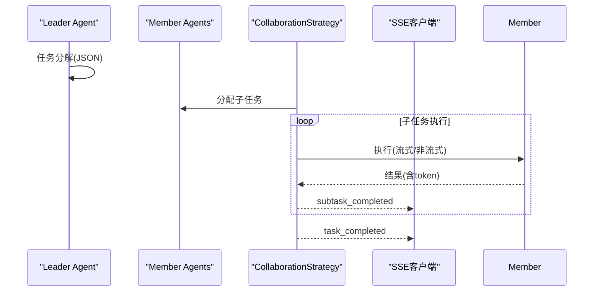
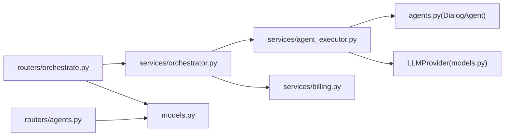

# AI智能体相关模型

<cite>
**本文档引用的文件**
- [models.py](file://backend/models.py)
- [schemas.py](file://backend/schemas.py)
- [agents.py](file://backend/agents.py)
- [services/billing.py](file://backend/services/billing.py)
- [services/orchestrator.py](file://backend/services/orchestrator.py)
- [services/agent_executor.py](file://backend/services/agent_executor.py)
- [routers/agents.py](file://backend/routers/agents.py)
- [routers/orchestrate.py](file://backend/routers/orchestrate.py)
- [skills_manager.py](file://backend/skills_manager.py)
- [admin/src/app/admin/agents/[id]/page.tsx](file://backend/admin/src/app/admin/agents/[id]/page.tsx)
- [admin/src/components/admin/agents/AgentForm/index.tsx](file://backend/admin/src/components/admin/agents/AgentForm/index.tsx)
- [admin/src/constants/agent.ts](file://backend/admin/src/constants/agent.ts)
- [backend/docs/BILLING_REVIEW.md](file://backend/docs/BILLING_REVIEW.md)
</cite>

## 目录
1. [简介](#简介)
2. [项目结构](#项目结构)
3. [核心组件](#核心组件)
4. [架构总览](#架构总览)
5. [详细组件分析](#详细组件分析)
6. [依赖关系分析](#依赖关系分析)
7. [性能考虑](#性能考虑)
8. [故障排除指南](#故障排除指南)
9. [结论](#结论)
10. [附录](#附录)

## 简介
本文件系统化梳理并解释AI智能体相关的核心数据模型与运行机制，涵盖以下方面：
- 智能体模型（Agent）、大语言模型提供商（LLMProvider）、提示词模板（PromptTemplate）、任务执行（TaskExecution）、子任务（SubTask）等数据结构
- 智能体配置参数、工具集成、多智能体协作机制
- 任务执行跟踪、子任务分解、状态管理
- 智能体定价模型、成本计算与计费相关数据结构
- 实际配置示例与使用场景

## 项目结构
后端采用分层架构：数据库模型与序列化（Pydantic）位于models.py与schemas.py；业务服务位于services目录；API路由位于routers目录；前端管理端位于admin/src。

**图表来源**
- [models.py:1-447](file://backend/models.py#L1-L447)
- [schemas.py:1-859](file://backend/schemas.py#L1-L859)
- [agents.py:1-388](file://backend/agents.py#L1-L388)
- [services/billing.py:1-388](file://backend/services/billing.py#L1-L388)
- [services/orchestrator.py:1-899](file://backend/services/orchestrator.py#L1-L899)
- [services/agent_executor.py:1-287](file://backend/services/agent_executor.py#L1-L287)
- [routers/agents.py:1-151](file://backend/routers/agents.py#L1-L151)
- [routers/orchestrate.py:1-184](file://backend/routers/orchestrate.py#L1-L184)
- [skills_manager.py:1-408](file://backend/skills_manager.py#L1-L408)
- [admin/src/app/admin/agents/[id]/page.tsx](file://backend/admin/src/app/admin/agents/[id]/page.tsx#L1-L149)
- [admin/src/components/admin/agents/AgentForm/index.tsx:1-382](file://backend/admin/src/components/admin/agents/AgentForm/index.tsx#L1-L382)
- [admin/src/constants/agent.ts:1-29](file://backend/admin/src/constants/agent.ts#L1-L29)

**章节来源**
- [models.py:1-447](file://backend/models.py#L1-L447)
- [schemas.py:1-859](file://backend/schemas.py#L1-L859)
- [routers/agents.py:1-151](file://backend/routers/agents.py#L1-L151)
- [routers/orchestrate.py:1-184](file://backend/routers/orchestrate.py#L1-L184)

## 核心组件
本节概述智能体系统的关键数据模型与服务组件，以及它们之间的关系。

- 数据模型（ORM）
  - Agent：智能体配置与计费参数、多智能体协作配置、图像生成配置等
  - LLMProvider：大语言模型提供商配置与按模型的API成本映射
  - PromptTemplate：提示词模板，支持系统/用户模板、输出模式定义、变量Schema
  - TaskExecution：多智能体任务执行记录
  - SubTask：任务执行中的子任务，支持父子关系与重试
  - User/Admin/CreditTransaction：用户/管理员与积分交易记录
  - VideoTask：视频生成任务追踪
- 服务组件
  - AgentExecutor：统一的智能体执行器，封装对话代理与流式输出
  - DynamicOrchestrator：动态编排引擎，支持流水线/计划/讨论三种协作策略
  - Billing：计费计算器与原子扣费/退款逻辑
  - SkillsManager：技能同步与管理
- 路由接口
  - /api/agents：智能体的增删改查
  - /api/orchestrate：多智能体编排任务的发起、查询与取消

**章节来源**
- [models.py:146-367](file://backend/models.py#L146-L367)
- [schemas.py:237-476](file://backend/schemas.py#L237-L476)
- [services/agent_executor.py:63-287](file://backend/services/agent_executor.py#L63-L287)
- [services/orchestrator.py:560-899](file://backend/services/orchestrator.py#L560-L899)
- [services/billing.py:1-388](file://backend/services/billing.py#L1-L388)
- [routers/agents.py:1-151](file://backend/routers/agents.py#L1-L151)
- [routers/orchestrate.py:1-184](file://backend/routers/orchestrate.py#L1-L184)

## 架构总览
下图展示了从API请求到智能体执行与计费的全链路：

**图表来源**
- [routers/orchestrate.py:26-71](file://backend/routers/orchestrate.py#L26-L71)
- [services/orchestrator.py:570-673](file://backend/services/orchestrator.py#L570-L673)
- [services/agent_executor.py:74-208](file://backend/services/agent_executor.py#L74-L208)
- [services/billing.py:310-387](file://backend/services/billing.py#L310-L387)

## 详细组件分析

### 智能体模型（Agent）
- 关键字段
  - 基础配置：名称、描述、提供商关联、模型名、智能体类型（text/image/multimodal/video）
  - 参数：温度、上下文窗口、系统提示词
  - 工具与思维模式：tools（启用的工具列表）、thinking_mode
  - 计费参数（每1M tokens或每单位）：输入/输出/图像输出/搜索/视频输入/输出等
  - 多智能体协作：is_leader、协调模式（pipeline/plan/discussion）、成员智能体IDs、最大子任务数、自动复核
  - 图像生成配置：Gemini配置、xAI配置、统一图像配置、每张图片积分
  - 目标节点类型：可控制的画布节点类型集合
- 有效性派生字段：effective_thinking_level（向后兼容）
- 前端表单与校验
  - 管理端表单支持Gemini、xAI、统一图像配置的清理与合并
  - 表单Schema对节点类型进行校验

**图表来源**
- [models.py:196-252](file://backend/models.py#L196-L252)
- [schemas.py:239-350](file://backend/schemas.py#L239-L350)
- [admin/src/components/admin/agents/AgentForm/index.tsx:224-306](file://backend/admin/src/components/admin/agents/AgentForm/index.tsx#L224-L306)

**章节来源**
- [models.py:196-252](file://backend/models.py#L196-L252)
- [schemas.py:239-350](file://backend/schemas.py#L239-L350)
- [admin/src/app/admin/agents/[id]/page.tsx](file://backend/admin/src/app/admin/agents/[id]/page.tsx#L1-L149)
- [admin/src/components/admin/agents/AgentForm/index.tsx:1-382](file://backend/admin/src/components/admin/agents/AgentForm/index.tsx#L1-L382)
- [admin/src/constants/agent.ts:1-29](file://backend/admin/src/constants/agent.ts#L1-L29)

### 大语言模型提供商（LLMProvider）
- 关键字段
  - 名称、提供商类型、API密钥、基础URL
  - 支持模型列表、标签
  - 是否激活/默认
  - 额外配置（config_json）
  - 按模型的API成本映射（model_costs）
- 用途
  - 为智能体提供模型实例与成本信息
  - 作为对话代理初始化的来源

**图表来源**
- [models.py:146-169](file://backend/models.py#L146-L169)
- [schemas.py:126-162](file://backend/schemas.py#L126-L162)

**章节来源**
- [models.py:146-169](file://backend/models.py#L146-L169)
- [schemas.py:126-162](file://backend/schemas.py#L126-L162)
- [agents.py:245-271](file://backend/agents.py#L245-L271)

### 提示词模板（PromptTemplate）
- 关键字段
  - 名称、描述、模板类型、适用智能体类型
  - 系统/用户提示词模板、输出Schema、变量Schema
  - 默认智能体关联、激活/默认标志
- 用途
  - 为剧场创建等场景提供标准化的AI生成任务

**图表来源**
- [models.py:332-366](file://backend/models.py#L332-L366)
- [schemas.py:558-608](file://backend/schemas.py#L558-L608)

**章节来源**
- [models.py:332-366](file://backend/models.py#L332-L366)
- [schemas.py:558-608](file://backend/schemas.py#L558-L608)

### 任务执行与子任务（TaskExecution/SubTask）
- TaskExecution
  - 记录多智能体任务的总体状态、描述、协调模式、结果与统计
  - 关联用户、会话、领导者智能体
- SubTask
  - 子任务与父子关系、顺序索引、状态
  - 输入/输出数据、token统计、积分消耗、重试次数、错误信息
- 编排策略
  - PipelineStrategy：串行/并行
  - PlanStrategy：依赖图与动态调度
  - DiscussionStrategy：多轮讨论与领导评估

**图表来源**
- [models.py:283-330](file://backend/models.py#L283-L330)
- [schemas.py:458-476](file://backend/schemas.py#L458-L476)

**章节来源**
- [models.py:283-330](file://backend/models.py#L283-L330)
- [schemas.py:437-476](file://backend/schemas.py#L437-L476)
- [services/orchestrator.py:25-127](file://backend/services/orchestrator.py#L25-L127)

### 计费与定价模型
- 计费维度映射表（文本/图像/搜索/图片生成）
- 视频计费维度映射表（输入图片/输入时长/输出时长）
- 原子扣费与退款
  - 使用UPDATE ... WHERE ...确保并发安全
  - 支持用户/管理员余额检查与冻结保护
- 成本计算
  - 文本：按输入/输出tokens与费率计算
  - 图像：按输出tokens或生成数量计算
  - 搜索：按查询次数计算
  - 视频：按输入/输出维度与提供商费率计算

**图表来源**
- [services/billing.py:45-84](file://backend/services/billing.py#L45-L84)
- [services/billing.py:178-308](file://backend/services/billing.py#L178-L308)
- [services/billing.py:310-387](file://backend/services/billing.py#L310-L387)

**章节来源**
- [services/billing.py:1-388](file://backend/services/billing.py#L1-L388)
- [backend/docs/BILLING_REVIEW.md:1-196](file://backend/docs/BILLING_REVIEW.md#L1-L196)

### 工具集成与技能管理
- 技能同步
  - 将内置/定制技能同步到活跃目录
  - 支持启用/禁用/创建/删除技能
- 智能体工具注册
  - 通过Toolkit注册技能，支持MCP客户端
  - 支持按需加载与热重载

**图表来源**
- [skills_manager.py:180-225](file://backend/skills_manager.py#L180-L225)
- [agents.py:85-113](file://backend/agents.py#L85-L113)

**章节来源**
- [skills_manager.py:1-408](file://backend/skills_manager.py#L1-L408)
- [agents.py:1-120](file://backend/agents.py#L1-L120)

### 多智能体协作机制
- 协作策略注册与选择
- 任务分解：领导者根据成员能力与用户需求生成子任务Spec
- 执行策略：
  - Pipeline：串行/并行执行
  - Plan：依赖图与动态调度
  - Discussion：多轮讨论与领导评估
- 实时进度：通过Server-Sent Events流式返回

**图表来源**
- [services/orchestrator.py:536-673](file://backend/services/orchestrator.py#L536-L673)
- [services/orchestrator.py:254-307](file://backend/services/orchestrator.py#L254-L307)
- [services/orchestrator.py:325-407](file://backend/services/orchestrator.py#L325-L407)
- [services/orchestrator.py:413-530](file://backend/services/orchestrator.py#L413-L530)
- [routers/orchestrate.py:26-71](file://backend/routers/orchestrate.py#L26-L71)

**章节来源**
- [services/orchestrator.py:1-899](file://backend/services/orchestrator.py#L1-L899)
- [routers/orchestrate.py:1-184](file://backend/routers/orchestrate.py#L1-L184)

## 依赖关系分析
- 模块耦合
  - services/orchestrator依赖services/agent_executor与services/billing
  - services/agent_executor依赖agents.py中的DialogAgent与LLMProvider
  - routers依赖models与schemas进行数据验证与持久化
- 外部依赖
  - agentscope：对话代理与消息格式化
  - SQLAlchemy：ORM与事务
  - FastAPI：路由与SSE

**图表来源**
- [services/orchestrator.py:1-25](file://backend/services/orchestrator.py#L1-L25)
- [services/agent_executor.py:1-25](file://backend/services/agent_executor.py#L1-L25)
- [agents.py:1-25](file://backend/agents.py#L1-L25)
- [models.py:146-169](file://backend/models.py#L146-L169)
- [routers/agents.py:1-15](file://backend/routers/agents.py#L1-L15)
- [routers/orchestrate.py:1-23](file://backend/routers/orchestrate.py#L1-L23)

**章节来源**
- [services/orchestrator.py:1-899](file://backend/services/orchestrator.py#L1-L899)
- [services/agent_executor.py:1-287](file://backend/services/agent_executor.py#L1-L287)
- [agents.py:1-388](file://backend/agents.py#L1-L388)
- [models.py:146-169](file://backend/models.py#L146-L169)
- [routers/agents.py:1-151](file://backend/routers/agents.py#L1-L151)
- [routers/orchestrate.py:1-184](file://backend/routers/orchestrate.py#L1-L184)

## 性能考虑
- 并发安全
  - 原子扣费：使用UPDATE ... WHERE ...避免竞态条件
  - 建议：为created_at添加索引以提升报表查询性能
- 计费精度
  - 建议将credits与amount迁移到DECIMAL或整数微积分单位，避免浮点误差累积
- 执行效率
  - 并行策略：PipelineStrategy并行执行可显著缩短总时间
  - 流式输出：减少前端等待时间，提升用户体验
- 缓存与复用
  - AgentExecutor与模型实例缓存降低重复初始化开销

[本节提供一般性指导，无需特定文件引用]

## 故障排除指南
- 余额不足/冻结
  - 现象：编排任务启动时报错或扣费失败
  - 处理：检查用户/管理员余额与冻结状态；确认原子扣费逻辑是否生效
- 任务执行失败
  - 现象：子任务状态为failed，记录错误信息
  - 处理：查看SubTask.error_message；必要时重试或调整智能体参数
- 并发扣费异常
  - 现象：高并发下出现余额不一致
  - 处理：确认原子扣费实现；必要时引入行级锁或队列化处理
- 计费精度问题
  - 现象：积分累计出现微小偏差
  - 处理：迁移至DECIMAL类型；增加一致性校验

**章节来源**
- [services/billing.py:45-84](file://backend/services/billing.py#L45-L84)
- [services/billing.py:178-308](file://backend/services/billing.py#L178-L308)
- [models.py:261-281](file://backend/models.py#L261-L281)
- [backend/docs/BILLING_REVIEW.md:129-196](file://backend/docs/BILLING_REVIEW.md#L129-L196)

## 结论
本系统通过清晰的数据模型与服务分层，实现了从智能体配置、工具集成、多智能体协作到计费与审计的完整闭环。建议在现有基础上进一步完善原子扣费、计费精度与过期/配额机制，以满足生产环境的可靠性与合规性要求。

[本节为总结性内容，无需特定文件引用]

## 附录

### 配置示例与使用场景
- 创建智能体
  - 通过管理端页面填写基础信息、系统提示词、参数与工具
  - 选择LLMProvider与模型，配置计费参数与协作配置
- 发起多智能体编排
  - 选择领导者智能体与协调模式（流水线/计划/讨论）
  - 提交任务描述，实时查看子任务进度与结果
- 图像/视频生成
  - 配置图像生成参数（分辨率、批量、格式等）
  - 依据提供商费率与质量维度进行计费

**章节来源**
- [admin/src/app/admin/agents/[id]/page.tsx](file://backend/admin/src/app/admin/agents/[id]/page.tsx#L1-L149)
- [admin/src/components/admin/agents/AgentForm/index.tsx:1-382](file://backend/admin/src/components/admin/agents/AgentForm/index.tsx#L1-L382)
- [routers/orchestrate.py:26-71](file://backend/routers/orchestrate.py#L26-L71)
- [services/billing.py:22-35](file://backend/services/billing.py#L22-L35)