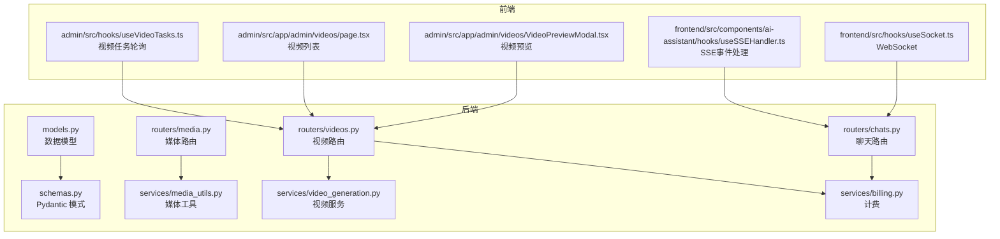
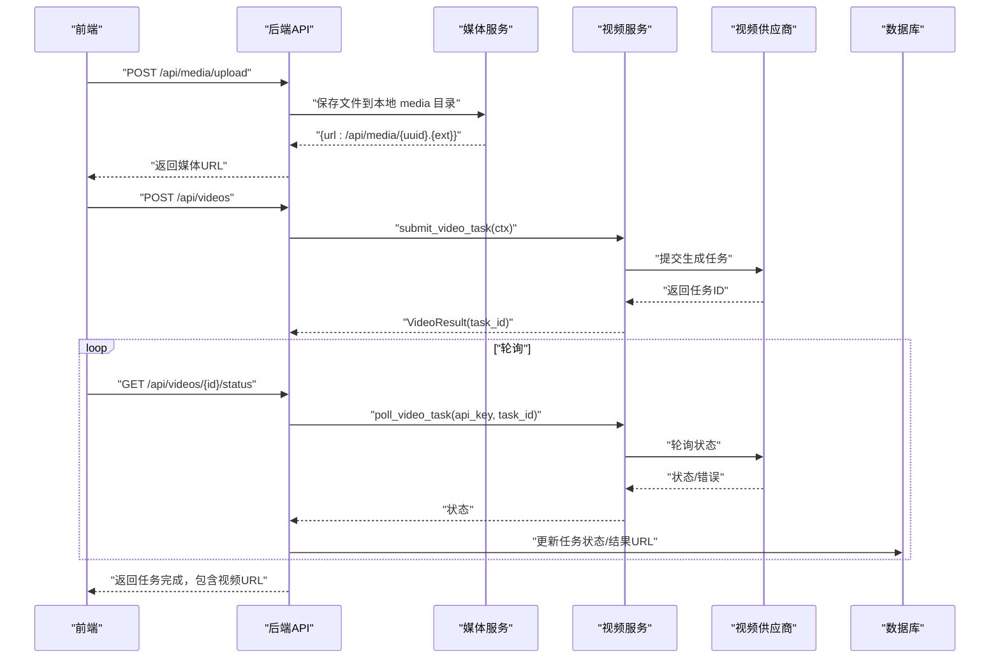
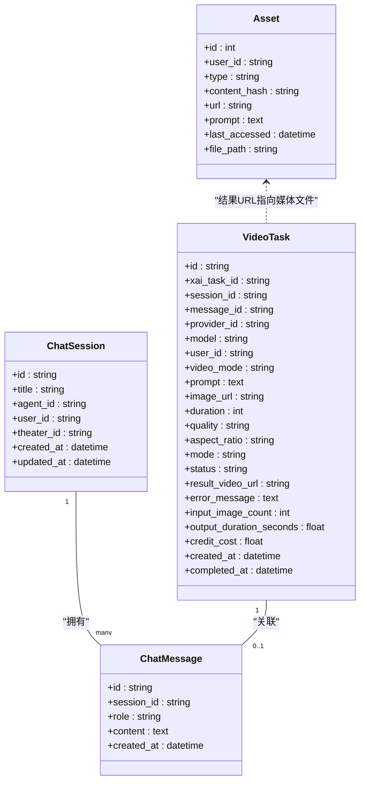

# 媒体内容相关模型

<cite>
**本文档引用的文件**
- [models.py](file://backend/models.py)
- [schemas.py](file://backend/schemas.py)
- [routers/media.py](file://backend/routers/media.py)
- [services/media_utils.py](file://backend/services/media_utils.py)
- [services/video_generation.py](file://backend/services/video_generation.py)
- [routers/videos.py](file://backend/routers/videos.py)
- [routers/chats.py](file://backend/routers/chats.py)
- [services/billing.py](file://backend/services/billing.py)
- [admin/src/hooks/useVideoTasks.ts](file://backend/admin/src/hooks/useVideoTasks.ts)
- [admin/src/app/admin/videos/page.tsx](file://backend/admin/src/app/admin/videos/page.tsx)
- [admin/src/app/admin/videos/VideoPreviewModal.tsx](file://backend/admin/src/app/admin/videos/VideoPreviewModal.tsx)
- [frontend/src/components/ai-assistant/hooks/useSSEHandler.ts](file://frontend/src/components/ai-assistant/hooks/useSSEHandler.ts)
- [frontend/src/hooks/useSocket.ts](file://frontend/src/hooks/useSocket.ts)
</cite>

## 目录
1. [简介](#简介)
2. [项目结构](#项目结构)
3. [核心组件](#核心组件)
4. [架构总览](#架构总览)
5. [详细组件分析](#详细组件分析)
6. [依赖关系分析](#依赖关系分析)
7. [性能考量](#性能考量)
8. [故障排查指南](#故障排查指南)
9. [结论](#结论)
10. [附录](#附录)

## 简介
本文件聚焦于媒体内容相关数据模型与处理流程，涵盖以下主题：
- 媒体资产与视频任务模型：Asset、VideoTask 的字段含义、用途与约束
- 媒体文件存储、去重与缓存策略：文件路径、URL 管理与访问控制
- 视频生成任务的状态跟踪、进度监控与错误处理机制
- 聊天会话与消息的数据流转、实时通信（SSE/WebSocket）模型设计
- 媒体文件的 URL 管理、文件路径存储与访问控制机制

## 项目结构
后端采用 FastAPI + SQLAlchemy 架构，媒体相关内容主要分布在以下模块：
- 数据模型与模式：models.py、schemas.py
- 媒体服务路由：routers/media.py
- 媒体工具：services/media_utils.py
- 视频生成服务与适配器：services/video_generation.py
- 视频任务路由：routers/videos.py
- 聊天路由与实时通信：routers/chats.py
- 计费与积分：services/billing.py
- 前端集成（示例）：admin 前端与前端 hooks

图表来源
- [models.py](file://backend/models.py)
- [schemas.py](file://backend/schemas.py)
- [routers/media.py](file://backend/routers/media.py)
- [services/media_utils.py](file://backend/services/media_utils.py)
- [services/video_generation.py](file://backend/services/video_generation.py)
- [routers/videos.py](file://backend/routers/videos.py)
- [routers/chats.py](file://backend/routers/chats.py)
- [services/billing.py](file://backend/services/billing.py)
- [admin/src/hooks/useVideoTasks.ts](file://backend/admin/src/hooks/useVideoTasks.ts)
- [admin/src/app/admin/videos/page.tsx](file://backend/admin/src/app/admin/videos/page.tsx)
- [admin/src/app/admin/videos/VideoPreviewModal.tsx](file://backend/admin/src/app/admin/videos/VideoPreviewModal.tsx)
- [frontend/src/components/ai-assistant/hooks/useSSEHandler.ts](file://frontend/src/components/ai-assistant/hooks/useSSEHandler.ts)
- [frontend/src/hooks/useSocket.ts](file://frontend/src/hooks/useSocket.ts)

章节来源
- [models.py](file://backend/models.py)
- [schemas.py](file://backend/schemas.py)
- [routers/media.py](file://backend/routers/media.py)
- [services/media_utils.py](file://backend/services/media_utils.py)
- [services/video_generation.py](file://backend/services/video_generation.py)
- [routers/videos.py](file://backend/routers/videos.py)
- [routers/chats.py](file://backend/routers/chats.py)
- [services/billing.py](file://backend/services/billing.py)

## 核心组件
本节概述媒体相关的核心数据模型与服务职责。

- 数据模型（ORM）
  - Asset：媒体资产表，用于存储媒体文件的唯一标识、哈希、URL、提示词与缓存访问时间、文件路径等
  - VideoTask：视频生成任务表，记录任务状态、输入输出参数、计费与结果视频 URL
  - ChatSession：聊天会话表，关联用户/管理员、智能体与剧场
  - ChatMessage：聊天消息表，支持多模态内容序列化与工具调用记录

- Pydantic 模式（API 输入/输出）
  - VideoTaskResponse/VideoTaskListResponse：视频任务的响应与分页列表
  - ChatSessionResponse/ChatMessageResponse：会话与消息的响应模式
  - VideoConfig/VideoGenerateRequest：视频生成请求与配置

- 媒体服务
  - routers/media.py：提供媒体文件上传、安全访问与批量图片生成
  - services/media_utils.py：保存内联图片、从 URL 下载并保存图片/视频

- 视频服务
  - services/video_generation.py：视频生成统一入口与适配器注册
  - routers/videos.py：视频任务提交、状态轮询、计费与结果落盘

- 实时通信
  - routers/chats.py：SSE 流式响应，支持工具调用、画布更新事件
  - 前端 hooks：useSSEHandler、useVideoTasks、useSocket

章节来源
- [models.py](file://backend/models.py)
- [schemas.py](file://backend/schemas.py)
- [routers/media.py](file://backend/routers/media.py)
- [services/media_utils.py](file://backend/services/media_utils.py)
- [services/video_generation.py](file://backend/services/video_generation.py)
- [routers/videos.py](file://backend/routers/videos.py)
- [routers/chats.py](file://backend/routers/chats.py)

## 架构总览
媒体内容处理的关键流程包括：
- 媒体文件上传与访问：后端接收上传，生成 /api/media/{uuid}.{ext} 的 URL；提供安全访问与扩展名回退
- 媒体文件保存：内联图片与远程 URL 下载保存，统一写入本地 media 目录
- 视频生成：提交任务至供应商适配器，轮询状态，完成后下载视频并落盘，进行计费与消息插入
- 聊天实时通信：SSE 流式输出文本、工具调用与画布更新事件，前端解析并渲染

图表来源
- [routers/media.py](file://backend/routers/media.py)
- [services/media_utils.py](file://backend/services/media_utils.py)
- [services/video_generation.py](file://backend/services/video_generation.py)
- [routers/videos.py](file://backend/routers/videos.py)

## 详细组件分析

### 媒体资产与文件存储（Asset）
- 字段要点
  - id：自增主键（用于历史迁移），实际业务中通常以 user_id + content_hash 组合实现去重
  - user_id：归属用户
  - type：媒体类型（image/audio/voice/video）
  - content_hash：MD5/哈希，用于去重
  - url：对外访问 URL（/api/media/{uuid}.{ext}）
  - prompt：生成提示词（可选）
  - last_accessed：缓存访问时间
  - file_path：本地文件路径（可选）

- 去重机制
  - 通过 content_hash 建立索引，相同内容仅存储一份
  - 建议在入库前计算哈希，避免重复写入

- 缓存管理策略
  - last_accessed 记录最近访问时间，可用于定期清理冷数据
  - 文件路径与 URL 一一对应，便于快速定位与校验

- 访问控制
  - 当前模型未内置鉴权字段；建议结合用户/会话上下文进行行级权限控制（见“依赖关系分析”）

章节来源
- [models.py](file://backend/models.py)

### 视频任务（VideoTask）
- 字段要点
  - xai_task_id：外部供应商任务ID（如 xAI）
  - session_id/message_id：与聊天会话/消息关联
  - provider_id/model：供应商与模型
  - user_id：归属用户
  - video_mode/prompt/image_url/duration/quality/aspect_ratio/mode：任务参数
  - status/result_video_url/error_message：状态与结果
  - input_image_count/output_duration_seconds/credit_cost：计费相关
  - created_at/completed_at：时间戳

- 状态跟踪与进度监控
  - pending/processing/completed/failed：标准状态
  - 前端通过轮询 /api/videos/{id}/status 获取最新状态
  - 后端对 pending 且超时（错误持续超过阈值）的任务标记为 failed

- 错误处理机制
  - SDK 层将审核失败映射为 failed
  - 完成后若下载/计费异常，任务状态置为 failed 并记录错误信息
  - 删除任务时，同时清理本地媒体文件与关联消息

- 计费与积分
  - 从 provider.model_costs[model] 读取维度费率，按输入/输出维度计算
  - 使用原子扣费，失败时抛出余额不足/冻结异常

章节来源
- [models.py](file://backend/models.py)
- [routers/videos.py](file://backend/routers/videos.py)
- [services/billing.py](file://backend/services/billing.py)

### 聊天会话与消息（ChatSession/ChatMessage）
- 字段要点
  - ChatSession：title/agent_id/user_id/theater_id
  - ChatMessage：session_id/role/content（支持多模态内容序列化为 JSON）

- 数据流转
  - 前端发送消息后，后端保存用户消息，随后进入生成流程
  - 生成器（SSE）流式输出文本、工具调用、画布更新事件
  - 成功后保存助手消息，更新会话时间戳，进行计费与余额更新

- 实时通信模型
  - SSE：text/tool_call/skill_call/tool_result/canvas_updated/billing/done 等事件
  - 前端 useSSEHandler 解析并渲染，支持工具调用与画布联动
  - WebSocket：用于通用实时消息推送（示例）

章节来源
- [models.py](file://backend/models.py)
- [routers/chats.py](file://backend/routers/chats.py)
- [frontend/src/components/ai-assistant/hooks/useSSEHandler.ts](file://frontend/src/components/ai-assistant/hooks/useSSEHandler.ts)
- [frontend/src/hooks/useSocket.ts](file://frontend/src/hooks/useSocket.ts)

### 媒体文件上传与访问（routers/media.py）
- 上传
  - 接收 multipart/form-data，校验扩展名，生成 UUID 文件名，写入本地 media 目录
  - 返回 /api/media/{uuid}.{ext}

- 访问
  - 支持精确匹配（带扩展名）与回退（纯 UUID，按扩展名顺序查找）
  - 设置缓存头，返回 FileResponse

- 批量图片生成
  - 根据供应商类型路由到不同处理器（Gemini/xAI）
  - 支持并发与配置（分辨率、宽高比、输出格式等）

章节来源
- [routers/media.py](file://backend/routers/media.py)

### 媒体工具（services/media_utils.py）
- save_inline_image：保存内联图片，返回 /api/media/{uuid}.{ext}
- save_video_from_url/save_image_from_url：从远端 URL 下载并保存，自动推断 MIME
- 统一 media 目录，便于集中管理与清理

章节来源
- [services/media_utils.py](file://backend/services/media_utils.py)

### 视频生成服务（services/video_generation.py）
- 适配器注册：xai/minimax/gemini
- submit_video_task/poll_video_task：统一入口，自动选择适配器
- infer_provider_type：根据模型名推断供应商类型

章节来源
- [services/video_generation.py](file://backend/services/video_generation.py)

### 视频任务路由（routers/videos.py）
- 提交任务：构建 VideoContext，提交至供应商，创建 VideoTask 记录
- 状态轮询：根据 provider_type 调用适配器轮询，更新状态与结果
- 完成处理：下载视频、计算时长、计费、插入聊天消息、更新会话时间戳
- 删除任务：清理本地文件与关联消息

章节来源
- [routers/videos.py](file://backend/routers/videos.py)

### 聊天路由（routers/chats.py）
- 会话管理：创建/查询/列出/清空消息
- 消息发送：保存用户消息，进入生成流程
- 流式响应：SSE 输出文本、工具调用、画布更新、计费信息
- 多智能体协作：动态编排与子任务执行

章节来源
- [routers/chats.py](file://backend/routers/chats.py)

## 依赖关系分析
- 模型与模式
  - models.py 定义 ORM 模型，schemas.py 定义 Pydantic 模式，二者一一对应
- 路由与服务
  - routers/media.py 依赖 services/media_utils.py
  - routers/videos.py 依赖 services/video_generation.py 与 services/billing.py
  - routers/chats.py 依赖服务层工具与计费模块
- 前端集成
  - admin 前端通过 useVideoTasks 轮询活跃任务，页面与弹窗展示视频结果
  - 前端 useSSEHandler 解析 SSE 事件，渲染聊天界面

图表来源
- [models.py](file://backend/models.py)

章节来源
- [models.py](file://backend/models.py)
- [schemas.py](file://backend/schemas.py)
- [routers/media.py](file://backend/routers/media.py)
- [services/media_utils.py](file://backend/services/media_utils.py)
- [services/video_generation.py](file://backend/services/video_generation.py)
- [routers/videos.py](file://backend/routers/videos.py)
- [routers/chats.py](file://backend/routers/chats.py)

## 性能考量
- 媒体文件存储
  - 使用 UUID 文件名避免冲突与路径过长
  - 扩展名回退策略减少供应商截断导致的访问失败
- 视频任务轮询
  - 前端仅对活跃任务进行轮询，降低后端压力
  - 后端对 pending 且错误持续的任务设置超时保护
- 计费与并发
  - 原子扣费保证并发安全
  - 批量图片生成支持并发控制，避免资源争用
- SSE 渲染
  - 事件驱动的增量渲染，减少前端重绘开销

[本节为通用指导，无需特定文件来源]

## 故障排查指南
- 媒体文件无法访问
  - 检查文件是否存在与扩展名匹配
  - 若为纯 UUID，确认回退扩展名顺序
- 视频任务长时间 pending
  - 检查供应商侧状态与错误信息
  - 确认轮询间隔与超时保护逻辑
- 计费失败
  - 检查余额与冻结状态
  - 核对费率映射与维度计算
- 聊天消息未显示
  - 确认 SSE 事件解析是否正确
  - 检查工具调用与画布更新事件是否触发

章节来源
- [routers/media.py](file://backend/routers/media.py)
- [routers/videos.py](file://backend/routers/videos.py)
- [services/billing.py](file://backend/services/billing.py)
- [routers/chats.py](file://backend/routers/chats.py)

## 结论
本文档梳理了媒体内容相关的核心数据模型与处理流程，明确了：
- 媒体资产的去重与缓存策略
- 视频任务的状态跟踪、进度监控与错误处理
- 聊天会话与消息的实时通信模型
- 媒体文件的 URL 管理与访问控制建议

建议在生产环境中进一步完善鉴权与审计日志，确保媒体与计费的安全性与可追溯性。

[本节为总结，无需特定文件来源]

## 附录

### API 定义与字段说明（节选）
- 视频任务响应（VideoTaskResponse）
  - 字段：id、xai_task_id、status、video_mode、prompt、duration、quality、aspect_ratio、video_url、credit_cost、error_message、provider_id、provider_name、model、user_id、image_url、created_at、completed_at
  - 说明：用于返回任务详情，兼容 result_video_url 字段映射

- 视频任务列表（VideoTaskListResponse）
  - 字段：items、total、page、page_size
  - 说明：分页返回任务列表

- 聊天消息响应（ChatMessageResponse）
  - 字段：id、session_id、role、content、created_at
  - 说明：支持多模态内容序列化为 JSON

章节来源
- [schemas.py](file://backend/schemas.py)
- [routers/videos.py](file://backend/routers/videos.py)
- [routers/chats.py](file://backend/routers/chats.py)