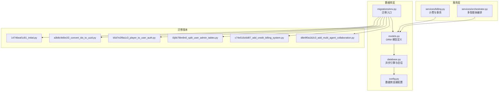
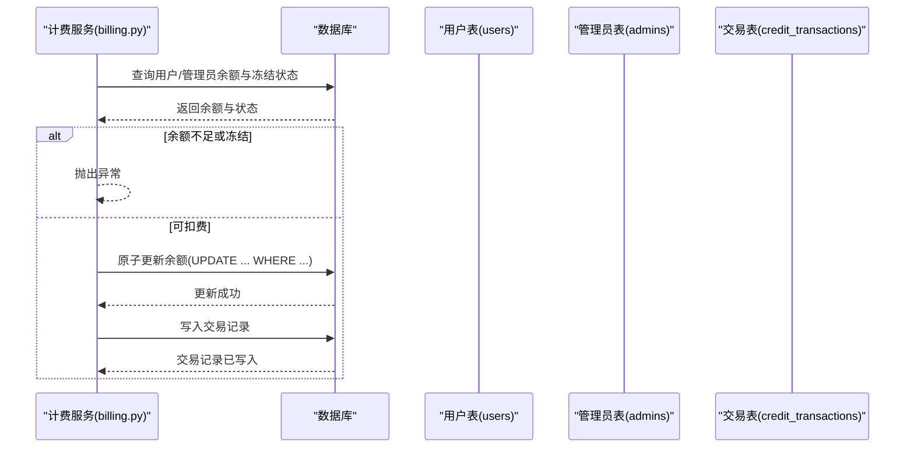
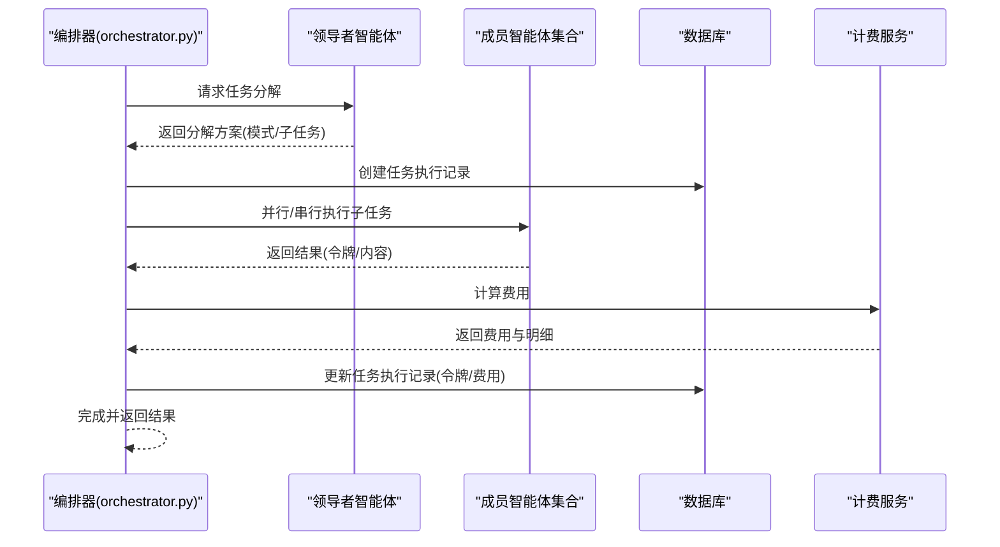
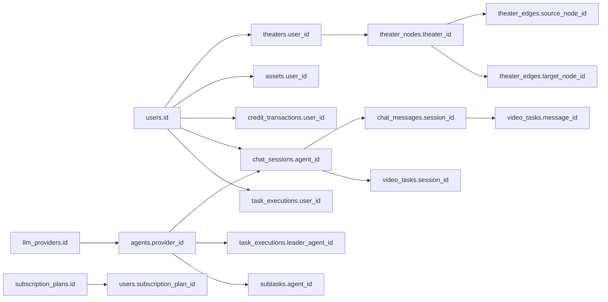

# 实体关系和约束

<cite>
**本文档引用的文件**
- [models.py](file://backend/models.py)
- [database.py](file://backend/database.py)
- [config.py](file://backend/config.py)
- [env.py](file://backend/migrations/env.py)
- [14746eaf1c81_initial.py](file://backend/migrations/versions/14746eaf1c81_initial.py)
- [a3b8c9d0e1f2_convert_ids_to_uuid.py](file://backend/migrations/versions/a3b8c9d0e1f2_convert_ids_to_uuid.py)
- [b5d7e2f8a1c3_player_to_user_auth.py](file://backend/migrations/versions/b5d7e2f8a1c3_player_to_user_auth.py)
- [i5j6k7l8m9n0_split_user_admin_tables.py](file://backend/migrations/versions/i5j6k7l8m9n0_split_user_admin_tables.py)
- [c74e516c6d87_add_credit_billing_system.py](file://backend/migrations/versions/c74e516c6d87_add_credit_billing_system.py)
- [d8e9f0a1b2c3_add_multi_agent_collaboration.py](file://backend/migrations/versions/d8e9f0a1b2c3_add_multi_agent_collaboration.py)
- [billing.py](file://backend/services/billing.py)
- [orchestrator.py](file://backend/services/orchestrator.py)
</cite>

## 目录
1. [简介](#简介)
2. [项目结构](#项目结构)
3. [核心组件](#核心组件)
4. [架构总览](#架构总览)
5. [详细组件分析](#详细组件分析)
6. [依赖分析](#依赖分析)
7. [性能考量](#性能考量)
8. [故障排查指南](#故障排查指南)
9. [结论](#结论)
10. [附录](#附录)

## 简介
本文件聚焦于 Infinite Game 的数据模型关系与约束，系统梳理实体间的一对一、一对多、多对多关系，解释外键约束、唯一性约束、非空约束、索引策略及其选择原因。同时结合计费系统、多智能体协作流程，说明级联删除规则、事务一致性与原子性保障、以及 UUID 主键在分布式环境中的优势与落地实践。文档还提供实体关系图与外键引用示例，帮助开发者快速理解与维护数据库结构。

## 项目结构
数据库层由 SQLAlchemy ORM 模型、Alembic 迁移脚本与异步数据库连接组成。模型文件集中定义了所有实体及字段约束；迁移脚本记录了从初始版本到当前版本的演进过程；配置文件提供数据库连接参数；服务层在运行期通过事务保证计费与协作流程的原子性。



图表来源
- [models.py:1-447](file://backend/models.py#L1-L447)
- [database.py:1-31](file://backend/database.py#L1-L31)
- [config.py:1-43](file://backend/config.py#L1-L43)
- [env.py:1-120](file://backend/migrations/env.py#L1-L120)
- [14746eaf1c81_initial.py:1-56](file://backend/migrations/versions/14746eaf1c81_initial.py#L1-L56)
- [a3b8c9d0e1f2_convert_ids_to_uuid.py:1-335](file://backend/migrations/versions/a3b8c9d0e1f2_convert_ids_to_uuid.py#L1-L335)
- [b5d7e2f8a1c3_player_to_user_auth.py:1-150](file://backend/migrations/versions/b5d7e2f8a1c3_player_to_user_auth.py#L1-L150)
- [i5j6k7l8m9n0_split_user_admin_tables.py:1-97](file://backend/migrations/versions/i5j6k7l8m9n0_split_user_admin_tables.py#L1-L97)
- [c74e516c6d87_add_credit_billing_system.py:1-67](file://backend/migrations/versions/c74e516c6d87_add_credit_billing_system.py#L1-L67)
- [d8e9f0a1b2c3_add_multi_agent_collaboration.py:1-104](file://backend/migrations/versions/d8e9f0a1b2c3_add_multi_agent_collaboration.py#L1-L104)
- [billing.py:1-388](file://backend/services/billing.py#L1-L388)
- [orchestrator.py:1-899](file://backend/services/orchestrator.py#L1-L899)

章节来源
- [models.py:1-447](file://backend/models.py#L1-L447)
- [database.py:1-31](file://backend/database.py#L1-L31)
- [config.py:1-43](file://backend/config.py#L1-L43)
- [env.py:1-120](file://backend/migrations/env.py#L1-L120)

## 核心组件
- 异步数据库引擎与会话：基于 SQLAlchemy AsyncIO，启用连接池与自动重连，支持 SQLite 与 PostgreSQL。
- ORM 模型：定义实体、字段类型、主键、索引、外键、默认值与时间戳。
- 迁移系统：通过 Alembic 版本化管理，记录从整数 ID 到 UUID 的迁移、用户与管理员表拆分、计费系统与多智能体协作功能的引入。
- 服务层：计费服务负责余额原子性扣减与退款；编排服务负责多智能体任务分解与执行，贯穿计费与事务。

章节来源
- [database.py:1-31](file://backend/database.py#L1-L31)
- [models.py:1-447](file://backend/models.py#L1-L447)
- [env.py:1-120](file://backend/migrations/env.py#L1-L120)
- [billing.py:1-388](file://backend/services/billing.py#L1-L388)
- [orchestrator.py:1-899](file://backend/services/orchestrator.py#L1-L899)

## 架构总览
下图展示了数据库层的实体关系与外键约束，涵盖用户、管理员、智能体、会话、剧场、节点、边、资产、计费、任务执行与子任务等核心实体。

```mermaid
erDiagram
USERS {
string id PK
string email UK
string nickname
string password_hash
string google_id UK
string github_id UK
string role
boolean is_active
boolean is_balance_frozen
float credits
datetime created_at
datetime updated_at
}
ADMINS {
string id PK
string email UK
string nickname
string password_hash
boolean is_active
string permission_level
float credits
datetime created_at
datetime updated_at
}
SUBSCRIPTION_PLANS {
string id PK
string name UK
text description
float price_usd
float credits
string billing_period
json features
boolean is_active
integer sort_order
datetime created_at
datetime updated_at
}
THEATERS {
string id PK
string user_id FK
string title
text description
string thumbnail_url
string status
json canvas_viewport
json settings
integer node_count
datetime created_at
datetime updated_at
}
THEATER_NODES {
string id PK
string theater_id FK
string node_type
float position_x
float position_y
float width
float height
integer z_index
json data
string created_by_agent_id FK
datetime created_at
datetime updated_at
}
THEATER_EDGES {
string id PK
string theater_id FK
string source_node_id FK
string target_node_id FK
string source_handle
string target_handle
string edge_type
boolean animated
json style
datetime created_at
}
ASSETS {
integer id PK
string user_id FK
string type
string content_hash
string url
text prompt
datetime last_accessed
string file_path
}
LLM_PROVIDERS {
string id PK
string name UK
string provider_type
string api_key
string base_url
json models
json tags
boolean is_active
boolean is_default
json config_json
json model_costs
datetime created_at
datetime updated_at
}
AGENTS {
string id PK
string name UK
string description
string provider_id FK
string model
string agent_type
float temperature
integer context_window
text system_prompt
json tools
boolean thinking_mode
float input_credit_per_1m
float output_credit_per_1m
float image_output_credit_per_1m
float search_credit_per_query
float video_input_image_credit
float video_input_second_credit
float video_output_480p_credit
float video_output_720p_credit
boolean is_leader
json coordination_modes
json member_agent_ids
integer max_subtasks
boolean enable_auto_review
json gemini_config
json xai_image_config
float image_credit_per_image
json image_config
json target_node_types
datetime created_at
datetime updated_at
}
CHAT_SESSIONS {
string id PK
string title
string agent_id FK
string user_id FK
string theater_id FK
datetime created_at
datetime updated_at
}
CHAT_MESSAGES {
string id PK
string session_id FK
string role
text content
datetime created_at
}
CREDIT_TRANSACTIONS {
string id PK
string user_id FK
string admin_id FK
string agent_id FK
string session_id FK
string transaction_type
float amount
float balance_before
float balance_after
integer input_tokens
integer output_tokens
json metadata_json
text description
datetime created_at
}
TASK_EXECUTIONS {
string id PK
string leader_agent_id FK
string user_id FK
string session_id FK
text task_description
string coordination_mode
string status
json result
integer total_input_tokens
integer total_output_tokens
float total_credit_cost
json execution_metadata
datetime created_at
datetime completed_at
}
SUBTASKS {
string id PK
string task_execution_id FK
string agent_id FK
string parent_subtask_id FK
text description
integer order_index
string status
json input_data
json output_data
integer input_tokens
integer output_tokens
float credit_cost
integer retry_count
text error_message
datetime created_at
datetime completed_at
}
VIDEO_TASKS {
string id PK
string xai_task_id
string session_id FK
string message_id FK
string provider_id FK
string model
string user_id
string video_mode
text prompt
string image_url
integer duration
string quality
string aspect_ratio
string mode
string status
string result_video_url
text error_message
integer input_image_count
float output_duration_seconds
float credit_cost
datetime created_at
datetime completed_at
}
ADMIN_DEBUG_SESSIONS {
string id PK
string title
string agent_id FK
string admin_id FK
datetime created_at
datetime updated_at
}
ADMIN_DEBUG_MESSAGES {
string id PK
string session_id FK
string role
text content
datetime created_at
}
THEATERS ||--o{ THEATER_NODES : "拥有"
THEATER_NODES ||--o{ THEATER_EDGES : "连接"
THEATER_NODES ||--o{ THEATER_EDGES : "被连接"
THEATER_NODES ||--o{ CHAT_MESSAGES : "属于"
THEATER_EDGES ||--o{ CHAT_MESSAGES : "属于"
THEATERS ||--o{ CHAT_SESSIONS : "关联"
CHAT_SESSIONS ||--o{ CHAT_MESSAGES : "包含"
USERS ||--o{ THEATERS : "创建"
USERS ||--o{ ASSETS : "拥有"
USERS ||--o{ CREDIT_TRANSACTIONS : "产生"
ADMINS ||--o{ CREDIT_TRANSACTIONS : "产生"
AGENTS ||--o{ CHAT_SESSIONS : "参与"
AGENTS ||--o{ TASK_EXECUTIONS : "领导"
AGENTS ||--o{ SUBTASKS : "执行"
SUBTASKS ||--o{ SUBTASKS : "父子"
LLM_PROVIDERS ||--o{ AGENTS : "提供"
SUBSCRIPTION_PLANS ||--o{ USERS : "订阅"
CHAT_SESSIONS ||--o{ VIDEO_TASKS : "触发"
CHAT_MESSAGES ||--o{ VIDEO_TASKS : "关联"
USERS ||--o{ VIDEO_TASKS : "发起"
LLM_PROVIDERS ||--o{ VIDEO_TASKS : "提供"
```



图表来源
- [models.py:10-447](file://backend/models.py#L10-L447)

章节来源
- [models.py:10-447](file://backend/models.py#L10-L447)

## 详细组件分析

### 用户与管理员体系
- 用户表与管理员表分离，分别维护认证与权限字段，避免混淆。
- 用户与管理员均具备积分余额字段，支持统一的计费与退款流程。
- 订阅计划与用户建立外键关系，支持订阅状态与有效期管理。

```mermaid
classDiagram
class Users {
+string id
+string email
+string nickname
+string password_hash
+string google_id
+string github_id
+string role
+boolean is_active
+boolean is_balance_frozen
+float credits
+datetime created_at
+datetime updated_at
}
class Admins {
+string id
+string email
+string nickname
+string password_hash
+boolean is_active
+string permission_level
+float credits
+datetime created_at
+datetime updated_at
}
class SubscriptionPlans {
+string id
+string name
+text description
+float price_usd
+float credits
+string billing_period
+json features
+boolean is_active
+integer sort_order
+datetime created_at
+datetime updated_at
}
Users ||--o{ SubscriptionPlans : "订阅"
```

图表来源
- [models.py:35-73](file://backend/models.py#L35-L73)
- [models.py:10-33](file://backend/models.py#L10-L33)
- [models.py:369-389](file://backend/models.py#L369-L389)

章节来源
- [models.py:35-73](file://backend/models.py#L35-L73)
- [models.py:10-33](file://backend/models.py#L10-L33)
- [models.py:369-389](file://backend/models.py#L369-L389)
- [i5j6k7l8m9n0_split_user_admin_tables.py:21-75](file://backend/migrations/versions/i5j6k7l8m9n0_split_user_admin_tables.py#L21-L75)

### 智能体与提供商
- 智能体与提供商之间为一对一关系，每个智能体绑定一个提供商与具体模型。
- 智能体具备多种计费字段，覆盖文本、图像、搜索与视频生成等维度。
- 提供商表支持模型清单、标签、默认配置与按模型计费映射。

```mermaid
classDiagram
class LLMProviders {
+string id
+string name
+string provider_type
+string api_key
+string base_url
+json models
+json tags
+boolean is_active
+boolean is_default
+json config_json
+json model_costs
+datetime created_at
+datetime updated_at
}
class Agents {
+string id
+string name
+string description
+string provider_id
+string model
+string agent_type
+float input_credit_per_1m
+float output_credit_per_1m
+float image_output_credit_per_1m
+float search_credit_per_query
+float video_input_image_credit
+float video_input_second_credit
+float video_output_480p_credit
+float video_output_720p_credit
+boolean is_leader
+json coordination_modes
+json member_agent_ids
+integer max_subtasks
+boolean enable_auto_review
+datetime created_at
+datetime updated_at
}
LLMProviders ||--o{ Agents : "提供"
```

图表来源
- [models.py:146-170](file://backend/models.py#L146-L170)
- [models.py:196-253](file://backend/models.py#L196-L253)

章节来源
- [models.py:146-170](file://backend/models.py#L146-L170)
- [models.py:196-253](file://backend/models.py#L196-L253)
- [14746eaf1c81_initial.py:21-52](file://backend/migrations/versions/14746eaf1c81_initial.py#L21-L52)

### 剧场、节点与边
- 剧场与用户为一对一关系，每个剧场由用户创建。
- 剧场与节点为一对多关系，节点属于剧场且位置信息独立存储。
- 边连接两个节点，形成剧场内的关系网络；边与节点、剧场均建立外键关系。
- 节点与边均设置级联删除，确保删除剧场时自动清理其节点与边。

```mermaid
classDiagram
class Theaters {
+string id
+string user_id
+string title
+text description
+string thumbnail_url
+string status
+json canvas_viewport
+json settings
+integer node_count
+datetime created_at
+datetime updated_at
}
class TheaterNodes {
+string id
+string theater_id
+string node_type
+float position_x
+float position_y
+float width
+float height
+integer z_index
+json data
+string created_by_agent_id
+datetime created_at
+datetime updated_at
}
class TheaterEdges {
+string id
+string theater_id
+string source_node_id
+string target_node_id
+string source_handle
+string target_handle
+string edge_type
+boolean animated
+json style
+datetime created_at
}
Theaters ||--o{ TheaterNodes : "拥有"
TheaterNodes ||--o{ TheaterEdges : "连接"
TheaterNodes ||--o{ TheaterEdges : "被连接"
```

图表来源
- [models.py:75-91](file://backend/models.py#L75-L91)
- [models.py:93-130](file://backend/models.py#L93-L130)

章节来源
- [models.py:75-91](file://backend/models.py#L75-L91)
- [models.py:93-130](file://backend/models.py#L93-L130)

### 会话与消息
- 会话与用户、智能体、剧场建立外键关系，支持用户与管理员的会话区分。
- 消息属于会话，角色与内容构成对话历史。
- 管理员调试会话与消息与普通会话隔离，便于审计与测试。

```mermaid
classDiagram
class ChatSessions {
+string id
+string title
+string agent_id
+string user_id
+string theater_id
+datetime created_at
+datetime updated_at
}
class ChatMessages {
+string id
+string session_id
+string role
+text content
+datetime created_at
}
class AdminDebugSessions {
+string id
+string title
+string agent_id
+string admin_id
+datetime created_at
+datetime updated_at
}
class AdminDebugMessages {
+string id
+string session_id
+string role
+text content
+datetime created_at
}
ChatSessions ||--o{ ChatMessages : "包含"
AdminDebugSessions ||--o{ AdminDebugMessages : "包含"
```

图表来源
- [models.py:172-183](file://backend/models.py#L172-L183)
- [models.py:185-194](file://backend/models.py#L185-L194)
- [models.py:424-435](file://backend/models.py#L424-L435)
- [models.py:437-447](file://backend/models.py#L437-L447)

章节来源
- [models.py:172-183](file://backend/models.py#L172-L183)
- [models.py:185-194](file://backend/models.py#L185-L194)
- [models.py:424-435](file://backend/models.py#L424-L435)
- [models.py:437-447](file://backend/models.py#L437-L447)

### 计费与交易
- 计费系统通过智能体的费率字段与令牌统计计算费用，支持文本、图像、搜索与视频生成等维度。
- 交易记录与用户、管理员、智能体、会话建立外键关系，记录余额变化与明细。
- 服务层提供原子扣费与退款，确保并发安全与一致性。



图表来源
- [billing.py:45-84](file://backend/services/billing.py#L45-L84)
- [billing.py:178-308](file://backend/services/billing.py#L178-L308)
- [models.py:261-281](file://backend/models.py#L261-L281)

章节来源
- [billing.py:45-84](file://backend/services/billing.py#L45-L84)
- [billing.py:178-308](file://backend/services/billing.py#L178-L308)
- [models.py:261-281](file://backend/models.py#L261-L281)
- [c74e516c6d87_add_credit_billing_system.py:21-67](file://backend/migrations/versions/c74e516c6d87_add_credit_billing_system.py#L21-L67)

### 多智能体协作与任务执行
- 领导者智能体负责任务分解，生成子任务并调度成员智能体执行。
- 子任务与父子任务形成树形层级关系，支持并行与串行两种执行模式。
- 编排器在执行过程中计算并累计令牌与费用，最终汇总到任务执行记录。



图表来源
- [orchestrator.py:560-673](file://backend/services/orchestrator.py#L560-L673)
- [d8e9f0a1b2c3_add_multi_agent_collaboration.py:21-104](file://backend/migrations/versions/d8e9f0a1b2c3_add_multi_agent_collaboration.py#L21-L104)

章节来源
- [orchestrator.py:560-673](file://backend/services/orchestrator.py#L560-L673)
- [d8e9f0a1b2c3_add_multi_agent_collaboration.py:21-104](file://backend/migrations/versions/d8e9f0a1b2c3_add_multi_agent_collaboration.py#L21-L104)

### 视频任务与计费
- 视频任务记录输入图片数量、输出时长与质量，按提供商模型计费映射计算费用。
- 任务与会话、消息、提供商、用户建立外键关系，便于溯源与审计。

```mermaid
classDiagram
class VideoTasks {
+string id
+string xai_task_id
+string session_id
+string message_id
+string provider_id
+string model
+string user_id
+string video_mode
+text prompt
+string image_url
+integer duration
+string quality
+string aspect_ratio
+string mode
+string status
+string result_video_url
+text error_message
+integer input_image_count
+float output_duration_seconds
+float credit_cost
+datetime created_at
+datetime completed_at
}
class LLMProviders {
+string id
+json model_costs
}
LLMProviders ||--o{ VideoTasks : "提供计费映射"
```

图表来源
- [models.py:391-422](file://backend/models.py#L391-L422)
- [models.py:146-170](file://backend/models.py#L146-L170)

章节来源
- [models.py:391-422](file://backend/models.py#L391-L422)
- [models.py:146-170](file://backend/models.py#L146-L170)

## 依赖分析
- 模型依赖：实体间通过外键建立强依赖，如 TheaterNodes 依赖 Theater，ChatMessages 依赖 ChatSessions。
- 级联删除：节点与边在删除剧场时自动清理，确保数据一致性。
- 索引策略：主键与常用查询字段建立索引，提升查询效率；部分字段采用唯一约束防止重复。
- 迁移演进：从整数 ID 迁移到 UUID，支持跨系统合并与分布式部署；用户与管理员表拆分，增强权限隔离。



图表来源
- [models.py:35-447](file://backend/models.py#L35-L447)

章节来源
- [models.py:35-447](file://backend/models.py#L35-L447)

## 性能考量
- 连接池与自动重连：异步引擎配置连接池大小与溢出连接数，SQLite 下禁用线程限制，降低上下文切换开销。
- 索引策略：对频繁过滤与关联的字段建立索引，如用户邮箱、智能体名称、剧场状态、会话与任务状态等，平衡写入与查询性能。
- 原子操作：计费与退款通过 UPDATE ... WHERE 条件判断实现原子性，避免竞态条件。
- 批量迁移：迁移脚本使用批处理方式创建索引与约束，减少锁竞争与DDL时间。
- UUID 主键：全局唯一标识符便于跨系统合并与分布式部署，避免自增冲突；配合索引与分区策略可进一步优化查询。

章节来源
- [database.py:8-23](file://backend/database.py#L8-L23)
- [models.py:14-18](file://backend/models.py#L14-L18)
- [models.py:40-47](file://backend/models.py#L40-L47)
- [models.py:149-150](file://backend/models.py#L149-L150)
- [models.py:199-200](file://backend/models.py#L199-L200)
- [models.py:79-84](file://backend/models.py#L79-L84)
- [models.py:175-182](file://backend/models.py#L175-L182)
- [models.py:287-294](file://backend/models.py#L287-L294)
- [models.py:395-411](file://backend/models.py#L395-L411)

## 故障排查指南
- 余额不足或冻结：检查用户/管理员余额与冻结状态，确认计费服务抛出的异常类型。
- 外键约束失败：核对关联实体是否存在，尤其是 UUID 是否正确传递。
- 级联删除异常：确认删除顺序与依赖关系，避免违反外键约束。
- 迁移残留：迁移入口包含清理 Alembic 临时表逻辑，若出现异常可手动清理残留临时表。

章节来源
- [billing.py:37-43](file://backend/services/billing.py#L37-L43)
- [billing.py:258-287](file://backend/services/billing.py#L258-L287)
- [env.py:67-77](file://backend/migrations/env.py#L67-L77)

## 结论
Infinite Game 的数据库设计围绕“用户/管理员分离、智能体与提供商绑定、剧场与节点/边的层次化结构、计费与任务执行的原子性保障”展开。通过 UUID 主键与完善的索引策略，系统在保证数据一致性的同时兼顾查询效率。迁移脚本清晰记录了从整数 ID 到 UUID、从单一用户表到分离的用户与管理员表、从基础聊天到多智能体协作与视频生成的演进路径。建议在生产环境中持续关注索引维护、批量迁移与监控告警，确保系统在高并发下的稳定性与可扩展性。

## 附录
- 外键引用示例（路径）
  - 用户与剧场：users.id → theaters.user_id
  - 用户与资产：users.id → assets.user_id
  - 用户与会话：users.id → chat_sessions.user_id
  - 用户与任务执行：users.id → task_executions.user_id
  - 提供商与智能体：llm_providers.id → agents.provider_id
  - 智能体与会话：agents.id → chat_sessions.agent_id
  - 智能体与任务执行：agents.id → task_executions.leader_agent_id
  - 智能体与子任务：agents.id → subtasks.agent_id
  - 剧场与节点：theaters.id → theater_nodes.theater_id
  - 节点与边：theater_nodes.id → theater_edges.source_node_id / target_node_id
  - 会话与消息：chat_sessions.id → chat_messages.session_id
  - 会话与视频任务：chat_sessions.id → video_tasks.session_id
  - 消息与视频任务：chat_messages.id → video_tasks.message_id
  - 订阅计划与用户：subscription_plans.id → users.subscription_plan_id

章节来源
- [models.py:35-447](file://backend/models.py#L35-L447)