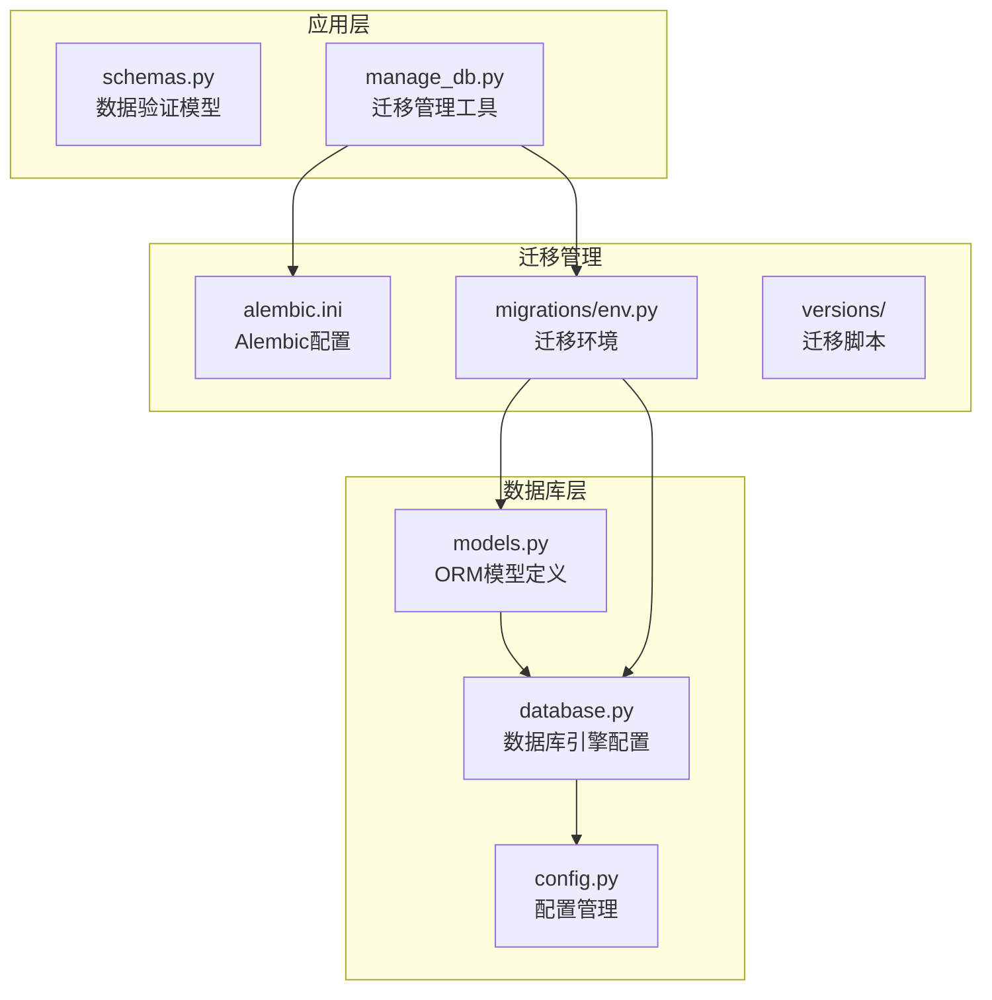
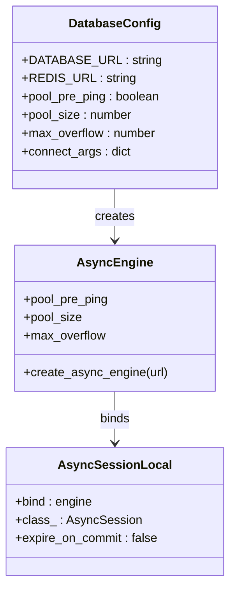
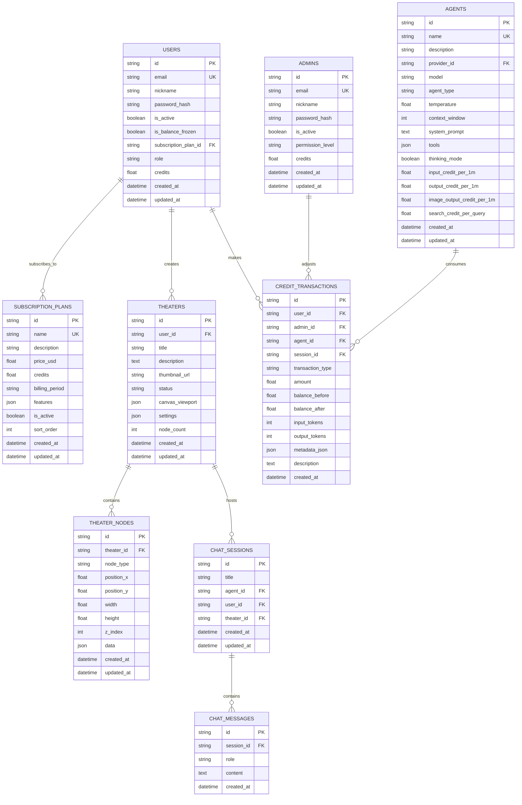
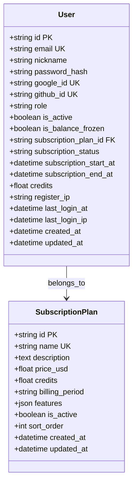
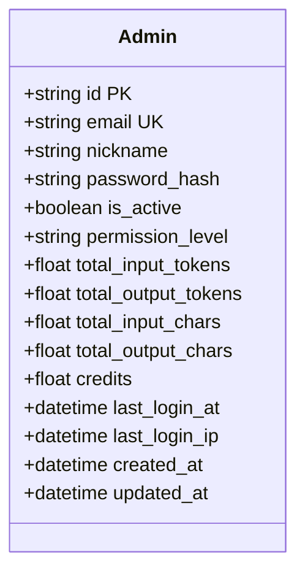
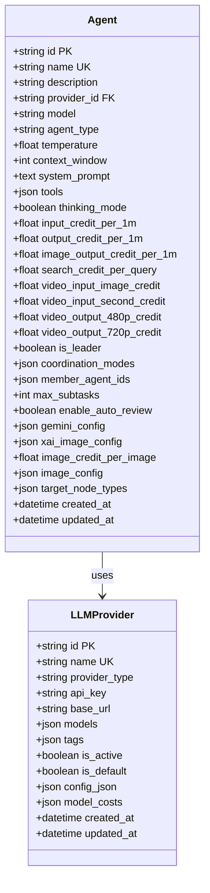
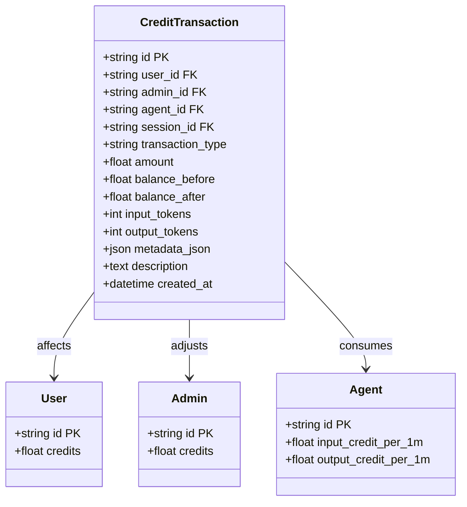
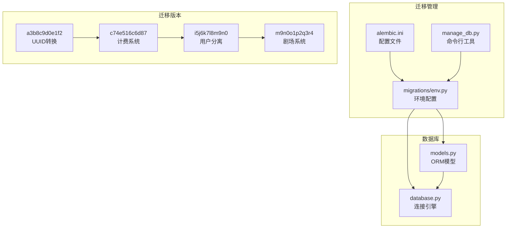

# 数据模型设计

<cite>
**本文档引用的文件**
- [models.py](file://backend/models.py)
- [database.py](file://backend/database.py)
- [config.py](file://backend/config.py)
- [schemas.py](file://backend/schemas.py)
- [manage_db.py](file://backend/manage_db.py)
- [migrations/env.py](file://backend/migrations/env.py)
- [alembic.ini](file://backend/alembic.ini)
- [migrations/versions/a3b8c9d0e1f2_convert_ids_to_uuid.py](file://backend/migrations/versions/a3b8c9d0e1f2_convert_ids_to_uuid.py)
- [migrations/versions/c74e516c6d87_add_credit_billing_system.py](file://backend/migrations/versions/c74e516c6d87_add_credit_billing_system.py)
- [migrations/versions/i5j6k7l8m9n0_split_user_admin_tables.py](file://backend/migrations/versions/i5j6k7l8m9n0_split_user_admin_tables.py)
- [migrations/versions/m9n0o1p2q3r4_add_theater_system.py](file://backend/migrations/versions/m9n0o1p2q3r4_add_theater_system.py)
</cite>

## 目录
1. [简介](#简介)
2. [项目结构](#项目结构)
3. [核心组件](#核心组件)
4. [架构概览](#架构概览)
5. [详细组件分析](#详细组件分析)
6. [依赖关系分析](#依赖关系分析)
7. [性能考虑](#性能考虑)
8. [故障排除指南](#故障排除指南)
9. [结论](#结论)
10. [附录](#附录)

## 简介

Infinite Game 是一个基于 AI 的无限叙事剧场平台，其数据模型设计围绕着用户创作、智能体协作和多媒体内容生成展开。本项目采用 SQLAlchemy ORM 和 Alembic 迁移框架，实现了完整的数据库模型设计和版本管理。

数据模型的核心目标是：
- 支持用户驱动的创意项目创作
- 提供多智能体协作的编排能力
- 实现精细化的计费和配额管理
- 确保数据的一致性和可扩展性

## 项目结构

项目采用分层架构，数据库相关代码主要集中在 backend 目录中：



**图表来源**
- [models.py:1-447](file://backend/models.py#L1-L447)
- [database.py:1-31](file://backend/database.py#L1-L31)
- [config.py:1-43](file://backend/config.py#L1-L43)

**章节来源**
- [models.py:1-447](file://backend/models.py#L1-L447)
- [database.py:1-31](file://backend/database.py#L1-L31)
- [config.py:1-43](file://backend/config.py#L1-L43)

## 核心组件

### 数据库连接配置

系统使用 SQLAlchemy AsyncIO 引擎，支持 PostgreSQL 和 SQLite 两种数据库后端：



**图表来源**
- [database.py:8-23](file://backend/database.py#L8-L23)
- [config.py:15](file://backend/config.py#L15)

### 主要实体模型

系统包含以下核心实体：

1. **User/Admin**: 用户身份管理
2. **Theater/TheaterNode**: 创意项目和画布节点
3. **Agent**: AI智能体配置
4. **CreditTransaction**: 积分交易记录
5. **ChatSession/ChatMessage**: 对话会话和消息
6. **SubscriptionPlan**: 订阅套餐

**章节来源**
- [models.py:10-447](file://backend/models.py#L10-L447)

## 架构概览



**图表来源**
- [models.py:35-447](file://backend/models.py#L35-L447)

## 详细组件分析

### 用户管理系统

#### User 实体设计

User 实体是系统的核心用户表，采用 UUID 作为主键，支持多种认证方式：



**图表来源**
- [models.py:35-73](file://backend/models.py#L35-L73)
- [models.py:369-389](file://backend/models.py#L369-L389)

#### Admin 实体设计

Admin 实体与 User 分离，提供独立的管理员权限管理：



**图表来源**
- [models.py:10-33](file://backend/models.py#L10-L33)

**章节来源**
- [models.py:10-73](file://backend/models.py#L10-L73)

### 剧场系统

#### Theater 实体设计

Theater 实体代表用户创建的创意项目，支持草稿、发布、归档三种状态：

```mermaid
classDiagram
class Theater {
+string id PK
+string user_id FK
+string title
+text description
+string thumbnail_url
+string status
+json canvas_viewport
+json settings
+int node_count
+datetime created_at
+datetime updated_at
}
class TheaterNode {
+string id PK
+string theater_id FK
+string node_type
+float position_x
+float position_y
+float width
+float height
+int z_index
+json data
+datetime created_at
+datetime updated_at
}
class TheaterEdge {
+string id PK
+string theater_id FK
+string source_node_id FK
+string target_node_id FK
+string source_handle
+string target_handle
+string edge_type
+boolean animated
+json style
+datetime created_at
}
Theater ||--o{ TheaterNode : contains
Theater ||--o{ TheaterEdge : connects
TheaterNode ||--|| TheaterEdge : connects
```

**图表来源**
- [models.py:75-129](file://backend/models.py#L75-L129)

#### 节点类型定义

系统支持四种节点类型：
- **script**: 文本脚本节点
- **character**: 角色节点  
- **storyboard**: 分镜节点
- **video**: 视频节点

**章节来源**
- [models.py:75-129](file://backend/models.py#L75-L129)

### 智能体系统

#### Agent 实体设计

Agent 实体是 AI 智能体的核心配置表：



**图表来源**
- [models.py:196-253](file://backend/models.py#L196-L253)
- [models.py:146-170](file://backend/models.py#L146-L170)

**章节来源**
- [models.py:196-253](file://backend/models.py#L196-L253)

### 计费系统

#### CreditTransaction 实体设计

CreditTransaction 实体记录所有积分交易：



**图表来源**
- [models.py:261-281](file://backend/models.py#L261-L281)

**章节来源**
- [models.py:261-281](file://backend/models.py#L261-L281)

### 对话系统

#### ChatSession 和 ChatMessage 设计

对话系统支持用户与智能体的交互：

```mermaid
classDiagram
class ChatSession {
+string id PK
+string title
+string agent_id FK
+string user_id FK
+string theater_id FK
+datetime created_at
+datetime updated_at
}
class ChatMessage {
+string id PK
+string session_id FK
+string role
+text content
+datetime created_at
}
ChatSession ||--o{ ChatMessage : contains
```

**图表来源**
- [models.py:172-194](file://backend/models.py#L172-L194)

**章节来源**
- [models.py:172-194](file://backend/models.py#L172-L194)

## 依赖关系分析

### 数据库迁移架构

系统采用 Alembic 进行数据库版本管理，支持在线和离线迁移模式：



**图表来源**
- [migrations/env.py:1-120](file://backend/migrations/env.py#L1-L120)
- [manage_db.py:1-80](file://backend/manage_db.py#L1-L80)

### 迁移演进历史

系统经历了四个主要的数据库演进阶段：

1. **初始阶段**: 基础玩家、智能体和对话系统
2. **计费系统**: 引入积分交易和智能体费率
3. **用户分离**: 管理员表与用户表分离
4. **剧场系统**: 替换传统故事章节为可视化剧场

**章节来源**
- [migrations/versions/a3b8c9d0e1f2_convert_ids_to_uuid.py:1-335](file://backend/migrations/versions/a3b8c9d0e1f2_convert_ids_to_uuid.py#L1-L335)
- [migrations/versions/c74e516c6d87_add_credit_billing_system.py:1-67](file://backend/migrations/versions/c74e516c6d87_add_credit_billing_system.py#L1-L67)
- [migrations/versions/i5j6k7l8m9n0_split_user_admin_tables.py:1-97](file://backend/migrations/versions/i5j6k7l8m9n0_split_user_admin_tables.py#L1-L97)
- [migrations/versions/m9n0o1p2q3r4_add_theater_system.py:1-107](file://backend/migrations/versions/m9n0o1p2q3r4_add_theater_system.py#L1-L107)

## 性能考虑

### 索引策略

系统采用了多层次的索引策略来优化查询性能：

1. **主键索引**: 所有表的主键自动创建
2. **唯一索引**: email、name、id 等唯一约束字段
3. **复合索引**: 常用查询条件组合
4. **JSON 字段索引**: 部分 JSON 字段建立索引

### 连接池配置

数据库连接池配置优化了并发访问：

- **pool_pre_ping**: 自动重连检测
- **pool_size**: 连接池大小为 10
- **max_overflow**: 最大溢出连接数为 20
- **expire_on_commit**: 提交后不自动过期

### 查询优化建议

1. **批量操作**: 使用批量插入和更新减少网络往返
2. **延迟加载**: 对于大型 JSON 字段采用延迟加载
3. **缓存策略**: 对频繁查询的结果进行缓存
4. **分区策略**: 大表考虑按时间分区

## 故障排除指南

### 常见问题及解决方案

#### 迁移失败

当遇到迁移失败时，可以执行以下步骤：

1. **清理残留表**: Alembic 环境会自动清理 `_alembic_tmp_` 前缀的临时表
2. **检查数据库连接**: 确认 DATABASE_URL 配置正确
3. **查看日志**: 检查 Alembic 日志输出获取详细错误信息

#### 数据一致性问题

如果发现数据不一致，可以：

1. **重新运行迁移**: 使用 `python manage_db.py upgrade` 重新应用所有迁移
2. **检查外键约束**: 确认所有外键关系正确建立
3. **验证数据完整性**: 运行数据完整性检查脚本

#### 性能问题

针对性能问题的诊断方法：

1. **监控慢查询**: 使用数据库慢查询日志
2. **分析执行计划**: 检查复杂查询的执行计划
3. **调整索引**: 根据查询模式优化索引策略

**章节来源**
- [migrations/env.py:67-78](file://backend/migrations/env.py#L67-L78)
- [main.py:68-92](file://backend/main.py#L68-L92)

## 结论

Infinite Game 的数据模型设计体现了现代 Web 应用的最佳实践：

1. **模块化设计**: 清晰的实体分离和职责划分
2. **可扩展性**: 支持未来功能的平滑扩展
3. **版本控制**: 完善的数据库迁移管理
4. **性能优化**: 针对高并发场景的优化策略
5. **数据安全**: 完整的权限控制和审计机制

该数据模型为 AI 驱动的创意平台提供了坚实的基础，支持复杂的多智能体协作和丰富的多媒体内容生成需求。

## 附录

### 数据模型最佳实践

1. **字段设计原则**:
   - 使用 UUID 作为主键，避免序列号暴露
   - 对敏感信息（如密码哈希）进行加密存储
   - 合理使用 JSON 字段存储动态配置

2. **关系设计原则**:
   - 明确一对多和多对多关系
   - 使用适当的级联删除策略
   - 建立必要的外键约束

3. **索引设计原则**:
   - 为常用查询条件建立索引
   - 避免过度索引影响写入性能
   - 考虑复合索引的使用场景

4. **迁移管理原则**:
   - 始终编写可逆的迁移脚本
   - 测试迁移在不同数据库上的兼容性
   - 保持迁移脚本的清晰和可读性