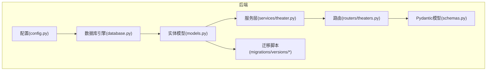
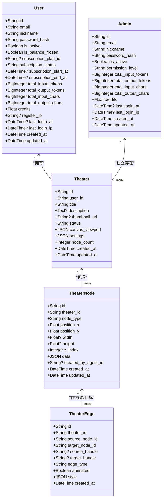
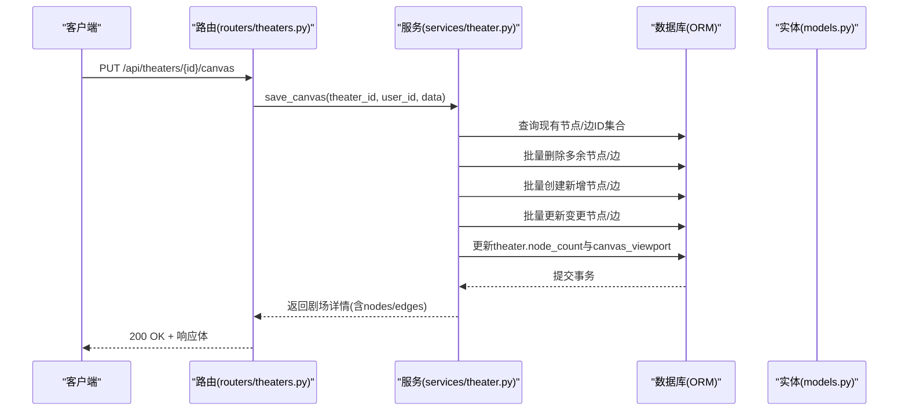
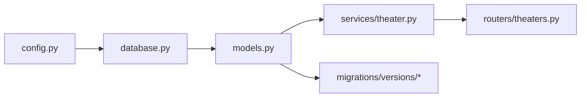

# 核心实体模型

<cite>
**本文档引用的文件**
- [models.py](file://backend/models.py)
- [database.py](file://backend/database.py)
- [config.py](file://backend/config.py)
- [schemas.py](file://backend/schemas.py)
- [migrations/versions/m9n0o1p2q3r4_add_theater_system.py](file://backend/migrations/versions/m9n0o1p2q3r4_add_theater_system.py)
- [migrations/versions/i5j6k7l8m9n0_split_user_admin_tables.py](file://backend/migrations/versions/i5j6k7l8m9n0_split_user_admin_tables.py)
- [migrations/versions/a3b8c9d0e1f2_convert_ids_to_uuid.py](file://backend/migrations/versions/a3b8c9d0e1f2_convert_ids_to_uuid.py)
- [migrations/versions/2733ee5c4fd0_add_theater_id_to_chat_sessions.py](file://backend/migrations/versions/2733ee5c4fd0_add_theater_id_to_chat_sessions.py)
- [services/theater.py](file://backend/services/theater.py)
- [routers/theaters.py](file://backend/routers/theaters.py)
</cite>

## 目录
1. [简介](#简介)
2. [项目结构](#项目结构)
3. [核心组件](#核心组件)
4. [架构总览](#架构总览)
5. [详细组件分析](#详细组件分析)
6. [依赖分析](#依赖分析)
7. [性能考虑](#性能考虑)
8. [故障排除指南](#故障排除指南)
9. [结论](#结论)

## 简介
本文件系统性梳理 Infinite Game 的核心实体模型，重点围绕用户(User)、管理员(Admin)、剧场(Theater)、节点(TheaterNode)、边(TheaterEdge)等基础实体进行设计与实现解析。内容涵盖字段定义、数据类型选择、约束条件与索引策略、实体间外键关系与级联删除规则、生命周期管理与时间戳作用、以及数据库表结构示例与字段说明。文档同时结合迁移脚本与服务层实现，帮助读者全面理解实体在系统中的职责边界与交互方式。

## 项目结构
后端采用 SQLAlchemy ORM 定义实体，Alembic 进行数据库迁移，FastAPI 提供接口路由，服务层封装业务逻辑。核心实体定义集中在 models.py，数据库连接与引擎在 database.py，配置项在 config.py，Pydantic 模型在 schemas.py，迁移脚本位于 migrations/versions 下。

图表来源
- [config.py:1-43](file://backend/config.py#L1-L43)
- [database.py:1-31](file://backend/database.py#L1-L31)
- [models.py:1-447](file://backend/models.py#L1-L447)
- [schemas.py:1-800](file://backend/schemas.py#L1-L800)
- [services/theater.py:1-285](file://backend/services/theater.py#L1-L285)
- [routers/theaters.py:1-110](file://backend/routers/theaters.py#L1-L110)

章节来源
- [config.py:1-43](file://backend/config.py#L1-L43)
- [database.py:1-31](file://backend/database.py#L1-L31)
- [models.py:1-447](file://backend/models.py#L1-L447)

## 核心组件
本节概述核心实体及其职责：
- 用户(User)：前端用户主体，负责订阅、积分、登录统计与操作统计。
- 管理员(Admin)：后台管理主体，独立于用户表，具备权限等级与积分余额。
- 剧场(Theater)：用户创建的创意项目容器，承载画布视口、设置与节点计数。
- 节点(TheaterNode)：画布上的节点，支持多种类型(script、character、storyboard、video)，记录位置、尺寸、层级与业务数据。
- 边(TheaterEdge)：节点之间的连接，支持手柄、样式与动画属性。

章节来源
- [models.py:10-130](file://backend/models.py#L10-L130)

## 架构总览
下图展示核心实体的类关系与外键约束，体现用户与剧场、剧场与节点、节点与边的层次关系，以及节点与智能体的可选关联。

图表来源
- [models.py:10-130](file://backend/models.py#L10-L130)

## 详细组件分析

### 用户(User)实体
- 设计理念
  - 作为前端用户主体，承载社交登录标识、订阅体系、积分余额与操作统计。
  - 保留角色字段以兼容历史版本，当前已废弃。
- 字段定义与约束
  - 主键：String(36)，UUID，主键且带索引。
  - 唯一约束：email，唯一索引。
  - 社交登录：google_id、github_id，唯一索引。
  - 状态：is_active，默认True；is_balance_frozen，默认False。
  - 订阅：subscription_plan_id 外键至 subscription_plans；状态枚举字符串；起止时间。
  - 统计：输入/输出token与字符计数，积分余额。
  - 登录：注册IP、最近登录时间与IP。
  - 时间戳：created_at、updated_at。
- 索引策略
  - 主键索引(id)、邮箱唯一索引(email)、社交登录唯一索引(google_id、github_id)、订阅计划外键索引(subscription_plan_id)、状态索引(subscription_status)。
- 生命周期管理
  - created_at 自动生成；updated_at 在更新时自动更新。
  - 登录成功时更新 last_login_at 与 last_login_ip。
  - 注册时记录 register_ip。
- 业务逻辑关联
  - 与 Theater 为一对多关系，一个用户可创建多个剧场。
  - 与 CreditTransaction 为一对多关系，用于积分变动记录。
  - 与 SubscriptionPlan 为外键关联，支持订阅套餐与计费周期。

章节来源
- [models.py:35-73](file://backend/models.py#L35-L73)
- [i5j6k7l8m9n0_split_user_admin_tables.py:48-68](file://backend/migrations/versions/i5j6k7l8m9n0_split_user_admin_tables.py#L48-L68)

### 管理员(Admin)实体
- 设计理念
  - 与用户表分离，独立管理后台权限与积分余额，便于审计与安全隔离。
- 字段定义与约束
  - 主键：String(36)，UUID，主键且带索引。
  - 唯一约束：email，唯一索引。
  - 权限：permission_level，枚举(admin、super_admin)。
  - 统计：输入/输出token与字符计数，积分余额。
  - 登录：最近登录时间与IP。
  - 时间戳：created_at、updated_at。
- 索引策略
  - 主键索引(id)、邮箱唯一索引(email)。
- 生命周期管理
  - created_at 自动生成；updated_at 在更新时自动更新。
  - 登录成功时更新 last_login_at 与 last_login_ip。
- 业务逻辑关联
  - 与 CreditTransaction 为一对多关系，用于后台积分调整与消费记录。
  - 与 AdminDebugSession 为一对多关系，用于调试会话隔离。

章节来源
- [models.py:10-33](file://backend/models.py#L10-L33)
- [i5j6k7l8m9n0_split_user_admin_tables.py:22-37](file://backend/migrations/versions/i5j6k7l8m9n0_split_user_admin_tables.py#L22-L37)

### 剧场(Theater)实体
- 设计理念
  - 用户创建的创意项目容器，承载画布视口、设置与节点计数，支持草稿/发布/归档状态。
- 字段定义与约束
  - 主键：String(36)，UUID，主键且带索引。
  - 外键：user_id 引用 users.id。
  - 标识：title 默认“未命名剧场”，description、thumbnail_url。
  - 状态：status，枚举(draft、published、archived)，带索引。
  - 画布：canvas_viewport JSON，默认空字典；settings JSON，默认空字典。
  - 统计：node_count，默认0。
  - 时间戳：created_at、updated_at。
- 索引策略
  - 主键索引(id)、user_id索引(user_id)、status索引(status)。
- 生命周期管理
  - created_at 自动生成；updated_at 在更新时自动更新。
- 业务逻辑关联
  - 与 User 为一对多关系。
  - 与 TheaterNode 为一对多关系，节点删除采用级联删除。
  - 与 TheaterEdge 为一对多关系，节点删除采用级联删除。
  - 与 ChatSession 通过外键关联，支持剧场上下文聊天。

章节来源
- [models.py:75-91](file://backend/models.py#L75-L91)
- [m9n0o1p2q3r4_add_theater_system.py:21-36](file://backend/migrations/versions/m9n0o1p2q3r4_add_theater_system.py#L21-L36)
- [2733ee5c4fd0_add_theater_id_to_chat_sessions.py:21-27](file://backend/migrations/versions/2733ee5c4fd0_add_theater_id_to_chat_sessions.py#L21-L27)

### 节点(TheaterNode)实体
- 设计理念
  - 画布上的节点，支持多种类型(script、character、storyboard、video)，记录位置、尺寸、层级与业务数据。
- 字段定义与约束
  - 主键：String(36)，UUID，主键且带索引。
  - 外键：theater_id 引用 theaters.id，ondelete=CASCADE。
  - 类型：node_type，枚举(script、character、storyboard、video)。
  - 几何：position_x、position_y 默认0；width、height 可空。
  - 层级：z_index，默认0。
  - 数据：data JSON，默认空字典。
  - 关联：created_by_agent_id 引用 agents.id，可空。
  - 时间戳：created_at、updated_at。
- 索引策略
  - 主键索引(id)、theater_id索引(theater_id)。
- 生命周期管理
  - created_at 自动生成；updated_at 在更新时自动更新。
- 业务逻辑关联
  - 与 Theater 为一对多关系。
  - 与 Edge 的源/目标节点建立双向引用。
  - 与 Agent 为可选关联，记录节点由哪个智能体创建。

章节来源
- [models.py:93-112](file://backend/models.py#L93-L112)
- [m9n0o1p2q3r4_add_theater_system.py:38-52](file://backend/migrations/versions/m9n0o1p2q3r4_add_theater_system.py#L38-L52)
- [1802336702d6_add_agent_target_node_types_and_node_.py:29-32](file://backend/migrations/versions/1802336702d6_add_agent_target_node_types_and_node_.py#L29-L32)

### 边(TheaterEdge)实体
- 设计理念
  - 节点之间的连接，支持手柄、样式与动画属性，便于画布连线可视化。
- 字段定义与约束
  - 主键：String(36)，UUID，主键且带索引。
  - 外键：theater_id 引用 theaters.id，ondelete=CASCADE；source_node_id、target_node_id 引用 theater_nodes.id，ondelete=CASCADE。
  - 手柄：source_handle、target_handle，可空。
  - 类型：edge_type，默认custom。
  - 动画：animated，默认True。
  - 样式：style JSON，默认空字典。
  - 时间戳：created_at。
- 索引策略
  - 主键索引(id)、theater_id索引(theater_id)。
- 生命周期管理
  - created_at 自动生成。
- 业务逻辑关联
  - 与 Theater 为一对多关系。
  - 与 Source/Target TheaterNode 建立双向引用。

章节来源
- [models.py:114-129](file://backend/models.py#L114-L129)
- [m9n0o1p2q3r4_add_theater_system.py:54-67](file://backend/migrations/versions/m9n0o1p2q3r4_add_theater_system.py#L54-L67)

### 实体关系与级联删除
- User 与 Theater：一对多，User 删除不影响 Theater（无级联），但 Theater 删除会级联删除其下的节点与边。
- Theater 与 TheaterNode：一对多，ondelete=CASCADE。
- TheaterNode 与 TheaterEdge：一对多，ondelete=CASCADE。
- TheaterNode 与 Agent：可选关联，记录节点由哪个智能体创建。
- Theater 与 ChatSession：可选关联，支持剧场上下文聊天。

章节来源
- [m9n0o1p2q3r4_add_theater_system.py:42-60](file://backend/migrations/versions/m9n0o1p2q3r4_add_theater_system.py#L42-L60)
- [1802336702d6_add_agent_target_node_types_and_node_.py:30-32](file://backend/migrations/versions/1802336702d6_add_agent_target_node_types_and_node_.py#L30-L32)
- [2733ee5c4fd0_add_theater_id_to_chat_sessions.py:23-26](file://backend/migrations/versions/2733ee5c4fd0_add_theater_id_to_chat_sessions.py#L23-L26)

### 数据库表结构示例与字段说明
以下为各核心表的结构要点（基于迁移脚本与模型定义）：
- admins
  - id：String(36)，主键，索引
  - email：String(255)，唯一，索引
  - permission_level：String(20)，默认“admin”
  - credits：Float，默认0.0
  - last_login_at/last_login_ip：DateTime/Text
  - created_at/updated_at：DateTime(timezone=True)
- users
  - id/email/nickname/password_hash：同上
  - google_id/github_id：唯一索引
  - is_active/is_balance_frozen：Boolean
  - subscription_plan_id：String(36)，外键至 subscription_plans
  - credits：Float，默认0.0
  - last_login_at/last_login_ip/register_ip：DateTime/Text
  - created_at/updated_at：DateTime(timezone=True)
- theaters
  - id：String(36)，主键，索引
  - user_id：String(36)，外键 users.id，索引
  - title/status：String/Enum(draft/published/archived)，索引
  - canvas_viewport/settings：JSON，默认空字典
  - node_count：Integer，默认0
  - created_at/updated_at：DateTime(timezone=True)
- theater_nodes
  - id：String(36)，主键，索引
  - theater_id：String(36)，外键 theaters.id，ondelete=CASCADE，索引
  - node_type：String(20)，枚举(script/character/storyboard/video)
  - position_x/y：Float，默认0
  - width/height：Float，可空
  - z_index：Integer，默认0
  - data：JSON，默认空字典
  - created_by_agent_id：String(36)，外键 agents.id，可空
  - created_at/updated_at：DateTime(timezone=True)
- theater_edges
  - id：String(36)，主键，索引
  - theater_id：String(36)，外键 theaters.id，ondelete=CASCADE，索引
  - source_node_id/target_node_id：String(36)，外键 theater_nodes.id，ondelete=CASCADE
  - source_handle/target_handle：String(50)，可空
  - edge_type：String(20)，默认“custom”
  - animated：Boolean，默认True
  - style：JSON，默认空字典
  - created_at：DateTime(timezone=True)

章节来源
- [i5j6k7l8m9n0_split_user_admin_tables.py:22-68](file://backend/migrations/versions/i5j6k7l8m9n0_split_user_admin_tables.py#L22-L68)
- [m9n0o1p2q3r4_add_theater_system.py:21-67](file://backend/migrations/versions/m9n0o1p2q3r4_add_theater_system.py#L21-L67)
- [1802336702d6_add_agent_target_node_types_and_node_.py:21-32](file://backend/migrations/versions/1802336702d6_add_agent_target_node_types_and_node_.py#L21-L32)

### 实体生命周期管理与时间戳
- created_at：所有实体均提供 server_default=func.now()，确保创建即记录时间。
- updated_at：User/Admin 提供 onupdate=func.now()，自动在更新时刷新。
- TheaterNode/Edge：仅 created_at，不自动更新。
- 登录与注册：User 在登录成功时更新 last_login_at/last_login_ip，注册时记录 register_ip。
- 管理员登录：Admin 在登录成功时更新 last_login_at/last_login_ip。

章节来源
- [models.py:31-32](file://backend/models.py#L31-L32)
- [models.py:71-72](file://backend/models.py#L71-L72)
- [models.py:110-111](file://backend/models.py#L110-L111)

## 架构总览
下图展示剧场系统在服务层与路由层的调用流程，体现全量同步画布状态、复制剧场等关键操作。

图表来源
- [routers/theaters.py:84-98](file://backend/routers/theaters.py#L84-L98)
- [services/theater.py:108-228](file://backend/services/theater.py#L108-L228)
- [models.py:75-129](file://backend/models.py#L75-L129)

## 详细组件分析

### TheaterService 业务流程
- create_theater：创建剧场并返回。
- get_theater/get_theater_detail：按用户权限获取剧场及节点/边。
- list_user_theaters：按状态筛选、排序与分页。
- update_theater：按需更新字段。
- delete_theater：删除剧场（级联删除节点与边）。
- save_canvas：全量同步画布状态，采用集合运算分类 create/update/delete，批量执行以提升性能。
- duplicate_theater：复制剧场（含所有节点与边），并维护边的源/目标节点映射。

章节来源
- [services/theater.py:13-285](file://backend/services/theater.py#L13-L285)

### Theater 路由与权限
- 路由前缀 /api/theaters，需要当前活跃用户认证。
- 支持创建、列表、详情、更新、删除、保存画布、复制剧场。
- 删除剧场时明确标注“级联删除所有节点和边”。

章节来源
- [routers/theaters.py:14-110](file://backend/routers/theaters.py#L14-L110)

### 数据类型选择与复杂度分析
- 主键统一使用 String(36) 存储 UUID，兼顾可读性与分布式一致性。
- JSON 字段广泛用于 canvas_viewport、settings、data、style 等，便于灵活扩展，查询时建议配合索引与序列化策略。
- BigInteger 用于 token/字符计数，避免长期累积溢出。
- Float 用于积分余额与费率，注意浮点精度问题，建议在计费计算中使用 Decimal。

章节来源
- [models.py:14](file://backend/models.py#L14)
- [models.py:22-25](file://backend/models.py#L22-L25)
- [models.py:61-64](file://backend/models.py#L61-L64)

### 索引策略与性能考量
- 主键索引：所有实体主键均建立索引，保证唯一性与快速定位。
- 唯一索引：users.email、admins.email、users.google_id、users.github_id 等，避免重复。
- 外键索引：theaters.user_id、theater_nodes.theater_id、theater_edges.theater_id、theater_edges.source_node_id/target_node_id 等，加速关联查询。
- 状态索引：users.subscription_status、theaters.status，支持常见过滤场景。
- 建议：对高频查询字段（如 users.credits、admins.credits）考虑复合索引或物化视图，降低扫描成本。

章节来源
- [i5j6k7l8m9n0_split_user_admin_tables.py:36-37](file://backend/migrations/versions/i5j6k7l8m9n0_split_user_admin_tables.py#L36-L37)
- [m9n0o1p2q3r4_add_theater_system.py:42](file://backend/migrations/versions/m9n0o1p2q3r4_add_theater_system.py#L42)
- [1802336702d6_add_agent_target_node_types_and_node_.py:27](file://backend/migrations/versions/1802336702d6_add_agent_target_node_types_and_node_.py#L27)

### 外键关系与级联删除规则
- TheaterNode.theater_id：ondelete=CASCADE，删除剧场时自动清理节点。
- TheaterEdge.theater_id/source_node_id/target_node_id：ondelete=CASCADE，删除剧场或节点时自动清理边。
- TheaterNode.created_by_agent_id：外键 agents.id，可空，支持节点归属智能体追踪。
- Theater.user_id：外键 users.id，支持剧场归属。
- ChatSession.theater_id：外键 theaters.id，支持剧场上下文聊天。

章节来源
- [m9n0o1p2q3r4_add_theater_system.py:42-60](file://backend/migrations/versions/m9n0o1p2q3r4_add_theater_system.py#L42-L60)
- [1802336702d6_add_agent_target_node_types_and_node_.py:30-32](file://backend/migrations/versions/1802336702d6_add_agent_target_node_types_and_node_.py#L30-L32)
- [2733ee5c4fd0_add_theater_id_to_chat_sessions.py:23-26](file://backend/migrations/versions/2733ee5c4fd0_add_theater_id_to_chat_sessions.py#L23-L26)

## 依赖分析
- 数据库连接：config.py 提供 DATABASE_URL，默认 SQLite；database.py 基于 asyncpg/aiosqlite 创建异步引擎与会话工厂。
- 实体依赖：models.py 定义实体，services/theater.py 使用实体进行业务操作，routers/theaters.py 调用服务层。
- 迁移依赖：migrations/versions 下的脚本定义了实体结构演进，包括 UUID 主键转换、用户/管理员表拆分、剧场系统引入与节点/边级联删除等。

图表来源
- [config.py:15](file://backend/config.py#L15)
- [database.py:8-23](file://backend/database.py#L8-L23)
- [models.py:1-447](file://backend/models.py#L1-L447)
- [services/theater.py:1-285](file://backend/services/theater.py#L1-L285)
- [routers/theaters.py:1-110](file://backend/routers/theaters.py#L1-L110)

章节来源
- [config.py:15](file://backend/config.py#L15)
- [database.py:8-23](file://backend/database.py#L8-L23)
- [migrations/versions/a3b8c9d0e1f2_convert_ids_to_uuid.py:22-23](file://backend/migrations/versions/a3b8c9d0e1f2_convert_ids_to_uuid.py#L22-L23)

## 性能考虑
- 连接池：pool_pre_ping、pool_size、max_overflow 参数优化连接复用与自动重连。
- 查询优化：对常用过滤字段（status、user_id、theater_id）建立索引；对 JSON 字段查询建议使用 GIN/BTree 索引（取决于具体数据库）。
- 批量操作：save_canvas 使用集合运算与批量 CRUD，减少往返次数。
- 时间戳：created_at/updated_at 仅在必要时更新，避免不必要的写放大。

章节来源
- [database.py:8-23](file://backend/database.py#L8-L23)
- [services/theater.py:108-228](file://backend/services/theater.py#L108-L228)

## 故障排除指南
- UUID 主键冲突
  - 现象：插入失败或重复主键。
  - 排查：确认 generate_uuid() 是否正确调用，迁移脚本是否完成 UUID 转换。
  - 参考：a3b8c9d0e1f2_convert_ids_to_uuid.py。
- 外键约束错误
  - 现象：插入/更新失败，提示违反外键约束。
  - 排查：检查关联实体是否存在，外键字段是否为空或非法值。
  - 参考：m9n0o1p2q3r4_add_theater_system.py、1802336702d6_add_agent_target_node_types_and_node_.py。
- 级联删除异常
  - 现象：删除剧场后节点/边未被清理。
  - 排查：确认 ondelete=CASCADE 是否生效，数据库是否支持级联删除。
  - 参考：m9n0o1p2q3r4_add_theater_system.py。
- 订阅与积分问题
  - 现象：用户积分不足或订阅状态异常。
  - 排查：核对 users.credits 与 subscription_* 字段，检查 CreditTransaction 记录。
  - 参考：i5j6k7l8m9n0_split_user_admin_tables.py、models.py 中的 credits 字段。

章节来源
- [a3b8c9d0e1f2_convert_ids_to_uuid.py:22-23](file://backend/migrations/versions/a3b8c9d0e1f2_convert_ids_to_uuid.py#L22-L23)
- [m9n0o1p2q3r4_add_theater_system.py:42-60](file://backend/migrations/versions/m9n0o1p2q3r4_add_theater_system.py#L42-L60)
- [i5j6k7l8m9n0_split_user_admin_tables.py:48-68](file://backend/migrations/versions/i5j6k7l8m9n0_split_user_admin_tables.py#L48-L68)
- [models.py:26](file://backend/models.py#L26)

## 结论
Infinite Game 的核心实体模型以清晰的职责划分与稳健的外键约束为基础，结合 UUID 主键与索引策略，满足高并发与可扩展需求。剧场系统的引入通过 TheaterNode/Edge 实现灵活的画布建模，并通过服务层的批量操作与级联删除保障数据一致性。建议在生产环境中进一步完善 JSON 字段索引、积分计费的数值精度与审计日志，以提升整体稳定性与可观测性。