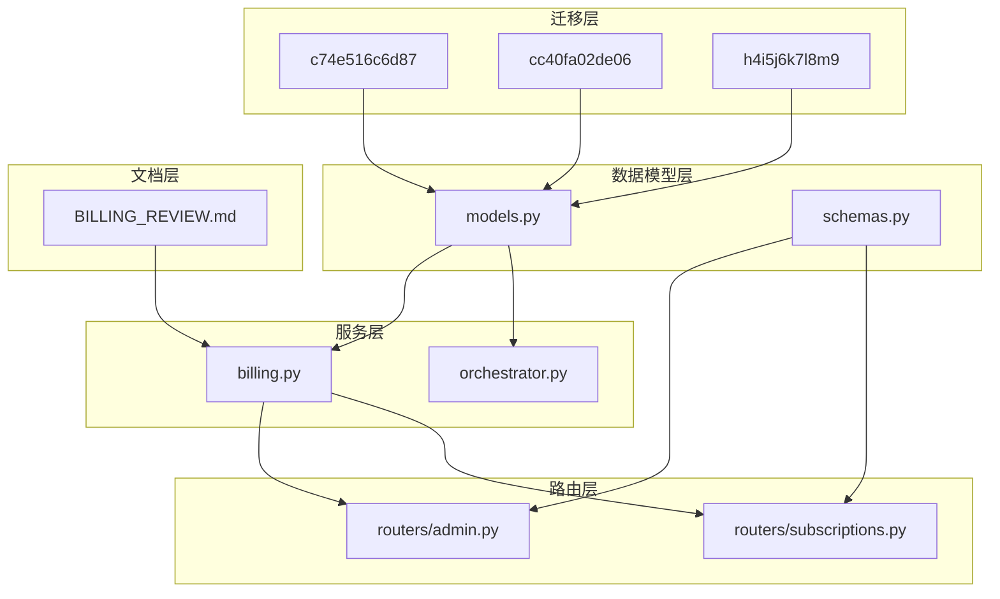
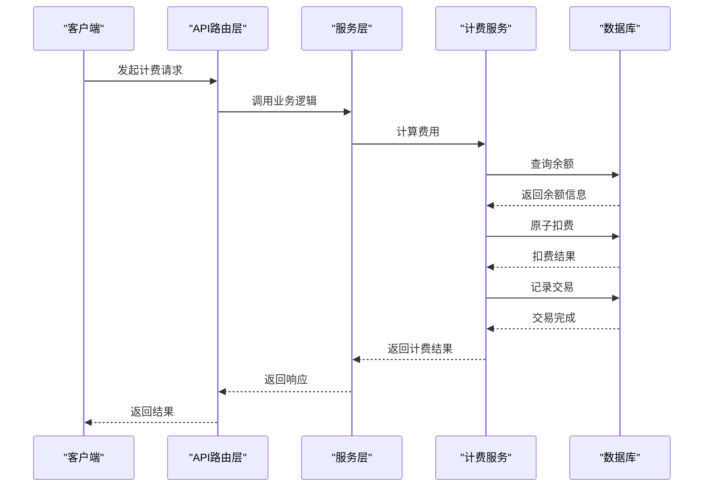
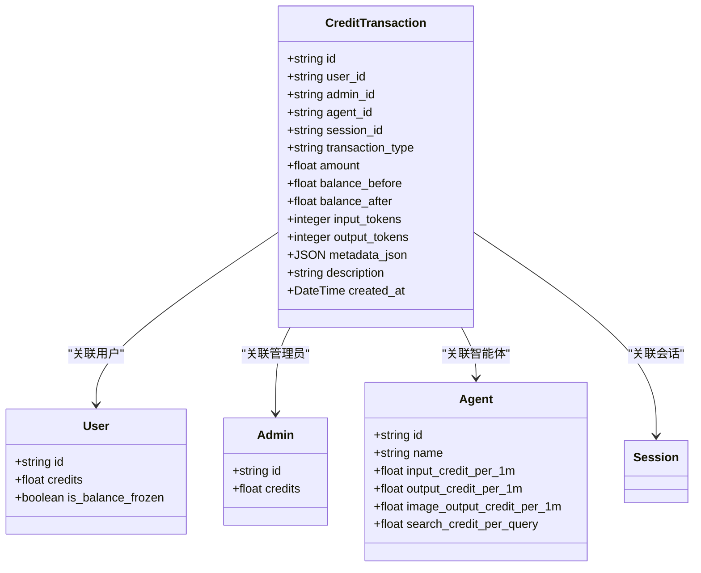
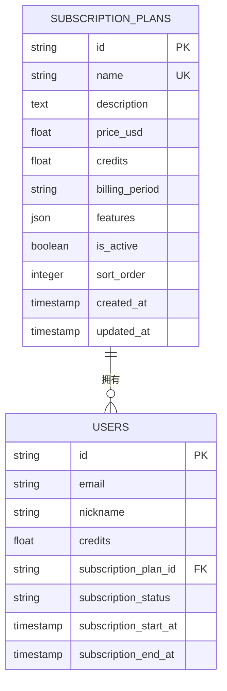
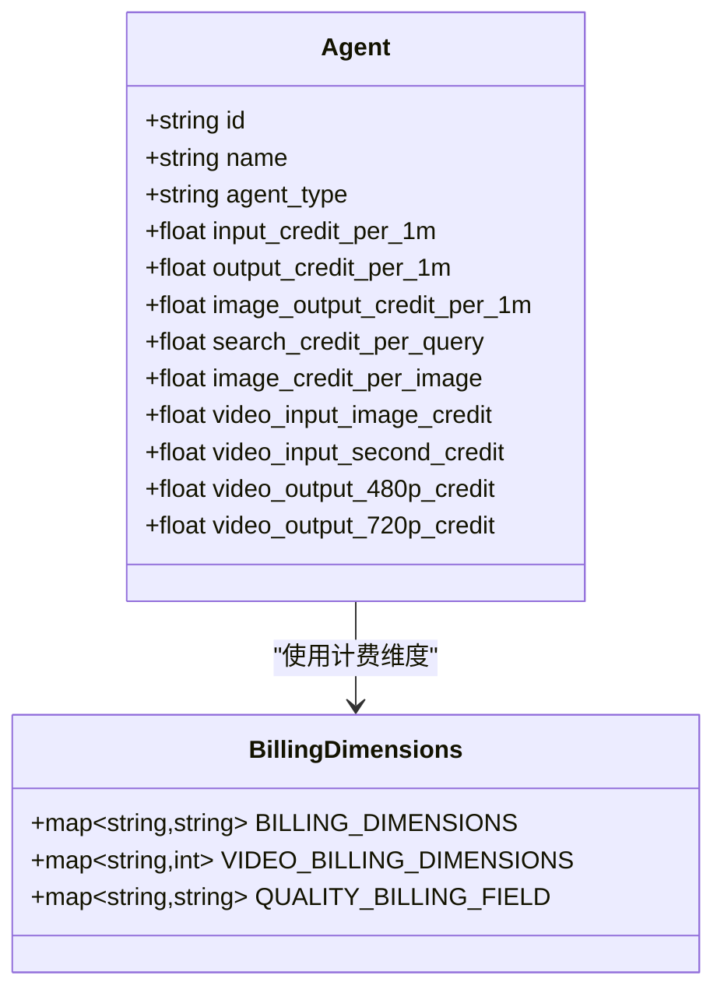
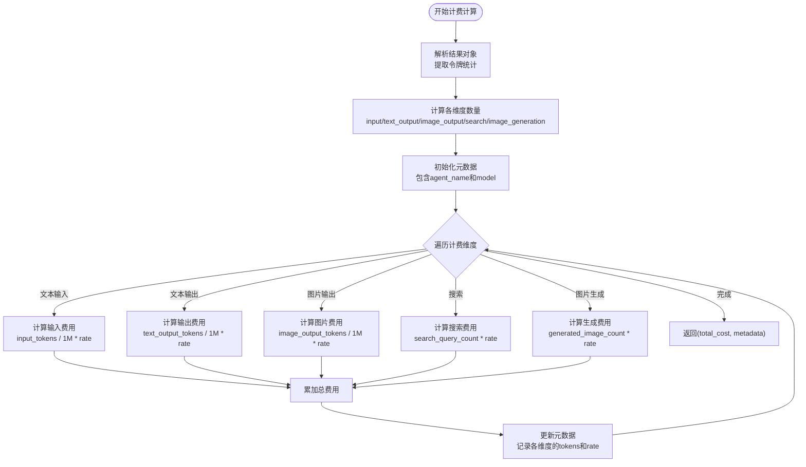
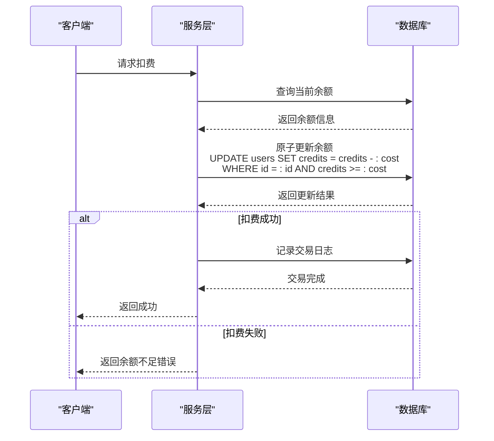
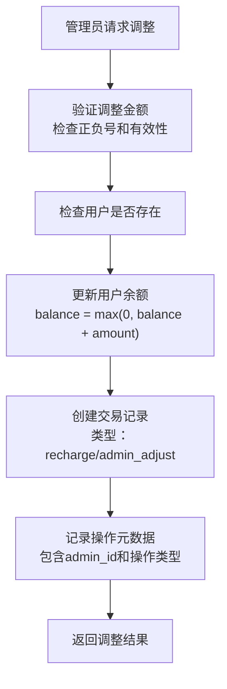
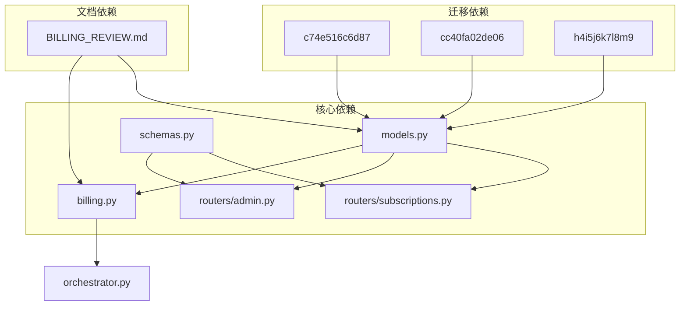
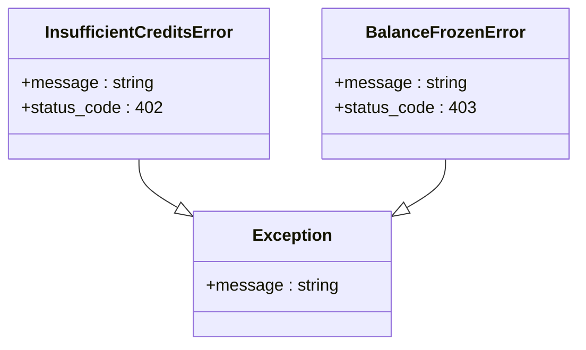

# 计费订阅相关模型

<cite>
**本文档引用的文件**
- [models.py](file://backend/models.py)
- [schemas.py](file://backend/schemas.py)
- [billing.py](file://backend/services/billing.py)
- [subscriptions.py](file://backend/routers/subscriptions.py)
- [c74e516c6d87_add_credit_billing_system.py](file://backend/migrations/versions/c74e516c6d87_add_credit_billing_system.py)
- [cc40fa02de06_migrate_credits_to_decimal_and_atomic_.py](file://backend/migrations/versions/cc40fa02de06_migrate_credits_to_decimal_and_atomic_.py)
- [h4i5j6k7l8m9_add_model_costs_and_subscriptions.py](file://backend/migrations/versions/h4i5j6k7l8m9_add_model_costs_and_subscriptions.py)
- [BILLING_REVIEW.md](file://backend/docs/BILLING_REVIEW.md)
- [admin.py](file://backend/routers/admin.py)
- [orchestrator.py](file://backend/services/orchestrator.py)
</cite>

## 目录
1. [简介](#简介)
2. [项目结构](#项目结构)
3. [核心组件](#核心组件)
4. [架构概览](#架构概览)
5. [详细组件分析](#详细组件分析)
6. [依赖分析](#依赖分析)
7. [性能考虑](#性能考虑)
8. [故障排除指南](#故障排除指南)
9. [结论](#结论)
10. [附录](#附录)

## 简介
本文档深入解析 Infinite Game 项目的计费订阅相关数据模型，涵盖积分交易、订阅套餐、计费计算规则、余额管理机制以及管理员调整等功能。通过对核心数据模型、服务层逻辑和迁移脚本的全面分析，帮助开发者和运维人员理解系统的计费架构，识别潜在风险并提供优化建议。

## 项目结构
计费订阅系统主要分布在以下模块：
- 数据模型层：定义用户、管理员、积分交易、订阅计划等核心实体
- 服务层：实现计费计算、余额检查、原子扣费等业务逻辑
- 路由层：提供管理员管理接口和订阅计划管理接口
- 迁移层：管理数据库结构演进，包括积分系统和订阅计划的初始化
- 文档层：提供计费模型审查报告和行业定价对标

**图表来源**
- [models.py:1-447](file://backend/models.py#L1-L447)
- [billing.py:1-388](file://backend/services/billing.py#L1-L388)
- [subscriptions.py:1-119](file://backend/routers/subscriptions.py#L1-L119)

**章节来源**
- [models.py:1-447](file://backend/models.py#L1-L447)
- [billing.py:1-388](file://backend/services/billing.py#L1-L388)
- [subscriptions.py:1-119](file://backend/routers/subscriptions.py#L1-L119)

## 核心组件
计费订阅系统由以下核心组件构成：

### 数据模型组件
- **User/Admin**: 用户和管理员实体，包含积分余额和订阅状态
- **CreditTransaction**: 积分交易记录，追踪所有积分变动
- **SubscriptionPlan**: 订阅套餐配置，管理价格和功能
- **Agent**: 智能体配置，包含各种计费维度的费率

### 服务组件
- **Billing Calculator**: 计费计算引擎，支持多种计费维度
- **Balance Manager**: 余额管理器，提供原子扣费和退款功能
- **Subscription Manager**: 订阅管理器，处理套餐激活和状态

### 接口组件
- **Admin Router**: 管理员积分调整和历史查询接口
- **Subscription Router**: 订阅计划 CRUD 接口

**章节来源**
- [models.py:261-389](file://backend/models.py#L261-L389)
- [billing.py:12-388](file://backend/services/billing.py#L12-L388)
- [schemas.py:396-513](file://backend/schemas.py#L396-L513)

## 架构概览
系统采用分层架构，通过清晰的职责分离实现可靠的计费管理：

**图表来源**
- [billing.py:178-308](file://backend/services/billing.py#L178-L308)
- [admin.py:161-187](file://backend/routers/admin.py#L161-L187)

## 详细组件分析

### CreditTransaction 积分交易模型
积分交易是计费系统的核心数据结构，负责追踪所有积分变动：

**图表来源**
- [models.py:261-281](file://backend/models.py#L261-L281)
- [models.py:35-73](file://backend/models.py#L35-L73)
- [models.py:10-33](file://backend/models.py#L10-L33)

#### 交易类型和业务场景
系统支持三种主要的交易类型：
- **deduction**: 扣费交易，用于正常的消费场景
- **recharge**: 充值交易，用于用户主动充值
- **admin_adjust**: 管理员调整，用于系统维护和补偿

每个交易记录包含完整的审计信息，包括余额前后对比、令牌统计和元数据。

**章节来源**
- [models.py:261-281](file://backend/models.py#L261-L281)
- [billing.py:415-418](file://backend/schemas.py#L415-L418)

### SubscriptionPlan 订阅套餐模型
订阅套餐模型提供了灵活的订阅管理能力：

**图表来源**
- [models.py:369-389](file://backend/models.py#L369-L389)
- [models.py:54-58](file://backend/models.py#L54-L58)

#### 订阅配置选项
订阅套餐包含以下关键配置：
- **价格设置**: 以美元计价，支持月度、年度和终身套餐
- **积分包**: 每个套餐包含的积分数量
- **功能限制**: 通过特性数组定义套餐功能
- **激活状态**: 控制套餐的可用性
- **排序权重**: 影响前端展示顺序

**章节来源**
- [models.py:369-389](file://backend/models.py#L369-L389)
- [schemas.py:481-513](file://backend/schemas.py#L481-L513)

### Agent 智能体计费模型
智能体模型集成了多维度的计费配置：

**图表来源**
- [models.py:196-253](file://backend/models.py#L196-L253)
- [billing.py:12-36](file://backend/services/billing.py#L12-L36)

#### 计费维度映射表
系统使用映射表驱动的方式管理不同维度的计费：
- **文本输入/输出**: 按每百万令牌计费
- **图片输出**: 按每百万令牌计费
- **搜索查询**: 按次计费
- **图片生成**: 按张计费
- **视频处理**: 按输入图片张数、输入视频时长和输出时长计费

**章节来源**
- [billing.py:12-36](file://backend/services/billing.py#L12-L36)
- [models.py:219-247](file://backend/models.py#L219-L247)

### 计费计算引擎
计费计算引擎采用映射表驱动的设计，避免复杂的条件判断：

**图表来源**
- [billing.py:310-351](file://backend/services/billing.py#L310-L351)

#### 视频计费特殊处理
视频计费具有特殊的质量映射逻辑：
- 480p 输出映射到 `video_output_480p` 维度
- 720p 输出映射到 `video_output_720p` 维度
- 输入图片按张计费
- 输入视频按秒计费
- 输出视频按秒计费

**章节来源**
- [billing.py:353-387](file://backend/services/billing.py#L353-L387)

### 余额管理机制
系统实现了原子化的余额管理，确保并发安全：

**图表来源**
- [billing.py:178-308](file://backend/services/billing.py#L178-L308)

#### 原子扣费实现
原子扣费通过单条 SQL 语句实现，避免了竞态条件：
- 使用 `UPDATE ... WHERE ...` 语法确保只在满足条件时更新
- 通过 `rowcount` 检查更新是否成功
- 支持用户和管理员两种类型的余额管理

**章节来源**
- [billing.py:178-308](file://backend/services/billing.py#L178-L308)

### 管理员调整功能
管理员可以通过专门的接口进行积分调整：

**图表来源**
- [admin.py:161-187](file://backend/routers/admin.py#L161-L187)

#### 交易类型区分
系统通过调整金额的正负来区分交易类型：
- **正数调整**: 视为充值交易
- **负数调整**: 视为管理员调整交易
- **零值调整**: 仅记录交易但不实际扣费

**章节来源**
- [admin.py:161-187](file://backend/routers/admin.py#L161-L187)

## 依赖分析
计费订阅系统的关键依赖关系如下：

**图表来源**
- [models.py:1-447](file://backend/models.py#L1-L447)
- [billing.py:1-388](file://backend/services/billing.py#L1-L388)

### 数据库迁移演进
系统经历了多次数据库迁移，逐步完善计费功能：

1. **初始积分系统**: 添加 `credit_transactions` 表和基本计费字段
2. **精度提升**: 迁移 `credits` 字段到 `DECIMAL(18, 4)` 类型
3. **订阅功能**: 添加 `subscription_plans` 表和相关配置

**章节来源**
- [c74e516c6d87_add_credit_billing_system.py:21-53](file://backend/migrations/versions/c74e516c6d87_add_credit_billing_system.py#L21-L53)
- [cc40fa02de06_migrate_credits_to_decimal_and_atomic_.py:69-107](file://backend/migrations/versions/cc40fa02de06_migrate_credits_to_decimal_and_atomic_.py#L69-L107)
- [h4i5j6k7l8m9_add_model_costs_and_subscriptions.py:21-45](file://backend/migrations/versions/h4i5j6k7l8m9_add_model_costs_and_subscriptions.py#L21-L45)

## 性能考虑
基于计费模型审查报告，系统存在以下性能和可靠性考虑：

### 并发安全
当前实现存在竞态条件风险，需要通过原子 SQL 更新解决：
- 使用 `UPDATE ... WHERE ...` 语法确保原子性
- 避免 Python 层的"读-改-写"模式
- 通过 `rowcount` 检查更新结果

### 精度问题
浮点数运算可能导致累积误差，建议：
- 迁移到 `DECIMAL(18, 4)` 类型
- 或者使用微积分单位避免浮点运算
- 在数据库层面确保财务准确性

### 查询性能
为提高查询性能，建议：
- 为 `created_at` 字段添加索引
- 为 `user_id` 和 `admin_id` 字段添加复合索引
- 优化交易历史查询的分页机制

## 故障排除指南

### 常见错误类型
系统定义了以下专用异常类型：

**图表来源**
- [billing.py:37-43](file://backend/services/billing.py#L37-L43)

#### 余额不足错误
当用户余额不足以支付预计费用时，系统抛出 `InsufficientCreditsError`：
- 检查用户余额和冻结状态
- 记录详细的警告信息
- 返回适当的 HTTP 状态码

#### 余额冻结错误
当用户账户被冻结时，系统抛出 `BalanceFrozenError`：
- 检查 `is_balance_frozen` 字段
- 阻止所有扣费操作
- 记录冻结状态

**章节来源**
- [billing.py:37-43](file://backend/services/billing.py#L37-L43)
- [billing.py:45-84](file://backend/services/billing.py#L45-L84)

### 退款机制
系统支持原子化退款功能：
- 通过 `refund_credits_atomic` 方法实现
- 支持用户和管理员余额的退款
- 创建对应的退款交易记录
- 确保事务的一致性

**章节来源**
- [billing.py:86-177](file://backend/services/billing.py#L86-L177)

## 结论
Infinite Game 的计费订阅系统采用了合理的分层架构和映射表驱动的设计理念。系统的主要优势包括：

1. **模块化设计**: 清晰的职责分离，便于维护和扩展
2. **原子化操作**: 通过数据库层面的原子更新确保数据一致性
3. **灵活的计费模型**: 支持多种计费维度和定价策略
4. **完善的审计机制**: 详细的交易记录便于追踪和分析

然而，系统也存在一些需要改进的地方：
- 需要实现过期机制和冻结机制
- 应该添加退款机制来处理失败的生成任务
- 建议迁移到更精确的数值类型以避免浮点误差

通过实施计费模型审查报告中的建议，系统可以在保持现有优势的基础上进一步提升可靠性和用户体验。

## 附录

### 计费维度对照表
| 维度名称 | 计费方式 | 示例场景 |
|---------|---------|---------|
| input | 每1M令牌 | 文本输入计费 |
| text_output | 每1M令牌 | 文本输出计费 |
| image_output | 每1M令牌 | 图片输出计费 |
| search | 每次查询 | 搜索功能计费 |
| image_generation | 每张图片 | 图片生成计费 |
| video_input_image | 每张图片 | 视频输入图片计费 |
| video_input_second | 每秒 | 视频输入时长计费 |
| video_output_480p | 每秒 | 480p视频输出计费 |
| video_output_720p | 每秒 | 720p视频输出计费 |

### 交易类型说明
- **deduction**: 系统自动扣费，用于正常消费场景
- **recharge**: 用户主动充值，增加余额
- **admin_adjust**: 管理员手动调整，用于补偿或维护

### 订阅周期类型
- **monthly**: 月度订阅
- **yearly**: 年度订阅  
- **lifetime**: 终身订阅