# 令牌管理系统

<cite>
**本文档引用的文件**
- [backend/auth.py](file://backend/auth.py)
- [backend/routers/auth.py](file://backend/routers/auth.py)
- [backend/routers/admin_auth.py](file://backend/routers/admin_auth.py)
- [backend/config.py](file://backend/config.py)
- [backend/models.py](file://backend/models.py)
- [backend/schemas.py](file://backend/schemas.py)
- [frontend/src/context/AuthContext.tsx](file://frontend/src/context/AuthContext.tsx)
- [frontend/src/hooks/useSocket.ts](file://frontend/src/hooks/useSocket.ts)
- [frontend/src/lib/api.ts](file://frontend/src/lib/api.ts)
- [backend/admin/src/lib/axios.ts](file://backend/admin/src/lib/axios.ts)
</cite>

## 目录
1. [简介](#简介)
2. [项目结构](#项目结构)
3. [核心组件](#核心组件)
4. [架构概览](#架构概览)
5. [详细组件分析](#详细组件分析)
6. [依赖关系分析](#依赖关系分析)
7. [性能考虑](#性能考虑)
8. [故障排除指南](#故障排除指南)
9. [结论](#结论)
10. [附录](#附录)

## 简介

本项目实现了完整的JWT令牌管理系统，包括用户认证、管理员认证、令牌刷新和前端令牌管理。系统采用FastAPI作为后端框架，React作为前端框架，实现了安全可靠的令牌管理机制。

## 项目结构

项目采用前后端分离架构，后端使用Python FastAPI，前端使用Next.js React应用：

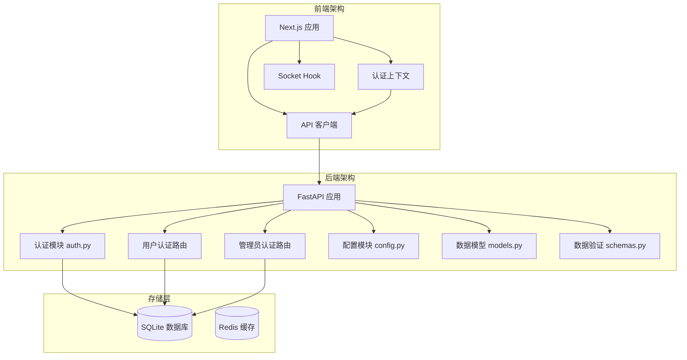

**图表来源**
- [backend/auth.py:1-229](file://backend/auth.py#L1-L229)
- [backend/routers/auth.py:1-136](file://backend/routers/auth.py#L1-L136)
- [backend/config.py:1-43](file://backend/config.py#L1-L43)

**章节来源**
- [backend/auth.py:1-229](file://backend/auth.py#L1-L229)
- [backend/routers/auth.py:1-136](file://backend/routers/auth.py#L1-L136)
- [backend/routers/admin_auth.py:1-136](file://backend/routers/admin_auth.py#L1-L136)
- [backend/config.py:1-43](file://backend/config.py#L1-L43)

## 核心组件

### JWT令牌结构设计

系统实现了两种类型的JWT令牌：

#### 访问令牌 (Access Token)
- **有效期**: 30分钟
- **算法**: HS256
- **密钥**: 32字节十六进制随机字符串
- **载荷字段**:
  - `sub`: 用户ID或管理员ID
  - `role`: 角色标识
  - `subject_type`: 主体类型 (user/admin)
  - `type`: 令牌类型 (access)
  - `exp`: 过期时间戳

#### 刷新令牌 (Refresh Token)
- **有效期**: 7天
- **算法**: HS256
- **密钥**: 与访问令牌相同的密钥
- **载荷字段**:
  - `sub`: 用户ID或管理员ID
  - `subject_type`: 主体类型 (user/admin)
  - `type`: 令牌类型 (refresh)
  - `exp`: 过期时间戳

### 令牌创建函数

#### create_access_token 函数
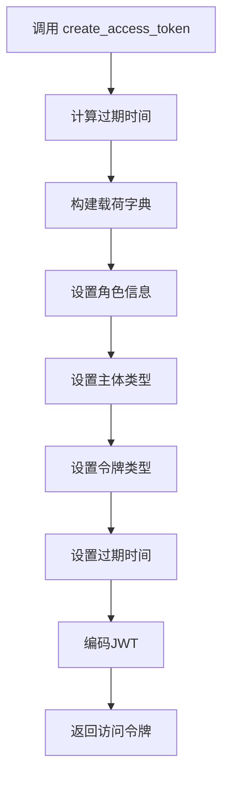

**图表来源**
- [backend/auth.py:30-50](file://backend/auth.py#L30-L50)

#### create_refresh_token 函数
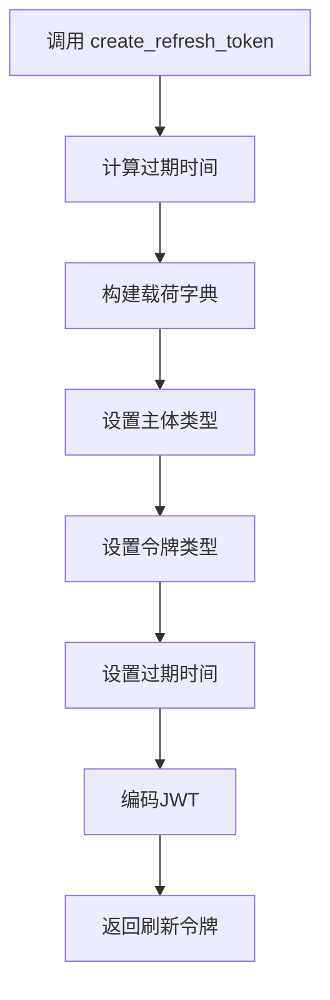

**图表来源**
- [backend/auth.py:53-62](file://backend/auth.py#L53-L62)

**章节来源**
- [backend/auth.py:30-62](file://backend/auth.py#L30-L62)
- [backend/config.py:26-30](file://backend/config.py#L26-L30)

### 令牌解析机制

#### decode_token 函数
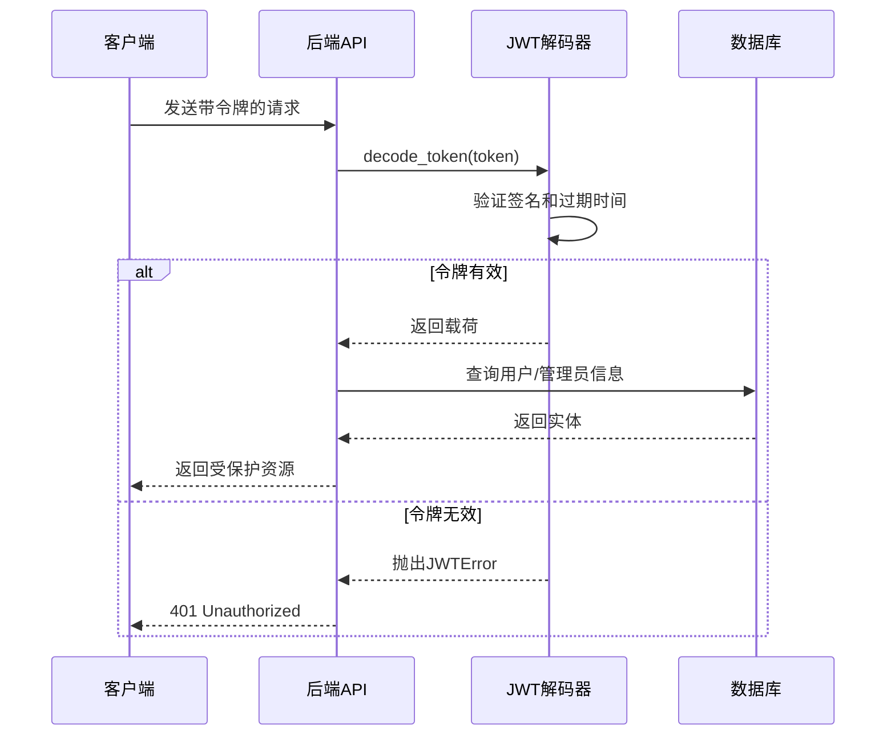

**图表来源**
- [backend/auth.py:65-74](file://backend/auth.py#L65-L74)

**章节来源**
- [backend/auth.py:65-74](file://backend/auth.py#L65-L74)

## 架构概览

系统采用多层架构设计，实现了用户认证和管理员认证的分离：

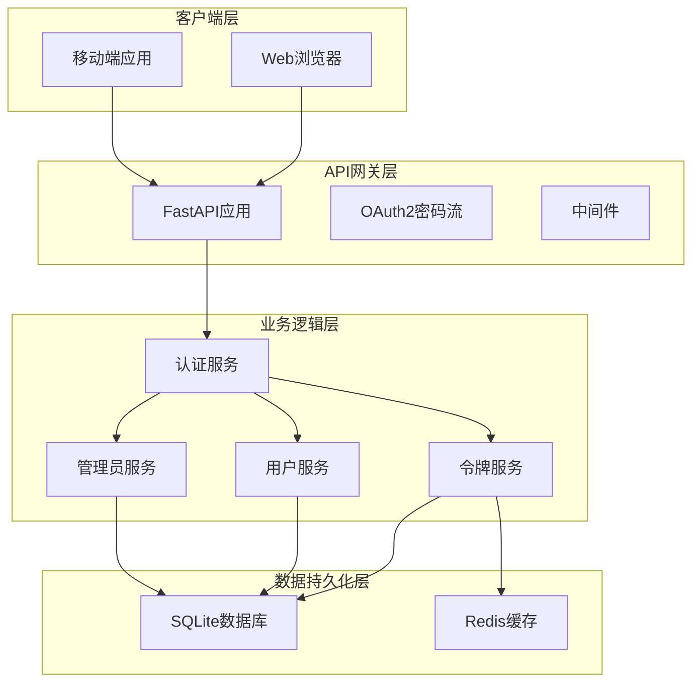

**图表来源**
- [backend/auth.py:83-229](file://backend/auth.py#L83-L229)
- [backend/routers/auth.py:63-136](file://backend/routers/auth.py#L63-L136)
- [backend/routers/admin_auth.py:36-136](file://backend/routers/admin_auth.py#L36-L136)

## 详细组件分析

### 后端认证模块

#### 用户认证流程
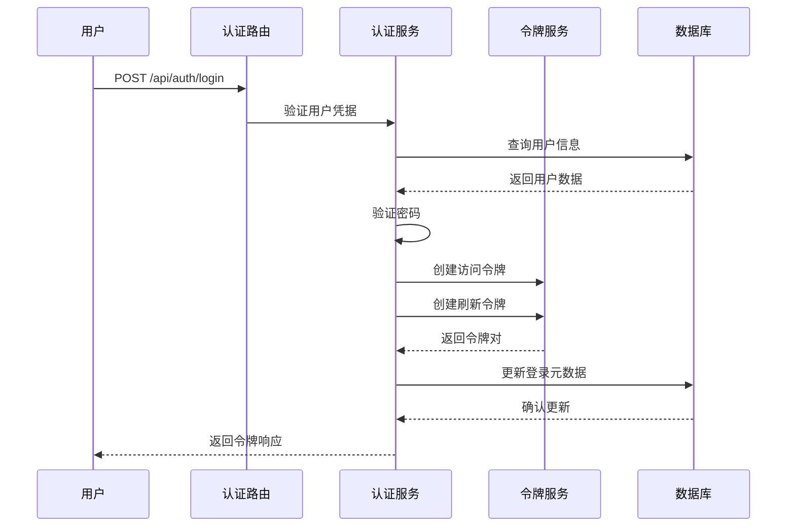

**图表来源**
- [backend/routers/auth.py:63-99](file://backend/routers/auth.py#L63-L99)
- [backend/auth.py:91-92](file://backend/auth.py#L91-L92)

#### 管理员认证流程
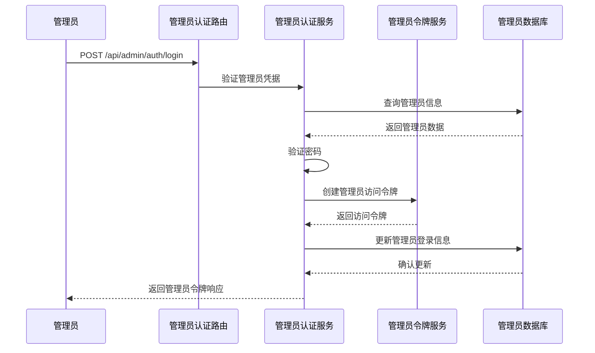

**图表来源**
- [backend/routers/admin_auth.py:36-90](file://backend/routers/admin_auth.py#L36-L90)

**章节来源**
- [backend/routers/auth.py:63-99](file://backend/routers/auth.py#L63-L99)
- [backend/routers/admin_auth.py:36-90](file://backend/routers/admin_auth.py#L36-L90)

### 前端令牌管理

#### 认证上下文实现
前端使用React Context管理认证状态：

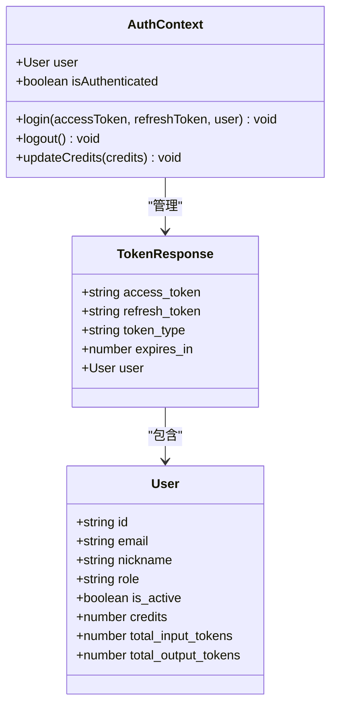

**图表来源**
- [frontend/src/context/AuthContext.tsx:12-45](file://frontend/src/context/AuthContext.tsx#L12-L45)

#### API拦截器实现
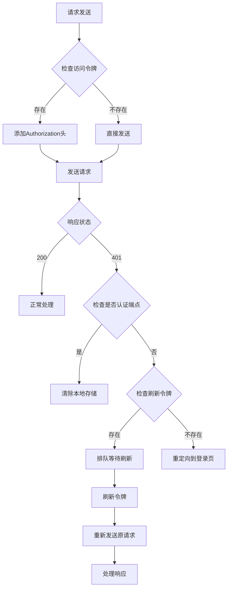

**图表来源**
- [frontend/src/lib/api.ts:19-81](file://frontend/src/lib/api.ts#L19-L81)

**章节来源**
- [frontend/src/context/AuthContext.tsx:1-110](file://frontend/src/context/AuthContext.tsx#L1-L110)
- [frontend/src/lib/api.ts:1-83](file://frontend/src/lib/api.ts#L1-L83)

### 令牌刷新机制

#### 自动刷新流程
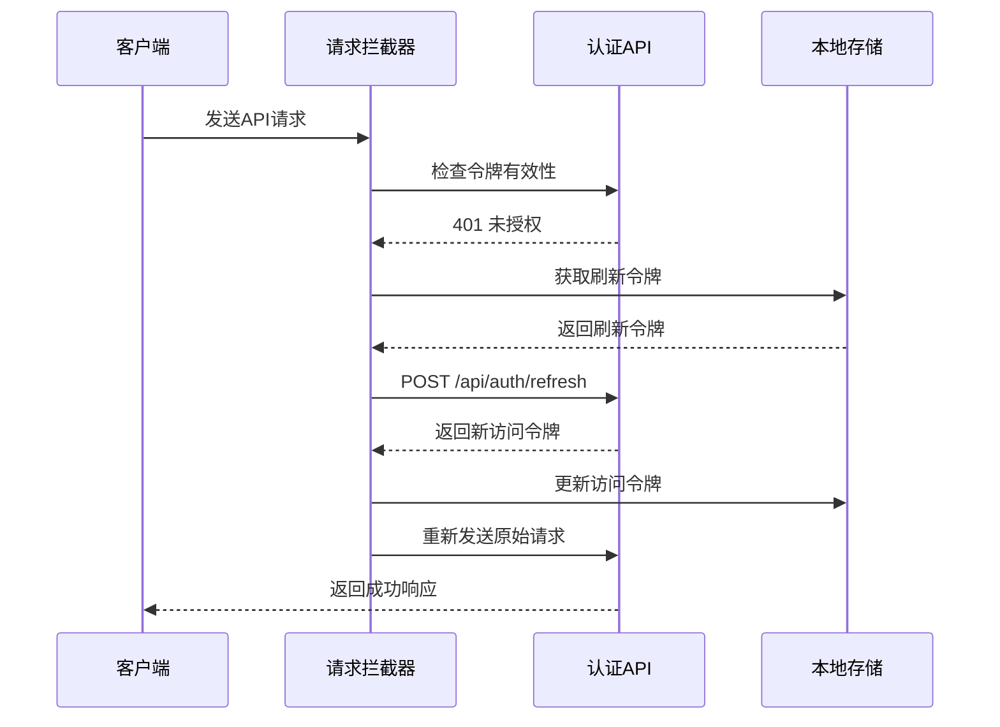

**图表来源**
- [frontend/src/lib/api.ts:31-81](file://frontend/src/lib/api.ts#L31-L81)

#### 手动刷新流程
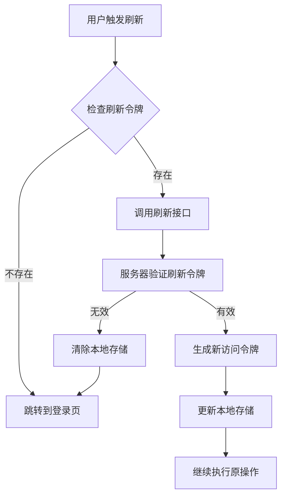

**图表来源**
- [backend/routers/auth.py:102-129](file://backend/routers/auth.py#L102-L129)

**章节来源**
- [frontend/src/lib/api.ts:19-81](file://frontend/src/lib/api.ts#L19-L81)
- [backend/routers/auth.py:102-129](file://backend/routers/auth.py#L102-L129)

### 前端Socket集成

#### 实时通信令牌处理
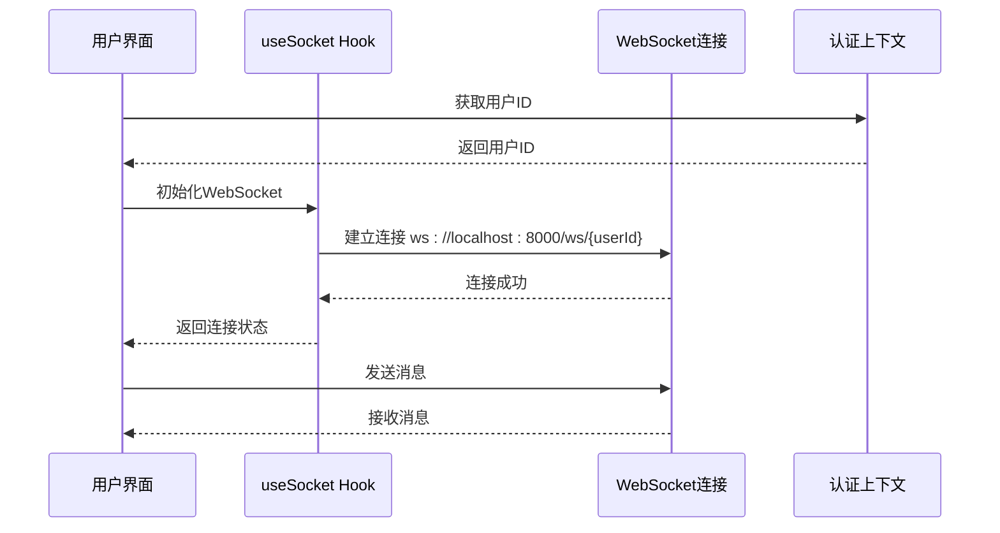

**图表来源**
- [frontend/src/hooks/useSocket.ts:1-43](file://frontend/src/hooks/useSocket.ts#L1-L43)

**章节来源**
- [frontend/src/hooks/useSocket.ts:1-43](file://frontend/src/hooks/useSocket.ts#L1-L43)

## 依赖关系分析

系统的关键依赖关系如下：

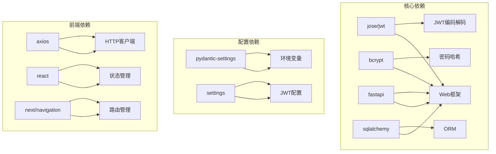

**图表来源**
- [backend/auth.py:7-8](file://backend/auth.py#L7-L8)
- [backend/config.py:26-30](file://backend/config.py#L26-L30)
- [frontend/src/lib/api.ts:1](file://frontend/src/lib/api.ts#L1)

**章节来源**
- [backend/auth.py:1-25](file://backend/auth.py#L1-L25)
- [backend/config.py:1-43](file://backend/config.py#L1-L43)
- [frontend/src/lib/api.ts:1-83](file://frontend/src/lib/api.ts#L1-L83)

## 性能考虑

### 令牌性能优化

1. **令牌有效期设置**
   - 访问令牌: 30分钟（平衡安全性与用户体验）
   - 刷新令牌: 7天（提供较长的会话保持能力）

2. **算法选择**
   - HS256算法提供良好的性能和安全性平衡
   - 密钥长度32字节确保足够的熵值

3. **存储策略优化**
   - 使用内存缓存减少数据库查询
   - 实现令牌预刷新机制避免频繁刷新

### 前端性能优化

1. **请求队列机制**
   - 并发请求排队处理，避免重复刷新
   - 使用Promise链处理异步操作

2. **本地存储优化**
   - 使用localStorage存储令牌，避免每次页面刷新
   - 实现令牌过期检测和自动清理

## 故障排除指南

### 常见问题及解决方案

#### 令牌过期问题
**症状**: API请求返回401未授权错误
**原因**: 访问令牌已过期
**解决方案**:
1. 检查前端是否正确处理401错误
2. 确认刷新令牌是否存在
3. 验证服务器时间同步

#### 刷新失败问题
**症状**: 刷新令牌无法获取新的访问令牌
**原因**: 刷新令牌无效或用户被禁用
**解决方案**:
1. 检查用户状态是否激活
2. 验证刷新令牌签名
3. 确认服务器配置正确

#### 前端认证状态不同步
**症状**: 页面显示已登录但API调用失败
**原因**: 本地存储状态不一致
**解决方案**:
1. 清除本地存储并重新登录
2. 检查认证上下文的状态管理
3. 验证路由守卫逻辑

**章节来源**
- [frontend/src/lib/api.ts:31-81](file://frontend/src/lib/api.ts#L31-L81)
- [backend/auth.py:65-74](file://backend/auth.py#L65-L74)

## 结论

本令牌管理系统实现了以下关键特性：

1. **安全性**: 采用JWT标准协议，支持HS256算法，提供完整的令牌生命周期管理
2. **可靠性**: 实现了自动刷新机制，确保用户体验的连续性
3. **可维护性**: 模块化设计，清晰的职责分离
4. **可扩展性**: 支持用户和管理员双认证体系

系统通过合理的令牌设计和完善的错误处理机制，为整个应用提供了安全可靠的认证基础。

## 附录

### 配置选项说明

| 配置项 | 默认值 | 描述 |
|--------|--------|------|
| JWT_SECRET_KEY | change-me-in-production-use-openssl-rand-hex-32 | JWT加密密钥 |
| JWT_ALGORITHM | HS256 | JWT签名算法 |
| ACCESS_TOKEN_EXPIRE_MINUTES | 30 | 访问令牌有效期（分钟） |
| REFRESH_TOKEN_EXPIRE_DAYS | 7 | 刷新令牌有效期（天） |

### 最佳实践建议

1. **生产环境部署**
   - 使用强随机密钥替换默认密钥
   - 配置HTTPS确保传输安全
   - 实施CORS策略限制域名访问

2. **令牌安全**
   - 定期轮换密钥
   - 实施令牌撤销机制
   - 监控异常登录行为

3. **性能优化**
   - 实现令牌预刷新
   - 使用连接池管理数据库连接
   - 缓存常用查询结果