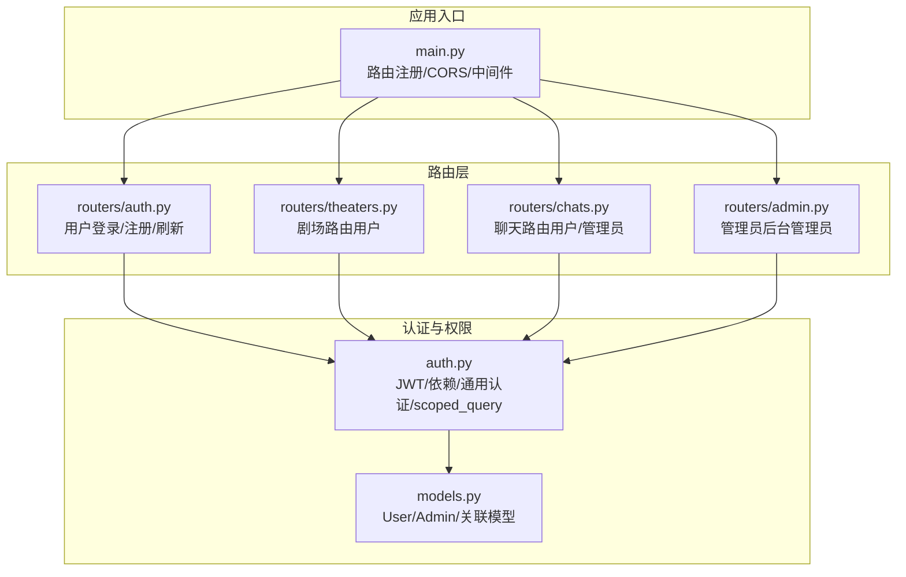
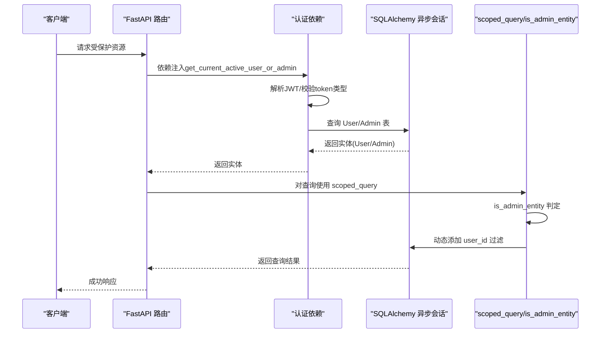
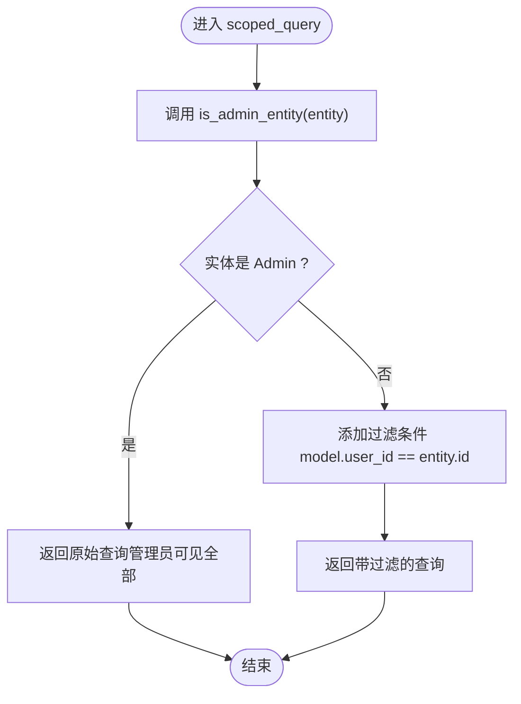
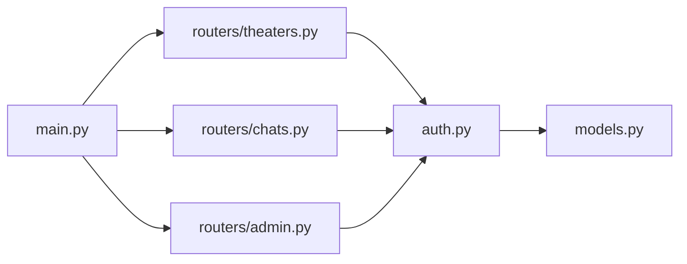

# 权限验证机制

<cite>
**本文引用的文件**
- [auth.py](file://backend/auth.py)
- [models.py](file://backend/models.py)
- [routers/admin.py](file://backend/routers/admin.py)
- [routers/auth.py](file://backend/routers/auth.py)
- [routers/theaters.py](file://backend/routers/theaters.py)
- [routers/chats.py](file://backend/routers/chats.py)
- [schemas.py](file://backend/schemas.py)
- [main.py](file://backend/main.py)
</cite>

## 目录
1. [简介](#简介)
2. [项目结构](#项目结构)
3. [核心组件](#核心组件)
4. [架构总览](#架构总览)
5. [详细组件分析](#详细组件分析)
6. [依赖分析](#依赖分析)
7. [性能考虑](#性能考虑)
8. [故障排查指南](#故障排查指南)
9. [结论](#结论)
10. [附录](#附录)

## 简介
本文件系统性阐述本项目的权限验证机制，重点围绕以下目标：
- 多租户查询助手 scoped_query 的实现原理：如何在 SQL 层实现行级数据隔离，确保用户仅能访问自身数据，管理员可访问全部数据。
- 实体类型检查 is_admin_entity：如何以“类名检查”替代 if-else 分支，实现优雅的类型判定。
- 通用认证 get_current_user_or_admin 的设计思路：如何同时支持用户与管理员的统一认证流程，并保证状态检查。
- 权限验证装饰器的使用方法：get_current_active_user_or_admin 的状态校验与在路由中的应用。
- 在不同路由中的应用示例：数据访问控制与操作权限限制。
- 最佳实践与常见问题解决方案。
- 权限模型的扩展性设计与未来演进方向。

## 项目结构
后端采用 FastAPI + SQLAlchemy 异步 ORM 架构，权限相关的核心代码集中在 auth.py，配合 models.py 的用户/管理员模型，以及各路由模块对认证依赖的使用。

图表来源
- [auth.py:1-229](file://backend/auth.py#L1-L229)
- [models.py:1-447](file://backend/models.py#L1-L447)
- [routers/auth.py:1-136](file://backend/routers/auth.py#L1-L136)
- [routers/theaters.py:1-110](file://backend/routers/theaters.py#L1-L110)
- [routers/chats.py:1-807](file://backend/routers/chats.py#L1-L807)
- [routers/admin.py:1-501](file://backend/routers/admin.py#L1-L501)
- [main.py:138-152](file://backend/main.py#L138-L152)

章节来源
- [main.py:138-152](file://backend/main.py#L138-L152)

## 核心组件
- 通用认证依赖
  - get_current_user_or_admin：从 JWT 中提取用户或管理员身份，支持 subject_type 决定查询 User/Admin 表。
  - get_current_active_user_or_admin：在通用认证基础上进行状态检查，确保账户处于活跃状态。
- 管理员专用认证
  - get_current_admin / get_current_active_admin / require_admin：管理员专用认证链路。
- 行级隔离助手
  - is_admin_entity：通过类名判断实体是否为 Admin，避免 if-else 分支。
  - scoped_query：在查询上动态添加 user_id 过滤，实现多租户行级隔离。
- 路由层使用
  - 用户路由（如 theaters）：依赖 get_current_active_user。
  - 聊天路由（如 chats）：依赖 get_current_active_user_or_admin，并在查询中使用 scoped_query。
  - 管理员路由（如 admin）：依赖 require_admin。

章节来源
- [auth.py:83-229](file://backend/auth.py#L83-L229)
- [routers/theaters.py:31-81](file://backend/routers/theaters.py#L31-L81)
- [routers/chats.py:123-157](file://backend/routers/chats.py#L123-L157)
- [routers/admin.py:29-47](file://backend/routers/admin.py#L29-L47)

## 架构总览
下图展示了认证与授权在系统中的交互路径，以及行级隔离在数据访问层的应用。

图表来源
- [auth.py:162-210](file://backend/auth.py#L162-L210)
- [auth.py:216-228](file://backend/auth.py#L216-L228)
- [routers/chats.py:123-157](file://backend/routers/chats.py#L123-L157)

## 详细组件分析

### 通用认证与状态检查
- get_current_user_or_admin
  - 依据 JWT 中的 subject_type 决定查询 User/Admin 表，返回对应实体。
  - 使用字典映射避免 if-else 分支，提升可维护性。
- get_current_active_user_or_admin
  - 在通用认证基础上检查实体 is_active 字段，若非活跃则拒绝访问。
- 设计优势
  - 单一入口支持用户与管理员，简化路由装饰器使用。
  - 明确的错误语义（无效凭据/账户禁用）便于前端处理。

章节来源
- [auth.py:162-210](file://backend/auth.py#L162-L210)

### 管理员专用认证链路
- get_current_admin：校验 token claim，限定 subject_type 为 admin，查询 Admin 表。
- get_current_active_admin：进一步校验 is_active。
- require_admin：作为路由装饰器直接返回管理员实体，用于后台管理端点。

章节来源
- [auth.py:119-156](file://backend/auth.py#L119-L156)
- [routers/admin.py:29-47](file://backend/routers/admin.py#L29-L47)

### 行级隔离助手 scoped_query 与实体类型检查
- is_admin_entity
  - 通过 type(entity).__name__ == "Admin" 判断实体类型，避免 if-else 分支。
  - 优点：简洁、稳定、无需额外元数据。
- scoped_query
  - 若实体为 Admin，则返回原始查询（管理员可见全部）。
  - 否则在查询上添加 model.user_id == entity.id 过滤，实现多租户行级隔离。
- 在聊天路由中的应用
  - list_sessions/get_session/get_session_messages/send_message 等均先对 ChatSession 查询使用 scoped_query，确保用户只能访问自己的会话与消息。
  - 同时在消息生成过程中使用 is_admin_entity 判定，决定计费与统计行为。

图表来源
- [auth.py:216-228](file://backend/auth.py#L216-L228)
- [routers/chats.py:123-157](file://backend/routers/chats.py#L123-L157)

章节来源
- [auth.py:216-228](file://backend/auth.py#L216-L228)
- [routers/chats.py:123-157](file://backend/routers/chats.py#L123-L157)

### 路由中的权限验证应用示例
- 用户路由（theaters）
  - create_theater/list_theaters/get_theater/update_theater/delete_theater/duplicate_theater
  - 依赖 get_current_active_user，确保仅当前用户可操作其剧场。
- 聊天路由（chats）
  - create_session/list_sessions/get_session/get_session_messages/send_message/clear_session_messages/delete_session
  - 依赖 get_current_active_user_or_admin，并在查询中使用 scoped_query，确保用户只能访问自己的会话与消息；管理员可访问全部。
  - 在消息生成时使用 is_admin_entity 判定，影响计费与统计。
- 管理员路由（admin）
  - stats/users/admins/theaters 等端点依赖 require_admin，确保后台管理功能仅管理员可用。

章节来源
- [routers/theaters.py:20-110](file://backend/routers/theaters.py#L20-L110)
- [routers/chats.py:100-807](file://backend/routers/chats.py#L100-L807)
- [routers/admin.py:29-501](file://backend/routers/admin.py#L29-L501)

### 权限验证装饰器的使用方法
- get_current_active_user_or_admin
  - 作为路由依赖使用，自动完成 JWT 解析、实体查询与状态检查。
  - 在 chats 路由中广泛使用，既满足用户访问，又允许管理员访问。
- get_current_active_user
  - 仅用于用户侧路由（如 theaters），确保用户登录且账户有效。
- require_admin
  - 仅用于管理员后台路由，确保管理员登录且账户有效。

章节来源
- [routers/theaters.py:31-81](file://backend/routers/theaters.py#L31-L81)
- [routers/chats.py:123-157](file://backend/routers/chats.py#L123-L157)
- [routers/admin.py:29-47](file://backend/routers/admin.py#L29-L47)

### 数据模型与权限字段
- User/Admin 模型
  - User/Admin 均包含 is_active 字段，用于状态检查。
  - User/Admin 均包含 credits 字段，用于计费与余额管理。
- 关联模型
  - ChatSession/ChatMessage 等模型包含 user_id 字段，为 scoped_query 提供过滤依据。
  - AdminDebugSession/AdminDebugMessage 等模型隔离管理员调试会话，体现“管理员与用户隔离”的设计思想。

章节来源
- [models.py:10-33](file://backend/models.py#L10-L33)
- [models.py:35-73](file://backend/models.py#L35-L73)
- [models.py:172-183](file://backend/models.py#L172-L183)
- [models.py:424-447](file://backend/models.py#L424-L447)

## 依赖分析
- 组件耦合
  - 路由层依赖 auth.py 的认证依赖与 scoped_query。
  - auth.py 依赖 models.py 的 User/Admin 模型。
  - main.py 注册所有路由，形成统一入口。
- 可能的循环依赖
  - auth.py 中对 User/Admin 的导入采用延迟导入（from models import ...），避免循环依赖。
- 外部依赖
  - FastAPI 依赖注入机制、OAuth2PasswordBearer。
  - SQLAlchemy 异步 ORM 与查询构建。

图表来源
- [auth.py:162-210](file://backend/auth.py#L162-L210)
- [routers/theaters.py:31-81](file://backend/routers/theaters.py#L31-L81)
- [routers/chats.py:123-157](file://backend/routers/chats.py#L123-L157)
- [routers/admin.py:29-47](file://backend/routers/admin.py#L29-L47)
- [main.py:138-152](file://backend/main.py#L138-L152)

章节来源
- [auth.py:162-210](file://backend/auth.py#L162-L210)
- [main.py:138-152](file://backend/main.py#L138-L152)

## 性能考虑
- 查询过滤开销
  - scoped_query 在 SQL 层添加过滤条件，避免在 Python 层遍历过滤，性能更优。
- 字典映射与类名检查
  - get_current_user_or_admin 使用字典映射查询 User/Admin，避免多次 if-else 分支。
  - is_admin_entity 使用类名检查，O(1) 时间复杂度，避免反射或元数据查询。
- 并发与事务
  - 所有数据库操作使用异步会话，结合原子扣费与计费记录，减少锁竞争与一致性问题。

## 故障排查指南
- 常见错误与定位
  - 401 未授权：token 无效、过期或类型不符（需为 access token）。
  - 403 禁止访问：账户被禁用或管理员账户被禁用。
  - 404 未找到：实体不存在或被 scoped_query 过滤掉。
  - 402 余额不足：付费智能体但余额为 0。
- 排查步骤
  - 检查 JWT 中的 subject_type 与 token 类型（type/access）。
  - 确认实体 is_active 状态。
  - 在 chats 路由中确认 scoped_query 是否正确应用到 ChatSession 查询。
  - 检查消息生成过程中的 is_admin_entity 判定是否符合预期。
- 相关实现位置
  - 通用认证与状态检查：[auth.py:162-210](file://backend/auth.py#L162-L210)
  - 行级隔离：[auth.py:216-228](file://backend/auth.py#L216-L228)
  - 聊天路由应用：[routers/chats.py:123-157](file://backend/routers/chats.py#L123-L157)

章节来源
- [auth.py:162-210](file://backend/auth.py#L162-L210)
- [auth.py:216-228](file://backend/auth.py#L216-L228)
- [routers/chats.py:123-157](file://backend/routers/chats.py#L123-L157)

## 结论
本项目的权限验证机制通过“通用认证 + 行级隔离 + 状态检查”的组合，实现了：
- 统一的用户/管理员认证入口，简化路由装饰器使用。
- 在 SQL 层实现的多租户行级隔离，保障数据安全与性能。
- 以类名检查替代 if-else 分支，提升代码可读性与可维护性。
- 在聊天等复杂业务中，结合 is_admin_entity 与 scoped_query，实现灵活的访问控制与计费策略。

## 附录

### 权限模型扩展性与演进方向
- 角色与权限矩阵
  - 当前采用“用户/管理员”二元角色，未来可引入细粒度权限矩阵（如 CRUD 权限、资源范围）。
- 多租户扩展
  - scoped_query 已支持按 user_id 隔离，未来可扩展为按 tenant_id 隔离，支持多租户 SaaS 场景。
- 动态权限与策略引擎
  - 引入策略表达式或 RBAC/ABAC，支持更复杂的权限判定与审计。
- 审计与追踪
  - 在关键操作（会话创建/消息发送/计费）记录审计日志，便于合规与排错。
- 前端集成
  - 在前端根据用户角色与权限动态渲染菜单与按钮，减少无效请求。