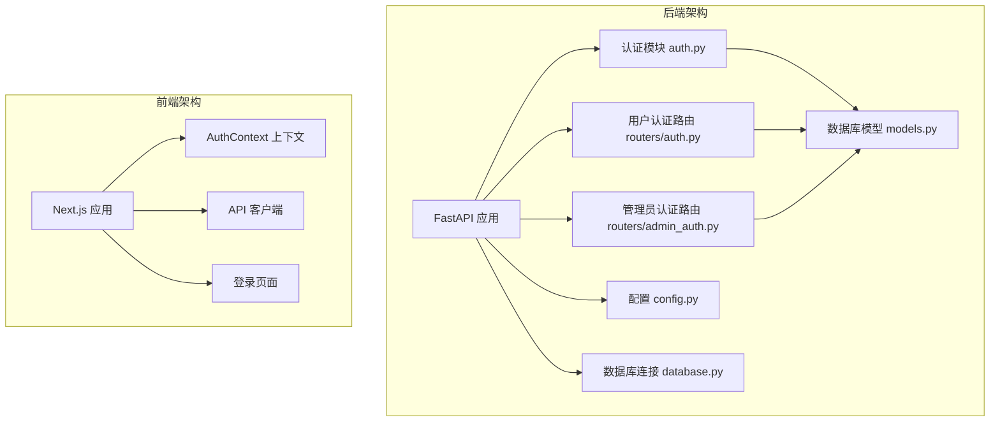
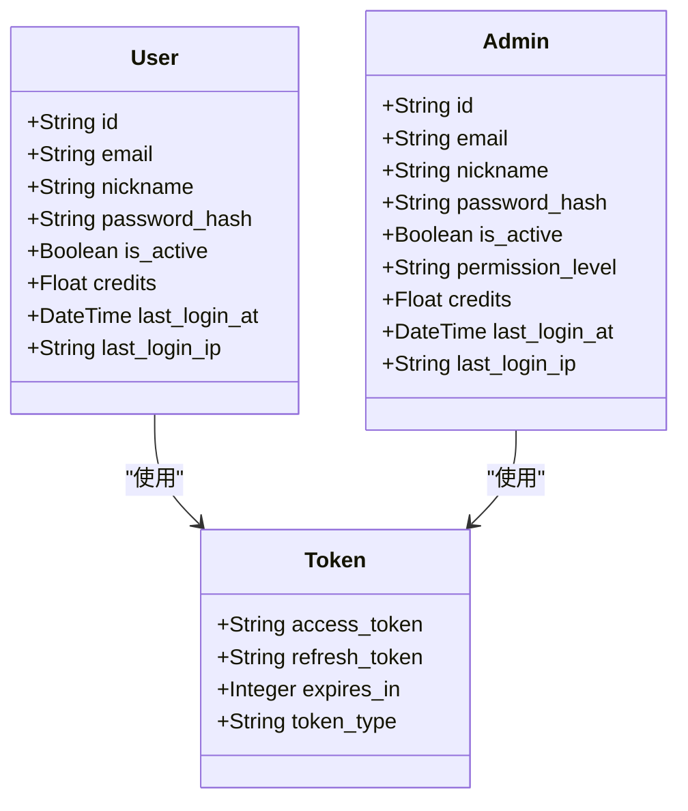
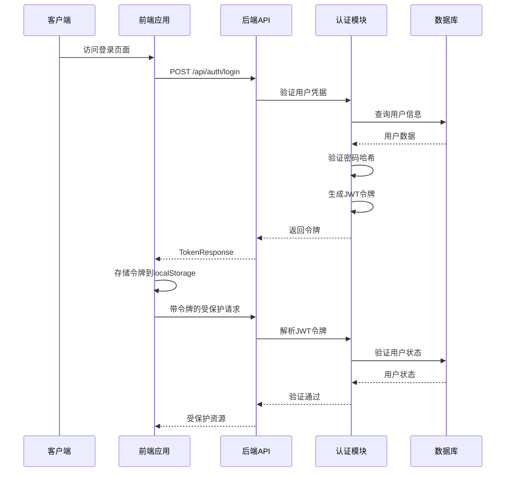
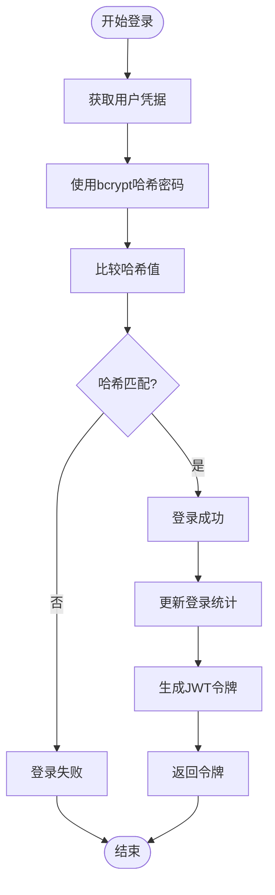
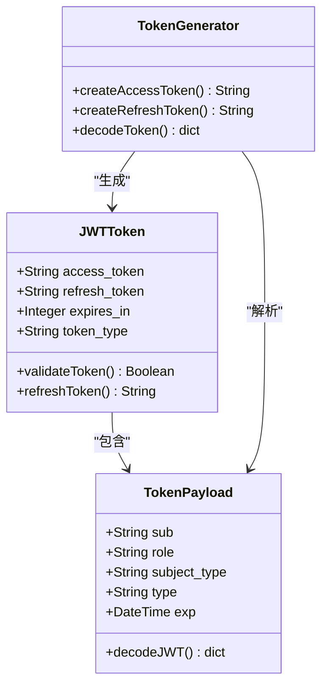
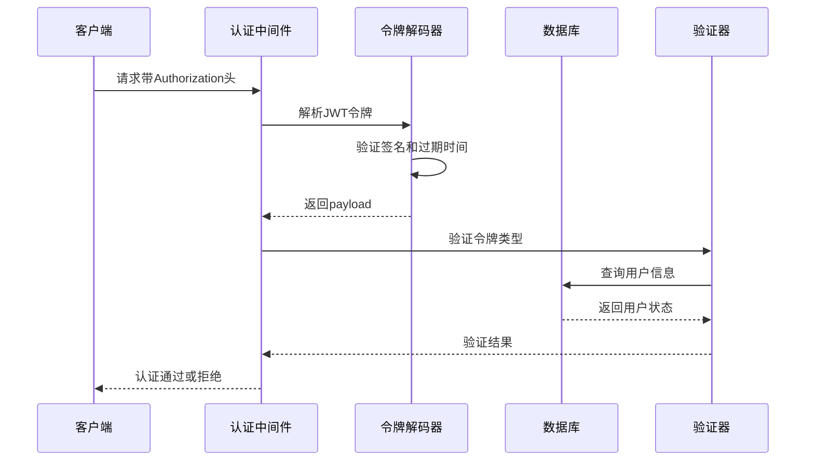
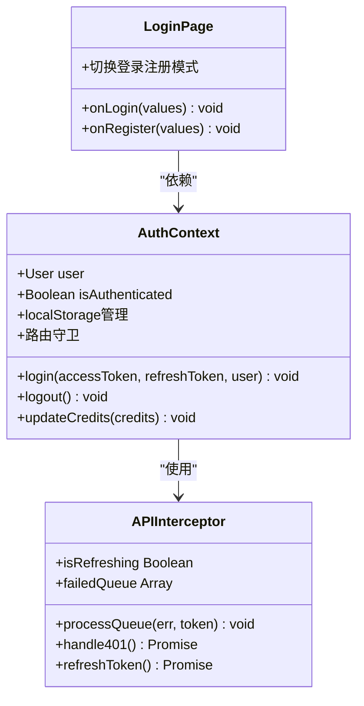
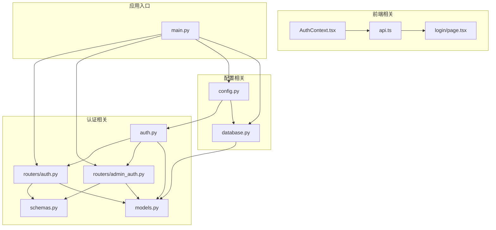

# 用户认证系统

<cite>
**本文档引用的文件**
- [backend/auth.py](file://backend/auth.py)
- [backend/routers/auth.py](file://backend/routers/auth.py)
- [backend/routers/admin_auth.py](file://backend/routers/admin_auth.py)
- [backend/config.py](file://backend/config.py)
- [backend/models.py](file://backend/models.py)
- [backend/schemas.py](file://backend/schemas.py)
- [backend/database.py](file://backend/database.py)
- [backend/main.py](file://backend/main.py)
- [frontend/src/context/AuthContext.tsx](file://frontend/src/context/AuthContext.tsx)
- [frontend/src/lib/api.ts](file://frontend/src/lib/api.ts)
- [frontend/src/app/login/page.tsx](file://frontend/src/app/login/page.tsx)
</cite>

## 目录
1. [简介](#简介)
2. [项目结构](#项目结构)
3. [核心组件](#核心组件)
4. [架构概览](#架构概览)
5. [详细组件分析](#详细组件分析)
6. [依赖关系分析](#依赖关系分析)
7. [性能考虑](#性能考虑)
8. [故障排除指南](#故障排除指南)
9. [结论](#结论)
10. [附录](#附录)

## 简介

本项目是一个基于FastAPI和Next.js构建的用户认证系统，实现了完整的用户登录流程、密码哈希验证、JWT令牌生成和刷新机制。系统采用bcrypt进行安全密码存储，支持用户会话管理和令牌过期处理，提供了完整的前端AuthContext实现和用户状态管理。

## 项目结构

该项目采用前后端分离的架构设计，后端使用Python FastAPI框架，前端使用React/Next.js技术栈。

**图表来源**
- [backend/main.py:110-152](file://backend/main.py#L110-L152)
- [frontend/src/context/AuthContext.tsx:1-110](file://frontend/src/context/AuthContext.tsx#L1-L110)

**章节来源**
- [backend/main.py:110-152](file://backend/main.py#L110-L152)
- [backend/config.py:1-43](file://backend/config.py#L1-L43)

## 核心组件

### 后端核心组件

1. **认证核心模块** (`backend/auth.py`)
   - 密码哈希和验证（bcrypt）
   - JWT令牌生成和解析
   - 用户和管理员认证依赖注入
   - 通用认证中间件

2. **认证路由模块** (`backend/routers/auth.py`)
   - 用户注册接口
   - 用户登录接口
   - 令牌刷新接口
   - 用户信息查询接口

3. **管理员认证模块** (`backend/routers/admin_auth.py`)
   - 独立的管理员认证系统
   - 管理员登录和刷新
   - 管理员信息查询

4. **前端认证上下文** (`frontend/src/context/AuthContext.tsx`)
   - 用户状态管理
   - 本地存储管理
   - 路由守卫

### 数据模型

系统使用SQLAlchemy ORM定义了用户和管理员的数据模型：

**图表来源**
- [backend/models.py:35-73](file://backend/models.py#L35-L73)
- [backend/models.py:10-33](file://backend/models.py#L10-L33)

**章节来源**
- [backend/auth.py:19-75](file://backend/auth.py#L19-L75)
- [backend/routers/auth.py:36-136](file://backend/routers/auth.py#L36-L136)
- [backend/models.py:35-73](file://backend/models.py#L35-L73)

## 架构概览

系统采用分层架构设计，实现了清晰的关注点分离：

**图表来源**
- [backend/routers/auth.py:63-99](file://backend/routers/auth.py#L63-L99)
- [backend/auth.py:83-106](file://backend/auth.py#L83-L106)

## 详细组件分析

### 密码哈希和验证

系统使用bcrypt进行密码安全存储，提供了高效的哈希算法和验证机制：

**图表来源**
- [backend/auth.py:19-24](file://backend/auth.py#L19-L24)
- [backend/routers/auth.py:78-83](file://backend/routers/auth.py#L78-L83)

密码加密策略特点：
- 使用bcrypt算法，成本因子为12
- 自动生成盐值
- 单向哈希，无法逆向解密
- 防止彩虹表攻击

**章节来源**
- [backend/auth.py:19-24](file://backend/auth.py#L19-L24)
- [backend/config.py:26-30](file://backend/config.py#L26-L30)

### JWT令牌管理系统

系统实现了完整的JWT令牌生命周期管理：

**图表来源**
- [backend/auth.py:30-62](file://backend/auth.py#L30-L62)
- [backend/auth.py:65-74](file://backend/auth.py#L65-L74)

令牌配置：
- 访问令牌有效期：30分钟
- 刷新令牌有效期：7天
- 加密算法：HS256
- 秘钥：可配置的JWT_SECRET_KEY

**章节来源**
- [backend/auth.py:30-62](file://backend/auth.py#L30-L62)
- [backend/config.py:26-30](file://backend/config.py#L26-L30)

### 认证中间件实现

系统实现了基于OAuth2PasswordBearer的认证中间件：

**图表来源**
- [backend/auth.py:83-106](file://backend/auth.py#L83-L106)
- [backend/auth.py:119-144](file://backend/auth.py#L119-L144)

认证中间件功能：
- OAuth2PasswordBearer模式
- 令牌解析和验证
- 用户上下文注入
- 活跃状态检查

**章节来源**
- [backend/auth.py:80-106](file://backend/auth.py#L80-L106)
- [backend/auth.py:119-144](file://backend/auth.py#L119-L144)

### 前端AuthContext实现

前端使用React Context实现用户状态管理：

**图表来源**
- [frontend/src/context/AuthContext.tsx:31-45](file://frontend/src/context/AuthContext.tsx#L31-L45)
- [frontend/src/lib/api.ts:19-81](file://frontend/src/lib/api.ts#L19-L81)

前端特性：
- 本地存储令牌管理
- 自动令牌刷新机制
- 路由守卫防止未认证访问
- 用户状态实时同步

**章节来源**
- [frontend/src/context/AuthContext.tsx:1-110](file://frontend/src/context/AuthContext.tsx#L1-L110)
- [frontend/src/lib/api.ts:19-81](file://frontend/src/lib/api.ts#L19-L81)

### 登录API端点说明

系统提供了完整的认证API端点：

#### 用户认证端点

| 端点 | 方法 | 功能 | 请求体 | 响应体 |
|------|------|------|--------|--------|
| `/api/auth/register` | POST | 用户注册 | UserRegister | UserResponse |
| `/api/auth/login` | POST | 用户登录 | UserLogin | TokenResponse |
| `/api/auth/refresh` | POST | 刷新访问令牌 | TokenRefresh | AccessTokenResponse |
| `/api/auth/me` | GET | 获取当前用户信息 | - | UserResponse |

#### 管理员认证端点

| 端点 | 方法 | 功能 | 请求体 | 响应体 |
|------|------|------|--------|--------|
| `/api/admin/auth/login` | POST | 管理员登录 | AdminLogin | AdminTokenResponse |
| `/api/admin/auth/refresh` | POST | 管理员刷新令牌 | TokenRefresh | AccessTokenResponse |
| `/api/admin/auth/me` | GET | 获取当前管理员信息 | - | AdminResponse |

**章节来源**
- [backend/routers/auth.py:36-136](file://backend/routers/auth.py#L36-L136)
- [backend/routers/admin_auth.py:36-136](file://backend/routers/admin_auth.py#L36-L136)

## 依赖关系分析

系统采用了清晰的模块化设计，各组件间依赖关系明确：

**图表来源**
- [backend/auth.py:11-12](file://backend/auth.py#L11-L12)
- [backend/routers/auth.py:16-18](file://backend/routers/auth.py#L16-L18)
- [backend/main.py:41-42](file://backend/main.py#L41-L42)

**章节来源**
- [backend/auth.py:11-12](file://backend/auth.py#L11-L12)
- [backend/routers/auth.py:16-18](file://backend/routers/auth.py#L16-L18)
- [backend/main.py:41-42](file://backend/main.py#L41-L42)

## 性能考虑

系统在设计时充分考虑了性能优化：

1. **数据库连接池**
   - 异步连接池配置
   - 连接预检测机制
   - 最大连接数和溢出配置

2. **令牌缓存策略**
   - 令牌过期时间合理设置
   - 自动刷新机制避免频繁登录
   - 减少数据库查询次数

3. **前端性能优化**
   - 本地存储令牌避免重复网络请求
   - 请求队列机制处理并发刷新
   - 组件状态最小化更新

4. **安全性能平衡**
   - bcrypt成本因子平衡安全性与性能
   - JWT令牌轻量级设计
   - 避免敏感信息在网络传输中暴露

## 故障排除指南

### 常见认证问题

1. **登录失败**
   - 检查用户名和密码是否正确
   - 确认用户账户是否激活
   - 验证数据库连接状态

2. **令牌过期**
   - 系统会自动尝试刷新令牌
   - 检查刷新令牌是否有效
   - 确认服务器时间同步

3. **权限不足**
   - 管理员需要特定权限级别
   - 检查用户角色配置
   - 验证API端点访问权限

4. **前端认证问题**
   - 检查localStorage中的令牌
   - 确认CORS配置正确
   - 验证API拦截器工作正常

**章节来源**
- [backend/routers/auth.py:72-83](file://backend/routers/auth.py#L72-L83)
- [frontend/src/lib/api.ts:31-81](file://frontend/src/lib/api.ts#L31-L81)

## 结论

本用户认证系统实现了企业级的安全认证解决方案，具有以下特点：

1. **安全性高**：采用bcrypt密码哈希、JWT令牌、OAuth2PasswordBearer模式
2. **易用性强**：完整的API文档、自动刷新机制、前端状态管理
3. **可扩展性好**：模块化设计、清晰的依赖关系、支持多租户
4. **性能优秀**：异步数据库连接、令牌缓存、前端优化

系统为后续的功能扩展奠定了坚实的基础，可以轻松集成更多认证方式和安全特性。

## 附录

### 安全最佳实践

1. **生产环境配置**
   - 更改默认JWT密钥
   - 配置HTTPS和安全头部
   - 实施速率限制和防暴力破解

2. **密码策略**
   - 强制复杂密码要求
   - 定期更换密码策略
   - 多因素认证支持

3. **令牌管理**
   - 定期轮换令牌
   - 实施令牌撤销机制
   - 监控异常登录行为

4. **前端安全**
   - 防止XSS攻击
   - CSRF保护
   - 安全的本地存储