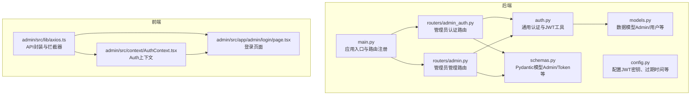
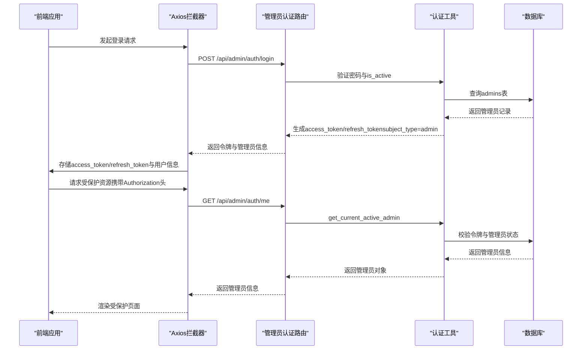
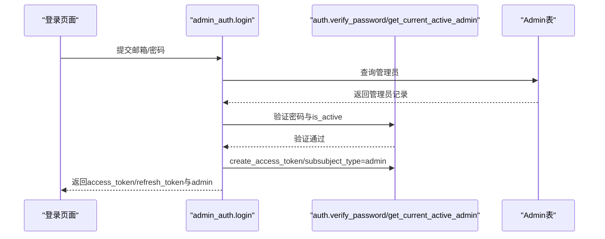
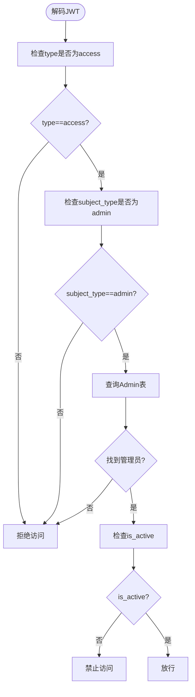
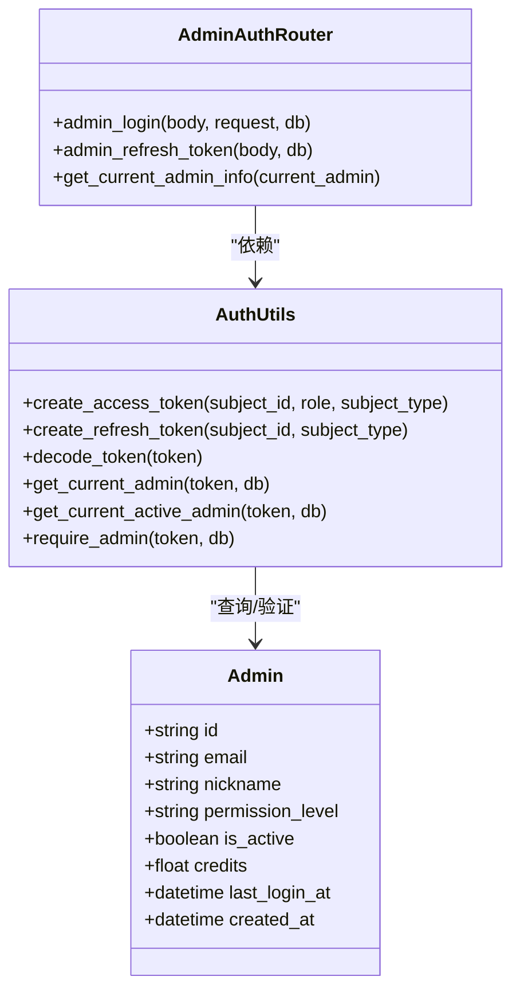
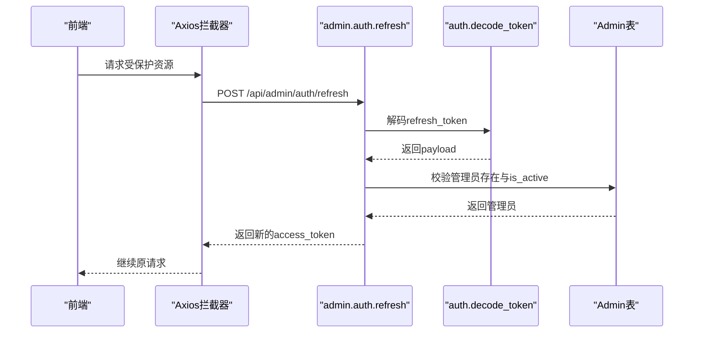
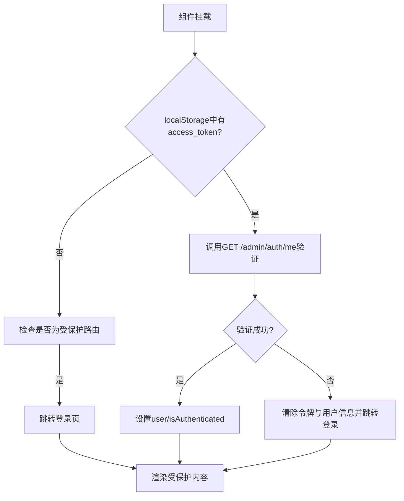
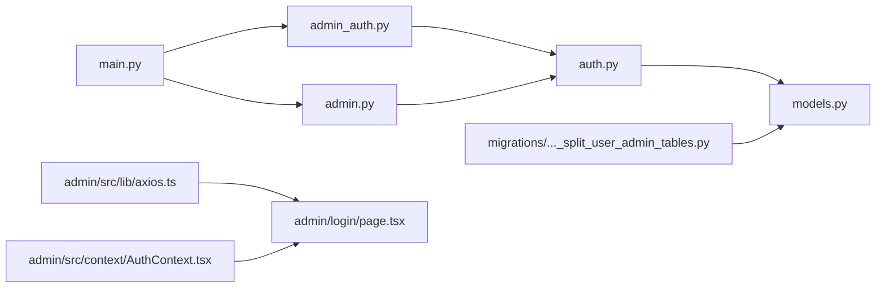

# 管理员认证系统

<cite>
**本文档引用的文件**
- [backend/admin/src/context/AuthContext.tsx](file://backend/admin/src/context/AuthContext.tsx)
- [backend/admin/src/app/admin/login/page.tsx](file://backend/admin/src/app/admin/login/page.tsx)
- [backend/admin/src/lib/axios.ts](file://backend/admin/src/lib/axios.ts)
- [backend/routers/admin_auth.py](file://backend/routers/admin_auth.py)
- [backend/routers/admin.py](file://backend/routers/admin.py)
- [backend/auth.py](file://backend/auth.py)
- [backend/models.py](file://backend/models.py)
- [backend/schemas.py](file://backend/schemas.py)
- [backend/config.py](file://backend/config.py)
- [backend/main.py](file://backend/main.py)
- [backend/migrations/versions/i5j6k7l8m9n0_split_user_admin_tables.py](file://backend/migrations/versions/i5j6k7l8m9n0_split_user_admin_tables.py)
</cite>

## 目录
1. [简介](#简介)
2. [项目结构](#项目结构)
3. [核心组件](#核心组件)
4. [架构总览](#架构总览)
5. [详细组件分析](#详细组件分析)
6. [依赖关系分析](#依赖关系分析)
7. [性能考虑](#性能考虑)
8. [故障排除指南](#故障排除指南)
9. [结论](#结论)
10. [附录](#附录)

## 简介
本文件面向管理员认证系统，系统采用独立的管理员表（admins）与用户表（users）分离的设计，结合JWT令牌的特殊结构（包含subject_type字段），实现严格的管理员身份识别与权限校验。后端通过FastAPI提供独立的管理员认证路由，前端Next.js应用通过自定义Axios拦截器实现自动鉴权与令牌刷新。文档将详细说明管理员登录流程、JWT令牌结构、中间件实现、权限验证机制、API行为以及前端AuthContext的状态管理。

## 项目结构
后端采用模块化路由组织，管理员认证与管理功能分别由独立路由模块提供；前端Next.js应用位于backend/admin/src，包含登录页面、全局状态上下文与API封装。

**图表来源**
- [backend/main.py:138-152](file://backend/main.py#L138-L152)
- [backend/routers/admin_auth.py:29-33](file://backend/routers/admin_auth.py#L29-L33)
- [backend/routers/admin.py:19-23](file://backend/routers/admin.py#L19-L23)
- [backend/admin/src/lib/axios.ts:1-105](file://backend/admin/src/lib/axios.ts#L1-L105)
- [backend/admin/src/app/admin/login/page.tsx:51-254](file://backend/admin/src/app/admin/login/page.tsx#L51-L254)
- [backend/admin/src/context/AuthContext.tsx:39-117](file://backend/admin/src/context/AuthContext.tsx#L39-L117)

**章节来源**
- [backend/main.py:138-152](file://backend/main.py#L138-L152)
- [backend/routers/admin_auth.py:29-33](file://backend/routers/admin_auth.py#L29-L33)
- [backend/routers/admin.py:19-23](file://backend/routers/admin.py#L19-L23)

## 核心组件
- 管理员JWT令牌结构：包含标准字段（sub、role、type、exp）与subject_type（固定为"admin"），用于区分管理员令牌与用户令牌。
- 管理员认证路由：提供登录、刷新令牌与获取当前管理员信息的端点。
- 管理员中间件：get_current_admin与get_current_active_admin依赖注入，确保令牌类型为"admin"且管理员账户处于活跃状态。
- 前端AuthContext：负责登录状态、令牌持久化、受保护路由守卫与自动刷新。
- 数据模型与迁移：独立的admins表，包含邮箱、昵称、密码哈希、权限等级与活跃状态等字段。

**章节来源**
- [backend/auth.py:30-63](file://backend/auth.py#L30-L63)
- [backend/auth.py:119-156](file://backend/auth.py#L119-L156)
- [backend/routers/admin_auth.py:36-90](file://backend/routers/admin_auth.py#L36-L90)
- [backend/admin/src/context/AuthContext.tsx:7-17](file://backend/admin/src/context/AuthContext.tsx#L7-L17)
- [backend/models.py:10-33](file://backend/models.py#L10-L33)
- [backend/migrations/versions/i5j6k7l8m9n0_split_user_admin_tables.py:21-47](file://backend/migrations/versions/i5j6k7l8m9n0_split_user_admin_tables.py#L21-L47)

## 架构总览
管理员认证系统遵循“前后端分离 + 独立管理员表 + JWT令牌”的设计，后端通过FastAPI路由提供认证与管理能力，前端通过Axios拦截器统一处理鉴权头与令牌刷新，AuthContext负责状态同步与导航守卫。

**图表来源**
- [backend/admin/src/app/admin/login/page.tsx:82-95](file://backend/admin/src/app/admin/login/page.tsx#L82-L95)
- [backend/admin/src/lib/axios.ts:12-24](file://backend/admin/src/lib/axios.ts#L12-L24)
- [backend/routers/admin_auth.py:36-90](file://backend/routers/admin_auth.py#L36-L90)
- [backend/auth.py:119-156](file://backend/auth.py#L119-L156)
- [backend/models.py:10-33](file://backend/models.py#L10-L33)

## 详细组件分析

### 管理员登录流程
- 前端登录页面收集邮箱与密码，调用管理员登录接口。
- 后端路由查询admins表，验证密码与is_active状态。
- 成功后生成access_token与refresh_token，其中subject_type固定为"admin"，并返回管理员信息。
- 前端存储令牌与用户信息，后续请求自动附加Authorization头。

**图表来源**
- [backend/admin/src/app/admin/login/page.tsx:82-95](file://backend/admin/src/app/admin/login/page.tsx#L82-L95)
- [backend/routers/admin_auth.py:36-90](file://backend/routers/admin_auth.py#L36-L90)
- [backend/auth.py:19-24](file://backend/auth.py#L19-L24)
- [backend/auth.py:30-63](file://backend/auth.py#L30-L63)

**章节来源**
- [backend/admin/src/app/admin/login/page.tsx:76-118](file://backend/admin/src/app/admin/login/page.tsx#L76-L118)
- [backend/routers/admin_auth.py:36-90](file://backend/routers/admin_auth.py#L36-L90)
- [backend/auth.py:19-24](file://backend/auth.py#L19-L24)
- [backend/auth.py:30-63](file://backend/auth.py#L30-L63)

### JWT令牌结构与subject_type字段
- 令牌负载包含：sub（主体ID）、role（角色）、subject_type（主体类型，管理员固定为"admin"）、type（令牌类型，"access"或"refresh"）、exp（过期时间）。
- 后端在解析令牌时，必须同时满足type为"access"且subject_type为"admin"，才能判定为管理员令牌。

**图表来源**
- [backend/auth.py:65-74](file://backend/auth.py#L65-L74)
- [backend/auth.py:119-156](file://backend/auth.py#L119-L156)
- [backend/models.py:10-33](file://backend/models.py#L10-L33)

**章节来源**
- [backend/auth.py:30-63](file://backend/auth.py#L30-L63)
- [backend/auth.py:119-156](file://backend/auth.py#L119-L156)
- [backend/models.py:10-33](file://backend/models.py#L10-L33)

### 管理员中间件与权限验证
- get_current_admin：从令牌中提取sub、type与subject_type，查询admins表，返回管理员对象。
- get_current_active_admin：在get_current_admin基础上，进一步检查管理员is_active。
- require_admin：直接依赖get_current_active_admin，作为路由装饰器使用，确保管理员具备有效且活跃的身份。

**图表来源**
- [backend/auth.py:30-63](file://backend/auth.py#L30-L63)
- [backend/auth.py:119-156](file://backend/auth.py#L119-L156)
- [backend/routers/admin_auth.py:36-135](file://backend/routers/admin_auth.py#L36-L135)
- [backend/models.py:10-33](file://backend/models.py#L10-L33)

**章节来源**
- [backend/auth.py:119-156](file://backend/auth.py#L119-L156)
- [backend/routers/admin_auth.py:36-135](file://backend/routers/admin_auth.py#L36-L135)

### 管理员权限验证机制
- 登录阶段：验证邮箱存在性、密码正确性与is_active状态，成功后生成管理员令牌。
- 刷新阶段：校验refresh_token的type与subject_type，确认管理员存在且活跃后签发新的access_token。
- 受保护端点：通过require_admin装饰器强制执行管理员身份与活跃状态检查。

**图表来源**
- [backend/admin/src/lib/axios.ts:44-102](file://backend/admin/src/lib/axios.ts#L44-L102)
- [backend/routers/admin_auth.py:93-127](file://backend/routers/admin_auth.py#L93-L127)
- [backend/auth.py:65-74](file://backend/auth.py#L65-L74)

**章节来源**
- [backend/routers/admin_auth.py:93-127](file://backend/routers/admin_auth.py#L93-L127)
- [backend/admin/src/lib/axios.ts:44-102](file://backend/admin/src/lib/axios.ts#L44-L102)

### 管理员登录API说明
- 端点：POST /api/admin/auth/login
- 请求体：AdminLogin（邮箱、密码）
- 成功响应：AdminTokenResponse（access_token、refresh_token、expires_in、admin）
- 认证失败处理：
  - 401：邮箱或密码错误
  - 403：账户被禁用
  - 422：请求参数错误
  - 5xx：服务器错误
- 权限拒绝响应：当令牌无效或管理员非活跃时，返回401/403

**章节来源**
- [backend/routers/admin_auth.py:36-90](file://backend/routers/admin_auth.py#L36-L90)
- [backend/schemas.py:68-111](file://backend/schemas.py#L68-L111)

### 管理员前端AuthContext实现
- 状态管理：user、isAuthenticated、loading
- 生命周期：组件挂载时读取localStorage中的access_token，调用后端/get验证令牌有效性；若无效则清空缓存并跳转登录页
- 导航守卫：受保护路由（/admin且非/login）在未认证时跳转登录页
- 登录流程：接收后端返回的access_token/refresh_token与管理员信息，写入localStorage并跳转首页
- 登出流程：清除localStorage并跳转登录页

**图表来源**
- [backend/admin/src/context/AuthContext.tsx:47-75](file://backend/admin/src/context/AuthContext.tsx#L47-L75)
- [backend/admin/src/context/AuthContext.tsx:77-83](file://backend/admin/src/context/AuthContext.tsx#L77-L83)
- [backend/admin/src/context/AuthContext.tsx:85-104](file://backend/admin/src/context/AuthContext.tsx#L85-L104)

**章节来源**
- [backend/admin/src/context/AuthContext.tsx:39-117](file://backend/admin/src/context/AuthContext.tsx#L39-L117)

### 管理员专属端点保护
- 管理员路由前缀：/api/admin
- 保护方式：在各端点使用Depends(require_admin)，确保只有管理员令牌且账户活跃方可访问
- 示例端点：统计、用户管理、积分调整、订阅管理、管理员管理等

**章节来源**
- [backend/routers/admin.py:19-23](file://backend/routers/admin.py#L19-L23)
- [backend/routers/admin.py:30-47](file://backend/routers/admin.py#L30-L47)
- [backend/routers/admin.py:141-187](file://backend/routers/admin.py#L141-L187)

## 依赖关系分析
- 应用入口main.py注册管理员认证与管理路由，并加载CORS与调试中间件。
- 管理员认证路由依赖认证工具模块，使用admins表进行身份验证。
- 前端Axios拦截器统一注入Authorization头，并在401时触发令牌刷新流程。
- 数据模型与迁移脚本确保admins表结构与初始数据迁移。

**图表来源**
- [backend/main.py:138-152](file://backend/main.py#L138-L152)
- [backend/routers/admin_auth.py:1-25](file://backend/routers/admin_auth.py#L1-L25)
- [backend/routers/admin.py:1-17](file://backend/routers/admin.py#L1-L17)
- [backend/admin/src/lib/axios.ts:1-105](file://backend/admin/src/lib/axios.ts#L1-L105)
- [backend/admin/src/app/admin/login/page.tsx:51-254](file://backend/admin/src/app/admin/login/page.tsx#L51-L254)
- [backend/admin/src/context/AuthContext.tsx:39-117](file://backend/admin/src/context/AuthContext.tsx#L39-L117)
- [backend/migrations/versions/i5j6k7l8m9n0_split_user_admin_tables.py:21-47](file://backend/migrations/versions/i5j6k7l8m9n0_split_user_admin_tables.py#L21-L47)

**章节来源**
- [backend/main.py:138-152](file://backend/main.py#L138-L152)
- [backend/migrations/versions/i5j6k7l8m9n0_split_user_admin_tables.py:21-47](file://backend/migrations/versions/i5j6k7l8m9n0_split_user_admin_tables.py#L21-L47)

## 性能考虑
- 令牌过期时间：ACCESS_TOKEN_EXPIRE_MINUTES默认30分钟，建议生产环境适当缩短以提升安全性。
- 刷新令牌：REFRESH_TOKEN_EXPIRE_DAYS默认7天，建议结合安全策略定期轮换。
- 并发请求：Axios拦截器在刷新期间排队并发请求，避免重复刷新与请求风暴。
- 数据库查询：管理员令牌解析仅需查询admins表，索引字段（id、email）有助于加速查询。

[本节为通用指导，不涉及具体文件分析]

## 故障排除指南
- 登录失败（401）：检查邮箱/密码是否正确，确认管理员is_active为True。
- 账户被禁用（403）：联系超级管理员恢复。
- 令牌无效或过期：前端会自动尝试刷新，若失败则清除本地存储并跳转登录页。
- CORS问题：确认main.py中CORS允许的源列表包含前端地址。
- 数据库迁移：如出现admins表缺失，检查迁移脚本是否执行成功。

**章节来源**
- [backend/routers/admin_auth.py:50-71](file://backend/routers/admin_auth.py#L50-L71)
- [backend/admin/src/lib/axios.ts:44-102](file://backend/admin/src/lib/axios.ts#L44-L102)
- [backend/main.py:130-136](file://backend/main.py#L130-L136)
- [backend/migrations/versions/i5j6k7l8m9n0_split_user_admin_tables.py:21-47](file://backend/migrations/versions/i5j6k7l8m9n0_split_user_admin_tables.py#L21-L47)

## 结论
该管理员认证系统通过独立管理员表与JWT令牌的subject_type字段实现了清晰的身份边界，配合后端中间件与前端AuthContext，提供了完整的登录、鉴权、刷新与受保护路由守卫能力。建议在生产环境中强化密钥管理、缩短令牌有效期、启用HTTPS与安全头，并定期审计管理员操作日志。

[本节为总结性内容，不涉及具体文件分析]

## 附录
- 安全配置建议：
  - 更改JWT_SECRET_KEY为强随机值，避免硬编码。
  - 启用HTTPS与SameSite Cookie策略，防止令牌泄露。
  - 限制令牌过期时间，启用刷新令牌轮换。
  - 在网关层增加速率限制与WAF防护。
- 开发与部署：
  - 使用环境变量管理敏感配置。
  - 在main.py中按需开启Alembic迁移。
  - 前端NEXT_PUBLIC_API_URL指向后端服务地址。

[本节为通用指导，不涉及具体文件分析]