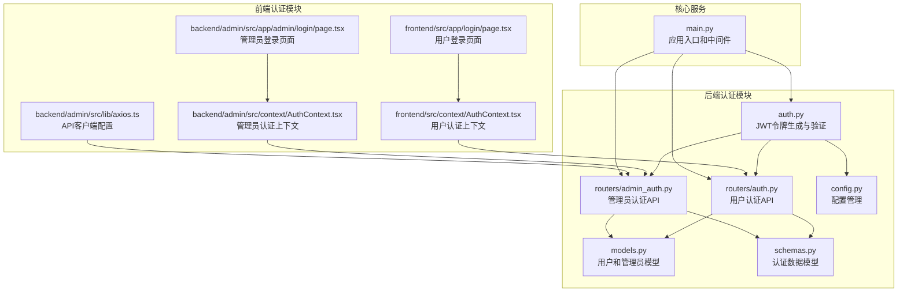
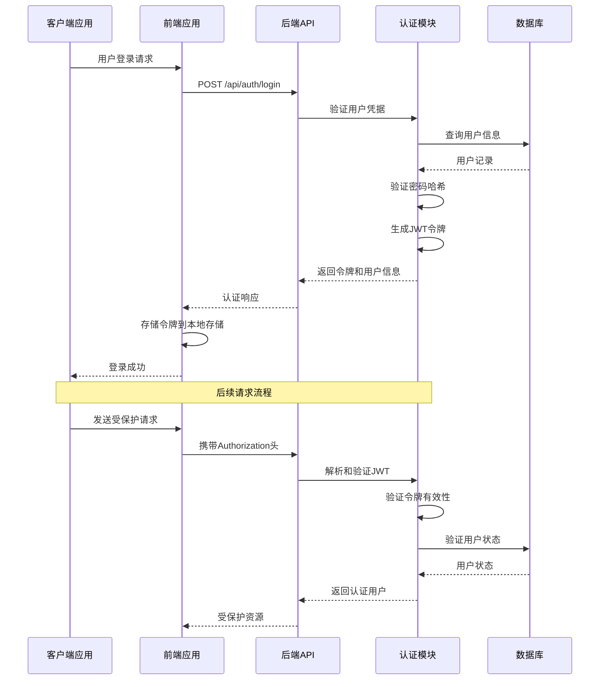
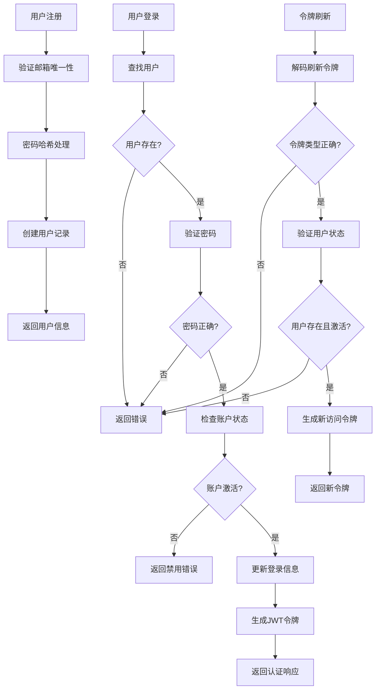
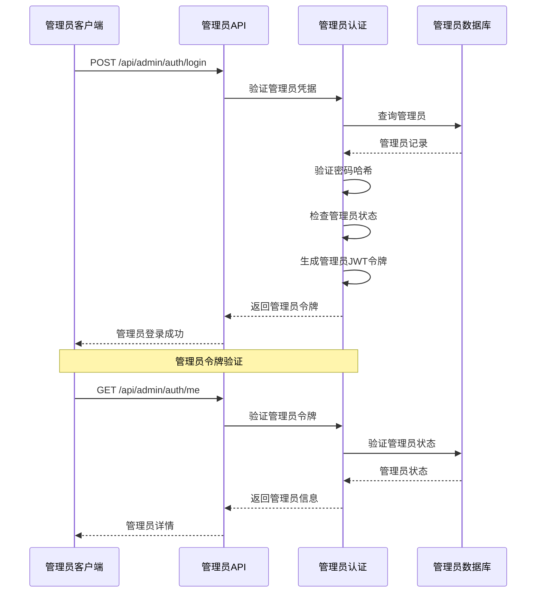
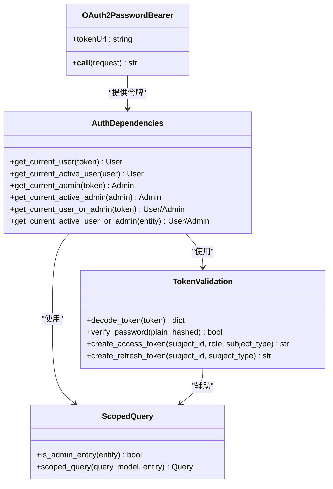
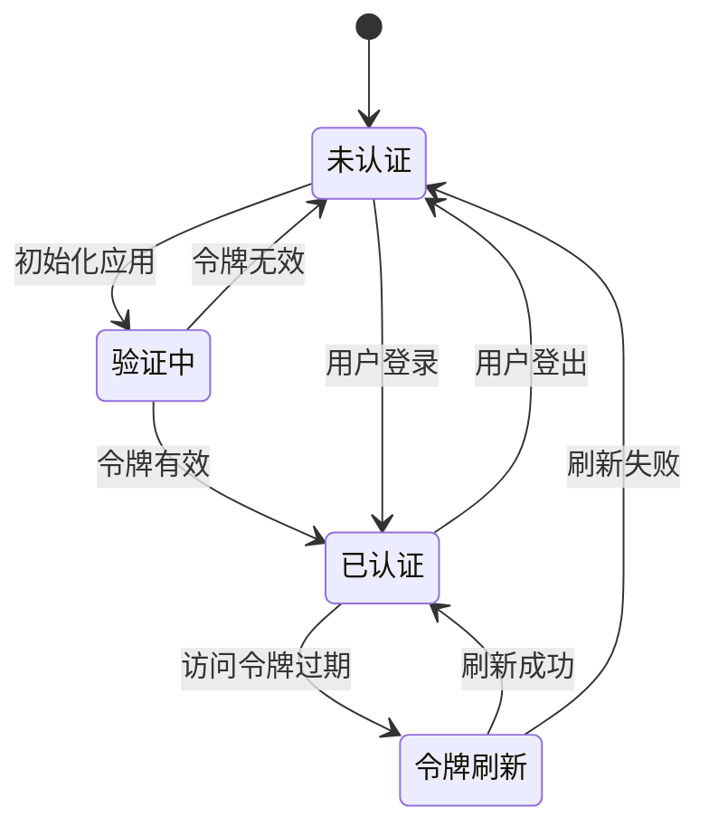
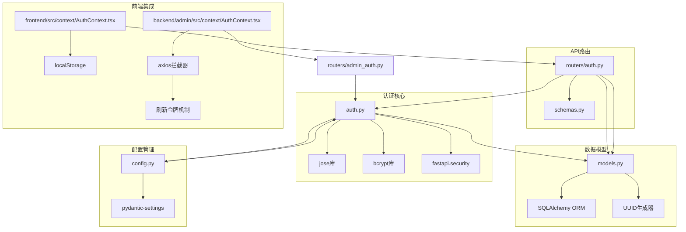

# 认证和授权系统

<cite>
**本文档引用的文件**
- [backend/auth.py](file://backend/auth.py)
- [backend/routers/auth.py](file://backend/routers/auth.py)
- [backend/routers/admin_auth.py](file://backend/routers/admin_auth.py)
- [backend/models.py](file://backend/models.py)
- [backend/config.py](file://backend/config.py)
- [backend/main.py](file://backend/main.py)
- [backend/schemas.py](file://backend/schemas.py)
- [frontend/src/context/AuthContext.tsx](file://frontend/src/context/AuthContext.tsx)
- [frontend/src/app/login/page.tsx](file://frontend/src/app/login/page.tsx)
- [backend/admin/src/context/AuthContext.tsx](file://backend/admin/src/context/AuthContext.tsx)
- [backend/admin/src/app/admin/login/page.tsx](file://backend/admin/src/app/admin/login/page.tsx)
- [backend/admin/src/lib/axios.ts](file://backend/admin/src/lib/axios.ts)
</cite>

## 目录
1. [简介](#简介)
2. [项目结构](#项目结构)
3. [核心组件](#核心组件)
4. [架构概览](#架构概览)
5. [详细组件分析](#详细组件分析)
6. [依赖关系分析](#依赖关系分析)
7. [性能考虑](#性能考虑)
8. [故障排除指南](#故障排除指南)
9. [结论](#结论)
10. [附录](#附录)

## 简介

Infinite Game认证和授权系统是一个基于JWT（JSON Web Token）的现代化身份验证解决方案，专为多用户和管理员环境设计。该系统实现了完整的用户生命周期管理，包括用户注册、登录、令牌刷新和权限验证机制。

系统采用分离的用户和管理员认证模型，通过独立的数据库表和认证流程来确保不同用户群体的安全隔离。认证系统支持密码哈希、令牌验证、会话管理和安全防护措施，为整个Infinite Theater平台提供可靠的身份验证基础。

## 项目结构

认证和授权系统主要分布在以下模块中：

**图表来源**
- [backend/auth.py:1-229](file://backend/auth.py#L1-L229)
- [backend/routers/auth.py:1-136](file://backend/routers/auth.py#L1-L136)
- [backend/routers/admin_auth.py:1-136](file://backend/routers/admin_auth.py#L1-L136)
- [backend/models.py:1-447](file://backend/models.py#L1-L447)
- [backend/schemas.py:1-859](file://backend/schemas.py#L1-L859)
- [backend/config.py:1-43](file://backend/config.py#L1-L43)
- [frontend/src/context/AuthContext.tsx:1-110](file://frontend/src/context/AuthContext.tsx#L1-L110)
- [backend/admin/src/context/AuthContext.tsx:1-117](file://backend/admin/src/context/AuthContext.tsx#L1-L117)

**章节来源**
- [backend/auth.py:1-229](file://backend/auth.py#L1-L229)
- [backend/routers/auth.py:1-136](file://backend/routers/auth.py#L1-L136)
- [backend/routers/admin_auth.py:1-136](file://backend/routers/admin_auth.py#L1-L136)
- [backend/models.py:1-447](file://backend/models.py#L1-L447)
- [backend/schemas.py:1-859](file://backend/schemas.py#L1-L859)
- [backend/config.py:1-43](file://backend/config.py#L1-L43)
- [frontend/src/context/AuthContext.tsx:1-110](file://frontend/src/context/AuthContext.tsx#L1-L110)
- [backend/admin/src/context/AuthContext.tsx:1-117](file://backend/admin/src/context/AuthContext.tsx#L1-L117)

## 核心组件

### JWT令牌管理系统

系统实现了完整的JWT令牌生命周期管理，包括令牌生成、验证和刷新机制。

**令牌结构设计**：
- **访问令牌（Access Token）**：有效期较短，用于日常API访问
- **刷新令牌（Refresh Token）**：有效期较长，用于获取新的访问令牌
- **令牌类型标识**：区分用户令牌和管理员令牌
- **主体类型声明**：指示令牌关联的用户类型

**章节来源**
- [backend/auth.py:30-62](file://backend/auth.py#L30-L62)
- [backend/auth.py:65-74](file://backend/auth.py#L65-L74)

### 密码加密策略

系统采用bcrypt进行密码哈希处理，确保密码存储的安全性。

**加密特性**：
- **哈希算法**：bcrypt，安全性高，抗彩虹表攻击
- **轮数配置**：12轮，平衡安全性和性能
- **盐值生成**：自动随机生成，防止碰撞
- **验证机制**：支持快速密码验证

**章节来源**
- [backend/auth.py:19-24](file://backend/auth.py#L19-L24)

### 用户权限模型

系统实现了双层权限模型，支持普通用户和管理员的不同权限级别。

**用户权限层次**：
- **普通用户**：基础功能访问权限
- **管理员**：系统管理权限，可访问管理员专用功能
- **权限级别**：支持admin和super_admin两种管理员级别

**章节来源**
- [backend/models.py:10-33](file://backend/models.py#L10-L33)
- [backend/models.py:35-73](file://backend/models.py#L35-L73)

## 架构概览

认证系统采用分层架构设计，确保职责分离和代码可维护性。

**图表来源**
- [backend/routers/auth.py:63-99](file://backend/routers/auth.py#L63-L99)
- [backend/auth.py:83-106](file://backend/auth.py#L83-L106)
- [frontend/src/app/login/page.tsx:18-29](file://frontend/src/app/login/page.tsx#L18-L29)

## 详细组件分析

### 用户认证流程

用户认证流程涵盖了从注册到登录的完整生命周期。

**图表来源**
- [backend/routers/auth.py:36-60](file://backend/routers/auth.py#L36-L60)
- [backend/routers/auth.py:63-99](file://backend/routers/auth.py#L63-L99)
- [backend/routers/auth.py:102-129](file://backend/routers/auth.py#L102-L129)

**章节来源**
- [backend/routers/auth.py:36-135](file://backend/routers/auth.py#L36-L135)

### 管理员认证流程

管理员认证流程与用户认证类似，但针对管理员账户进行了专门优化。

**图表来源**
- [backend/routers/admin_auth.py:36-90](file://backend/routers/admin_auth.py#L36-L90)
- [backend/routers/admin_auth.py:130-135](file://backend/routers/admin_auth.py#L130-L135)

**章节来源**
- [backend/routers/admin_auth.py:1-136](file://backend/routers/admin_auth.py#L1-L136)

### 认证中间件实现

系统实现了多层认证中间件，确保请求的安全性和有效性。

**图表来源**
- [backend/auth.py:80-229](file://backend/auth.py#L80-L229)

**章节来源**
- [backend/auth.py:80-229](file://backend/auth.py#L80-L229)

### 前端认证上下文

前端实现了完整的认证状态管理，包括令牌存储、自动刷新和路由保护。

**图表来源**
- [frontend/src/context/AuthContext.tsx:52-102](file://frontend/src/context/AuthContext.tsx#L52-L102)
- [backend/admin/src/context/AuthContext.tsx:39-104](file://backend/admin/src/context/AuthContext.tsx#L39-L104)

**章节来源**
- [frontend/src/context/AuthContext.tsx:1-110](file://frontend/src/context/AuthContext.tsx#L1-L110)
- [backend/admin/src/context/AuthContext.tsx:1-117](file://backend/admin/src/context/AuthContext.tsx#L1-L117)

## 依赖关系分析

认证系统的核心依赖关系如下：

**图表来源**
- [backend/auth.py:1-229](file://backend/auth.py#L1-L229)
- [backend/routers/auth.py:1-136](file://backend/routers/auth.py#L1-L136)
- [backend/models.py:1-447](file://backend/models.py#L1-L447)
- [backend/config.py:1-43](file://backend/config.py#L1-L43)
- [frontend/src/context/AuthContext.tsx:1-110](file://frontend/src/context/AuthContext.tsx#L1-L110)
- [backend/admin/src/context/AuthContext.tsx:1-117](file://backend/admin/src/context/AuthContext.tsx#L1-L117)

**章节来源**
- [backend/auth.py:1-229](file://backend/auth.py#L1-L229)
- [backend/routers/auth.py:1-136](file://backend/routers/auth.py#L1-L136)
- [backend/models.py:1-447](file://backend/models.py#L1-L447)
- [backend/config.py:1-43](file://backend/config.py#L1-L43)
- [frontend/src/context/AuthContext.tsx:1-110](file://frontend/src/context/AuthContext.tsx#L1-L110)
- [backend/admin/src/context/AuthContext.tsx:1-117](file://backend/admin/src/context/AuthContext.tsx#L1-L117)

## 性能考虑

### 令牌缓存策略

系统采用了合理的令牌缓存策略以提高性能：

- **访问令牌缓存**：短期缓存，减少频繁的令牌验证开销
- **用户信息缓存**：在会话期间缓存用户信息，避免重复查询
- **数据库连接池**：使用异步连接池提高数据库操作效率

### 密码哈希优化

- **哈希轮数配置**：12轮平衡了安全性和性能
- **盐值生成**：自动随机生成，确保每个密码都有独特的盐值
- **内存安全**：使用C扩展实现，提高哈希计算速度

### 并发处理

- **异步操作**：所有数据库操作都是异步的，避免阻塞
- **请求队列**：令牌刷新时支持并发请求排队
- **连接复用**：数据库连接和HTTP客户端连接复用

## 故障排除指南

### 常见认证问题

**令牌过期问题**：
- 检查ACCESS_TOKEN_EXPIRE_MINUTES配置
- 实现自动令牌刷新机制
- 处理刷新令牌失效的情况

**密码验证失败**：
- 确认bcrypt哈希算法正确
- 检查密码长度和复杂度要求
- 验证数据库中的密码哈希存储

**用户状态异常**：
- 检查is_active字段状态
- 验证用户账户是否被禁用
- 确认账户状态同步机制

### 调试技巧

**后端调试**：
- 启用DebugAuthMiddleware查看认证头
- 检查JWT令牌的有效载荷
- 验证数据库连接状态

**前端调试**：
- 检查localStorage中的令牌存储
- 验证axios拦截器的令牌注入
- 监控网络请求的认证状态

**章节来源**
- [backend/main.py:119-127](file://backend/main.py#L119-L127)
- [backend/admin/src/lib/axios.ts:52-80](file://backend/admin/src/lib/axios.ts#L52-L80)

## 结论

Infinite Game认证和授权系统是一个设计精良、安全可靠的现代化身份验证解决方案。系统通过分离的用户和管理员认证模型、完善的JWT令牌管理机制和健壮的安全防护措施，为整个平台提供了坚实的身份验证基础。

系统的主要优势包括：
- **安全性**：采用bcrypt密码哈希、JWT令牌和严格的权限控制
- **可扩展性**：模块化设计支持功能扩展和性能优化
- **用户体验**：自动令牌刷新和无缝认证体验
- **开发友好**：清晰的API设计和完善的错误处理

建议在生产环境中进一步加强的安全措施包括：实施双因素认证、添加IP白名单、增强日志审计和定期安全评估。

## 附录

### API端点说明

**用户认证API**：
- `POST /api/auth/register` - 用户注册
- `POST /api/auth/login` - 用户登录
- `POST /api/auth/refresh` - 刷新访问令牌
- `GET /api/auth/me` - 获取当前用户信息

**管理员认证API**：
- `POST /api/admin/auth/login` - 管理员登录
- `POST /api/admin/auth/refresh` - 刷新管理员访问令牌
- `GET /api/admin/auth/me` - 获取当前管理员信息

### 安全最佳实践

1. **令牌管理**：
   - 在HTTPS环境下传输令牌
   - 设置适当的令牌过期时间
   - 实施令牌撤销机制

2. **密码安全**：
   - 强制密码复杂度要求
   - 定期更新密码哈希算法
   - 实施密码重用检测

3. **会话管理**：
   - 实施会话超时机制
   - 监控异常登录行为
   - 提供会话注销功能

4. **权限控制**：
   - 最小权限原则
   - 角色基础访问控制
   - 定期权限审查