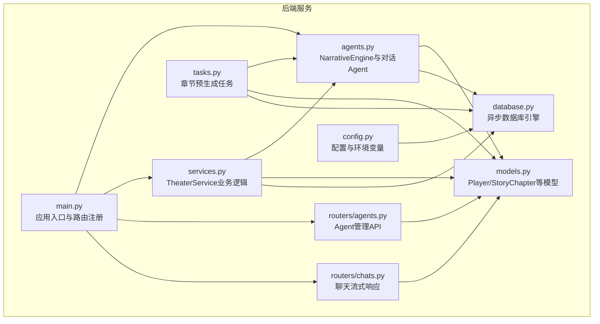
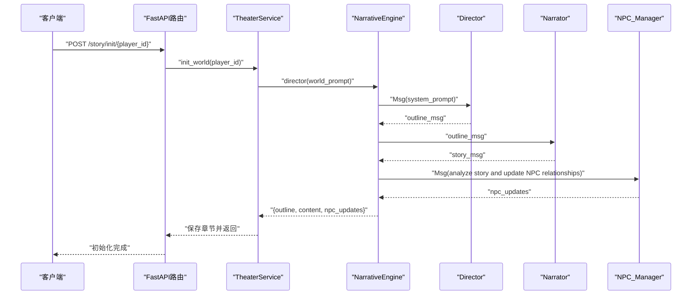
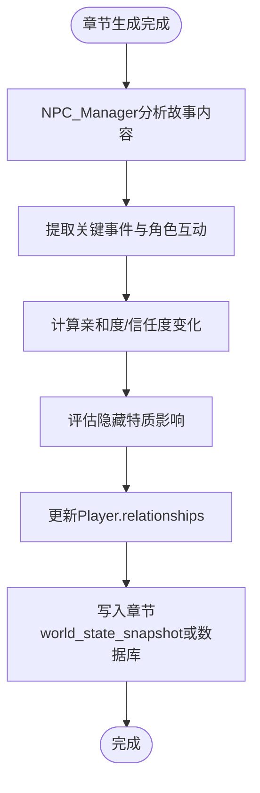
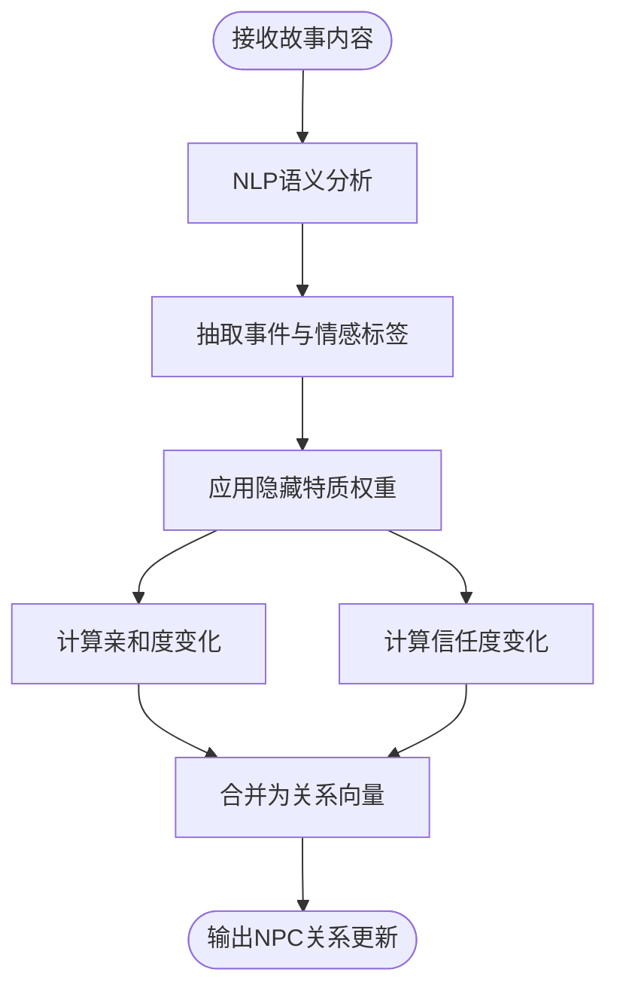
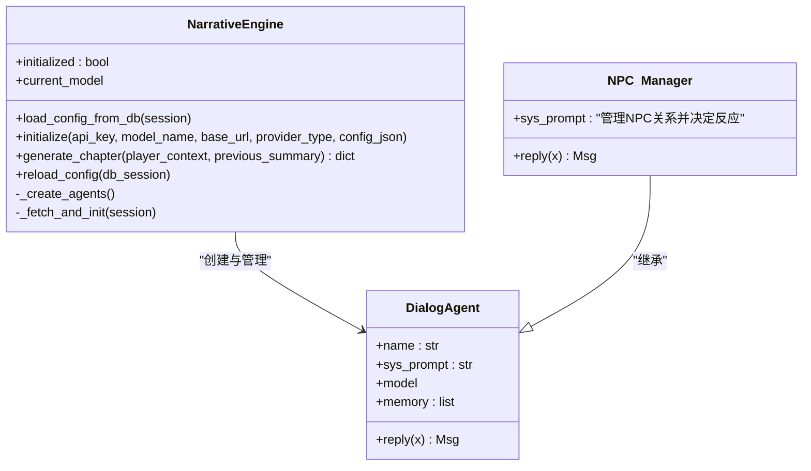
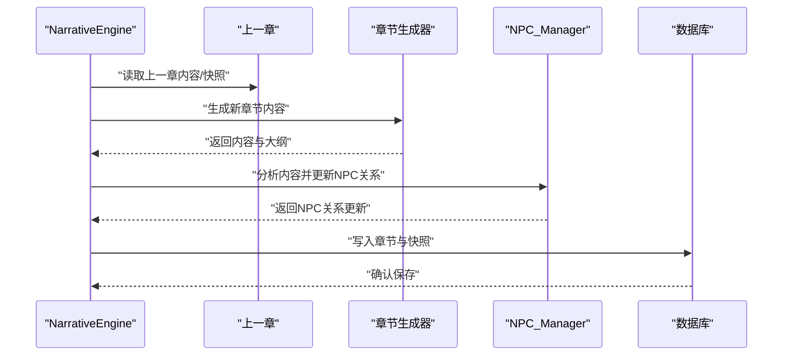
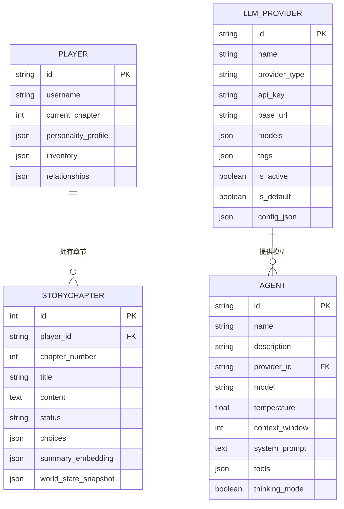
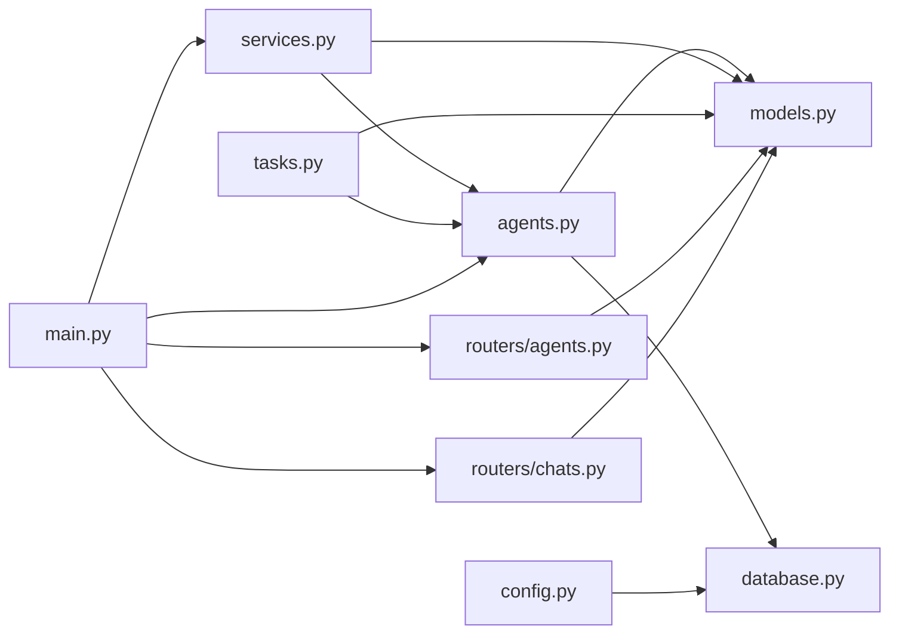

# NPC管理Agent

<cite>
**本文档引用的文件**
- [backend/agents.py](file://backend/agents.py)
- [backend/models.py](file://backend/models.py)
- [backend/services.py](file://backend/services.py)
- [backend/tasks.py](file://backend/tasks.py)
- [backend/main.py](file://backend/main.py)
- [backend/config.py](file://backend/config.py)
- [backend/database.py](file://backend/database.py)
- [backend/routers/agents.py](file://backend/routers/agents.py)
- [backend/routers/chats.py](file://backend/routers/chats.py)
- [backend/schemas.py](file://backend/schemas.py)
- [README.md](file://README.md)
</cite>

## 目录
1. [简介](#简介)
2. [项目结构](#项目结构)
3. [核心组件](#核心组件)
4. [架构总览](#架构总览)
5. [详细组件分析](#详细组件分析)
6. [依赖关系分析](#依赖关系分析)
7. [性能考虑](#性能考虑)
8. [故障排除指南](#故障排除指南)
9. [结论](#结论)
10. [附录](#附录)

## 简介
本文件面向NPC管理Agent的技术文档，聚焦于角色行为控制与关系管理功能，深入解析NPC关系追踪机制、亲和度与信任度评估模型、反应决策系统、隐藏特质影响以及动态行为调整策略。同时阐述NPC管理Agent如何分析故事情节、更新角色状态并维护角色一致性，并提供NPC个性化配置、行为模式定制与交互逻辑设计指南，辅以开发、调试与性能优化建议。

## 项目结构
后端采用FastAPI + SQLAlchemy异步ORM + AgentScope多智能体框架，核心围绕NarrativeEngine与对话型Agent（Director、Narrator、NPC_Manager）协作完成章节生成与NPC状态更新；玩家与NPC关系存储于数据库中，章节内容与世界快照用于一致性校验与预生成。

**图表来源**
- [backend/main.py](file://backend/main.py#L83-L98)
- [backend/agents.py](file://backend/agents.py#L43-L195)
- [backend/models.py](file://backend/models.py#L9-L122)
- [backend/services.py](file://backend/services.py#L8-L65)
- [backend/tasks.py](file://backend/tasks.py#L7-L61)
- [backend/routers/agents.py](file://backend/routers/agents.py#L1-L141)
- [backend/routers/chats.py](file://backend/routers/chats.py#L1-L275)
- [backend/config.py](file://backend/config.py#L1-L34)
- [backend/database.py](file://backend/database.py#L1-L31)

**章节来源**
- [backend/main.py](file://backend/main.py#L83-L98)
- [README.md](file://README.md#L34-L51)

## 核心组件
- NarrativeEngine：负责加载LLM配置、初始化对话Agent（Director、Narrator、NPC_Manager），并协调章节生成流程，其中NPC_Manager承担NPC关系与反应的分析职责。
- DialogAgent：通用对话智能体基类，封装记忆、系统提示词与模型调用，支撑各角色Agent的行为。
- Player模型：包含relationships字段，用于存储NPC关系（亲和度、信任度、隐藏特质）。
- TheaterService：高层业务服务，驱动世界构建与章节初始化，调用NarrativeEngine生成内容。
- 预生成任务：根据当前章节内容生成下一章，写入数据库并触发资产生成。

**章节来源**
- [backend/agents.py](file://backend/agents.py#L11-L42)
- [backend/agents.py](file://backend/agents.py#L43-L195)
- [backend/models.py](file://backend/models.py#L9-L22)
- [backend/services.py](file://backend/services.py#L8-L65)
- [backend/tasks.py](file://backend/tasks.py#L7-L61)

## 架构总览
NPC管理Agent位于NarrativeEngine内部，作为“NPC_Manager”角色，其职责是分析生成内容并更新NPC关系状态。整体工作流如下：

**图表来源**
- [backend/services.py](file://backend/services.py#L19-L65)
- [backend/agents.py](file://backend/agents.py#L154-L191)

## 详细组件分析

### NPC关系追踪与状态管理
- 数据结构：Player.relationships采用JSON格式存储，键为NPC标识，值包含affinity（亲和度）、trust（信任度）、hidden（隐藏特质）等指标。
- 更新机制：NarrativeEngine在生成章节后，将故事内容传递给NPC_Manager，由其分析并返回NPC关系更新摘要，随后写入章节的world_state_snapshot或直接更新玩家关系。
- 一致性维护：章节content与world_state_snapshot用于后续一致性校验与预生成，避免剧情偏离。

**图表来源**
- [backend/agents.py](file://backend/agents.py#L179-L185)
- [backend/models.py](file://backend/models.py#L21-L22)
- [backend/tasks.py](file://backend/tasks.py#L49-L55)

**章节来源**
- [backend/models.py](file://backend/models.py#L21-L22)
- [backend/agents.py](file://backend/agents.py#L179-L185)
- [backend/tasks.py](file://backend/tasks.py#L49-L55)

### 亲和度与信任度评估模型
- 输入：故事文本、角色互动上下文、玩家选择倾向。
- 特质因子：隐藏特质（如偏见、价值观、过往事件）影响反应权重。
- 输出：每个NPC的亲和度与信任度数值变化，决定后续交互倾向与对话内容。
- 算法复杂度：文本分析与相似度计算的时间复杂度取决于上下文长度与特征维度；当前实现通过LLM进行语义理解，具体评分规则在系统提示词中定义。

**图表来源**
- [backend/agents.py](file://backend/agents.py#L144-L148)
- [backend/agents.py](file://backend/agents.py#L179-L185)

**章节来源**
- [backend/agents.py](file://backend/agents.py#L144-L148)

### 反应决策系统与动态行为调整
- 决策依据：基于当前亲和度、信任度与隐藏特质，结合情节节点与玩家行为，生成NPC反应策略。
- 动态调整：根据章节生成结果与玩家反馈，持续微调NPC行为参数，保持一致性与新鲜感。
- 交互逻辑：NPC_Manager的系统提示词定义了“基于关系决定反应”的原则，实际策略可通过系统提示词与外部规则扩展。

**图表来源**
- [backend/agents.py](file://backend/agents.py#L11-L42)
- [backend/agents.py](file://backend/agents.py#L131-L148)

**章节来源**
- [backend/agents.py](file://backend/agents.py#L11-L42)
- [backend/agents.py](file://backend/agents.py#L131-L148)

### 故事情节分析与角色一致性维护
- 分析流程：Director生成大纲，Narrator填充细节，NPC_Manager分析并更新关系，最终形成完整章节。
- 一致性校验：章节world_state_snapshot记录NPC关系与关键事件，用于后续章节生成与偏差检测。
- 预生成策略：根据当前章节内容与世界快照，提前生成下一章，提升响应速度与用户体验。

**图表来源**
- [backend/agents.py](file://backend/agents.py#L154-L191)
- [backend/tasks.py](file://backend/tasks.py#L37-L55)

**章节来源**
- [backend/agents.py](file://backend/agents.py#L154-L191)
- [backend/tasks.py](file://backend/tasks.py#L37-L55)

### NPC个性化配置与行为模式定制
- Agent配置：通过Agent模型与LLMProvider关联，支持温度、上下文窗口、系统提示词与工具列表等参数。
- 行为模式：通过系统提示词定义NPC_Manager的行为风格（如更注重亲和度、信任度或隐藏特质）。
- 交互逻辑：聊天路由支持流式响应与令牌统计，便于观察不同Agent的输出行为。

**图表来源**
- [backend/models.py](file://backend/models.py#L9-L122)

**章节来源**
- [backend/models.py](file://backend/models.py#L9-L122)
- [backend/routers/agents.py](file://backend/routers/agents.py#L15-L55)
- [backend/routers/chats.py](file://backend/routers/chats.py#L72-L258)

## 依赖关系分析
- 组件耦合：NarrativeEngine与DialogAgent松耦合，通过系统提示词与消息协议交互；与数据库通过异步会话交互。
- 外部依赖：AgentScope模型封装（OpenAI/DashScope），数据库引擎（SQLAlchemy异步），FastAPI路由与中间件。
- 循环依赖：当前未发现循环导入；模块间通过函数与类接口通信。

**图表来源**
- [backend/agents.py](file://backend/agents.py#L1-L10)
- [backend/models.py](file://backend/models.py#L1-L4)
- [backend/database.py](file://backend/database.py#L1-L31)
- [backend/services.py](file://backend/services.py#L1-L6)
- [backend/tasks.py](file://backend/tasks.py#L1-L5)
- [backend/routers/agents.py](file://backend/routers/agents.py#L1-L7)
- [backend/routers/chats.py](file://backend/routers/chats.py#L1-L12)
- [backend/config.py](file://backend/config.py#L1-L34)
- [backend/main.py](file://backend/main.py#L30-L43)

**章节来源**
- [backend/agents.py](file://backend/agents.py#L1-L10)
- [backend/main.py](file://backend/main.py#L30-L43)

## 性能考虑
- 异步I/O：使用SQLAlchemy异步引擎与FastAPI异步路由，降低阻塞。
- 流式响应：聊天路由支持流式输出，减少等待时间并提供更好的交互体验。
- 预生成策略：通过任务预生成下一章，缓解实时生成压力。
- 缓存与连接池：数据库连接池与Redis缓存（配置存在）可用于热点数据加速。
- 日志与监控：统一日志级别与SQLAlchemy日志抑制，便于生产环境观测。

**章节来源**
- [backend/database.py](file://backend/database.py#L8-L23)
- [backend/routers/chats.py](file://backend/routers/chats.py#L113-L258)
- [backend/tasks.py](file://backend/tasks.py#L7-L61)
- [backend/main.py](file://backend/main.py#L13-L28)

## 故障排除指南
- LLM提供者未初始化：NarrativeEngine在未加载配置时返回错误提示，需在后台配置有效提供者。
- 数据库连接失败：启动阶段执行迁移与连接重试，检查DATABASE_URL与权限。
- 聊天流式响应异常：检查provider_type与API密钥，确认支持的模型类型与网络访问。
- NPC关系未更新：确认NPC_Manager系统提示词与生成内容是否包含足够的角色互动信息。

**章节来源**
- [backend/agents.py](file://backend/agents.py#L155-L164)
- [backend/main.py](file://backend/main.py#L45-L81)
- [backend/routers/chats.py](file://backend/routers/chats.py#L145-L209)

## 结论
NPC管理Agent通过与Narrator与Director的协作，实现了基于故事内容的NPC关系追踪与状态更新。Player.relationships为NPC行为提供了可解释的量化基础，结合章节world_state_snapshot与预生成策略，保障了叙事一致性与性能表现。未来可在NPC_Manager中引入更精细的评分算法与规则引擎，进一步提升NPC行为的深度与可定制性。

## 附录

### NPC开发指南
- 系统提示词设计：明确NPC_Manager的职责边界（关系追踪、反应决策、隐藏特质影响）。
- 数据模型扩展：在Player.relationships基础上增加更细粒度的特质维度与历史轨迹。
- 行为模式定制：通过Agent模型参数（温度、上下文窗口、工具列表）与系统提示词组合实现差异化行为。
- 交互逻辑设计：利用聊天流式响应与令牌统计，观察不同Agent的输出稳定性与一致性。

**章节来源**
- [backend/agents.py](file://backend/agents.py#L144-L148)
- [backend/models.py](file://backend/models.py#L21-L22)
- [backend/routers/chats.py](file://backend/routers/chats.py#L113-L258)

### 调试方法
- 启动日志：关注数据库迁移与NarrativeEngine初始化日志。
- 聊天日志：查看输入字符数、上下文窗口占用与API令牌统计。
- 错误处理：聊天路由捕获异常并记录错误信息，便于定位问题。

**章节来源**
- [backend/main.py](file://backend/main.py#L13-L28)
- [backend/routers/chats.py](file://backend/routers/chats.py#L211-L216)

### 性能优化技巧
- 连接池与超时：合理配置数据库连接池大小与超时参数。
- 预生成与缓存：对热门章节与常用场景进行预生成与缓存。
- 日志降噪：生产环境关闭SQLAlchemy与uvicorn访问日志，仅保留应用日志。
- 异步化：确保所有I/O操作异步化，避免阻塞事件循环。

**章节来源**
- [backend/database.py](file://backend/database.py#L8-L23)
- [backend/main.py](file://backend/main.py#L13-L28)
- [backend/tasks.py](file://backend/tasks.py#L7-L61)