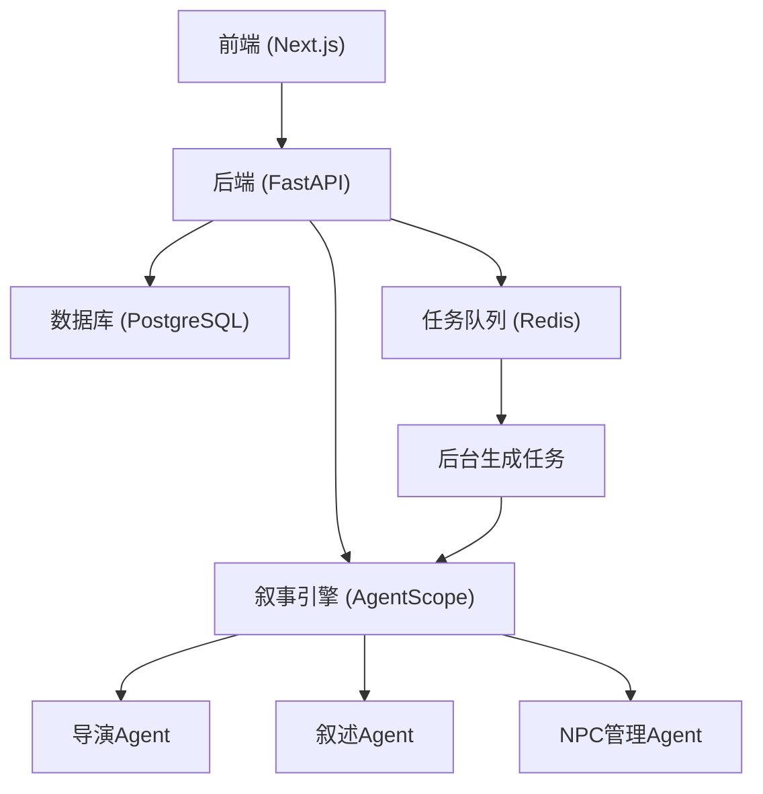
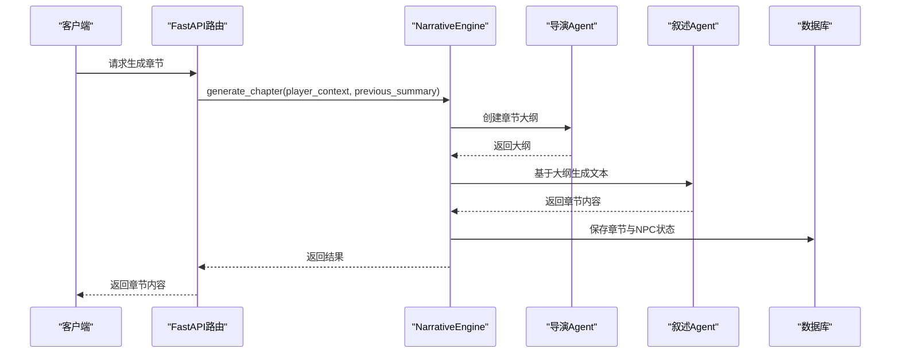
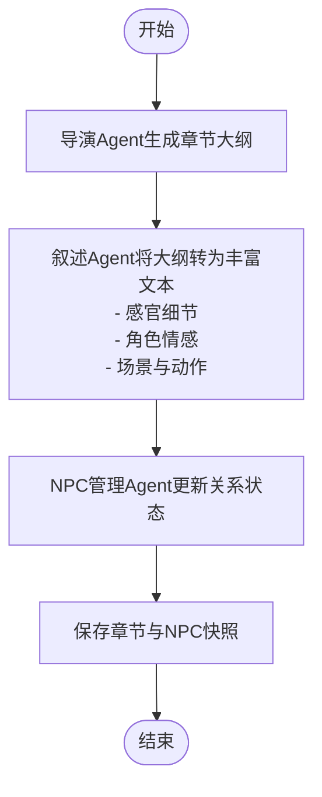
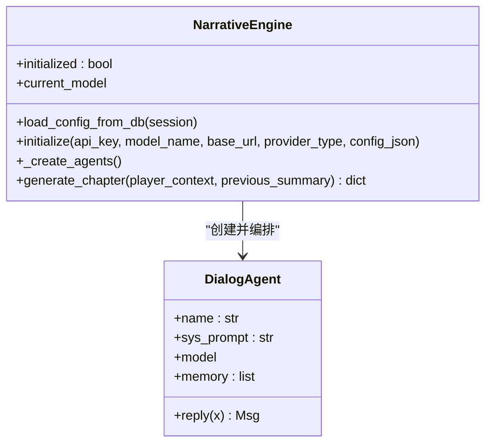
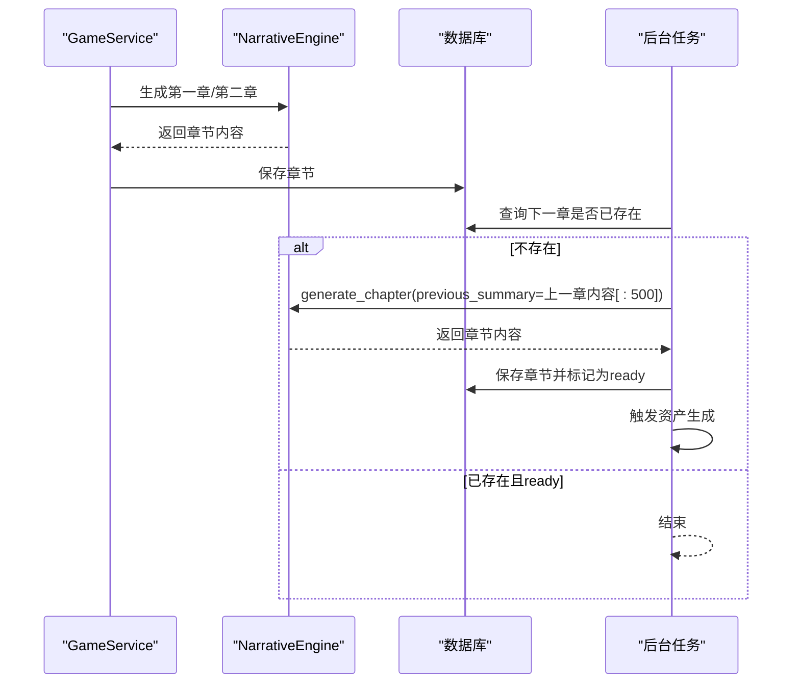
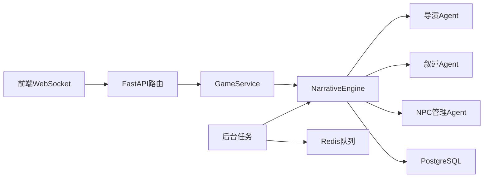

# 叙述Agent

<cite>
**本文引用的文件**
- [backend/agents.py](file://backend/agents.py)
- [backend/models.py](file://backend/models.py)
- [backend/services.py](file://backend/services.py)
- [backend/tasks.py](file://backend/tasks.py)
- [backend/main.py](file://backend/main.py)
- [backend/routers/agents.py](file://backend/routers/agents.py)
- [docs/wiki/Architecture.md](file://docs/wiki/Architecture.md)
- [docs/wiki/Requirements-Traceability.md](file://docs/wiki/Requirements-Traceability.md)
- [frontend/src/hooks/useSocket.ts](file://frontend/src/hooks/useSocket.ts)
</cite>

## 目录
1. [引言](#引言)
2. [项目结构](#项目结构)
3. [核心组件](#核心组件)
4. [架构总览](#架构总览)
5. [详细组件分析](#详细组件分析)
6. [依赖分析](#依赖分析)
7. [性能考虑](#性能考虑)
8. [故障排查指南](#故障排查指南)
9. [结论](#结论)
10. [附录](#附录)

## 引言
本文件围绕“叙述Agent”的技术实现展开，重点解释其文本生成能力、沉浸式描述技巧、从大纲到丰富情节的转换机制、角色情感刻画与多感官认知细节的构建方式，并阐述写作风格控制、语言风格调整与叙事节奏把握的方法。同时，文档梳理叙述Agent与导演Agent的协作流程、内容审查机制与质量保证策略，给出创意写作技巧、模板设计与个性化定制方法，并提供可操作的生成示例与优化建议。

## 项目结构
本项目采用前后端分离架构：前端基于 Next.js，后端基于 FastAPI，核心叙事引擎由 AgentScope 驱动，结合 PostgreSQL 与 Redis 完成数据持久化与异步任务编排。叙述Agent位于后端 Python 侧，通过对话式代理（DialogAgent）与导演Agent协同工作，完成章节级内容生成与NPC状态更新。

图表来源
- [docs/wiki/Architecture.md](file://docs/wiki/Architecture.md#L7-L36)
- [backend/agents.py](file://backend/agents.py#L131-L148)

章节来源
- [docs/wiki/Architecture.md](file://docs/wiki/Architecture.md#L1-L44)
- [backend/main.py](file://backend/main.py#L83-L98)

## 核心组件
- 叙事引擎（NarrativeEngine）：负责加载LLM配置、创建并编排三个Agent（导演、叙述、NPC管理），提供章节生成接口。
- 导演Agent（Director）：负责生成章节大纲，确保情节连贯与冲突推进。
- 叙述Agent（Narrator）：基于大纲生成沉浸式文本，强调感官细节与角色情感。
- NPC管理Agent（NPC_Manager）：跟踪玩家与NPC的关系变化，为后续章节提供状态更新。
- DialogAgent：通用对话代理基类，封装消息记忆、系统提示词与模型调用。
- 数据模型：Player、StoryChapter、LLMProvider等，支撑世界设定、章节内容与LLM提供商配置。
- 服务层（GameService）：封装初始化世界、生成章节等业务流程。
- 任务层（tasks）：实现章节预生成与异步资产生成触发。

章节来源
- [backend/agents.py](file://backend/agents.py#L11-L42)
- [backend/agents.py](file://backend/agents.py#L43-L195)
- [backend/models.py](file://backend/models.py#L9-L122)
- [backend/services.py](file://backend/services.py#L8-L66)
- [backend/tasks.py](file://backend/tasks.py#L7-L62)

## 架构总览
叙述Agent在整体架构中的定位如下：
- 通过FastAPI路由触发NarrativeEngine的章节生成流程；
- 与导演Agent协作产出大纲，再由叙述Agent将大纲转化为丰富文本；
- NPC管理Agent对角色关系进行更新，形成闭环；
- 预生成任务通过Redis队列异步执行，提升用户体验；
- 管理端提供LLM提供商与Agent参数配置入口，支持动态切换与个性化定制。

图表来源
- [backend/agents.py](file://backend/agents.py#L154-L191)
- [backend/services.py](file://backend/services.py#L28-L59)
- [backend/tasks.py](file://backend/tasks.py#L37-L52)

## 详细组件分析

### 叙述Agent与导演Agent协作流程
- 导演Agent接收“基于上一章摘要与玩家上下文”的生成请求，产出章节大纲；
- 叙述Agent接收大纲，生成沉浸式文本，强调感官细节与角色情感；
- NPC管理Agent分析文本并更新NPC关系，为后续章节提供状态输入。

图表来源
- [backend/agents.py](file://backend/agents.py#L166-L191)

章节来源
- [backend/agents.py](file://backend/agents.py#L131-L191)

### 叙述Agent的数据结构与处理逻辑
- DialogAgent：封装系统提示词、消息记忆与模型调用，统一处理assistant/system/user三类角色的消息序列。
- NarrativeEngine：负责LLM提供商加载、模型初始化与Agent实例化；提供章节生成主流程。

图表来源
- [backend/agents.py](file://backend/agents.py#L11-L42)
- [backend/agents.py](file://backend/agents.py#L43-L195)

章节来源
- [backend/agents.py](file://backend/agents.py#L11-L195)

### 章节生成与预生成机制
- 初始化世界：导演Agent生成世界设定，随后生成第一章与第二章内容；
- 预生成策略：后台任务检查下一章节是否存在，若不存在则生成并标记为“就绪”，同时触发资产生成；
- 上下文截断：为演示目的，预生成时对上一章内容进行截断以控制上下文长度。

图表来源
- [backend/services.py](file://backend/services.py#L19-L59)
- [backend/tasks.py](file://backend/tasks.py#L7-L56)

章节来源
- [backend/services.py](file://backend/services.py#L19-L59)
- [backend/tasks.py](file://backend/tasks.py#L7-L56)

### 写作风格控制、语言风格调整与叙事节奏
- 系统提示词（System Prompt）：通过为叙述Agent设置强调“沉浸式描述”“感官细节”“角色情感”的提示词，实现风格约束；
- 参数化控制：温度（temperature）、上下文窗口（context_window）等参数可通过管理端配置，影响生成的创造性与稳定性；
- 工具能力：可选启用图像生成、知识库检索等工具，辅助场景还原与背景信息补充；
- 节奏把控：通过“章节预生成（N+2）”策略减少等待时间，结合WebSocket实现实时反馈。

章节来源
- [backend/agents.py](file://backend/agents.py#L138-L142)
- [backend/routers/agents.py](file://backend/routers/agents.py#L81-L126)
- [docs/wiki/Requirements-Traceability.md](file://docs/wiki/Requirements-Traceability.md#L40-L47)

### 创意写作技巧、模板设计与个性化定制
- 模板设计：以“世界设定—章节大纲—沉浸式文本—NPC状态更新”为主线，形成可复用的生成模板；
- 个性化定制：通过管理端为不同Agent配置专属系统提示词、温度与工具集，满足不同风格需求；
- 情节分支：章节表中的choices字段可用于记录玩家选择分支，便于后续扩展多结局与分支剧情。

章节来源
- [backend/models.py](file://backend/models.py#L24-L43)
- [backend/routers/agents.py](file://backend/routers/agents.py#L15-L55)

### 内容审查机制与质量保证策略
- 审核机制：需求追踪文档指出需在系统提示词中加入安全过滤指令或接入第三方审核API；
- 失败熔断：在API调用层增加重试与降级逻辑，避免单点故障影响整体服务；
- 一致性校验：数据库预留summary_embedding字段，用于后续实现向量相似度偏离检测；
- 资产缓存：Asset表提供content_hash与last_accessed字段，支持去重与LRU缓存。

章节来源
- [docs/wiki/Requirements-Traceability.md](file://docs/wiki/Requirements-Traceability.md#L40-L47)
- [backend/models.py](file://backend/models.py#L45-L56)

### 生成示例与优化建议
- 示例路径
  - 初始化世界与章节生成：参考服务层初始化流程与章节保存逻辑。
  - 预生成下一章：参考后台任务的章节生成与保存流程。
- 优化建议
  - 流式响应：通过WebSocket实现Token级流式输出，降低首字延迟；
  - 安全审核：在系统提示词中加入安全过滤指令，或在生成后接入第三方审核API；
  - 上下文优化：根据模型上下文窗口限制，合理截断与压缩历史消息；
  - 资产生成：接入Stable Diffusion或DALL·E等图像生成API，实现图文并茂。

章节来源
- [backend/services.py](file://backend/services.py#L19-L59)
- [backend/tasks.py](file://backend/tasks.py#L7-L56)
- [docs/wiki/Requirements-Traceability.md](file://docs/wiki/Requirements-Traceability.md#L48-L53)

## 依赖分析
- 组件耦合
  - NarrativeEngine依赖LLM提供商配置，通过数据库动态加载；
  - GameService与NarrativeEngine协作完成世界初始化与章节生成；
  - 后台任务通过NarrativeEngine实现章节预生成；
  - 前端通过WebSocket与后端交互，接收实时消息。
- 外部依赖
  - AgentScope：作为Agent编排与LLM调用的基础设施；
  - PostgreSQL：持久化玩家、章节与提供商等数据；
  - Redis：异步任务队列（Celery/BackgroundTasks）承载者。

图表来源
- [backend/agents.py](file://backend/agents.py#L131-L195)
- [backend/services.py](file://backend/services.py#L8-L66)
- [backend/tasks.py](file://backend/tasks.py#L1-L62)
- [backend/main.py](file://backend/main.py#L157-L169)

章节来源
- [backend/agents.py](file://backend/agents.py#L131-L195)
- [backend/main.py](file://backend/main.py#L157-L169)

## 性能考虑
- 首字延迟：通过流式传输与预生成策略降低等待时间；
- 上下文长度：根据模型上下文窗口限制，对历史消息进行截断与摘要；
- 并发与队列：利用Redis队列异步生成章节，避免阻塞主线程；
- 缓存与去重：资产表提供content_hash与访问时间字段，支持缓存命中与LRU淘汰。

## 故障排查指南
- 初始化失败
  - 现象：返回“AI引擎未初始化（缺少活动提供商）”；
  - 排查：确认数据库中存在活动的LLM提供商配置，或检查环境变量；
  - 参考：章节生成返回值与Lazy Load逻辑。
- WebSocket异常
  - 现象：连接中断或消息无法接收；
  - 排查：检查后端WebSocket端点与前端连接参数，确认端口与域名一致；
  - 参考：WebSocket端点与前端Hook。
- 预生成重复
  - 现象：同一章节多次生成；
  - 排查：确认章节状态字段与存在性检查逻辑；
  - 参考：后台任务的章节存在性判断。

章节来源
- [backend/agents.py](file://backend/agents.py#L159-L164)
- [backend/main.py](file://backend/main.py#L157-L169)
- [frontend/src/hooks/useSocket.ts](file://frontend/src/hooks/useSocket.ts#L1-L42)
- [backend/tasks.py](file://backend/tasks.py#L9-L21)

## 结论
叙述Agent通过与导演Agent的协作，实现了从大纲到沉浸式文本的高效转换，并借助NPC管理Agent维持角色关系的一致性。依托管理端的参数化配置与工具能力，可灵活控制写作风格与叙事节奏。结合预生成与异步任务队列，系统在性能与可维护性方面具备良好基础。未来可在内容安全审核、流式响应与多模态资产生成等方面持续优化，以进一步提升用户体验与内容质量。

## 附录
- 相关文件索引
  - 叙事引擎与Agent定义：[backend/agents.py](file://backend/agents.py#L11-L195)
  - 数据模型（章节、提供商、资产等）：[backend/models.py](file://backend/models.py#L9-L122)
  - 服务层（初始化与章节生成）：[backend/services.py](file://backend/services.py#L8-L66)
  - 后台任务（预生成与资产生成）：[backend/tasks.py](file://backend/tasks.py#L7-L62)
  - FastAPI入口与WebSocket：[backend/main.py](file://backend/main.py#L128-L169)
  - 管理端Agent配置接口：[backend/routers/agents.py](file://backend/routers/agents.py#L15-L140)
  - 架构概览与需求追踪：[docs/wiki/Architecture.md](file://docs/wiki/Architecture.md#L1-L44)、[docs/wiki/Requirements-Traceability.md](file://docs/wiki/Requirements-Traceability.md#L1-L54)
  - 前端WebSocket Hook：[frontend/src/hooks/useSocket.ts](file://frontend/src/hooks/useSocket.ts#L1-L42)