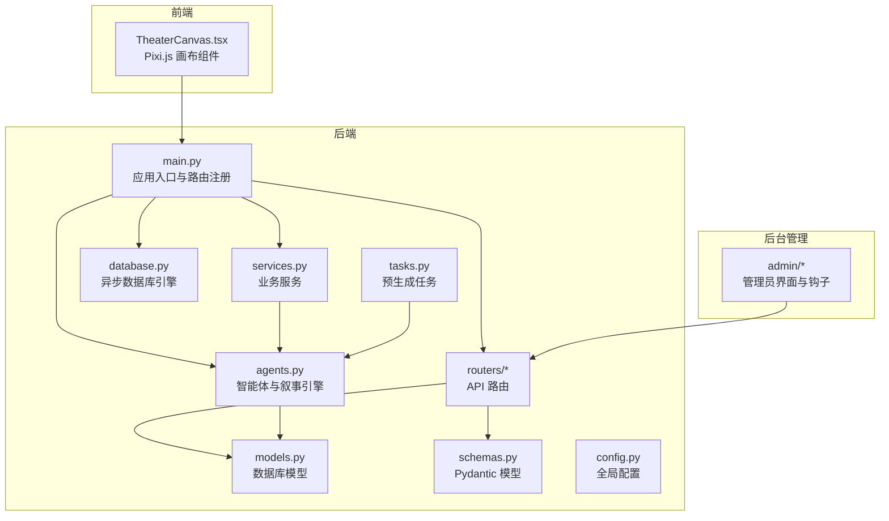
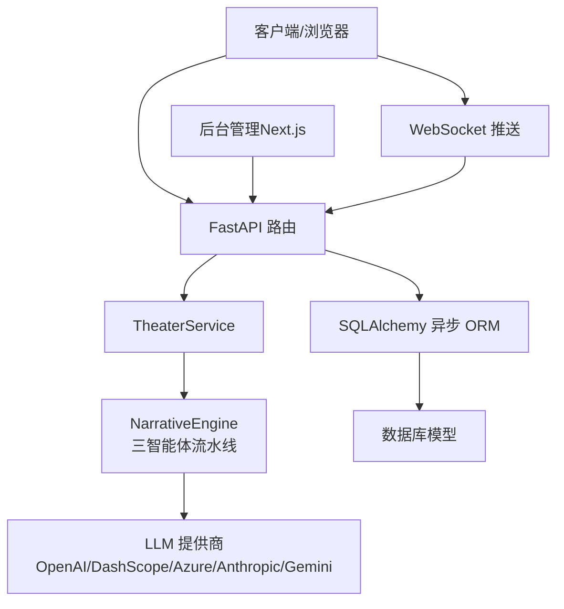
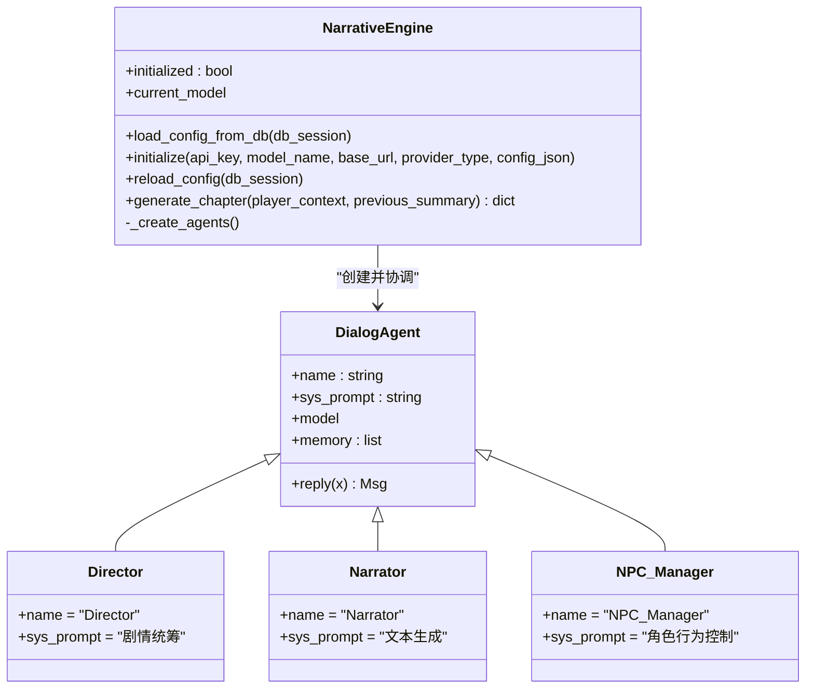
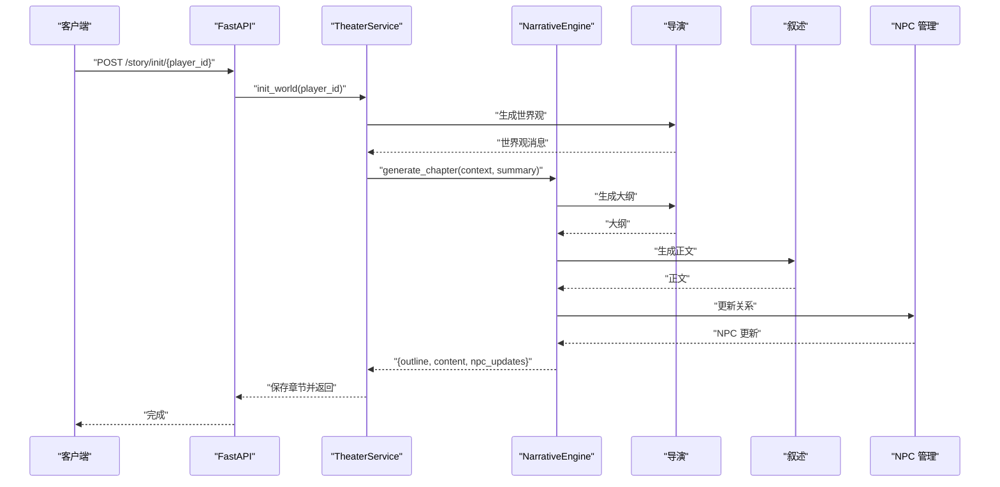
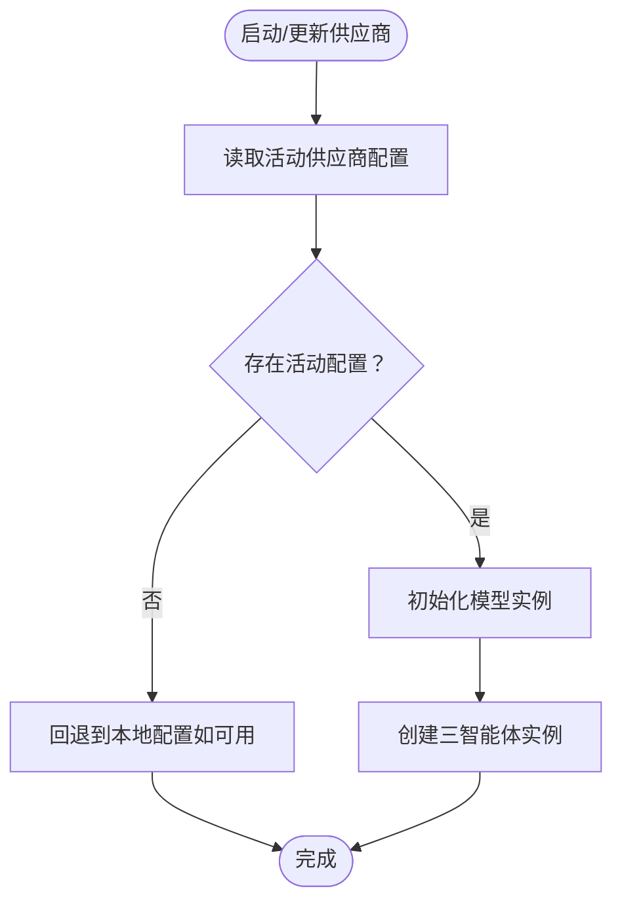
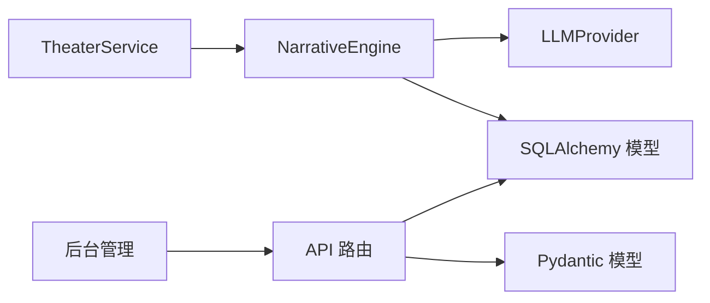

# 多智能体叙事引擎

<cite>
**本文引用的文件**
- [README.md](file://README.md)
- [backend/main.py](file://backend/main.py)
- [backend/agents.py](file://backend/agents.py)
- [backend/models.py](file://backend/models.py)
- [backend/schemas.py](file://backend/schemas.py)
- [backend/services.py](file://backend/services.py)
- [backend/routers/agents.py](file://backend/routers/agents.py)
- [backend/routers/chats.py](file://backend/routers/chats.py)
- [backend/routers/llm_config.py](file://backend/routers/llm_config.py)
- [backend/config.py](file://backend/config.py)
- [backend/database.py](file://backend/database.py)
- [backend/tasks.py](file://backend/tasks.py)
- [frontend/src/components/TheaterCanvas.tsx](file://frontend/src/components/TheaterCanvas.tsx)
- [backend/admin/src/constants/agent.ts](file://backend/admin/src/constants/agent.ts)
- [backend/admin/src/hooks/useAgents.ts](file://backend/admin/src/hooks/useAgents.ts)
- [backend/admin/src/types/index.ts](file://backend/admin/src/types/index.ts)
</cite>

## 目录
1. [引言](#引言)
2. [项目结构](#项目结构)
3. [核心组件](#核心组件)
4. [架构总览](#架构总览)
5. [详细组件分析](#详细组件分析)
6. [依赖关系分析](#依赖关系分析)
7. [性能考量](#性能考量)
8. [故障排查指南](#故障排查指南)
9. [结论](#结论)
10. [附录](#附录)

## 引言
本项目是一个基于 AgentScope 的多智能体叙事引擎，结合 FastAPI 后端、Next.js 前端与后台管理，提供动态世界与剧情生成、多模态资产生成、实时交互与后台动态 LLM 配置能力。系统以“导演-叙述-角色管理”三智能体协同为核心，围绕玩家上下文与历史剧情进行一致性保障与分支扩展。

## 项目结构
- 后端（Python/FastAPI）：负责 API 路由、数据库访问、业务服务、AgentScope 智能体编排与 LLM 动态配置。
- 前端（Next.js）：剧场客户端，包含 Pixi.js 画布组件用于基础图形渲染。
- 后台管理（Next.js）：管理员面板，提供 LLM 供应商配置、智能体管理与聊天会话管理等。

图表来源
- [backend/main.py](file://backend/main.py#L83-L98)
- [backend/agents.py](file://backend/agents.py#L43-L196)
- [backend/models.py](file://backend/models.py#L9-L122)
- [backend/schemas.py](file://backend/schemas.py#L1-L102)
- [backend/services.py](file://backend/services.py#L8-L66)
- [backend/routers/agents.py](file://backend/routers/agents.py#L1-L141)
- [backend/routers/chats.py](file://backend/routers/chats.py#L1-L275)
- [backend/routers/llm_config.py](file://backend/routers/llm_config.py#L1-L203)
- [backend/config.py](file://backend/config.py#L1-L34)
- [backend/database.py](file://backend/database.py#L1-L31)
- [backend/tasks.py](file://backend/tasks.py#L1-L62)
- [frontend/src/components/TheaterCanvas.tsx](file://frontend/src/components/TheaterCanvas.tsx#L1-L50)
- [backend/admin/src/constants/agent.ts](file://backend/admin/src/constants/agent.ts#L1-L20)
- [backend/admin/src/hooks/useAgents.ts](file://backend/admin/src/hooks/useAgents.ts#L1-L52)
- [backend/admin/src/types/index.ts](file://backend/admin/src/types/index.ts#L1-L26)

章节来源
- [README.md](file://README.md#L34-L51)
- [backend/main.py](file://backend/main.py#L83-L98)

## 核心组件
- 智能体与叙事引擎
  - 导演智能体：负责剧情大纲与一致性校验。
  - 叙述智能体：根据大纲生成沉浸式文本。
  - NPC 管理智能体：跟踪玩家与 NPC 的关系并更新行为倾向。
  - 叙事引擎：统一初始化 LLM、加载配置、协调三智能体流水线。
- 数据模型与服务
  - Player、StoryChapter、Asset、LLMProvider、Agent、ChatSession、ChatMessage 等模型支撑玩家状态、章节内容、资产与聊天记录。
  - TheaterService：封装世界初始化、章节生成与一致性检查流程。
- 路由与配置
  - LLM 供应商管理：动态测试连接、创建/更新/删除供应商，并在活动状态下触发引擎重载。
  - 智能体管理：创建/查询/更新/删除智能体，校验模型可用性。
  - 聊天路由：支持流式响应与令牌用量统计，保存对话历史。
- 前端与后台
  - 前端使用 Pixi.js 进行基础渲染；后台提供智能体与 LLM 配置管理界面。

章节来源
- [backend/agents.py](file://backend/agents.py#L11-L196)
- [backend/models.py](file://backend/models.py#L9-L122)
- [backend/services.py](file://backend/services.py#L8-L66)
- [backend/routers/llm_config.py](file://backend/routers/llm_config.py#L1-L203)
- [backend/routers/agents.py](file://backend/routers/agents.py#L1-L141)
- [backend/routers/chats.py](file://backend/routers/chats.py#L1-L275)
- [frontend/src/components/TheaterCanvas.tsx](file://frontend/src/components/TheaterCanvas.tsx#L1-L50)

## 架构总览
系统采用分层架构：API 层（FastAPI）、服务层（TheaterService）、数据层（SQLAlchemy 异步 ORM）、智能体层（AgentScope）。WebSocket 用于实时推送，后台管理通过 REST API 管理 LLM 与智能体配置。

图表来源
- [backend/main.py](file://backend/main.py#L157-L169)
- [backend/services.py](file://backend/services.py#L19-L59)
- [backend/agents.py](file://backend/agents.py#L154-L191)
- [backend/routers/llm_config.py](file://backend/routers/llm_config.py#L20-L111)
- [backend/models.py](file://backend/models.py#L58-L78)

## 详细组件分析

### 智能体与叙事引擎
- 设计模式
  - 基于 AgentScope 的智能体基类，统一消息格式与记忆机制。
  - 叙事引擎集中管理 LLM 初始化与三智能体实例化。
- 数据结构与复杂度
  - 对话记忆列表按消息顺序存储，查询与拼接消息的时间复杂度近似 O(n)，其中 n 为历史消息数。
- 依赖链
  - 引擎依赖数据库中的 LLMProvider 配置，动态选择模型与提供商。
- 错误处理
  - 当未找到活动提供商或初始化失败时，返回占位错误提示，避免中断流程。
- 性能影响
  - 流水线串行执行，单次生成受 LLM 延迟主导；可通过并发与缓存优化。

图表来源
- [backend/agents.py](file://backend/agents.py#L11-L42)
- [backend/agents.py](file://backend/agents.py#L131-L148)

章节来源
- [backend/agents.py](file://backend/agents.py#L11-L196)

### 导演智能体（剧情统筹）
- 职责
  - 基于上一章摘要与玩家上下文生成下一章大纲，确保逻辑一致与情节推进。
- 协作方式
  - 作为流水线起点，接收玩家上下文与摘要，产出结构化大纲供叙述智能体使用。
- 一致性保障
  - 通过系统提示词约束与后续 NPC 更新步骤，降低剧情偏差。

章节来源
- [backend/agents.py](file://backend/agents.py#L132-L136)
- [backend/agents.py](file://backend/agents.py#L166-L170)

### 叙述智能体（文本生成）
- 职责
  - 将导演给出的大纲转化为沉浸式文本，注重细节与情感。
- 输入输出
  - 输入：导演消息（包含大纲与上下文）。
  - 输出：章节正文内容。
- 与导演协作
  - 严格遵循导演指令，避免偏离主线。

章节来源
- [backend/agents.py](file://backend/agents.py#L138-L142)
- [backend/agents.py](file://backend/agents.py#L174-L177)

### NPC 管理智能体（角色行为控制）
- 职责
  - 分析故事内容，更新玩家与 NPC 的关系状态（亲密度、信任度等）。
- 协作方式
  - 在叙述完成后被调用，模拟角色行为变化，为后续剧情分支提供依据。
- 扩展点
  - 可对接玩家偏好与历史选择，形成更复杂的互动生态。

章节来源
- [backend/agents.py](file://backend/agents.py#L144-L148)
- [backend/agents.py](file://backend/agents.py#L179-L185)

### 动态叙事生成算法与流水线

图表来源
- [backend/services.py](file://backend/services.py#L19-L59)
- [backend/agents.py](file://backend/agents.py#L154-L191)

章节来源
- [backend/services.py](file://backend/services.py#L19-L59)
- [backend/agents.py](file://backend/agents.py#L154-L191)

### 智能体间通信协议、状态同步与冲突解决
- 通信协议
  - 统一消息格式（名称、角色、内容），通过智能体基类进行封装与传递。
- 状态同步
  - 通过数据库模型（Player、StoryChapter）持久化玩家状态与章节摘要，作为后续生成的输入。
- 冲突解决
  - 导演智能体负责一致性校验与决策，NPC 更新作为反馈回路修正角色行为，降低剧情分歧风险。

章节来源
- [backend/agents.py](file://backend/agents.py#L19-L41)
- [backend/models.py](file://backend/models.py#L9-L44)

### LLM 供应商动态配置与重载
- 功能
  - 支持测试连接、创建/更新/删除供应商；当活动供应商变更时触发引擎重载。
- 流程
  - 从数据库读取活动供应商，解析模型列表与额外配置，初始化对应模型实例。
- 容错
  - 若无活动供应商，尝试回退到本地配置；若仍失败，返回占位错误提示。

图表来源
- [backend/agents.py](file://backend/agents.py#L49-L99)
- [backend/routers/llm_config.py](file://backend/routers/llm_config.py#L112-L138)
- [backend/routers/llm_config.py](file://backend/routers/llm_config.py#L160-L188)

章节来源
- [backend/agents.py](file://backend/agents.py#L49-L99)
- [backend/routers/llm_config.py](file://backend/routers/llm_config.py#L112-L188)

### 聊天与流式响应（含令牌统计）
- 能力
  - 支持 OpenAI/Azure、DashScope 等提供商的流式响应；记录输入/输出字符数与令牌用量。
- 保存策略
  - 生成完成后将助手回复写回数据库，同时刷新会话时间戳。
- 扩展点
  - 可接入工具调用、思维链模式与多轮上下文压缩。

章节来源
- [backend/routers/chats.py](file://backend/routers/chats.py#L72-L258)
- [backend/models.py](file://backend/models.py#L80-L99)

### 预生成任务与资产生成
- 目标
  - 在当前章节完成后，预生成下一章节内容并触发资产生成（图片/音频等）。
- 触发条件
  - 下一章节不存在或状态非“就绪”。

章节来源
- [backend/tasks.py](file://backend/tasks.py#L7-L62)

## 依赖关系分析
- 组件耦合
  - TheaterService 依赖 NarrativeEngine 与数据库；NarrativeEngine 依赖 LLMProvider 与 AgentScope。
  - 路由层对模型与模式层依赖较强，便于统一校验与错误处理。
- 外部依赖
  - AgentScope、OpenAI/DashScope/Azure/Anthropic/Gemini SDK、SQLAlchemy 异步 ORM、Redis（配置中声明但未在代码中直接使用）。
- 循环依赖
  - 未发现明显循环导入；模块职责清晰，通过服务层解耦。

图表来源
- [backend/services.py](file://backend/services.py#L8-L17)
- [backend/agents.py](file://backend/agents.py#L49-L99)
- [backend/routers/llm_config.py](file://backend/routers/llm_config.py#L1-L203)
- [backend/schemas.py](file://backend/schemas.py#L1-L102)
- [backend/models.py](file://backend/models.py#L58-L78)

章节来源
- [backend/services.py](file://backend/services.py#L8-L17)
- [backend/agents.py](file://backend/agents.py#L49-L99)
- [backend/routers/llm_config.py](file://backend/routers/llm_config.py#L1-L203)
- [backend/schemas.py](file://backend/schemas.py#L1-L102)
- [backend/models.py](file://backend/models.py#L58-L78)

## 性能考量
- 生成延迟
  - 主要受 LLM 延迟与网络往返影响；建议启用流式响应与分页加载。
- 上下文窗口
  - 通过 Agent 的 context_window 字段限制消息长度，避免超出模型限制。
- 并发与缓存
  - 使用异步数据库连接池与后台任务预生成下一章，提升用户体验。
- 日志与监控
  - 已内置日志配置与令牌统计，建议接入指标系统（如 Prometheus/OpenTelemetry）以观测吞吐与延迟。

章节来源
- [backend/routers/chats.py](file://backend/routers/chats.py#L133-L234)
- [backend/config.py](file://backend/config.py#L1-L34)
- [backend/database.py](file://backend/database.py#L8-L23)

## 故障排查指南
- WebSocket 连接异常
  - 检查 CORS 配置与端口映射；确认客户端与服务端地址一致。
- LLM 供应商不可用
  - 使用“测试连接”接口验证凭据与模型；确认活动供应商已启用且模型列表包含目标模型。
- 智能体创建失败
  - 校验 provider_id 是否存在，model 是否在提供商模型列表中；避免重复名称。
- 聊天流式响应中断
  - 查看日志中的错误信息与令牌统计；确认提供商类型与 base_url 正确。
- 数据库连接失败
  - 检查 DATABASE_URL 与 Alembic 迁移是否成功；必要时手动执行迁移。

章节来源
- [backend/main.py](file://backend/main.py#L85-L91)
- [backend/routers/llm_config.py](file://backend/routers/llm_config.py#L20-L111)
- [backend/routers/agents.py](file://backend/routers/agents.py#L16-L55)
- [backend/routers/chats.py](file://backend/routers/chats.py#L211-L215)
- [backend/main.py](file://backend/main.py#L45-L81)

## 结论
该多智能体叙事引擎以 AgentScope 为核心，通过导演-叙述-角色管理三智能体协作，实现了动态、一致且可扩展的剧情生成。配合后台动态 LLM 配置与聊天流式响应，系统具备良好的可运维性与扩展性。后续可在一致性校验算法、NPC 行为建模与资产生成自动化方面进一步深化。

## 附录

### 智能体开发指南
- 新增智能体
  - 继承智能体基类，定义系统提示词与记忆机制；在叙事引擎中注册实例。
- 参数调优
  - 通过温度、上下文窗口与系统提示词控制生成风格与稳定性。
- 集成示例
  - 在服务层调用智能体方法，将结果持久化至数据库并触发后续任务。

章节来源
- [backend/agents.py](file://backend/agents.py#L11-L42)
- [backend/agents.py](file://backend/agents.py#L131-L148)
- [backend/services.py](file://backend/services.py#L19-L59)

### 后台管理与智能体配置
- 界面与钩子
  - 后台提供智能体列表、创建/更新/删除操作与工具开关；前端通过 SWR 管理状态。
- 类型定义
  - 明确 Agent 与 LLMProvider 的字段与默认值，便于表单与校验。

章节来源
- [backend/admin/src/constants/agent.ts](file://backend/admin/src/constants/agent.ts#L1-L20)
- [backend/admin/src/hooks/useAgents.ts](file://backend/admin/src/hooks/useAgents.ts#L1-L52)
- [backend/admin/src/types/index.ts](file://backend/admin/src/types/index.ts#L1-L26)