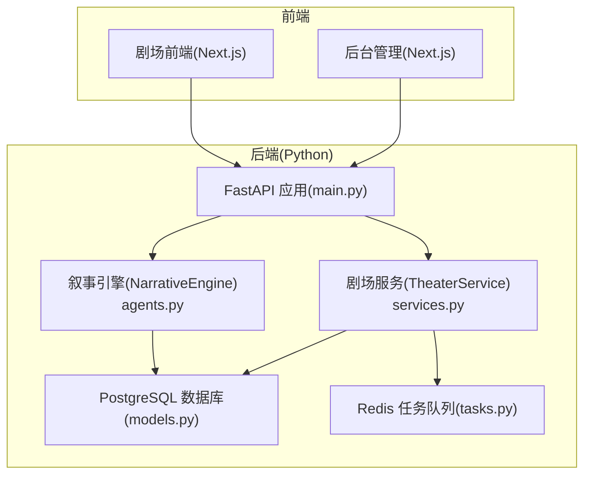
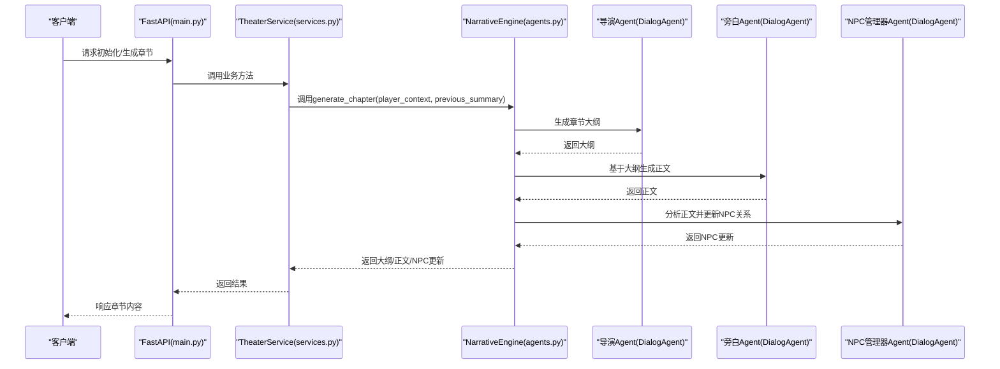
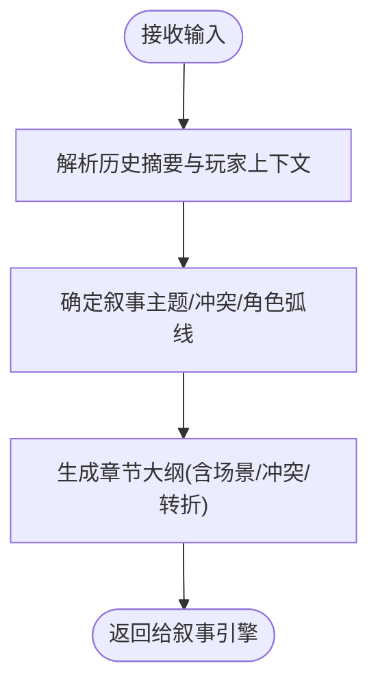
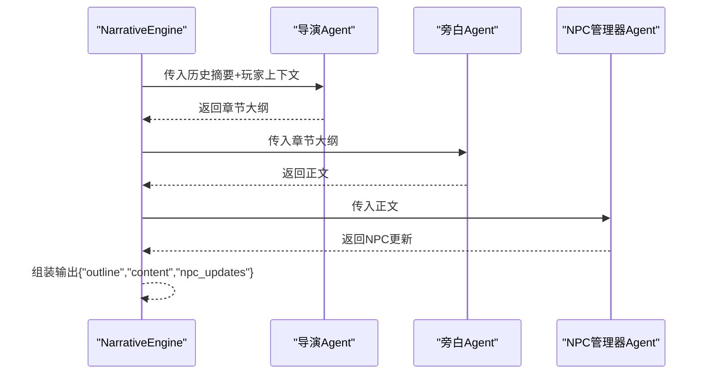
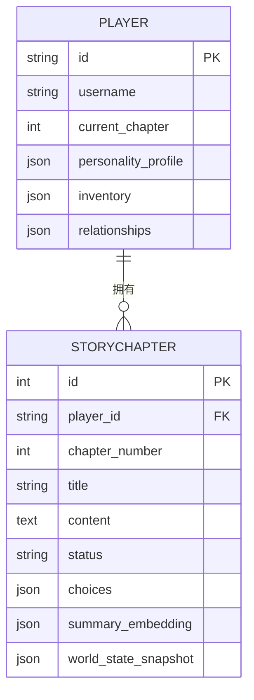
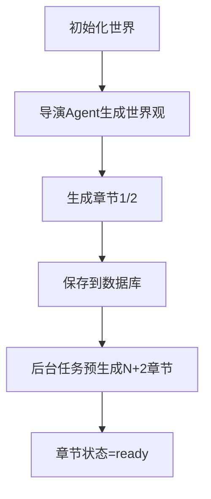
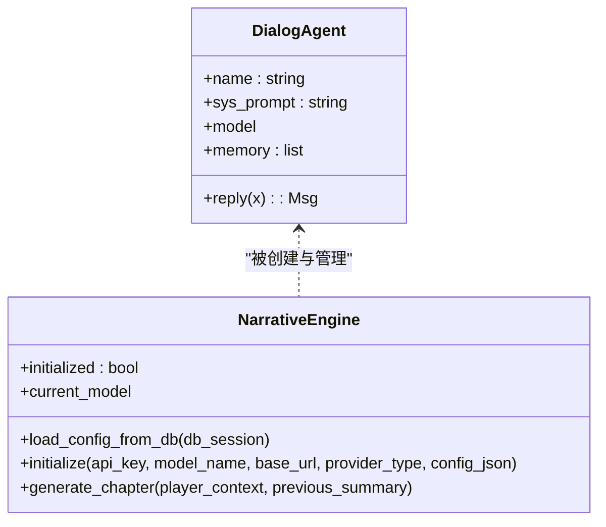
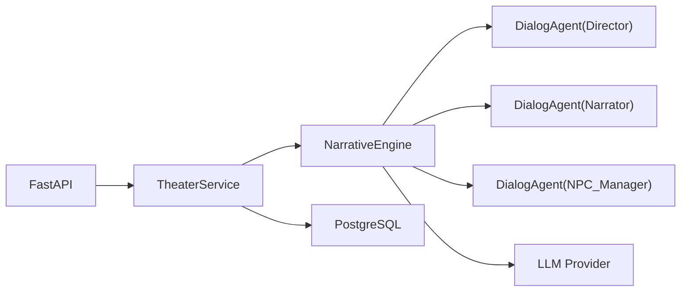

# 导演Agent

<cite>
**本文档引用的文件**
- [agents.py](file://backend/agents.py)
- [models.py](file://backend/models.py)
- [schemas.py](file://backend/schemas.py)
- [services.py](file://backend/services.py)
- [tasks.py](file://backend/tasks.py)
- [main.py](file://backend/main.py)
- [config.py](file://backend/config.py)
- [routers/agents.py](file://backend/routers/agents.py)
- [migrations/versions/82e927e1cf80_add_agent_model.py](file://backend/migrations/versions/82e927e1cf80_add_agent_model.py)
- [migrations/versions/f1580ee10d5e_add_chat_models.py](file://backend/migrations/versions/f1580ee10d5e_add_chat_models.py)
- [docs/wiki/Architecture.md](file://docs/wiki/Architecture.md)
</cite>

## 目录
1. [简介](#简介)
2. [项目结构](#项目结构)
3. [核心组件](#核心组件)
4. [架构总览](#架构总览)
5. [详细组件分析](#详细组件分析)
6. [依赖关系分析](#依赖关系分析)
7. [性能考虑](#性能考虑)
8. [故障排除指南](#故障排除指南)
9. [结论](#结论)
10. [附录](#附录)

## 简介
本文件面向导演Agent的使用者与维护者，系统性阐述导演Agent在叙事统筹中的核心职责、工作原理与实现细节。重点包括：
- 系统提示词设计：如何通过角色定位与目标约束驱动高质量叙事产出
- 剧情大纲生成算法：导演Agent如何结合玩家上下文与历史摘要生成连贯章节大纲
- 一致性保证机制：如何通过NPC关系更新与世界状态快照维持故事一致性
- 上下文分析与章节生成：如何解析玩家上下文并生成章节内容
- 协调机制与决策流程：导演Agent与旁白Agent、NPC管理器Agent之间的协作与冲突解决
- 参数调优、性能优化与调试技巧
- 实际使用场景与配置示例

## 项目结构
后端采用FastAPI + AgentScope + PostgreSQL + Redis的全栈架构，导演Agent位于叙事引擎中，负责统筹章节大纲与一致性校验。

图表来源
- [main.py](file://backend/main.py#L83-L98)
- [agents.py](file://backend/agents.py#L43-L195)
- [services.py](file://backend/services.py#L8-L65)
- [tasks.py](file://backend/tasks.py#L1-L61)
- [models.py](file://backend/models.py#L9-L122)

章节来源
- [main.py](file://backend/main.py#L83-L98)
- [docs/wiki/Architecture.md](file://docs/wiki/Architecture.md#L1-L62)

## 核心组件
- 导演Agent(DialogAgent)：负责根据玩家上下文与历史摘要生成章节大纲，确保叙事方向与目标一致
- 旁白Agent：基于导演的大纲生成沉浸式文本，强调感官细节与角色情感
- NPC管理器Agent：跟踪玩家与NPC的关系变化，决定NPC反应与后续互动
- 叙事引擎(NarrativeEngine)：统一管理模型初始化、Agent实例化与章节生成流水线
- 剧场服务(TheaterService)：对外提供世界构建、章节初始化与选择处理等业务能力
- 数据模型：Player、StoryChapter、LLMProvider等，支撑玩家状态、章节内容与LLM配置

章节来源
- [agents.py](file://backend/agents.py#L11-L195)
- [models.py](file://backend/models.py#L9-L122)
- [services.py](file://backend/services.py#L8-L65)

## 架构总览
导演Agent在整体架构中的位置与交互如下：

图表来源
- [main.py](file://backend/main.py#L147-L155)
- [services.py](file://backend/services.py#L19-L59)
- [agents.py](file://backend/agents.py#L154-L191)

## 详细组件分析

### 导演Agent系统提示词设计
- 角色定位：导演是交互式故事的叙事统筹者，目标是引导叙事方向、确保一致性与可读性
- 输入要素：历史摘要(previous_summary)与玩家上下文(player_context)，用于生成连贯的大纲
- 输出产物：章节大纲，作为旁白Agent的输入，同时驱动NPC关系更新

图表来源
- [agents.py](file://backend/agents.py#L166-L172)

章节来源
- [agents.py](file://backend/agents.py#L132-L148)
- [agents.py](file://backend/agents.py#L166-L172)

### 剧情大纲生成算法
- 初始化与懒加载：若未初始化，优先从数据库加载活跃LLM提供商；若无可用提供商则返回错误提示
- 流水线执行：
  1) 导演Agent生成章节大纲
  2) 旁白Agent基于大纲生成正文
  3) NPC管理器Agent分析正文并更新NPC关系
- 输出结构：包含大纲、正文与NPC更新，便于落库与后续资产生成

图表来源
- [agents.py](file://backend/agents.py#L154-L191)

章节来源
- [agents.py](file://backend/agents.py#L154-L191)

### 一致性保证机制
- 世界状态快照：章节表包含world_state_snapshot字段，用于记录NPC更新等世界状态
- 偏离检测：架构文档提出“基于向量相似度的偏离检测模块”，用于一致性校验（当前实现预留字段）
- NPC关系追踪：玩家模型包含relationships字段，用于记录与NPC的亲密度、信任度等

图表来源
- [models.py](file://backend/models.py#L9-L44)

章节来源
- [models.py](file://backend/models.py#L9-L44)
- [docs/wiki/Architecture.md](file://docs/wiki/Architecture.md#L40-L44)

### 玩家上下文分析与章节生成
- 上下文注入：导演Agent在系统提示词中明确要求“结合玩家上下文”生成大纲
- 世界构建：剧场服务通过导演Agent生成世界观，再生成初始章节
- 预生成策略：后台任务按N+2策略预生成下一章，提升响应速度

图表来源
- [services.py](file://backend/services.py#L19-L59)
- [tasks.py](file://backend/tasks.py#L7-L55)

章节来源
- [services.py](file://backend/services.py#L19-L59)
- [tasks.py](file://backend/tasks.py#L7-L55)

### 导演Agent与其他智能体的协调机制
- 协作模式：导演→旁白→NPC管理器的顺序流水线，确保“先定大纲，再写正文，最后更新关系”
- 冲突解决：当前实现中NPC更新为模拟阶段；建议在真实场景中引入“冲突检测与回滚”机制（例如对NPC反应进行评分与阈值判定）

图表来源
- [agents.py](file://backend/agents.py#L11-L42)
- [agents.py](file://backend/agents.py#L43-L195)

章节来源
- [agents.py](file://backend/agents.py#L11-L195)

### 决策流程与参数调优
- 温度系数与上下文窗口：可通过LLM提供商配置与Agent模型参数进行调节，以平衡创造性与稳定性
- 动态配置：支持运行时切换LLM提供商，便于A/B测试不同模型的效果
- 调优建议：
  - 导演Agent：适度降低温度，增强一致性
  - 旁白Agent：适度提高温度，增强描述性与情感色彩
  - NPC管理器：保持稳定温度，确保关系变化符合逻辑

章节来源
- [schemas.py](file://backend/schemas.py#L43-L73)
- [routers/agents.py](file://backend/routers/agents.py#L15-L55)
- [agents.py](file://backend/agents.py#L101-L129)

### 性能优化与调试技巧
- 异步化：所有LLM调用与数据库操作均采用异步，避免阻塞
- 预生成：通过后台任务提前生成下一章，减少实时等待
- 缓存与去重：资产生成采用MD5去重与LRU淘汰策略（架构文档提及）
- 调试要点：
  - 启动时加载LLM配置失败的降级处理
  - 未配置活跃提供商时的错误提示
  - WebSocket与后台任务的日志级别控制

章节来源
- [main.py](file://backend/main.py#L75-L80)
- [agents.py](file://backend/agents.py#L66-L75)
- [docs/wiki/Architecture.md](file://docs/wiki/Architecture.md#L46-L49)

## 依赖关系分析
- 导演Agent依赖NarrativeEngine完成模型初始化与消息编排
- NarrativeEngine依赖LLM提供商配置，支持OpenAI与DashScope等
- TheaterService依赖NarrativeEngine进行世界构建与章节生成
- 数据模型支撑玩家状态、章节内容与LLM配置

图表来源
- [agents.py](file://backend/agents.py#L131-L195)
- [services.py](file://backend/services.py#L8-L65)
- [models.py](file://backend/models.py#L58-L78)

章节来源
- [agents.py](file://backend/agents.py#L131-L195)
- [services.py](file://backend/services.py#L8-L65)
- [models.py](file://backend/models.py#L58-L78)

## 性能考虑
- 异步I/O：LLM调用与数据库访问均采用异步，避免主线程阻塞
- 预生成策略：通过Redis队列异步生成下一章，降低首屏延迟
- 模型选择：根据场景需求选择合适模型，平衡成本与质量
- 日志与监控：精细化日志级别，避免生产环境噪声

## 故障排除指南
- 未配置活跃LLM提供商
  - 现象：章节生成返回错误提示
  - 处理：在后台管理界面配置并启用一个LLM提供商
- LLM初始化失败
  - 现象：启动时打印警告或异常
  - 处理：检查API密钥、基础URL与模型名称是否正确
- 导航Agent路由校验失败
  - 现象：创建/更新Agent时报模型不可用
  - 处理：确认Agent所选模型存在于LLM提供商的模型列表中

章节来源
- [agents.py](file://backend/agents.py#L66-L75)
- [agents.py](file://backend/agents.py#L159-L164)
- [routers/agents.py](file://backend/routers/agents.py#L41-L49)

## 结论
导演Agent作为叙事引擎的核心，通过系统化的提示词设计与严格的流水线协作，实现了从大纲到正文再到NPC关系的一致性产出。配合预生成策略与动态LLM配置，系统在可扩展性与性能上具备良好基础。建议在后续版本中完善NPC冲突检测与回滚机制，并进一步强化一致性校验模块。

## 附录

### 使用场景与配置示例
- 场景一：初始化世界与章节
  - 步骤：创建玩家 → 调用故事初始化接口 → 后台任务生成章节1/2
  - 参考路径：[services.py](file://backend/services.py#L19-L59)
- 场景二：章节预生成
  - 步骤：后台任务检测下一章是否存在 → 不存在则生成并保存
  - 参考路径：[tasks.py](file://backend/tasks.py#L7-L55)
- 场景三：LLM提供商配置
  - 步骤：在后台管理界面新增/编辑LLM提供商 → 设置API密钥与模型列表
  - 参考路径：[routers/agents.py](file://backend/routers/agents.py#L15-L55)

### 数据模型与迁移
- Agent模型与聊天会话模型迁移脚本
  - 参考路径：
    - [migrations/versions/82e927e1cf80_add_agent_model.py](file://backend/migrations/versions/82e927e1cf80_add_agent_model.py#L21-L43)
    - [migrations/versions/f1580ee10d5e_add_chat_models.py](file://backend/migrations/versions/f1580ee10d5e_add_chat_models.py#L21-L48)