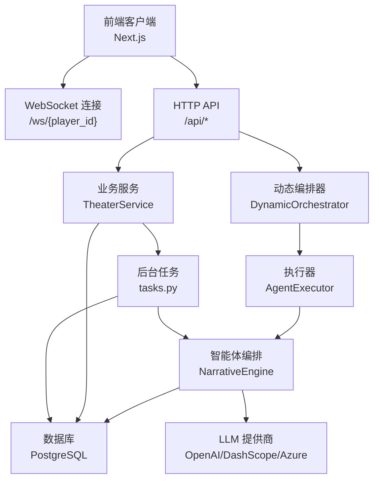
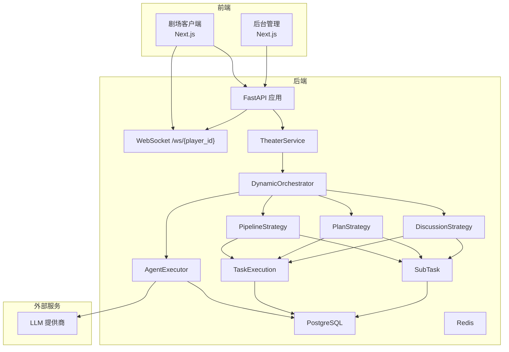
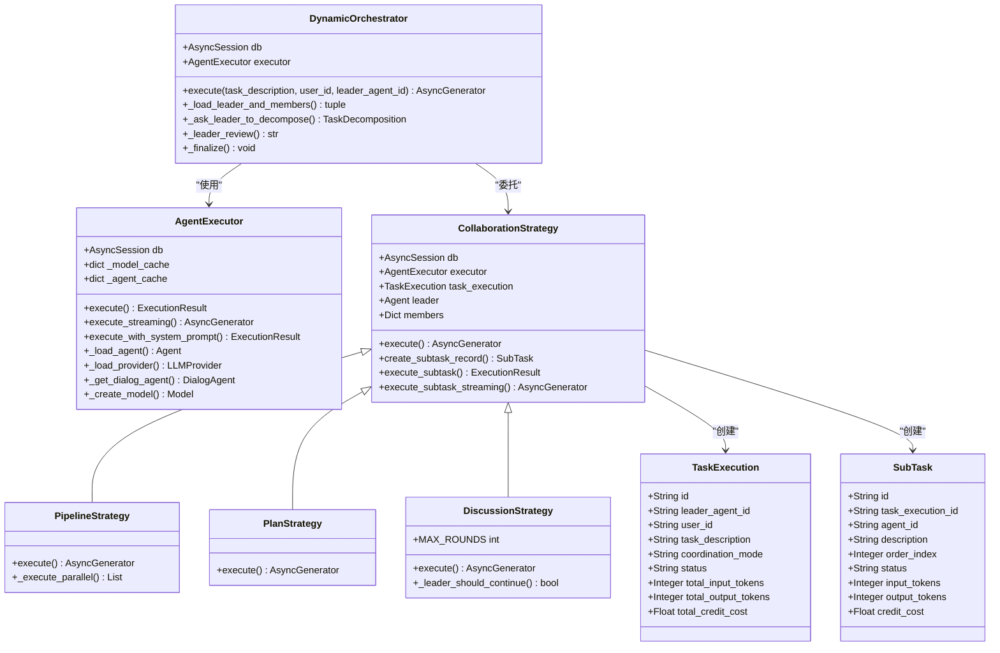
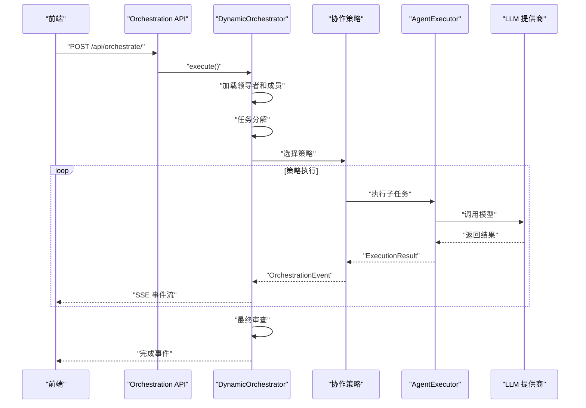
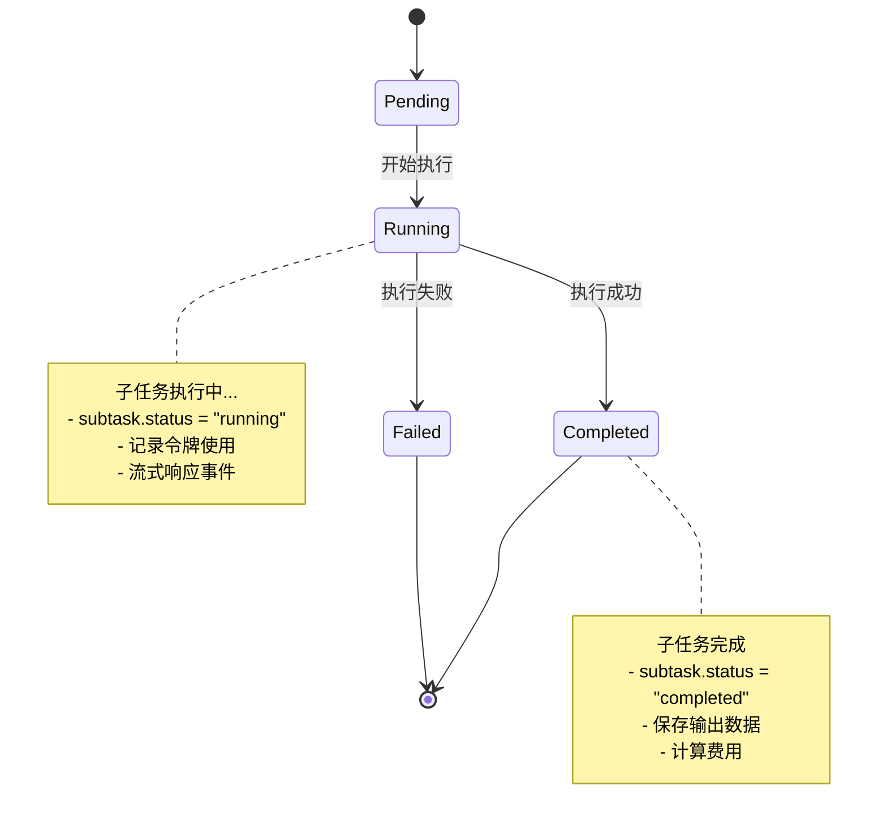
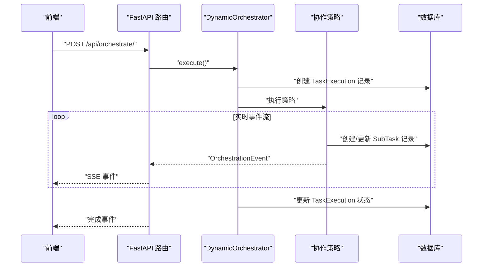
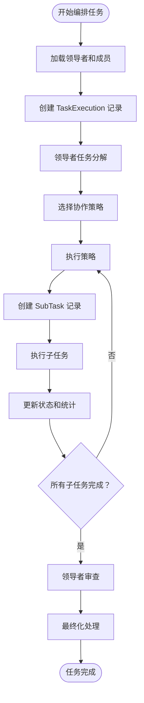
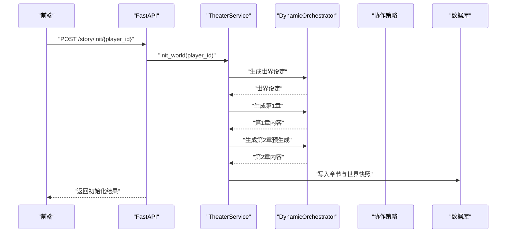
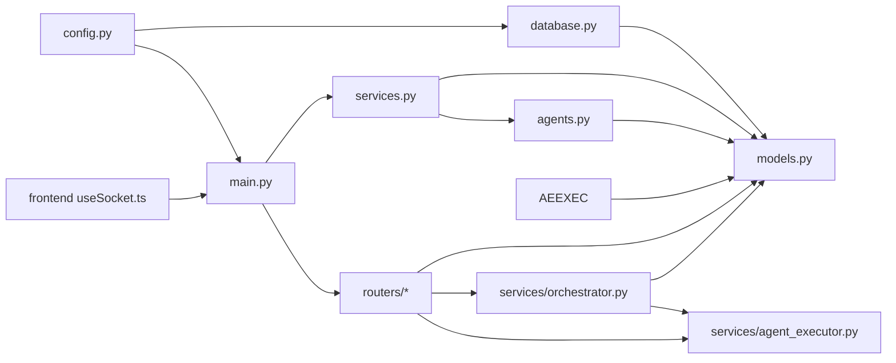

# 智能体协作机制

<cite>
**本文引用的文件**
- [backend/services/orchestrator.py](file://backend/services/orchestrator.py)
- [backend/services/agent_executor.py](file://backend/services/agent_executor.py)
- [backend/routers/orchestrate.py](file://backend/routers/orchestrate.py)
- [backend/models.py](file://backend/models.py)
- [backend/schemas.py](file://backend/schemas.py)
- [backend/main.py](file://backend/main.py)
- [backend/agents.py](file://backend/agents.py)
- [backend/services.py](file://backend/services.py)
- [backend/tasks.py](file://backend/tasks.py)
- [backend/database.py](file://backend/database.py)
- [backend/config.py](file://backend/config.py)
- [backend/routers/agents.py](file://backend/routers/agents.py)
- [backend/routers/chats.py](file://backend/routers/chats.py)
- [backend/routers/admin.py](file://backend/routers/admin.py)
- [frontend/src/hooks/useSocket.ts](file://frontend/src/hooks/useSocket.ts)
- [docs/wiki/Architecture.md](file://docs/wiki/Architecture.md)
- [docs/wiki/Backend-Guide.md](file://docs/wiki/Backend-Guide.md)
- [README.md](file://README.md)
</cite>

## 更新摘要
**变更内容**
- 新增DynamicOrchestrator主协调器服务，实现智能体协作框架
- 新增AgentExecutor统一执行器，支持多种LLM提供商
- 新增TaskExecution和SubTask任务跟踪系统
- 支持管道、计划、讨论三种协作模式
- 新增完整的多智能体协作API路由系统
- 增强实时流式响应和事件通知机制

## 目录
1. [引言](#引言)
2. [项目结构](#项目结构)
3. [核心组件](#核心组件)
4. [架构总览](#架构总览)
5. [详细组件分析](#详细组件分析)
6. [依赖关系分析](#依赖关系分析)
7. [性能考量](#性能考量)
8. [故障排查指南](#故障排查指南)
9. [结论](#结论)
10. [附录](#附录)

## 引言
本文件围绕"智能体协作机制"展开，聚焦多智能体之间的通信协议、消息传递格式、状态同步策略；深入描述协作工作流程、任务分配与结果整合；阐述冲突检测、解决方案与一致性保证；解释异步协作、并发控制与错误恢复；并给出性能优化、负载均衡与监控告警建议，以及调试技巧与最佳实践。

**更新** 本版本新增了DynamicOrchestrator主协调器和AgentExecutor统一执行器，实现了完整的多智能体协作框架，支持管道、计划、讨论三种协作模式，并提供了完善的任务跟踪和实时流式响应机制。

## 项目结构
后端采用 FastAPI + AgentScope + SQLAlchemy 异步 ORM 架构，前端使用 Next.js，提供 WebSocket 实时推送与聊天流式响应能力。系统通过后台管理接口实现 LLM 供应商的动态配置与切换，支撑叙事引擎的多智能体协作。

**图表来源**
- [backend/main.py](file://backend/main.py#L157-L169)
- [backend/services/orchestrator.py](file://backend/services/orchestrator.py#L560-L568)
- [backend/services/agent_executor.py](file://backend/services/agent_executor.py#L62-L72)
- [backend/tasks.py](file://backend/tasks.py#L7-L55)
- [backend/agents.py](file://backend/agents.py#L43-L196)
- [backend/database.py](file://backend/database.py#L1-L31)

**章节来源**
- [README.md](file://README.md#L1-L141)
- [docs/wiki/Architecture.md](file://docs/wiki/Architecture.md#L1-L62)
- [docs/wiki/Backend-Guide.md](file://docs/wiki/Backend-Guide.md#L1-L108)

## 核心组件
- **动态编排器(DynamicOrchestrator)**：主协调器，负责加载领导者智能体及其成员，协调任务分解和执行策略。
- **智能体执行器(AgentExecutor)**：统一执行器，封装DialogAgent调用，提供一致的接口用于编排。
- **协作策略(CollaborationStrategy)**：抽象基类，定义三种协作模式的具体实现。
- **管道策略(PipelineStrategy)**：顺序流水线执行，支持串行和并行两种模式。
- **计划策略(PlanStrategy)**：基于依赖图的任务计划执行，支持动态调整。
- **讨论策略(DiscussionStrategy)**：多轮讨论模式，领导者主持成员间的深度交流。
- **任务执行(TaskExecution)**：任务执行记录，跟踪整个协作过程的状态。
- **子任务(SubTask)**：子任务记录，跟踪每个智能体的执行状态和结果。
- **OrchestrationEvent**：事件系统，提供实时流式响应和状态通知。

**更新** 新增了完整的多智能体协作框架，包括主协调器、统一执行器和任务跟踪系统。

**章节来源**
- [backend/services/orchestrator.py](file://backend/services/orchestrator.py#L560-L671)
- [backend/services/agent_executor.py](file://backend/services/agent_executor.py#L62-L206)
- [backend/models.py](file://backend/models.py#L235-L282)
- [backend/schemas.py](file://backend/schemas.py#L338-L384)

## 架构总览
系统以 AgentScope 为核心，通过 FastAPI 提供 API 与 WebSocket，结合 PostgreSQL 与 Redis（环境变量中定义）实现数据持久化与任务队列。后台管理接口允许动态切换 LLM 提供商，确保运行时一致性与可运维性。

**图表来源**
- [docs/wiki/Architecture.md](file://docs/wiki/Architecture.md#L7-L36)
- [backend/main.py](file://backend/main.py#L157-L169)
- [backend/services/orchestrator.py](file://backend/services/orchestrator.py#L560-L671)
- [backend/services/agent_executor.py](file://backend/services/agent_executor.py#L62-L206)
- [backend/tasks.py](file://backend/tasks.py#L7-L55)
- [backend/agents.py](file://backend/agents.py#L43-L196)
- [backend/config.py](file://backend/config.py#L18-L20)

## 详细组件分析

### 动态编排器与多智能体协作
- **初始化与配置加载**：从数据库读取领导者智能体及其成员配置，验证领导者身份和成员可用性。
- **任务分解**：领导者智能体分析用户需求，生成任务分解方案，支持三种协作模式的选择。
- **策略执行**：根据分解结果选择合适的协作策略执行，支持实时流式响应。
- **结果整合**：收集所有子任务结果，进行最终审查和整合。

**图表来源**
- [backend/services/orchestrator.py](file://backend/services/orchestrator.py#L560-L671)
- [backend/services/agent_executor.py](file://backend/services/agent_executor.py#L62-L206)
- [backend/models.py](file://backend/models.py#L235-L282)

**章节来源**
- [backend/services/orchestrator.py](file://backend/services/orchestrator.py#L560-L671)
- [backend/services/agent_executor.py](file://backend/services/agent_executor.py#L62-L206)

### 协作策略与执行模式
- **管道策略(Pipeline)**：支持顺序流水线和并行流水线两种模式，适合线性任务处理。
- **计划策略(Plan)**：基于依赖图的任务计划执行，支持动态依赖关系和并行执行。
- **讨论策略(Discussion)**：多轮讨论模式，领导者主持成员间的深度交流和观点碰撞。

**图表来源**
- [backend/services/orchestrator.py](file://backend/services/orchestrator.py#L570-L671)
- [backend/routers/orchestrate.py](file://backend/routers/orchestrate.py#L26-L70)

**章节来源**
- [backend/services/orchestrator.py](file://backend/services/orchestrator.py#L254-L530)
- [backend/routers/orchestrate.py](file://backend/routers/orchestrate.py#L26-L70)

### 任务跟踪与状态管理
- **TaskExecution**：跟踪整个多智能体任务的生命周期，包括状态、令牌使用量、费用统计等。
- **SubTask**：跟踪每个子任务的执行状态，包括输入输出数据、令牌使用、重试次数等。
- **事件系统**：提供实时流式事件通知，支持任务开始、子任务创建、执行、完成、失败等各种状态。

**图表来源**
- [backend/models.py](file://backend/models.py#L235-L282)
- [backend/services/orchestrator.py](file://backend/services/orchestrator.py#L128-L161)

**章节来源**
- [backend/models.py](file://backend/models.py#L235-L282)
- [backend/services/orchestrator.py](file://backend/services/orchestrator.py#L110-L161)

### 通信协议与消息传递格式
- **WebSocket 协议**：客户端通过 /ws/{player_id} 建立连接，后端接受文本消息并回显，当前示例未实现具体叙事协议，但为后续扩展预留通道。
- **聊天流式响应**：/api/chats/{session_id}/messages 以流式方式返回 LLM 响应，支持 OpenAI/Azure 与 DashScope 的增量输出。
- **编排器流式响应**：/api/orchestrate/ 以 Server-Sent Events(SSE) 方式返回编排过程的实时状态。
- **消息格式约定**：
  - 角色：user、assistant、system
  - 内容：字符串或结构化 JSON（如选择分支、NPC 状态）
  - 上下文：历史消息数组，按时间升序排列
  - 控制字段：是否启用思考模式、温度、上下文窗口等

**图表来源**
- [backend/routers/orchestrate.py](file://backend/routers/orchestrate.py#L26-L70)
- [backend/services/orchestrator.py](file://backend/services/orchestrator.py#L570-L671)

**章节来源**
- [backend/routers/orchestrate.py](file://backend/routers/orchestrate.py#L26-L70)
- [backend/routers/chats.py](file://backend/routers/chats.py#L72-L258)
- [frontend/src/hooks/useSocket.ts](file://frontend/src/hooks/useSocket.ts#L1-L43)

### 状态同步与一致性保证
- **任务状态机**：使用 status 字段（pending/running/completed/failed）跟踪执行进度，避免重复执行与竞态。
- **原子操作**：使用 SQLAlchemy 异步会话确保数据库操作的原子性和一致性。
- **事件驱动**：通过 OrchestrationEvent 实现实时状态同步，前端可以监听所有状态变化。
- **令牌追踪**：自动追踪每个子任务的输入输出令牌使用量，用于费用计算和监控。

**图表来源**
- [backend/services/orchestrator.py](file://backend/services/orchestrator.py#L570-L671)
- [backend/models.py](file://backend/models.py#L235-L282)

**章节来源**
- [backend/services/orchestrator.py](file://backend/services/orchestrator.py#L570-L671)
- [backend/models.py](file://backend/models.py#L235-L282)

### 工作流程、任务分配与结果整合
- **初始化流程**：创建玩家 → 生成世界设定 → 生成第1章与第2章（预生成）。
- **交互流程**：处理玩家选择 → 更新玩家状态 → 检查一致性 → 触发下一章预生成。
- **编排流程**：用户请求 → 动态编排器分析 → 任务分解 → 策略执行 → 结果整合 → 费用结算。
- **结果整合**：章节内容、NPC 状态更新、资产元数据统一写入数据库。

**图表来源**
- [backend/services.py](file://backend/services.py#L19-L59)
- [backend/agents.py](file://backend/agents.py#L154-L191)

**章节来源**
- [backend/services.py](file://backend/services.py#L19-L59)

### 冲突检测、解决方案与一致性机制
- **冲突检测**：基于子任务输出的一致性检查，支持多轮讨论后的共识形成。
- **解决方案**：提供自动审查机制，领导者可以对多个子任务的结果进行综合评估。
- **一致性保证**：使用只读事务与快照隔离级别；在生成完成后一次性提交；对关键字段进行幂等更新。
- **错误恢复**：支持子任务级别的重试机制，记录错误信息并继续执行其他任务。

**章节来源**
- [backend/models.py](file://backend/models.py#L235-L282)
- [backend/services/orchestrator.py](file://backend/services/orchestrator.py#L156-L161)

### 异步协作、并发控制与错误恢复
- **异步协作**：FastAPI 异步路由 + SQLAlchemy 异步会话；后台任务通过独立函数异步生成章节。
- **并发控制**：编排器支持并行执行多个子任务，使用 asyncio.gather 实现高效的并发控制。
- **错误恢复**：编排器捕获异常并记录详细错误信息；支持任务取消和状态回滚。
- **流式响应**：使用 Server-Sent Events 提供实时状态更新，支持断线重连。

**章节来源**
- [backend/main.py](file://backend/main.py#L45-L81)
- [backend/routers/chats.py](file://backend/routers/chats.py#L211-L216)
- [backend/routers/orchestrate.py](file://backend/routers/orchestrate.py#L26-L70)
- [backend/database.py](file://backend/database.py#L1-L31)

### 性能优化、负载均衡与监控告警
- **性能优化**：
  - 使用连接池与预取策略（pool_pre_ping、pool_size、max_overflow）；
  - 采用 N+2 预生成降低前端等待时间；
  - 对长文本截断（如 content[:500]）控制上下文长度；
  - 智能体缓存减少重复初始化开销。
- **负载均衡**：多实例部署后端，共享数据库与 Redis；WebSocket 连接按玩家 ID 路由至不同实例时需考虑会话一致性。
- **监控告警**：记录输入/输出字符数、Token 使用量、响应耗时；对 LLM 调用失败率与超时进行告警。
- **成本控制**：自动追踪令牌使用量和费用，支持实时费用估算。

**章节来源**
- [backend/database.py](file://backend/database.py#L8-L23)
- [backend/tasks.py](file://backend/tasks.py#L37-L40)
- [backend/routers/chats.py](file://backend/routers/chats.py#L129-L234)
- [backend/services/agent_executor.py](file://backend/services/agent_executor.py#L276-L284)

### 调试技巧、故障排查与最佳实践
- **调试技巧**：
  - 启用详细日志（SQLAlchemy、uvicorn.access 已做降噪）；
  - 使用后台管理接口查看统计数据与玩家/剧情列表；
  - 通过 WebSocket 发送最小化消息验证链路；
  - 监听 SSE 事件流进行实时调试。
- **故障排查**：
  - LLM 配置错误：检查 LLMProvider 是否激活、模型是否在提供商列表中；
  - 数据库连接失败：确认 DATABASE_URL、Alembic 迁移成功；
  - 编排器执行失败：检查领导者智能体配置和成员可用性；
  - 流式响应中断：检查网络连接和 SSE 配置。
- **最佳实践**：
  - 将系统提示与参数（temperature、context_window）纳入模型配置；
  - 对外部调用增加超时与重试策略；
  - 对敏感字段（如 api_key）使用加密存储或环境变量注入；
  - 合理设置最大子任务数量和迭代次数。

**章节来源**
- [backend/routers/agents.py](file://backend/routers/agents.py#L22-L50)
- [backend/main.py](file://backend/main.py#L45-L81)
- [backend/routers/chats.py](file://backend/routers/chats.py#L144-L209)
- [backend/routers/orchestrate.py](file://backend/routers/orchestrate.py#L148-L183)

## 依赖关系分析

**图表来源**
- [backend/config.py](file://backend/config.py#L1-L34)
- [backend/database.py](file://backend/database.py#L1-L31)
- [backend/models.py](file://backend/models.py#L1-L122)
- [backend/main.py](file://backend/main.py#L30-L43)
- [backend/services.py](file://backend/services.py#L1-L7)
- [backend/agents.py](file://backend/agents.py#L1-L10)
- [backend/services/orchestrator.py](file://backend/services/orchestrator.py#L1-L22)
- [backend/services/agent_executor.py](file://backend/services/agent_executor.py#L1-L17)
- [frontend/src/hooks/useSocket.ts](file://frontend/src/hooks/useSocket.ts#L1-L43)

**章节来源**
- [backend/config.py](file://backend/config.py#L1-L34)
- [backend/database.py](file://backend/database.py#L1-L31)
- [backend/models.py](file://backend/models.py#L1-L122)
- [backend/main.py](file://backend/main.py#L30-L43)
- [backend/services.py](file://backend/services.py#L1-L7)
- [backend/agents.py](file://backend/agents.py#L1-L10)
- [backend/services/orchestrator.py](file://backend/services/orchestrator.py#L1-L22)
- [backend/services/agent_executor.py](file://backend/services/agent_executor.py#L1-L17)
- [frontend/src/hooks/useSocket.ts](file://frontend/src/hooks/useSocket.ts#L1-L43)

## 性能考量
- **I/O 密集优化**：异步数据库与 LLM 调用，避免阻塞事件循环。
- **缓存与去重**：利用 Redis 缓存会话状态与资产，结合内容哈希去重。
- **上下文控制**：限制历史消息长度与摘要截断，控制 Token 使用。
- **并发与限流**：对 LLM 调用增加速率限制与排队策略，防止突发流量压垮上游。
- **智能体缓存**：AgentExecutor 缓存智能体实例和模型实例，减少初始化开销。
- **流式处理**：使用 SSE 实时传输事件，避免长时间阻塞连接。

## 故障排查指南
- **启动阶段**：
  - 数据库连接失败：检查 DATABASE_URL 与 Alembic 迁移是否成功。
  - LLM 配置缺失：确认 LLMProvider 表存在激活项。
  - 编排器初始化失败：检查领导者智能体配置和成员可用性。
- **运行阶段**：
  - 聊天流式响应异常：核对 provider_type 与 API Key；检查网络与代理设置。
  - 编排器流式响应异常：检查 SSE 配置和网络连接。
  - WebSocket 断开：确认客户端连接 URL 与 player_id；查看后端日志。
- **维护阶段**：
  - 统计数据异常：检查 /api/admin/stats 接口权限与数据库连接。
  - 任务执行异常：检查 TaskExecution 和 SubTask 的状态和错误信息。

**章节来源**
- [backend/main.py](file://backend/main.py#L45-L81)
- [backend/routers/chats.py](file://backend/routers/chats.py#L144-L209)
- [backend/routers/orchestrate.py](file://backend/routers/orchestrate.py#L148-L183)
- [backend/routers/admin.py](file://backend/routers/admin.py#L16-L31)

## 结论
本系统以 AgentScope 为内核，结合 FastAPI 的异步能力与 PostgreSQL/Redis 的数据持久化，实现了完整的多智能体协作框架。通过 DynamicOrchestrator 主协调器、AgentExecutor 统一执行器、TaskExecution 和 SubTask 任务跟踪系统，以及三种协作模式（管道、计划、讨论），系统能够灵活处理各种复杂的多智能体协作场景。

系统支持实时流式响应、事件驱动的状态同步、完整的任务跟踪和费用控制，为大规模并发和复杂叙事场景提供了坚实的技术基础。建议在现有基础上进一步完善监控告警、限流策略和错误恢复机制，以支撑更大规模的部署和更复杂的业务需求。

## 附录
- **API 接口概览**：
  - 编排器 API：/api/orchestrate/（POST 获取流式响应，GET 获取任务详情，DELETE 取消任务）
  - 剧场 API：创建玩家、初始化故事、WebSocket。
  - 管理 API：系统统计、玩家与剧情列表、删除玩家。
  - LLM 配置 API：提供商增删改查与连接测试。
- **数据模型要点**：
  - Player：用户名、当前章节、行为画像、物品栏、NPC 关系矩阵。
  - StoryChapter：章节号、标题、内容、状态、选择分支、摘要向量、世界快照。
  - Asset：类型、内容哈希、URL、提示词、最后访问时间。
  - LLMProvider：名称、类型、API Key、基础地址、模型列表、标签、激活/默认标志、额外配置。
  - **TaskExecution**：任务执行记录，跟踪领导者、用户、会话、描述、模式、状态、统计信息。
  - **SubTask**：子任务记录，跟踪描述、索引、状态、输入输出数据、令牌使用、费用。
- **协作模式说明**：
  - **管道模式**：适合线性任务处理，支持串行和并行两种执行方式。
  - **计划模式**：适合有依赖关系的复杂任务，支持动态依赖图和并行执行。
  - **讨论模式**：适合需要多智能体深度交流的场景，支持多轮讨论和共识形成。

**章节来源**
- [docs/wiki/Backend-Guide.md](file://docs/wiki/Backend-Guide.md#L83-L101)
- [backend/models.py](file://backend/models.py#L9-L122)
- [backend/models.py](file://backend/models.py#L235-L282)
- [backend/schemas.py](file://backend/schemas.py#L338-L384)
- [backend/routers/orchestrate.py](file://backend/routers/orchestrate.py#L26-L183)