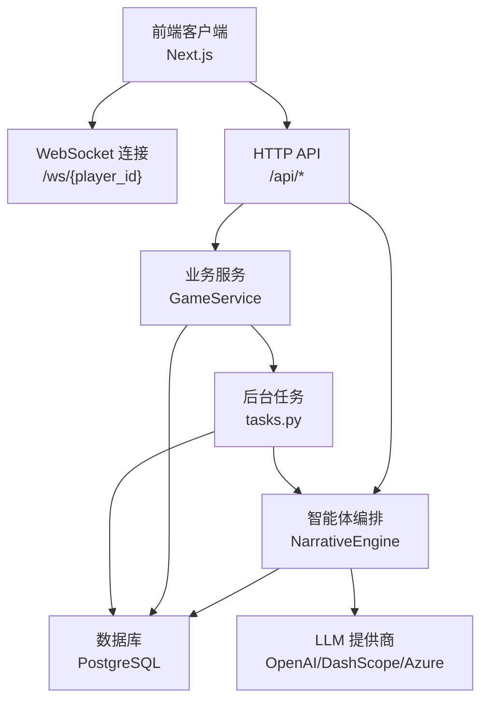
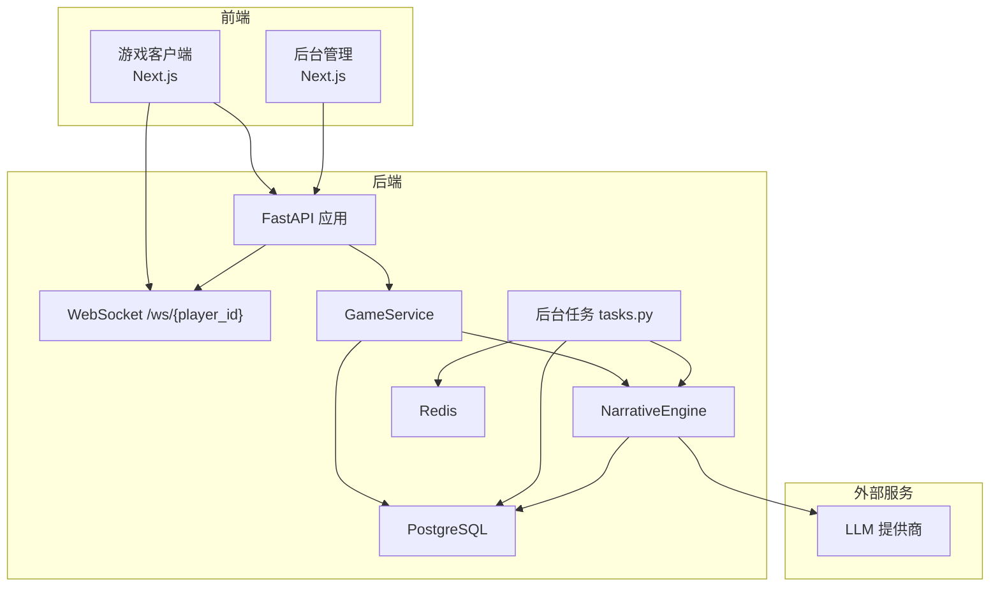
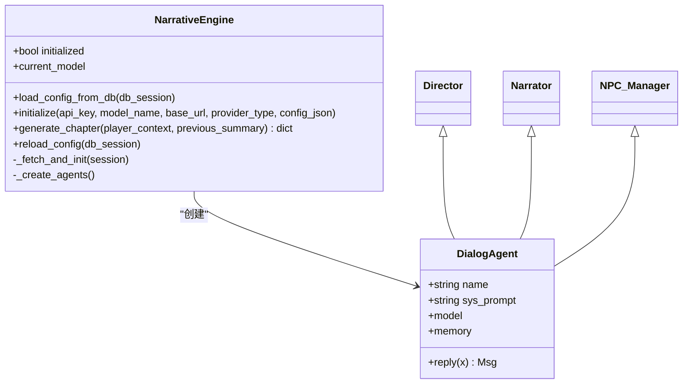
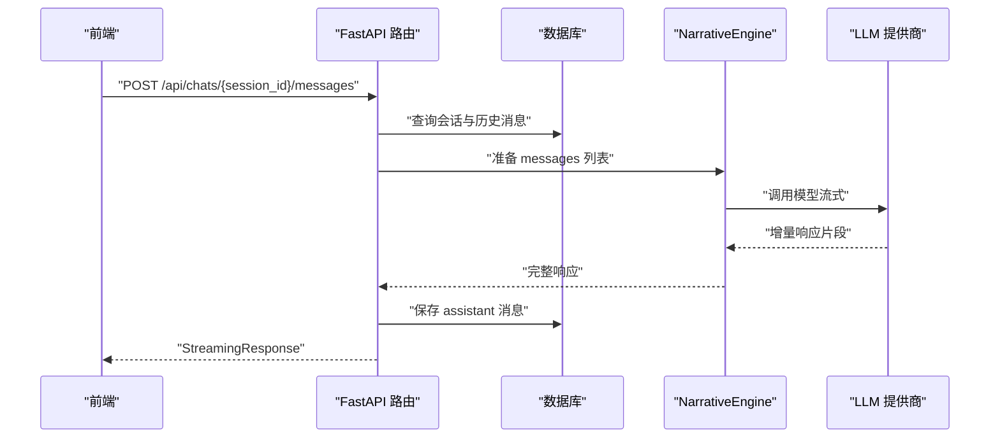
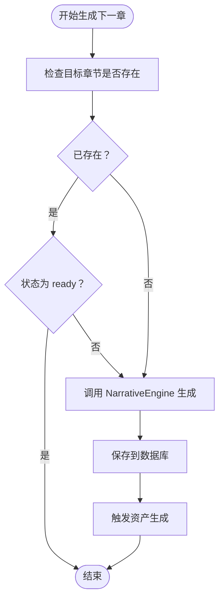
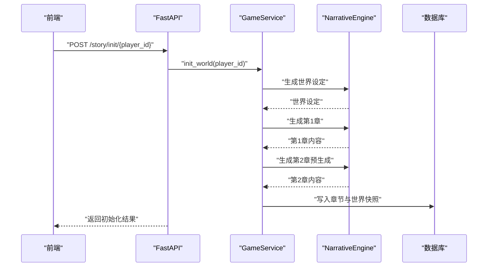
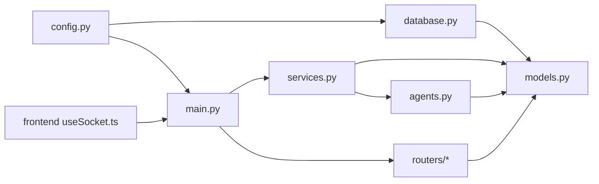

# 智能体协作机制

<cite>
**本文引用的文件**
- [backend/main.py](file://backend/main.py)
- [backend/agents.py](file://backend/agents.py)
- [backend/services.py](file://backend/services.py)
- [backend/tasks.py](file://backend/tasks.py)
- [backend/models.py](file://backend/models.py)
- [backend/database.py](file://backend/database.py)
- [backend/config.py](file://backend/config.py)
- [backend/schemas.py](file://backend/schemas.py)
- [backend/routers/agents.py](file://backend/routers/agents.py)
- [backend/routers/chats.py](file://backend/routers/chats.py)
- [backend/routers/admin.py](file://backend/routers/admin.py)
- [frontend/src/hooks/useSocket.ts](file://frontend/src/hooks/useSocket.ts)
- [docs/wiki/Architecture.md](file://docs/wiki/Architecture.md)
- [docs/wiki/Backend-Guide.md](file://docs/wiki/Backend-Guide.md)
- [README.md](file://README.md)
</cite>

## 目录
1. [引言](#引言)
2. [项目结构](#项目结构)
3. [核心组件](#核心组件)
4. [架构总览](#架构总览)
5. [详细组件分析](#详细组件分析)
6. [依赖关系分析](#依赖关系分析)
7. [性能考量](#性能考量)
8. [故障排查指南](#故障排查指南)
9. [结论](#结论)
10. [附录](#附录)

## 引言
本文件围绕“智能体协作机制”展开，聚焦多智能体之间的通信协议、消息传递格式、状态同步策略；深入描述协作工作流程、任务分配与结果整合；阐述冲突检测、解决方案与一致性保证；解释异步协作、并发控制与错误恢复；并给出性能优化、负载均衡与监控告警建议，以及调试技巧与最佳实践。

## 项目结构
后端采用 FastAPI + AgentScope + SQLAlchemy 异步 ORM 架构，前端使用 Next.js，提供 WebSocket 实时推送与聊天流式响应能力。系统通过后台管理接口实现 LLM 供应商的动态配置与切换，支撑叙事引擎的多智能体协作。

图表来源
- [backend/main.py](file://backend/main.py#L157-L169)
- [backend/services.py](file://backend/services.py#L19-L59)
- [backend/tasks.py](file://backend/tasks.py#L7-L55)
- [backend/agents.py](file://backend/agents.py#L43-L196)
- [backend/database.py](file://backend/database.py#L1-L31)

章节来源
- [README.md](file://README.md#L1-L141)
- [docs/wiki/Architecture.md](file://docs/wiki/Architecture.md#L1-L62)
- [docs/wiki/Backend-Guide.md](file://docs/wiki/Backend-Guide.md#L1-L108)

## 核心组件
- 叙事引擎（NarrativeEngine）：负责加载 LLM 配置、创建多智能体（导演、旁白、NPC 管理器），协调生成章节内容与 NPC 状态更新。
- 游戏服务（GameService）：封装玩家创建、世界初始化、章节生成与一致性检查入口。
- 后台任务（tasks.py）：实现 N+2 预生成策略，异步生成下一章并触发资产生成。
- 数据模型（models.py）：定义玩家、章节、资产、LLM 提供商、聊天会话与消息等实体。
- 路由层（routers/*）：提供管理、聊天、智能体配置等 API。
- 前端钩子（useSocket.ts）：建立 WebSocket 连接，处理消息收发。

章节来源
- [backend/agents.py](file://backend/agents.py#L43-L196)
- [backend/services.py](file://backend/services.py#L8-L66)
- [backend/tasks.py](file://backend/tasks.py#L1-L62)
- [backend/models.py](file://backend/models.py#L9-L122)
- [backend/routers/agents.py](file://backend/routers/agents.py#L1-L141)
- [backend/routers/chats.py](file://backend/routers/chats.py#L1-L275)
- [backend/routers/admin.py](file://backend/routers/admin.py#L1-L112)
- [frontend/src/hooks/useSocket.ts](file://frontend/src/hooks/useSocket.ts#L1-L43)

## 架构总览
系统以 AgentScope 为核心，通过 FastAPI 提供 API 与 WebSocket，结合 PostgreSQL 与 Redis（环境变量中定义）实现数据持久化与任务队列。后台管理接口允许动态切换 LLM 提供商，确保运行时一致性与可运维性。

图表来源
- [docs/wiki/Architecture.md](file://docs/wiki/Architecture.md#L7-L36)
- [backend/main.py](file://backend/main.py#L157-L169)
- [backend/services.py](file://backend/services.py#L19-L59)
- [backend/tasks.py](file://backend/tasks.py#L7-L55)
- [backend/agents.py](file://backend/agents.py#L43-L196)
- [backend/config.py](file://backend/config.py#L18-L20)

## 详细组件分析

### 叙事引擎与多智能体协作
- 初始化与配置加载：从数据库读取当前激活的 LLM 提供商，解析模型列表，初始化 AgentScope 的对话模型（OpenAI 或 DashScope），并创建导演、旁白、NPC 管理器三个智能体。
- 章节生成流水线：
  1) 导演根据上一章摘要与玩家上下文生成大纲；
  2) 旁白基于大纲扩展为详细文本；
  3) NPC 管理器分析故事并更新 NPC 关系状态。
- 动态重载：支持通过 API 触发配置重载，无需重启服务。

图表来源
- [backend/agents.py](file://backend/agents.py#L43-L196)

章节来源
- [backend/agents.py](file://backend/agents.py#L43-L196)

### 通信协议与消息传递格式
- WebSocket 协议：客户端通过 /ws/{player_id} 建立连接，后端接受文本消息并回显，当前示例未实现具体叙事协议，但为后续扩展预留通道。
- 聊天流式响应：/api/chats/{session_id}/messages 以流式方式返回 LLM 响应，支持 OpenAI/Azure 与 DashScope 的增量输出。
- 消息格式约定（建议）：
  - 角色：user、assistant、system
  - 内容：字符串或结构化 JSON（如选择分支、NPC 状态）
  - 上下文：历史消息数组，按时间升序排列
  - 控制字段：是否启用思考模式、温度、上下文窗口等

图表来源
- [backend/routers/chats.py](file://backend/routers/chats.py#L72-L258)
- [backend/agents.py](file://backend/agents.py#L19-L41)

章节来源
- [backend/routers/chats.py](file://backend/routers/chats.py#L72-L258)
- [frontend/src/hooks/useSocket.ts](file://frontend/src/hooks/useSocket.ts#L1-L43)

### 状态同步与一致性保证
- 章节状态：使用 status 字段（pending/generating/ready/completed）跟踪生成进度，避免重复生成与竞态。
- 世界状态快照：world_state_snapshot 记录 NPC 更新等状态，用于后续章节一致性校验。
- 一致性检测（建议）：基于章节摘要向量（summary_embedding）计算相似度，若偏离阈值触发回滚或修正流程。
- 并发控制：后台任务在生成下一章前检查目标章节是否存在且状态为 ready，防止并发重复生成。

图表来源
- [backend/tasks.py](file://backend/tasks.py#L7-L55)

章节来源
- [backend/tasks.py](file://backend/tasks.py#L7-L55)
- [backend/models.py](file://backend/models.py#L24-L44)

### 工作流程、任务分配与结果整合
- 初始化流程：创建玩家 → 生成世界设定 → 生成第1章与第2章（预生成）。
- 交互流程：处理玩家选择 → 更新玩家状态 → 检查一致性 → 触发下一章预生成。
- 结果整合：章节内容、NPC 状态更新、资产元数据统一写入数据库。

图表来源
- [backend/services.py](file://backend/services.py#L19-L59)
- [backend/agents.py](file://backend/agents.py#L154-L191)

章节来源
- [backend/services.py](file://backend/services.py#L19-L59)

### 冲突检测、解决方案与一致性机制
- 冲突检测（建议实现）：
  - 基于 embedding 的相似度阈值判断章节一致性；
  - 对比 NPC 关系变化是否符合剧情逻辑；
  - 对玩家选择与章节内容的语义一致性进行评分。
- 解决方案：
  - 回滚至上一稳定章节，重新生成；
  - 调整智能体系统提示或温度参数；
  - 引入“剧情仲裁者”智能体对分歧进行裁决。
- 一致性保证：
  - 使用只读事务与快照隔离级别；
  - 在生成完成后一次性提交；
  - 对关键字段（如 status、world_state_snapshot）进行幂等更新。

章节来源
- [backend/models.py](file://backend/models.py#L24-L44)
- [backend/tasks.py](file://backend/tasks.py#L7-L55)

### 异步协作、并发控制与错误恢复
- 异步协作：FastAPI 异步路由 + SQLAlchemy 异步会话；后台任务通过独立函数异步生成章节。
- 并发控制：预生成任务在写入前检查目标章节状态，避免重复生成；数据库连接池与事务边界控制并发。
- 错误恢复：聊天流式响应捕获异常并记录日志；WebSocket 连接异常时关闭并释放资源；启动阶段数据库迁移失败自动重试。

章节来源
- [backend/main.py](file://backend/main.py#L45-L81)
- [backend/routers/chats.py](file://backend/routers/chats.py#L211-L216)
- [backend/database.py](file://backend/database.py#L1-L31)

### 性能优化、负载均衡与监控告警
- 性能优化：
  - 使用连接池与预取策略（pool_pre_ping、pool_size、max_overflow）；
  - 采用 N+2 预生成降低前端等待时间；
  - 对长文本截断（如 content[:500]）控制上下文长度。
- 负载均衡：多实例部署后端，共享数据库与 Redis；WebSocket 连接按玩家 ID 路由至不同实例时需考虑会话一致性。
- 监控告警：记录输入/输出字符数、Token 使用量、响应耗时；对 LLM 调用失败率与超时进行告警。

章节来源
- [backend/database.py](file://backend/database.py#L8-L23)
- [backend/tasks.py](file://backend/tasks.py#L37-L40)
- [backend/routers/chats.py](file://backend/routers/chats.py#L129-L234)

### 调试技巧、故障排查与最佳实践
- 调试技巧：
  - 启用详细日志（SQLAlchemy、uvicorn.access 已做降噪）；
  - 使用后台管理接口查看统计数据与玩家/剧情列表；
  - 通过 WebSocket 发送最小化消息验证链路。
- 故障排查：
  - LLM 配置错误：检查 LLMProvider 是否激活、模型是否在提供商列表中；
  - 数据库连接失败：确认 DATABASE_URL、Alembic 迁移成功；
  - 聊天流式响应中断：检查 provider_type 与 API Key 配置。
- 最佳实践：
  - 将系统提示与参数（temperature、context_window）纳入模型配置；
  - 对外部调用增加超时与重试策略；
  - 对敏感字段（如 api_key）使用加密存储或环境变量注入。

章节来源
- [backend/routers/agents.py](file://backend/routers/agents.py#L22-L50)
- [backend/main.py](file://backend/main.py#L45-L81)
- [backend/routers/chats.py](file://backend/routers/chats.py#L144-L209)

## 依赖关系分析

图表来源
- [backend/config.py](file://backend/config.py#L1-L34)
- [backend/database.py](file://backend/database.py#L1-L31)
- [backend/models.py](file://backend/models.py#L1-L122)
- [backend/main.py](file://backend/main.py#L30-L43)
- [backend/services.py](file://backend/services.py#L1-L7)
- [backend/agents.py](file://backend/agents.py#L1-L10)
- [frontend/src/hooks/useSocket.ts](file://frontend/src/hooks/useSocket.ts#L1-L43)

章节来源
- [backend/config.py](file://backend/config.py#L1-L34)
- [backend/database.py](file://backend/database.py#L1-L31)
- [backend/models.py](file://backend/models.py#L1-L122)
- [backend/main.py](file://backend/main.py#L30-L43)
- [backend/services.py](file://backend/services.py#L1-L7)
- [backend/agents.py](file://backend/agents.py#L1-L10)
- [frontend/src/hooks/useSocket.ts](file://frontend/src/hooks/useSocket.ts#L1-L43)

## 性能考量
- I/O 密集优化：异步数据库与 LLM 调用，避免阻塞事件循环。
- 缓存与去重：利用 Redis 缓存会话状态与资产，结合内容哈希去重。
- 上下文控制：限制历史消息长度与摘要截断，控制 Token 使用。
- 并发与限流：对 LLM 调用增加速率限制与排队策略，防止突发流量压垮上游。

## 故障排查指南
- 启动阶段：
  - 数据库连接失败：检查 DATABASE_URL 与 Alembic 迁移是否成功。
  - LLM 配置缺失：确认 LLMProvider 表存在激活项。
- 运行阶段：
  - 聊天流式响应异常：核对 provider_type 与 API Key；检查网络与代理设置。
  - WebSocket 断开：确认客户端连接 URL 与 player_id；查看后端日志。
- 维护阶段：
  - 统计数据异常：检查 /api/admin/stats 接口权限与数据库连接。

章节来源
- [backend/main.py](file://backend/main.py#L45-L81)
- [backend/routers/chats.py](file://backend/routers/chats.py#L144-L209)
- [backend/routers/admin.py](file://backend/routers/admin.py#L16-L31)

## 结论
本系统以 AgentScope 为内核，结合 FastAPI 的异步能力与 PostgreSQL/Redis 的数据持久化，实现了多智能体协作驱动的动态叙事。通过 N+2 预生成、状态机与一致性检测机制，保障了用户体验与内容质量。建议在现有基础上进一步完善冲突检测、监控告警与限流策略，以支撑更大规模的并发与更复杂的叙事场景。

## 附录
- API 接口概览（来自后端开发指南）：
  - 游戏 API：创建玩家、初始化故事、WebSocket。
  - 管理 API：系统统计、玩家与剧情列表、删除玩家。
  - LLM 配置 API：提供商增删改查与连接测试。
- 数据模型要点：
  - Player：用户名、当前章节、行为画像、物品栏、NPC 关系矩阵。
  - StoryChapter：章节号、标题、内容、状态、选择分支、摘要向量、世界快照。
  - Asset：类型、内容哈希、URL、提示词、最后访问时间。
  - LLMProvider：名称、类型、API Key、基础地址、模型列表、标签、激活/默认标志、额外配置。

章节来源
- [docs/wiki/Backend-Guide.md](file://docs/wiki/Backend-Guide.md#L83-L101)
- [backend/models.py](file://backend/models.py#L9-L122)