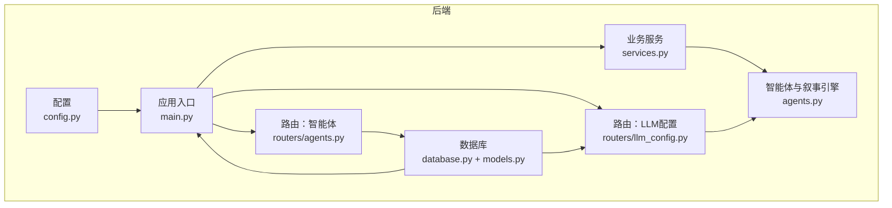
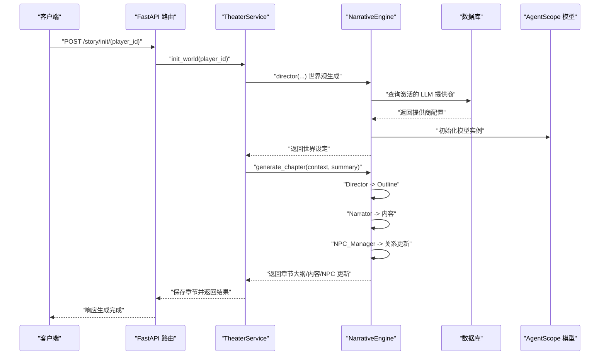
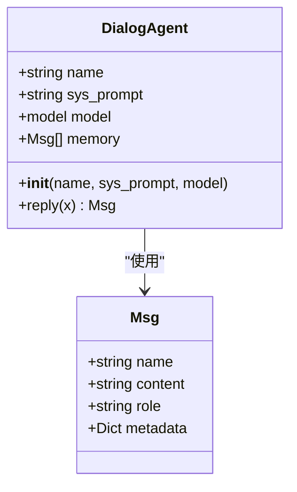
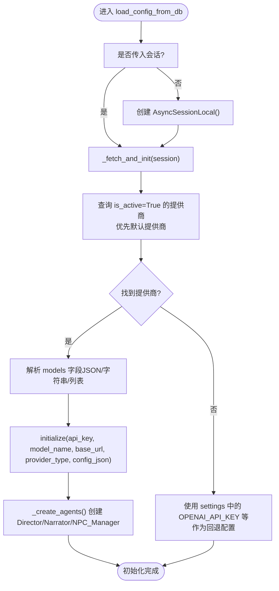
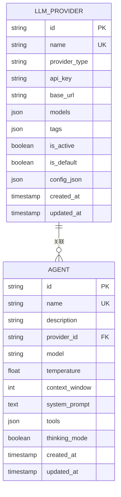
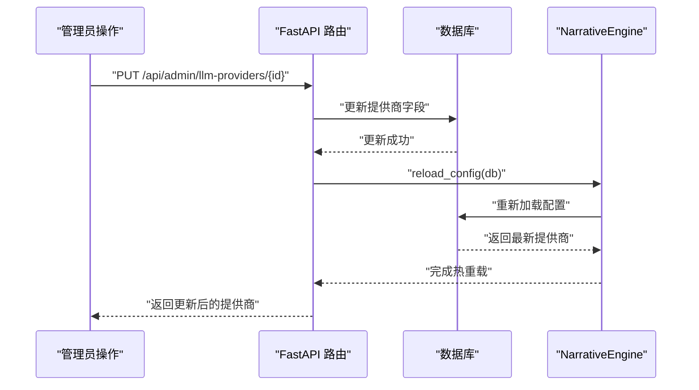
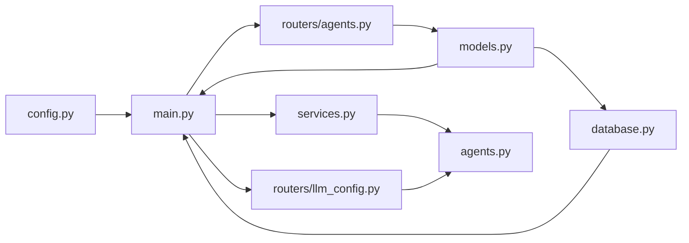

# 智能体架构设计

<cite>
**本文引用的文件**
- [backend/agents.py](file://backend/agents.py)
- [backend/models.py](file://backend/models.py)
- [backend/main.py](file://backend/main.py)
- [backend/config.py](file://backend/config.py)
- [backend/services.py](file://backend/services.py)
- [backend/routers/agents.py](file://backend/routers/agents.py)
- [backend/routers/llm_config.py](file://backend/routers/llm_config.py)
- [backend/database.py](file://backend/database.py)
- [backend/schemas.py](file://backend/schemas.py)
- [backend/migrations/versions/82e927e1cf80_add_agent_model.py](file://backend/migrations/versions/82e927e1cf80_add_agent_model.py)
- [backend/migrations/versions/a3b8c9d0e1f2_convert_ids_to_uuid.py](file://backend/migrations/versions/a3b8c9d0e1f2_convert_ids_to_uuid.py)
- [backend/services/agent_executor.py](file://backend/services/agent_executor.py)
- [backend/services/llm_stream.py](file://backend/services/llm_stream.py)
- [README.md](file://README.md)
</cite>

## 更新摘要
**变更内容**
- 更新智能体消息格式化逻辑，增强xAI兼容性处理
- 移除不必要的调试日志，优化日志记录策略
- 改进DialogAgent的响应处理机制，增加消息格式化器支持
- 增强多提供商兼容性，支持更多LLM服务提供商

## 目录
1. [引言](#引言)
2. [项目结构](#项目结构)
3. [核心组件](#核心组件)
4. [架构总览](#架构总览)
5. [详细组件分析](#详细组件分析)
6. [依赖关系分析](#依赖关系分析)
7. [性能考量](#性能考量)
8. [故障排查指南](#故障排查指南)
9. [结论](#结论)
10. [附录](#附录)

## 引言
本技术文档围绕基于 AgentScope 的智能体框架进行系统化设计说明，重点覆盖以下方面：
- 基于 AgentScope 的智能体框架设计原理与架构取舍
- DialogAgent 基类的实现细节、继承体系与消息传递协议
- 智能体初始化流程、内存管理机制与消息上下文组织
- 配置加载机制：从数据库动态加载 LLM 配置、API 密钥管理与模型选择策略
- 生命周期管理、状态持久化与错误处理机制
- 扩展指南、自定义 Agent 开发与集成最佳实践
- 提供具体代码示例路径与配置模板指引

该系统以 FastAPI 作为后端入口，结合 SQLAlchemy 异步 ORM 与 Alembic 迁移工具，构建可动态切换 LLM 提供商的叙事引擎，支撑"无限剧情"剧场的动态世界生成与交互。

## 项目结构
后端采用分层与按功能模块划分的组织方式：
- 配置层：读取环境变量与默认参数，统一管理数据库与外部服务地址
- 数据访问层：定义 ORM 模型、异步引擎与会话工厂
- 业务服务层：封装剧场世界初始化、章节生成等业务逻辑
- 路由层：提供管理员与智能体相关的 REST 接口
- 智能体层：基于 AgentScope 的对话智能体与叙事引擎

**图表来源**
- [backend/main.py](file://backend/main.py#L30-L98)
- [backend/database.py](file://backend/database.py#L1-L31)
- [backend/models.py](file://backend/models.py#L1-L122)
- [backend/services.py](file://backend/services.py#L1-L66)
- [backend/routers/agents.py](file://backend/routers/agents.py#L1-L141)
- [backend/routers/llm_config.py](file://backend/routers/llm_config.py#L1-L203)
- [backend/agents.py](file://backend/agents.py#L1-L196)

**章节来源**
- [README.md](file://README.md#L34-L51)
- [backend/main.py](file://backend/main.py#L30-L98)

## 核心组件
- DialogAgent：继承自 AgentScope 的 AgentBase，负责对话与记忆管理，遵循"system/user/assistant"的角色映射规则，将历史消息序列化为模型输入。**更新**：增强了xAI兼容性处理，支持特殊的消息格式化需求。
- NarrativeEngine：负责从数据库加载 LLM 提供商配置，动态初始化 AgentScope 模型实例，并创建一组内置智能体（导演、叙述者、NPC 管理员），协调多智能体流水线生成章节内容。
- LLMProvider：数据库模型，存储提供商名称、类型、API 密钥、基础 URL、可用模型列表、标签、是否激活/默认以及额外配置 JSON。
- Agent：数据库模型，用于记录智能体的名称、描述、关联提供商、具体模型、温度、上下文窗口、系统提示词、工具集与思考模式等。
- TheaterService：业务服务层，负责玩家创建、世界初始化与章节生成，调用 NarrativeEngine 完成故事生成。
- FastAPI 路由：提供 LLM 提供商的增删改查、连接测试，以及智能体的增删改查接口；在更新/新增提供商时触发配置热重载。

**章节来源**
- [backend/agents.py](file://backend/agents.py#L11-L196)
- [backend/models.py](file://backend/models.py#L58-L122)
- [backend/services.py](file://backend/services.py#L8-L66)
- [backend/routers/llm_config.py](file://backend/routers/llm_config.py#L1-L203)
- [backend/routers/agents.py](file://backend/routers/agents.py#L1-L141)

## 架构总览
下图展示从请求到智能体生成章节内容的端到端流程，包括数据库查询、模型初始化与多智能体协作。

**图表来源**
- [backend/services.py](file://backend/services.py#L19-L59)
- [backend/agents.py](file://backend/agents.py#L49-L191)
- [backend/routers/llm_config.py](file://backend/routers/llm_config.py#L112-L138)
- [backend/database.py](file://backend/database.py#L1-L31)

## 详细组件分析

### DialogAgent 组件分析
DialogAgent 是智能体的核心基类，负责：
- 初始化：接收名称、系统提示词与模型实例，维护本地 memory 列表
- 消息回复：将传入消息与历史记忆转换为符合模型输入的消息数组，调用模型生成响应，提取文本内容，写回记忆并返回新消息对象
- **更新**：增强xAI兼容性处理，对非用户消息去除name字段，确保符合xAI API规范

**图表来源**
- [backend/agents.py](file://backend/agents.py#L35-L108)

**章节来源**
- [backend/agents.py](file://backend/agents.py#L35-L108)

### NarrativeEngine 组件分析
NarrativeEngine 负责：
- 配置加载：从数据库查询激活的 LLM 提供商，解析模型列表与额外配置，初始化 AgentScope 模型实例
- 模型选择：根据提供商类型选择 DashScope 或 OpenAI（兼容）模型，支持自定义 base_url
- 智能体创建：在初始化完成后创建内置的 Director、Narrator、NPC_Manager 三个 DialogAgent 实例
- 章节生成：按流水线顺序驱动多智能体协作，产出章节大纲、正文与 NPC 关系更新
- **更新**：增强xAI兼容性处理，支持xAI提供商的特殊base_url配置

**图表来源**
- [backend/agents.py](file://backend/agents.py#L116-L231)

**章节来源**
- [backend/agents.py](file://backend/agents.py#L110-L322)

### LLMProvider 与 Agent 数据模型
- LLMProvider：存储提供商元信息、认证凭据、模型清单、标签、启用状态与默认标记，以及额外配置 JSON
- Agent：记录智能体的系统提示词、温度、上下文窗口、工具集与思考模式等参数，并与 LLMProvider 建立外键关联

**图表来源**
- [backend/models.py](file://backend/models.py#L58-L122)

**章节来源**
- [backend/models.py](file://backend/models.py#L58-L122)

### FastAPI 路由与生命周期
- 应用生命周期：在 lifespan 中执行数据库迁移与 LLM 配置加载，保证服务启动时具备可用的智能体模型
- LLM 提供商管理：提供创建、查询、更新、删除与连接测试接口；更新/新增时若提供商处于激活状态则触发配置热重载
- 智能体管理：提供智能体的创建、查询、更新、删除接口，校验提供商与模型的匹配关系
- **更新**：增强xAI兼容性处理，支持xAI提供商的连接测试

**图表来源**
- [backend/main.py](file://backend/main.py#L45-L82)
- [backend/routers/llm_config.py](file://backend/routers/llm_config.py#L160-L188)

**章节来源**
- [backend/main.py](file://backend/main.py#L45-L82)
- [backend/routers/llm_config.py](file://backend/routers/llm_config.py#L112-L188)
- [backend/routers/agents.py](file://backend/routers/agents.py#L15-L126)

### 智能体生命周期与状态持久化
- 初始化：应用启动时尝试从数据库加载 LLM 配置；若无可用配置，可回退至环境变量中的默认值
- 运行期：NarrativeEngine 在初始化后创建多个 DialogAgent 实例，每个智能体维护自身 memory 列表，作为对话上下文
- 章节生成：TheaterService 调用 NarrativeEngine 的流水线生成章节内容，并将结果持久化到 StoryChapter 表
- 状态管理：玩家状态（如当前章节、关系矩阵）存储在 Player 表中；章节状态与摘要向量用于一致性校验
- **更新**：增强xAI兼容性处理，支持特殊的消息格式化需求

**章节来源**
- [backend/agents.py](file://backend/agents.py#L110-L322)
- [backend/services.py](file://backend/services.py#L19-L59)
- [backend/models.py](file://backend/models.py#L9-L44)

### 错误处理与健壮性
- 配置缺失：当数据库中没有激活的提供商时，打印警告并尝试使用环境变量中的默认配置
- 模型初始化异常：捕获初始化过程中的异常并打印错误信息，避免中断服务
- API 调用：在连接测试与智能体调用中使用协程判断与等待，确保异步调用正确完成
- 数据校验：在创建/更新智能体时严格校验提供商与模型的匹配关系，防止不合法配置生效
- **更新**：移除不必要的调试日志，优化日志记录策略，保留关键信息的日志输出

**章节来源**
- [backend/agents.py](file://backend/agents.py#L133-L227)
- [backend/routers/llm_config.py](file://backend/routers/llm_config.py#L81-L109)
- [backend/routers/agents.py](file://backend/routers/agents.py#L22-L50)

## 依赖关系分析
- 组件耦合
  - agents.py 依赖 agentscope 的 AgentBase 与 Msg，依赖 config.py 的 settings，依赖 models.py 的 LLMProvider 与 database.py 的 AsyncSessionLocal
  - services.py 依赖 agents.py 的 narrative_engine 与 agentscope.Msg
  - routers/* 依赖 models.py 与 schemas.py，间接依赖 database.py
- 外部依赖
  - AgentScope：提供智能体基类与模型封装
  - SQLAlchemy：异步 ORM 与 Alembic 迁移
  - FastAPI：REST API 与 WebSocket 支持
- 循环依赖
  - 当前模块间未见循环导入；路由层仅做数据校验与转发，不直接持有智能体实例

**图表来源**
- [backend/main.py](file://backend/main.py#L30-L98)
- [backend/database.py](file://backend/database.py#L1-L31)
- [backend/models.py](file://backend/models.py#L1-L122)
- [backend/routers/agents.py](file://backend/routers/agents.py#L1-L141)
- [backend/routers/llm_config.py](file://backend/routers/llm_config.py#L1-L203)
- [backend/services.py](file://backend/services.py#L1-L66)
- [backend/agents.py](file://backend/agents.py#L1-L196)

**章节来源**
- [backend/main.py](file://backend/main.py#L30-L98)
- [backend/agents.py](file://backend/agents.py#L1-L196)

## 性能考量
- 异步 I/O：数据库与模型调用均采用异步模式，降低阻塞风险
- 连接池：SQLAlchemy 异步连接池参数合理配置，提升并发能力
- 模型初始化：仅在配置变更或首次启动时初始化，避免重复开销
- 上下文管理：DialogAgent 的 memory 仅保存必要历史，避免过长上下文导致性能下降
- **更新**：增强xAI兼容性处理，优化消息格式化性能
- 建议
  - 对长上下文进行截断或摘要化处理
  - 使用缓存（如 Redis）存储常用配置与中间结果
  - 将重型任务放入后台任务队列，避免阻塞主请求

## 故障排查指南
- 启动阶段无法加载 LLM 配置
  - 检查数据库中是否存在激活且默认的 LLM 提供商
  - 若数据库为空，确认 .env 中是否配置了 OPENAI_API_KEY 等回退参数
- 连接测试失败
  - 确认 provider_type、base_url、api_key、model 与 config_json 是否正确
  - 查看连接测试接口返回的错误信息
- 智能体生成章节报错
  - 确认 NarrativeEngine 已完成初始化
  - 检查各智能体的系统提示词与模型可用性
- 数据库迁移问题
  - 使用 Alembic 升级 head 并检查日志
  - 确保数据库连接参数正确
- **更新**：xAI兼容性问题
  - 确认xAI提供商的base_url配置为"https://api.x.ai/v1"
  - 检查消息格式化过程中name字段的处理逻辑

**章节来源**
- [backend/agents.py](file://backend/agents.py#L133-L227)
- [backend/routers/llm_config.py](file://backend/routers/llm_config.py#L81-L109)
- [backend/main.py](file://backend/main.py#L45-L82)

## 结论
本项目以 AgentScope 为核心，结合 FastAPI、SQLAlchemy 与 Alembic，构建了可动态配置、可扩展的智能体叙事引擎。通过 LLMProvider 的集中管理与热重载机制，实现了对多种 LLM 提供商的无缝切换；通过 DialogAgent 的消息上下文与多智能体协作，完成了从世界观到章节内容的自动化生成。

**更新**：本次更新增强了xAI兼容性处理，改进了消息格式化逻辑，移除了不必要的调试日志，优化了日志记录策略。这些改进提升了系统的稳定性和兼容性，特别是在处理不同LLM提供商的特殊要求时表现更加出色。

建议在生产环境中进一步完善缓存策略、上下文截断与可观测性指标，以提升稳定性与性能。

## 附录

### 配置模板与示例路径
- 环境变量模板（.env）
  - 参考路径：[backend/.env.example](file://backend/.env.example)
  - 关键项：DATABASE_URL、REDIS_URL、OPENAI_API_KEY、STORY_GENERATION_MODEL 等
- LLM 提供商创建（POST /api/admin/llm-providers）
  - 请求体字段：name、provider_type、api_key、base_url、models、tags、is_active、is_default、config_json
  - 示例路径：[backend/routers/llm_config.py](file://backend/routers/llm_config.py#L112-L138)
- 连接测试（POST /api/admin/llm-providers/test-connection）
  - 请求体字段：provider_type、api_key、base_url、model、config_json
  - 示例路径：[backend/routers/llm_config.py](file://backend/routers/llm_config.py#L81-L109)
- 智能体创建（POST /api/agents）
  - 请求体字段：name、description、provider_id、model、temperature、context_window、system_prompt、tools、thinking_mode
  - 示例路径：[backend/routers/agents.py](file://backend/routers/agents.py#L15-L55)
- 应用启动与生命周期
  - 示例路径：[backend/main.py](file://backend/main.py#L45-L82)

### 数据库迁移与模型演进
- 新增 Agent 模型迁移
  - 示例路径：[backend/migrations/versions/82e927e1cf80_add_agent_model.py](file://backend/migrations/versions/82e927e1cf80_add_agent_model.py#L21-L43)
- ID 类型转换（整型转 UUID）
  - 示例路径：[backend/migrations/versions/a3b8c9d0e1f2_convert_ids_to_uuid.py](file://backend/migrations/versions/a3b8c9d0e1f2_convert_ids_to_uuid.py#L22-L221)

### xAI兼容性配置
- **新增**：xAI提供商支持
  - base_url：https://api.x.ai/v1
  - provider_type：xai
  - 模型名称：支持标准OpenAI兼容的模型名称
  - 特殊处理：消息格式化时对非用户消息去除name字段

**章节来源**
- [backend/agents.py](file://backend/agents.py#L178-L187)
- [backend/routers/llm_config.py](file://backend/routers/llm_config.py#L25-L30)
- [backend/services/agent_executor.py](file://backend/services/agent_executor.py#L53-L60)
- [backend/services/llm_stream.py](file://backend/services/llm_stream.py#L37-L42)