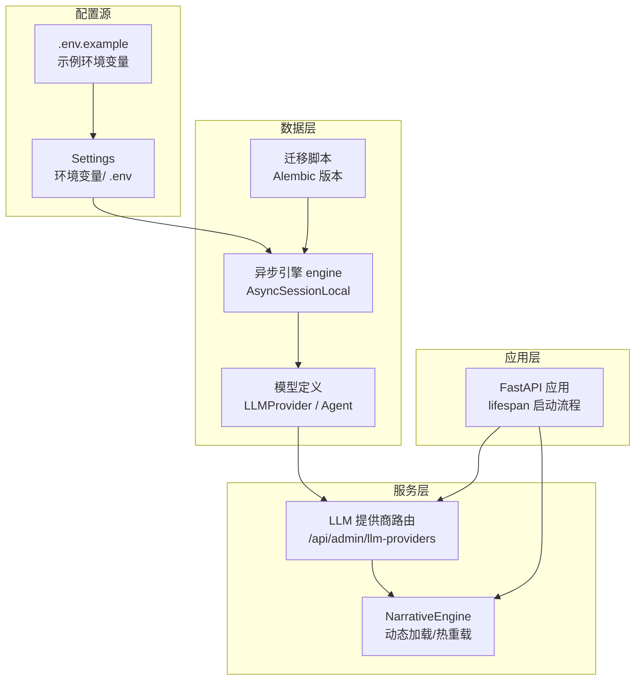
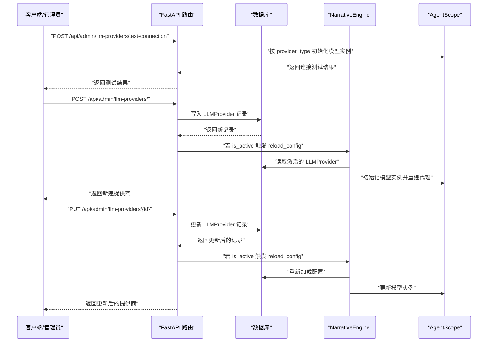
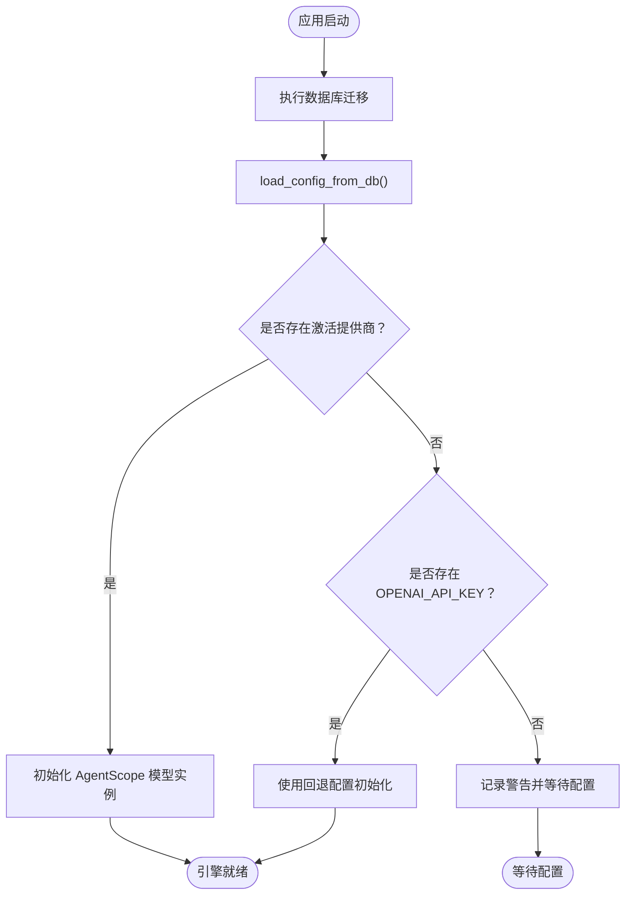
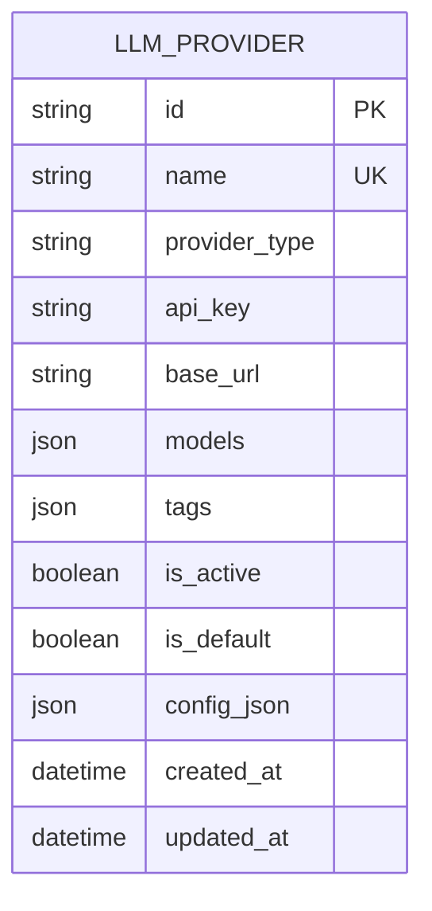
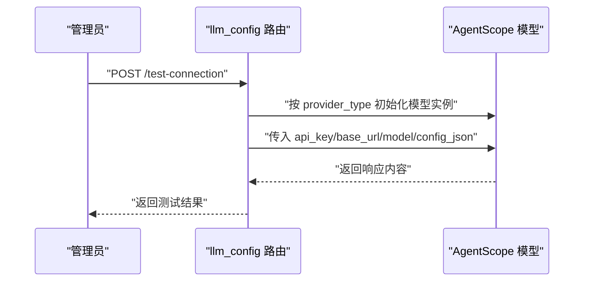
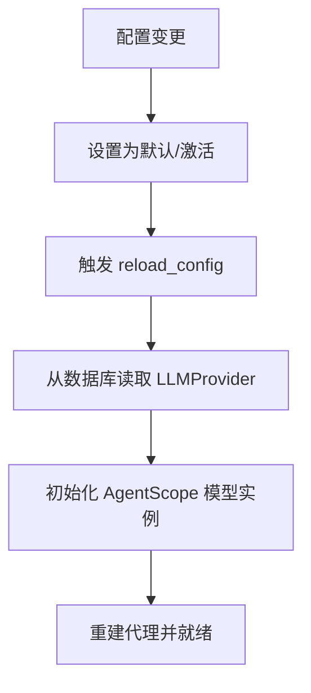
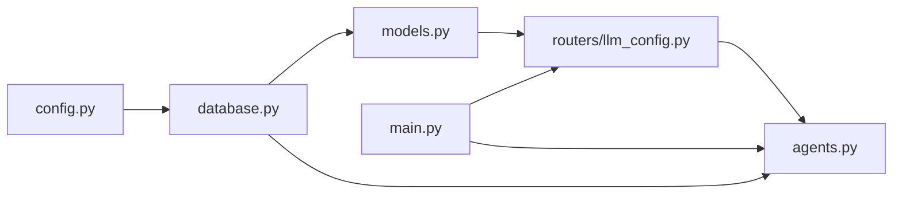

# 配置管理

<cite>
**本文引用的文件**
- [backend/config.py](file://backend/config.py)
- [.env.example](file://backend/.env.example)
- [backend/database.py](file://backend/database.py)
- [backend/models.py](file://backend/models.py)
- [backend/schemas.py](file://backend/schemas.py)
- [backend/routers/llm_config.py](file://backend/routers/llm_config.py)
- [backend/main.py](file://backend/main.py)
- [backend/agents.py](file://backend/agents.py)
- [backend/manage_db.py](file://backend/manage_db.py)
- [backend/migrations/versions/14746eaf1c81_initial.py](file://backend/migrations/versions/14746eaf1c81_initial.py)
- [backend/requirements.txt](file://backend/requirements.txt)
</cite>

## 目录
1. [简介](#简介)
2. [项目结构](#项目结构)
3. [核心组件](#核心组件)
4. [架构总览](#架构总览)
5. [详细组件分析](#详细组件分析)
6. [依赖关系分析](#依赖关系分析)
7. [性能考量](#性能考量)
8. [故障排查指南](#故障排查指南)
9. [结论](#结论)
10. [附录](#附录)

## 简介
本文件面向“配置管理”主题，系统化阐述本项目的动态配置加载机制、数据库配置存储与实时更新策略；详解 LLM 提供商配置管理、API 密钥安全存储与模型参数调优；说明配置验证机制、回滚策略与兼容性检查；解释配置热重载、版本管理与迁移路径；并给出配置模板设计、默认值设置与错误处理机制，以及配置开发指南、测试方法与部署最佳实践。

## 项目结构
后端采用 FastAPI + SQLAlchemy 异步 ORM 架构，配置管理围绕以下模块协同工作：
- 配置源：环境变量与 .env 文件（通过 pydantic-settings 的 Settings 模型加载）
- 数据持久层：SQLAlchemy 异步引擎与模型定义（LLMProvider、Agent 等）
- 路由层：LLM 提供商管理接口（创建、更新、删除、连接测试）
- 应用生命周期：FastAPI lifespan 在启动时执行数据库迁移与配置加载
- 引擎层：NarrativeEngine 基于数据库配置动态初始化 AgentScope 模型实例

**图表来源**
- [backend/config.py](file://backend/config.py#L1-L34)
- [backend/.env.example](file://backend/.env.example#L1-L4)
- [backend/database.py](file://backend/database.py#L1-L31)
- [backend/models.py](file://backend/models.py#L58-L79)
- [backend/routers/llm_config.py](file://backend/routers/llm_config.py#L1-L203)
- [backend/agents.py](file://backend/agents.py#L43-L153)
- [backend/main.py](file://backend/main.py#L45-L82)
- [backend/migrations/versions/14746eaf1c81_initial.py](file://backend/migrations/versions/14746eaf1c81_initial.py#L21-L30)

**章节来源**
- [backend/config.py](file://backend/config.py#L1-L34)
- [backend/.env.example](file://backend/.env.example#L1-L4)
- [backend/database.py](file://backend/database.py#L1-L31)
- [backend/models.py](file://backend/models.py#L58-L79)
- [backend/routers/llm_config.py](file://backend/routers/llm_config.py#L1-L203)
- [backend/main.py](file://backend/main.py#L45-L82)
- [backend/agents.py](file://backend/agents.py#L43-L153)
- [backend/migrations/versions/14746eaf1c81_initial.py](file://backend/migrations/versions/14746eaf1c81_initial.py#L21-L30)

## 核心组件
- 配置模型 Settings：集中管理项目名称、版本、数据库 URL、Redis URL、AI API Key、生成模型等，默认从 .env 加载，支持本地 SQLite 与远程 PostgreSQL 切换。
- 数据库引擎与会话：基于 settings.DATABASE_URL 创建异步引擎，启用连接池与自动重连，提供 get_db 依赖注入。
- LLM 提供商模型：存储提供商名称、类型、API Key、基础地址、可用模型列表、标签、是否激活/默认、额外配置等，并记录创建/更新时间。
- LLM 提供商路由：提供创建、查询、更新、删除、连接测试接口；当设置为默认或激活状态时触发配置热重载。
- 引擎初始化与热重载：NarrativeEngine 从数据库加载当前激活的 LLMProvider，解析模型与额外配置，初始化 AgentScope 模型实例并重建相关代理；支持在运行时通过 API 触发 reload。
- 应用生命周期：FastAPI lifespan 在启动时执行数据库迁移与首次配置加载；提供统计、玩家与故事管理等通用管理接口。

**章节来源**
- [backend/config.py](file://backend/config.py#L7-L33)
- [backend/database.py](file://backend/database.py#L8-L23)
- [backend/models.py](file://backend/models.py#L58-L79)
- [backend/routers/llm_config.py](file://backend/routers/llm_config.py#L112-L138)
- [backend/agents.py](file://backend/agents.py#L49-L153)
- [backend/main.py](file://backend/main.py#L45-L82)

## 架构总览
下图展示配置管理在系统中的位置与交互：

**图表来源**
- [backend/routers/llm_config.py](file://backend/routers/llm_config.py#L20-L111)
- [backend/routers/llm_config.py](file://backend/routers/llm_config.py#L112-L138)
- [backend/routers/llm_config.py](file://backend/routers/llm_config.py#L160-L188)
- [backend/agents.py](file://backend/agents.py#L49-L153)

## 详细组件分析

### 动态配置加载机制
- 启动阶段加载：FastAPI lifespan 在启动时尝试执行数据库迁移，并调用 narrative_engine.load_config_from_db 完成初始配置加载。
- 运行时加载：当 LLMProvider 设置为激活状态时，路由层在创建/更新后触发 reload_config，NarrativeEngine 重新从数据库拉取配置并重建 AgentScope 模型实例。
- 回退策略：若数据库中无激活提供商，且存在环境变量中的 OPENAI_API_KEY，则使用回退配置初始化模型。

**图表来源**
- [backend/main.py](file://backend/main.py#L75-L80)
- [backend/agents.py](file://backend/agents.py#L49-L100)

**章节来源**
- [backend/main.py](file://backend/main.py#L45-L82)
- [backend/agents.py](file://backend/agents.py#L49-L100)

### 数据库配置存储与实时更新
- 存储结构：LLMProvider 表包含名称、类型、API Key、基础地址、模型列表、标签、激活/默认标记、额外配置与时间戳。
- 写入约束：创建时检查名称唯一性；若设置为默认，则取消其他默认标记。
- 更新约束：更新时同样处理默认标记；若提供商处于激活状态，则触发热重载。
- 删除：删除提供商后返回确认信息。

**图表来源**
- [backend/models.py](file://backend/models.py#L58-L79)

**章节来源**
- [backend/routers/llm_config.py](file://backend/routers/llm_config.py#L112-L138)
- [backend/routers/llm_config.py](file://backend/routers/llm_config.py#L160-L188)
- [backend/models.py](file://backend/models.py#L58-L79)

### LLM 提供商配置管理与模型参数调优
- 支持提供商类型：OpenAI、Azure、DashScope、Anthropic、Gemini；未识别类型时回退到 OpenAI 兼容实现。
- 连接测试：根据 provider_type 动态选择对应模型类，传入 api_key、base_url、model 与 config_json，构造简单对话消息进行连通性验证。
- 参数调优：通过 config_json 传递生成参数（如温度、最大长度等），由具体模型类消费；Agent 层面也支持 temperature、context_window、thinking_mode 等参数。

**图表来源**
- [backend/routers/llm_config.py](file://backend/routers/llm_config.py#L20-L111)

**章节来源**
- [backend/routers/llm_config.py](file://backend/routers/llm_config.py#L20-L111)
- [backend/schemas.py](file://backend/schemas.py#L36-L42)
- [backend/models.py](file://backend/models.py#L100-L122)

### API 密钥安全存储与模型参数调优
- 密钥存储：LLMProvider.api_key 字段直接保存密钥（注释提示应加密存储）。建议在生产环境中结合密钥管理服务或对称加密后入库。
- 参数调优：通过 LLMProvider.config_json 与 Agent.model_config_json 传递模型生成参数；同时在 Agent 层提供 temperature、context_window 等字段用于行为调优。

**章节来源**
- [backend/models.py](file://backend/models.py#L65-L75)
- [backend/schemas.py](file://backend/schemas.py#L18-L27)
- [backend/schemas.py](file://backend/schemas.py#L43-L73)

### 配置验证机制、回滚策略与兼容性检查
- 验证机制：Pydantic 模型对输入进行校验（如 Agent 的 temperature、context_window 边界）；路由层对重复名称进行检查。
- 回滚策略：当前未实现自动回滚；可在失败时保留上一次成功配置或提供“恢复默认”按钮（前端可扩展）。
- 兼容性检查：连接测试接口对不同提供商类型进行适配；模型列表支持字符串或 JSON 数组两种格式，增强兼容性。

**章节来源**
- [backend/schemas.py](file://backend/schemas.py#L43-L73)
- [backend/routers/llm_config.py](file://backend/routers/llm_config.py#L112-L138)
- [backend/agents.py](file://backend/agents.py#L79-L99)

### 配置热重载、版本管理与迁移路径
- 热重载：当 LLMProvider.is_active 或 is_default 发生变化时，路由层触发 narrative_engine.reload_config，引擎重新加载配置并重建代理。
- 版本管理：使用 Alembic 进行数据库迁移；提供命令行工具 manage_db.py 支持 migrate、upgrade、downgrade。
- 迁移路径：初始版本中将 llm_providers.tags 从 TEXT 转换为 JSON，确保后续扩展的结构化存储。

**图表来源**
- [backend/routers/llm_config.py](file://backend/routers/llm_config.py#L122-L136)
- [backend/routers/llm_config.py](file://backend/routers/llm_config.py#L173-L186)
- [backend/agents.py](file://backend/agents.py#L150-L152)

**章节来源**
- [backend/routers/llm_config.py](file://backend/routers/llm_config.py#L122-L136)
- [backend/routers/llm_config.py](file://backend/routers/llm_config.py#L173-L186)
- [backend/agents.py](file://backend/agents.py#L150-L152)
- [backend/manage_db.py](file://backend/manage_db.py#L20-L38)
- [backend/migrations/versions/14746eaf1c81_initial.py](file://backend/migrations/versions/14746eaf1c81_initial.py#L21-L30)

### 配置模板设计、默认值设置与错误处理
- 配置模板：Settings 中定义了项目名、版本、数据库 URL、Redis URL、各平台 API Key、生成模型等键；.env.example 提供示例键值。
- 默认值：数据库默认使用 SQLite（绝对路径），Redis 默认本地连接，各平台 API Key 默认为空，生成模型默认为常见模型名。
- 错误处理：连接测试捕获异常并返回友好信息；启动阶段加载失败会打印警告；路由层对重复名称与未找到资源返回明确错误码。

**章节来源**
- [backend/config.py](file://backend/config.py#L7-L33)
- [backend/.env.example](file://backend/.env.example#L1-L4)
- [backend/routers/llm_config.py](file://backend/routers/llm_config.py#L117-L120)
- [backend/routers/llm_config.py](file://backend/routers/llm_config.py#L156-L158)
- [backend/routers/llm_config.py](file://backend/routers/llm_config.py#L107-L110)

## 依赖关系分析
- 组件耦合：routers/llm_config.py 依赖 models 与 schemas，调用 agents.py 中的 narrative_engine；agents.py 依赖 models 与 database；database.py 依赖 config.py。
- 外部依赖：FastAPI、SQLAlchemy、AgentScope、Alembic、Pydantic/Settings 等。

**图表来源**
- [backend/config.py](file://backend/config.py#L1-L34)
- [backend/database.py](file://backend/database.py#L1-L31)
- [backend/models.py](file://backend/models.py#L1-L122)
- [backend/routers/llm_config.py](file://backend/routers/llm_config.py#L1-L203)
- [backend/agents.py](file://backend/agents.py#L1-L196)
- [backend/main.py](file://backend/main.py#L30-L98)

**章节来源**
- [backend/requirements.txt](file://backend/requirements.txt#L1-L20)
- [backend/main.py](file://backend/main.py#L30-L98)

## 性能考量
- 连接池与自动重连：数据库引擎启用 pool_pre_ping、合理连接池大小与溢出，降低连接抖动风险。
- 异步 I/O：全链路异步化，避免阻塞；热重载仅在必要时触发，避免频繁重建模型实例。
- 缓存与预热：可考虑在引擎层增加模型实例缓存与预热策略，减少首次请求延迟。

## 故障排查指南
- 启动失败：检查 DATABASE_URL 是否正确；确认 Alembic 升级 head 成功；查看 lifespan 打印的日志。
- 未加载配置：确认数据库中存在激活的 LLMProvider；若无则检查 .env 中 OPENAI_API_KEY 是否可用作回退。
- 连接测试失败：核对 provider_type、api_key、base_url、model 与 config_json；查看异常堆栈。
- 热重载无效：确认更新后 is_active 为真；检查路由层是否调用 reload_config；观察引擎日志。

**章节来源**
- [backend/main.py](file://backend/main.py#L64-L65)
- [backend/agents.py](file://backend/agents.py#L66-L75)
- [backend/routers/llm_config.py](file://backend/routers/llm_config.py#L135-L136)
- [backend/routers/llm_config.py](file://backend/routers/llm_config.py#L185-L186)

## 结论
本项目通过 Settings + 数据库双通道实现配置管理：Settings 提供基础默认值与环境覆盖，数据库提供可编辑、可审计的运行时配置。NarrativeEngine 在启动与运行时动态加载配置，结合路由层的连接测试与热重载，形成闭环的配置生命周期。建议在生产中强化密钥安全、完善回滚与监控告警，并持续扩展配置模板与参数集以满足多提供商与多模型场景。

## 附录
- 开发指南
  - 新增提供商：先在 .env 设置 API Key，再通过 /api/admin/llm-providers 创建并设为激活/默认。
  - 参数调优：在 LLMProvider.config_json 与 Agent.model_config_json 中添加生成参数。
  - 连接测试：使用 /api/admin/llm-providers/test-connection 验证连通性。
- 测试方法
  - 单元测试：针对路由层的重复名检查、未找到资源错误码进行断言。
  - 集成测试：启动应用，依次执行连接测试、创建/更新提供商、热重载验证。
- 部署最佳实践
  - 使用 PostgreSQL 替代 SQLite 以提升并发与可靠性。
  - 将 API Key 存入密钥管理服务或加密后入库。
  - 通过 Alembic 管理数据库演进，禁止直接使用 create_all。
  - 在 CI/CD 中加入迁移与连接测试步骤。