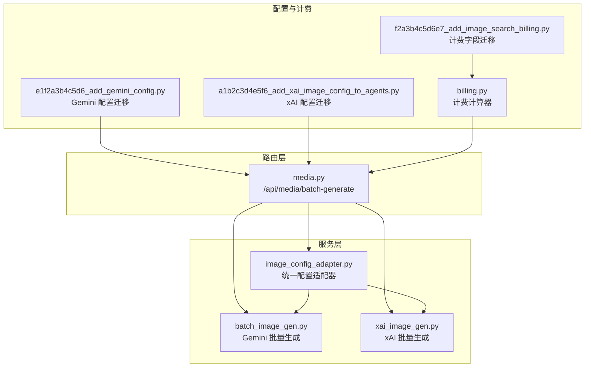
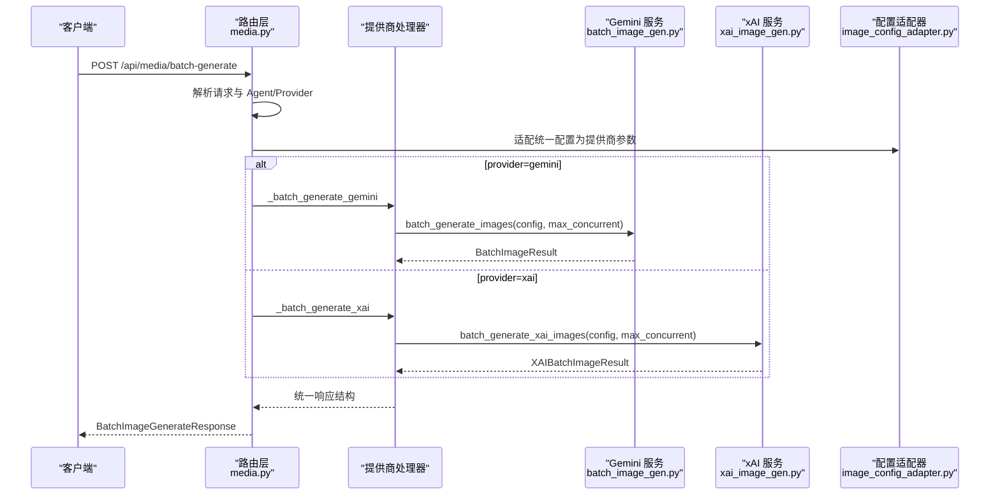
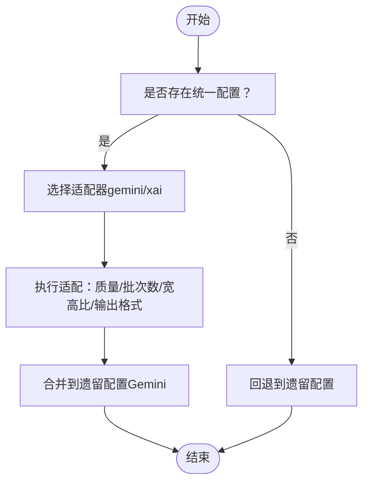
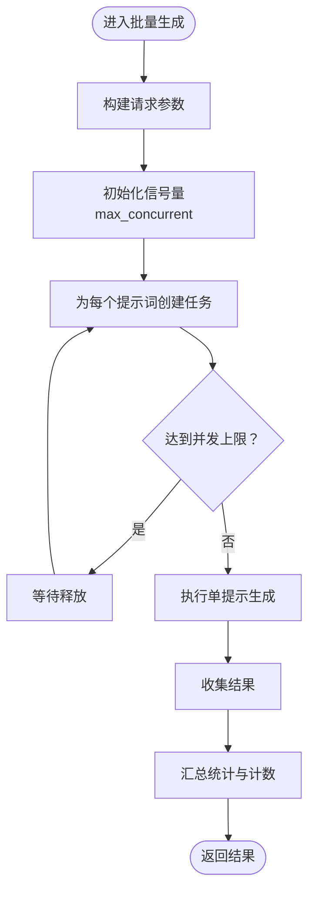
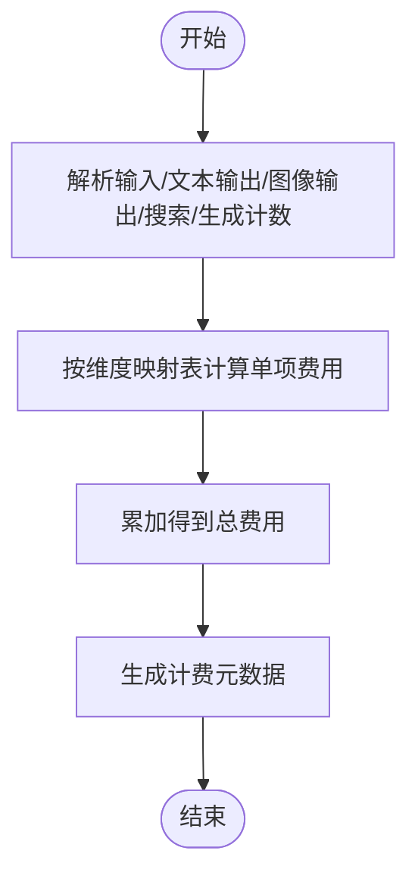
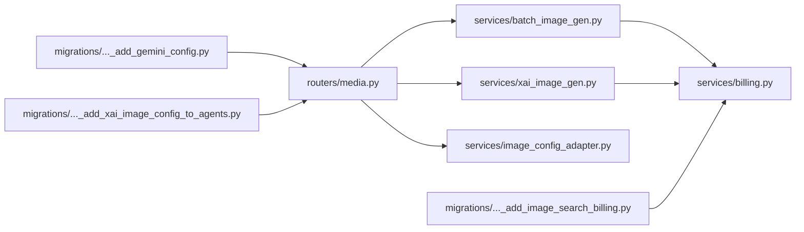

# 图像生成功能

<cite>
**本文引用的文件**
- [backend/services/batch_image_gen.py](file://backend/services/batch_image_gen.py)
- [backend/services/xai_image_gen.py](file://backend/services/xai_image_gen.py)
- [backend/routers/media.py](file://backend/routers/media.py)
- [backend/services/image_config_adapter.py](file://backend/services/image_config_adapter.py)
- [backend/migrations/versions/e1f2a3b4c5d6_add_gemini_config.py](file://backend/migrations/versions/e1f2a3b4c5d6_add_gemini_config.py)
- [backend/migrations/versions/a1b2c3d4e5f6_add_xai_image_config_to_agents.py](file://backend/migrations/versions/a1b2c3d4e5f6_add_xai_image_config_to_agents.py)
- [backend/migrations/versions/f2a3b4c5d6e7_add_image_search_billing.py](file://backend/migrations/versions/f2a3b4c5d6e7_add_image_search_billing.py)
- [backend/services/billing.py](file://backend/services/billing.py)
- [backend/admin/src/components/admin/agents/AgentForm/schema.ts](file://backend/admin/src/components/admin/agents/AgentForm/schema.ts)
- [backend/admin/src/types/index.ts](file://backend/admin/src/types/index.ts)
</cite>

## 目录
1. [简介](#简介)
2. [项目结构](#项目结构)
3. [核心组件](#核心组件)
4. [架构概览](#架构概览)
5. [详细组件分析](#详细组件分析)
6. [依赖关系分析](#依赖关系分析)
7. [性能考虑](#性能考虑)
8. [故障排查指南](#故障排查指南)
9. [结论](#结论)
10. [附录](#附录)

## 简介
本文件系统性阐述图像生成功能，覆盖以下要点：
- 批量图像生成的核心实现与并行策略
- Gemini 与 xAI 两大 AI 服务提供商的集成方式
- BatchImageConfig 与 XAIBatchImageConfig 配置类的设计与参数作用机制
- 图像配置适配器如何将“统一配置”标准化为不同提供商的参数
- 成本计算机制（输入输出 token 统计与费用估算）
- 完整 API 使用示例（请求参数、响应结构、错误处理）
- 性能优化建议（并发控制、内存管理、超时处理）

## 项目结构
图像生成功能主要由三层组成：
- 路由层：接收请求、解析参数、调度至对应提供商处理器
- 服务层：封装 Gemini 与 xAI 的批量图像生成逻辑，负责并发与结果聚合
- 配置与计费：统一配置适配器、数据库迁移、计费模块

图表来源
- [backend/routers/media.py:108-139](file://backend/routers/media.py#L108-L139)
- [backend/services/batch_image_gen.py:113-187](file://backend/services/batch_image_gen.py#L113-L187)
- [backend/services/xai_image_gen.py:125-191](file://backend/services/xai_image_gen.py#L125-L191)
- [backend/services/image_config_adapter.py:115-163](file://backend/services/image_config_adapter.py#L115-L163)
- [backend/migrations/versions/e1f2a3b4c5d6_add_gemini_config.py:21-36](file://backend/migrations/versions/e1f2a3b4c5d6_add_gemini_config.py#L21-L36)
- [backend/migrations/versions/a1b2c3d4e5f6_add_xai_image_config_to_agents.py:21-31](file://backend/migrations/versions/a1b2c3d4e5f6_add_xai_image_config_to_agents.py#L21-L31)
- [backend/migrations/versions/f2a3b4c5d6e7_add_image_search_billing.py:21-34](file://backend/migrations/versions/f2a3b4c5d6e7_add_image_search_billing.py#L21-L34)
- [backend/services/billing.py:310-350](file://backend/services/billing.py#L310-L350)

章节来源
- [backend/routers/media.py:108-139](file://backend/routers/media.py#L108-L139)
- [backend/services/batch_image_gen.py:113-187](file://backend/services/batch_image_gen.py#L113-L187)
- [backend/services/xai_image_gen.py:125-191](file://backend/services/xai_image_gen.py#L125-L191)
- [backend/services/image_config_adapter.py:115-163](file://backend/services/image_config_adapter.py#L115-L163)

## 核心组件
- 批量生成服务（Gemini）
  - 配置类：BatchImageConfig（宽高比、分辨率、输出格式、Google 搜索开关）
  - 并发：基于 asyncio.Semaphore 控制最大并发（1-8）
  - 结果：BatchImageResult，包含每个提示词的结果与 token 统计
- 批量生成服务（xAI）
  - 配置类：XAIBatchImageConfig（宽高比、分辨率、每提示生成数量 n、输出格式）
  - 并发：同上
  - 结果：XAIBatchImageResult，包含每个提示词的多张图片 URL 列表
- 统一配置适配器
  - 将“统一图像配置”转换为 Gemini/xAI 的具体参数，含质量映射、批次数限制、支持的宽高比与输出格式
- 计费模块
  - 基于维度映射表计算费用，支持图像生成按张计费与 token 维度计费

章节来源
- [backend/services/batch_image_gen.py:29-63](file://backend/services/batch_image_gen.py#L29-L63)
- [backend/services/xai_image_gen.py:30-62](file://backend/services/xai_image_gen.py#L30-L62)
- [backend/services/image_config_adapter.py:12-103](file://backend/services/image_config_adapter.py#L12-L103)
- [backend/services/billing.py:14-20](file://backend/services/billing.py#L14-L20)

## 架构概览
图像生成的端到端流程如下：

图表来源
- [backend/routers/media.py:145-243](file://backend/routers/media.py#L145-L243)
- [backend/services/batch_image_gen.py:113-187](file://backend/services/batch_image_gen.py#L113-L187)
- [backend/services/xai_image_gen.py:125-191](file://backend/services/xai_image_gen.py#L125-L191)
- [backend/services/image_config_adapter.py:115-163](file://backend/services/image_config_adapter.py#L115-L163)

## 详细组件分析

### 配置类设计与参数机制

#### BatchImageConfig（Gemini）
- 关键参数
  - aspect_ratio：宽高比（受支持集合约束）
  - image_size：分辨率（映射表支持 512/1K/2K/4K/auto）
  - output_format：输出格式（png/jpeg/webp）
  - google_search_enabled / google_image_search_enabled：是否启用搜索工具
- 作用机制
  - 构造 ImageConfig 参数传给 Gemini API
  - 自动过滤 None 值，避免无效字段
- 适用场景
  - 文本到图像生成，支持搜索增强

章节来源
- [backend/services/batch_image_gen.py:29-37](file://backend/services/batch_image_gen.py#L29-L37)
- [backend/services/batch_image_gen.py:139-157](file://backend/services/batch_image_gen.py#L139-L157)

#### XAIBatchImageConfig（xAI）
- 关键参数
  - aspect_ratio：宽高比（支持更丰富集合，含 auto）
  - resolution：分辨率（1k/2k）
  - n：每个提示词生成数量（1-10）
  - response_format：输出格式（b64_json/url）
- 作用机制
  - 通过 extra_body 传递 aspect_ratio/resolution
  - 支持 b64_json 与 url 两种输出格式
- 适用场景
  - 高并发批量生成，支持多变体

章节来源
- [backend/services/xai_image_gen.py:30-37](file://backend/services/xai_image_gen.py#L30-L37)
- [backend/services/xai_image_gen.py:98-102](file://backend/services/xai_image_gen.py#L98-L102)

#### 统一配置适配器
- 设计目标
  - 将“统一图像配置”标准化为不同提供商的参数
  - 通过映射表避免 if-else 分支
- 关键映射
  - quality → provider-specific resolution/image_size
  - batch_count → provider-specific field（gemini: batch_count；xai: n）
  - aspect_ratio → 支持集校验与默认值
  - output_format → 仅 Gemini 支持用户指定
- 适配流程
  - to_provider_config：根据提供商类型选择适配器
  - resolve_image_configs：优先使用统一配置，否则回退到遗留配置

图表来源
- [backend/services/image_config_adapter.py:129-163](file://backend/services/image_config_adapter.py#L129-L163)

章节来源
- [backend/services/image_config_adapter.py:12-103](file://backend/services/image_config_adapter.py#L12-L103)
- [backend/services/image_config_adapter.py:115-163](file://backend/services/image_config_adapter.py#L115-L163)

### 并行处理策略与资源管理
- 并发控制
  - 使用 asyncio.Semaphore 限制最大并发（1-8）
  - 每个提示词一个任务，统一 gather 收敛
- 资源管理
  - Gemini：单客户端复用，按 GenerateContentConfig 传参
  - xAI：AsyncOpenAI 客户端，支持自定义 base_url
- 结果聚合
  - 统一汇总为 BatchImageResult/XAIBatchImageResult
  - 计数：total_prompts/completed/failed/total_images（xAI）

图表来源
- [backend/services/batch_image_gen.py:160-187](file://backend/services/batch_image_gen.py#L160-L187)
- [backend/services/xai_image_gen.py:161-191](file://backend/services/xai_image_gen.py#L161-L191)

章节来源
- [backend/services/batch_image_gen.py:113-187](file://backend/services/batch_image_gen.py#L113-L187)
- [backend/services/xai_image_gen.py:125-191](file://backend/services/xai_image_gen.py#L125-L191)

### 成本计算机制
- 计费维度（映射表驱动）
  - 输入 token、文本输出 token、图像输出 token、搜索查询、图像生成（按张计费）
- 计算流程
  - 解析模态 token（若无模态拆分，则将输出 token 全部视为文本输出）
  - 按维度乘以费率并累加
- 与图像生成的关联
  - xAI：image_generation 维度按生成张数计费
  - Gemini：image_output 维度按输出 token 计费（若可用）

图表来源
- [backend/services/billing.py:310-350](file://backend/services/billing.py#L310-L350)

章节来源
- [backend/services/billing.py:14-20](file://backend/services/billing.py#L14-L20)
- [backend/services/billing.py:310-350](file://backend/services/billing.py#L310-L350)

### API 使用示例
- 请求路径
  - POST /api/media/batch-generate
- 请求体（简化说明）
  - agent_id：智能体 ID
  - prompts：提示词数组（1-8 条）
  - config：可选，BatchImageConfig 或 XAIBatchImageConfig
  - max_concurrent：最大并发（1-8，默认 4）
- 响应体（统一结构）
  - success：整体是否成功
  - total_prompts/completed/failed：统计
  - results：每条提示词的结果列表
    - prompt_index/prompt/success/error
    - Gemini：image_url/input_tokens/output_tokens/text_response
    - xAI：image_url（取每条结果的第一张）、input_tokens/output_tokens（均为 0）

章节来源
- [backend/routers/media.py:108-139](file://backend/routers/media.py#L108-L139)
- [backend/routers/media.py:145-243](file://backend/routers/media.py#L145-L243)

### 错误处理
- 单提示词级错误
  - 记录异常字符串并标记失败
- 并发异常
  - gather(return_exceptions=True) 保证整体返回
- 路由层错误
  - 供应商不支持时返回 400
  - Agent/Provider 不存在返回 404

章节来源
- [backend/services/batch_image_gen.py:174-183](file://backend/services/batch_image_gen.py#L174-L183)
- [backend/services/xai_image_gen.py:174-183](file://backend/services/xai_image_gen.py#L174-L183)
- [backend/routers/media.py:124-138](file://backend/routers/media.py#L124-L138)

## 依赖关系分析
- 路由层依赖服务层与配置适配器
- 服务层依赖提供商 SDK（Gemini/ xAI）
- 计费模块依赖数据库迁移中新增的费率字段

图表来源
- [backend/routers/media.py:108-139](file://backend/routers/media.py#L108-L139)
- [backend/services/batch_image_gen.py:113-187](file://backend/services/batch_image_gen.py#L113-L187)
- [backend/services/xai_image_gen.py:125-191](file://backend/services/xai_image_gen.py#L125-L191)
- [backend/services/image_config_adapter.py:115-163](file://backend/services/image_config_adapter.py#L115-L163)
- [backend/services/billing.py:310-350](file://backend/services/billing.py#L310-L350)
- [backend/migrations/versions/e1f2a3b4c5d6_add_gemini_config.py:21-36](file://backend/migrations/versions/e1f2a3b4c5d6_add_gemini_config.py#L21-L36)
- [backend/migrations/versions/a1b2c3d4e5f6_add_xai_image_config_to_agents.py:21-31](file://backend/migrations/versions/a1b2c3d4e5f6_add_xai_image_config_to_agents.py#L21-L31)
- [backend/migrations/versions/f2a3b4c5d6e7_add_image_search_billing.py:21-34](file://backend/migrations/versions/f2a3b4c5d6e7_add_image_search_billing.py#L21-L34)

章节来源
- [backend/routers/media.py:108-139](file://backend/routers/media.py#L108-L139)
- [backend/services/batch_image_gen.py:113-187](file://backend/services/batch_image_gen.py#L113-L187)
- [backend/services/xai_image_gen.py:125-191](file://backend/services/xai_image_gen.py#L125-L191)
- [backend/services/image_config_adapter.py:115-163](file://backend/services/image_config_adapter.py#L115-L163)
- [backend/services/billing.py:310-350](file://backend/services/billing.py#L310-L350)

## 性能考虑
- 并发控制
  - max_concurrent 建议根据提供商速率限制与网络状况设置（1-8）
  - 避免超过提供商的批处理上限（Gemini: 8；xAI: 10）
- 超时与重试
  - Gemini：使用 aio.models.generate_content，建议设置合理超时
  - xAI：AsyncOpenAI 默认超时可按需调整
- 内存管理
  - b64_json 模式会解码/保存图片，注意内存峰值
  - url 模式可减少内存占用，但需网络访问
- 结果聚合
  - 使用 gather 收敛，避免逐个等待导致的串行化

## 故障排查指南
- 常见问题
  - 供应商不支持：确认 provider_type 是否在处理器映射中
  - 参数非法：检查宽高比/分辨率/批次数是否在支持范围内
  - 并发过高：降低 max_concurrent，观察错误码与限流
  - 费用不足：检查计费维度与余额，必要时充值或调整费率
- 日志定位
  - 路由层与服务层均输出详细日志，包含提示词索引、成功/失败、耗时等

章节来源
- [backend/routers/media.py:133-138](file://backend/routers/media.py#L133-L138)
- [backend/services/batch_image_gen.py:104-108](file://backend/services/batch_image_gen.py#L104-L108)
- [backend/services/xai_image_gen.py:113-121](file://backend/services/xai_image_gen.py#L113-L121)
- [backend/services/billing.py:45-84](file://backend/services/billing.py#L45-L84)

## 结论
该图像生成功能通过统一配置适配器与两条并行流水线，实现了对 Gemini 与 xAI 的一致化接入。其设计强调：
- 参数标准化与映射表驱动，降低分支复杂度
- 并发与资源管理的工程化实现
- 计费维度的可扩展映射表
- 统一响应结构便于前端消费

## 附录

### 数据模型与迁移
- Agent 表新增字段
  - gemini_config：Gemini 配置（JSON）
  - xai_image_config：xAI 图像配置（JSON）
  - image_output_credit_per_1k：图像输出计费单价（每 1M tokens）
  - search_credit_per_query：搜索计费单价
  - image_credit_per_image：图像生成按张计费单价

章节来源
- [backend/migrations/versions/e1f2a3b4c5d6_add_gemini_config.py:21-36](file://backend/migrations/versions/e1f2a3b4c5d6_add_gemini_config.py#L21-L36)
- [backend/migrations/versions/a1b2c3d4e5f6_add_xai_image_config_to_agents.py:21-31](file://backend/migrations/versions/a1b2c3d4e5f6_add_xai_image_config_to_agents.py#L21-L31)
- [backend/migrations/versions/f2a3b4c5d6e7_add_image_search_billing.py:21-34](file://backend/migrations/versions/f2a3b4c5d6e7_add_image_search_billing.py#L21-L34)

### 前端类型与配置
- 统一图像配置类型（前端）
  - UnifiedImageConfig：aspect_ratio、quality、batch_count、output_format
  - XAIImageConfig：aspect_ratio、resolution、n、response_format
- Agent 表单默认值与校验
  - 前端对枚举值进行严格校验，后端同样进行校验与适配

章节来源
- [backend/admin/src/types/index.ts:26-53](file://backend/admin/src/types/index.ts#L26-L53)
- [backend/admin/src/components/admin/agents/AgentForm/schema.ts:18-57](file://backend/admin/src/components/admin/agents/AgentForm/schema.ts#L18-L57)