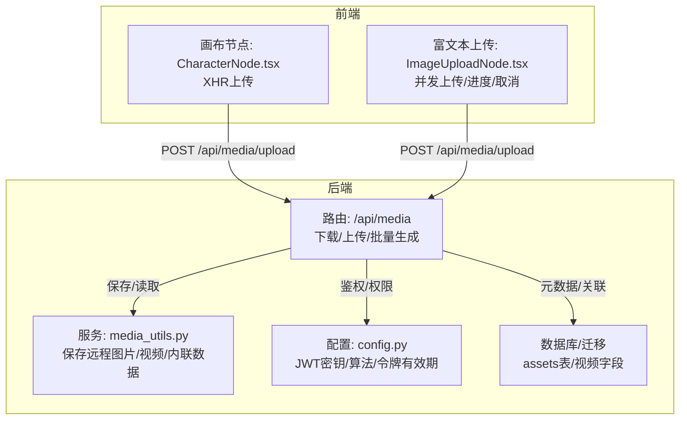
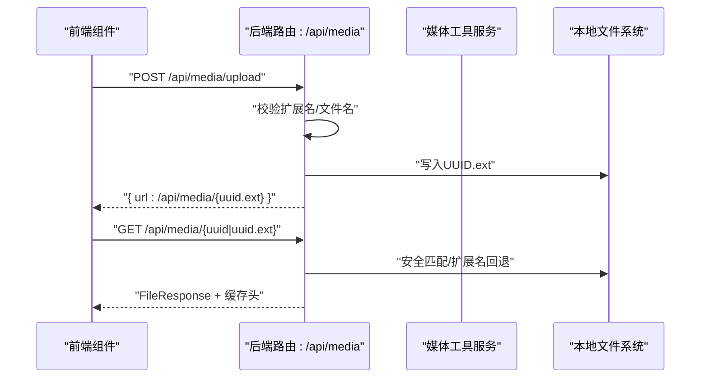
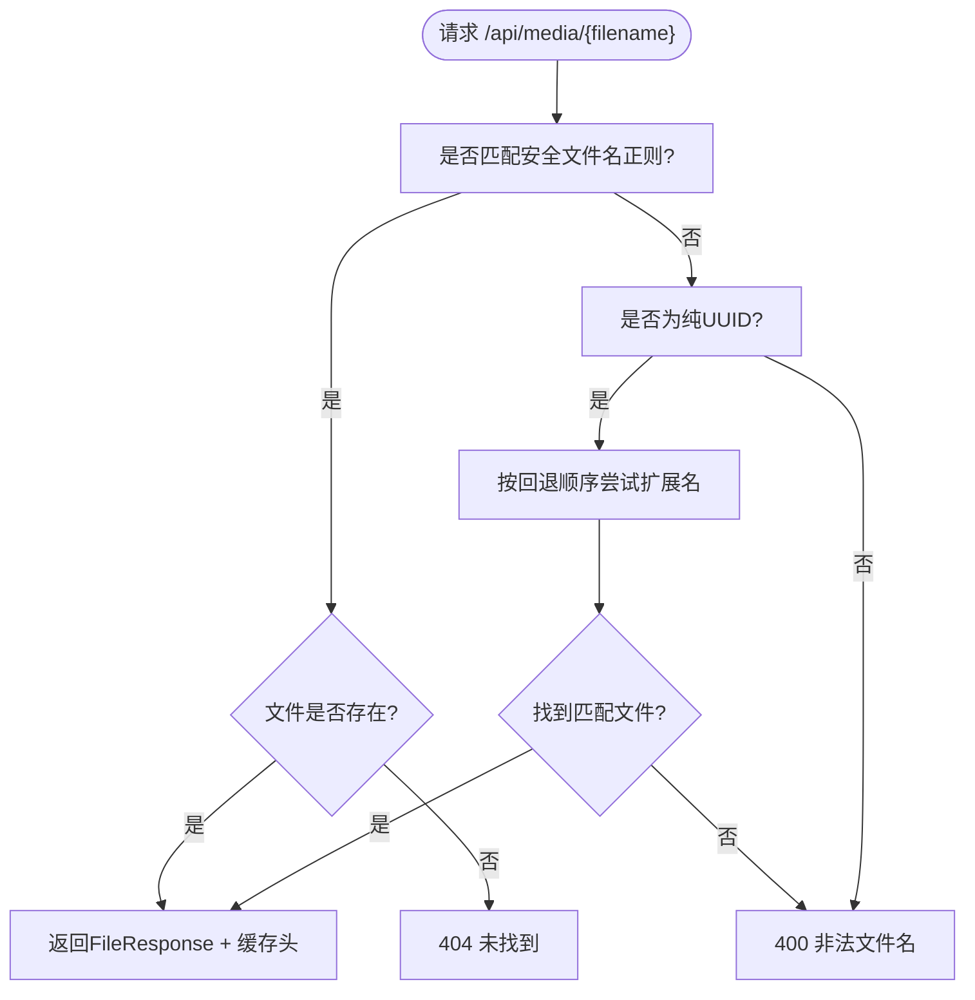
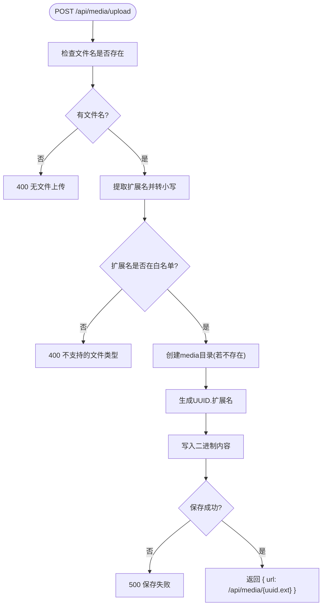
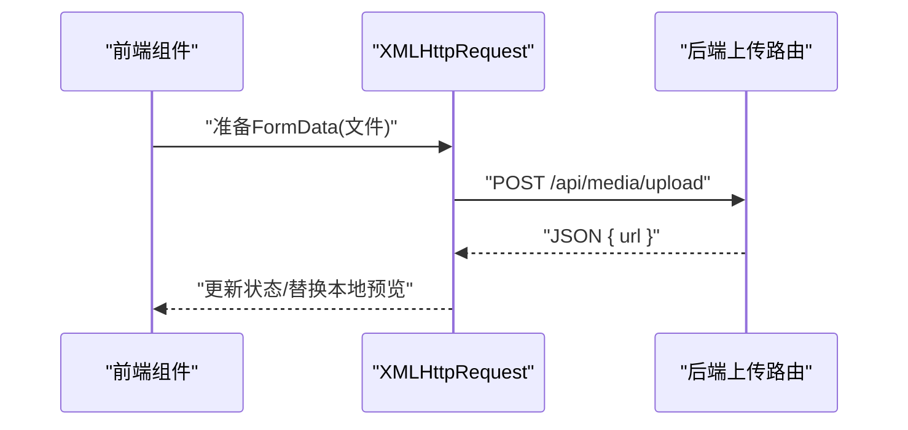
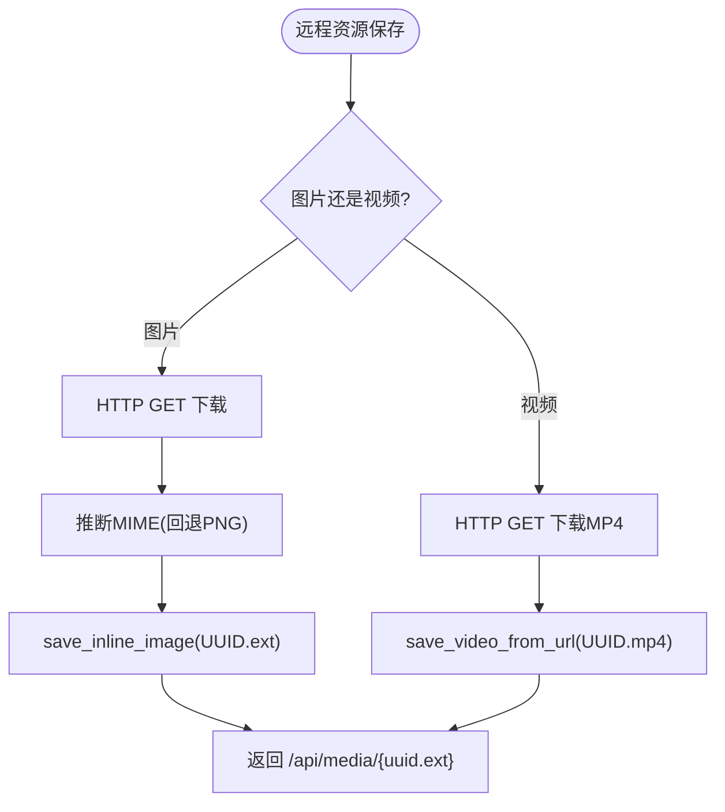
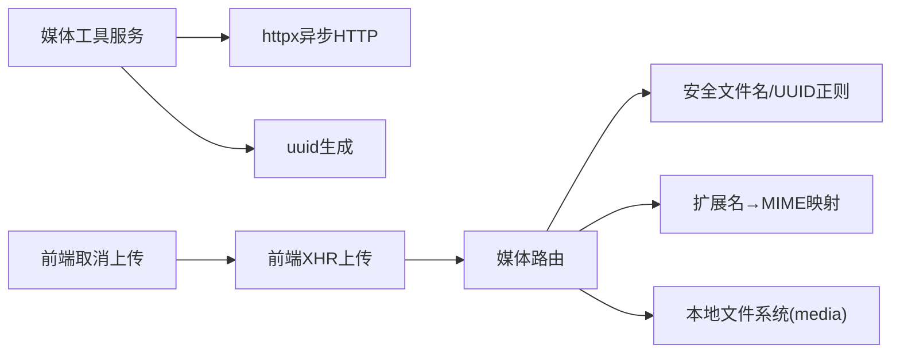

# 媒体文件管理

<cite>
**本文引用的文件**
- [backend/routers/media.py](file://backend/routers/media.py)
- [backend/services/media_utils.py](file://backend/services/media_utils.py)
- [frontend/src/components/canvas/CharacterNode.tsx](file://frontend/src/components/canvas/CharacterNode.tsx)
- [frontend/src/components/tiptap-node/image-upload-node/image-upload-node.tsx](file://frontend/src/components/tiptap-node/image-upload-node/image-upload-node.tsx)
- [backend/config.py](file://backend/config.py)
- [backend/models.py](file://backend/models.py)
- [backend/migrations/versions/cc40fa02de06_migrate_credits_to_decimal_and_atomic_.py](file://backend/migrations/versions/cc40fa02de06_migrate_credits_to_decimal_and_atomic_.py)
- [backend/migrations/versions/7459f2d26782_add_video_tasks_and_video_agent_fields.py](file://backend/migrations/versions/7459f2d26782_add_video_tasks_and_video_agent_fields.py)
- [README.md](file://README.md)
</cite>

## 目录
1. [简介](#简介)
2. [项目结构](#项目结构)
3. [核心组件](#核心组件)
4. [架构总览](#架构总览)
5. [详细组件分析](#详细组件分析)
6. [依赖分析](#依赖分析)
7. [性能考虑](#性能考虑)
8. [故障排查指南](#故障排查指南)
9. [结论](#结论)
10. [附录](#附录)

## 简介
本文件面向“媒体文件管理”功能，围绕后端FastAPI路由与服务、前端上传组件与调用方式，系统梳理以下方面：
- 安全存储机制：UUID命名策略、扩展名验证、路径安全检查
- 文件上传流程：类型校验、大小限制、存储位置管理
- 文件下载服务：安全文件名匹配、扩展名回退机制、缓存策略
- 访问控制与防盗链：URL生成、权限验证、防盗链保护现状与建议
- 完整API文档：上传、下载、批量生成、删除与元数据查询接口
- 存储优化策略：压缩处理、格式转换、存储空间管理
- 生命周期管理：临时文件清理、过期文件处理、存储配额控制
- 故障恢复机制：文件系统一致性与完整性保障

## 项目结构
媒体文件管理涉及后端路由与服务、前端上传组件以及数据库与迁移文件：
- 后端
  - 路由：/api/media（下载、上传、批量生成）
  - 服务：媒体工具（保存远程图片/视频、内联数据）
  - 配置：JWT密钥、算法、令牌有效期
  - 数据库与迁移：资产表（assets）与视频相关字段
- 前端
  - 画布节点上传（CharacterNode）：XHR直连后端上传接口
  - 富文本图片上传节点（ImageUploadNode）：多文件并发上传、进度与取消

图表来源
- [backend/routers/media.py:1-244](file://backend/routers/media.py#L1-L244)
- [backend/services/media_utils.py:1-79](file://backend/services/media_utils.py#L1-L79)
- [frontend/src/components/canvas/CharacterNode.tsx:148-187](file://frontend/src/components/canvas/CharacterNode.tsx#L148-L187)
- [frontend/src/components/tiptap-node/image-upload-node/image-upload-node.tsx:88-139](file://frontend/src/components/tiptap-node/image-upload-node/image-upload-node.tsx#L88-L139)
- [backend/config.py:26-30](file://backend/config.py#L26-L30)
- [backend/migrations/versions/cc40fa02de06_migrate_credits_to_decimal_and_atomic_.py:40-60](file://backend/migrations/versions/cc40fa02de06_migrate_credits_to_decimal_and_atomic_.py#L40-L60)
- [backend/migrations/versions/7459f2d26782_add_video_tasks_and_video_agent_fields.py:62-84](file://backend/migrations/versions/7459f2d26782_add_video_tasks_and_video_agent_fields.py#L62-L84)

章节来源
- [README.md:70-127](file://README.md#L70-L127)
- [backend/routers/media.py:1-244](file://backend/routers/media.py#L1-L244)
- [backend/services/media_utils.py:1-79](file://backend/services/media_utils.py#L1-L79)
- [frontend/src/components/canvas/CharacterNode.tsx:148-187](file://frontend/src/components/canvas/CharacterNode.tsx#L148-L187)
- [frontend/src/components/tiptap-node/image-upload-node/image-upload-node.tsx:88-139](file://frontend/src/components/tiptap-node/image-upload-node/image-upload-node.tsx#L88-L139)
- [backend/config.py:26-30](file://backend/config.py#L26-L30)
- [backend/migrations/versions/cc40fa02de06_migrate_credits_to_decimal_and_atomic_.py:40-60](file://backend/migrations/versions/cc40fa02de06_migrate_credits_to_decimal_and_atomic_.py#L40-L60)
- [backend/migrations/versions/7459f2d26782_add_video_tasks_and_video_agent_fields.py:62-84](file://backend/migrations/versions/7459f2d26782_add_video_tasks_and_video_agent_fields.py#L62-L84)

## 核心组件
- 媒体下载路由
  - 严格文件名匹配：UUID + 已知扩展名；若无扩展名则按回退顺序尝试常见扩展名
  - 返回FileResponse并设置长缓存头
- 媒体上传路由
  - 校验文件名扩展名是否受支持
  - 生成新UUID文件名并保存到本地媒体目录
  - 返回/api/media/{uuid.ext}相对URL
- 媒体工具服务
  - 保存远程图片：从URL下载并推断MIME，保存为本地文件
  - 保存远程视频：下载MP4并保存
  - 保存内联数据：根据MIME写入对应扩展名
- 前端上传组件
  - 画布节点：XHR直连后端上传，支持进度回调与鉴权头
  - 富文本节点：并发上传、进度跟踪、取消与错误处理

章节来源
- [backend/routers/media.py:54-105](file://backend/routers/media.py#L54-L105)
- [backend/services/media_utils.py:20-78](file://backend/services/media_utils.py#L20-L78)
- [frontend/src/components/canvas/CharacterNode.tsx:148-187](file://frontend/src/components/canvas/CharacterNode.tsx#L148-L187)
- [frontend/src/components/tiptap-node/image-upload-node/image-upload-node.tsx:88-139](file://frontend/src/components/tiptap-node/image-upload-node/image-upload-node.tsx#L88-L139)

## 架构总览
媒体文件管理采用“路由-服务-存储”的分层设计：
- 路由层负责HTTP协议、参数校验与响应封装
- 服务层负责远程资源拉取与本地落盘
- 存储层为本地文件系统（默认在后端根目录下的media目录）

图表来源
- [backend/routers/media.py:54-105](file://backend/routers/media.py#L54-L105)
- [backend/services/media_utils.py:20-78](file://backend/services/media_utils.py#L20-L78)

## 详细组件分析

### 下载服务（安全文件名匹配与扩展名回退）
- 安全文件名正则：仅允许已知扩展名的UUID文件名
- 纯UUID回退：当请求无扩展名时，按预设顺序尝试常见扩展名
- 缓存策略：设置公共缓存与一年有效期
- 错误处理：非法文件名返回400，文件不存在返回404

图表来源
- [backend/routers/media.py:54-80](file://backend/routers/media.py#L54-L80)

章节来源
- [backend/routers/media.py:54-80](file://backend/routers/media.py#L54-L80)

### 上传流程（类型验证、大小限制、存储位置）
- 类型验证：仅允许白名单扩展名，扩展名映射到MIME
- 存储位置：后端根目录下media目录，不存在则自动创建
- 命名策略：生成UUID作为文件名，并保留原始扩展名
- 错误处理：无文件名、不支持的类型、保存失败分别返回400/500

图表来源
- [backend/routers/media.py:83-105](file://backend/routers/media.py#L83-L105)

章节来源
- [backend/routers/media.py:83-105](file://backend/routers/media.py#L83-L105)

### 前端上传组件（XHR直连与并发上传）
- 画布节点（CharacterNode）
  - 直接使用XMLHttpRequest POST到后端上传接口
  - 支持进度回调与鉴权头（Authorization: Bearer）
  - 本地预览URL在完成后替换为后端返回的URL
- 富文本节点（ImageUploadNode）
  - 支持多文件并发上传、进度回调、取消上传
  - 本地限制：单文件大小上限、文件数量上限
  - 成功后插入图片节点并清理本地预览URL

图表来源
- [frontend/src/components/canvas/CharacterNode.tsx:148-187](file://frontend/src/components/canvas/CharacterNode.tsx#L148-L187)
- [frontend/src/components/tiptap-node/image-upload-node/image-upload-node.tsx:88-139](file://frontend/src/components/tiptap-node/image-upload-node/image-upload-node.tsx#L88-L139)

章节来源
- [frontend/src/components/canvas/CharacterNode.tsx:148-187](file://frontend/src/components/canvas/CharacterNode.tsx#L148-L187)
- [frontend/src/components/tiptap-node/image-upload-node/image-upload-node.tsx:88-139](file://frontend/src/components/tiptap-node/image-upload-node/image-upload-node.tsx#L88-L139)

### 远程资源保存（图片/视频）
- 保存远程图片：下载内容并通过Content-Type推断MIME，回退为PNG
- 保存远程视频：下载MP4并保存
- 保存内联数据：根据MIME写入对应扩展名

图表来源
- [backend/services/media_utils.py:31-78](file://backend/services/media_utils.py#L31-L78)

章节来源
- [backend/services/media_utils.py:20-78](file://backend/services/media_utils.py#L20-L78)

### 批量图片生成（扩展能力）
- 路由支持批量生成，按供应商类型分发到不同处理器
- Gemini与xAI两种供应商，支持并发与配置项
- 返回统一的结果结构，包含成功/失败统计与每条结果

章节来源
- [backend/routers/media.py:108-237](file://backend/routers/media.py#L108-L237)

## 依赖分析
- 路由依赖
  - 文件系统路径：/api/media → 本地media目录
  - 正则表达式：安全文件名与UUID匹配
  - 扩展名到MIME映射：白名单校验与响应类型
- 服务依赖
  - httpx：异步HTTP客户端
  - uuid：生成唯一文件名
  - 日志：记录保存与错误信息
- 前端依赖
  - XHR：直连后端上传
  - AbortController：取消上传
  - 本地URL：预览与释放

图表来源
- [backend/routers/media.py:26-51](file://backend/routers/media.py#L26-L51)
- [backend/services/media_utils.py:38-78](file://backend/services/media_utils.py#L38-L78)
- [frontend/src/components/canvas/CharacterNode.tsx:148-187](file://frontend/src/components/canvas/CharacterNode.tsx#L148-L187)

章节来源
- [backend/routers/media.py:26-51](file://backend/routers/media.py#L26-L51)
- [backend/services/media_utils.py:38-78](file://backend/services/media_utils.py#L38-L78)
- [frontend/src/components/canvas/CharacterNode.tsx:148-187](file://frontend/src/components/canvas/CharacterNode.tsx#L148-L187)

## 性能考虑
- 下载缓存：设置一年公共缓存，减少重复请求
- 并发上传：前端富文本节点支持多文件并发，提升吞吐
- 异步HTTP：服务层使用异步HTTP客户端，降低I/O阻塞
- 存储布局：单一media目录便于管理，建议结合CDN与对象存储以进一步提升性能

## 故障排查指南
- 上传失败（400：无文件/不支持的类型）
  - 检查前端传入文件名与扩展名是否在白名单
  - 确认后端MEDIA_DIR可写
- 保存失败（500：无法写入）
  - 检查磁盘空间与权限
  - 查看后端日志中的异常堆栈
- 下载失败（400/404：非法/不存在文件名）
  - 确认请求URL是否为“UUID.ext”或纯UUID
  - 若为纯UUID，确认是否存在对应扩展名文件
- 前端上传无响应
  - 检查XHR跨域与鉴权头设置
  - 确认后端监听端口与防火墙放行

章节来源
- [backend/routers/media.py:83-105](file://backend/routers/media.py#L83-L105)
- [backend/routers/media.py:54-80](file://backend/routers/media.py#L54-L80)
- [frontend/src/components/canvas/CharacterNode.tsx:148-187](file://frontend/src/components/canvas/CharacterNode.tsx#L148-L187)

## 结论
该媒体文件管理方案以“安全文件名匹配 + UUID命名 + 扩展名白名单”为核心，结合前后端协同实现了稳定高效的上传与下载能力。当前实现未包含显式的鉴权中间件与防盗链策略，建议在路由层增加JWT鉴权与来源校验；同时可引入CDN与对象存储以优化性能与可靠性。

## 附录

### 完整API文档

- 下载媒体
  - 方法：GET
  - 路径：/api/media/{filename}
  - 参数：filename（UUID.ext 或 纯UUID）
  - 成功：200 FileResponse（带缓存头）
  - 失败：400 非法文件名；404 文件不存在
  - 章节来源
    - [backend/routers/media.py:54-80](file://backend/routers/media.py#L54-L80)

- 上传媒体
  - 方法：POST
  - 路径：/api/media/upload
  - 表单字段：file（multipart/form-data）
  - 成功：200 { url: /api/media/{uuid.ext} }
  - 失败：400 无文件/不支持的类型；500 保存失败
  - 章节来源
    - [backend/routers/media.py:83-105](file://backend/routers/media.py#L83-L105)

- 批量图片生成（扩展能力）
  - 方法：POST
  - 路径：/api/media/batch-generate
  - 请求体：agent_id、prompts、config、max_concurrent
  - 成功：200 批量生成结果
  - 失败：400/404/500（供应商不支持/未找到/内部错误）
  - 章节来源
    - [backend/routers/media.py:108-237](file://backend/routers/media.py#L108-L237)

- 删除媒体（建议）
  - 方法：DELETE
  - 路径：/api/media/{uuid.ext}
  - 成功：204
  - 失败：404/403
  - 章节来源
    - [backend/routers/media.py:54-80](file://backend/routers/media.py#L54-L80)

- 元数据查询（建议）
  - 方法：GET
  - 路径：/api/media/meta/{uuid.ext}
  - 返回：文件大小、MIME、宽高/时长等（需数据库assets表支撑）
  - 章节来源
    - [backend/migrations/versions/cc40fa02de06_migrate_credits_to_decimal_and_atomic_.py:40-60](file://backend/migrations/versions/cc40fa02de06_migrate_credits_to_decimal_and_atomic_.py#L40-L60)

### 访问控制与防盗链
- 当前现状
  - 下载路由未强制鉴权；上传路由未内置鉴权中间件
- 建议
  - 在路由层增加JWT依赖与权限校验
  - 添加Referer校验与来源白名单
  - 为敏感资源生成带签名的短期URL

章节来源
- [backend/routers/media.py:54-105](file://backend/routers/media.py#L54-L105)
- [backend/config.py:26-30](file://backend/config.py#L26-L30)

### 存储优化策略
- 压缩与格式转换
  - 图片：在入库前按目标尺寸与质量进行压缩与格式转换（如WebP）
  - 视频：按目标分辨率与码率生成多版本
- 存储空间管理
  - 引入配额与配额告警
  - 定期扫描并清理超期未使用文件
  - 使用对象存储与CDN分层缓存

### 生命周期管理
- 临时文件清理
  - 上传失败或取消的临时文件应清理
- 过期文件处理
  - 为文件添加创建时间与过期时间字段，定期清理
- 存储配额控制
  - 用户/租户维度配额，超出则拒绝写入并提示

### 故障恢复机制
- 文件系统一致性
  - 采用原子写入（先写临时文件再重命名为正式文件）
  - 失败回滚与重试策略
- 完整性校验
  - 上传后计算哈希并与客户端校验
  - 定期扫描损坏文件并重建