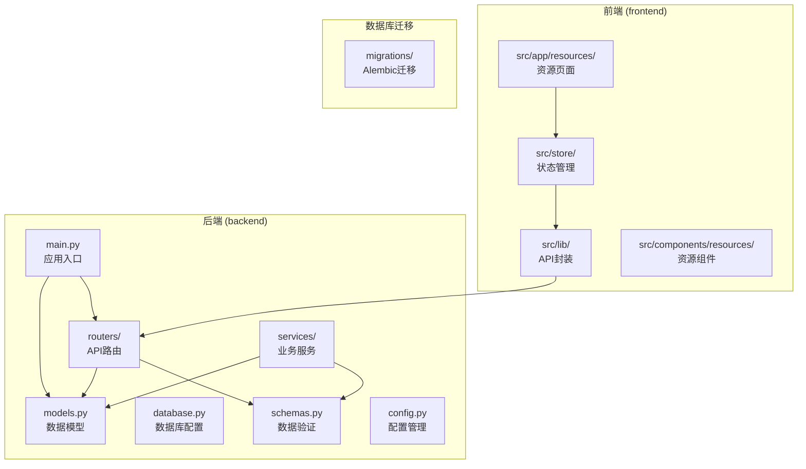
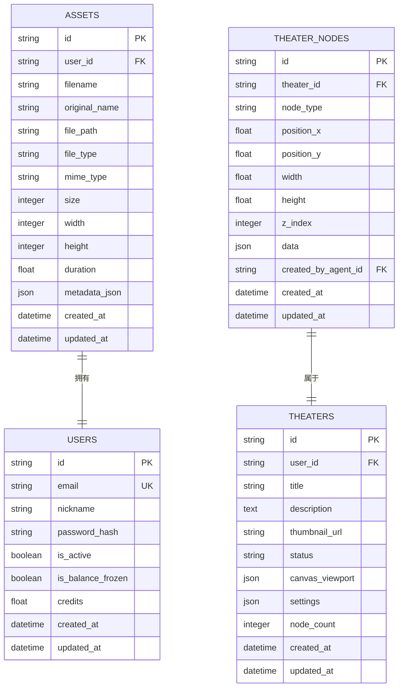
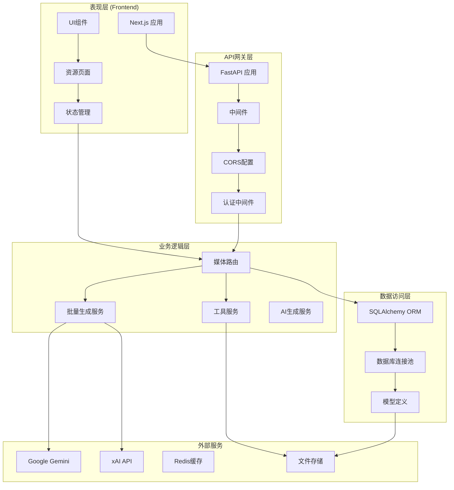
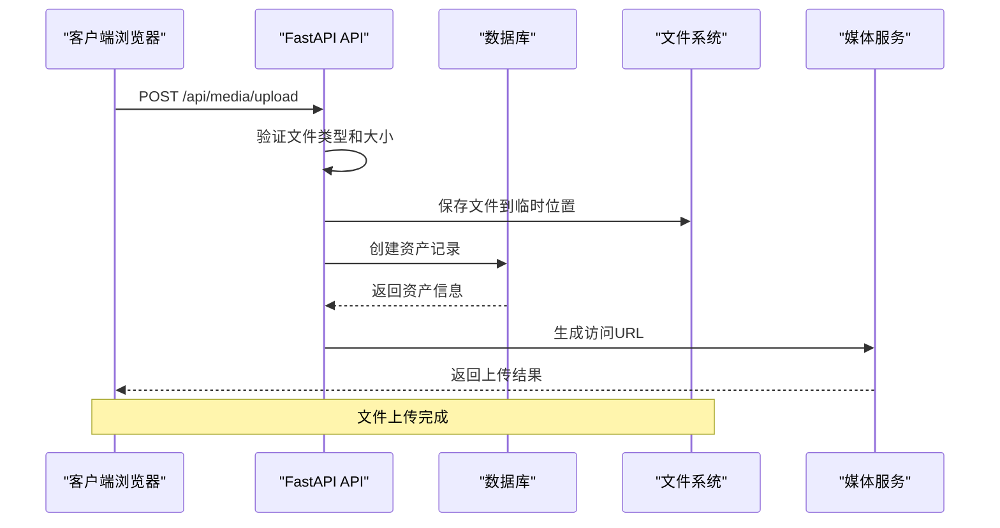
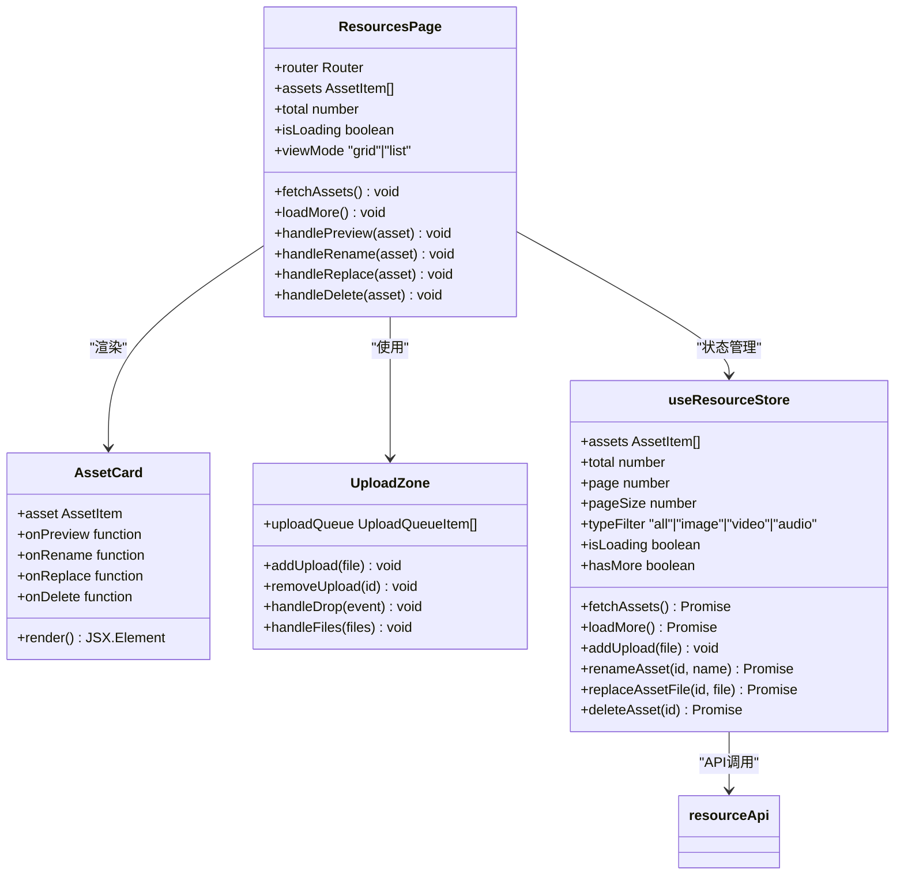
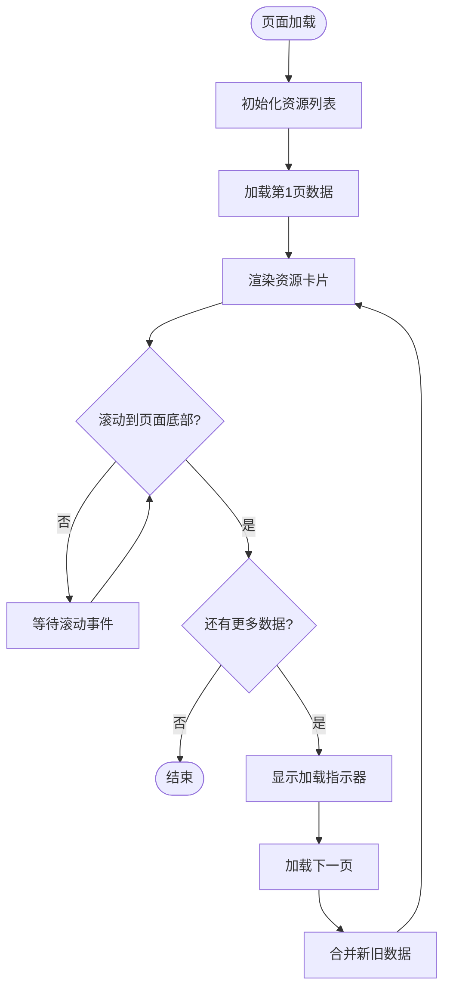
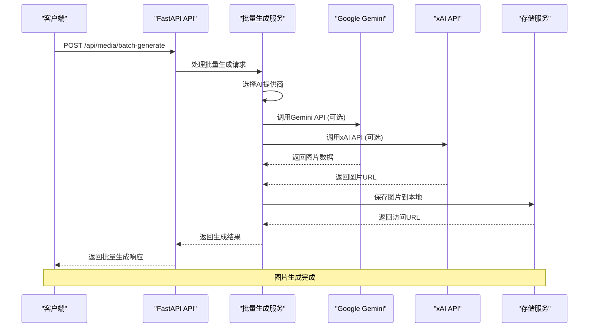
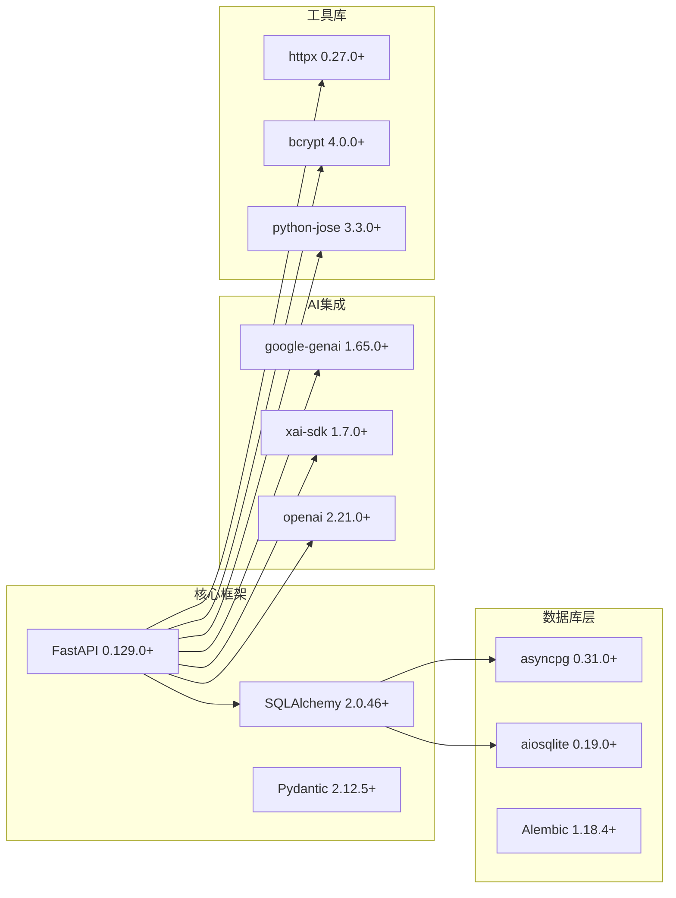
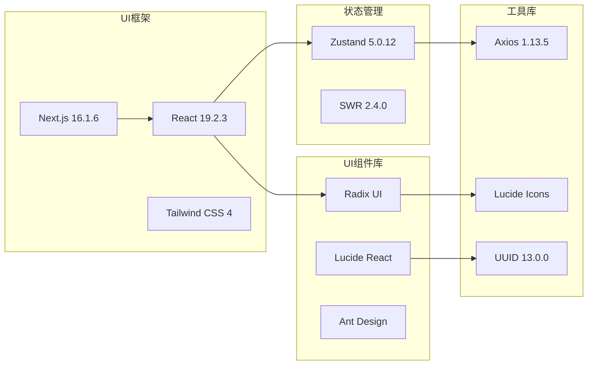

# 资源管理系统

<cite>
**本文档引用的文件**
- [backend/main.py](file://backend/main.py)
- [backend/models.py](file://backend/models.py)
- [backend/database.py](file://backend/database.py)
- [backend/config.py](file://backend/config.py)
- [backend/routers/media.py](file://backend/routers/media.py)
- [backend/schemas.py](file://backend/schemas.py)
- [backend/services/media_utils.py](file://backend/services/media_utils.py)
- [backend/services/batch_image_gen.py](file://backend/services/batch_image_gen.py)
- [backend/services/xai_image_gen.py](file://backend/services/xai_image_gen.py)
- [frontend/src/app/resources/page.tsx](file://frontend/src/app/resources/page.tsx)
- [frontend/src/store/useResourceStore.ts](file://frontend/src/store/useResourceStore.ts)
- [frontend/src/lib/resourceApi.ts](file://frontend/src/lib/resourceApi.ts)
- [frontend/src/components/resources/AssetCard.tsx](file://frontend/src/components/resources/AssetCard.tsx)
- [frontend/src/components/resources/UploadZone.tsx](file://frontend/src/components/resources/UploadZone.tsx)
- [backend/requirements.txt](file://backend/requirements.txt)
- [frontend/package.json](file://frontend/package.json)
- [backend/alembic.ini](file://backend/alembic.ini)
</cite>

## 目录
1. [简介](#简介)
2. [项目结构](#项目结构)
3. [核心组件](#核心组件)
4. [架构概览](#架构概览)
5. [详细组件分析](#详细组件分析)
6. [依赖关系分析](#依赖关系分析)
7. [性能考虑](#性能考虑)
8. [故障排除指南](#故障排除指南)
9. [结论](#结论)

## 简介

资源管理系统是一个基于FastAPI和Next.js构建的现代化资源管理平台，专注于媒体资源的上传、存储、管理和检索。该系统提供了完整的前后端解决方案，支持图片、视频、音频等多种媒体类型的管理，并集成了智能体（Agent）功能来支持AI驱动的资源生成。

系统采用模块化设计，后端使用Python 3.11+和FastAPI框架，前端使用React 19和Next.js 16，数据库采用SQLAlchemy ORM和SQLite/PostgreSQL支持。系统具备完善的权限控制、资源版本管理、批量操作和实时通信功能。

## 项目结构

该项目采用前后端分离的架构设计，主要包含以下核心目录：

**图表来源**
- [backend/main.py:1-174](file://backend/main.py#L1-L174)
- [frontend/src/app/resources/page.tsx:1-189](file://frontend/src/app/resources/page.tsx#L1-L189)

**章节来源**
- [backend/main.py:1-174](file://backend/main.py#L1-L174)
- [frontend/src/app/resources/page.tsx:1-189](file://frontend/src/app/resources/page.tsx#L1-L189)

## 核心组件

### 数据模型层

系统的核心数据模型围绕用户资源管理展开，主要包括以下关键实体：

**图表来源**
- [backend/models.py:131-150](file://backend/models.py#L131-L150)
- [backend/models.py:75-91](file://backend/models.py#L75-L91)

### API路由层

系统提供RESTful API接口，主要路由包括：

- `/api/media/upload` - 媒体文件上传
- `/api/media/assets` - 资源列表查询
- `/api/media/assets/{id}` - 资源更新和删除
- `/api/media/{filename}` - 媒体文件服务

**章节来源**
- [backend/routers/media.py:94-298](file://backend/routers/media.py#L94-L298)
- [backend/models.py:131-150](file://backend/models.py#L131-L150)

## 架构概览

系统采用分层架构设计，确保关注点分离和代码可维护性：

**图表来源**
- [backend/main.py:110-152](file://backend/main.py#L110-L152)
- [backend/routers/media.py:29-298](file://backend/routers/media.py#L29-L298)

## 详细组件分析

### 媒体文件上传系统

媒体文件上传系统是资源管理的核心功能，支持多种文件类型和大小限制：

**图表来源**
- [backend/routers/media.py:94-147](file://backend/routers/media.py#L94-L147)
- [backend/services/media_utils.py:20-28](file://backend/services/media_utils.py#L20-L28)

#### 文件类型支持

系统支持以下文件类型和大小限制：

| 文件类型 | 支持格式 | 大小限制 |
|---------|---------|----------|
| 图片 | PNG, JPG, JPEG, WEBP, GIF | 50MB |
| 视频 | MP4, WEBM, MOV | 500MB |
| 音频 | MP3, WAV, OGG | 100MB |

#### 安全机制

系统实现了多层次的安全保护：

1. **文件名验证**：使用正则表达式确保文件名安全
2. **MIME类型检查**：验证文件的实际类型
3. **大小限制**：防止大文件占用存储空间
4. **权限控制**：确保用户只能访问自己的文件

**章节来源**
- [backend/routers/media.py:31-67](file://backend/routers/media.py#L31-L67)
- [backend/routers/media.py:100-147](file://backend/routers/media.py#L100-L147)

### 资源管理前端界面

前端资源管理界面采用现代化的设计，提供直观的资源管理体验：

**图表来源**
- [frontend/src/app/resources/page.tsx:33-189](file://frontend/src/app/resources/page.tsx#L33-L189)
- [frontend/src/store/useResourceStore.ts:49-169](file://frontend/src/store/useResourceStore.ts#L49-L169)

#### 无限滚动实现

系统实现了高效的无限滚动功能，支持大量资源的流畅浏览：

**图表来源**
- [frontend/src/app/resources/page.tsx:50-60](file://frontend/src/app/resources/page.tsx#L50-L60)
- [frontend/src/store/useResourceStore.ts:75-94](file://frontend/src/store/useResourceStore.ts#L75-L94)

**章节来源**
- [frontend/src/app/resources/page.tsx:33-189](file://frontend/src/app/resources/page.tsx#L33-L189)
- [frontend/src/components/resources/AssetCard.tsx:75-132](file://frontend/src/components/resources/AssetCard.tsx#L75-L132)
- [frontend/src/components/resources/UploadZone.tsx:33-129](file://frontend/src/components/resources/UploadZone.tsx#L33-L129)

### 批量图片生成系统

系统集成了AI驱动的批量图片生成功能，支持多个AI提供商：

**图表来源**
- [backend/routers/media.py:300-435](file://backend/routers/media.py#L300-L435)
- [backend/services/batch_image_gen.py:113-187](file://backend/services/batch_image_gen.py#L113-L187)
- [backend/services/xai_image_gen.py:125-191](file://backend/services/xai_image_gen.py#L125-L191)

#### 并发控制机制

系统实现了智能的并发控制，确保资源利用效率：

| 配置项 | 默认值 | 最小值 | 最大值 | 说明 |
|--------|--------|--------|--------|------|
| 最大并发数 | 4 | 1 | 8 | 控制同时进行的API调用数量 |
| 超时时间 | 120秒 | - | - | 异步HTTP请求超时设置 |
| 连接池大小 | 10 | - | - | 数据库连接池配置 |

**章节来源**
- [backend/services/batch_image_gen.py:113-187](file://backend/services/batch_image_gen.py#L113-L187)
- [backend/services/xai_image_gen.py:125-191](file://backend/services/xai_image_gen.py#L125-L191)

## 依赖关系分析

### 后端技术栈

系统采用现代化的Python技术栈，确保高性能和可维护性：

**图表来源**
- [backend/requirements.txt:1-28](file://backend/requirements.txt#L1-L28)

### 前端技术栈

前端采用React 19和Next.js 16，提供现代化的用户体验：

**图表来源**
- [frontend/package.json:13-94](file://frontend/package.json#L13-L94)

**章节来源**
- [backend/requirements.txt:1-28](file://backend/requirements.txt#L1-28)
- [frontend/package.json:13-94](file://frontend/package.json#L13-L94)

## 性能考虑

### 数据库优化

系统采用了多项数据库优化策略：

1. **连接池配置**：使用SQLAlchemy异步连接池，支持10个基础连接和20个溢出连接
2. **SQLite优化**：启用WAL模式、30秒busy_timeout和NORMAL同步模式
3. **索引策略**：为常用查询字段建立索引，如用户ID、文件类型等
4. **查询优化**：使用分页查询和条件过滤，避免全表扫描

### 缓存策略

系统实现了多层次的缓存机制：

1. **静态资源缓存**：媒体文件使用长期缓存策略（31536000秒）
2. **API响应缓存**：对频繁访问的资源列表使用短期缓存
3. **会话缓存**：使用Redis存储用户会话信息
4. **CDN集成**：支持静态资源CDN加速

### 并发处理

系统采用异步编程模型处理高并发请求：

1. **异步IO**：使用async/await模式处理文件上传和下载
2. **并发限制**：通过信号量控制AI API调用的并发数量
3. **连接复用**：HTTP客户端使用连接池复用TCP连接
4. **内存管理**：及时释放大文件处理过程中的内存

## 故障排除指南

### 常见问题及解决方案

#### 数据库连接问题

**症状**：应用启动时数据库连接失败
**原因**：
- SQLite文件锁定
- PostgreSQL连接配置错误
- Alembic迁移失败

**解决方案**：
1. 检查数据库文件权限
2. 验证DATABASE_URL配置
3. 运行`alembic upgrade head`手动执行迁移
4. 查看数据库日志获取详细错误信息

#### 文件上传失败

**症状**：文件上传过程中出现500错误
**原因**：
- 文件大小超过限制
- MIME类型不支持
- 磁盘空间不足
- 权限问题

**解决方案**：
1. 检查文件类型是否在支持列表中
2. 验证文件大小是否超过限制
3. 确认媒体目录有足够磁盘空间
4. 检查文件系统权限设置

#### AI生成服务异常

**症状**：批量图片生成失败
**原因**：
- API密钥无效
- 网络连接超时
- 并发数过高
- AI提供商限制

**解决方案**：
1. 验证API密钥配置正确
2. 检查网络连接稳定性
3. 降低max_concurrent参数
4. 查看AI提供商的使用限制

**章节来源**
- [backend/main.py:49-108](file://backend/main.py#L49-L108)
- [backend/routers/media.py:116-122](file://backend/routers/media.py#L116-L122)

### 调试工具

系统提供了多种调试工具帮助开发和运维：

1. **日志系统**：使用Python logging模块记录详细的操作日志
2. **CORS调试**：DebugAuthMiddleware中间件记录认证信息
3. **数据库监控**：SQLAlchemy引擎日志显示SQL查询
4. **性能监控**：内置性能指标收集和报告

## 结论

资源管理系统是一个功能完整、架构清晰的现代化应用系统。通过采用前后端分离的设计模式，系统实现了良好的可维护性和扩展性。主要特点包括：

1. **模块化设计**：清晰的分层架构确保了代码的可维护性
2. **异步处理**：充分利用异步IO提升系统性能
3. **安全性保障**：多重安全机制保护用户数据
4. **AI集成**：支持多种AI提供商的图片生成功能
5. **用户体验**：现代化的前端界面提供优秀的用户体验

系统为后续的功能扩展奠定了良好的基础，可以轻松集成更多媒体处理功能和AI服务能力。通过持续的优化和改进，该系统能够满足各种规模的应用需求。