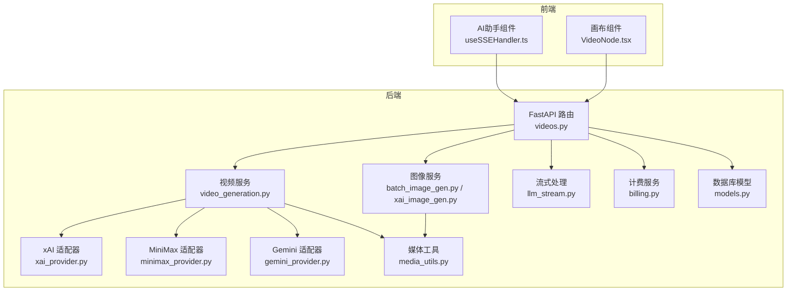
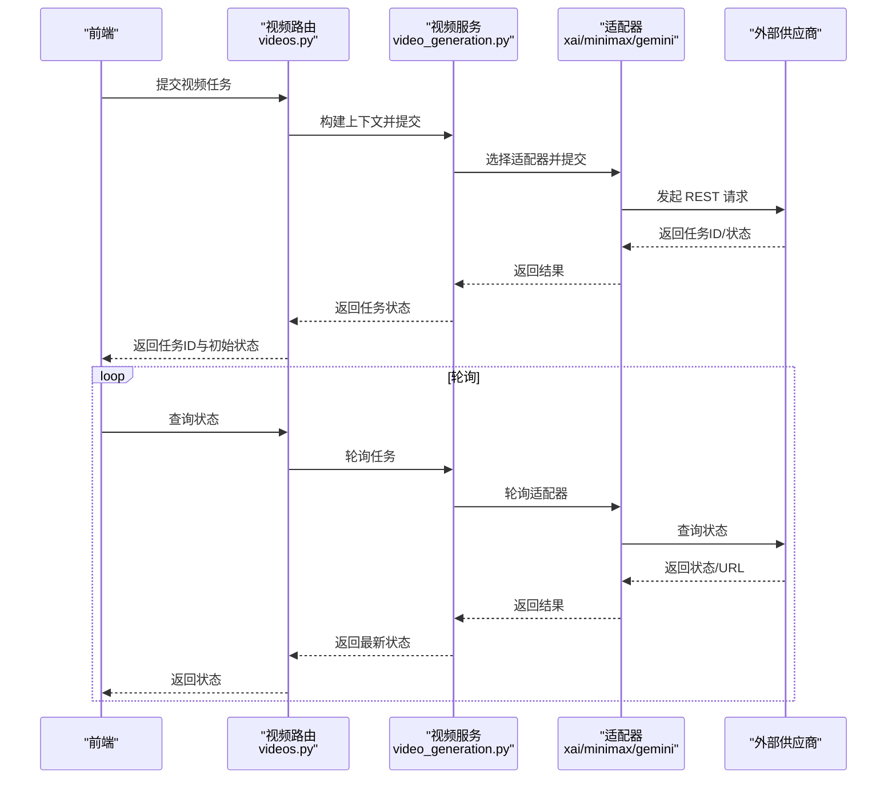
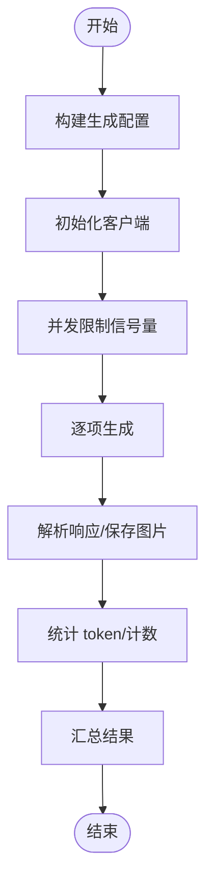
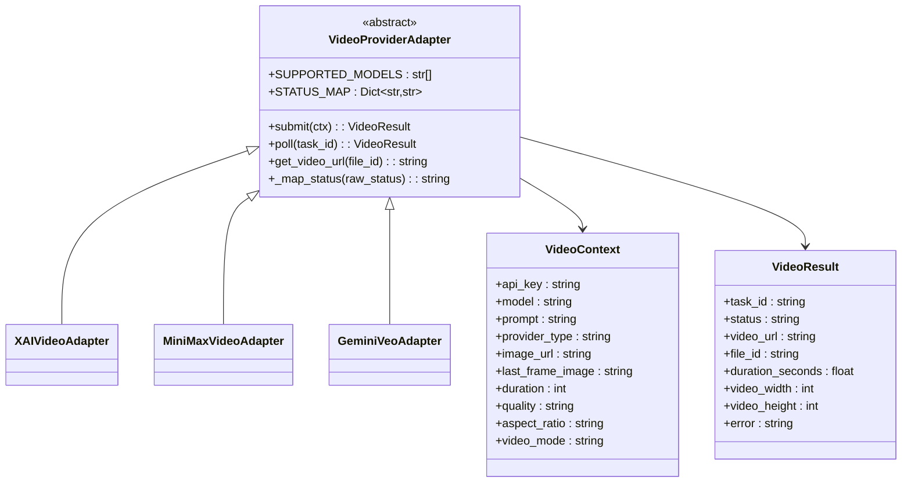
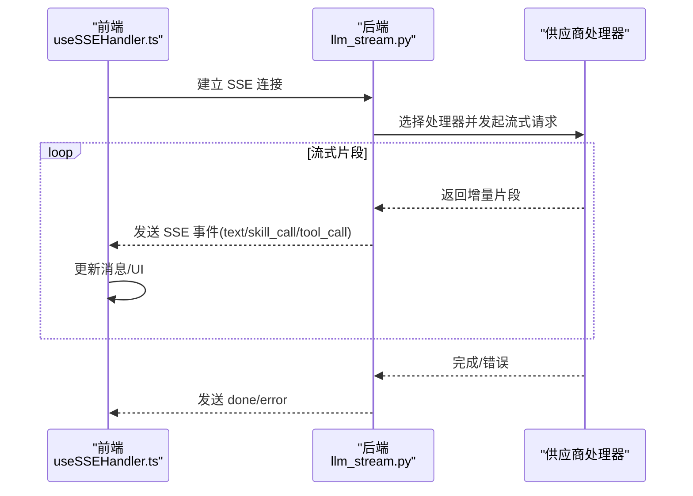
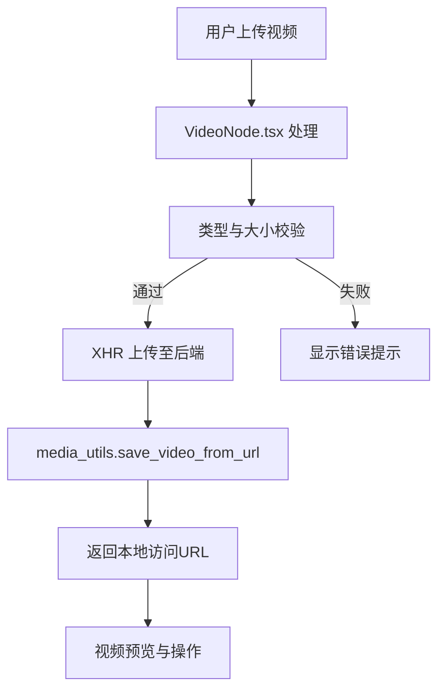
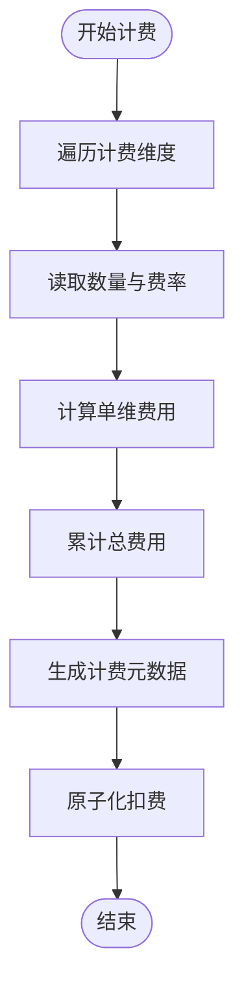
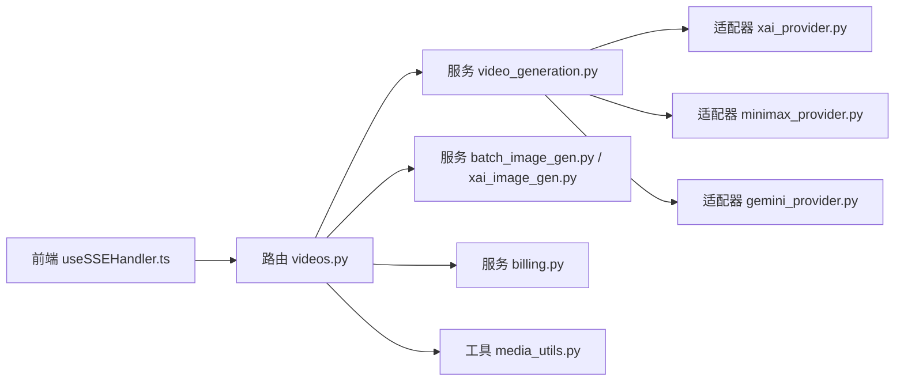

# 媒体生成系统

<cite>
**本文档引用的文件**
- [batch_image_gen.py](file://backend/services/batch_image_gen.py)
- [xai_image_gen.py](file://backend/services/xai_image_gen.py)
- [image_gen_tools.py](file://backend/services/image_gen_tools.py)
- [llm_stream.py](file://backend/services/llm_stream.py)
- [media_utils.py](file://backend/services/media_utils.py)
- [videos.py](file://backend/routers/videos.py)
- [video_generation.py](file://backend/services/video_generation.py)
- [base.py](file://backend/services/video_providers/base.py)
- [xai_provider.py](file://backend/services/video_providers/xai_provider.py)
- [minimax_provider.py](file://backend/services/video_providers/minimax_provider.py)
- [gemini_provider.py](file://backend/services/video_providers/gemini_provider.py)
- [billing.py](file://backend/services/billing.py)
- [useSSEHandler.ts](file://frontend/src/components/ai-assistant/hooks/useSSEHandler.ts)
- [VideoNode.tsx](file://frontend/src/components/canvas/VideoNode.tsx)
- [models.py](file://backend/models.py)
</cite>

## 目录
1. [简介](#简介)
2. [项目结构](#项目结构)
3. [核心组件](#核心组件)
4. [架构总览](#架构总览)
5. [详细组件分析](#详细组件分析)
6. [依赖关系分析](#依赖关系分析)
7. [性能考虑](#性能考虑)
8. [故障排查指南](#故障排查指南)
9. [结论](#结论)
10. [附录](#附录)

## 简介
本系统是一个面向创意内容生产的媒体生成平台，涵盖图像与视频两大媒体类型的生成、批处理、质量控制与成本结算。系统采用多供应商适配器设计，统一接入 xAI、MiniMax、Google Gemini 等视频生成服务；在图像生成方面，支持批量并行生成与多种配置参数；在流式响应方面，提供 SSE 与工具调用的统一处理；在前端，提供视频节点的实时预览与上传体验。系统内置完善的计费与风控机制，确保在高并发与异常情况下仍能稳定运行。

## 项目结构
后端采用分层架构：
- 路由层：FastAPI 路由负责请求接收与鉴权
- 服务层：业务逻辑封装，包括视频生成、图像生成、流式处理、计费等
- 适配器层：视频供应商适配器，屏蔽不同供应商差异
- 工具层：媒体文件保存、图片/视频下载等通用工具
- 模型层：数据库实体定义

前端采用 React Hooks + Zustand 状态管理，结合 SSE 事件驱动的实时更新。

**图表来源**
- [videos.py:1-343](file://backend/routers/videos.py#L1-L343)
- [video_generation.py:1-160](file://backend/services/video_generation.py#L1-L160)
- [xai_provider.py:1-164](file://backend/services/video_providers/xai_provider.py#L1-L164)
- [minimax_provider.py:1-318](file://backend/services/video_providers/minimax_provider.py#L1-L318)
- [gemini_provider.py:1-276](file://backend/services/video_providers/gemini_provider.py#L1-L276)
- [batch_image_gen.py:1-187](file://backend/services/batch_image_gen.py#L1-L187)
- [xai_image_gen.py:1-191](file://backend/services/xai_image_gen.py#L1-L191)
- [llm_stream.py:1-977](file://backend/services/llm_stream.py#L1-L977)
- [billing.py:1-388](file://backend/services/billing.py#L1-L388)
- [media_utils.py:1-79](file://backend/services/media_utils.py#L1-L79)
- [models.py:1-200](file://backend/models.py#L1-L200)

**章节来源**
- [videos.py:1-343](file://backend/routers/videos.py#L1-L343)
- [models.py:146-200](file://backend/models.py#L146-L200)

## 核心组件
- 批量图像生成服务：支持 Gemini 与 xAI 的批量并行生成，具备并发限制、结果汇总与异常处理。
- 视频生成服务：统一入口，自动选择适配器，支持状态轮询、文件下载与计费。
- 流式响应：统一注册表模式，支持多供应商的流式对话、工具调用与图像生成。
- 媒体工具：统一保存图片/视频至本地目录，支持内联数据与远程 URL。
- 计费系统：多维度计费映射表，原子化扣费与退款，支持视频与文本/图像输出计费。
- 前端 SSE 处理：事件解析与 UI 状态同步，支持技能调用、工具调用与多智能体协作。

**章节来源**
- [batch_image_gen.py:113-187](file://backend/services/batch_image_gen.py#L113-L187)
- [xai_image_gen.py:125-191](file://backend/services/xai_image_gen.py#L125-L191)
- [video_generation.py:84-124](file://backend/services/video_generation.py#L84-L124)
- [llm_stream.py:58-68](file://backend/services/llm_stream.py#L58-L68)
- [media_utils.py:20-79](file://backend/services/media_utils.py#L20-L79)
- [billing.py:353-388](file://backend/services/billing.py#L353-L388)
- [useSSEHandler.ts:24-335](file://frontend/src/components/ai-assistant/hooks/useSSEHandler.ts#L24-L335)

## 架构总览
系统采用“路由 → 服务 → 适配器”的分层设计，视频生成通过工厂与注册表模式解耦供应商差异；图像生成通过统一配置与并发控制保证吞吐；流式处理通过注册表与上下文对象实现多供应商一致性；计费通过映射表与原子化事务保障准确性；前端通过 SSE 事件驱动 UI 实时更新。

**图表来源**
- [videos.py:74-147](file://backend/routers/videos.py#L74-L147)
- [video_generation.py:84-124](file://backend/services/video_generation.py#L84-L124)
- [xai_provider.py:47-104](file://backend/services/video_providers/xai_provider.py#L47-L104)
- [minimax_provider.py:90-134](file://backend/services/video_providers/minimax_provider.py#L90-L134)
- [gemini_provider.py:80-125](file://backend/services/video_providers/gemini_provider.py#L80-L125)

## 详细组件分析

### 批量图像生成（Gemini 与 xAI）
- Gemini 批量图像生成：基于 aio 客户端异步生成，支持并发限制、参数映射（宽高比、分辨率）、内联图片保存与 token 统计。
- xAI 批量图像生成：通过 OpenAI SDK images.generate，支持响应格式（b64_json/url）、多张生成与参数透传。

**图表来源**
- [batch_image_gen.py:113-187](file://backend/services/batch_image_gen.py#L113-L187)
- [xai_image_gen.py:125-191](file://backend/services/xai_image_gen.py#L125-L191)

**章节来源**
- [batch_image_gen.py:1-187](file://backend/services/batch_image_gen.py#L1-L187)
- [xai_image_gen.py:1-191](file://backend/services/xai_image_gen.py#L1-L191)

### 视频生成流程（供应商适配器设计）
- 统一入口：根据上下文自动选择适配器，提交任务并返回任务ID。
- 状态跟踪：轮询适配器，映射状态，必要时补充下载 URL。
- 文件管理：完成后下载视频至本地，保存 URL，触发计费与会话消息插入。

**图表来源**
- [base.py:15-114](file://backend/services/video_providers/base.py#L15-L114)
- [xai_provider.py:22-164](file://backend/services/video_providers/xai_provider.py#L22-L164)
- [minimax_provider.py:30-318](file://backend/services/video_providers/minimax_provider.py#L30-L318)
- [gemini_provider.py:31-276](file://backend/services/video_providers/gemini_provider.py#L31-L276)

**章节来源**
- [video_generation.py:1-160](file://backend/services/video_generation.py#L1-L160)
- [base.py:1-114](file://backend/services/video_providers/base.py#L1-L114)
- [xai_provider.py:1-164](file://backend/services/video_providers/xai_provider.py#L1-L164)
- [minimax_provider.py:1-318](file://backend/services/video_providers/minimax_provider.py#L1-L318)
- [gemini_provider.py:1-276](file://backend/services/video_providers/gemini_provider.py#L1-L276)

### 流式响应（SSE 与工具调用）
- 注册表模式：通过装饰器注册不同供应商的流式处理器，避免分支判断。
- 事件驱动：前端使用 SSE 接收 text/skill_call/tool_call 等事件，实时更新 UI。
- 工具调用：收集 delta 中的工具调用，聚合后写入结果对象。

**图表来源**
- [llm_stream.py:58-68](file://backend/services/llm_stream.py#L58-L68)
- [useSSEHandler.ts:24-335](file://frontend/src/components/ai-assistant/hooks/useSSEHandler.ts#L24-L335)

**章节来源**
- [llm_stream.py:1-977](file://backend/services/llm_stream.py#L1-L977)
- [useSSEHandler.ts:1-335](file://frontend/src/components/ai-assistant/hooks/useSSEHandler.ts#L1-L335)

### 实时预览与文件管理
- 前端视频节点：支持本地上传、进度显示、错误提示与自动尺寸调整；通过直连后端上传接口绕过代理限制。
- 媒体工具：统一保存图片/视频至本地目录，支持内联数据与远程 URL 下载，返回统一访问路径。

**图表来源**
- [VideoNode.tsx:107-186](file://frontend/src/components/canvas/VideoNode.tsx#L107-L186)
- [media_utils.py:31-79](file://backend/services/media_utils.py#L31-L79)

**章节来源**
- [VideoNode.tsx:1-534](file://frontend/src/components/canvas/VideoNode.tsx#L1-L534)
- [media_utils.py:1-79](file://backend/services/media_utils.py#L1-L79)

### 成本计算机制
- 文本/图像/搜索/图像生成计费：映射表驱动，兼容模态拆分与向后兼容。
- 视频计费：按输入图片/输入时长与输出质量维度计费，费率来自供应商模型成本配置。
- 原子化扣费：使用条件更新确保并发安全，失败时抛出明确异常。

**图表来源**
- [billing.py:310-351](file://backend/services/billing.py#L310-L351)
- [billing.py:353-388](file://backend/services/billing.py#L353-L388)

**章节来源**
- [billing.py:1-388](file://backend/services/billing.py#L1-L388)
- [videos.py:188-232](file://backend/routers/videos.py#L188-L232)

## 依赖关系分析
- 路由依赖服务层：视频路由依赖视频服务与计费服务，统一处理任务提交、轮询与完成后的文件下载与扣费。
- 服务层依赖适配器层：视频服务通过适配器工厂选择具体供应商，隐藏差异。
- 服务层依赖工具层：统一媒体保存与下载。
- 前端依赖后端 SSE：通过事件驱动更新 UI，支持多智能体协作与工具调用可视化。

**图表来源**
- [videos.py:1-343](file://backend/routers/videos.py#L1-L343)
- [video_generation.py:1-160](file://backend/services/video_generation.py#L1-L160)
- [xai_provider.py:1-164](file://backend/services/video_providers/xai_provider.py#L1-L164)
- [minimax_provider.py:1-318](file://backend/services/video_providers/minimax_provider.py#L1-L318)
- [gemini_provider.py:1-276](file://backend/services/video_providers/gemini_provider.py#L1-L276)
- [batch_image_gen.py:1-187](file://backend/services/batch_image_gen.py#L1-L187)
- [xai_image_gen.py:1-191](file://backend/services/xai_image_gen.py#L1-L191)
- [billing.py:1-388](file://backend/services/billing.py#L1-L388)
- [media_utils.py:1-79](file://backend/services/media_utils.py#L1-L79)
- [useSSEHandler.ts:1-335](file://frontend/src/components/ai-assistant/hooks/useSSEHandler.ts#L1-L335)

**章节来源**
- [videos.py:1-343](file://backend/routers/videos.py#L1-L343)
- [video_generation.py:1-160](file://backend/services/video_generation.py#L1-L160)

## 性能考虑
- 并发限制：图像生成与视频轮询均使用信号量限制并发度，避免资源争用与超卖。
- 缓存与去重：资产表支持内容哈希去重，降低重复存储与带宽消耗。
- 异步 I/O：媒体下载与供应商 API 调用均采用异步，提升吞吐。
- 原子化事务：计费扣费使用条件更新，避免竞态与脏读。
- 前端懒加载：视频节点在加载元数据后再调整尺寸，减少布局抖动。

[本节为通用指导，不直接分析具体文件]

## 故障排查指南
- 视频任务长时间 pending：检查供应商轮询状态与错误信息，关注超时保护逻辑。
- 内容审核拒绝：xAI 与 Gemini 均可能因内容审核拒绝导致失败，查看错误信息。
- 积分不足：计费服务在余额不足时抛出异常，前端 SSE 事件中也会提示。
- 媒体下载失败：确认供应商下载头（如 x-goog-api-key）与网络可达性。
- 前端 SSE 未更新：检查事件类型与数据结构，确保事件解析正确。

**章节来源**
- [videos.py:179-232](file://backend/routers/videos.py#L179-L232)
- [xai_provider.py:139-163](file://backend/services/video_providers/xai_provider.py#L139-L163)
- [gemini_provider.py:212-222](file://backend/services/video_providers/gemini_provider.py#L212-L222)
- [billing.py:258-287](file://backend/services/billing.py#L258-L287)
- [useSSEHandler.ts:318-327](file://frontend/src/components/ai-assistant/hooks/useSSEHandler.ts#L318-L327)

## 结论
该媒体生成系统通过多供应商适配器与统一服务层，实现了图像与视频的高效生成与管理；借助映射表驱动的计费与原子化事务，确保了成本控制的准确性与安全性；前端通过 SSE 事件与节点组件提供了良好的实时预览与交互体验。整体架构清晰、扩展性强，适合在高并发与多变的 AI 服务环境中稳定运行。

[本节为总结，不直接分析具体文件]

## 附录
- 数据模型关键字段：用户积分、供应商模型成本、视频任务状态与计费元数据等。
- 前端事件类型：text、skill_call、tool_call、subtask_created、task_completed、billing、done、error 等。

**章节来源**
- [models.py:35-200](file://backend/models.py#L35-L200)
- [useSSEHandler.ts:66-327](file://frontend/src/components/ai-assistant/hooks/useSSEHandler.ts#L66-L327)